# Hibernate框架基础

## 一  什么是ORM

ORM - Object  Relational  Mapping  对象关系映射 

映射内容：

- 数据库表                  JAVA实体类(数据的载体)
- 表的字段                  实体类中的属性
- 数据库的数据类型    JAVA的数据类型
- 表的一条记录            JAVA的对象
- 表的主外键关系        对象间的关联关系（一对一，一对多，多对一，多对多）

拥有映射关系后就可以通过反射来搭建框架，从而减少dao层重复性的sql语句操作

总结：ORM 是一种自动生成 SQL 语句的技术，它实现了对象和关系型数据库之间的数据交互，提高了开发效率。在实际开发中，常见的增删改查（CRUD）操作都可以交给 ORM，避免了手写 SQL 语句的麻烦。

缺点：

- ORM 增加了大家的学习成本，为了使用 ORM 技术，您至少需要掌握一种 ORM 框架。
- 自送生成 SQL 语句会消耗计算资源，这势必会对程序性能造成一定的影响。
- 对于复杂的数据库操作，ORM 通常难以处理，即使能处理，自动生成的 SQL 语句在性能方面也不如手写的原生 SQL。
- 生成 SQL 语句的过程是自动进行的，不能人工干预，这使得开发人员无法定制一些特殊的 SQL 语句。

## 二  主流的ORM框架

- Hibernate   完整的orm框架，主要映射 应用程序的对象模型，更能体现ORM的思想。
- Mybatis      非完整的orm框架，主要映射 sql语句， mybaits-plus加强工具
- JPA             官方的一套开发持久层框架的标准技术， 类似hibernate

##  三  Hibernater的基础概念

- 持久化     程序的对象在瞬时状态(内存)和持久状态（磁盘）之间的转换的机制。
- 持久化操作   主要指对数据库的增删改查操作
- 持久层     指的是数据访问层（dao层）
- Hibernate与JDBC的关系

​        JDBC是底层的数据库的交互技术，Hibernate封装了JDBC,提高了DAO的开发效率。

## 四  怎么学习Hibernate框架

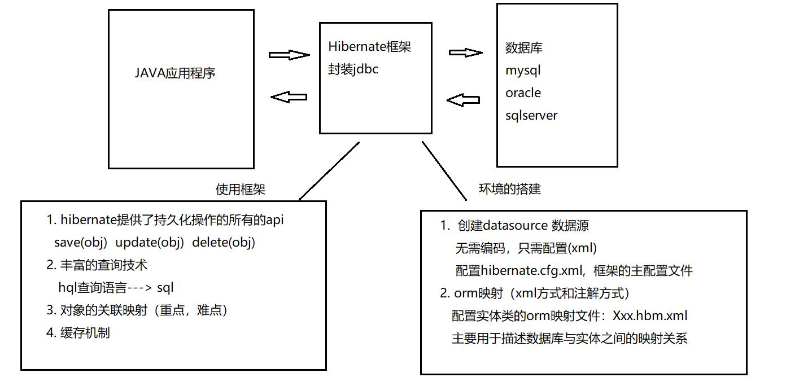

## 五  Hibernate入门程序

### 1.手动配置（开发工具通用，大同小异）：

#### 1.1 添加hibernate的类库 (jar包)，数据库驱动包要对应数据库

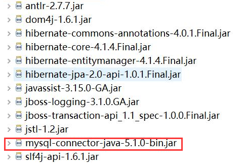

#### 1.2 配置hibernate的全局文件： hibernate.cfg.xml

~~~xml
<?xml version='1.0' encoding='UTF-8'?>
<!DOCTYPE hibernate-configuration PUBLIC
        "-//Hibernate/Hibernate Configuration DTD 3.0//EN"
        "http://www.hibernate.org/dtd/hibernate-configuration-3.0.dtd">
<!-- Generated by MyEclipse Hibernate Tools.                   -->
<hibernate-configuration>

    <session-factory>
        <property name="dialect">
            org.hibernate.dialect.MySQLDialect
        </property>
        <property name="connection.url">
            jdbc:mysql://localhost:3306/hiberdb?characterEncoding=UTF-8&amp;useUnicode=true
        </property>
        <property name="connection.username">root</property>
        <property name="connection.password">root</property>
        <property name="connection.driver_class">
            com.mysql.cj.jdbc.Driver
        </property>
        <property name="myeclipse.connection.profile">myemp</property>
        <property name="show_sql">true</property>
        <property name="format_sql">true</property>

        <mapping resource="pojo/Users.hbm.xml"/>
    </session-factory>

</hibernate-configuration>
~~~

**注意：**

* dialect是指定使用的数据库，不同数据库的SQL语句不一样，所以需要指定，相当于“方言”
* url中的&符号需要用  &amp ;  代替。复制粘贴到idea时 &amp ;   可能会识别成一个灰色的 &
* password没有的就少一个字段
* show_sql开启则运行时会在控制台显示生成的sql
* mapping是orm映射文件,读取实体类与数据库的映射关系

#### 1.3 orm映射

   User实体类 ， 必须实现序列化接口

~~~java
package pojo;

/**
 * Users entity. @author MyEclipse Persistence Tools
 */
public class Users implements java.io.Serializable {  //序列化

	// Fields

	private Integer id;
	private String name;
	private String password;
	private String telephone;
	private String username;
	private String isadmin;

	// Constructors

	/** default constructor */
	public Users() {
	}

	/** minimal constructor */
    //只给不能为空的字段赋值
	public Users(String name, String password) {
		this.name = name;
		this.password = password;
	}

	/** full constructor */
	public Users(String name, String password, String telephone,
			String username, String isadmin) {
		this.name = name;
		this.password = password;
		this.telephone = telephone;
		this.username = username;
		this.isadmin = isadmin;
	}

	// Property accessors

	public Integer getId() {
		return this.id;
	}

	public void setId(Integer id) {
		this.id = id;
	}

	public String getName() {
		return this.name;
	}

	public void setName(String name) {
		this.name = name;
	}

	public String getPassword() {
		return this.password;
	}

	public void setPassword(String password) {
		this.password = password;
	}

	public String getTelephone() {
		return this.telephone;
	}

	public void setTelephone(String telephone) {
		this.telephone = telephone;
	}

	public String getUsername() {
		return this.username;
	}

	public void setUsername(String username) {
		this.username = username;
	}

	public String getIsadmin() {
		return this.isadmin;
	}

	public void setIsadmin(String isadmin) {
		this.isadmin = isadmin;
	}

}
~~~

  orm的xml描述

~~~xml
<?xml version="1.0" encoding="utf-8"?>
<!DOCTYPE hibernate-mapping PUBLIC "-//Hibernate/Hibernate Mapping DTD 3.0//EN"
        "http://hibernate.sourceforge.net/hibernate-mapping-3.0.dtd">
<!-- 
    Mapping file autogenerated by MyEclipse Persistence Tools
-->
<hibernate-mapping>
    <class name="pojo.Users" table="USERS">
        <id name="id" type="java.lang.Integer">
            <column name="ID" precision="4" scale="0"/>
            <!--主键生成器（策略）     identity表示自增-->
            <generator class="identity">
            </generator>
        </id>
        <property name="name" type="java.lang.String">
            <column name="NAME" not-null="true"/>
        </property>
        <property name="password" type="java.lang.String">
            <column name="PASSWORD" not-null="true"/>
        </property>
        <property name="telephone" type="java.lang.String">
            <column name="TELEPHONE"/>
        </property>
        <property name="username" type="java.lang.String">
            <column name="USERNAME"/>
        </property>
        <property name="isadmin" type="java.lang.String">
            <column name="ISADMIN"/>
        </property>
    </class>
</hibernate-mapping>

~~~

**注意：**

* 全限定类名要改，表名要改，其他就是实体类与数据库之间的映射关系

* 主键生成策略有多种，increment也是自增，identity是**数据库**完成自增，increment是**程序**查询出主键最大值，然后+1
*  主键生成策略：
  - identity(建议)    表示 自增     mysql或sqlserver   由底层数据库实现主键自增
  - increment         主键自增   由hibernate框架实现程序主键自增，例如：select max(id)+1
  - assigned          一般用于主键是字符串，由程序提供主键的生成算法
  - sequence         序列生成主键，oracle常用
  - uuid                 全球唯一标识码 ， 32位长度的字符串，在分布式系统较常用

#### 1.4 使用

这里只演示增，增删改查后面还会演示

~~~java
public class Test1 {

	@Test
	public void testAdd() {

		//初始化
		//读取Hibernate的配置
		Configuration config = new Configuration().configure();
		ServiceRegistry serviceRegistry = new ServiceRegistryBuilder().applySettings(config.getProperties())
				.buildServiceRegistry();
		//创建会话工厂
		SessionFactory factory = config.buildSessionFactory(serviceRegistry);

		//创建Session    相当于connection
		Session session = factory.openSession();

		//进行数据库操作
		//在Hibernate中增删改要开启事务
		Transaction tx = session.beginTransaction();

		Users user = new Users("马六", "1d1s");
		session.save(user);

		//提交事务
		tx.commit();
		session.close();

	}
}
~~~

### 2.使用逆向工程生成实体类和orm映射文件

#### idea：

1. 在项目结构中给需要用到hibernate的添加框架支持，这个操作和右键项目，点击添加框架的支持是一样的，这里没有hibernate需要在插件中添加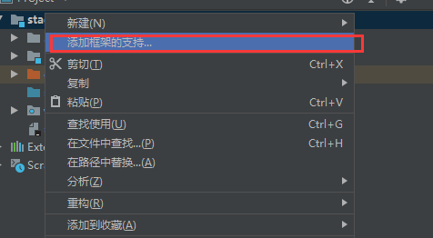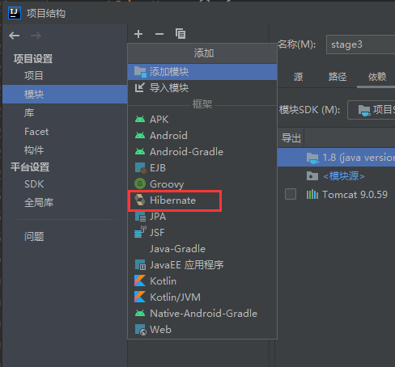
2. 然后添加主配置文件，这个主配置文件是不完整的（不知道哪里可以调模板)，还是用上面的模板。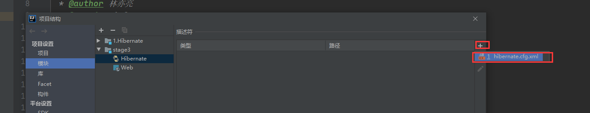

3. 连接数据库

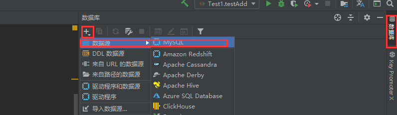

这里添加需要的驱动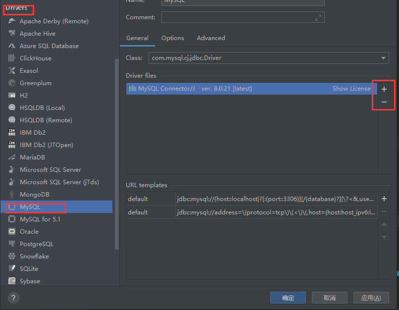

也可以不用管，他会识别需要的驱动程序，可以点下载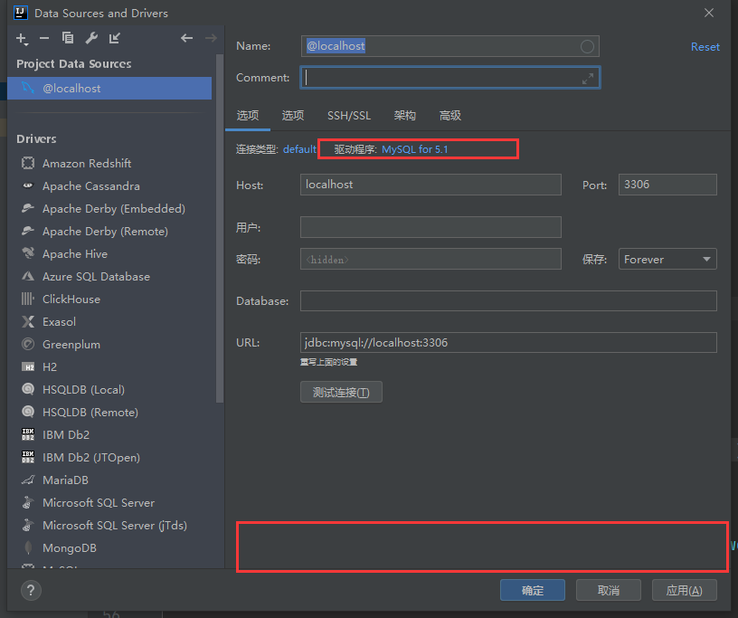

输入连接信息后测试连接，成功后就可以看到数据库了

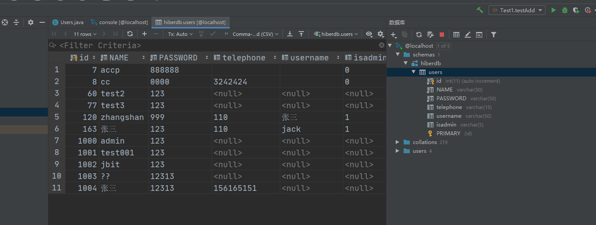

4. 使用持久化映射工具生成实体类和对应的映射文件

   

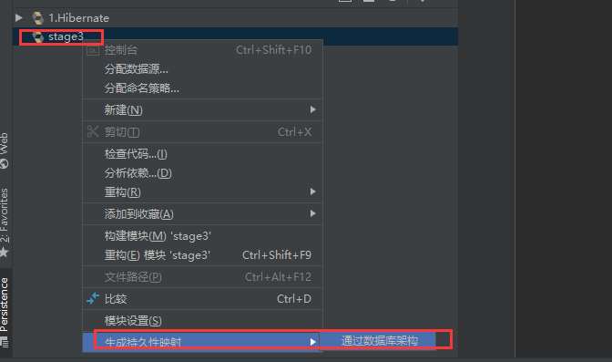

选择要映射的表，映射的类型和字段名类名都是可以手动修改的

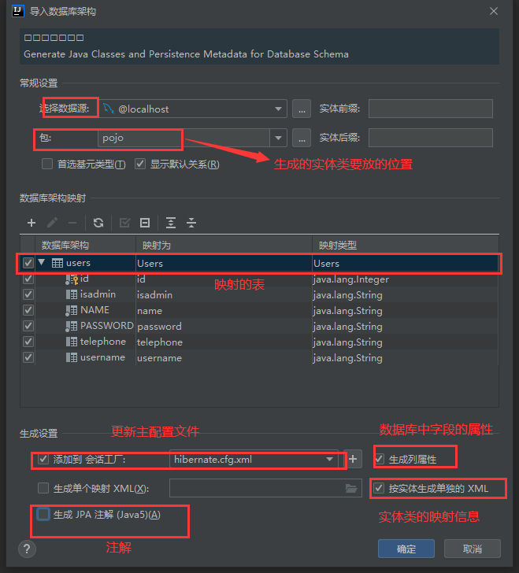

这样就将主配置文件，实体类和对应的映射文件配置好了

但是这样生成的配置文件是不全的，像自增的id字段要自己在映射文件重新配置，不晓得有没有其他方法。否则在进行插入时，对象的id字段必须要有值才能执行成功，其他操作则可以正常使用。而使用MyEclipse不会，而且MyEclipse用逆向工程还可以生成一个工具类，封装好了初始化的操作，直接获取session对象使用。MyEclipse对hibernate的支持确实更好，可以在MyEclipse生成好导入到idea中使用。下面来看MyEclipse的操作

#### MyEclipse：

1. new一个web工程

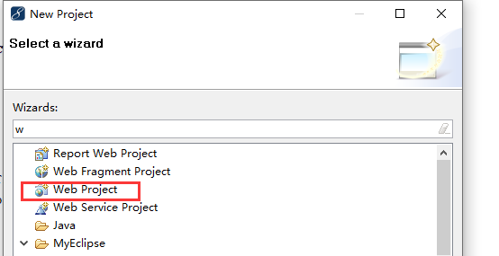

2. 一样是先连接数据库

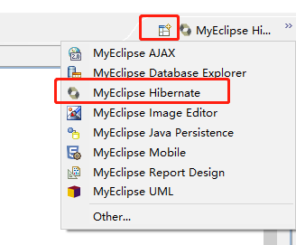

在这里新建一个连接到数据库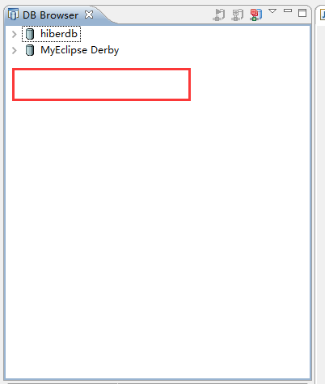

设置连接数据库的配置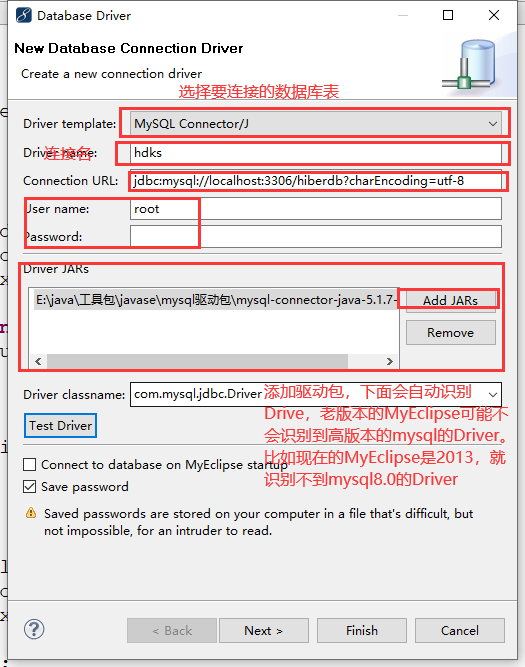

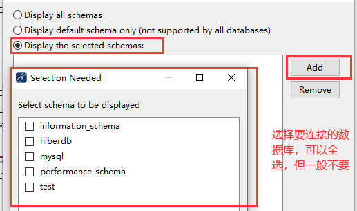

之后就完成连接了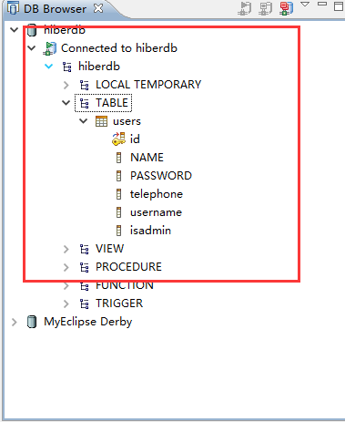

3. 和idea一样，也是对模块（工程）添加框架的支持

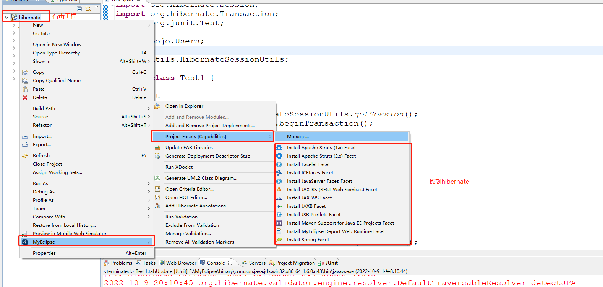

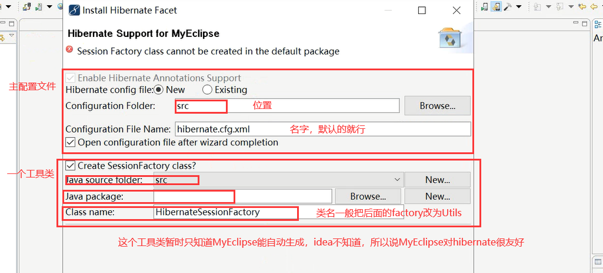

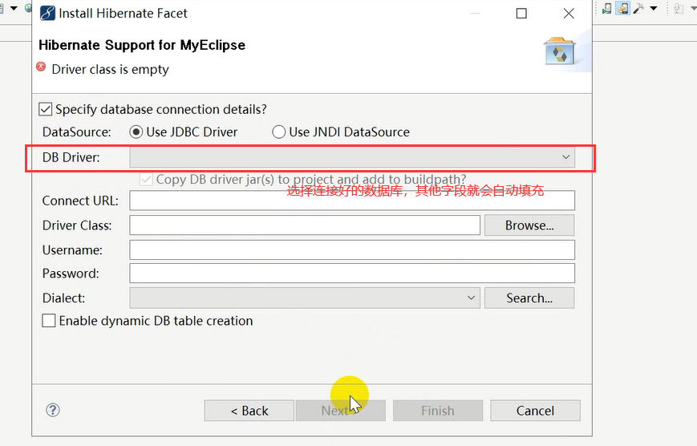

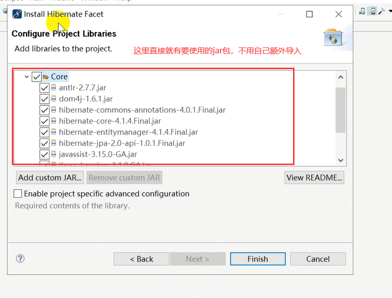

创建完成，src下面就会有一个工具类和一个主配置文件

这个主配置文件仅仅需要在url后加上那个编码的问题就行，高版本的mysql可能还需加解决时区问题。前面设置url时直接设置应该也行，没试

而向show_sql这些配置都是要自己添加

生成的工具类：

~~~java
package utils;

import org.hibernate.HibernateException;
import org.hibernate.Session;
import org.hibernate.cfg.Configuration;
import org.hibernate.service.ServiceRegistry;
import org.hibernate.service.ServiceRegistryBuilder;

/**
 * Configures and provides access to Hibernate sessions, tied to the
 * current thread of execution.  Follows the Thread Local Session
 * pattern, see {@link http://hibernate.org/42.html }.
 */
public class HibernateSessionUtils {

    /** 
     * Location of hibernate.cfg.xml file.
     * Location should be on the classpath as Hibernate uses  
     * #resourceAsStream style lookup for its configuration file. 
     * The default classpath location of the hibernate config file is 
     * in the default package. Use #setConfigFile() to update 
     * the location of the configuration file for the current session.   
     */
	private static final ThreadLocal<Session> threadLocal = new ThreadLocal<Session>();
    private static org.hibernate.SessionFactory sessionFactory;
	
    private static Configuration configuration = new Configuration();
    private static ServiceRegistry serviceRegistry; 

	static {
    	try {
			configuration.configure();
			serviceRegistry = new ServiceRegistryBuilder().applySettings(configuration.getProperties()).buildServiceRegistry();
			sessionFactory = configuration.buildSessionFactory(serviceRegistry);
		} catch (Exception e) {
			System.err.println("%%%% Error Creating SessionFactory %%%%");
			e.printStackTrace();
		}
    }
    private HibernateSessionUtils() {
    }
	
	/**
     * Returns the ThreadLocal Session instance.  Lazy initialize
     * the <code>SessionFactory</code> if needed.
     *
     *  @return Session
     *  @throws HibernateException
     */
    public static Session getSession() throws HibernateException {
        Session session = (Session) threadLocal.get();

		if (session == null || !session.isOpen()) {
			if (sessionFactory == null) {
				rebuildSessionFactory();
			}
			session = (sessionFactory != null) ? sessionFactory.openSession()
					: null;
			threadLocal.set(session);
		}

        return session;
    }

	/**
     *  Rebuild hibernate session factory
     *
     */
	public static void rebuildSessionFactory() {
		try {
			configuration.configure();
			serviceRegistry = new ServiceRegistryBuilder().applySettings(configuration.getProperties()).buildServiceRegistry();
			sessionFactory = configuration.buildSessionFactory(serviceRegistry);
		} catch (Exception e) {
			System.err.println("%%%% Error Creating SessionFactory %%%%");
			e.printStackTrace();
		}
	}

	/**
     *  Close the single hibernate session instance.
     *
     *  @throws HibernateException
     */
    public static void closeSession() throws HibernateException {
        Session session = (Session) threadLocal.get();
        threadLocal.set(null);

        if (session != null) {
            session.close();
        }
    }

	/**
     *  return session factory
     *
     */
	public static org.hibernate.SessionFactory getSessionFactory() {
		return sessionFactory;
	}
	/**
     *  return hibernate configuration
     *
     */
	public static Configuration getConfiguration() {
		return configuration;
	}

}
~~~

4. 创建好用来存放实体类的包

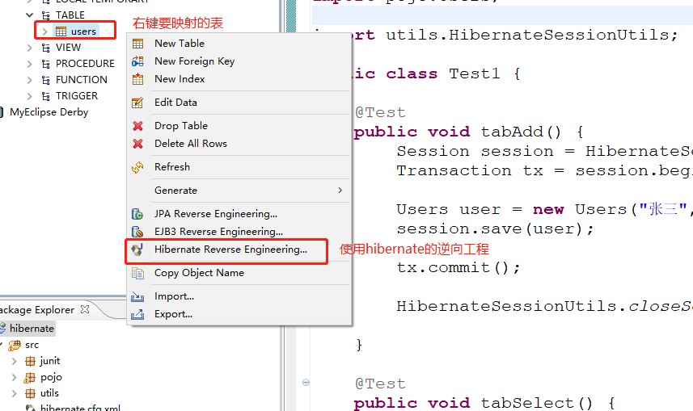

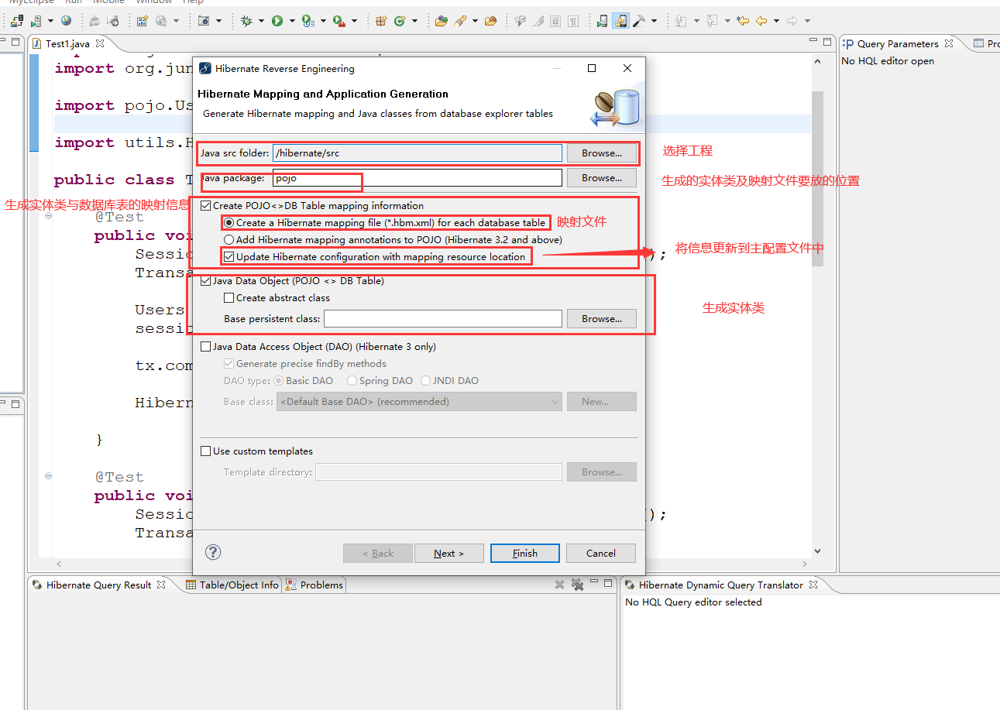

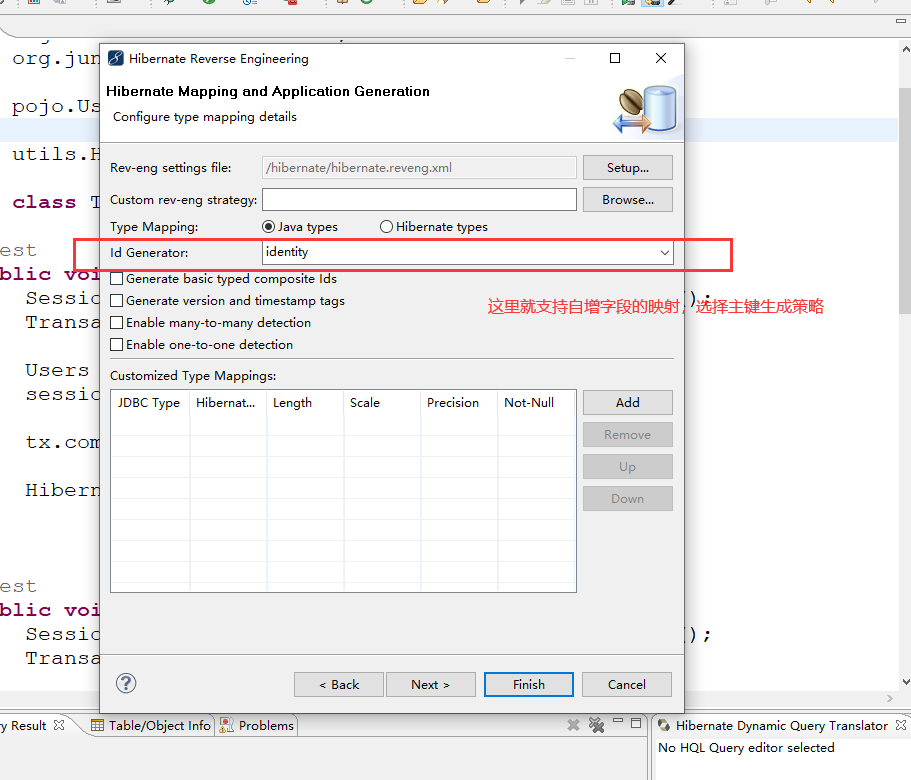

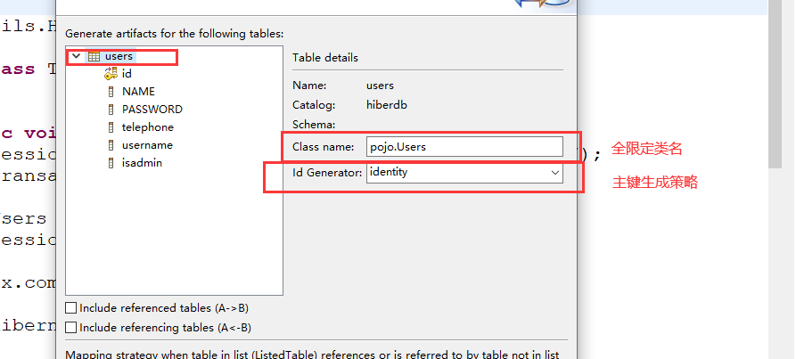

到这里就已经生成完了所有的文件，可以使用了

**使用案例：**

~~~java
package junit;

import org.hibernate.Session;
import org.hibernate.Transaction;
import org.junit.Test;

import pojo.Users;

import utils.HibernateSessionUtils;

public class Test1 {

	// 增
	@Test
	public void tabAdd() {
		// 使用工具类，直接获取session对象使用
		Session session = HibernateSessionUtils.getSession();
		// 增删改要开启事务
		Transaction tx = session.beginTransaction();

		Users user = new Users("张三", "12313");
		session.save(user);

		// 提交事务
		tx.commit();

		// 使用工具类的方法关闭session
		HibernateSessionUtils.closeSession();

	}

	// 查
	@Test
	public void tabSelect() {
		Session session = HibernateSessionUtils.getSession();
		Transaction tx = session.beginTransaction();

		// 这里使用唯一主键id来查询
		int id = 1004;
		// get方法的两个参数，第一个是类的class对象，第二个是Serializable,因为像Integer（基本数据类型会自动拆装箱）的父类Number，String都实现了Serializable接口，而主键一般也是这些类型
		Users user = (Users) session.get(Users.class, id);
		System.out.println(user);
		// Users user = (Users) session.load(Users.class, id);
		// System.out.println(user);
		// get和load方法是一样的，区别在于load是只用在使用到获取的数据时，它才真正的去查询，相当于“懒汉”，get方法则是立即执行的，相当于“饿汉”
		// 可以通过是否输出user来验证
		// get：无论是否输出user，都会生成sql语句
		// load：只有输出user时，才有sql语句

		tx.commit();

		HibernateSessionUtils.closeSession();

	}

	// 删
	@Test
	public void tabDelete() {
		Session session = HibernateSessionUtils.getSession();
		Transaction tx = session.beginTransaction();

		// 需要先查询出来再删除
		int id = 1005;
		session.delete(session.get(Users.class, id));

		tx.commit();

		HibernateSessionUtils.closeSession();

	}

	// 改
	@Test
	public void tabUpdate() {
		Session session = HibernateSessionUtils.getSession();
		Transaction tx = session.beginTransaction();

		// 同样也是需要先查出对象，修改字段值后才修改
		int id = 1004;
		Users user = (Users) session.get(Users.class, id);
		user.setTelephone("156165151");
		session.update(user);

		tx.commit();

		HibernateSessionUtils.closeSession();

	}
}

~~~

hibernate的get和load方法， 用于根据主键查询唯一对象。(了解)

- get方法是即时加载数据，而load方法是延时加载数据
- 如果找不到数据，get返回null，load方法抛OjectNotFoundException

## hibernate的对象的状态转换（了解）：

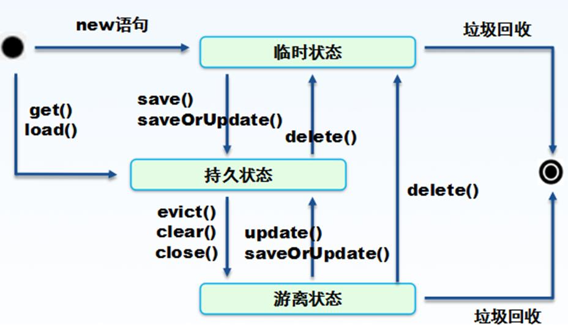

说明：

- 临时状态：当使用new实例化出来的对象，该对象还没在hibernate的容器中管理。
- 持久状态：该对象是由hibernate容器管理的，对象与数据库的数据是一一对应的关系。也称为“托管状态”。这个一一对应其实就是说，java中的对象和数据库中的记录对应起来了，如果对象的字段发生改变，一一对应的关系就变了，造成脏读，hibernate容器会自动修改数据库的字段，保证一致。所以也称这种状态为“托管状态”
- 游离状态：持久状态的对象脱离容器的管理，也称“脱管状态”

# Hibernate的关联映射

## 一  关联映射的内容和作用

数据库中的字段有主外键关联的，在对象中如何体现？

- 对象间的关联关系的体现：一对一、一对多、多对多
- ORM怎么描述对象之间的关系（重点）
- 作用：hibernate是一个完整的ORM的框架，对象与对象之间是有关系的，自动根据关联关系做相应的持久化的操作。以面向对象的思想操作关系型数据库。

## 二  双向一对多（最常见）

数据库参考：

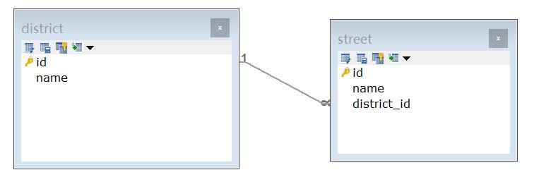

对象的关系：

- 一方：  区域    District
- 多方：  街道    Street

(1) 实体类

(2) ORM映射

选中两个表，使用逆向工程生成实体类和orm映射，步骤与前面的一致

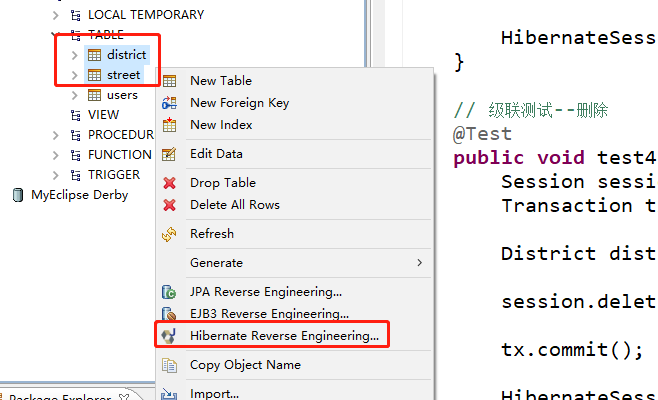

可以从生成好的映射文件中看出是如何利用面向对象的思想映射数据库的

orm映射文件：

District:

~~~xml
<?xml version="1.0" encoding="utf-8"?>
<!DOCTYPE hibernate-mapping PUBLIC "-//Hibernate/Hibernate Mapping DTD 3.0//EN"
"http://www.hibernate.org/dtd/hibernate-mapping-3.0.dtd">
<!-- Mapping file autogenerated by MyEclipse Persistence Tools -->
<hibernate-mapping>
	<class name="pojo.District" table="district" catalog="hiberdb">
		<id name="id" type="java.lang.Integer">
			<column name="id" />
			<generator class="identity"></generator>
		</id>
		<property name="name" type="java.lang.String">
			<column name="name" length="50" not-null="true" />
		</property>
		<set name="streets" inverse="true" cascade="all">
			<key>
				<column name="district_id" not-null="true" />
			</key>
			<one-to-many class="pojo.Street" />
		</set>
	</class>
</hibernate-mapping>

~~~

Street:

~~~xml
<?xml version="1.0" encoding="utf-8"?>
<!DOCTYPE hibernate-mapping PUBLIC "-//Hibernate/Hibernate Mapping DTD 3.0//EN"
"http://www.hibernate.org/dtd/hibernate-mapping-3.0.dtd">
<!-- 
    Mapping file autogenerated by MyEclipse Persistence Tools
-->
<hibernate-mapping>
    <class name="pojo.Street" table="street" catalog="hiberdb">
        <id name="id" type="java.lang.Integer">
            <column name="id" />
            <generator class="identity"></generator>
        </id>
        <many-to-one name="district" class="pojo.District" fetch="select">
            <column name="district_id" not-null="true" />
        </many-to-one>
        <property name="name" type="java.lang.String">
            <column name="name" length="50" not-null="true" />
        </property>
    </class>
</hibernate-mapping>

~~~

实体类：

District:

~~~java
package pojo;

import java.util.HashSet;
import java.util.Set;

/**
 * District entity. @author MyEclipse Persistence Tools
 */

public class District implements java.io.Serializable {

	// Fields

	private Integer id;
	private String name;
	private Set streets = new HashSet(0);

	// Constructors

	/** default constructor */
	public District() {
	}

	/** minimal constructor */
	public District(String name) {
		this.name = name;
	}

	/** full constructor */
	public District(String name, Set streets) {
		this.name = name;
		this.streets = streets;
	}

	// Property accessors

	public Integer getId() {
		return this.id;
	}

	public void setId(Integer id) {
		this.id = id;
	}

	public String getName() {
		return this.name;
	}

	public void setName(String name) {
		this.name = name;
	}

	public Set getStreets() {
		return this.streets;
	}

	public void setStreets(Set streets) {
		this.streets = streets;
	}

}
~~~

Street:

~~~java
package pojo;

/**
 * Street entity. @author MyEclipse Persistence Tools
 */

public class Street implements java.io.Serializable {

	// Fields

	private Integer id;
	private District district;
	private String name;

	// Constructors

	/** default constructor */
	public Street() {
	}

	/** full constructor */
	public Street(District district, String name) {
		this.district = district;
		this.name = name;
	}

	// Property accessors

	public Integer getId() {
		return this.id;
	}

	public void setId(Integer id) {
		this.id = id;
	}

	public District getDistrict() {
		return this.district;
	}

	public void setDistrict(District district) {
		this.district = district;
	}

	public String getName() {
		return this.name;
	}

	public void setName(String name) {
		this.name = name;
	}

}
~~~

(3) 持久化操作（单元测试）

~~~java
package junit;

import java.util.Set;

import org.hibernate.Session;
import org.hibernate.Transaction;
import org.junit.Test;

import pojo.District;
import pojo.Street;

import utils.HibernateSessionUtils;

public class Test2 {
	// 查询指定区域之下的所有的街道的信息
	@Test
	public void test1() {
		Session session = HibernateSessionUtils.getSession();
		int id = 1004;
		District district = (District) session.get(District.class, id);
		Set<Street> streets = district.getStreets();

		for (Street street : streets) {
			System.out.println(street.getName());
		}
	}

	// 查询指定的街道，以及街道所属的区域
	@Test
	public void test2() {
		Session session = HibernateSessionUtils.getSession();
		int id = 1003;
		Street street = (Street) session.get(Street.class, id);
		District district = street.getDistrict();

		System.out.println(district.getName());
	}

	// 新增一个区域，给该区域分配两条新的街道
	@Test
	public void test3() {
		Session session = HibernateSessionUtils.getSession();
		Transaction tx = session.beginTransaction();

		// 新建区域
		District district = new District("k4区");
		Set<Street> streets = district.getStreets();

		// 新建街道
		Street s1 = new Street();
		s1.setName("k4区街道1");
		Street s2 = new Street();
		s2.setName("k4区街道2");

		// 先设置对象间的关系
		streets.add(s1);
		streets.add(s2);
		s1.setDistrict(district);
		s2.setDistrict(district);

		// 保存
		session.save(district);
		session.save(s1);
		session.save(s2);

		tx.commit();

		HibernateSessionUtils.closeSession();
	}

	// 级联测试--删除
	@Test
	public void test4() {
		Session session = HibernateSessionUtils.getSession();
		Transaction tx = session.beginTransaction();

		District district = (District) session.get(District.class, 1010);

		session.delete(district);

		tx.commit();

		HibernateSessionUtils.closeSession();
	}

	// 级联测试--添加
	@Test
	public void test5() {
		Session session = HibernateSessionUtils.getSession();
		Transaction tx = session.beginTransaction();

		// 新建区域
		District district = new District("k4区");
		Set<Street> streets = district.getStreets();

		// 新建街道
		Street s1 = new Street();
		s1.setName("k4区街道1");
		Street s2 = new Street();
		s2.setName("k4区街道2");

		// 先设置对象间的关系
		streets.add(s1);
		streets.add(s2);
		s1.setDistrict(district);
		s2.setDistrict(district);

		// 保存
		session.save(district);
	// 设置级联后可以只保存一方
		// session.save(s1);
		// session.save(s2);

		tx.commit();

		HibernateSessionUtils.closeSession();
	}
}

~~~

要注意的几点：

* 外键列默认是由一方维护的，这时执行数据的添加时，就会多出update语句来维护多方的外键。为了避免额外使用update语句而损耗性能，在一方的映射文件中使用反转，将外键维护交给一方的对方，即多方

~~~xml
 <set name="streets" inverse="true">
~~~

说明：

inverse=false   默认    表示 关联维护方是当前方，即一方。会出现update语句。

inverse=true   反转的意思，由当前方的对方（多方）来维护外键列，减少update语句，改善性能。

* 级联操作

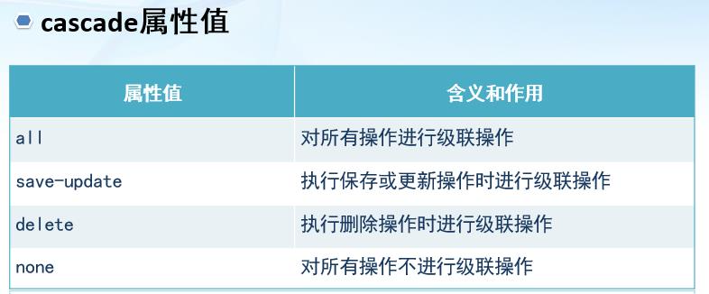

同样是在一方中设置

~~~xml
<set name="streets" inverse="true" cascade="all">
~~~

级联测试添加和删除在上面

## 三  多对多（较常见）

日常例子：

- 课程与学生
- 在权限管理系统中，用户与角色 、角色与权限 
- 在软件公司里，程序员与项目

数据库设计：

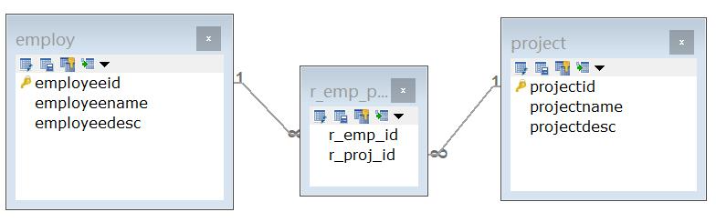

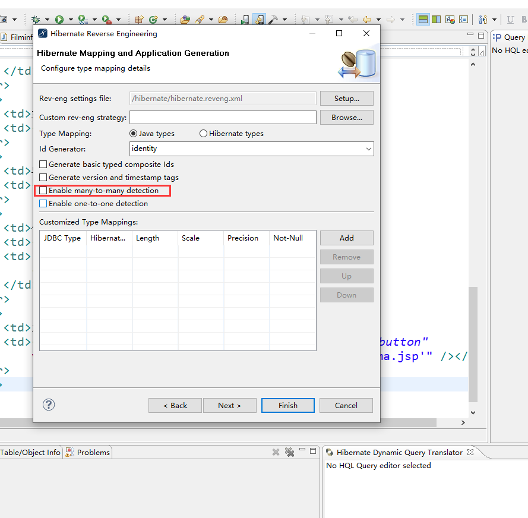

勾选多对多，其余不变

（1）实体类

   Employ类

~~~java
package pojo;

import java.util.HashSet;
import java.util.Set;

/**
 * Employ entity. @author MyEclipse Persistence Tools
 */

public class Employ implements java.io.Serializable {

	// Fields

	private Integer employeeid;
	private String employeename;
	private String employeedesc;
	private Set projects = new HashSet(0);

	// Constructors

	/** default constructor */
	public Employ() {
	}

	/** minimal constructor */
	public Employ(String employeename) {
		this.employeename = employeename;
	}

	/** full constructor */
	public Employ(String employeename, String employeedesc, Set projects) {
		this.employeename = employeename;
		this.employeedesc = employeedesc;
		this.projects = projects;
	}

	// Property accessors

	public Integer getEmployeeid() {
		return this.employeeid;
	}

	public void setEmployeeid(Integer employeeid) {
		this.employeeid = employeeid;
	}

	public String getEmployeename() {
		return this.employeename;
	}

	public void setEmployeename(String employeename) {
		this.employeename = employeename;
	}

	public String getEmployeedesc() {
		return this.employeedesc;
	}

	public void setEmployeedesc(String employeedesc) {
		this.employeedesc = employeedesc;
	}

	public Set getProjects() {
		return this.projects;
	}

	public void setProjects(Set projects) {
		this.projects = projects;
	}

}
~~~

​    

  Project类

~~~java
package pojo;

import java.util.HashSet;
import java.util.Set;

/**
 * Project entity. @author MyEclipse Persistence Tools
 */

public class Project implements java.io.Serializable {

	// Fields

	private Integer projectid;
	private String projectname;
	private String projectdesc;
	private Set emploies = new HashSet(0);

	// Constructors

	/** default constructor */
	public Project() {
	}

	/** minimal constructor */
	public Project(String projectname, String projectdesc) {
		this.projectname = projectname;
		this.projectdesc = projectdesc;
	}

	/** full constructor */
	public Project(String projectname, String projectdesc, Set emploies) {
		this.projectname = projectname;
		this.projectdesc = projectdesc;
		this.emploies = emploies;
	}

	// Property accessors

	public Integer getProjectid() {
		return this.projectid;
	}

	public void setProjectid(Integer projectid) {
		this.projectid = projectid;
	}

	public String getProjectname() {
		return this.projectname;
	}

	public void setProjectname(String projectname) {
		this.projectname = projectname;
	}

	public String getProjectdesc() {
		return this.projectdesc;
	}

	public void setProjectdesc(String projectdesc) {
		this.projectdesc = projectdesc;
	}

	public Set getEmploies() {
		return this.emploies;
	}

	public void setEmploies(Set emploies) {
		this.emploies = emploies;
	}

}
~~~

​       

（2）ORM映射

 Employ.hbm.xml

~~~xml
<?xml version="1.0" encoding="utf-8"?>
<!DOCTYPE hibernate-mapping PUBLIC "-//Hibernate/Hibernate Mapping DTD 3.0//EN"
"http://www.hibernate.org/dtd/hibernate-mapping-3.0.dtd">
<!-- 
    Mapping file autogenerated by MyEclipse Persistence Tools
-->
<hibernate-mapping>
    <class name="pojo.Employ" table="employ" catalog="hiberdb">
        <id name="employeeid" type="java.lang.Integer">
            <column name="employeeid" />
            <generator class="identity"></generator>
        </id>
        <property name="employeename" type="java.lang.String">
            <column name="employeename" length="50" not-null="true" />
        </property>
        <property name="employeedesc" type="java.lang.String">
            <column name="employeedesc" length="300" />
        </property>
        <set name="projects" inverse="true" table="r_emp_proj" catalog="hiberdb">
            <key>
                <column name="r_emp_id" not-null="true" />
            </key>
            <many-to-many entity-name="pojo.Project">
                <column name="r_proj_id" not-null="true" />
            </many-to-many>
        </set>
    </class>
</hibernate-mapping>

~~~

​      

Project.hbm.xml

             ~~~xml
             <?xml version="1.0" encoding="utf-8"?>
             <!DOCTYPE hibernate-mapping PUBLIC "-//Hibernate/Hibernate Mapping DTD 3.0//EN"
             "http://www.hibernate.org/dtd/hibernate-mapping-3.0.dtd">
             <!-- 
                 Mapping file autogenerated by MyEclipse Persistence Tools
             -->
             <hibernate-mapping>
                 <class name="pojo.Project" table="project" catalog="hiberdb">
                     <id name="projectid" type="java.lang.Integer">
                         <column name="projectid" />
                         <generator class="identity"></generator>
                     </id>
                     <property name="projectname" type="java.lang.String">
                         <column name="projectname" length="100" not-null="true" />
                     </property>
                     <property name="projectdesc" type="java.lang.String">
                         <column name="projectdesc" length="500" not-null="true" />
                     </property>
                     <set name="emploies" table="r_emp_proj" catalog="hiberdb">
                         <key>
                             <column name="r_proj_id" not-null="true" />
                         </key>
                         <many-to-many entity-name="pojo.Employ">
                             <column name="r_emp_id" not-null="true" />
                         </many-to-many>
                     </set>
                 </class>
             </hibernate-mapping>
             
             ~~~

​         

（3）持久化操作

~~~java
// 测试多对多---添加
	@Test
	public void test1() {
		Session session = HibernateSessionUtils.getSession();
		Transaction tx = session.beginTransaction();

		// 创建要插入的对象
		Project project = new Project();
		project.setProjectname("学生宿舍管理系统");
		project.setProjectdesc("good");

		// 从已有员工查找两个人负责该项目
		Employ employ1 = (Employ) session.get(Employ.class, 9);
		Employ employ2 = (Employ) session.get(Employ.class, 10);

		// 建立对象之间的联系
		Set<Employ> emploies = project.getEmploies();
		emploies.add(employ1);
		emploies.add(employ2);

		session.save(project);

		tx.commit();

		HibernateSessionUtils.closeSession();
	}
~~~

## 四 一对一 （较少）

日常例子：

- 每个公民对应一张身份证
- 汽车与私家车位

数据库设计：

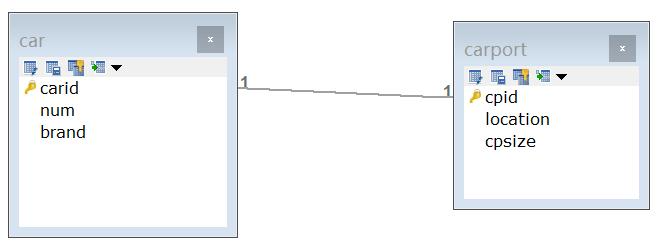

说明：car汽车表、carport车位表。其中car表的主键，同时又是carport表的外键列

使用逆向工程时勾选一对一

(1) 实体类

 Car类

~~~java
package pojo;

/**
 * Car entity. @author MyEclipse Persistence Tools
 */

public class Car implements java.io.Serializable {

	// Fields

	private Integer carid;
	private Carport carport;
	private String num;
	private String brand;

	// Constructors

	/** default constructor */
	public Car() {
	}

	/** minimal constructor */
	public Car(Carport carport) {
		this.carport = carport;
	}

	/** full constructor */
	public Car(Carport carport, String num, String brand) {
		this.carport = carport;
		this.num = num;
		this.brand = brand;
	}

	// Property accessors

	public Integer getCarid() {
		return this.carid;
	}

	public void setCarid(Integer carid) {
		this.carid = carid;
	}

	public Carport getCarport() {
		return this.carport;
	}

	public void setCarport(Carport carport) {
		this.carport = carport;
	}

	public String getNum() {
		return this.num;
	}

	public void setNum(String num) {
		this.num = num;
	}

	public String getBrand() {
		return this.brand;
	}

	public void setBrand(String brand) {
		this.brand = brand;
	}

}
~~~

 Carport类

~~~java
package pojo;

/**
 * Carport entity. @author MyEclipse Persistence Tools
 */

public class Carport implements java.io.Serializable {

	// Fields

	private Integer cpid;
	private String location;
	private String cpsize;
	private Car car;

	// Constructors

	/** default constructor */
	public Carport() {
	}

	/** full constructor */
	public Carport(String location, String cpsize, Car car) {
		this.location = location;
		this.cpsize = cpsize;
		this.car = car;
	}

	// Property accessors

	public Integer getCpid() {
		return this.cpid;
	}

	public void setCpid(Integer cpid) {
		this.cpid = cpid;
	}

	public String getLocation() {
		return this.location;
	}

	public void setLocation(String location) {
		this.location = location;
	}

	public String getCpsize() {
		return this.cpsize;
	}

	public void setCpsize(String cpsize) {
		this.cpsize = cpsize;
	}

	public Car getCar() {
		return this.car;
	}

	public void setCar(Car car) {
		this.car = car;
	}

}
~~~

(2) orm映射

 Car.hbm.xml

~~~xml
<?xml version="1.0" encoding="utf-8"?>
<!DOCTYPE hibernate-mapping PUBLIC "-//Hibernate/Hibernate Mapping DTD 3.0//EN"
"http://www.hibernate.org/dtd/hibernate-mapping-3.0.dtd">
<!-- Mapping file autogenerated by MyEclipse Persistence Tools -->
<hibernate-mapping>
	<class name="pojo.Car" table="car" catalog="hiberdb">
		<id name="carid" type="java.lang.Integer">
			<column name="carid" />
			<generator class="foreign">
				<param name="property">carport</param>
			</generator>
		</id>
		<one-to-one name="carport" class="pojo.Carport"
			constrained="true"></one-to-one>
		<property name="num" type="java.lang.String">
			<column name="num" length="40" />
		</property>
		<property name="brand" type="java.lang.String">
			<column name="brand" length="40" />
		</property>
	</class>
</hibernate-mapping>

~~~

 Carport.hbm.xml

~~~xml
<?xml version="1.0" encoding="utf-8"?>
<!DOCTYPE hibernate-mapping PUBLIC "-//Hibernate/Hibernate Mapping DTD 3.0//EN"
"http://www.hibernate.org/dtd/hibernate-mapping-3.0.dtd">
<!-- 
    Mapping file autogenerated by MyEclipse Persistence Tools
-->
<hibernate-mapping>
    <class name="pojo.Carport" table="carport" catalog="hiberdb">
        <id name="cpid" type="java.lang.Integer">
            <column name="cpid" />
            <generator class="identity"></generator>
        </id>
        <property name="location" type="java.lang.String">
            <column name="location" length="40" />
        </property>
        <property name="cpsize" type="java.lang.String">
            <column name="cpsize" length="40" />
        </property>
        <one-to-one name="car" class="pojo.Car"></one-to-one>
    </class>
</hibernate-mapping>

~~~

（3）持久化操作

~~~java
// 测试一对一---添加
	@Test
	public void text2() {
		Session session = HibernateSessionUtils.getSession();
		Transaction tx = session.beginTransaction();

		// 创建对象
		Carport carport = new Carport();
		carport.setLocation("B区666");
		carport.setCpsize("50");

		Car car = new Car();
		car.setNum("粤G23333");
		car.setBrand("奔驰");

		// 对象关系
		carport.setCar(car);
		car.setCarport(carport);

		// 先保存carport生成主键，因为car的主键是依赖于carport的主键
		session.save(carport);
		session.save(car);

		tx.commit();

		HibernateSessionUtils.closeSession();
	}
~~~

# Hibernate的主要查询技术

1. HQL查询    Hibernate Query Language  hibernate提供查询语法

2. QBC查询    Query By Criteria   语法风格更加面向对象，不需要写语句

3. 原生sql

二  HQL查询基础语法

[select] ... from 类名  [where]....  **查询的是类名，而不是表，而且类名要区分大小写**

## 基础查询

~~~java
// 基础查询
	@Test
	public void test1() {
		Session session = HibernateSessionUtils.getSession();

        //查询所有select可以不写，写的话也不是select *,而是给实体类起别名select e from Emp e
		String hql = "from Emp";

		Query query = session.createQuery(hql);

		List<Emp> list = query.list();

		for (Emp emp : list) {
			System.out.println(emp.getEname() + "," + emp.getJob() + ","
					+ emp.getSal());
		}

	}
~~~

## 属性查询

~~~java
// 属性查询
	@Test
	public void test2() {
		Session session = HibernateSessionUtils.getSession();

		String hql = "select e.ename,e.job,e.sal from Emp e";
		Query query = session.createQuery(hql);

		// 返回的是一个集合，一条记录作为一个Object数组
		List<Object[]> list = query.list();

		for (Object[] objects : list) {
			System.out
					.println(objects[0] + "," + objects[1] + "," + objects[2]);
		}

		HibernateSessionUtils.closeSession();

	}
~~~

## 参数绑定，相当于jdbc占位符问题

~~~java
// 参数绑定，相当于jdbc占位符问题
	@Test
	public void test3() {
		Session session = HibernateSessionUtils.getSession();

		// 有两种参数：1.索引参数，就是? 2.命名参数，给占位符命名
		// String hql = "select e from Emp e where e.job=?  and e.sal>?";
		String hql = "select e from Emp e where e.job=:job  and e.sal>:sal";
		Query query = session.createQuery(hql);

		// 设置占位符
		// query.setString(0, "CLERK");
		// query.setDouble(1, 5000D);

		query.setString("job", "CLERK");
		query.setDouble("sal", 5000D);

		List<Emp> list = query.list();
		for (Emp emp : list) {
			System.out.println(emp.getEname() + "," + emp.getJob() + ","
					+ emp.getSal());
		}

		HibernateSessionUtils.closeSession();

	}
~~~

## 聚合函数统计：count, sum() ,avg(),max(),min()等

~~~java
// 聚合函数统计：count, sum() ,avg(),max(),min()
	@Test
	public void test4() {
		Session session = HibernateSessionUtils.getSession();

		String hql = "select count(e) from Emp e";

		Query query = session.createQuery(hql);

		Long count = (Long) query.uniqueResult(); // uniqueResult保证只有一行数据可用
		System.out.println(count);

		HibernateSessionUtils.closeSession();

	}

	// 聚合函数
	@Test
	public void test5() {
		Session session = HibernateSessionUtils.getSession();

		String hql = "select max(e.sal),min(e.sal),avg(e.sal) from Emp e";

		Query query = session.createQuery(hql);

		Object[] result = (Object[]) query.uniqueResult(); // 保证只有一行数据,返回Object数组
		System.out.println(result[0] + "," + result[1] + "," + result[2]);

		HibernateSessionUtils.closeSession();

	}
~~~

## 分页查询

~~~java
// 分页查询
	@Test
	public void test6() {
		Session session = HibernateSessionUtils.getSession();

		String hql = "from Emp";

		Query query = session.createQuery(hql);

		int pageNum = 2;// 查询第几页
		int pageSize = 5;// 一页的记录数

		query.setFirstResult((pageNum - 1) * pageSize); // 指定的分页查询的始点位置
		query.setMaxResults(pageSize); // 指定的是每页查询的记录数

		List<Emp> list = query.list();
		for (Emp emp : list) {
			System.out.println(emp.getEmpno() + "," + emp.getEname());
		}

		HibernateSessionUtils.closeSession();

	}
~~~

## 练习：

### 统计现有员工的各个职位个数

~~~java
//统计现有员工的各个职位个数
	public void test8() {
		Session session = HibernateSessionUtils.getSession();

		String hql = "select e.job,count(e.job) from Emp e group by e.job";

		Query query = session.createQuery(hql);

		List<Object[]> list = query.list();

		for (Object[] objects : list) {
			System.out.println("职位：" + objects[0] + ",个数:" + objects[1]);
		}

		HibernateSessionUtils.closeSession();

	}
~~~

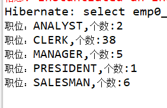

### 按职位统计员工数 

~~~java
//按职位统计员工数
@Test
	public void test7() {
		Session session = HibernateSessionUtils.getSession();

		String hql = "select e.job,count(e.job) from Emp e group by e.job";

		Query query = session.createQuery(hql);

		List<Object[]> list = query.list();

		for (Object[] objects : list) {
			System.out.println("职位：" + objects[0] + ",在职人数:" + objects[1]);
		}

		HibernateSessionUtils.closeSession();

	}
~~~

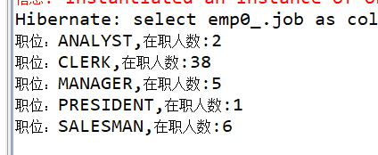

### 统计各个部门的平均工资: 输出某个 "部门名称-->工资"

~~~java
//统计各个部门的平均工资: 输出某个 "部门名称-->工资"
	@Test
	public void test9() {
		Session session = HibernateSessionUtils.getSession();

		String hql = "select d.dname,avg(e.sal) from Emp e,Dept d where e.dept=d.deptno group by d.deptno";

		Query query = session.createQuery(hql);

		List<Object[]> list = query.list();

		for (Object[] objects : list) {
			System.out.println("部门：" + objects[0] + ",平均工资:" + objects[1]);
		}

		HibernateSessionUtils.closeSession();

	}
~~~

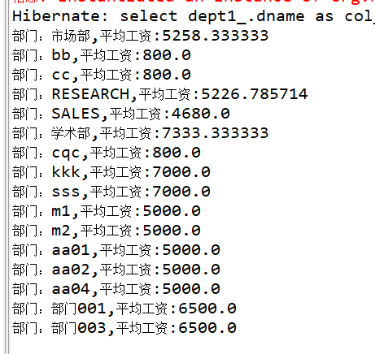

### 统计各个职位的最高工资 和最低工资

~~~java
//统计各个职位的最高工资 和最低工资
	@Test
	public void test10() {
		Session session = HibernateSessionUtils.getSession();
		
		String hql = "select e.job,max(e.sal),min(e.sal) from Emp e group by e.job";
		
		Query query = session.createQuery(hql);
		
		List<Object[]> list = query.list();
		
		for (Object[] objects : list) {
			System.out.println("职位：" + objects[0] + ",最高工资:" + objects[1]+",最低工资"+objects[2]);
		}
		
		HibernateSessionUtils.closeSession();
		
	}
~~~

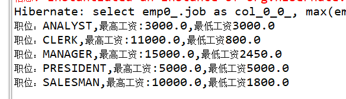

### 统计各个部门平均工资高于5000元的部门的名称 ，输出部门名和部门的平均工资

~~~java
// 统计各个部门平均工资高于5000元的部门的名称 ，输出部门名和部门的平均工资
	@Test
	public void test11() {
		Session session = HibernateSessionUtils.getSession();

		String hql = "select d.dname,avg(e.sal) from Emp e,Dept d where e.dept=d.deptno group by d.deptno HAVING avg(e.sal)>5000";

		Query query = session.createQuery(hql);

		List<Object[]> list = query.list();

		for (Object[] objects : list) {
			System.out.println("部门：" + objects[0] + ",平均工资:" + objects[1]);
		}

		HibernateSessionUtils.closeSession();

	}
~~~

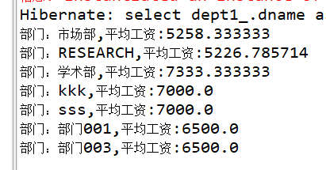

## hql的连接查询 ，类似sql的多表连接查询（内连接和左外连接）

- 内连接

~~~java
//内连接
	@Test
	public void test6(){
		Session session = HibernateSessionUtils.getSession();
		String hql = "from Emp e inner join e.dept"; 
		
		Query query = session.createQuery(hql);
		List<Object[]> list = query.list();
		for (Object[] rows : list) {
			Emp e = (Emp) rows[0];
			Dept d = (Dept) rows[1];
			System.out.println(e.getEname()+","+d.getDeptno());
		}
		
		HibernateSessionUtils.closeSession();
	}
~~~

- 迫切内连接， hql提供的，主要是解决数据的封装问题

~~~java
//迫切内连接
	@Test
	public void test8(){
		Session session = HibernateSessionUtils.getSession();
		String hql = "from Emp e inner join fetch e.dept"; 
		
		Query query = session.createQuery(hql);
		List<Emp> list = query.list();
		for (Emp emp : list) {
			System.out.println(emp.getEname()+","+emp.getDept().getDname());
		}
        //如果只是使用内连接，那么emp对象中的dept属性会等到使用时再查询封装，这样就会多出查询的语句，损耗性能
		
		HibernateSessionUtils.closeSession();
	}
~~~

- 左外连接

~~~java
//左外连接： 查询所有部门信息，以及部门之下所有的员工列表，如果部门没有员工，要求提示【无员工】
	@Test
	public void test9(){
		Session session = HibernateSessionUtils.getSession();
		String hql = "from Dept d left outer join d.emps"; 
		
		Query query = session.createQuery(hql);
		List<Object[]> list = query.list();
		for (Object[] rows : list) {
			Dept d = (Dept) rows[0];
			Emp e = (Emp) rows[1];
			System.out.println(d.getDname());
			if (e!=null) {
				System.out.println("\t"+e.getEname());
			} else {
				System.out.println("\t无员工");
			}
		}
		
		HibernateSessionUtils.closeSession();
	}
~~~

- 迫切左外连接

~~~java
//左外连接： 查询所有部门信息，以及部门之下所有的员工列表，如果部门没有员工，要求提示【无员工】
	@Test
	public void test10(){
		Session session = HibernateSessionUtils.getSession();
		String hql = "select distinct d from Dept d left outer join fetch d.emps"; 
		
		Query query = session.createQuery(hql);
		List<Dept> list = query.list();
		for (Dept dept : list) {
			System.out.println(dept.getDname());
			
			Set<Emp> emps = dept.getEmps();
			if (emps!=null && emps.size()>0) {
				for (Emp emp : emps) {
					System.out.println("\t"+emp.getEname());
				}
			} else {
				System.out.println("\t无员工");
			}
		}
		
		HibernateSessionUtils.closeSession();
	}
~~~

##  QBC查询

Query By Criteria 查询 特点：

- 不需要写语句
- 语法风格更加面向对象，链式编程
- 适合于多条件的组合查询
- 也支持复杂查询，使用“投影”查询 ，比较复杂 。

常用语法：

~~~java
@Test
	public void test1() {
		Session session = HibernateSessionUtils.getSession();
		
        //查询整个Emp的所有数据
		Criteria criteria = session.createCriteria(Emp.class); 
		List<Emp> list = criteria.list();
		
		for (Emp emp : list) {
			System.out.println(emp.getEname());
		}
		
		HibernateSessionUtils.closeSession();
	}
	
	//多条件查询
	@Test
	public void test2() {
		Session session = HibernateSessionUtils.getSession();
		
		Criteria criteria = session.createCriteria(Emp.class); 
		//条件拼接
		criteria.add(Restrictions.like("ename", "%张%"))
		        .add(Restrictions.gt("sal", 3000D))
		        .add(Restrictions.eq("job", "CLERK"));
		
		List<Emp> list = criteria.list();
		
		for (Emp emp : list) {
			System.out.println(emp.getEname()+","+emp.getJob()+","+emp.getSal());
		}
		
		HibernateSessionUtils.closeSession();
	}
	
	//实例查询
	//根据实例中的字段进行查询，只能是确定查询，模糊查询只能用条件拼接。如果字段为空，则该字段不会加条件判断
	@Test
	public void test3() {
		Session session = HibernateSessionUtils.getSession();
		
		Criteria criteria = session.createCriteria(Emp.class); 
		Emp e = new Emp();
		e.setJob("CLERK");
		List<Emp> list = criteria.add(Example.create(e)).list();
		for (Emp emp : list) {
			System.out.println(emp.getEname()+","+emp.getJob()+","+emp.getSal());
		}
		HibernateSessionUtils.closeSession();
	}
~~~

条件拼接的方法：

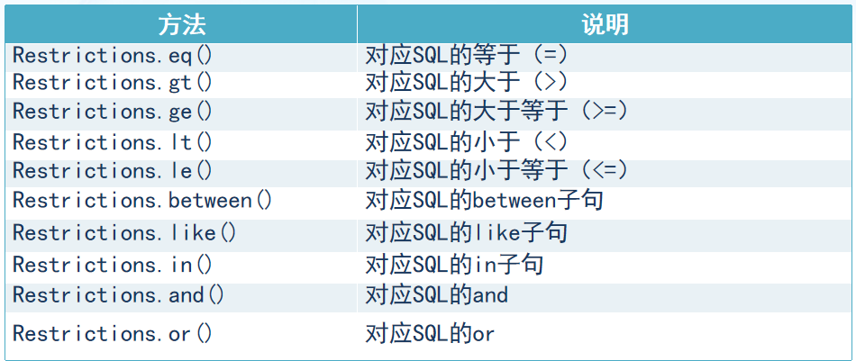

# 【综合练习】

（1）技术

​        Hibernate + Servlet/Jsp（MVC）

（2）数据库设计

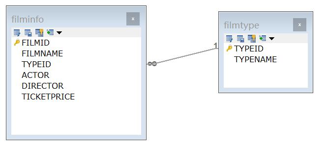

（3）实现步骤

- 创建hibernate的javaweb项目 
- 反向工程工生成实体（双向一对多）
- 实现dao

​       接口参考：

 FilmtypeDao:

~~~java
package dao;

import java.util.List;

import pojo.Filmtype;

public interface FilmtypeDao {
	public List<Filmtype> getAllType();

}

~~~

​      

FilmtypeDaoImpl:

~~~java
package dao;

import java.util.List;

import org.hibernate.Session;

import pojo.Filmtype;
import utils.HibernateSessionUtils;

public class FilmtypeDaoImpl implements FilmtypeDao {

	@Override
	public List<Filmtype> getAllType() {
		Session session = HibernateSessionUtils.getSession();
		List<Filmtype> list = session.createCriteria(Filmtype.class).list();
		return list;
	}

}

~~~

FilminfoDao

~~~java
package dao;

import java.util.List;

import org.hibernate.Session;

import pojo.Filmtype;
import utils.HibernateSessionUtils;

public class FilmtypeDaoImpl implements FilmtypeDao {

	@Override
	public List<Filmtype> getAllType() {
		Session session = HibernateSessionUtils.getSession();
		List<Filmtype> list = session.createCriteria(Filmtype.class).list();
		return list;
	}

}
~~~

​      

FilminfoDaoImpl:

~~~java
package dao;

import java.util.List;

import org.hibernate.Criteria;
import org.hibernate.HibernateException;
import org.hibernate.Session;
import org.hibernate.Transaction;
import org.hibernate.criterion.Restrictions;

import pojo.Filminfo;
import utils.HibernateSessionUtils;

public class FilminfoDaoImpl implements FilminfoDao {

	@Override
	public boolean addFilm(Filminfo film) {
		try {
			Session session = HibernateSessionUtils.getSession();
			Transaction tx = session.beginTransaction();

			session.save(film);

			tx.commit();
			return true;
		} catch (HibernateException e) {
			// TODO Auto-generated catch block
			e.printStackTrace();
			return false;
		} finally {
			HibernateSessionUtils.closeSession();
		}
	}

	@Override
	public List<Filminfo> findFilminfoByCondition(Filminfo filminfo) {

		Session session = HibernateSessionUtils.getSession();
		Criteria criteria = session.createCriteria(Filminfo.class);

		// 添加条件
		// 电影名称
		if (filminfo.getFilmname() != null
				&& !"".equals(filminfo.getFilmname())) {
			criteria.add(Restrictions.like("filmname",
					"%" + filminfo.getFilmname() + "%"));
		}

		// 主演
		if (filminfo.getActor() != null && !"".equals(filminfo.getActor())) {
			criteria.add(Restrictions.like("actor", "%" + filminfo.getActor()
					+ "%"));
		}

		// 导演
		if (filminfo.getDirector() != null
				&& !"".equals(filminfo.getDirector())) {
			criteria.add(Restrictions.like("director",
					"%" + filminfo.getDirector() + "%"));
		}

		// 价格下限 >
		if (filminfo.getLowprice() != null
				&& !"".equals(filminfo.getLowprice())) {
			criteria.add(Restrictions.gt("ticketprice", filminfo.getLowprice()));
		}

		// 价格上线 <
		if (filminfo.getHighprice() != null
				&& !"".equals(filminfo.getHighprice())) {
			criteria.add(Restrictions.lt("ticketprice", filminfo.getHighprice()));
		}

		// 电影类型
		if (0 != filminfo.getFilmtype().getTypeid()) {
			// 查询全部类型的电影
			criteria.add(Restrictions.like("filmtype.typeid", filminfo
					.getFilmtype().getTypeid()));
		}

		List<Filminfo> list = criteria.list();

		for (Object row : list) {
			System.out.println(row);
		}

		HibernateSessionUtils.closeSession();
		return list;

	}
}

~~~

- 实现servlet

FilmSearchServlet查询：

~~~java
package controller;

import java.io.IOException;
import java.io.PrintWriter;
import java.util.List;

import javax.servlet.ServletException;
import javax.servlet.http.HttpServlet;
import javax.servlet.http.HttpServletRequest;
import javax.servlet.http.HttpServletResponse;

import dao.FilminfoDao;
import dao.FilminfoDaoImpl;
import dao.FilmtypeDao;
import dao.FilmtypeDaoImpl;

import pojo.Filminfo;
import pojo.Filmtype;

public class FilmSearchServlet extends HttpServlet {
	FilmtypeDao fd = new FilmtypeDaoImpl();
	FilminfoDao fid = new FilminfoDaoImpl();

	public void doGet(HttpServletRequest request, HttpServletResponse response)
			throws ServletException, IOException {

		doPost(request, response);
	}

	public void doPost(HttpServletRequest request, HttpServletResponse response)
			throws ServletException, IOException {

		request.setCharacterEncoding("utf-8");
		response.setCharacterEncoding("utf-8");
		response.setContentType("text/html;charset=utf-8");

		// 获取前端数据
		String filmname = request.getParameter("filmname");
		String typeid = request.getParameter("typeid");
		String actor = request.getParameter("actor");
		String director = request.getParameter("director");
		String smallprice = request.getParameter("smallprice");
		String bigprice = request.getParameter("bigprice");
		System.out.println("查询的信息：" + filmname + "," + typeid + "," + actor
				+ "," + director + "," + smallprice + "," + bigprice);

		// 封装前端数据
		Filminfo filminfo = new Filminfo();
		filminfo.setFilmname(filmname);
		Filmtype filmtype = new Filmtype();
		filmtype.setTypeid(Integer.parseInt(typeid));
		filminfo.setFilmtype(filmtype);
		filminfo.setActor(actor);
		filminfo.setDirector(director);
		if (smallprice == null || "".equals(smallprice)) {
			filminfo.setLowprice(null);
		} else {
			filminfo.setLowprice(Double.parseDouble(smallprice));
		}
		if (bigprice == null || "".equals(bigprice)) {
			filminfo.setHighprice(null);
		} else {
			filminfo.setHighprice(Double.parseDouble(bigprice));
		}

		List<Filminfo> filminfolist = fid.findFilminfoByCondition(filminfo);

		request.setAttribute("result", filminfolist);
		request.getRequestDispatcher("page/result.jsp").forward(request,
				response);
	}
}

~~~

FilmAddServlet添加：

~~~java
package controller;

import java.io.IOException;
import java.io.PrintWriter;

import javax.servlet.ServletException;
import javax.servlet.http.HttpServlet;
import javax.servlet.http.HttpServletRequest;
import javax.servlet.http.HttpServletResponse;

import dao.FilminfoDao;
import dao.FilminfoDaoImpl;

import pojo.Filminfo;
import pojo.Filmtype;

public class FilmAddServlet extends HttpServlet {
	FilminfoDao fid = new FilminfoDaoImpl();

	public void doGet(HttpServletRequest request, HttpServletResponse response)
			throws ServletException, IOException {

		doPost(request, response);
	}

	public void doPost(HttpServletRequest request, HttpServletResponse response)
			throws ServletException, IOException {

		request.setCharacterEncoding("utf-8");
		response.setCharacterEncoding("utf-8");
		response.setContentType("text/html;charset=utf-8");

		// 获取前端数据
		String filmname = request.getParameter("filmname");
		String typeid = request.getParameter("typeid");
		String actor = request.getParameter("actor");
		String director = request.getParameter("director");
		String ticketprice = request.getParameter("ticketprice");
		System.out.println("添加的电影：" + filmname + "," + typeid + "," + actor
				+ "," + director + "," + ticketprice);

		// 封装前端数据
		Filminfo filminfo = new Filminfo();
		filminfo.setFilmname(filmname);
		Filmtype filmtype = new Filmtype();
		filmtype.setTypeid(Integer.parseInt(typeid));
		filminfo.setFilmtype(filmtype);
		filminfo.setActor(actor);
		filminfo.setDirector(director);
		if (ticketprice == null || "".equals(ticketprice)) {
			filminfo.setTicketprice(null);
		} else {
			filminfo.setTicketprice(Double.parseDouble(ticketprice));
		}

		boolean b = fid.addFilm(filminfo);

		if (b) {
			request.getRequestDispatcher("page/success.jsp").forward(request,
					response);
		} else {
			response.sendRedirect("cinema.jsp");
		}
	}

}

~~~

- 视图使用jsp

主页：

~~~jsp
<%@ page language="java" import="java.util.*" pageEncoding="UTF-8"%>
<%@ taglib uri="http://java.sun.com/jsp/jstl/core" prefix="c"%>
<%
	String path = request.getContextPath();
	String basePath = request.getScheme() + "://"
			+ request.getServerName() + ":" + request.getServerPort()
			+ path + "/";
%>

<!DOCTYPE HTML PUBLIC "-//W3C//DTD HTML 4.01 Transitional//EN">
<html>
<head>
<base href="<%=basePath%>">
<title>影院信息查询</title>
<meta http-equiv="pragma" content="no-cache">
<meta http-equiv="cache-control" content="no-cache">
<meta http-equiv="expires" content="0">
<meta http-equiv="keywords" content="keyword1,keyword2,keyword3">
<meta http-equiv="description" content="This is my page">
<!--
	<link rel="stylesheet" type="text/css" href="styles.css">
	-->

</head>

<body>
	<form action="FilmSearchServlet" method="post">
		<table>
			<tr>
				<td>电影名称：</td>
				<td><input name="filmname" type="text" /></td>
			</tr>
			<tr>
				<td>电影类型：</td>
				<td><select id="typeid" name="typeid">
						<option value="0" selected="selected">全部</option>
						<!-- ${obj.propName}  obj.getPropName()  自省 -->
						<jsp:useBean id="typeDao" class="dao.FilmtypeDaoImpl"></jsp:useBean>
						<c:forEach var="filmType" items="${typeDao.allType}">
							<option value="${filmType.typeid}">${filmType.typename}
							</option>
						</c:forEach>
				</select></td>
			</tr>
			<tr>
				<td>主演：</td>
				<td><input name="actor" type="text" /></td>
			</tr>
			<tr>
				<td>导演：</td>
				<td><input name="director" type="text" /></td>
			</tr>
			<tr>
				<td>价格：</td>
				<td><input name="smallprice" type="text" /> 至 <input
					name="bigprice" type="text" /></td>
			</tr>
			<tr>
				<td>查询</td>
				<td><input type="submit" value="提交查询" /> <input type="button"
					value="发布电影" onclick="javascript:location='page/add.jsp'" /></td>
			</tr>

		</table>
	</form>
</body>
</html>

~~~

显示查询结果页面：
~~~jsp
<%@ page language="java" import="java.util.*" pageEncoding="GBK"%>
<%@ taglib uri="http://java.sun.com/jsp/jstl/core" prefix="c"%>
<%
	String path = request.getContextPath();
	String basePath = request.getScheme() + "://"
			+ request.getServerName() + ":" + request.getServerPort()
			+ path + "/";
%>

<!DOCTYPE HTML PUBLIC "-//W3C//DTD HTML 4.01 Transitional//EN">
<html>
	<head>
		<base href="<%=basePath%>">

		<title>电影信息</title>

		<meta http-equiv="pragma" content="no-cache">
		<meta http-equiv="cache-control" content="no-cache">
		<meta http-equiv="expires" content="0">
		<meta http-equiv="keywords" content="keyword1,keyword2,keyword3">
		<meta http-equiv="description" content="This is my page">
		<!--
	<link rel="stylesheet" type="text/css" href="styles.css">
	-->

	</head>

	<body>
		<table border="1" bordercolor="#66CCCC" align="center" width="60%">
			<tr align="center">
				<td>
					电影名称
				</td>
				<td>
					类型
				</td>
				<td>
					主演
				</td>
				<td>
					导演
				</td>
				<td>
					票价
				</td>
			</tr>
			<c:choose>
				<c:when test="${empty requestScope.result}">
					<tr>
						<td colspan="5">
							<c:out value="未找到符合条件的电影" />
						</td>
					</tr>
				</c:when>
				<c:when test="${!empty requestScope.result}">
					<c:forEach items="${requestScope.result}" var="film">
						<tr>
							<td>
								${film.filmname}
							</td>
							<td> 
								${film.filmtype.typename}
							</td>
							<td>
								${film.actor}
							</td>
							<td>
								${film.director}
							</td>
							<td>
								${film.ticketprice}
							</td>
						</tr>
					</c:forEach>
				</c:when>
			</c:choose>
		</table>
		

			<a href="cinema.jsp" style="text-decoration: none">返回首页</a>
		

	</body>
</html>

~~~

添加数据页面：

~~~jsp
<%@ page language="java" import="java.util.*" pageEncoding="UTF-8"%>
<%@ taglib uri="http://java.sun.com/jsp/jstl/core" prefix="c"%>
<%
	String path = request.getContextPath();
	String basePath = request.getScheme() + "://"
			+ request.getServerName() + ":" + request.getServerPort()
			+ path + "/";
%>

<!DOCTYPE HTML PUBLIC "-//W3C//DTD HTML 4.01 Transitional//EN">
<html>
<head>
<base href="<%=basePath%>">
<title>发布电影信息</title>
<meta http-equiv="pragma" content="no-cache">
<meta http-equiv="cache-control" content="no-cache">
<meta http-equiv="expires" content="0">
<meta http-equiv="keywords" content="keyword1,keyword2,keyword3">
<meta http-equiv="description" content="This is my page">
<!--
	<link rel="stylesheet" type="text/css" href="styles.css">
	-->

</head>

<body>
	<form action="FilmAddServlet" method="post">
		<table>
			<tr>
				<td>电影名称：</td>
				<td><input name="filmname" type="text" /></td>
				<td>
					

				</td>
			</tr>
			<tr>
				<td>电影类型：</td>
				<td><select id="typeid" name="typeid">
						<option value="0" selected="selected">全部</option>
						<!-- ${obj.propName}  obj.getPropName()  自省 -->
						<jsp:useBean id="typeDao" class="dao.FilmtypeDaoImpl"></jsp:useBean>
						<c:forEach var="filmType" items="${typeDao.allType}">
							<option value="${filmType.typeid}">${filmType.typename}
							</option>
						</c:forEach>
				</select></td>
				<td>
					

				</td>
			</tr>
			<tr>
				<td>主演：</td>
				<td><input name="actor" type="text" /></td>
			</tr>
			<tr>
				<td>导演：</td>
				<td><input name="director" type="text" /></td>
			</tr>
			<tr>
				<td>价格：</td>
				<td><input name="ticketprice" type="text" /></td>
				<td>
					

				</td>
			</tr>
			<tr>
				<td>发布</td>
				<td><input value="发布" type="submit" /> <input type="button"
					value="返回首页" onclick="javascript:location='cinema.jsp'" /></td>
			</tr>
		</table>
	</form>
</body>
</html>
~~~

