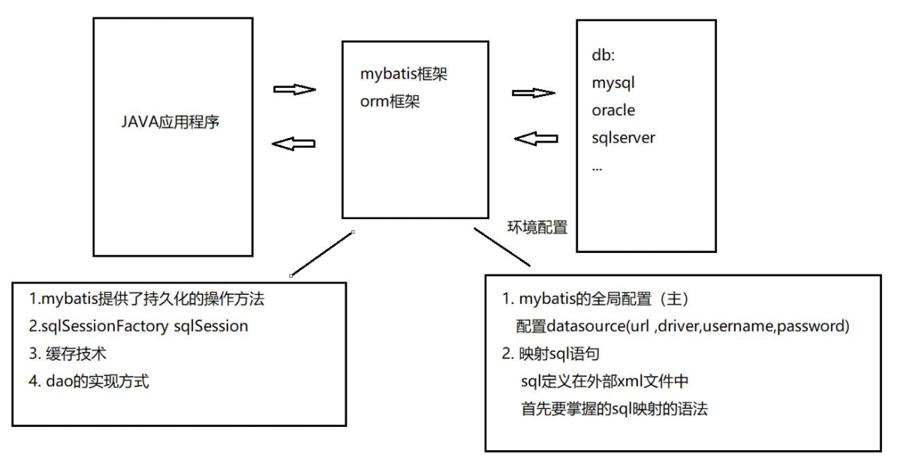
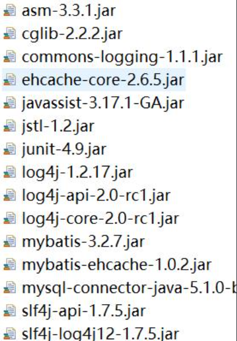
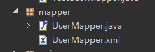
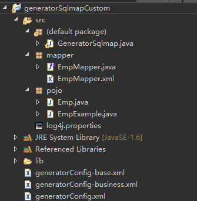
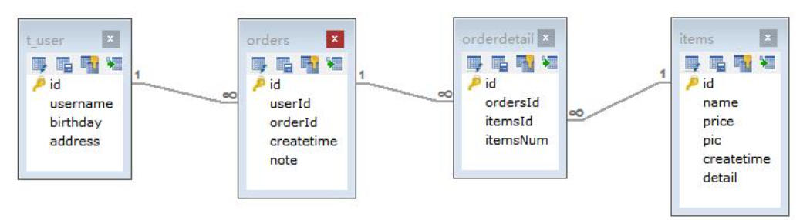
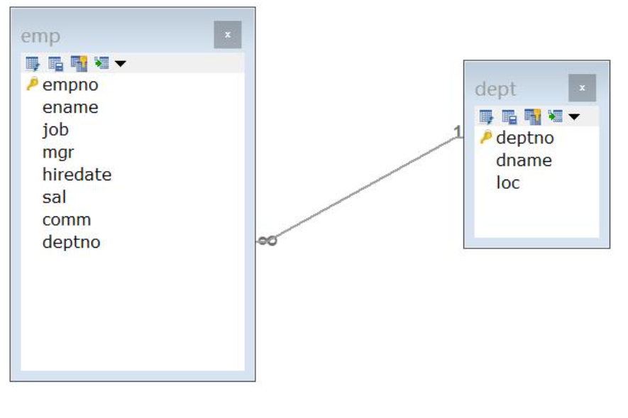
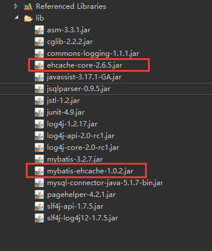
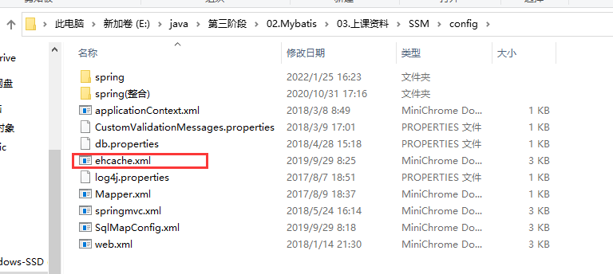
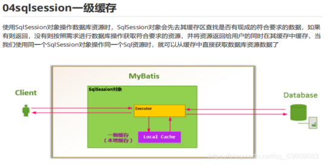
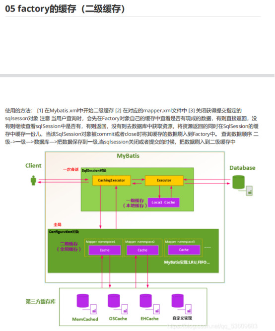

# Mybatis

## 一  Mybatis与Hibernate框架对比

- mybatis更简易、易上手，性能更好，更接近底层。hibernate学习难度更高，入门更难，但技术含量更高，更能体现ORM概念。
- mybatis查询语言是sql，hibernate查询语言是hql。
- orm方面的区别：hibernate是一个完整的orm框架，映射的是整个应用的实体模型，对象之间是有关联关系的，而且关系是可以自动加载数据。mybatis是一个非完整的orm框架，重点在映射sql语句，把sql语句定义在程序外部的配置文件中(xml)

## 二  mybatis学习内容

（1）基础内容

- orm的sql映射语法（xml）
- mybatis的常用配置
- dao实现方式：原始的方式、mapper代理接口的实现方式
- mybatis的分页插件
- mybatis的反向工程工具  （mybatis-plus）

（2）高级内容

- mybatis的对象间的关联映射，主要解决的是多表连接查询 后的数据的封装问题。关系是不可以自动加载。
- mybatis缓存技术（了解）

## 三 mybatis框架的学习流程

 

## 四  mybatis入门程序 

- 添加mybatis的基础类库（jar）

 

- 配置全局文件

~~~java
<configuration>

	<properties resource="db.properties"></properties>

	<!-- 和spring整合后 environments配置将废除 -->
	<environments default="development">
		<environment id="development">
			<!-- 使用jdbc事务管理，事务控制由mybatis -->
			<transactionManager type="JDBC" />
			<!-- 数据库连接池，由mybatis管理 -->
			<dataSource type="POOLED">
				<property name="driver" value="${jdbc.driver}" />
				<property name="url" value="${jdbc.url}" />
				<property name="username" value="${jdbc.username}" />
				<property name="password" value="${jdbc.password}" />
			</dataSource>
		</environment>
	</environments>

	<!-- 注册 sql映射 -->
	<mappers>
		<mapper resource="sqlmapper/UsersMapper.xml"/>
	</mappers>

</configuration>
~~~

- sql映射文件

~~~java
<mapper namespace="test.user">
	
	<!-- 
		id:  sql声明的唯一名
		resultType: 表示每一条记录的封装类型
	 -->
	<select id="findAllUser" resultType="pojo.User">
		select * from t_user
	</select>
	
</mapper>
~~~

- 持久化的单元测试

~~~java
	// 查询所有用户
	@Test
	public void test1() throws IOException {
		// 加载全局配置文件
		InputStream is = Resources.getResourceAsStream("SqlMapConfig.xml");
		SqlSessionFactory factory = new SqlSessionFactoryBuilder().build(is);
		SqlSession session = factory.openSession();

		// 调用sql声明 参数：命名空间+sql声明的唯一id
		List<User> list = session.selectList("User.findAllUser");

		for (User user : list) {
			System.out.println(user);
		}

		session.close();
	}
~~~

## 五 mybatis的常用的sql映射语法

- 参数的传递：#{} 和 ${}

~~~java
	<!--
		parameterType:传入的参数类型 
	-->	
	<select id="findUserById" resultType="pojo.User" parameterType="java.lang.Integer">
		select * from t_user where id=#{id}
	</select>
~~~

\#{}相当于点位符的设置（推荐），避免非法sql的注入，${}简单的字符串的拼接

在使用模糊查询时，使用#{} 和 ${}传递的参数是不同的。使用#{}：传递的参数包含%%；使用${}：%%写在sql语句中

- 添加映射 

~~~java
	<!--
		keyProperty:回调时注入的字段
		order:顺序，before或者after
	-->
	<insert id="addUser" parameterType="pojo.User">
		INSERT INTO t_user (USERNAME, BIRTHDAY, ADDRESS)VALUES (#{username},#{birthday},#{address});
		<selectKey keyProperty="id" resultType="int" order="AFTER">
			select last_insert_id()
		</selectKey>
	</insert>
~~~

- 修改映射

~~~java
	<update id="updateUser" parameterType="pojo.User">
		UPDATE t_user set username=#{username},birthday=#{birthday},address=#{address} where id=#{id}
	</update>
~~~

- 删除

~~~java
	<delete id="deleteUser" parameterType="int">
		delete from t_user where id=#{value}
	</delete>
~~~

## 六  动态sql组合查询

（1）要求：按照用户名、地址做模糊查询

~~~java
<select id="findUserByCondition" resultType="pojo.User" parameterType="pojo.User">
		select * from t_user 
			<where>
				<if test="username!=null and username!=''">
					and username like '%${username}%'
				</if>
				<if test="address!=null and address!=''">
					and address like '%${address}%'
				</if>
			</where>
	</select>
~~~

（2）使用较复杂的条件封装类传递参数

~~~java
<select id="findUserByQueryExample" resultType="pojo.User" parameterType="pojo.QueryExample">
		select * from t_user
			<where>
                    <if test="user!=null">
                <if test="user.username!=null and user.username!=''">
                    and username like '%${user.username}%'
                </if>
                <if test="user.address!=null and user.address!=''">
                    and address like '%${user.address}%'
                </if>
            </if>
            <!-- 拼接，传递多个id，select * from t_user where id in(1,2,3,4...) -->
            <if test="ids!=null">
                <!-- 
                    collection:要遍历的集合
                    item:遍历集合时用来接受元素
                    open:拼接开始时的语句
                    close:拼接结束时的语句
                    separator:分隔符
                -->
                <foreach collection="ids" item="userid" open="and id in("
                    close=")" separator=",">
                    #{userid}
                </foreach>
            </if>
			</where>
	</select>
~~~

（3）根据QueryExample条件进行计数

这时where里面的和（2）的一样，可以将其提取出来，提高重用性

~~~java
<select id="findUserByQueryExample" resultType="pojo.User" parameterType="pojo.QueryExample">
		select * from t_user
			<where>
				<include refid="QueryExampleWhere"></include>
			</where>
	</select>
	
	
	<select id="countUserByQueryExample" resultType="int" parameterType="pojo.QueryExample">
		select count(*) from t_user
			<where>
				<include refid="QueryExampleWhere"></include>
			</where>
	</select>
	
	
	
	<!-- 定义sql片段 -->
	<sql id="QueryExampleWhere">
		<if test="user!=null">
			<if test="user.username!=null and user.username!=''">
				and username like '%${user.username}%'
			</if>
			<if test="user.address!=null and user.address!=''">
				and address like '%${user.address}%'
			</if>
		</if>
		<!-- 拼接，传递多个id，select * from t_user where id in(1,2,3,4...) -->
		<if test="ids!=null">
			<foreach collection="ids" item="userid" open="and id in("
				close=")" separator=",">
				#{userid}
			</foreach>
		</if>
	</sql>
~~~

## 七  DAO的实现

（1）原始的实现方式

- UserDao接口

~~~java
public interface UserDao {
	
	//方法名和sql声明的唯一id可以不同
	public boolean save(User user);
	public boolean update(User user);
	public boolean delete(Integer id);
	
	public User findOne(Integer id);
	public List<User> findUserByCondition(User user);
}
~~~

- UserDao实现类

~~~java
public class UserDaoImpl implements UserDao {

	@Override
	public boolean save(User user) {
		try {
			SqlSession session = MyBatisUtil.getSession();

			session.insert("User.addUser", user);

			session.commit();

			return true;
		} catch (Exception e) {
			// TODO Auto-generated catch block
			e.printStackTrace();
			return false;
		} finally {
			MyBatisUtil.closeSession();
		}
	}

	@Override
	public boolean update(User user) {
		try {
			SqlSession session = MyBatisUtil.getSession();

			session.update("User.updateUser", user);

			session.commit();

			return true;
		} catch (Exception e) {
			// TODO Auto-generated catch block
			e.printStackTrace();
			return false;
		} finally {
			MyBatisUtil.closeSession();
		}
	}

	@Override
	public boolean delete(Integer id) {
		try {
			SqlSession session = MyBatisUtil.getSession();

			session.delete("User.deleteUser", id);

			session.commit();

			return true;
		} catch (Exception e) {
			// TODO Auto-generated catch block
			e.printStackTrace();
			return false;
		} finally {
			MyBatisUtil.closeSession();
		}
	}

	@Override
	public User findOne(Integer id) {
		try {
			SqlSession session = MyBatisUtil.getSession();

			User user = session.selectOne("User.findUserById", id);

			return user;
		} catch (Exception e) {
			e.printStackTrace();
			return null;
		} finally {
			MyBatisUtil.closeSession();
		}
	}

	@Override
	public List<User> findUserByCondition(User user) {
		try {
			SqlSession session = MyBatisUtil.getSession();

			List<User> list = session.selectList("User.findUserByCondition", user);

			return list;
		} catch (Exception e) {
			e.printStackTrace();
			return null;
		} finally {
			MyBatisUtil.closeSession();
		}
	}

}
~~~

（2）mapper代理的实现方式（常用）

特点：只需要定义dao接口，无需 实现接口，只要定义sql声明映射即可。Dao的实现由框架完成。

定义规则：

- mapper接口（dao接口）和mapper映射文件（sql）放在同一个包中。

- **mapper接口和mapper映射文件名相同**

- mapper映射文件的命名空间指定mapper接口的全限定名

~~~java
<mapper namespace="mapper.UserMapper">
~~~

- mapper接口的方法定义，方法名必须和sql声明的id相同

~~~java
public interface UserMapper {

	public List<User> findAllUser();

	public User findUserById(Integer id);

	public List<User> findUserByUsername();

	public void addUser(User user);

	public void updateUser(User user);

	public void deleteUser(User user);
}
~~~

- 在全局配置文件中，注册mapper代理接口

~~~java
<!-- 注册 sql映射 -->
	<mappers>
	<!-- <mapper resource="sqlmapper/UserMapper.xml"/> -->
	
		<!-- 就mapper代理的注册方式 : 指定mapper接口的路径     但是mapper接口多的时候一个一个地写就麻烦了，就用批量注册就行-->
<!-- 		<mapper class="mapper.UserMapper"/> -->
		 
		<!-- 批量注册， mapper代理的注册方式，mapper包内的mapper接口全部注册-->
		<package name="mapper" />
	</mappers>
~~~

- 单元测试

~~~java
public class TestUserMapper {
	@Test
	public void test1() {
		SqlSession session = MyBatisUtil.getSession();

		// 获取mapper接口的代理接口的实例（代理模式）
		UserMapper mapper = session.getMapper(UserMapper.class);

		List<User> list = mapper.findAllUser();

		for (User user : list) {
			System.out.println(user);
		}

		MyBatisUtil.closeSession();
	}
}
~~~

## 八  反向工程工具

反向工程工具生成的代码：pojo类、mapper接口、mapper映射声明(sql)。

生成的代码都是**单表操作**，如果要实现多表操作，要手动编写sql映射。

使用该工程来生成需要的pojo，mapper映射和mapper接口

主配置文件：

~~~java
<?xml version="1.0" encoding="UTF-8"?>
<!DOCTYPE generatorConfiguration
  PUBLIC "-//mybatis.org//DTD MyBatis Generator Configuration 1.0//EN"
  "http://mybatis.org/dtd/mybatis-generator-config_1_0.dtd">

<generatorConfiguration>
	<context id="testTables" targetRuntime="MyBatis3">
		<commentGenerator>
			<!-- 是否去除自动生成的注释 true：是 ： false:否 -->
			<property name="suppressAllComments" value="true" />
		</commentGenerator>
		<!--数据库连接的信息：驱动类、连接地址、用户名、密码 -->
		 
		<jdbcConnection driverClass="com.mysql.jdbc.Driver"
			connectionURL="jdbc:mysql://localhost:3306/mybatisdb" userId="root"
			password="">
		</jdbcConnection>
		
		 <!--
		<jdbcConnection driverClass="oracle.jdbc.OracleDriver"
			connectionURL="jdbc:oracle:thin:@localhost:1521:orcl" 
			userId="jason"
			password="jason">
		</jdbcConnection>
  		-->
		<!-- 默认false，把JDBC DECIMAL 和 NUMERIC 类型解析为 Integer，为 true时把JDBC DECIMAL 和 
			NUMERIC 类型解析为java.math.BigDecimal -->
		<javaTypeResolver>
			<property name="forceBigDecimals" value="false" />
		</javaTypeResolver>

		<!-- targetProject:生成POjO类的位置 -->
		<javaModelGenerator targetPackage="pojo"
			targetProject=".\src">
			<!-- enableSubPackages:是否让schema作为包的后缀 -->
			<property name="enableSubPackages" value="false" />
			<!-- 从数据库返回的值被清理前后的空格 -->
			<property name="trimStrings" value="true" />
		</javaModelGenerator>
        <!-- targetProject:mapper映射文件生成的位置 -->
		<sqlMapGenerator targetPackage="mapper" 
			targetProject=".\src">
			<!-- enableSubPackages:是否让schema作为包的后缀 -->
			<property name="enableSubPackages" value="false" />
		</sqlMapGenerator>
		<!-- targetPackage：mapper接口生成的位置 -->
		<javaClientGenerator type="XMLMAPPER"
			targetPackage="mapper" 
			targetProject=".\src">
			<!-- enableSubPackages:是否让schema作为包的后缀 -->
			<property name="enableSubPackages" value="false" />
		</javaClientGenerator>
		
		<!-- 指定数据库表   domainObjectName属性可以指定生成的实体类的类名 -->
		<table tableName="emp"></table>
		<!-- 有些表的字段需要指定java类型
		 <table schema="" tableName="">
			<columnOverride column="" javaType="" />
		</table> -->
	</context>
</generatorConfiguration>

~~~

更改数据库，更改pojo，mapper映射，mapper接口生成的位置（包位置，一般与开发项目的包名相同，这样拷贝过去就不用改能直接用），指定映射的数据库表

配置好后运行这个类的main方法，就会生成需要的文件了

生成的文件有

* mapper映射文件和mapper接口

* 相应的实体类和条件查询使用的条件封装类

将其拷贝到开发项目中使用即可

使用的参考代码：

~~~java
// 查询所有数据
	@Test
	public void test1() {
		SqlSession session = MyBatisUtil.getSession();
		EmpMapper mapper = session.getMapper(EmpMapper.class);

		// 可以new一个EmpExample空对象，也可以注入null，都可以实现查询全部数据
		List<Emp> selectByExample = mapper.selectByExample(null);

		for (Emp emp : selectByExample) {
			System.out.println(emp);
		}

		MyBatisUtil.closeSession();
	}

	// 条件查询
	@Test
	public void test2() {
		SqlSession session = MyBatisUtil.getSession();
		EmpMapper mapper = session.getMapper(EmpMapper.class);

		EmpExample empExample = new EmpExample();

		// 添加条件
		// 与hibernate的思想一样使用criteria
		Criteria criteria = empExample.createCriteria();
		criteria.andEnameLike("%张%");

		List<Emp> selectByExample = mapper.selectByExample(empExample);

		for (Emp emp : selectByExample) {
			System.out.println(emp);
		}

		MyBatisUtil.closeSession();
	}
~~~

## 九  分页插件

实现步骤：

- 添加插件jar:

​    

- 在mybatis的全局配置文件中，配置分页拦截器。主要用于拦截请求重构sql分页语句

​			注意添加的位置

~~~xml
<!--   DTD
    plugins在配置文件中的位置必须符合要求，否则会报错，顺序如下:
    properties?, settings?, 
    typeAliases?, typeHandlers?, 
    objectFactory?,objectWrapperFactory?, 
    plugins?, 
    environments?, databaseIdProvider?, mappers?
-->

<!-- 	分页 -->
	<plugins>
    <!-- com.github.pagehelper为PageHelper类所在包名 -->
    <plugin interceptor="com.github.pagehelper.PageHelper">
        <property name="dialect" value="mysql"/>
        
<!--         该参数默认为false -->
<!--         设置为true时，会将RowBounds第一个参数offset当成pageNum页码使用 -->
<!--         和startPage中的pageNum效果一样 -->
<!--         <property name="offsetAsPageNum" value="true"/> -->
<!--         该参数默认为false -->
<!--         设置为true时，使用RowBounds分页会进行count查询 -->
<!--         <property name="rowBoundsWithCount" value="true"/> -->
<!--         设置为true时，如果pageSize=0或者RowBounds.limit = 0就会查询出全部的结果 -->
<!--         （相当于没有执行分页查询，但是返回结果仍然是Page类型） -->
<!--         <property name="pageSizeZero" value="true"/> -->

        <!-- 3.3.0版本可用 - 分页参数合理化，默认false禁用 -->
        <!-- 启用合理化时，如果pageNum<1会查询第一页，如果pageNum>pages会查询最后一页 -->
        <!-- 禁用合理化时，如果pageNum<1或pageNum>pages会返回空数据 -->
        <property name="reasonable" value="true"/>
    </plugin>
</plugins>

~~~

- 分页方法的调用

~~~java
// 分页测试
	@Test
	public void test3() {
		SqlSession session = MyBatisUtil.getSession();
		EmpMapper mapper = session.getMapper(EmpMapper.class);

		// 要分页就要在查询之前做分页拦截,重构分页sql
		PageHelper.startPage(2, 5);

		List<Emp> list = mapper.selectByExample(null);

		for (Emp emp : list) {
			System.out.println(emp);
		}

		// 创建分页bean的实例
		PageInfo page = new PageInfo<>(list);
		System.out.println("总记录数：" + page.getTotal());
		System.out.println("总页数：" + page.getPages());
		System.out.println("上页：" + page.getPrePage());
		System.out.println("下页：" + page.getNextPage());

		MyBatisUtil.closeSession();
	}
~~~

## 十  关联映射（重点）

关联映射的作用：主要解决多表连接查询之后的数据封装的问题。

查询需求：

**1.  查询所有的订单信息以及该订单之下的用户的信息。**------关联两个表

  sql语句：

~~~sql
SELECT 
       orders.*,
       t_user.username 
FROM orders,t_user
WHERE orders.userId=t_user.id
~~~

 mybatis映射声明sql

 两种封装方式：

（1）**resultType**  , 扩展主类的方式来封装

扩展类：

~~~java
public class OrdersDo extends Orders {
	private String username;

	public String getUsername() {
		return username;
	}

	public void setUsername(String username) {
		this.username = username;
	}

}
~~~

sql映射

~~~java
<select id="findOrdersAndUser" resultType="pojo.OrdersDo">
		SELECT 
	       orders.*,
	       t_user.username 
		FROM orders,t_user
		WHERE orders.userId=t_user.id
</select>
~~~

在mapper中定义好方法后测试

~~~java
@Test
	public void test1() {
		SqlSession session = MyBatisUtil.getSession();
		OrdersMapper ordersMapper = session.getMapper(OrdersMapper.class);

		List<OrdersDo> list = ordersMapper.findOrdersAndUser();

		for (OrdersDo o : list) {
			System.out.println(o.getOrderId() + "," + o.getCreatetime() + "," + o.getUsername());
		}
	}
~~~

  （2） **resultMap**,通过添加类与类之间的关系来封装

对象：orders,user

关系(是当前查询需求中的关系:**查询所有的订单信息以及该订单之下的用户的信息**)：orders多方包含user一方

此时，Orders是主表

orders类添加关联关系：

​	只需映射一方并添加set,get方法

~~~java
 //映射一方
    private User user;

	public User getUser() {
		return user;
	}

	public void setUser(User user) {
		this.user = user;
	}
~~~

sql映射：

​	这里的sql只是多查询了几个数据，并无其他含义

**注意**：在封装resultMap的column和property时注意

column是映射的sql语句返回数据中的列名，注意返回的是别名的情况

property是映射的类的字段

association 映射一方，javaType是一方的实体类，property是这方的实体类的字段

~~~xml
<!-- type表示封装的主类 -->
	<resultMap type="pojo.Orders" id="OrderAndUserResultMap">
		<!-- 	类中简单类型与数据库中的字段映射 -->
			<!-- 主键的映射 -->
			<id column="id" property="id"/>
			<!-- 非主键的映射 -->
			<result column="userId" property="userId"/>
			<result column="orderId" property="orderId"/>
			<result column="createtime" property="createtime"/>
			<result column="note" property="note"/>
		<!-- 类中自定义类型字段与数据库中多表关联字段的映射关系 -->
			<!-- 
				映射一方是用 association
				property是这方的实体类的字段
				映射的类写在属性javaType中
			-->
			<association property="user" javaType="pojo.User">
				<id column="id" property="id"/>
				<result column="username" property="username"/>
				<result column="birthday" property="birthday"/>
				<result column="address" property="address"/>
			</association>
	</resultMap>

<select id="findOrderAndUserResultMap" resultMap="OrderAndUserResultMap">
		SELECT 
	       orders.*,
	       t_user.username,
	       t_user.birthday,
	       t_user.address
		FROM orders,t_user
		WHERE orders.userId=t_user.id
	</select>
~~~

同样地先在mapper中定义好方法后测试：

~~~java
@Test
	public void test2() {
		SqlSession session = MyBatisUtil.getSession();
		OrdersMapper ordersMapper = session.getMapper(OrdersMapper.class);

		List<Orders> list = ordersMapper.findOrderAndUserResultMap();

		for (Orders o : list) {
			System.out.println(o);

			User user = o.getUser();
			System.out.println("\t" + user);
		}
	}
~~~

**2.  查询订单、用户的信息以及订单之下的所有的订单详情信息**-------------关联三个表

对象： Oders , Users, OrderDetail

关系： Orders包含Users一方，Orders包含OrderDetail多方

orders类添加关联关系：

​	映射多方并添加set，get方法

~~~java
// 映射多方
	private List<OrderDetail> orderDetaillist;
~~~

 sql语句：

~~~sql
SELECT 
      orders.*,
      t_user.username,
      t_user.birthday,
      t_user.address,
      orderdetail.id detail_id,
      orderdetail.ordersId detail_orders_id,
      orderdetail.itemsId,
      orderdetail.itemsNum	
FROM orders,t_user,orderdetail
WHERE orders.userId=t_user.id
      AND orders.id=orderdetail.ordersId
~~~

sql映射：

~~~java
<!-- 在映射Orders的字段和一方User时的字段时，上面已经做过了，为了提高重用性，可以使用resultMap的继承属性 -->
	<resultMap id="OrdersAndUserAndOrderDetail" 
				type="pojo.Orders" 
				extends="OrderAndUserResultMap">
		<!-- 
			多方映射 使用collection
    		property
			映射的类写在属性ofType中
		-->
		<collection property="orderDetaillist" ofType="pojo.OrderDetail">
			<id column="detail_id" property="id"/>
			<result column="detail_orders_id" property="ordersId"/>
			<result column="itemsId" property="itemsId"/>
			<result column="itemsNum" property="itemsNum"/>
		</collection>
		
	</resultMap>
	
	<select id="findOrdersAndUserAndOrderDetail" resultMap="OrdersAndUserAndOrderDetail">
		SELECT
			orders.*,
			t_user.username,
			t_user.birthday,
			t_user.address,
			orderdetail.id detail_id,
			orderdetail.ordersId detail_orders_id,
			orderdetail.itemsId,
			orderdetail.itemsNum
		FROM orders,t_user,orderdetail
		WHERE orders.userId=t_user.id
		AND orders.id=orderdetail.ordersId
	</select>
~~~

同样地在mapper中定义好方法后测试：

~~~java
@Test
	public void test3() {
		SqlSession session = MyBatisUtil.getSession();
		OrdersMapper ordersMapper = session.getMapper(OrdersMapper.class);

		List<Orders> list = ordersMapper.findOrdersAndUserAndOrderDetail();

		for (Orders o : list) {
			System.out.println(o);

			User user = o.getUser();
			System.out.println("\t" + user);

			List<OrderDetail> orderDetails = o.getOrderDetaillist();
			for (OrderDetail oDetail : orderDetails) {
				System.out.println("\t\t" + oDetail);
			}
		}
	}
~~~

这里有一点是Mybatis的优点，先理一下现在查的数据：查询订单、用户的信息以及订单之下的所有的订单详情信息

**按照当前的sql**查询出来是三条记录，但是这三条记录中，有两条记录是同一订单，只是改订单有两个订单详情，但是Mybatis根据映射关系会“去重”一条记录，将两个订单详情合并到同一订单记录中。这样查询出来封装后的结果就是有两个订单，其中一个订单的订单详情有两条记录。这个优点很好，不要去写复杂的sql语句

**3. 查询下了订单的用户，以及订单（包括详情）和商品的信息**------------关联四个表

分析对象的关系：User一方包含订单多方，订单一方包含订单详情多方，订单详情一方包含商品信息一方

​							Users-->List<Orders>-->List<OrderDetail>-->Items

注意，此时User是主表

User类添加关联关系：

~~~java
	private List<Orders> orderslist;
~~~

Orders中已有List<OrderDetail>的关系

OrderDetail类添加关联关系：

~~~java
	private Items item;
~~~

sql语句：

~~~java
SELECT 
      orders.*,
      t_user.username,
      t_user.birthday,
      t_user.address,
      orderdetail.id detail_id,
      orderdetail.ordersId detail_orders_id,
      orderdetail.itemsId,
      orderdetail.itemsNum,
      items.id items_id,
      items.name items_name,
      items.createtime	items_createtime,
      items.price,
      items.detail
FROM orders,t_user,orderdetail,items
WHERE orders.userId=t_user.id
      AND orders.id=orderdetail.ordersId   
      AND items.id=orderdetail.itemsId  
~~~

sql映射：

~~~xml
<resultMap id="UserAndOrdersAndOrderDetailAndItems" type="pojo.User" >
		<id column="id" property="id"/>
		<result column="username" property="username"/>
		<result column="birthday" property="birthday"/>
		<result column="address" property="address"/>
		
		<collection property="orderslist" ofType="pojo.Orders">
			<id column="id" property="id"/>
			<result column="userId" property="userId"/>
			<result column="orderId" property="orderId"/>
			<result column="createtime" property="createtime"/>
			<result column="note" property="note"/>
			
			<collection property="orderDetaillist" ofType="pojo.OrderDetail">
				<id column="detail_id" property="id"/>
				<result column="detail_orders_id" property="ordersId"/>
				<result column="itemsId" property="itemsId"/>
				<result column="itemsNum" property="itemsNum"/>
				<association property="item" javaType="pojo.Items">
					<id column="items_id" property="id"/>
					<result column="items_name" property="name"/>
					<result column="items_createtime" property="createtime"/>
					<result column="price" property="price"/>
					<result column="detail" property="detail"/>
				</association>
			</collection>
		</collection>
	</resultMap>
	
	<select id="findUserAndOrdersAndOrderDetailAndItems" resultMap="UserAndOrdersAndOrderDetailAndItems">
		SELECT 
		      orders.*,
		      t_user.username,
		      t_user.birthday,
		      t_user.address,
		      orderdetail.id detail_id,
		      orderdetail.ordersId detail_orders_id,
		      orderdetail.itemsId,
		      orderdetail.itemsNum,
		      items.id items_id,
		      items.name items_name,
		      items.createtime	items_createtime,
		      items.price,
		      items.detail
		FROM orders,t_user,orderdetail,items
		WHERE orders.userId=t_user.id
		      AND orders.id=orderdetail.ordersId   
		      AND items.id=orderdetail.itemsId  
	</select>
~~~

添加mapper接口方法后测试：

~~~java
@Test
	public void test4() {
		SqlSession session = MyBatisUtil.getSession();
		OrdersMapper ordersMapper = session.getMapper(OrdersMapper.class);

		List<User> list = ordersMapper.findUserAndOrdersAndOrderDetailAndItems();

		for (User user : list) {
			System.out.println(user);

			List<Orders> orderslist = user.getOrderslist();
			for (Orders orders : orderslist) {
				System.out.println("\t" + orders);

				List<OrderDetail> orderDetaillist = orders.getOrderDetaillist();
				for (OrderDetail orderDetail : orderDetaillist) {
					System.out.println("\t\t" + orderDetail);
					Items item = orderDetail.getItem();
					System.out.println("\t\t\t" + item);
				}
			}
		}
	}
~~~

### 【课堂练习】

1. 数据库表： emp和dept两张表

​    

2. 使用反向工程创建两张表的基础文件：pojo,  mapper接口， mapper映射文件；

3. 使用mapper代理DAO方式，实现以下的查询操作：

- 查询所有的员工以及员工所在部门名称，要求分别使用resultType和resultMap两种方式封装

resultType:

扩展类：

~~~java
public class EmpDo extends Emp {
	private String dname;

	public String getDeptname() {
		return dname;
	}

	public void setDeptname(String dname) {
		this.dname = dname;
	}

}
~~~

sql映射：

~~~xml
<select id="findEmpAndDept" resultType="pojo.EmpDo">
		SELECT
			e.*,
			d.dname
		FROM emp e,dept d
		where e.deptno=d.deptno
	</select>
~~~

定义好mapper接口的方法测试：

~~~java
@Test
	public void test1() {
		SqlSession session = MyBatisUtil.getSession();
		EmpAndDeptMapper mapper = session.getMapper(EmpAndDeptMapper.class);

		List<EmpDo> list = mapper.findEmpAndDept();
		for (EmpDo empDo : list) {
			System.out.println(empDo + "," + empDo.getDeptname());
		}
	}
~~~

resultMap:

Emp类中添加关联关系，给出set，get方法

~~~java
// 一方映射
	private Dept dept;
~~~

SQL映射：

~~~xml
<resultMap type="pojo.Emp" id="EmpAndDeptResultMap">
		<id column="empno" property="empno"/>
		<result column="ename" property="ename"/>
		<result column="job" property="job"/>
		<result column="mgr" property="mgr"/>
		<result column="hiredate" property="hiredate"/>
		<result column="sal" property="sal"/>
		<result column="comm" property="comm"/>
		<result column="deptno" property="deptno"/>
		
		<association property="dept" javaType="pojo.Dept">
			<id column="deptno" property="deptno"/>
			<result column="dname" property="dname"/>
			<result column="loc" property="loc"/>
		</association>
	</resultMap>
	
	<select id="findEmpAndDeptResultMap" resultMap="EmpAndDeptResultMap">
		SELECT
			e.*,
			d.dname
		FROM emp e,dept d
		where e.deptno=d.deptno
	</select>
~~~

定义好mapper接口的方法测试：

~~~java
@Test
	public void test2() {
		SqlSession session = MyBatisUtil.getSession();
		EmpAndDeptMapper mapper = session.getMapper(EmpAndDeptMapper.class);

		List<Emp> list = mapper.findEmpAndDeptResultMap();
		for (Emp emp : list) {
			System.out.println(emp);
			Dept dept = emp.getDept();
			System.out.println("\t" + dept);
		}
	}
~~~

- 查询所有的部门以及部门之下所有员工的列表，部门没有员工，要求提示“无员工”，要求使用resultMap映射

Dept类中添加关联关系，给出set，get方法

~~~java
private List<Emp> emplist;
~~~

sql映射：

~~~xml
<resultMap type="pojo.Dept" id="DeptAndEmpResultMap">
			<id column="deptno" property="deptno"/>
			<result column="dname" property="dname"/>
			<result column="loc" property="loc"/>
		
		
		<collection property="emplist" ofType="pojo.Emp">
			<id column="empno" property="empno"/>
			<result column="ename" property="ename"/>
			<result column="job" property="job"/>
			<result column="mgr" property="mgr"/>
			<result column="hiredate" property="hiredate"/>
			<result column="sal" property="sal"/>
			<result column="comm" property="comm"/>
			<result column="deptno" property="deptno"/>
		</collection>
	</resultMap>
	
	<select id="findDeptAndEmpResultMap" resultMap="DeptAndEmpResultMap">
		SELECT
			d.*,
			e.*
		FROM emp e right JOIN dept d
		on e.deptno=d.deptno
	</select>
~~~

定义好mapper接口的方法测试：

~~~java
@Test
	public void test3() {
		SqlSession session = MyBatisUtil.getSession();
		EmpAndDeptMapper mapper = session.getMapper(EmpAndDeptMapper.class);

		List<Dept> list = mapper.findDeptAndEmpResultMap();
		for (Dept dept : list) {
			System.out.println(dept.getDname());
			List<Emp> emplist = dept.getEmplist();
			//emplist必不为空且长度至少为1，因为没有员工的话也是emp对象内的所有字段为空，是存在一个emp对象的
			for (Emp emp : emplist) {
				if (emp.getEmpno() != null) {
					System.out.println("\t" + emp);
				} else {
					System.out.println("\t改部门无员工");
				}
			}
		}
	}
~~~

总结一些坑：

​	巨多坑，总之主表字段给全，其他按照规范映射好就不会出问题

## 十一   mybatis的数据的延时加载（了解）

- 在mybatis的全局配置文件中，打开延时加载的开关

~~~java
	<settings>
		<!-- 打开延迟加载 的开关 -->
		<setting name="lazyLoadingEnabled" value="true"/>
		<!-- 将积极加载改为消极加载即按需要加载 -->
		<setting name="aggressiveLazyLoading" value="false"/>
	</settings>
~~~

- sql映射 

~~~java
	<resultMap id="orderLazyloadingUsersResultmap"  type="com.gec.mybatis.pojo.Orders">
 		<id column="id" property="id"/>
 		<result column="userId" property="userId"/>
 		<result column="orderId" property="orderId"/>
 		<result column="createtime" property="createtime"/>
 		<result column="note" property="note"/>	 	
 		
 		<association property="user" 
 		             javaType="com.gec.mybatis.pojo.Users"
 		             select="com.gec.mybatis.mapper.UsersMapper.findUserById"
 		             column="userId">
 	 		<id column="userId" property="id"/>
			<result column="username" property="username"/>
			<result column="birthday" property="birthday"/>
			<result column="address" property="address"/>			
 		</association>
	 </resultMap>
	 
	 <select id="findAllOrdersLazyloadingUsers" resultMap="orderLazyloadingUsersResultmap">	 
	 	SELECT * FROM orders
	 </select>
~~~

因为是懒加载，所以只查orders的数据即可，user的数据等到调用时再自动发送sql语句查询。问题就是如何查询，首先是association中的一个属性select，使用的是user的单表xml中的sql映射，入参则使用column，值用的是外键关联的userId。

这样做只有orders在获取字段user时会自动发送sql去查询数据，这样做sql语句就会更多，效率还不如全查出来高

## 十二   mybatis的缓存 （了解）

（1）一级缓存

​    基于SqlSession， 默认内置的缓存机制，无需额外的配置。

~~~java
	//一级缓存测试
	@Test
	public void test1() {
		SqlSession session = MyBatisUtil.getSession();
		UsersMapper userMapper = session.getMapper(UsersMapper.class);
		
		Users user1 = userMapper.findUserById(8);  //发送sql
		System.out.println(user1.getUsername());
		
		//刷新缓存 如果有这行，下面重新查找时就会重新发送sql
		//session.commit();  //session.close()
		
		Users user2 = userMapper.findUserById(8);  //先判断是否有缓存 ,如果缓存没有，就发送sql
		System.out.println(user2.getUsername());
		
		System.out.println(user1==user2); //true
		
		MyBatisUtil.closeSession();
	}
~~~

（2）二级缓存 

 基于SqlSessionFactory, 要额外配置，导入第三方的缓存组件。

实现步骤：

- 导入ecache第三方缓存组件 

- 添加缓存优化的配置文件，主要用于参数的优化配置

- 在mapper映射文件中添加缓存配置

~~~xml
<cache type="org.mybatis.caches.ehcache.EhcacheCache"></cache>
~~~

- 在全局配置文件中，打开二级缓存

~~~xml
	<settings>
		<!-- 启动二级缓存 -->
		<setting name="cacheEnabled" value="true"/>
	</settings>
~~~

测试：

~~~java
//二级缓存 ：基于SqlSessionFactory
	@Test
	public void test2() {
		SqlSessionFactory factory = MyBatisUtil.getSqlSessionFactory();
		
		SqlSession session1 = factory.openSession();
		UsersMapper userMapper1 = session1.getMapper(UsersMapper.class);
		
		Users user1 = userMapper1.findUserById(8);
		System.out.println(user1.getUsername());
		
		//关闭session
		session1.close();
		
		//第二打开session
		SqlSession session2 = factory.openSession();
		UsersMapper userMapper2 = session2.getMapper(UsersMapper.class);
		Users user2 = userMapper2.findUserById(8);
		System.out.println(user2.getUsername());
		
		System.out.println(user1==user2);
		
		session2.close();
	}
~~~

 

 
