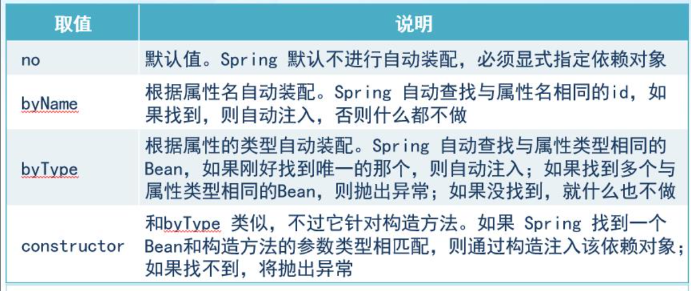

# 一  Spring是一个什么框架？

1. Spring是一个开发JavaEE应用程序的轻量级的一站式的开源框架。

​     一站式指的是这个框架提供了很多的技术的模块，涵盖了开发JavaEE应用的各方面的技术。通俗来讲，就是一个开发JavaEE应用的“全家桶”。轻量级一般指的是简单、易用、易部署。

可以解决我们企业开发中遇到的难题，能够让编码变的更加简单，核心组件IOC容器和Aop面向切面编程。

（1）IOC 控制反转：把整个对象创建的过程，统一交给我们SpringIOC容器来实现管理，底层使用反射+工厂模式实现。

（2）Aop面向切面编程：对我们功能（方法）前后实现增强，比如打印日志、事务原理、权限管理，底层是基于动态代理模式实现的。

减少到我们的代码的冗余性问题。

2. EJB  重量级的开发分布式应用的框架（官方） 常识

​     EJB  Enterprise JavaBean(企业JavaBean) 。EJB应用程序必须部署在重量级的服务器中（Weblogic、Websphere、JBoss）。EJB相当于Hiberante+Spring。Spring并不是技术的创新，是把之前已经存在的旧技术和思想重新整合成一套更加易用的轻量级的开源框架。

3. Spring框架的组成

​    **核心容器：**核心容器提供 Spring 框架的基本功能。核心容器的主要组件是 BeanFactory，它是工厂模式的实现。BeanFactory 使用控制反转 （IOC） 模式将应用程序的配置和依赖性规范与实际的应用程序代码分开。

Spring-Beans：这个jar 文件是所有应用都要用到的，它包含访问配置文件、创建和管理bean 以及进行Inversion ofControl / Dependency Injection（IoC/DI）操作相关的所有类。如果应用只需基本的IoC/DI 支持，引入spring-core.jar 及spring-beans.jar 文件就可以了。

​    **Spring 上下文：**Spring 上下文是一个配置文件，向 Spring 框架提供上下文信息。Spring 上下文包括企业服务，例如 JNDI、EJB、电子邮件、国际化、校验和调度功能。

Spring-Expression:模块提供了一个强大的表达式语言，用于在运行时查询和处理对象图。该语言支持设置和获取属性值；属性赋值，方法调用，访问数组的内容，收集和索引器，逻辑和算术运算，命名变量，并从Spring的IOC容器的名字对象检索，它也支持列表选择和投影以及常见的列表聚合。

​    **Spring AOP：**通过配置管理特性，Spring AOP 模块直接将面向方面的编程功能集成到了 Spring 框架中。所以，可以很容易地使 Spring 框架管理的任何对象支持 AOP。Spring AOP 模块为基于 Spring 的应用程序中的对象提供了事务管理服务。通过使用 Spring AOP，不用依赖 EJB 组件，就可以将声明性事务管理集成到应用程序中。

​    **Spring DAO：**JDBC DAO 抽象层提供了有意义的异常层次结构，可用该结构来管理异常处理和不同数据库供应商抛出的错误消息。异常层次结构简化了错误处理，并且极大地降低了需要编写的异常代码数量（例如打开和关闭连接）。Spring DAO 的面向 JDBC 的异常遵从通用的 DAO 异常层次结构。

spring-transaction:以前是在这里org.springframework.transaction
为JDBC、Hibernate、JDO、JPA、Beans等提供的一致的声明式和编程式事务管理支持。

​    **Spring ORM：**Spring 框架插入了若干个 ORM 框架，从而提供了 ORM 的对象关系工具，其中包括 JDO、Hibernate 和 iBatis SQL Map。所有这些都遵从 Spring 的通用事务和 DAO 异常层次结构。

​    **Spring Web 模块**：Web 上下文模块建立在应用程序上下文模块之上，为基于 Web 的应用程序提供了上下文。所以，Spring 框架支持与 Jakarta Struts 的集成。Web 模块还简化了处理多部分请求以及将请求参数绑定到域对象的工作。

​    **Spring MVC 框架：**MVC 框架是一个全功能的构建 Web 应用程序的 MVC 实现。通过策略接口，MVC 框架变成为高度可配置的，MVC 容纳了大量视图技术，其中包括 JSP、Velocity、Tiles、iText 和 POI。模型来有JavaBean来构成，存放于m当中，而视图是一个街口，负责实现模型，控制器表示逻辑代码，由c的事情。Spring框架的功能可以用在任何J2EE服务器当中，大多数功能也适用于不受管理的环境。Spring的核心要点就是支持不绑定到特定J2EE服务的可重用业务和数据的访问的对象，毫无疑问这样的对象可以在不同的J2EE环境，独立应用程序和测试环境之间重用。

**Spring优势**

1. 方法的解耦，简化开发；

2. Aop技术的支持；

3. 提供声明事务支持

4. Junit单元测试

5. 方便整合其他框架（Mybatis、SpringMVC、SpringBoot、SpringCloud、Redis等）

6. 降低我们的JavaEEapi开发使用的难度（Spring对很多复杂的api接口实现了封装）

# 二  Spring Core核心模块

核心模块最重要的就是提供了一个对象容器，更加便于整合第三方开源框架。

先要了解两个重要的概念：

1. IOC  Inverse  Of  Controll   控制反转

​     主要针对的是对象的创建和管理方式。传统的对象的创建方式，是以new关键字的方式在程序中硬编码创建出来的。所谓“反转”指的是，对象的创建方式不再由程序员能过编码创建，而是能通过spring的对象容器来创建。也称为“容器托管”。例如：Servlet就是通过web容器托管的对象，通过生命周期管理servlet实例的。

​	IOC容器底层实现原理；

（1）IOC容器中非常核心的接口 BeanFactory

​			Bean对象     Factory工厂

（2）IOC容器基本的概念：控制反转

​			把对象的创建过程与使用统一都交给我们的Spring来进行原理。

​			不需要开发者自己去new对象

（3） IOC容器底层实现技术：反射技术、解析xml、工厂模式

（4） IOC作用 降低我们代码的耦合度。

**IOC核心的接口**

1. IOC的核心思想底层基于反射+工厂模式实现

2. Spring提供IOC容器实现两种方式：

2.1 BeanFactory IOC容器基本的实现，是spring内部自己使用的接口，不提供给开发者使用。

加载配置文件过程的时候，不会创建对象，当我们在获取对象的时候才会获取创建对象。

2.2 ApplicationContext  BeanFactory 接口的子接口，提供更多的强大功能，适合于开发者使用。

当我们在加载配置文件的过程中，就会将配置文件中的对象创建。当要加载的对象比较多时，刚访问的时候就可能会比较卡

在做服务器端开发的时候，使用ApplicationContext  比较多，因为所有bean初始化操作在项目启动完成之前都已经初始化了。

**ApplicationContext主要实现类**

ClassPathXmlApplicationContext：对应类路径下的XML格式的配置文件，会自动定位到资源文件夹下去寻找配置文件，参数只需写文件名

FileSystemXmlApplicationContext：对应文件系统中的XML格式的配置文件，要写文件的本地路径，不灵活，一般不用

ConfigurableApplicationContext   是ApplicationContext的子接口，包含一些扩展方法

refresh()和close()让ApplicationContext具有启动、关闭和刷新上下文的能力。所以要关闭ApplicationContext需要new此接口的对象调用close()方法

WebApplicationContext   专门为WEB应用而准备的，它允许从相对于WEB根目录的路径中完成初始化工作

2. DI     Dependency Injection  依赖注入

​     依赖：  应用程序中的对象与对象、组件 与组件之间的关联关系。

​     依赖注入：由容器对依赖关系进行初始化的赋值。

  伪代码：

~~~java
class Human{
   private Head head;
   private Body body;
   private Hand hand;
   
   public void doSomething(Job job) {
       job.doWork();
   }  
}
class Head {
    
}
class Body {
    
}
class Hand{
    
}
interface Job{
    
}
~~~

依赖注入的方式：

- setter注入
- 构造器注入
- 接口注入 (在框架平台中最常用)

   例如：servlet的doGet(HttpServletRequest request,HttpServletResponse response)

- 注解注入 （重点）  ssm整合的过程、springboot使用最多

# 三 Spring入门程序

实现步骤：

- 添加类库

  

- 创建Person类

~~~java
public class Person {
	
	private String name;  //姓名
	private String speaking;  //说的话
	
	
	public String getName() {
		return name;
	}

	public void setName(String name) {
		this.name = name;
	}

	public String getSpeaking() {
		return speaking;
	}
	public void setSpeaking(String speaking) {
		this.speaking = speaking;
	}

	public void show() {
		System.out.println(this.name + " 说： " + this.speaking);
	}
}
~~~

* 配置spring对象容器   applicationContext.xml(名字是可以改的)

~~~xml
<?xml version="1.0" encoding="UTF-8"?>
<beans
	xmlns="http://www.springframework.org/schema/beans"
	xmlns:xsi="http://www.w3.org/2001/XMLSchema-instance"
	xmlns:p="http://www.springframework.org/schema/p"
	xsi:schemaLocation="http://www.springframework.org/schema/beans 
	http://www.springframework.org/schema/beans/spring-beans-3.1.xsd">

	<!--
 		Person person = new Person(); 
		value指定的是简单类型数据
	-->
		<!-- 
	    Person person = new Person(); 
		person.setName("李四");
		person.setSpeaking("Hello world");	

		value指定的是简单类型数据
	-->
	<bean id="person" class="pojo.Person">
		<property name="name" value="李四"></property>
		<property name="speaking" value="Hello world"></property>
	</bean>
</beans>
~~~

- 测试

~~~java
public static void main(String[] args) {
    	//获取spring的对象容器
		ApplicationContext ac = new ClassPathXmlApplicationContext("applicationContext.xml");
		Person person = (Person) ac.getBean("person");
    	//Department department =  context.getBean("department",Department.class);//加个参数就不用强转
		person.show();
	}
~~~

# 四   Spring的各种依赖注入的语法（XML）

## （1） setter注入（常见）

外部bean：

~~~xml
	<bean id="host" class="com.gec.spring.bean.Host"/>
	<bean id="display" class="com.gec.spring.bean.Display"/>
	
	<bean id="computer" class="com.gec.spring.bean.Computer">
		<property name="host" ref="host"></property>
		<property name="display" ref="display"></property>
	</bean> 
~~~

内部bean：

~~~xml
<!--内部bean -->
<bean id="empEntity" class="com.mayikt.entity.EmpEntity">
    <!--设置属性name/age -->
    <property name="name" value="mayikt"></property>
    <property name="age" value="21"></property>
    
    <!-- 嵌入部门bean-->
    <property name="deptEntity">
        <bean id="deptEntity" class="com.mayikt.entity.DeptEntity">
            <property name="name" value="教育部门"></property>
        </bean>
    </property>
</bean>
~~~

级联：

~~~xml
<!--  写法一  -->
<bean id="host" class="com.gec.spring.bean.Host"/>
	<bean id="display" class="com.gec.spring.bean.Display"/>
	
	<bean id="computer" class="com.gec.spring.bean.Computer">
		<property name="host" ref="host"></property>
		<property name="display" ref="display"></property>
	</bean> 

<!--  写法二
      注意：需要在员工实体类新增：deptEntity get方法。 
-->
<bean id="empEntity" class="com.mayikt.entity.EmpEntity">
    <!--两个属性-->
    <property name="name" value="mayikt"></property>
    <property name="addres" value="湖北省武汉市"></property>
    
    <!--级联赋值-->
    <property name="deptEntity" ref="deptEntity"></property>
    <property name="deptEntity.name" value="教育部门"></property>
</bean>
<bean id="deptEntity" class="com.mayikt.entity.DeptEntity">
</bean>
~~~

## （2）P命名空间（setter注入）

~~~java
//前提
xmlns:p="http://www.springframework.org/schema/p"

<bean id="computer" class="com.gec.spring.bean.Computer" p:host-ref="host" p:display-ref="display"/> 
~~~

## （3）构造器注入

~~~xml
	<bean id="computer" class="com.gec.spring.bean.Computer">
		<constructor-arg index="0" ref="host"></constructor-arg>
        <!--也可以用name而不用index-->
		<constructor-arg index="1" ref="display"></constructor-arg>
	</bean
~~~

## （4）自动装配（setter）

​    

- byName

~~~xml
<bean id="computer" class="com.gec.spring.bean.Computer" autowire="byName"/>
~~~

- byType  

~~~xml
<bean id="computer" class="com.gec.spring.bean.Computer" autowire="byType"/>
~~~

## （5）特殊类型数据的注入（集合注入），多见于框架平台的配置

  使用<list>、<set>、<map>、<props>(这个就是Properties)

~~~xml
<!-- 创建员工对象 -->
	<bean id="employee1" class="pojo.Employee">
		<property name="id" value="1"></property>
		<property name="name" value="张三"></property>
	</bean>
	
	<bean id="employee2" class="pojo.Employee">
		<property name="id" value="2"></property>
		<property name="name" value="李四"></property>
	</bean>
	
	
	
	<!-- 创建部门对象 -->
	<bean id="department" class="pojo.Department">
		<property name="name" value="企划部"></property>
		
		<property name="empList">
			<list>
				<ref bean="employee1"/>
				<ref bean="employee2"/>
			</list>
		</property>
		
		<property name="empSet">
			<set>
				<ref bean="employee1"/>
				<ref bean="employee2"/>
			</set>
		</property>
		
		<property name="empMap">
			<map>
				<entry key="1" value-ref="employee1"></entry>
				<entry key="2" value-ref="employee2"></entry>
			</map>
		</property>
		
		<property name="pp">
			<props>
				<prop key="1">hello</prop>
				<prop key="2">world</prop>
			</props>
		</property>
	</bean>
~~~

补充一个数组
~~~xml
<!--数组类型注入-->
    <property name="arrays">
        <array>
            <value>mayikt01</value>
            <value>mayikt02</value>
        </array>
    </property>
~~~

补充一个提取集合公共部分

~~~xml
<!--需要添加的配置-->
xmlns:util="http://www.springframework.org/schema/util"
<!--在schemaLocation的值中添加两个网址-->
xsi:schemaLocation="http://www.springframework.org/schema/util
        http://www.springframework.org/schema/util/spring-util.xsd"

<!-- 提取公共部分-->
    <util:list id="list">
        <value>mayikt01</value>
        <value>mayikt02</value>
    </util:list>

    <bean id="stuEntity" class="com.mayikt.entity.StuEntity">
        <property name="list" ref="list"></property>
    </bean>
~~~

### 注入空值

~~~xml
	<property name="pp">
			<null></null>
		</property>
~~~

### 特殊符号

1. 转义

<  >      和html标签一样，可以用    & lt;   & gt; 

2. Cdata注入方式    <![CDATA[<<>>]]> 

~~~xml
	<property name="pp">
			<value>  <![CDATA[内容]]>   </value>
	</property>
~~~

# IOC操作Bean的管理

1. Spring中两种类型bean，一种是为普通的bean，另外一种是工厂bean FactoryBean

2. 普通Bean：在配置文件中定义什么类型与返回的类型需一致；

3. 工厂Bean：在配置文件中定义Bean类型与返回类型可以不一致；

创建一个类，这个类是为工厂Bean，实现FactoryBean接口

~~~java
public class MayiktBean implements FactoryBean<UserEntity> {
    /**
     * 定义返回bean
     *
     * @return
     * @throws Exception
     */
    public UserEntity getObject() throws Exception {
        return new UserEntity();
    }

    public Class<?> getObjectType() {
        return null;
    }
}

public static void main(String[] args) {
    ClassPathXmlApplicationContext app =new ClassPathXmlApplicationContext("spring_08.xml");
    //虽然是获取mayiktBean，但是由于重写了getObject方法，返回的类型就不一定是MayiktBean,这里返回的是UserEntity对象
    UserEntity mayiktBean = (UserEntity) app.getBean("mayiktBean");
    System.out.println(mayiktBean);
}
~~~

# SpringBean的生命周期

简单分为：实例化→属性赋值→初始化→销毁

生命周期概念：

​	对象的创建与销毁的过程，类似之前学习servlet生命的周期过程。

bean生命周期的原理：

1. 通过构造函数创建bean对象（默认执行无参构造函数 底层基于反射实现）

2. 为bean的属性设置 （使用反射调用set方法）

3. 调用bean的初始化的方法（需要单独在类中及xml中配置初始化的方法）

4. 正常使用bean对象

5. Spring容器关闭，调用该类的销毁回调的方法（需要单独在类中配置销毁的方法）

演示：

实体类：

~~~java
public class MemberEntity {
    private String name;
    public MemberEntity(){
        System.out.println("[第一步]-无参构造函数被执行---反射机制调用");
    }

    public void setName(String name) {
        System.out.println("[第二步]-set方法初始化属性---反射机制调用");
        this.name = name;
    }

    /**
     * 回调调用init初始化方法
     */
    public void initMethod(){
        System.out.println("[第三步]-回调调用init初始化方法");
    }

    /**
     * destroyMethod
     */
    public void destroyMethod(){
        System.out.println("[第五步]-回调调用destroyMethod方法");
    }
}

~~~

xml文件：

~~~java
<bean id="memberEntity" class="com.mayikt.entity.MemberEntity" init-method="initMethod" destroy-method="destroyMethod">
   <property name="name" value="mayikt"></property>
</bean>
<bean id="mayiktBeanPost" class="com.mayikt.bean.MayiktBeanPost"></bean>
~~~

测试类：
~~~java
public class Test07 {
    public static void main(String[] args) {
        ClassPathXmlApplicationContext app =
                new ClassPathXmlApplicationContext("spring_07.xml");
       MemberEntity memberEntity= app.getBean("memberEntity",MemberEntity.class);
        System.out.println("[第四步]-获取使用到的memberEntity");
        System.out.println(memberEntity);
        // 手动让bean容器销毁
        app.close();
    }
}
~~~

结果：

## bean的后置处理器(BeanPostProcessor)

​	--提供更多的扩展功能

后置处理器会在init方法之前、之后作一些处理，类似AOP的处理方式

1.通过构造函数创建bean对象（默认执行无参构造函数 底层基于反射实现）

2.为bean的属性设置 （使用反射调用set方法）

3.将bean传递给后置处理器 调用初始化方法之前执行

4.调用bean的初始化的方法（需要单独在类中配置初始化的方法）

5.将bean传递给后置处理器 调用初始化方法之后执行

6.正常使用bean对象

7.Spring容器关闭，调用该类的销毁回调的方法（需要单独在类中配置销毁的方法）

演示：

自定义一个后置处理器
~~~java
public class MayiktBeanPost implements BeanPostProcessor {
    /**
     * 调用初始化方法之前执行
     * @param bean
     * @param beanName
     * @return
     * @throws BeansException
     */
    public Object postProcessBeforeInitialization(Object bean, String beanName) throws BeansException {
        System.out.println("调用该bean的 init方法之前");
        return bean;
    }

    /**
     * 调用初始化方法之后执行
     * @param bean
     * @param beanName
     * @return
     * @throws BeansException
     */
    public Object postProcessAfterInitialization(Object bean, String beanName) throws BeansException {
        System.out.println("调用该bean的 init方法之后");
        return bean;
    }
}
~~~

xml文件配置：

~~~xml
<bean id="mayiktBeanPost" class="com.mayikt.bean.MayiktBeanPost"></bean>
~~~

测试：

后置处理器可以配置多个

默认的顺序是xml中配置的顺序

可以实现Orderd接口并重写getOrder方法来指定bean先进入的后置处理器，返回的值小的先执行

两个后置处理器：

~~~java
public class MayiktBeanPost implements BeanPostProcessor, Ordered {
    /**
     * 调用初始化方法之前执行
     * @param bean
     * @param beanName
     * @return
     * @throws BeansException
     */
    public Object postProcessBeforeInitialization(Object bean, String beanName) throws BeansException {
        System.out.println("调用该bean的 init方法之前");
        return bean;
    }

    /**
     * 调用初始化方法之后执行
     * @param bean
     * @param beanName
     * @return
     * @throws BeansException
     */
    public Object postProcessAfterInitialization(Object bean, String beanName) throws BeansException {
        System.out.println("调用该bean的 init方法之后");
        return bean;
    }

    public int getOrder() {
        return 1;
    }
}
~~~

~~~java
public class MayiktBeanPost02 implements BeanPostProcessor, Ordered {
    /**
     * 调用初始化方法之前执行
     * @param bean
     * @param beanName
     * @return
     * @throws BeansException
     */
    public Object postProcessBeforeInitialization(Object bean, String beanName) throws BeansException {
        System.out.println("[MayiktBeanPost02:]调用该bean的 init方法之前");
        return bean;
    }

    /**
     * 调用初始化方法之后执行
     * @param bean
     * @param beanName
     * @return
     * @throws BeansException
     */
    public Object postProcessAfterInitialization(Object bean, String beanName) throws BeansException {
        System.out.println("[MayiktBeanPost02:]调用该bean的 init方法之后");
        return bean;
    }

    public int getOrder() {
        return 0;
    }
}
~~~

xml：

~~~xml
<!-- 后置处理器-->
<bean id="mayiktBeanPost" class="com.mayikt.bean.MayiktBeanPost"></bean>
<bean id="mayiktBeanPost02" class="com.mayikt.bean.MayiktBeanPost02"></bean>
~~~

# 五  spring管理Bean的作用域

1. singleton   单例    默认
2. prototype   原型（多例）
3. request    web
4. session    web
5. global session  web

xml：

~~~xml
	<bean id="time1" class="java.util.Date" scope="singleton"></bean>
	<bean id="time2" class="java.util.Date" scope="prototype"></bean>
~~~

测试：

~~~java
ApplicationContext context = new ClassPathXmlApplicationContext("collections.xml");

		Date time1 = (Date) context.getBean("time1");
		System.out.println(time1);

		try {
			Thread.sleep(3000);
		} catch (InterruptedException e) {
			// TODO Auto-generated catch block
			e.printStackTrace();
		}

		Date time2 = (Date) context.getBean("time1");
		System.out.println(time2);
		System.out.println(time1 == time2);

		//Mon Oct 17 15:01:09 CST 2022
		//Mon Oct 17 15:01:09 CST 2022
		//true
~~~

~~~java
ApplicationContext context = new ClassPathXmlApplicationContext("collections.xml");

		Date time1 = (Date) context.getBean("time2");
		System.out.println(time1);

		try {
			Thread.sleep(3000);
		} catch (InterruptedException e) {
			// TODO Auto-generated catch block
			e.printStackTrace();
		}

		Date time2 = (Date) context.getBean("time2");
		System.out.println(time2);
		System.out.println(time1 == time2);

		//Mon Oct 17 15:02:53 CST 2022
		//Mon Oct 17 15:02:56 CST 2022
		//false
~~~

# 【课堂练习】

组装一台打印机，该打印机可以切换墨盒和纸张的大小。

要求使用面向接口编程，然后使用spring的ioc和di的原理组装打印机。打印机的核心功能：打印。

面向接口编程：程序的主体对外提供的都是接口类型的引用。

墨盒接口，不同的实现类是不同的颜色。纸张也一样

# 六  spring的 aop编程

（1）AOP  Aspect  Oriented Programming  面向切面编程，其实就是“拦截器”。

​			AOP(Aspect Oriented Programming)是一种面向切面的编程思想。面向切面编程是将程序抽象成各个切面，即解剖对象的内部，将那些影响了多个类的公共行为抽取到一个可重用模块里，减少系统的重复代码，降低模块间的耦合度，增强代码的可操作性和可维护性。

（2）JavaEE应用中，“拦截”的技术

- 原生平台， Filter 过滤器，主要拦截的目标是一切可访问的资源。包括：页面、js、css、images、jsp/servlet等等。
- mvc框架（struts2和springmvc），提供了拦截器，拦截的目标是控制器。
- spring框架，AOP编程就是拦截器，拦截的目标是业务层的业务方法

（3）拦截的概念：拦截的本质就是对目标对象的功能的增强。使用了动态代理设计模式，对目标对象进行代理，代理目标对象的作用就是要增强目标对象的功能。

（4）拦截的作用：解决共性问题，解耦合。如果OOP解决不了的共性问题，可以使用AOP来解决这种“通用性”的问题。AOP是OOP的补充作用。

（5）AOP的术语

* 连接点（Join point）: 连接点表示应用执行过程中能够插入切面的一个点，这个点可以是方法的调用、异常的抛出。在 Spring AOP 中，连接点总是方法的调用。类中的哪些方法可以被增强，这些方法就被称作为连接点。

- aspect  切面   对共性问题的抽象，拦截器类
- pointcut  切入点  被拦截的（业务）方法
- advice   通知，对某种功能的增强方式。功能增强方式：前置增强、后置增强、环绕增强、最终增强、异常增强。
- 引入（Introduction）：允许我们向现有的类添加新的方法或者属性。

  伪代码：

~~~java
try{
    //前置增强
    //环绕增强-前置
    Object returnValue = doSomething()  //业务方法
    //环绕增强-后置   afterReturning
    //后置增强
}catch(){
    //异常增强
}finally{
    //最终增强  after
}
~~~

- weave  织入   代理目标对象的封装过程 。将增强处理添加到目标对象中，并创建一个被增强的代理对象

## （6） AOP编程的实现方式

- 实现接口的方式（spring低版本），不建议用
- schema的方式（xml配置），schema就是xml中的元素的类型定义
- 注解配置方式

### 【schema的方式】

- 实现aspect，拦截器类

~~~java
public class MyAspect {

	// 前置增强 参数JoinPoint封装了拦截目标方法的原数据
	public void before(JoinPoint jp) {
		String name = jp.getSignature().getName();
		Object[] args = jp.getArgs();
		Object target = jp.getTarget();
		System.out.println("前置增强：拦截的方法名：" + name + ",参数列表:" + Arrays.asList(args) + ",目标对象：" + target);
	}

	// 后置增强
	public void afterReturning(JoinPoint jp, Object returnValue) {
		String name = jp.getSignature().getName();
		Object[] args = jp.getArgs();
		Object target = jp.getTarget();
		System.out.println(
				"后置增强：拦截的方法名：" + name + ",参数列表:" + Arrays.asList(args) + ",目标对象：" + target + ",返回值：" + returnValue);
	}

	// 环绕增强
	public Object around(ProceedingJoinPoint pjp) throws Throwable {
		// 环绕前置
		String name = pjp.getSignature().getName();
		Object[] args = pjp.getArgs();
		Object target = pjp.getTarget();
		System.out.println("环绕前置增强：拦截的方法名：" + name + ",参数列表:" + Arrays.asList(args) + ",目标对象：" + target);

		// 调用了拦截的业务方法，获得返回值
		Object returnValue = pjp.proceed();

		// 环绕后置
		String name2 = pjp.getSignature().getName();
		Object[] args2 = pjp.getArgs();
		Object target2 = pjp.getTarget();
		System.out.println("环绕后置增强：拦截的方法名：" + name2 + ",参数列表:" + Arrays.asList(args2) + ",目标对象：" + target2 + ",返回值："
				+ returnValue);

		return returnValue;
	}

	// 异常增强
	public void afterThrow(JoinPoint pjp, RuntimeException exception) {
		String name = pjp.getSignature().getName();
		Object[] args = pjp.getArgs();
		Object target = pjp.getTarget();
		System.out.println("异常增强：拦截的方法名：" + name + ",参数列表:" + Arrays.asList(args) + ",目标对象：" + target);
		System.out.println("异常信息：");
		exception.printStackTrace();
	}
}
~~~

- 在.xml中配置拦截器

~~~xml
<?xml version="1.0" encoding="UTF-8"?>
<beans xmlns="http://www.springframework.org/schema/beans"
	xmlns:xsi="http://www.w3.org/2001/XMLSchema-instance" 
	xmlns:p="http://www.springframework.org/schema/p"
       <!-- 要添加下面这个-->
	xmlns:aop="http://www.springframework.org/schema/aop"
	xsi:schemaLocation="http://www.springframework.org/schema/beans 
	http://www.springframework.org/schema/beans/spring-beans-3.1.xsd
 		<!-- 要添加下面这两个-->
	http://www.springframework.org/schema/aop
	http://www.springframework.org/schema/aop/spring-aop-3.1.xsd">

	
	<!-- 托管业务类 -->
	<bean id="userService" class="aoptest.UserServiceImpl"></bean>
	
	<!-- 托管切面类 -->
	<bean id="myAspect" class="aoptest.MyAspect"></bean>
	
	<!-- AOP的织入 -->
	<aop:config>
		<aop:pointcut id="pointcut" expression="execution(public * aoptest.*.*(..))" />
		<aop:aspect ref="myAspect">
			<aop:before method="before" pointcut-ref="pointcut"/>
			<aop:after-returning method="afterReturning" pointcut-ref="pointcut" returning="returnValue"/>
			<aop:around method="around" pointcut-ref="pointcut"/>
			<aop:after-throwing method="afterThrow" pointcut-ref="pointcut" throwing="exception"/>
		</aop:aspect>
	</aop:config>
</beans>
~~~

测试：拦截业务

业务接口:

~~~java
public interface UserService {
	public String findUSerById(String id);

	public void addUser(String user);
}
~~~

业务接口实现类：

~~~java
public class UserServiceImpl implements UserService {

	@Override
	public String findUSerById(String id) {
		return "查询的是" + id + "的信息";
	}

	@Override
	public void addUser(String user) {
		throw new RuntimeException("运行时异常");
	}

}
~~~

测试类：

~~~java
public class TestAop {
	public static void main(String[] args) {
		ApplicationContext context = new ClassPathXmlApplicationContext("aop.xml");
		UserService userService = context.getBean("userService", UserService.class);

        userService.findUSerById("008");
		userService.addUser("007");

	}
}
~~~

结果：

### 【注解的方式】

- 在切面类中，定义aop注解

~~~java
/**
 * 切面类，拦截器类
 * 
 * spring框架的配置方式：xml配置，注解配置，java的编程方式（springboot）
 * 
 * @author chenz
 *
 */
@Aspect
public class MyInterceptor {

	//前置增强方法    参数JoinPoint封装了拦截目标方法的原数据
	@Before("execution(public * com.gec.spring.service.*.*(..))")
	public void before(JoinPoint jp) {
		String methodName = jp.getSignature().getName();
		Object[] args = jp.getArgs();  //拦截方法的参数列表
		Object target = jp.getTarget();  //拦截方法的目标对象（业务对象）
		System.out.println("前置增强：方法名 ： " + methodName + ", 参数列表：" + Arrays.toString(args)+", 目标对象："+target);
	}
	
	//后置增强
	@AfterReturning(pointcut="execution(public * com.gec.spring.service.*.*(..))",returning="returnValue")
	public void afterReturning(JoinPoint jp,Object returnValue) {
		String methodName = jp.getSignature().getName();
		Object[] args = jp.getArgs();  //拦截方法的参数列表
		Object target = jp.getTarget();  //拦截方法的目标对象（业务对象）
		System.out.println("后置增强：方法名 ： " + methodName + ", 参数列表：" + Arrays.toString(args)+", 目标对象："+target+",返回值 ：" + returnValue);
	}
	
	//环绕增强
	//返回值 ：就是拦截的业务方法的返回值 
	@Around("execution(public * com.gec.spring.service.*.*(..))")
	public Object around(ProceedingJoinPoint pjp) throws Throwable {
		//前置
		String methodName = pjp.getSignature().getName();
		Object[] args = pjp.getArgs();  //拦截方法的参数列表
		Object target = pjp.getTarget();  //拦截方法的目标对象（业务对象）
		System.out.println("环绕-前置增强：方法名 ： " + methodName + ", 参数列表：" + Arrays.toString(args)+", 目标对象："+target);		
		
		Object returnValue = pjp.proceed();  //调用了拦截的业务方法，获取返回值 
		
		//后置
		String methodName2 = pjp.getSignature().getName();
		Object[] args2 = pjp.getArgs();  //拦截方法的参数列表
		Object target2 = pjp.getTarget();  //拦截方法的目标对象（业务对象）
		System.out.println("环绕-后置增强：方法名 ： " + methodName2 + ", 参数列表：" + Arrays.toString(args2)+", 目标对象："+target2+",返回值 ：" + returnValue);

		return returnValue;
		
	}
	
	@AfterThrowing(pointcut="execution(public * com.gec.spring.service.*.*(..))",throwing="e")
	public void afterThrowing(JoinPoint jp,RuntimeException e) {
		String methodName = jp.getSignature().getName();
		Object[] args = jp.getArgs();  //拦截方法的参数列表
		Object target = jp.getTarget();  //拦截方法的目标对象（业务对象）
		System.out.println("异常增强：方法名 ： " + methodName + ", 参数列表：" + Arrays.toString(args)+", 目标对象："+target);
		System.out.println("异常增强的消息：" + e.getMessage());
	}
	
}
~~~

- 在spring配置文件中启动注解配置

~~~xml
<bean class="aoptest.MyInterceptor"></bean>
	<!-- 启动aop注解配置 -->
	<aop:aspectj-autoproxy></aop:aspectj-autoproxy>

~~~

# 七  aop编程： 代理设计模式

​     代理设计模式的作用就是代理目标对象，增强目标对象的功能，其实就是“拦截”。

   代理设计模式的组成：

- 抽象主题
- 真实主题
- 代理类

如图：

   

## 1.静态代理

- 抽象主题: 业务接口              

~~~java
public interface Subject {
	void doSomething();
}
~~~

- 真实主题:业务的实现类

~~~java
public class RealSubject implements Subject {

	@Override
	public void doSomething() {
		System.out.println("执行业务方法");
	}

}
~~~

- 静态代理类

~~~java
public class ProxyBean implements Subject {

	// 代理关系，代理的类
	private RealSubject realSubject;

	public ProxyBean(RealSubject realSubject) {
		this.realSubject = realSubject;
	}

	// 前置增强
	private void preRequest() {
		System.out.println("执行前，记录日志");
	}

	// 后置增强
	private void postRequest() {
		System.out.println("执行后，记录日志");
	}

	@Override
	public void doSomething() {
		preRequest();
		realSubject.doSomething();
		postRequest();
	}

}
~~~

* 测试

~~~java
public class TestStaticProxy {
	public static void main(String[] args) {
		Subject subject = new ProxyBean(new RealSubject());

		subject.doSomething();
	}
}
~~~

​	结果：

## 2.动态代理类

~~~java
public class DynaProxyBean implements InvocationHandler {

	// 代理目标
	private Object proxyObject;

	private DynaProxyBean(Object proxyObject) {
		this.proxyObject = proxyObject;
	}

	/**
	 * 产生代理接口实例的工厂方法
	 * 
	 * @param obj
	 *            原始对象
	 * @return 增强后的代理接口实例
	 */
	public static Object getProxyBean(Object obj) {
		// 使用反射的方法来实现
		return Proxy.newProxyInstance(obj.getClass().getClassLoader(), obj.getClass().getInterfaces(),
				new DynaProxyBean(obj));
	}

	@Override // 增强代理目标的方法
	public Object invoke(Object proxy, Method method, Object[] args) throws Throwable {
		preRequest();
		Object returnValue = method.invoke(proxyObject, args);
		postRequest();
		return returnValue;
	}

	// 前置增强
	private void preRequest() {
		System.out.println("执行前，记录日志");
	}

	// 后置增强
	private void postRequest() {
		System.out.println("执行后，记录日志");
	}

}
~~~

测试：

~~~java
public class TestDynaProxy {
	public static void main(String[] args) {
		Subject subject = (Subject) DynaProxyBean.getProxyBean(new RealSubject());
		subject.doSomething();
	}
}
~~~

# 八 Spring五种通知类型

前置，后置，环绕，异常，引介

# 九 Spring的五种事件

1.上下文更新事件（ContextRefreshedEvent）:在调用ConfigurableApplicationContext 接口中的refresh()方法时被触发 

2.上下文开始事件（ContextStartedEvent）:当容器调用 ConfigurableApplicationContext的 Start()方法开始/重新开始容器时触发该事件 

3.上下文停止事件（ContextStoppedEvent）:当容器调用 ConfigurableApplicationContext的 Stop()方法停止容器时触发该事件 

4.上下文关闭事件（ContextClosedEvent）:当ApplicationContext被 关闭时触发该事件。容器被 关闭时，其管理的所有单例Bean都被销毁

5.请求处理事件（RequestHandledEvent）:在Web应用中，当一个 http请求（request）结束触发该事件,如果一个bean实现了 ApplicationListener接口，当一个ApplicationEvent 被发布以后， bean 会自动被通知
