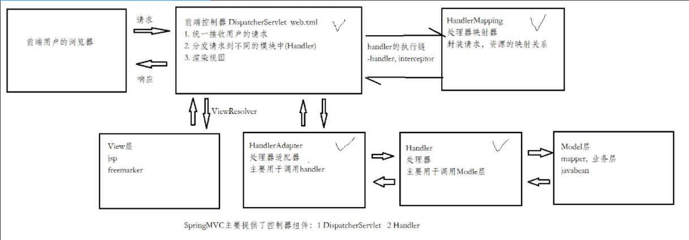
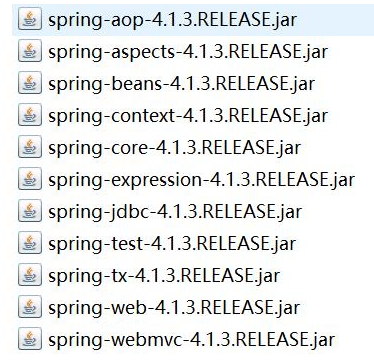
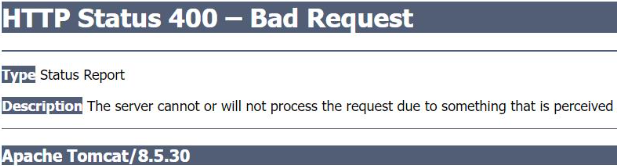
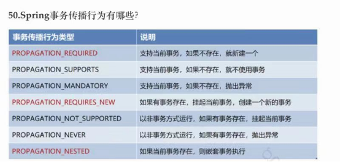
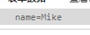
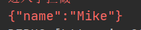

# 一  MVC框架的发展

- struts
- webwork
- struts2   并不是struts的版本的升级，而是以webwork为基础发展的框架。
- springmvc  其实是spring框架的一个模块，发布restful服务


# 二  MVC框架的重要组件 

​     基于MVC设计模式的，凡是MVC框架，重点要解决的是控制器的问题，一般来讲，提供两类的控制器。

- 中央控制器   springmvc提供了前端控制器（DispatcherServlet）,由框架提供，一般用servlet来实现，仅有一个。
- action组件    springmvc提供的handler（处理器），由程序员实现，有n个。

   Springmvc框架的运作流程

   如图：

​    

 主要核心组件 ：

- DispatcherServlet   前端控制器    框架提供     仅有一个
- HandlerMapping     处理器映射器
- HandlerAdapter      处理器适配器
- Handler                   处理器（控制器的一种）
- Interceptor              拦截器（系统和自定义）
- ViewResolver         视图解析器

# 三  Springmvc的入门程序 

实现步骤：

- 添加类库



- 配置web.xml，配置DispatcherServlet

~~~xml
	<!-- 配置前端控制器 -->
	<servlet>
		<servlet-name>dispatcherServlet</servlet-name>
		<servlet-class>org.springframework.web.servlet.DispatcherServlet</servlet-class>
		<init-param>
			<param-name>contextConfigLocation</param-name>
			<param-value>classpath:spring/springmvc.xml</param-value>
		</init-param>
	</servlet>
	<servlet-mapping>
		<servlet-name>dispatcherServlet</servlet-name>
		<url-pattern>*.action</url-pattern>
	</servlet-mapping>
~~~

- 配置springmvc的主配置文件，先以非注解的配置方式

~~~xml
 <!-- 配置非注解的HandlerMapping -->
   <bean class="org.springframework.web.servlet.handler.BeanNameUrlHandlerMapping"></bean>
   <!-- 配置非注解的HandlerAdapter -->
   <bean class="org.springframework.web.servlet.mvc.SimpleControllerHandlerAdapter"></bean>
   <!-- 配置非注解的handler -->
   <bean name="/hello.action" class="com.gec.mvc.controller.HelloController"></bean>
   
	<!-- 配置视图解析器 -->
	<bean class="org.springframework.web.servlet.view.InternalResourceViewResolver">
		<property name="prefix" value="/WEB-INF/pages/"></property>
		<property name="suffix" value=".jsp"></property>
	</bean>
~~~

- 实现非注解的Handler

~~~java
/**
 * 处理器
 * @author chenz
 *
 */
public class HelloController implements Controller {

	@Override
	public ModelAndView handleRequest(HttpServletRequest request, HttpServletResponse response) throws Exception {
		ModelAndView mv = new ModelAndView();  // 业务数据和视图
		mv.addObject("msg", "这是第一个spriingmvc程序");
		mv.setViewName("index"); //  前缀 + index + 后缀
		return mv;
	}

}
~~~


- 注解配置HandlerMapping和HandlerAdapter

~~~xml
    <!-- 配置注解的HandlerMapping -->
    <bean class="org.springframework.web.servlet.mvc.method.annotation.RequestMappingHandlerMapping"></bean>
    <!-- 配置注解的HandlerAdapter -->
    <bean class="org.springframework.web.servlet.mvc.method.annotation.RequestMappingHandlerAdapter"></bean>
~~~

- 实现注解的handler

~~~java
@Controller  //@Component  声明bean并托管  语义
public class TestController {

	//请求映射
	@RequestMapping("/hello")
	public ModelAndView hello() {
		ModelAndView mv = new ModelAndView();
		mv.addObject("msg", "这是注解实现的Handler");
		mv.setViewName("index");
		
		return mv;
	}
}
~~~

- 在springmvc配置文件中扫描controller包

就不用一个controller就加一个bean了

~~~xml
    <!-- 扫描controller包，作用：spring扫描包之下所有的类，读取类中的注解配置 -->
    <context:component-scan base-package="com.gec.mvc.controller"></context:component-scan>
~~~


* 简化HandlerMapping和HandlerAdapter的配置

~~~xml
      <mvc:annotation-driven></mvc:annotation-driven>
~~~


# 四 springmvc的请求方法的返回类型定义

~~~xml
<!-- 视图解析器 -->
    <bean
            class="org.springframework.web.servlet.view.InternalResourceViewResolver">
        <property name="prefix" value="/"/>
        <property name="suffix" value=".jsp"/>
    </bean>
~~~


- 返回ModelAndView

~~~java
//请求映射
	@RequestMapping("/hello")
	public ModelAndView hello() {
		ModelAndView mv = new ModelAndView();
        //默认的作用域是request
		mv.addObject("msg", "这是注解实现的Handler");
        //转向的视图
		mv.setViewName("index");
		return mv;
	}
~~~


- 返回String ，表示返回的是视图名

~~~java
@RequestMapping("/hello1")
	public String hello1() {
		return "index";//不用jsp是因为视图解析器默认了jsp
	}
~~~

- 返回自定义对象（业务数据，json格式），主要用于json数据的交互（后续课程会讲解）


## 转发和重定向问题

转发和重定向只需在要返回的视图前加forward（默认）或redirect如:

~~~java
return "redirect:/index";
~~~

**注意：**如果是用setViewName使用重定向，视图是需要加后缀的

~~~java
mv.setViewName("redirect:/index.jsp");//因为他不经过视图解析器
~~~


# 五 springmvc的请求方法的参数列表

- 默认接口注入的参数

~~~java
@RequestMapping("/hello2")
	public String hello2(Model model) {
		model.addAttribute("msg", "保存在Model作用域中的数据");
		return "index";
	}

	@RequestMapping("/hello3")
	// 使用原生的接口
	public String hello3(HttpServletRequest request, HttpServletResponse response, HttpSession session) {
		request.setAttribute("mike", "mike in request scope");
		session.setAttribute("mike", "mike in session scope");
		return "index";
	}
~~~


- 简单数据类型的参数提交

~~~java
@RequestMapping(value="/hello4",method=RequestMethod.GET)	//限制只能get请求才能访问
	// 使用原生的接口
	public String hello4(String username, int age) {
		System.out.println(username);
		System.out.println(age);
		return "index";
	}
~~~

简单类型数据，Springmvc默认会做类型转换，框架提供了默认的类型转换器（系统和自定义）

提交参数类型转换失败，报异常：




- 自定义对象类型的参数绑定，使用表单提交

~~~java
@RequestMapping(value = "/doLogin", method = RequestMethod.POST)
	public String doLogin(User user) {
		System.out.println(user.getUsername());
		System.out.println(user.getPassword());
		return "index";
	}
~~~

  表单建议使用post，在web.xml中配置编码过滤器

~~~xml
<!-- 配置中文编码的过滤器 -->
	<filter>
		<filter-name>encoding</filter-name>
		<filter-class>org.springframework.web.filter.CharacterEncodingFilter</filter-class>
		<init-param>
			<param-name>encoding</param-name>
			<param-value>UTF-8</param-value>
		</init-param>
	</filter>
	<filter-mapping>
		<filter-name>encoding</filter-name>
		<url-pattern>/*</url-pattern>
	</filter-mapping>
~~~


- 自定义类型转换器 

(1) 实现日期类型转换类

~~~java
public class DateConverter implements Converter<String, Date> {
	
	SimpleDateFormat sdf = new SimpleDateFormat("yyyy-MM-dd");

	@Override
	public Date convert(String time) {
		try {
			return sdf.parse(time);
		} catch (ParseException e) {
			//e.printStackTrace();
			
		}
		//return null;   //表示 springmvc可以接收null值 ，不报异常，程序继续，不会终止
		throw new IllegalArgumentException();  //类型转换失败，报400错误，程序终止
	}

}
~~~

(2) 在springmvc.xml配置

~~~xml
<mvc:annotation-driven conversion-service="conversionService"></mvc:annotation-driven>
    <bean id="conversionService" 
		class="org.springframework.format.support.FormattingConversionServiceFactoryBean">
		<property name="converters">
			<list>
				<bean class="converter.DateConverter" />
			</list>
		</property>
	</bean>
~~~


- 数组类型参数

~~~java
@RequestMapping("/getTime")
	//前端复选框用数组接受
	public String getTime(Date birthday,String[] hobbies) {
		System.out.println(birthday);
		
		for (String hobby : hobbies) {
			System.out.println(hobby);
		}
		
		return "index";
	}
~~~


- 路径传参

（1）传统的url: [http://localhost:8080/springmvc-demo-2233/getTime.action?sername=mike&age=20](http://localhost:8080/springmvc-demo-2233/getTime.action?username=mike&age=20)

（2）restful风格的路径： http://localhost:8080/springmvc-demo-2233/getTime/mike/20/广州/.../...

 修改DispatcherServlet的统一入口，改为无后缀的访问

~~~xml
 	<!-- 配置前端控制器 -->
	<servlet>
		<servlet-name>dispatcherServlet</servlet-name>
		<servlet-class>org.springframework.web.servlet.DispatcherServlet</servlet-class>
		<init-param>
			<param-name>contextConfigLocation</param-name>
			<param-value>classpath:spring/springmvc.xml</param-value>
		</init-param>
	</servlet>
	<servlet-mapping>
		<servlet-name>dispatcherServlet</servlet-name>
        <!--修改-->
		<url-pattern>/</url-pattern>
	</servlet-mapping>
~~~

说明：

  ‘  /   ’表示不带后缀的访问地址，'  /*  ‘ 表示所有的地址，不要定义’  /*  ‘   

Handler的定义：

~~~java
	@RequestMapping("/getHello4/{username}/{age}")
	public String getHello4(@PathVariable String username,@PathVariable int age) {
		System.out.println(username);
		System.out.println(age);
		return "index";
	}
~~~


# 六 SSM项目中补充知识点

### 1. Controller中的方法接受参数时用到的注解

* restful风格传参需要用到  @PathVariable  标注参数
* @RequestParam   修饰参数，有三个属性，value="" 是前端传入的数据名，这时方法的形参名可以和前端传入的值不一样，但是要和value中的一样；required=true/false,表示改字段是否是必须的；defaultValue="",可以自定义一个默认值，如果前端传入的数据中没有这个参数就使用默认值
* @ModelAttribute  表示接受到参数后放入请求域中，多用于数据回显
* @Validated  表示其标注的参数需要进行校验，读取参数中的注解进行校验。BindingResult是用来存储校验的错误信息的，使用的话就必须**紧跟**在被校验参数的后面

~~~java
//判断校验是否通过
if (bindingResult.hasErrors()) {
    //获取所有错误信息
    List<FieldError> errorList = bindingResult.getFieldErrors();
    for (FieldError error : errorList) {
        //返回字段名对应的错误,方便于做错误信息的显示
        model.addAttribute(error.getField(), error.getDefaultMessage());
    }
    return "register";
}
~~~


### 2.SSM项目做单元测试需要配置环境

需要对单元测试类使用一下注解标注

~~~java
@RunWith(SpringJUnit4ClassRunner.class)
//改注解扫描spring的配置文件
@ContextConfiguration("classpath:spring/applicationContext-*.xml")
~~~


### 3.SpringMVC全局捕获异常

~~~java
//定义一个类用来捕获全局异常，当发生异常时不是将错误信息直接展示在网页上
@ControllerAdvice
public class GlobalExceptionHandler {
	/**
	 * @param request
	 * @param e
	 * @return 错误信息
	 * @ResponseBody 返回json数据
	 * @ExceptionHandler 要捕获的异常
	 */
	@ResponseBody	//表示返回的数据为json类型，框架会自动转换
	@ExceptionHandler(value = Exception.class)	//表示要捕获的异常
	public Map<String, Object> handleException(HttpServletRequest request, Exception e) {
		HashMap<String, Object> map = new HashMap<>();
		e.printStackTrace();
		map.put("code", 500);
		map.put("msg", "发生了异常");
		map.put("data", "");

		return map;
	}
}
~~~


### 4.数据校验

使用springMVC的校验功能

配置:

~~~xml
<mvc:annotation-driven conversion-service="conversionService" validator="validator"/>


<!-- 校验器 -->
    <bean id="validator"
          class="org.springframework.validation.beanvalidation.LocalValidatorFactoryBean">
        <!-- hibernate校验器 -->
        <property name="providerClass" value="org.hibernate.validator.HibernateValidator"/>
        <!-- 指定校验使用的资源文件，在文件中配置校验错误信息，如果不指定则默认使用classpath下的ValidationMessages.properties -->
        <property name="validationMessageSource" ref="messageSource"/>
    </bean>

    <!-- 校验错误信息配置文件   xxx.properties -->
    <bean id="messageSource"
          class="org.springframework.context.support.ReloadableResourceBundleMessageSource">
        <!-- 资源文件名 基名-->
        <property name="basenames">
            <list>
                <!-- properties文件，可以用来管理校验出错时的错误信息。存储的同样是键值对-->
                <value>classpath:CustomValidationMessages</value>
            </list>
        </property>
        <!-- 下面这行设置错误信息的编码，使得中文在网页上不会乱码-->
        <property name="defaultEncoding" value="utf-8"></property>
        <!-- 资源文件编码格式 -->
        <property name="fileEncodings" value="utf-8"/>
        <!-- 对资源文件内容缓存时间，单位秒 -->
        <property name="cacheSeconds" value="120"/>
    </bean>
~~~


* 对javaBean的校验，在类中使用注解定义校验规则，在Controller中使用@Validated  注解标注JavaBean

~~~java
public class Auctionuser {
    private Integer userid;

	@Size(min=3,max = 6,message = "{usernameError}")
    private String username;

    @Size(min=6,message = "{userpasswordError}")
    private String userpassword;

    @Pattern(regexp = "^\\d{18}$",message = "{usercardnoError}")
    private String usercardno;
 ......
~~~

~~~java
@RequestMapping("/register")
	public String register(@Validated @ModelAttribute("registerUser") Auctionuser user, BindingResult bindingResult,Model model) {
~~~


* 对于不是javaBean的类型需要其他配置方式


### 5.SpringMVC拦截器

用来拦截页面，自定义拦截规则

配置：

~~~xml
<!-- 配置拦截器 -->
    <mvc:interceptors>

        <mvc:interceptor>
            <mvc:mapping path="/**"/>
            <!--
            <mvc:exclude-mapping path="/js/**"/>
            <mvc:exclude-mapping path="/images/**"/>
            <mvc:exclude-mapping path="/css/**"/>
            -->
            <!-- 拦截器类 -->
            <bean class="interceptor.CheckUserInterceptor"></bean>
        </mvc:interceptor>

    </mvc:interceptors>
~~~


定义一个拦截器可以通过两种方式：一种是通过实现 HandlerInterceptor 接口或继承 HandlerInterceptor 接口的实现类来定义；另一种是通过实现 WebRequestInterceptor 接口或继承 WebRequestInterceptor 接口的实现类来定义。

定义一个类实现HandlerInterceptor接口,会重写三个方法

* preHandle,在执行handler之前拦截并执行
* postHandle，在handler执行return之前执行
* afterCompletion，在handel执行完return后即执行完handel后执行

~~~java
public class CheckUserInterceptor implements HandlerInterceptor {
	@Override
	public boolean preHandle(HttpServletRequest request, HttpServletResponse response, Object handler) throws Exception {
		System.err.println("进入了拦截");
		HttpSession session = request.getSession();

		String uri = request.getRequestURI();

		if (uri.contains("doLogin") || uri.contains("register")) {
			return true;
		}


		if (session.getAttribute("user") != null) {
			//已登录，放行
			return true;
		} else {
			response.sendRedirect("login.jsp");
			return false;
		}
	}

	@Override
	public void postHandle(HttpServletRequest request, HttpServletResponse response,
						   Object handler, ModelAndView mv) throws Exception {

	}

	@Override
	public void afterCompletion(HttpServletRequest request, HttpServletResponse response,
								Object handler, Exception e) throws Exception {

	}
}
~~~


### 6.SpringMVC文件上传

表单：

要设置enctype属性

~~~jsp
<form action="${pageContext.request.contextPath}/publishAuctions"
      enctype="multipart/form-data" method="post">
~~~

上传控件：

type="file"

~~~jsp
<input id="imageInput" onchange="loadImageFile();" name="pic" type="file" class="offset10 lf"/>
~~~


在SpringMVC的配置文件中添加文件上传支持

~~~xml
	<!-- 支持文件上传 -->
    <bean id="multipartResolver"
          class="org.springframework.web.multipart.commons.CommonsMultipartResolver">
        <property name="maxUploadSize" value="104857600"/>
        <property name="maxInMemorySize" value="4096"/>
        <property name="defaultEncoding" value="UTF-8"></property>
    </bean>
~~~


上传的文件是以二进制形式传输

后端接受使用    MultipartFile pic   参数就收

处理上传的文件

~~~java
		try {
			String path = session.getServletContext().getRealPath("upload");
			System.err.println(path);

			File file = new File(path, pic.getOriginalFilename());
			pic.transferTo(file);

             //存入数据的操作
			auction.setAuctionpic(pic.getOriginalFilename());
			auction.setAuctionpictype(pic.getContentType());
		} catch (IOException e) {
			e.printStackTrace();
		}
~~~

这里是将文件保存在服务器的项目中


### 7.Spring声明式事务管理（还有一种是编程式事物管理）

使用了AOP实现

在spring的框架中，使用aop编程来实现事务管理，对目标业务方法进行事务的增强。声明式事务管理是AOP在spring框架中的“特例”。声明式指的是无需硬编码，只需配置。


在spring框架中，声明式事务管理分两种：

- 注解xml配置

~~~xml
<!-- 1. 配置事务管理器 -->
	<bean id="txManager" class="org.springframework.jdbc.datasource.DataSourceTransactionManager">
		<property name="dataSource" ref="dataSource"></property>
	</bean>
	<!-- 2。 开启注解的事务管理 -->
	<tx:annotation-driven transaction-manager="txManager"/>
~~~

在业务类或业务方法上使用  @Transactional  注解标注即可开启事务

~~~java
@Transactional(propagation=Propagation.REQUIRED)
~~~


- xml配置

~~~xml
<!-- 配置声明式事务 -->
	<!-- 1. 配置事务管理器 -->
	<bean id="txManager" class="org.springframework.jdbc.datasource.DataSourceTransactionManager">
		<property name="dataSource" ref="dataSource"></property>
	</bean>
	
	<!-- 配置事务通知(advice)  -->
	<tx:advice id="txAdvice" transaction-manager="txManager">
		<tx:attributes>
			<tx:method name="add*" propagation="REQUIRED"/>
			<tx:method name="remove*" propagation="REQUIRED"/>
			<tx:method name="update*" propagation="REQUIRED"/>
			<tx:method name="query*" read-only="true" />
			<tx:method name="find*" read-only="true" />
			<tx:method name="select*" read-only="true" />
		</tx:attributes>
	</tx:advice>
	<!-- 事务织入 -->
	<aop:config>
		<aop:advisor advice-ref="txAdvice" pointcut="execution(* com.web.auction.service.impl.*.*(..))"/>
	</aop:config>
~~~


  事务传播途径（propagation）

~~~java
public void doService1() {
    //......
    doService2();
    //........
}
~~~

- REQUIRED   当前方法要事务环境，如果已经有事务就不创建，使用当前的事。如果没有事务就要创建。
- REQUIRES_NEW  当前方法要有独立的事务环境，如果已经有事务，也要创建新的事务环境。
- SUPPORTS  当前方法支持事务环境，如果已经有事务就不创建，支持当前事务，如果没有也不创建。
- MANDATORY  强制  如果当前存在事务，则加入事务。如果不存在事务，则抛出异常




### 8.json交互

#### 接受json

前端不是使用json数据请求：使用的是key/value的形式，contentType是默认的application/x-www-form-urlencoded

后端不需要使用@RequestBody标注参数

```js
$.ajax({
    type: 'post'
    , url: 'checkUsername'
    , contentType: "application/json;charset=utf-8"
    
    
    , data: {
        name: user_name
    }
    
    
    
    , success: function (result) {
        console.log(result)
        if (result == "false") {
            $("#error").text("用户名已存在")
            $('#error').attr("class", "red")
        } else {
            $("#error").text("用户名可用")
            $('#error').attr("style", "color:green")
        }
    }
})
```

这样data传送的是key/value，是不带{}的


前端使用json数据请求

contentType需要设置为：application/json

后端需要用@RequestBody标注参数

~~~js
, data: '{"username":"' + user_name + '"}'
~~~

传输的data是带{}的

后端是靠对象参数中的字段对应json数据，即使一个数据用String接受，无法将json解析，就会变为

{}表示对象，里面的键值对对应对象中的字段。


##### 用对象接受json

这里的json数据是指请求中body中的数据，前端不能这样写，参照上面

~~~java
{
    "userName":"mayikt",
    "age":22,
    "mayiktUserInfo":{
        "addres":"yushengjun"
    }
}

@RequestMapping("/demo06")
    @ResponseBody
    public String demo06(@RequestBody MayiktUserEntity mayiktUserEntity) {
        return mayiktUserEntity.toString();
    }
~~~


##### 以Map接收

json数据  key是为 Map的key    value Map的value

需要注意json数据value与Map集合value类型保持一致否则报错

~~~java
@RequestMapping("/demo08")
    @ResponseBody
    public String demo08(@RequestBody Map<String, String> paramMap) {
        return paramMap.toString();
    }
~~~


##### 以List接收

~~~java
[
    {
        "userName": "mayikt",
        "age": "20"
    },
        {
        "userName": "mayikt",
        "age": "22"
    }
]

@RequestMapping("/demo10")
    @ResponseBody
    public String demo10(@RequestBody List<MayiktUserEntity> list) {
        return list.toArray().toString();
    }
~~~


#### 响应json

在方法上加上@ResponseBody  根据该方法返回值 返回对应json数据 底层 根据返回值 序列化成json数据

~~~java
	@RequestMapping("/checkUsername")
	@ResponseBody
	public String checkUsername(@RequestBody String name) {
    ......
    }
~~~

@ResponseBody  还可以用来标注类，表示该类中的所有方法都响应JSON数据


### 9.全局异常捕获

使用 @ControllerAdvice 注解标注类，表示该类用于全局捕获异常

该类中的方法使用 @ExceptionHandler 标注，value为该方法处理的异常

~~~java
@ControllerAdvice
public class GlobalExceptionHandler {
	/**
	 * @param request
	 * @param e
	 * @return 错误信息
	 * @ResponseBody 返回json数据
	 * @ExceptionHandler 要捕获的异常
	 */
	@ResponseBody
	@ExceptionHandler(value = Exception.class)
	public Map<String, Object> handleException(HttpServletRequest request, Exception e) {
		HashMap<String, Object> map = new HashMap<>();
		e.printStackTrace();
		map.put("code", 500);
		map.put("msg", "发生了异常");
		map.put("data", "");

		return map;
	}

	@ExceptionHandler(value = recordException.class)
	public ModelAndView handlerecordException(HttpServletRequest request, Exception e) {
		ModelAndView mv = new ModelAndView();
		mv.addObject("errorMsg", e.getMessage());
		mv.setViewName("error");

		return mv;
	}
}
~~~

