# 一  什么是工作流

由多任务人协同完成的一个复杂的工作流，例如，OA系统使用最多。

工作流框架：处理复杂业务流的业务框架，开源使用最多的是Activiti。

# 二 Activiti框架的特点

1. 把复杂的业务流进行图形化处理

2. 图形化处理业务部署到数据库中（数据库化）

3. 流程数据库，共有23张表。

4. 提供了一套API，就是业务对象(service)，框架本身是一个半成品的系统

5. 持久层的实现就是mybatis

6. 所以，activiti是一个业务框架（系统）

# 三 Activiti框架的准备

（1）安装activiti的绘图插件

  把activiti插件包解压：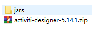

把jars文件夹中的jar包，复制到eclipse的plugins目录中

打开eclipse，以归档方式安装插件，如下图：新版安装有问题

（2）安装流程数据库，一共有23张表

- 纯jdbc

  ~~~java
  	@Test
  	public void testJdbc(){
  		 ProcessEngineConfiguration configuration = ProcessEngineConfiguration.createStandaloneProcessEngineConfiguration();
  		 configuration.setJdbcDriver("com.mysql.jdbc.Driver");
  		 configuration.setJdbcUrl("jdbc:mysql://localhost:3306/activitidb2233?createDatabaseIfNotExist=true&useUnicode=true&characterEncoding=utf8");
  		 configuration.setJdbcUsername("agentsystem");
  		 configuration.setJdbcPassword("888");
  		 
  		 //如果当前数据库已经有表，则不创建，没有才创建
  		 configuration.setDatabaseSchemaUpdate(ProcessEngineConfiguration.DB_SCHEMA_UPDATE_TRUE);
  		 
  		 ProcessEngine processEngine = configuration.buildProcessEngine();
  		 System.out.println("流程引擎对象：" + processEngine);
  	}
  ~~~

  

* 以spring方式

~~~java
	@Test
	public void testSpring(){
		 ProcessEngineConfiguration configuration = ProcessEngineConfiguration.createProcessEngineConfigurationFromResource("activiti.cfg.xml");
		 
		 ProcessEngine processEngine = configuration.buildProcessEngine();
		 System.out.println("流程引擎对象：" + processEngine);
	}
~~~

# 四  Activiti常用的流程操作

（1）流程图的基本要素

- 开始节点
- 结束节点
- 任务节点
- 待办人分配（固定名、表达式、程序分配）

（2）常用的数据库表

- act_re_deployment            流程部署表
- act_re_procdef                   流程定义表
- act_ge_bytearray                流程定义资源表
- act_ru_execution                正在运行的流程实例执行表
- act_ru_task                         正在运行的任务的实例表
-  act_hi_procinst                   流程实例历史表
- act_hi_taskinst                     流程实例的任务历史表

（3）业务对象（service）

~~~java
ProcessEngine processEngine=ProcessEngines.getDefaultProcessEngine();//默认读取activiti.cfg.xml
~~~

processEngine的业务方法

- processEngine.getRepositoryService()       主要操作流程**定义**，部署流程定义图
- processEngine.getRuntimeService()           主要操作流程**实例**相关业务
- processEngine.getTaskService()                 主要操作活动的**任务节点**相关业务
- processEngine.getHistoryService()              主要操作**历史数据**的相关业务

（4）常用的业务操作

- 部署流程定义  ， 流程定义指的是复杂业务的“模板”，相当于类的概念

~~~java
	@Test
	public void testDeployProcess() {
		Deployment deployment = processEngine.getRepositoryService()
											.createDeployment()
											.name("hello入门程序")
											.addClasspathResource("diagram/HelloProcess.bpmn")
											.addClasspathResource("diagram/HelloProcess.png")
											.deploy();
		System.out.println("部署id:" + deployment.getId());
		System.out.println("部署名称：" + deployment.getName());
	}
~~~

- 启动流程实例    指的是具体某一次的流程操作，相当于对象

~~~java
	@Test
	public void testStartProcess() {
		String key = "helloProcess";
		ProcessInstance pi = processEngine.getRuntimeService().startProcessInstanceByKey(key );
		System.out.println("流程实例id:" + pi.getId());
		System.out.println("流程定义id:" + pi.getProcessDefinitionId());
	}
~~~

## 简单的入门程序：

### 部署流程定义

画一个流程图：

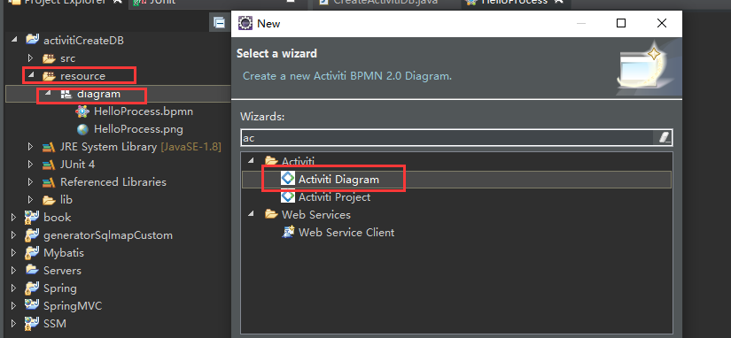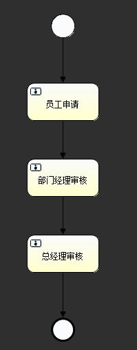   

设置流程图的id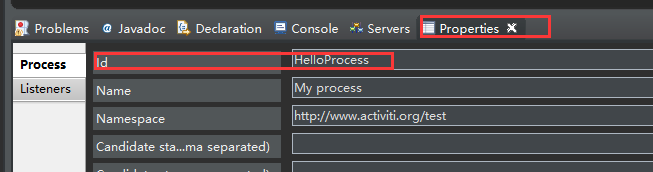

更改任务节点名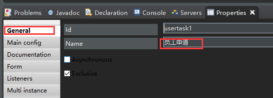

代办人分配，先使用固定名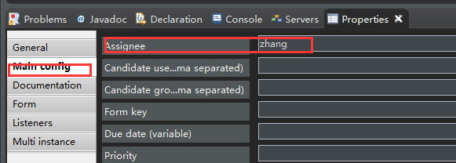

将流程图部署到数据库中

~~~java
ProcessEngine processEngine=ProcessEngines.getDefaultProcessEngine();//默认读取activiti.cfg.xml
	
	//将流程图部署到数据库
	@Test
	public void testDeployProcess(){
		//部署流程定义
		Deployment deploy = processEngine.getRepositoryService()
											.createDeployment()		//得到一个部署对象
											.name("hello入门程序")
											.addClasspathResource("diagram/HelloProcess.bpmn")
											.addClasspathResource("diagram/HelloProcess.png")
											.deploy();	//业务方法，对数据库表进行操作，部署流程
		
		System.out.println("部署id："+deploy.getId()+",部署的名称"+deploy.getName());
	}
~~~

输出：

- act_re_deployment            流程部署表

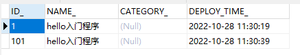

- act_re_procdef                   流程定义表

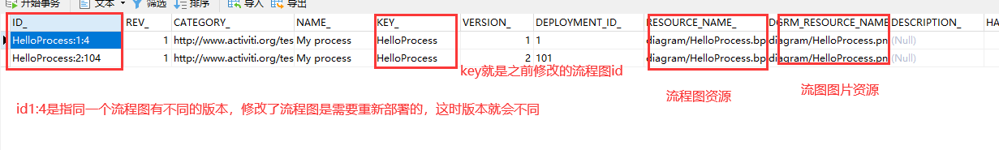

还有一个DEPLOYMENT_id，部署id，外键依赖于流程部署表

- act_ge_bytearray                流程定义资源表

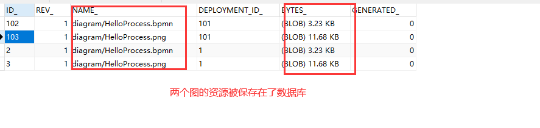

### 启动流程实例

使用业务对象启动

processEngine.getRuntimeService() 

~~~java
	@Test
	public void testStartProcess() {
		String key = "helloProcess";
        //有很多启动方式，一般用key，这个key就是上面流程定义表中的key。最终返回流程实例
		ProcessInstance pi = processEngine.getRuntimeService().startProcessInstanceByKey(key);
		System.out.println("流程实例id:" + pi.getId());
		System.out.println("流程定义id:" + pi.getProcessDefinitionId());
	}
~~~

通过流程实例来实现业务工作的流动

有对应的表来记录

act_ru_execution                正在运行的流程实例执行表

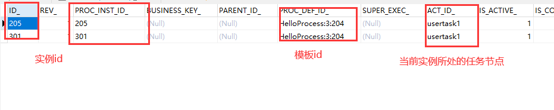

act_ru_task                         正在运行的任务的实例表

 act_hi_procinst                   流程实例历史表

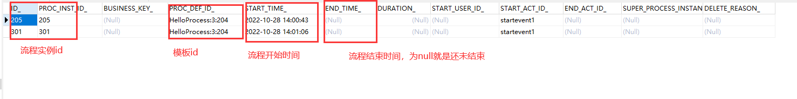

### 查找我的待办事务

查询我的待办事务，每个节点的角色不同，待办事务也不同

~~~java
@Test
	public void testFindTask(){
		List<Task> list = processEngine.getTaskService()
										.createTaskQuery()
										.taskAssignee("zhang")		//根据待办人的名字查询
										.list();
		for (Task task : list) {
			System.out.println("任务id："+task.getId());
			System.out.println("任务所属流程实例id"+task.getProcessInstanceId());
			System.out.println("任务所属流程定义id"+task.getProcessDefinitionId());
		}
	}
~~~

### 流程的推进

~~~java
@Test
	public void testfinishTask() {
		processEngine.getTaskService().complete("208");// 传入任务id
	}
~~~

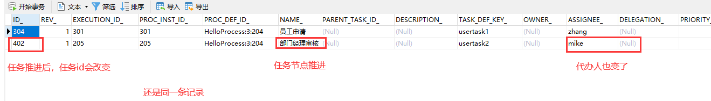

继续推进

再推进结束了

task表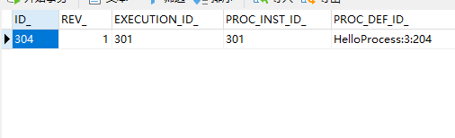execution表

procinst表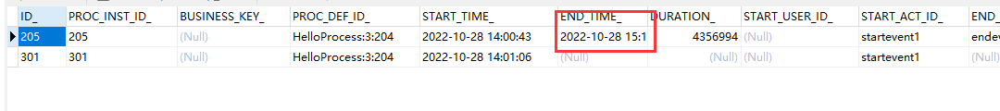

流程实例结束

act_hi_taskinst                     流程实例的任务历史表

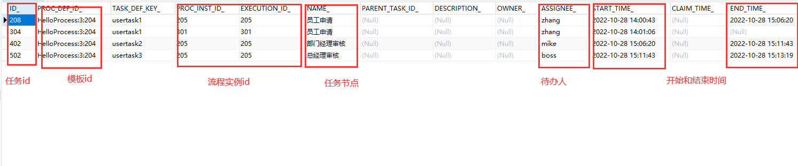

### 查看流程定义图

~~~java
// 查看流程定义图,将数据库中的图取出来
	@Test
	public void testViemPic() throws IOException {
		InputStream is = processEngine.getRepositoryService().getResourceAsStream("201", "diagram/HelloProcess.png");// 部署id，资源名称

		FileUtils.copyInputStreamToFile(is, new File("C:/Users/15524/桌面/HelloProcess.png"));
	}
~~~

### 判断流程实例是否结束

~~~java
// 判断流程实例是否结束
	@Test
	public void testTaskfinish() {
		ProcessInstance pi = processEngine.getRuntimeService()
											.createProcessInstanceQuery()	//先查出流程实例
											.processInstanceId("205")
											.singleResult();
		
		//这里的查询是一个业务方法，并不是单纯查询数据库是否有这条记录，里面还会去判断endtime是否为空，为空返回null
		if(pi!=null){
			System.out.println("流程实例正在运行");
		}else{
			System.out.println("流程实例结束");
		}
	}
~~~

### 删除流程定义

~~~java
@Test
	public void testRemoveProcess() {
		processEngine.getRepositoryService().deleteDeployment("201", true);// 部署id和是否级联删除（默认false）
	}
~~~

# 五  连线分支

画一个分支图

 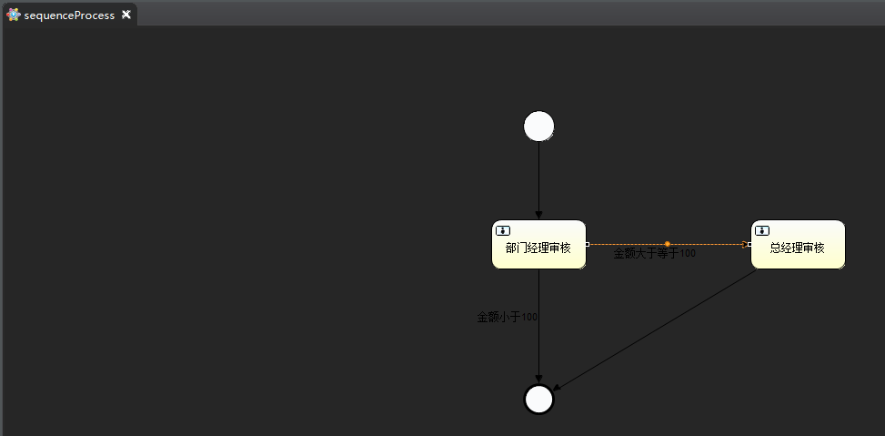

同样修改节点名称和加上待办人

点中线，添加描述

 

使用表达式来设置走哪条分支的条件

 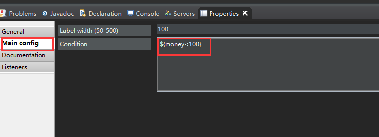

另一条同理

当流程推进时传一个同名的参数过来就可以实现判断

~~~java
@Test
	public void testfinishTask() {
		HashMap<String, Object> map = new HashMap<>();
		map.put("money", 200);
		processEngine.getTaskService().complete("804", map);// 传入任务id和map，map作为分支判断
	}
~~~

继续推进，不需要的参数不要传

~~~java
processEngine.getTaskService().complete("903");
~~~

结束：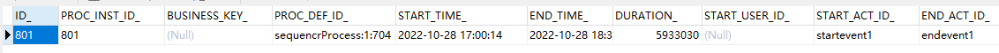

# 六 待办人分配

之前说过有三种方式

待办人分配（固定名、表达式、程序分配）

固定名一般用来做测试，在实际应用中待办人可能会有多个，所以待办人应该是动态的。下面看后面两种

### 1. 表达式

待办人分配由启动流程时传入。

比如张三登录了系统，发起一个审核，这时启动流程的时候就将张三的id传入，这样就实现了动态分配待办人

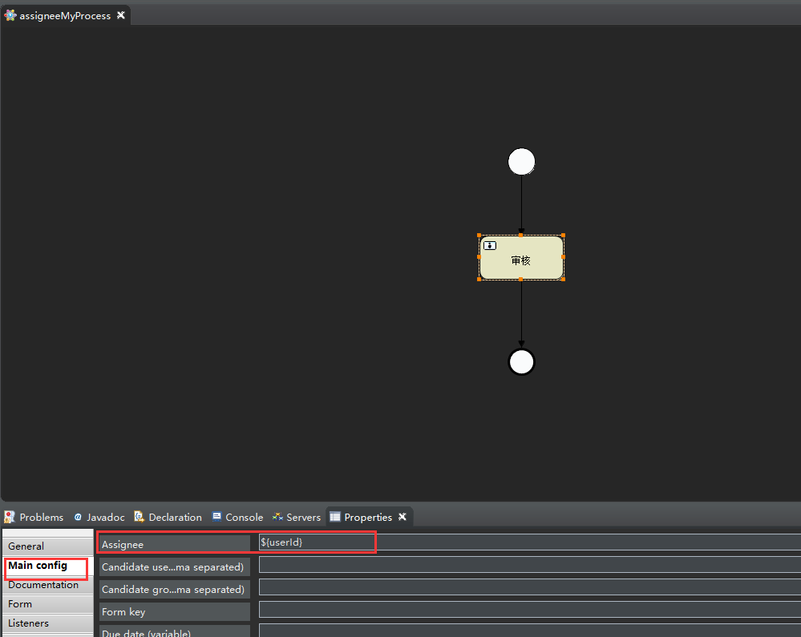

之后将流程部署到数据库。这里新增一种部署方式，实际中使用网页添加流程时是不可能改变代码的，这种情况就需要用文件上传的方式将文件上传后部署。上传的这个文件bpmn和其png的压缩文件，要打包成zip文件。

 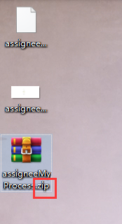

通过添加zip包的方式部署流程

~~~java
// 将流程图部署到数据库
	@Test
	public void testDeployProcess() throws FileNotFoundException {
        //这里用本地文件做例子，实际开发网页的由文件上传中得来
		ZipInputStream zis = new ZipInputStream(
				new FileInputStream(new File("C:/Users/15524/桌面/assigneeMyProcess.zip")));
		// 部署流程定义
		Deployment deploy = processEngine.getRepositoryService()
											.createDeployment().name("表达式分配待办人")
											.addZipInputStream(zis)
											.deploy();

		System.out.println("部署id：" + deploy.getId() + ",部署的名称" + deploy.getName());
	}
~~~

测试：

启动流程实例：

~~~java
@Test
	public void testStartProcess() {
		String key = "assigneeProcess";//流程定义的id
		HashMap<String, Object> map = new HashMap<>();
		map.put("userId", "zhangsan");
        //因为要传一个待办人名称过去，所以要多穿一个参数
		ProcessInstance pi = processEngine.getRuntimeService().startProcessInstanceByKey(key, map);
		System.out.println("流程实例id:" + pi.getId());
		System.out.println("流程定义id:" + pi.getProcessDefinitionId());
	}
~~~

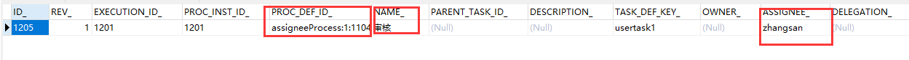

### 2.程序分配（监听程序）

使用程序的原因是因为假设一个员工发起了审批，审批推进时会发给这个员工所在部门的部门经理，那这个时候就需要去数据库查询出数据后在进行推进，因为每个员工所在部门可能不一样，直属领导不一样。

同样地配置好properties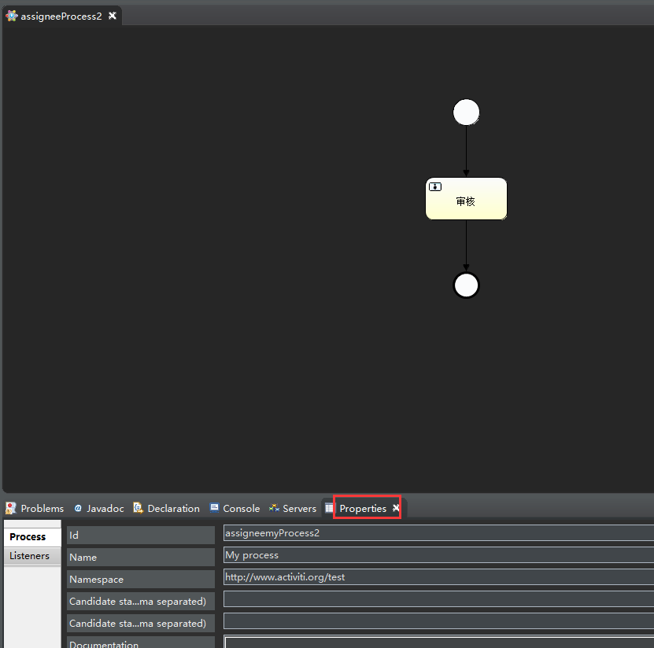

不同的就是任务节点的待办人是通过程序分配的，这时是在listeners中添加类的。如下，给节点添加一个监听器类，这样在进入这个节点时就会调用监听器中的方法

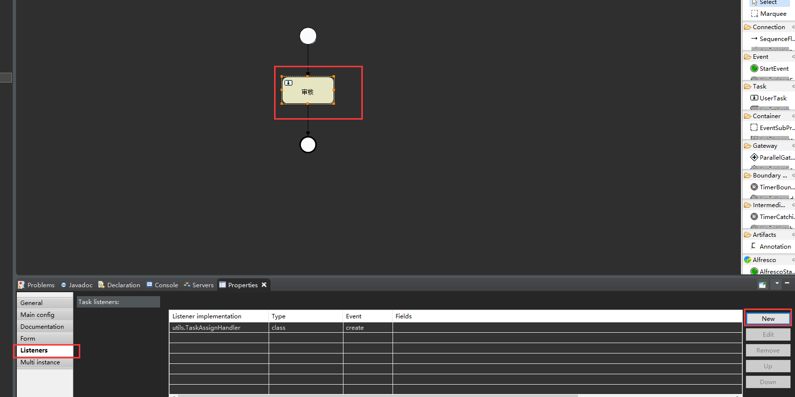

监听程序：

~~~java
//不要导错包
import org.activiti.engine.delegate.DelegateTask;
import org.activiti.engine.delegate.TaskListener;

public class TaskAssignHandler implements TaskListener {

	@Override
	public void notify(DelegateTask task) {
		
		//查询业务数据....
		
		//这里只做演示...
		//设置待办人
		task.setAssignee("boss");
	}

}
~~~

测试:

~~~java
@Test
	public void testDeployProcess() {
		// 部署流程定义
		Deployment deploy = processEngine.getRepositoryService().createDeployment()//得到一个部署对象
									.name("程序分配待办人")
            						 .addClasspathResource("diagram/assigneeProcess2.bpmn")
            						 .addClasspathResource("diagram/assigneeProcess2.png")
									.deploy();

		System.out.println("部署id：" + deploy.getId() + ",部署的名称" + deploy.getName());
	}
// 启动流程实例
	@Test
	public void testStartProcess() {
		String key = "assigneemyProcess2";
		ProcessInstance pi = processEngine.getRuntimeService().startProcessInstanceByKey(key);
		System.out.println("流程实例id:" + pi.getId());
		System.out.println("流程定义id:" + pi.getProcessDefinitionId());
	}
~~~

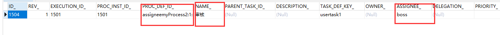

# 七 Activiti和SSM的整合

Spring如何整合Activiti，托管Activiti

Activiti核心就是ProcessEngine   和xxxService,将它们托管给Spring容器

使用xml配置

activiti-context.xml:

~~~xml
<?xml version="1.0" encoding="UTF-8"?>
<beans xmlns="http://www.springframework.org/schema/beans"
xmlns:context="http://www.springframework.org/schema/context" xmlns:tx="http://www.springframework.org/schema/tx"
xmlns:xsi="http://www.w3.org/2001/XMLSchema-instance"
xsi:schemaLocation="http://www.springframework.org/schema/beans http://www.springframework.org/schema/beans/spring-beans.xsd
http://www.springframework.org/schema/context http://www.springframework.org/schema/context/spring-context-2.5.xsd
http://www.springframework.org/schema/tx http://www.springframework.org/schema/tx/spring-tx-3.0.xsd">

	<!-- spring负责创建流程引擎的配置文件 -->
	<bean id="processEngineConfiguration" class="org.activiti.spring.SpringProcessEngineConfiguration">
		<!-- 数据源 -->
		<property name="dataSource" ref="dataSource" />
		<!-- 配置事务管理器，统一事务 -->
		<property name="transactionManager" ref="transManager" />
		<!-- 设置建表策略，如果没有表，自动创建表 -->
		<property name="databaseSchemaUpdate" value="true" />
	</bean>
	<!-- 创建流程引擎对象 -->
	<bean id="processEngine" class="org.activiti.spring.ProcessEngineFactoryBean">
		<property name="processEngineConfiguration" ref="processEngineConfiguration" />
	</bean>
	
	<!-- 由流程引擎对象，提供的方法，创建项目中使用的Activiti工作流的Service -->
	<bean id="repositoryService" factory-bean="processEngine" factory-method="getRepositoryService" />
	<bean id="runtimeService" factory-bean="processEngine" factory-method="getRuntimeService" />
	<bean id="taskService" factory-bean="processEngine" factory-method="getTaskService" />
	<bean id="historyService" factory-bean="processEngine" factory-method="getHistoryService" />
	<bean id="formService" factory-bean="processEngine" factory-method="getFormService" />
	
</beans>

~~~

在applicationContext.xml配置文件中导入

~~~xml
	<!-- 导入相关配置 -->
	<import resource="classpath:spring/activiti-context.xml"/>
~~~

