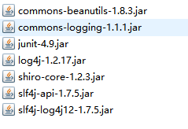
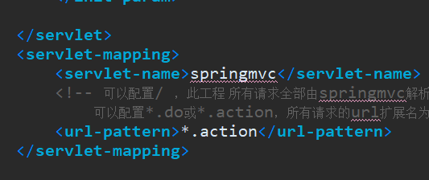
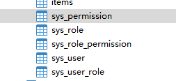

# 一 shiro框架简介

shiro是apache下的，是一个安全性框架（区分solr,是分布式中的搜索框架）

spring中也有Spring security，两个框架都差不多

spring也能很好的整合shrio


shiro较轻量级（与Spring security比），入门简单，不依赖于spring，传统的ssm项目使用较多。

Spring security较复杂，入门较难，属于spring框架中的模块，多用于springboot+springcloud分布式前后端分离应用中。


## 什么是shiro

Apache Shiro是一个强大而灵活的开源安全框架，它能够干净利落地处理身份认证，授权，企业会话管理和加密。

功能：

1. 验证用户
2. 对用户执行访问控制，如：
   * 判断用户是否拥有角色admin。
   * 判断用户是否拥有访问的权限
3. 在任何环境下使用 Session API。例如CS程序。
4. 可以使用多个用户数据源。例如oracle、mysql。
5. 单点登录（SSO）功能。
6. “Remember Me”服务 ，类似购物车的功能，shiro官方建议开启。


# 二 安全性框架的应用场景

* 用户身份认证（以前是通过判断字段来区分，框架是使这部分变得规范化）
* 资源授权


# 三 shiro的框架架构

 

1. subject    受认证的**主体**（某个应用程序，某个用户）
2. Security Manager       安全管理器，但不是直接作认证和授权，由其内部模块完成
   * Authenticator       认证器（登录管理）
   * Authorizer            授权器（权限管理）
   * SessionManager  会话管理器  用来管理session，**web应用**传统上是交给容器来管理（Tomcat）；**c/s应用**，使用shiro会话管理器管理会话
   * SessionDao          管理session中的数据
   * CacheManger        管理缓存数据
   * Realm（直译：领域）  实现认证和授权的业务逻辑，有默认的Realm和自定义Realm
3. Cryptography              跟密码加密有关，如提供MD5加密算法


# 四 用户认证步骤

 


导包shiro本身很小


需要两个配置文件

ini配置文件：

~~~ini
#  井号是注释

# [user]是账号列表，账号类似键值对形式：zhangsan=111111
[user]
zhangsan=111111
lishi=333333
~~~


测试：

### 使用默认的Realm

~~~java
@Test
	public void TestLoginAndLogout() {
		Factory<SecurityManager> factory = new IniSecurityManagerFactory("classpath:shiro-first.ini");
		SecurityManager securityManager = factory.getInstance();

		// 1.构建SecurityManager环境
		SecurityUtils.setSecurityManager(securityManager);

		// 2.获取认证的主体
		Subject subject = SecurityUtils.getSubject();

		// 3.subject去认证
		UsernamePasswordToken token = new UsernamePasswordToken("zhangsan", "111111");
		try {
			subject.login(token); // 调用默认的Realm
		} catch (AuthenticationException e) {
			e.printStackTrace();
		}

		System.out.println("是否认证成功：" + subject.isAuthenticated());//true

		// 退出系统
		subject.logout();
        //相当于退出登录了
		System.out.println("是否是合法用户：" + subject.isAuthenticated());//false
	}
~~~

如果账号出错：会有异常org.apache.shiro.authc.**UnknownAccountException**

如果密码出错：org.apache.shiro.authc.**IncorrectCredentialsException**

根据异常就能判断是账号错误还是密码错误


### 自定义Realm

创建一个自定义Realm类，继承AuthorizingRealm

~~~java
public class CustomRealm extends AuthorizingRealm {

	// 认证
	@Override
	protected AuthenticationInfo doGetAuthenticationInfo(AuthenticationToken token) throws AuthenticationException {
		// 假设访问数据库
		// User user = UserService.login(username);
		// if (user == null) {
		// // 账号错误
		// return null; //返回null，就会报异常UnknownAccountException
		// }

		// 假设数据库的数据
		String username_db = "zhangsan";
		String password_db = "11111";

		String username = (String) token.getPrincipal();// 得到用户输入的用户名

        //用户名自己判断
		if (!username_db.equals(username)) {
			return null;// 报UnknownAccountException
		}

		SimpleAuthenticationInfo info = new SimpleAuthenticationInfo(username, password_db, "CustomRealm");//调用Realm的时候会自动比对密码

		return info;
	}

	// 授权
	@Override
	protected AuthorizationInfo doGetAuthorizationInfo(PrincipalCollection principal) {
		// TODO Auto-generated method stub
		return null;
	}

}
~~~

ini配置文件要用另一个

~~~ini
# [main]类似于Spring的容器
[main]

#自定义Realm
#这里不是键值对，而是建一个自定义Realm对象
customRealm=realm.CustomRealm
#类似依赖注入
securityManager.realms=$customRealm
~~~


测试：

这个时候走的就是自定义的Realm

~~~java
@Test
	public void TestCustomRealm() {
		Factory<SecurityManager> factory = new IniSecurityManagerFactory("classpath:shiro-realm.ini");
		SecurityManager securityManager = factory.getInstance();
		
		// 1.构建SecurityManager环境
		SecurityUtils.setSecurityManager(securityManager);
		
		// 2.获取认证的主体
		Subject subject = SecurityUtils.getSubject();
		
		// 3.subject去认证
		UsernamePasswordToken token = new UsernamePasswordToken("zhangsan", "11111");//这个是用户输入的
		try {
			subject.login(token); // 调用默认的Realm
		} catch (AuthenticationException e) {
			e.printStackTrace();
		}
		
		System.out.println("是否认证成功：" + subject.isAuthenticated());
		
		// 退出系统
		subject.logout();
		System.out.println("是否是合法用户：" + subject.isAuthenticated());
	}
~~~


### MD5加密

如何使用MD5加密

```java
@Test
public void MD5() {

    //1.普通方式
	String text = "111111";
	Md5Hash md5Hash = new Md5Hash(text);
	System.out.println(md5Hash);// 96e79218965eb72c92a549dd5a330112

    //2.加盐方式
	String salt = "slat";// 盐，任意
	Md5Hash md5Hash2 = new Md5Hash(text, salt);
	System.out.println(md5Hash2);// 8990cd0257948ca4f94730a145f31aa2

    //3.加盐并且加密多次
	int hashIterations = 3;// 加密次数 Md5(md5(text)) 套娃加密
	Md5Hash md5Hash3 = new Md5Hash(text, salt, hashIterations);
	System.out.println(md5Hash3);// 38c10c174d61f0fbeadb8451dce06ef2
}
```


使用：

ini配置：

~~~ini
[main]
# 在原来的基础上增加了加密配置

#加密匹配器，框架自身的
credentialsMatcher=org.apache.shiro.authc.credential.HashedCredentialsMatcher
#使用的算法
credentialsMatcher.hashAlgorithmName=md5
#次数
credentialsMatcher.hashIterations=1

#自定义Realm
customRealm=cn.test.shiro.realm.CustomRealmMd5
customRealm.credentialsMatcher=$credentialsMatcher
securityManager.realms=$customRealm
~~~


Realm:

~~~java
// 认证
	@Override
	protected AuthenticationInfo doGetAuthenticationInfo(AuthenticationToken token) throws AuthenticationException {
		// 假设数据库的数据
		String username_db = "zhangsan";
		String password_db = "38c10c174d61f0fbeadb8451dce06ef2";// salt:"salt",加密三次
		String salt_db = "slat";//写错了。。。。

		String username = (String) token.getPrincipal();// 得到用户输入的用户名

		if (!username_db.equals(username)) {
			return null;// 报UnknownAccountException
		}

		SimpleAuthenticationInfo info = new SimpleAuthenticationInfo(username, password_db,
				ByteSource.Util.bytes(salt_db), "CustomRealmMd5");

		return info;
	}
~~~


测试：

~~~java
@Test
	public void RealmMd5() {
		Factory<SecurityManager> factory = new IniSecurityManagerFactory("classpath:shiro-realm-md5.ini");
		SecurityManager securityManager = factory.getInstance();

		// 1.构建SecurityManager环境
		SecurityUtils.setSecurityManager(securityManager);

		// 2.获取认证的主体
		Subject subject = SecurityUtils.getSubject();

		// 3.subject去认证
		UsernamePasswordToken token = new UsernamePasswordToken("zhangsan", "111111");// 这个是用户输入的
		try {
			subject.login(token); // 调用默认的Realm
		} catch (AuthenticationException e) {
			e.printStackTrace();
		}

		System.out.println("是否认证成功：" + subject.isAuthenticated());

		// 退出系统
		subject.logout();
		System.out.println("是否是合法用户：" + subject.isAuthenticated());
	}
~~~


### 授权

使用默认Realm

ini：

~~~ini
#用户
[users]
zhangsan=123,role1,role2
wang=123,role2

#角色  user:create:*  资源:操作:实例
[roles]
role1=user:create,user:update
role2=user:create,user:delete
role3=user:create
~~~

测试：

~~~java
@Test
	public void permission1() {
		Factory<SecurityManager> factory = new IniSecurityManagerFactory("classpath:shiro-permission.ini");
		SecurityManager securityManager = factory.getInstance();

		// 1.构建SecurityManager环境
		SecurityUtils.setSecurityManager(securityManager);

		// 2.获取认证的主体
		Subject subject = SecurityUtils.getSubject();

		// 3.subject去认证
		UsernamePasswordToken token = new UsernamePasswordToken("zhangsan", "123");// 这个是用户输入的
		try {
			subject.login(token); // 调用默认的Realm
		} catch (AuthenticationException e) {
			e.printStackTrace();
		}

		System.out.println("是否认证成功：" + subject.isAuthenticated());

		// 查询用户拥有的权限
		System.out.println("是否拥有role1的权限:" + subject.hasRole("role1"));
		System.out.println("是否拥有user:remove权限:" + subject.isPermitted("user:remove"));
	}
~~~


使用自定义Realm

Realm:

~~~java
// 授权
	@Override
	protected AuthorizationInfo doGetAuthorizationInfo(PrincipalCollection principal) {
		// 静态数据
		List<String> roles = new ArrayList<>();
		roles.add("admin");
		roles.add("user");

		List<String> permissions = new ArrayList<>();
		permissions.add("item:create");
		permissions.add("item:query");
		permissions.add("item:update");

		SimpleAuthorizationInfo info = new SimpleAuthorizationInfo();

		// 角色和权限是需要查询数据库再加进去的
		info.addRoles(roles);
		info.addStringPermissions(permissions);

		return info;
	}
~~~

这里只写授权方法

注意ini配置文件：

~~~ini
[main]
#自定义Realm
customRealm=realm.CustomRealm
securityManager.realms=$customRealm
~~~


测试：

~~~java
@Test
	public void permission2() {
		Factory<SecurityManager> factory = new IniSecurityManagerFactory("classpath:shiro-realm.ini");
		SecurityManager securityManager = factory.getInstance();

		// 1.构建SecurityManager环境
		SecurityUtils.setSecurityManager(securityManager);

		// 2.获取认证的主体
		Subject subject = SecurityUtils.getSubject();

		// 3.subject去认证
		UsernamePasswordToken token = new UsernamePasswordToken("zhangsan", "11111");// 这个是用户输入的
		try {
			subject.login(token); // 调用默认的Realm
		} catch (AuthenticationException e) {
			e.printStackTrace();
		}

		System.out.println("是否认证成功：" + subject.isAuthenticated());

		// 查询用户拥有的权限
		System.out.println("是否拥有role1的权限:" + subject.hasRole("admin"));
		System.out.println("是否拥有user:remove权限:" + subject.isPermitted("item:query"));
	}
~~~


# 五 shiro与SSM的整合

用shiro来替代ssm中的登录验证，拦截非法请求，权限管理


## 5.1 登录验证

web.xml配置shiro过滤器（SpringMVC就不要过滤器了）：

**注意：**该filter要放在所有filter的最前面，多个filter是有执行顺序的

~~~xml
<!-- shiro的filter -->
	<!-- shiro过虑器，DelegatingFilterProxy通过代理模式将spring容器中的bean和filter关联起来 -->
	<filter>
		<filter-name>shiroFilter</filter-name>
		<filter-class>org.springframework.web.filter.DelegatingFilterProxy</filter-class>
		<!-- 设置true由servlet容器控制filter的生命周期 -->
		<init-param>
			<param-name>targetFilterLifecycle</param-name>
			<param-value>true</param-value>
		</init-param>
		<!-- 设置spring容器filter的bean id，如果不设置则找与filter-name一致的bean -->
		<init-param>
			<param-name>targetBeanName</param-name>
			<param-value>shiroFilter</param-value>
		</init-param>
	</filter>
	<filter-mapping>
		<filter-name>shiroFilter</filter-name>
		<url-pattern>/*</url-pattern>
	</filter-mapping>
~~~

Spring托管shiro的过滤器applicationContext-shiro.xml：

~~~xml
<!-- web.xml中shiro的filter对应的bean -->
	<!-- Shiro 的Web过滤器 -->
	<bean id="shiroFilter" class="org.apache.shiro.spring.web.ShiroFilterFactoryBean">
		<property name="securityManager" ref="securityManager"/>
		<!-- loginUrl认证提交地址，如果没有认证将会请求此地址进行认证，请求此地址将由formAuthenticationFilter进行表单认证 -->
		<property name="loginUrl" value="/login.action"/>
		<!-- 认证成功统一跳转到first.action，建议不配置，shiro认证成功自动到上一个请求路径 -->
		<property name="successUrl" value="/first.action"/>
		<!-- 通过unauthorizedUrl指定没有权限操作时跳转页面 -->
		<property name="unauthorizedUrl" value="/refuse.jsp"/>
		
		<!-- 过虑器链定义，从上向下顺序执行，一般将/**放在最下边 -->
		<property name="filterChainDefinitions">
			<value>
			    <!-- 所有的静态资源要匿名访问(不需要认证） 等号右边是shiro的过滤器，见下表-->
			    /js/**=anon
			    /images/**=anon
			    /styles/**=anon
			 
			    <!-- 退出系统 -->
			    /logout.action=logout
			    
				/**=authc
				
			</value>
		</property>
	</bean>
~~~

| **过滤器简称** | 对应的java类                                                 |
| -------------- | ------------------------------------------------------------ |
| anon           | org.apache.shiro.web.filter.authc.AnonymousFilter            |
| authc          | org.apache.shiro.web.filter.authc.FormAuthenticationFilter   |
| authcBasic     | org.apache.shiro.web.filter.authc.BasicHttpAuthenticationFilter |
| perms          | org.apache.shiro.web.filter.authz.PermissionsAuthorizationFilter |
| port           | org.apache.shiro.web.filter.authz.PortFilter                 |
| rest           | org.apache.shiro.web.filter.authz.HttpMethodPermissionFilter |
| roles          | org.apache.shiro.web.filter.authz.RolesAuthorizationFilter   |
| ssl            | org.apache.shiro.web.filter.authz.SslFilter                  |
| user           | org.apache.shiro.web.filter.authc.UserFilter                 |
| logout         | org.apache.shiro.web.filter.authc.LogoutFilter               |

* anon:例子/admins/**=anon 没有参数，表示可以匿名使用
* authc:例如/admins/user/**=authc表示需要认证(登录)才能使用，没有参数。检查到未登录就跳转到loginUrl指定的位置
* logout：退出登录，会将登录数据清空，比如session的数据等。就不用再写一个方法了


同样地需要配置securityManger

~~~xml
<!-- securityManager安全管理器 -->
	<bean id="securityManager" class="org.apache.shiro.web.mgt.DefaultWebSecurityManager">
		<property name="realm" ref="customRealm"/>
	</bean>
	
	<!-- Realm -->
	<bean id="customRealm" class="cn.items.ssm.shiro.CustomRealm"></bean>
~~~

自定义Realm,这里用静态数据演示，实际项目换成去数据库查询数据即可

~~~java
// 认证
	@Override
	protected AuthenticationInfo doGetAuthenticationInfo(AuthenticationToken token) throws AuthenticationException {
	

		// 假设数据库的数据
		String username_db = "zhangsan";
		String password_db = "11111";

		String username = (String) token.getPrincipal();// 得到用户输入的用户名

		if (!username_db.equals(username)) {
			return null;// 报UnknownAccountException
		}

		SimpleAuthenticationInfo info = new SimpleAuthenticationInfo(username, password_db, "CustomRealm");// 包装的时候会自动判断密码

		return info;
	}
~~~

这样，登录的验证就配置好了


登录验证流程解析：

首先，和其他拦截器一样，没有登录直接访问主页面等是会被拦截并跳转到登录界面的。


登录界面提交表单后，并不是直接跳到controller中对应的方法


前端控制器配置的url

controller中对应的方法

跳转的是时候会先被shiro的拦截器拦截，通过FormAuthenticationFilter获取前端的登录的用户名和密码（这里获取前端数据时，表单中的name要设置为username和password，似乎可以改。。。。）然后自动调用subject.login进行登录认证，执行的是Realm中的认证方法。

如果成功，则跳转到设置好的页面：


如果失败，则放行，进入到controller中相应的方法

这里controller中的方法已经不是实现用户登录逻辑了，已经交由Realm实现。其功能已经是用于处理登录失败的信息处理

~~~java
	@RequestMapping("/login")
	public String login(HttpServletRequest request, Model model) throws Exception {
		// 错误消息是异常的名称,通过request域存储
		String errorException = (String) request
				.getAttribute(FormAuthenticationFilter.DEFAULT_ERROR_KEY_ATTRIBUTE_NAME);

		if (errorException != null) {
			if (UnknownAccountException.class.getName().equals(errorException)) {
				model.addAttribute("errorMsg", "账号错误");
			}
			if (IncorrectCredentialsException.class.getName().equals(errorException)) {
				model.addAttribute("errorMsg", "密码错误");
			}
		}
		return "login";
	}
~~~

FormAuthenticationFilter中的常量：

~~~java
 // Field descriptor #56 Ljava/lang/String;
  public static final java.lang.String DEFAULT_ERROR_KEY_ATTRIBUTE_NAME = "shiroLoginFailure";

  // Field descriptor #56 Ljava/lang/String;
  public static final java.lang.String DEFAULT_USERNAME_PARAM = "username";

  // Field descriptor #56 Ljava/lang/String;
  public static final java.lang.String DEFAULT_PASSWORD_PARAM = "password";

  // Field descriptor #56 Ljava/lang/String;
  public static final java.lang.String DEFAULT_REMEMBER_ME_PARAM = "rememberMe";
~~~

这就是为什么前端登录表单中的name要是username和password的原因。

shiroLoginFailure是在request域中存放登录失败信息的键

rememberMe是shiro提供的一个免登录功能，后面会说


登录成功，则跳到successUrl指定的地址

在这里进入主页面，一般会进入controller作一些处理，其实就是以前的登录方法在判断登录成功后的操作，比如将用户存到session，获取一些主页数据等，例：

~~~java
@RequestMapping("/first")
	public String first(Model model) throws Exception {
		// 登录成功

		// 从shiro的上下文中提取登录用户的信息
		ActiveUser user = (ActiveUser) SecurityUtils.getSubject().getPrincipal();

		model.addAttribute("activeUser", user);

		return "first";
	}
~~~


整个流程大致如下图：

 


## 5.2 验证码

验证码的检验应该在调用subject.login之间就先检验验证码。

方法是用一个类去继承FormAuthenticationFilter并重写onAccessDenied（两个参数的）,如下：

~~~java
import javax.servlet.ServletRequest;
import javax.servlet.ServletResponse;
import javax.servlet.http.HttpServletRequest;

import org.apache.shiro.web.filter.authc.FormAuthenticationFilter;

public class CustomFormAuthenticationFilter extends FormAuthenticationFilter {

	/**
	 * 调用subject.login方法之前 返回true，终止请求，回到login.action。
	 * 
	 */
	@Override
	protected boolean onAccessDenied(ServletRequest request, ServletResponse response) throws Exception {

		HttpServletRequest req = (HttpServletRequest) request;

		// 从session中获取生成的验证码
		String validateCode = (String) req.getSession().getAttribute("validateCode");
		System.out.println(validateCode);

		// 获取用户输入的验证码
		String inputcode = (String) req.getParameter("randomcode");
		System.out.println(inputcode);


		if (validateCode != null && inputcode != null && !validateCode.equals(inputcode)) {
			req.setAttribute(DEFAULT_ERROR_KEY_ATTRIBUTE_NAME, "invalidateCodeerror");
			return true;
		}

		return super.onAccessDenied(request, response);
	}

}
~~~

**注意：**过滤器不要将生成的验证码拦截掉，所以要在shiro的过滤器中添加配置：

~~~xml
				<!-- 验证码jsp文件，匿名访问 -->
				/validatecode.jsp=anon
~~~


xml配置：

~~~xml
<!-- 自定义form认证过虑器 -->
	<!-- 基于Form表单的身份验证过滤器，不配置将也会注册此过虑器，表单中的用户账号、密码及loginurl将采用默认值，建议配置 -->
	<bean id="formAuthenticationFilter" class="cn.items.ssm.shiro.CustomFormAuthenticationFilter">
		<!-- 表单中账号的input名称 -->
		<property name="usernameParam" value="username" />
		<!-- 表单中密码的input名称 -->
		<property name="passwordParam" value="password" />
	</bean>
~~~

**注意：**这里property的value值对应前端表单中input的name，input的name和这个value一样才能识别。


并将其注入到shiro的filter中

~~~xml
<!-- web.xml中shiro的filter对应的bean -->
	<!-- Shiro 的Web过滤器 -->
	<bean id="shiroFilter" class="org.apache.shiro.spring.web.ShiroFilterFactoryBean">
		<property name="securityManager" ref="securityManager" />
		<!-- loginUrl认证提交地址，如果没有认证将会请求此地址进行认证，请求此地址将由formAuthenticationFilter进行表单认证 -->
		<property name="loginUrl" value="/login.action" />
		<!-- 认证成功统一跳转到first.action，建议不配置，shiro认证成功自动到上一个请求路径 -->
		<property name="successUrl" value="/first.action" />
		<!-- 通过unauthorizedUrl指定没有权限操作时跳转页面 -->
		<property name="unauthorizedUrl" value="/refuse.jsp" />

		<!-- 自定义filter配置 -->
		<property name="filters">
			<map>
				<!-- 将自定义 的FormAuthenticationFilter注入shiroFilter中 -->
				<entry key="authc" value-ref="formAuthenticationFilter" />
			</map>
		</property>
        ........
~~~


成功验证则继续往下执行subject.login....

失败返回到login.action，所以控制中要多判断一个验证码的错误信息

~~~java
@RequestMapping("/login")
	public String login(HttpServletRequest request, Model model) throws Exception {
		// 错误消息是异常的名称
		String errorException = (String) request
				.getAttribute(FormAuthenticationFilter.DEFAULT_ERROR_KEY_ATTRIBUTE_NAME);

		if (errorException != null) {
			if (UnknownAccountException.class.getName().equals(errorException)) {
				model.addAttribute("errorMsg", "账号错误");
			}
			if (IncorrectCredentialsException.class.getName().equals(errorException)) {
				model.addAttribute("errorMsg", "密码错误");
			}
			if ("invalidateCodeerror".equals(errorException)) {
				model.addAttribute("errorMsg", "验证码错误");
			}
		}
		return "login";
	}
~~~


## 5.3 权限控制

用户在访问页面和进行操作的权限，这些权限通过数据库存储

 

由五张表组成，用户表，角色表，权限表，用户与角色的关系表，角色与权限的关系表

通过查询出用户拥有的权限，在进行页面访问或操作时，会先对当前用户的权限进行检查

 

操作或页面可以设定访问的一个权限标识，就是percode字段，通过判断标识来决定是否有权限


用户权限的查询:

在Realm的授权方法中查询用户的权限

~~~java
// 授权
	@Override
	protected AuthorizationInfo doGetAuthorizationInfo(PrincipalCollection principal) {

		ActiveUser user = (ActiveUser) principal.getPrimaryPrincipal();

		List<SysPermission> list = null;
		try {
            //从数据库中查询出用户的权限
			list = ss.findPermissionListByUserId(user.getUserid());
		} catch (Exception e) {
			e.printStackTrace();
		}

        //只需要获取percode字段
		ArrayList<String> permission = new ArrayList<>();
		for (SysPermission sysPermission : list) {
			System.out.println(sysPermission.getPercode());
			permission.add(sysPermission.getPercode());
		}

        //权限标识记得加到这里
		SimpleAuthorizationInfo info = new SimpleAuthorizationInfo();
		info.addStringPermissions(permission);

		return info;

	}
~~~


在shiro过滤器添加配制，要对什么操作进行权限检测及需要什么权限才能访问

~~~xml
				<!--访问改路径需要权限          需要的权限-->
				/items/queryItem.action=perms[item:query]
				/items/editItems.action=perms[item:update]
~~~

perms：例子/admins/user/**=perms[user:add:*],参数可以写多个，多个时必须加上引号，并且参数之间用逗号分割，例如/admins/user/**=perms["user:add:*,user:modify:*"]，当有多个参数时必须每个参数都通过才通过，想当于isPermitedAll()方法。

这样在访问时如果没有权限访问就会跳转到unauthorizedUrl设定的位置


如果要在页面设置没有权限就不显示该操作也可以设置

shiro提供了jsp的一个标签库可以使用

~~~jsp
<%@ taglib uri="http://shiro.apache.org/tags" prefix="s" %>

<!-- name就是需要的权限，没有权限就不会显示-->
<s:hasPermission name="view:item">
	<a href="${pageContext.request.contextPath }/items/viewItems/${item.id}">商品查看</a>
</s:hasPermission>
~~~


### 5.3.1权限的缓存

 每一行记录因为是遍历出来的，那么每行记录都需要对后面的权限操作进行判断，而每次判断都会调用Realm的权限查找方法，导致页面卡顿，数据多效率就更低了，这里可以使用缓存。


使用shiro的换存技术只需要简单配置一下即可使用

需要加一个配置文件

需要的库这个ehcache包也是Mybatis缓存使用的包

在shiro的配置文件中添加缓存管理器

~~~xml
<!-- 缓存管理器 -->
	<bean id="cacheManager" class="org.apache.shiro.cache.ehcache.EhCacheManager">
		<property name="cacheManagerConfigFile" value="classpath:shiro-ehcache.xml"/>
	</bean>
~~~

将其注入到securityManager安全管理器

~~~xml
<!-- securityManager安全管理器 -->
	<bean id="securityManager" class="org.apache.shiro.web.mgt.DefaultWebSecurityManager">
		<property name="realm" ref="customRealm" />
		<property name="cacheManager" ref="cacheManager" />
	</bean>
~~~


这样就开启缓存了


## 5.4 remeberMe功能

shiro提供的基于cookie的自动登录功能

shiro的xml配置：

~~~xml
<!-- rememberMeManager管理器，写cookie，取出cookie生成用户信息 -->
	<bean id="rememberMeManager" class="org.apache.shiro.web.mgt.CookieRememberMeManager">
		<property name="cookie" ref="rememberMeCookie" />
	</bean>
	<!-- 记住我cookie -->
	<bean id="rememberMeCookie" class="org.apache.shiro.web.servlet.SimpleCookie">
		<!-- rememberMe是cookie的名字 -->
		<constructor-arg value="rememberMe" />
		<!-- 记住我cookie生效时间30天  value的单位是秒 -->
		<property name="maxAge" value="2592000"/>
	</bean>
~~~

将其注入到securityManager安全管理器

~~~xml
<!-- securityManager安全管理器 -->
	<bean id="securityManager" class="org.apache.shiro.web.mgt.DefaultWebSecurityManager">
		<property name="realm" ref="customRealm" />
		<property name="cacheManager" ref="cacheManager" />
		<property name="rememberMeManager" ref="rememberMeManager"/>
	</bean>
~~~


input：name要是rememberMe才可以

~~~jsp
<input type="checkbox" name=rememberMe>自动登录
~~~


还需要在shiro的过滤器中设置哪些资源是要被rememberMe的

~~~xml
				/first.action=user
			    /index.jsp=user
			    /welcome.jsp=user
~~~

user:例如/admins/user/**=user没有参数，表示必须存在用户，身份认证通过或通过记住我认证通过的可以访问，当登入操作时不做检查

功能和authc一样都是标记资源是需要认证才能访问，user不同的就是还具备通过记住我功能来实现访问
