# 一  什么是springboot?

是一个全新的搭建JavaEE应用的高级框架，重要应用场景开发分布式微服务应用。


# 二  springboot与传统的JavaEE应用区别

1. springboot应用

- 去xml配置  , 以java的配置方式
- 配置高度封装，实现了自动配置（重点）
- 打包方式：jar    
- 表现形式是桌面应用(c/s) ，运行起来还是一个b/s应用
- 每个springboot的应用程序都有一个内嵌web容器

2. 传统的JavaEE应用

- 大量的xml配置
- 打包方式：war    b/s
- 首先搭建web容器，再部署运行


# 三 开发一个简单的springboot的入门程序

## 1. 使用脚手架的方式

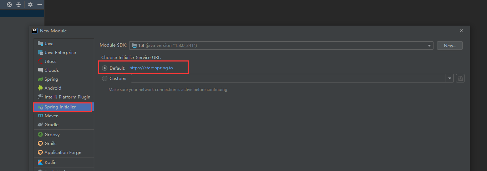

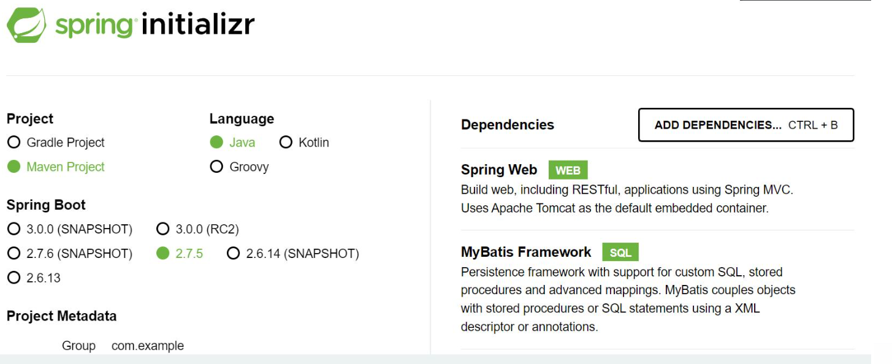

生成一个带有依赖的基础结构的工程


## 2.手动创建maven项目

首先要理解常用的启动器（starter）,主要的作用：自动配置

~~~xml
 	<parent>
        <groupId>org.springframework.boot</groupId>
        <artifactId>spring-boot-starter-parent</artifactId>
        <version>2.2.6.RELEASE</version>
    </parent>

	<!-- 导入springmvc和spring -->
    <dependencies>
        <dependency>
            <groupId>org.springframework.boot</groupId>
            <artifactId>spring-boot-starter-web</artifactId>
        </dependency>
        <!-- 导入mybatis以及相关的依赖，并且做数据源的自动配置 -->
<!--        <dependency>-->
<!--            <groupId>org.mybatis.spring.boot</groupId>-->
<!--            <artifactId>mybatis-spring-boot-starter</artifactId>-->
<!--            <version>2.2.2</version>-->
<!--        </dependency>-->
        <!-- spring的单元测试 -->
        <dependency>
            <groupId>org.springframework.boot</groupId>
            <artifactId>spring-boot-starter-test</artifactId>
            <scope>test</scope>
        </dependency>
~~~

案例：

建好包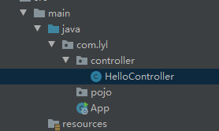

Controller：

~~~java
@RestController
public class HelloController {

	@RequestMapping("/hello")
	public List<String> hello() {
		ArrayList<String> list = new ArrayList<>();
		list.add("张三");
		list.add("李四");
		list.add("王五");

		return list;
	}
}
~~~


通过这个来启动springboot启动内置的Tomcat，注意这个类的位置，它是自动扫描当前所在包内的资源，包括子包和之前的配置需要扫包是一个道理，只是这里实现了自动化

APP：

~~~java
@SpringBootApplication
public class App {

	public static void main(String[] args) {
		SpringApplication.run(App.class, args);
	}
}
~~~


启动后就可以从浏览器中发送请求到controller了


# 四  静态资源文件的存放

* resource/static (最常用)

 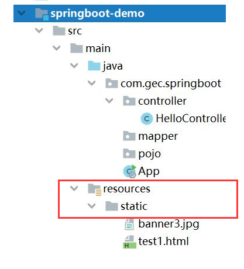


* servlet上下文（webapp）

 


# 五   springboot视图  

## (1) jsp  

 jsp--> servlet-->.class-->html返回到客户端    性能开销比较大   jstl

- pom

~~~xml
<parent>
        <groupId>org.springframework.boot</groupId>
        <artifactId>spring-boot-starter-parent</artifactId>
        <version>2.2.6.RELEASE</version>
    </parent>

    <dependencies>
        <dependency>
            <groupId>org.springframework.boot</groupId>
            <artifactId>spring-boot-starter-web</artifactId>
        </dependency>
        <!--jstl-->
        <dependency>
            <groupId>javax.servlet</groupId>
            <artifactId>jstl</artifactId>
        </dependency>
        <dependency>
            <groupId>org.apache.tomcat.embed</groupId>
            <artifactId>tomcat-embed-jasper</artifactId>
            <scope>provided</scope>
        </dependency>
    </dependencies>

    <build>
        <plugins>
            <plugin>
                <groupId>org.springframework.boot</groupId>
                <artifactId>spring-boot-maven-plugin</artifactId>
            </plugin>
        </plugins>
    </build>
~~~


- 配置application.properties

~~~properties
#更改内置Tomcat的端口号
server.port=8081
#视图解析器，视图的位置及后缀
spring.mvc.view.prefix=/WEB-INF/jsp/
spring.mvc.view.suffix=.jsp
~~~


页面结构：

 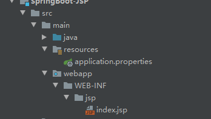


不能直接runAPP，要使用插件运行，否则页面会404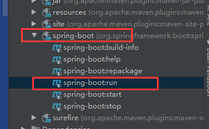


## (2) Freemarker

   静态模板页    动态数据静态化处理

- pom

~~~xml
<dependency>
    <groupId>org.springframework.boot</groupId>
    <artifactId>spring-boot-starter-freemarker</artifactId>
</dependency>
~~~


目录结构：

 

可以直接用APP运行


## (3)Thymleaf

- pom

~~~xml
<dependency>
    <groupId>org.springframework.boot</groupId>
    <artifactId>spring-boot-starter-thymeleaf</artifactId>
</dependency>
~~~

其他同freemarker


# 六  自定义starter

主要的作用：自动配置， 以java的编程配置为基础

springboot是如何实现自动配置SSM框架的

实现步骤：

## 1.创建maven工程，导入pom依赖

~~~xml
<packaging>jar</packaging>

    <properties>
        <java-version>1.8</java-version>
    </properties>


    <dependencies>
        <dependency>
            <groupId>org.springframework.boot</groupId>
            <artifactId>spring-boot-autoconfigure</artifactId>
            <version>2.2.6.RELEASE</version>
        </dependency>
    </dependencies>

    <build>
        <plugins>
            <plugin>
                <groupId>org.springframework.boot</groupId>
                <artifactId>spring-boot-maven-plugin</artifactId>
            </plugin>
        </plugins>
    </build>
~~~


## 2. 创建属性类，主要用于接收外部文件application.properties的参数

~~~java
@ConfigurationProperties(prefix = "gec.boot") //prefix用于指定改属性类识别application.properties内容的前缀
public class HelloProperties {
	private static final String DEFAULT_NAME="gec";
	private static final String DEFAULT_MSG="Hello World";

	private String name=DEFAULT_NAME;
	private String msg=DEFAULT_MSG;

	public String getName() {
		return name;
	}

	public void setName(String name) {
		this.name = name;
	}

	public String getMsg() {
		return msg;
	}

	public void setMsg(String msg) {
		this.msg = msg;
	}
}
~~~


## 3. 核心配置的功能类

~~~java
/**
 * 功能：实现配置的核心业务功能
 *
 * @author 林亦亮
 * @version 1.0
 * @date 2022/11/15
 */

public class HelloService {

	private String name;
	private String msg;

	public String getName() {
		return name;
	}

	public void setName(String name) {
		this.name = name;
	}

	public String getMsg() {
		return msg;
	}

	public void setMsg(String msg) {
		this.msg = msg;
	}

	public String hello() {
		return this.name + "," + this.msg;
	}
}
~~~


## 4. 实现自动配置类，整个starter的核心类

~~~java
/**
 * 功能：实现自动配置的类，是starter的核心
 *
 * @author 林亦亮
 * @version 1.0
 * @date 2022/11/15
 */

//表明是自动配置类
@Configuration
//读取属性类
@EnableConfigurationProperties(HelloProperties.class)
//触发自动配置类的条件，条件有多种
@ConditionalOnClass(HelloService.class)
//主要配置HelloService的实例
public class HelloServiceAutoConfiguration {

	@Autowired
	HelloProperties helloProperties;

	//声明出一个Bean，其实就是通过读取properties中相应的数据来配置需要的Bean，比如Mybatis的数据源，只需在properties中写好连接数据
	// 库的信息，就可以实现自动配置数据源，就不用手动配置MVC，web.xml等的配置了
	@Bean
	public HelloService helloService() {
		HelloService helloService = new HelloService();
		helloService.setName(helloProperties.getName());
		helloService.setMsg(helloProperties.getMsg());
		return helloService;
	}
}
~~~


## 5. 指定自动配置类的路径

 在工程的resource之下创建目录META-INF，再创建文件spring.factories，指定以下路径

~~~factories
#指定自动配置的路径
org.springframework.boot.autoconfigure.EnableAutoConfiguration=com.dataresource.HelloServiceAutoConfiguration
~~~


配置完毕，项目基本结构：

 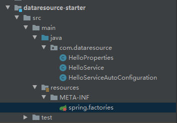


## 7. 在本地仓库安装starter

双击【install】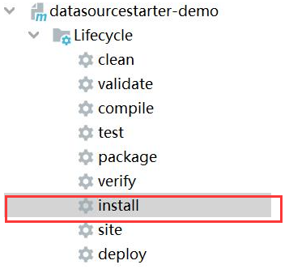


## 8. 测试

- 创建springboot工程，添加**自定义的starter**依赖

~~~xml
<packaging>pom</packaging>

    <parent>
        <groupId>org.springframework.boot</groupId>
        <artifactId>spring-boot-starter-parent</artifactId>
        <version>2.2.6.RELEASE</version>
        <relativePath/> <!-- lookup parent from repository -->
    </parent>

    <properties>
        <java.version>1.8</java.version>
    </properties>

    <dependencies>

    <dependency>
        <groupId>org.springframework.boot</groupId>
        <artifactId>spring-boot-starter-web</artifactId>
    </dependency>

    <dependency>
        <groupId>org.springframework.boot</groupId>
        <artifactId>spring-boot-starter-test</artifactId>
        <scope>test</scope>
        <exclusions>
            <exclusion>
                <groupId>org.junit.vintage</groupId>
                <artifactId>junit-vintage-engine</artifactId>
            </exclusion>
        </exclusions>
    </dependency>
	<!-- 自定义starter -->
        <dependency>
            <groupId>com.lyl</groupId>
            <artifactId>dataresource-starter</artifactId>
            <version>1.0-SNAPSHOT</version>
        </dependency>
    </dependencies>
~~~


- 创建application.properties

~~~properties
gec.boot.name=Zhangsan
gec.boot.msg=This is the first springboot starter
~~~


- springboot的单元测试

测试也需要添加APP类

测试类的包名需要和java中的保持一致，如下：

 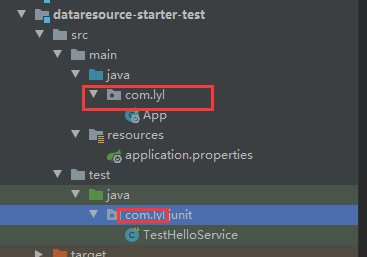

~~~java
@SpringBootTest
public class TestHelloService {
    @Autowired
    private HelloService helloService;

    @Test
    public void test1() {
        String text = helloService.hello();
        System.out.println(text);
    }
}
~~~


# 七 使用Springboot重构ssm项目

## 1.结构

目录结构：

 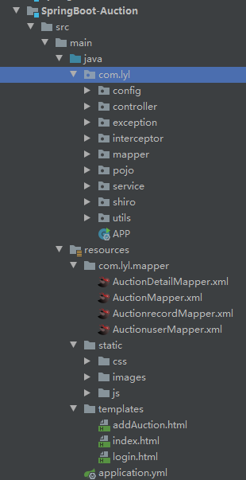

除mapper映射文件和静态资源文件位置不同，其他都一样

* pom

先将SSM的框架搭好，先不加shiro，依赖需要先去掉，否则没有shiro的参数，启动时会报错

~~~xml
<parent>
        <groupId>org.springframework.boot</groupId>
        <artifactId>spring-boot-starter-parent</artifactId>
        <version>2.2.6.RELEASE</version>
        <relativePath/> <!-- lookup parent from repository -->
    </parent>

    <properties>
        <java.version>1.8</java.version>
    </properties>

    <dependencies>
        <dependency>
            <groupId>org.springframework.boot</groupId>
            <artifactId>spring-boot-starter-web</artifactId>
        </dependency>

        <dependency>
            <groupId>org.mybatis.spring.boot</groupId>
            <artifactId>mybatis-spring-boot-starter</artifactId>
            <version>1.3.2</version>
        </dependency>

        <dependency>
            <groupId>com.github.pagehelper</groupId>
            <artifactId>pagehelper-spring-boot-starter</artifactId>
            <version>1.2.3</version>
            <exclusions>
                <exclusion>
                    <groupId>org.mybatis.spring.boot</groupId>
                    <artifactId>mybatis-spring-boot-starter</artifactId>
                </exclusion>
            </exclusions>
        </dependency>

        <dependency>
            <groupId>mysql</groupId>
            <artifactId>mysql-connector-java</artifactId>
            <scope>runtime</scope>
        </dependency>

        <!--集成druid连接池-->
        <dependency>
            <groupId>com.alibaba</groupId>
            <artifactId>druid-spring-boot-starter</artifactId>
            <version>1.1.10</version>
        </dependency>

        <dependency>
            <groupId>org.springframework.boot</groupId>
            <artifactId>spring-boot-starter-thymeleaf</artifactId>
        </dependency>

        <!-- MyBatis 生成器 -->
        <dependency>
            <groupId>org.mybatis.generator</groupId>
            <artifactId>mybatis-generator-core</artifactId>
            <version>1.3.7</version>
        </dependency>

        <dependency>
            <groupId>org.springframework.boot</groupId>
            <artifactId>spring-boot-starter-test</artifactId>
            <scope>test</scope>
            <exclusions>
                <exclusion>
                    <groupId>org.junit.vintage</groupId>
                    <artifactId>junit-vintage-engine</artifactId>
                </exclusion>
            </exclusions>
        </dependency>

        <!-- 图片验证码依赖 -->
        <dependency>
            <groupId>com.github.penggle</groupId>
            <artifactId>kaptcha</artifactId>
            <version>2.3.2</version>
        </dependency>

        <dependency>
            <groupId>org.apache.shiro</groupId>
            <artifactId>shiro-spring-boot-web-starter</artifactId>
            <version>1.4.0-RC2</version>
        </dependency>
    </dependencies>

    <build>
        <plugins>
            <plugin>
                <groupId>org.springframework.boot</groupId>
                <artifactId>spring-boot-maven-plugin</artifactId>
            </plugin>
        </plugins>
    </build>
~~~

## 2.重构登录与首页

登录的验证码改用了Kaptcha

需要在config包中新建一个配置文件：

~~~java
@Configuration 
public class KaptchaConfig {
	@Bean
	public DefaultKaptcha getDefaultKaptcha() {
		DefaultKaptcha defaultKaptcha = new DefaultKaptcha();
		Properties properties = new Properties();
		// 图片边框
		properties.setProperty("kaptcha.border", "yes");
		// 边框颜色
		properties.setProperty("kaptcha.border.color", "105,179,90");
		// 字体颜色
		properties.setProperty("kaptcha.textproducer.font.color", "red");
		// 图片宽
		properties.setProperty("kaptcha.image.width", "110");
		// 图片高
		properties.setProperty("kaptcha.image.height", "40");
		// 字体大小
		properties.setProperty("kaptcha.textproducer.font.size", "35");
		// session key
		properties.setProperty("kaptcha.session.key", "code");
		// 验证码长度
		properties.setProperty("kaptcha.textproducer.char.length", "4");
		// 字体
		properties.setProperty("kaptcha.textproducer.font.names", "宋体,楷体,微软雅黑");
		Config config = new Config(properties);
		defaultKaptcha.setConfig(config);

		return defaultKaptcha;
	}
}
~~~


使用通过访问controller来获取验证码

~~~java
/**
	 * 获取验证码
	 *
	 * @param httpServletRequest
	 * @param httpServletResponse
	 * @throws Exception
	 */
	@RequestMapping("/defaultKaptcha")
	public void defaultKaptcha(HttpServletRequest httpServletRequest, HttpServletResponse httpServletResponse)
			throws Exception {
		byte[] captchaChallengeAsJpeg = null;
		ByteArrayOutputStream jpegOutputStream = new ByteArrayOutputStream();
		try {
			// 生产验证码字符串并保存到session中
			String createText = captchaProducer.createText();
			System.out.println(createText);
			httpServletRequest.getSession().setAttribute("vrifyCode", createText);
			// 使用生产的验证码字符串返回一个BufferedImage对象并转为byte写入到byte数组中
			BufferedImage challenge = captchaProducer.createImage(createText);
			ImageIO.write(challenge, "jpg", jpegOutputStream);
		} catch (IllegalArgumentException e) {
			httpServletResponse.sendError(HttpServletResponse.SC_NOT_FOUND);
			return;
		}

		// 定义response输出类型为image/jpeg类型，使用response输出流输出图片的byte数组
		captchaChallengeAsJpeg = jpegOutputStream.toByteArray();
		httpServletResponse.setHeader("Cache-Control", "no-store");
		httpServletResponse.setHeader("Pragma", "no-cache");
		httpServletResponse.setDateHeader("Expires", 0);
		httpServletResponse.setContentType("image/jpeg");
		ServletOutputStream responseOutputStream = httpServletResponse.getOutputStream();
		responseOutputStream.write(captchaChallengeAsJpeg);
		responseOutputStream.flush();
		responseOutputStream.close();
	}
~~~


SPringMVC的类型转换器需要添加@component注解来注入到Spring容器


其他基本不需更改，确保前后端交互的数据一致即可

前端页面不使用jsp而改用Thymeleaf静态模板，只需将原来jsp的表达式替换成Thymeleaf的表达式即可

login.html

注意引入thymeleaf< html xmlns:th="http://www.thymeleaf.org">

~~~html
<!DOCTYPE html>
<html xmlns:th="http://www.thymeleaf.org">
<head>
<meta http-equiv="Content-Type" content="text/html; charset=utf-8" />
<title>用户登录</title>
<link href="/css/common.css" rel="stylesheet" type="text/css" />
<link href="/css/style.css" rel="stylesheet" type="text/css" />
</head>

<body>
<div class="wrap">
<!-- main begin-->
 <div class="main">
   <div class="sidebar">
     <p></p>
   </div>
   <div class="sidebarg">
   <form action="/doLogin" method="post">
    <div class="login">
      <dl>
        <dt class="blues">用户登陆</dt>
        <dd><label for="username">用户名：</label><input type="text" class="inputh" name="username" th:value="${username}"/></dd>
        <dd><label for="password">密 码：</label><input type="password" class="inputh" name="password" th:value="${password}"/></dd>
        <dd>
           <label class="lf" for="passwords">验证码：</label>
           <input type="text" class="inputh inputs lf"  name="inputCode"/>
           <span class="wordp lf">
              
            </span>
        </dd>
        <dd>
           <input name=""  type="checkbox" id="rem_u"  />
           <span for="rem_u">下次自动登录</span>
            <span th:text="${errorMsg}" style="color: red"></span>
        </dd>
        <dd class="buttom">
           <input type="submit" value="登 录" class="spbg buttombg f14 lf" />
           <input type="button" value="注 册" onclick="location='toRegister'" class="spbg buttombg f14 lf" />
           <span class="blues  lf"><a href="" title="">忘记密码?</a></span>
           <div class="cl"></div>
        </dd>

      </dl>
    </div>
    </form>
   </div>
  <div class="cl"></div>
 </div>
<!-- main end-->

<!-- footer begin-->
</div>
 <!--footer end-->

</div>
</body>
<script>
</script>
</html>

~~~

index.html

~~~html
<!DOCTYPE html>
<html xmlns:th="http://www.thymeleaf.org">
<head>
    <meta http-equiv="Content-Type" content="text/html; charset=utf-8"/>
    <title>拍卖商品列表</title>
    <link href="css/common.css" rel="stylesheet" type="text/css"/>
    <link href="css/style.css" rel="stylesheet" type="text/css"/>
    <script src="js/WebCalendar.js"></script>
</head>

<body>
<div class="wrap">
    <!-- main begin-->
    <div class="sale">
        <h1 class="lf">在线拍卖系统</h1>
        <div class="logout right"><a href="/logout" title="注销">注销</a></div>
    </div>
    <div class="forms">
        <form id="form_query" action="queryAuctions" method="post">
            <input id="page" name="pageNum" type="hidden" th:value="${page.pageNum}"/>

            <label for="name">名称</label>
            <input name="auctionname" type="text" class="nwinput" id="name" th:value="${condition.auctionname}"/>

            <label for="names">描述</label>
            <input name="auctiondesc" type="text" id="names" class="nwinput" th:value="${condition.auctiondesc}"/>

            <label for="time">开始时间</label>
            <input name="auctionstarttime" type="text" id="time" class="nwinput" onclick="selectDate(this,'yyyy-MM-dd')"
                   th:value="${#dates.format(condition.auctionstarttime,'yyyy-MM-dd')}"
                   readonly="readonly"/>

            <label for="end-time">结束时间</label>
            <input name="auctionendtime" type="text" id="end-time" class="nwinput"
                   onclick="selectDate(this,'yyyy-MM-dd')"
                   th:value="${#dates.format(condition.auctionendtime,'yyyy-MM-dd')}"
                   readonly="readonly"/>

            <label for="price">起拍价</label>
            <input name="auctionstartprice" type="text" id="price" class="nwinput"
                   th:value="${condition.auctionstartprice}"/>

            <input type="submit" value="查询" class="spbg buttombg f14  sale-buttom"/>

        </form>

        <input type="button" th:if="${user.userisadmin==1}" value="发布" onclick="location='/addAuction.html'"
               class="spbg buttombg f14  sale-buttom buttomb"/>


    </div>
    <div class="items">
        <ul class="rows even strong">
            <li>名称</li>
            <li class="list-wd">描述</li>
            <li>开始时间</li>
            <li>结束时间</li>
            <li>起拍价</li>
            <li class="borderno">操作</li>
        </ul>

        <ul th:each="auction,state:${auctionList}" th:class="${state.odd?'rows':'rows even'}">
            <li th:text="${auction.auctionname}"></li>
            <li class="list-wd" th:text="${auction.auctiondesc}"></li>
            <li th:text="${#dates.format(auction.auctionstarttime,'yyyy-MM-dd')}"></li>
            <li th:text="${#dates.format(auction.auctionendtime,'yyyy-MM-dd')}"></li>
            <li th:text="${auction.auctionstartprice}"></li>
            <li class="borderno red">
                <a th:href="@{toUpdate(id=${auction.auctionid})}" th:if="${user.userisadmin==1}" title="修改">修改</a>|
                <a th:href="@{toDelete(id=${auction.auctionid})}" th:if="${user.userisadmin==1}" title="删除">删除</a>
                <a th:href="@{toAuctionDetail(id=${auction.auctionid})}" th:if="${user.userisadmin==0}" title="竞拍">竞拍</a>
            </li>
        </ul>

        <div class="page">
            【当前第<span th:text="${page.pageNum}"></span>,总共<span th:text="${page.total}"></span>条记录,总共<span th:text="${page.pages}"></span>页】
            <a href="javascript:jumppage(1)">首页</a>
            <a th:href="@{|javascript:jumppage(${page.prePage})|}">上一页</a>
            <a th:href="@{|javascript:jumppage(${page.nextPage})|}">下一页</a>
            <a th:href="@{|javascript:jumppage(${page.pages})|}">尾页</a>
        </div>
    </div>

    <!-- main end-->
</div>
</body>
<script>
    function jumppage(page_num) {
        document.getElementById("page").value = page_num;
        document.getElementById("form_query").submit();
    }
</script>
</html>

~~~

（因为需要保证模糊查询，所以分页需要使用js来提交表单）分页功能中，如果a链接中的表达式为：

~~~html
@{javascript:jumppage(${page.prePage})}
~~~

在@{}中的${}前面会自动拼接一个？，是用于正常的链接的。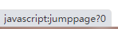

而使用JS则不需要这个？，解决方法如上。（应该还有其他方法）[Thymeleaf文档]:https://fanlychie.github.io/

因为是用pageHelper分页，所以需要在application中添加pageHelper的配置

~~~yaml
pagehelper:
  helper-dialect: mysql
  reasonable: true
~~~


网页和controller就这样配合着改就行了


## 3.文件上传

文件在服务器端存储时：

  保存到部署工程所在tomcat、数据库、云服务器、自建文件存储服务器


我们可以将文件上传的路径映射到硬盘中

在config包中新建SpringMVCConfig，继承WebMvcConfigurer

```java
@Component //注入到Spring容器中
public class SpringMVCConfig implements WebMvcConfigurer {

	@Autowired
	private FileProperties fileProperties;

	//使用http路径映射物理文件
	//addResourceHandler：指定一个http的虚拟路径，例如：	/upload/**
	//addResourceLocations:指定物理路径   e:/upload/

	//这两个方法的参数写在源码中不好，可以提取到配置文件中，方便配置
	@Override
	public void addResourceHandlers(ResourceHandlerRegistry registry) {

		registry.addResourceHandler(fileProperties.getStaticAccessPath()).addResourceLocations(
				"file:" + fileProperties.getUploadFileFolder());
	}

}
```

addResourceHandler中的两个路径可以写死，但也可以通过配置文件传入。

比如这里就利用了前面的starter的思想（只用来读取配置信息），通过application.yml文件配置虚拟路径和物理路径

新建一个属性类来读取配置文件中的信息：

~~~java
//通过借助自动配置中的属性类来读取配置文件中的信息
@ConfigurationProperties(prefix = "file")//设置yml使用配置关键字
@Component
public class FileProperties {

	//虚拟路径
	private String staticAccessPath;
	//物理路径
	private String uploadFileFolder;

	public String getStaticAccessPath() {
		return staticAccessPath;
	}

	public void setStaticAccessPath(String staticAccessPath) {
		this.staticAccessPath = staticAccessPath;
	}

	public String getUploadFileFolder() {
		return uploadFileFolder;
	}

	public void setUploadFileFolder(String uploadFileFolder) {
		this.uploadFileFolder = uploadFileFolder;
	}
}
~~~

~~~yaml
file:
  staticAccessPath: '/upload/**'
  uploadFileFolder: 'e:\\upload\\'
~~~

这样启动时SpringMVCconfig就能读取到配置信息了


## 4.添加SpringMVC的拦截器

在SpringMVCConfig中重写拦截器的方法，添加需要拦截和放行的资源即可

~~~java
	//添加SpringMVC的拦截器
	@Override
	public void addInterceptors(InterceptorRegistry registry) {
		ArrayList<String> paths = new ArrayList<>();
		paths.add("/css/**");
		paths.add("/js/**");
		paths.add("/images/**");
		paths.add("/doLogin");
		paths.add("/login.html");
		paths.add("/register.html");
		paths.add("/defaultKaptcha");

		//注册拦截器
		registry.addInterceptor(new CheckUserInterceptor())
					.addPathPatterns("/**")		//添加需要拦截资源
					.excludePathPatterns(paths);     //添加放行的资源
	}
~~~


## 5.添加shiro

将依赖加回

新建ShiroConfig，其实就是将原来在xml中的配置改为了一个一个的Bean，通过java编程方式实现配置

shiroFilterFactoryBean，就是shiro中最大的那个过滤器

hiroFilterChainDefinition，配置需要权限的操作url

DefaultWebSecurityManager，就是SecurityManager

还有Realm等等都成为了一个个的Bean

~~~java
@Configuration
public class ShiroConfig {

//	     验证过滤器是authc;逻辑上只要登录成功即可跳转至“/account/user/current”实际上不行；
//		主要原因是successUrl配置只是做为一种附加配置，只有session中没有用户请求地址时才会使用successUrl；
//		系统默认登录成功后首次跳转的地址为，访问系统时初次使用地址，例：如果用户首次访问的是http://****/aa.html;
	   // 那么shiro校验成功后跳转的地址即可http://****/aa/aa.html; 否则shiro将跳转到默认虚拟路径：“/”；

	@Bean
	public ShiroFilterFactoryBean shiroFilterFactoryBean(org.apache.shiro.mgt.SecurityManager securityManager) {
		
		ShiroFilterFactoryBean shiroFilterFactoryBean = new ShiroFilterFactoryBean();
		shiroFilterFactoryBean.setSecurityManager(securityManager);
		shiroFilterFactoryBean.setLoginUrl("/doLogin");
		shiroFilterFactoryBean.setSuccessUrl("/queryAuctions");
		shiroFilterFactoryBean.setUnauthorizedUrl("/refuse.html");
		
		LinkedHashMap<String, String> filterChainDefinitionMap = new LinkedHashMap<>();
		
		filterChainDefinitionMap.put("/css/**", "anon");
		filterChainDefinitionMap.put("/js/**", "anon");
		filterChainDefinitionMap.put("/images/**", "anon");
		filterChainDefinitionMap.put("/register.html", "anon");
		filterChainDefinitionMap.put("/defaultKaptcha", "anon");
		filterChainDefinitionMap.put("/register", "anon");
		filterChainDefinitionMap.put("/checkUsername", "anon");
		filterChainDefinitionMap.put("/login.html", "anon");
		filterChainDefinitionMap.put("/logout", "logout");
		filterChainDefinitionMap.put("/**", "authc");
		
		shiroFilterFactoryBean.setFilterChainDefinitionMap(filterChainDefinitionMap);
		
		
		Map<String, Filter> filters = new HashMap<>();
		CustomFormAuthenticationFilter authFilter = new CustomFormAuthenticationFilter();
		filters.put("authc",authFilter);
		shiroFilterFactoryBean.setFilters(filters);
		
		return shiroFilterFactoryBean;
	}
	@Bean
	public ShiroFilterChainDefinition shiroFilterChainDefinition() {
	    DefaultShiroFilterChainDefinition chainDefinition = new DefaultShiroFilterChainDefinition();
	    
	    // logged in users with the 'admin' role
	    //chainDefinition.addPathDefinition("/admin/**", "authc, roles[admin]");
	    
	    // logged in users with the 'document:read' permission
	    //chainDefinition.addPathDefinition("/docs/**", "authc, perms[document:read]");
	    
	    // all other paths require a logged in user
	    //chainDefinition.addPathDefinition("/logout", "logout");
	    //chainDefinition.addPathDefinition("/**", "authc");
	    return chainDefinition;
	}
	
	@Bean  
    public DefaultWebSecurityManager securityManager(Realm realm){
       DefaultWebSecurityManager securityManager =  new DefaultWebSecurityManager();
       securityManager.setRealm(realm);
//       securityManager.setRememberMeManager(rememberMeManager());
//       securityManager.setCacheManager(getEhCacheManager());
//       securityManager.setSessionManager(sessionManager());
       return securityManager;  
    }

	@Bean
	public Realm shiroRealm() {
		return new ShiroRealm();
	} 
	
//    /**
//     * 密码校验规则HashedCredentialsMatcher
//     * 这个类是为了对密码进行编码的 ,
//     * 防止密码在数据库里明码保存 , 当然在登陆认证的时候 ,
//     * 这个类也负责对form里输入的密码进行编码
//     * 处理认证匹配处理器：如果自定义需要实现继承HashedCredentialsMatcher
//     */
//    @Bean("hashedCredentialsMatcher")
//    public HashedCredentialsMatcher hashedCredentialsMatcher() {
//        HashedCredentialsMatcher credentialsMatcher = new HashedCredentialsMatcher();
//        //指定加密方式为MD5
//        credentialsMatcher.setHashAlgorithmName("MD5");
//        //加密次数
//        credentialsMatcher.setHashIterations(1024);
//        credentialsMatcher.setStoredCredentialsHexEncoded(true);
//        return credentialsMatcher;
//    }
//
//
//    @Bean("authRealm")
//    @DependsOn("lifecycleBeanPostProcessor")//可选
//    public AuthRealm authRealm(@Qualifier("hashedCredentialsMatcher") HashedCredentialsMatcher matcher) {
//        AuthRealm authRealm = new AuthRealm();
//        authRealm.setAuthorizationCachingEnabled(false);
//        authRealm.setCredentialsMatcher(matcher);
//        return authRealm;
//    }
}
~~~


Realm（这里只做了认证，没做授权）

~~~java
public class ShiroRealm extends AuthorizingRealm {

	@Autowired
	private UserService userService;


	@Override
	protected AuthorizationInfo doGetAuthorizationInfo(PrincipalCollection principals) {
		return null;
	}

	@Override
	protected AuthenticationInfo doGetAuthenticationInfo(AuthenticationToken token) throws AuthenticationException {
		String username = (String) token.getPrincipal();
		System.out.println(username);

		Auctionuser loginUser = null;
		try {
			loginUser = userService.findUserByUsername(username);
		} catch (Exception e) {
			e.printStackTrace();
		}

		if (loginUser == null) {
			return null;
		}

		SimpleAuthenticationInfo info = new SimpleAuthenticationInfo(loginUser, loginUser.getUserpassword(),
																	 "ShiroRealm");

		return info;
	}
}
~~~


FormAuthenticationFilter拦截登录请求的，验证码校验，登录成功的跳转页面等

~~~java
public class CustomFormAuthenticationFilter extends FormAuthenticationFilter {

	
	@Override  // 先校验验证码 
	protected boolean onAccessDenied(ServletRequest request, ServletResponse response) throws Exception {
		
		HttpServletRequest req = (HttpServletRequest) request;
		HttpServletResponse resp = (HttpServletResponse) response;
		//生成的随机数
		String validateCode = (String) req.getSession().getAttribute("vrifyCode");
		//用户输入 的验证码
		String randomcode = request.getParameter("inputCode");
		System.out.println(randomcode);
		
		if (validateCode != null && randomcode != null && !validateCode.equals(randomcode)) {
			request.setAttribute(DEFAULT_ERROR_KEY_ATTRIBUTE_NAME, "valideCodeError");
			return true;  //不再 调用Realm  ---> login controller
		}
		
		return super.onAccessDenied(request, response);  // 执行默认操作  ： 调用realm
	}
	
	@Override
	protected boolean onLoginSuccess(AuthenticationToken token, Subject subject, ServletRequest request,
			ServletResponse response) throws Exception {
		WebUtils.getAndClearSavedRequest(request);
		WebUtils.redirectToSavedRequest(request, response, "/queryAuctions");
		return false;
	}

}
~~~

在ShiroFilterFactoryBean添加权限认证跳转页面及需要过滤的页面和请求

 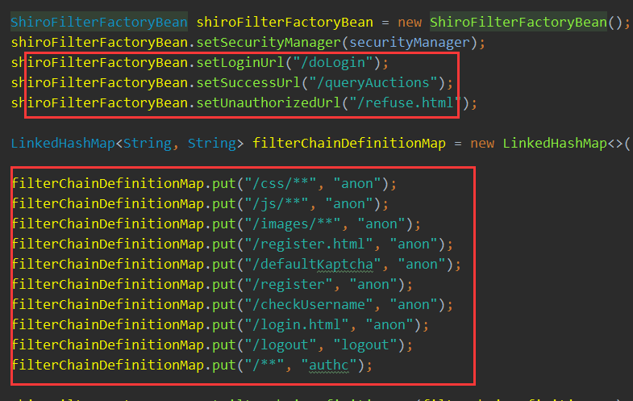

完成

注意，这时需要将SpringMVC的过滤器去掉，更改UserController中的login映射方法，去掉logout方法
