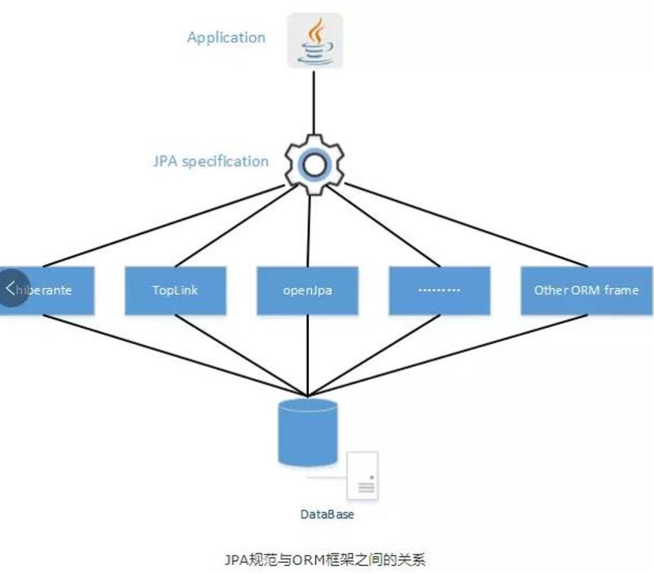
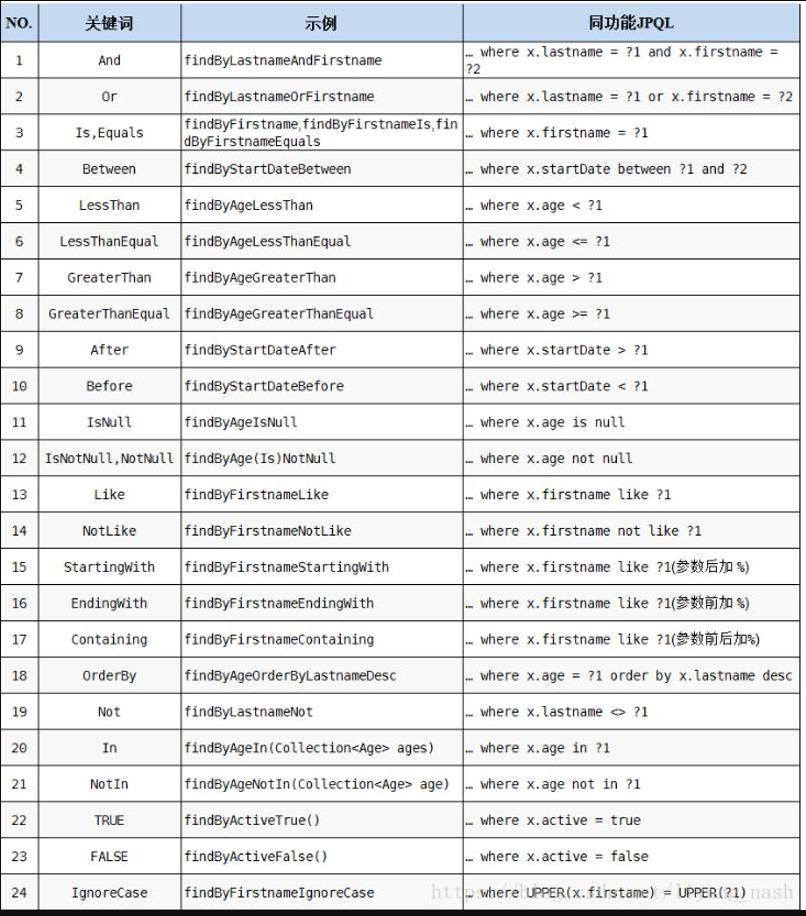
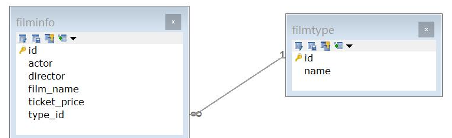
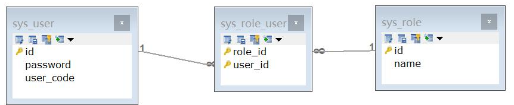

(了解)

# 一 什么是JPA

​     Java Persistence API  是Java官方提供的一套开发持久层技术的规范应用程序接口。jpa属于官方规范技术。

​    JDBC 就是一套java官方开发数据库访问技术的规范接口。

​    JPA是一套开发ORM框架的规范，Hibernate实现了jpa的规范接口。

 

# 二   Spring Data

Spring Data 是Spring框架其中的一个模块，主要作用提供了对第三方框架的简化操作的封装 ，例如，Jpa,  redis，solr，elasticsearch等等。

Spring Data JPA 简化了JPA的开发，提供 了丰富的查询技术，简化了dao的实现。

 

# 三 Springboot开发 Spring Data JPA

## 1.单表操作

反向工程：  数据库表--->实体模型

- pom依赖

~~~xml
 <parent>
        <groupId>org.springframework.boot</groupId>
        <artifactId>spring-boot-starter-parent</artifactId>
        <version>2.2.6.RELEASE</version>
        <relativePath/> <!-- lookup parent from repository -->
    </parent>
    <properties>
        <java.version>1.8</java.version>
    </properties>

    <dependencies>

        <dependency>
            <groupId>org.springframework.boot</groupId>
            <artifactId>spring-boot-starter-web</artifactId>
        </dependency>
        <!--JPA-->
        <dependency>
            <groupId>org.springframework.boot</groupId>
            <artifactId>spring-boot-starter-data-jpa</artifactId>
        </dependency>
        <dependency>
            <groupId>mysql</groupId>
            <artifactId>mysql-connector-java</artifactId>
            <scope>runtime</scope>
        </dependency>
        <!--集成druid连接池-->
        <dependency>
            <groupId>com.alibaba</groupId>
            <artifactId>druid-spring-boot-starter</artifactId>
            <version>1.1.10</version>
        </dependency>
        <dependency>
            <groupId>org.springframework.boot</groupId>
            <artifactId>spring-boot-starter-test</artifactId>
            <scope>test</scope>
            <exclusions>
                <exclusion>
                    <groupId>org.junit.vintage</groupId>
                    <artifactId>junit-vintage-engine</artifactId>
                </exclusion>
            </exclusions>
        </dependency>
    </dependencies>

    <build>
        <plugins>
            <plugin>
                <groupId>org.springframework.boot</groupId>
                <artifactId>spring-boot-maven-plugin</artifactId>
            </plugin>
        </plugins>
    </build>
~~~

- 配置application.yml

~~~yaml
spring:
  datasource:
    username: root
    password:
    url: 'jdbc:mysql://localhost:3306/jpadb?useUnicode=true&characterEncoding=utf-8&serverTimezone=Asia/Shanghai'
  jpa:
    database-platform: org.hibernate.dialect.MySQL5InnoDBDialect
    show-sql: true
    hibernate:
      ddl-auto: update
~~~

说明：

​     ddl-auto: update :  自动执行数据库的定义语句，例如  建表    正向工程操作

- orm映射 （实体<--->表）， jpa主要用注解描述

~~~java
@Entity //表示当前实体是一个可持久化的对象，它是映射一张表
@Table(name = "t_user")
public class User {

	@Id //唯一标识
	@GeneratedValue(strategy = GenerationType.IDENTITY)
	private Integer id;

	@Column(name = "user_name", length = 20)    //变量名和字段名相同可以不用指定name属性
	private String userName;

	@Column()
	private String password;

	@Column(name = "last_login_time")
	private Date lastLoginTime;

	@Column()
	private Integer sex;

	public Integer getId() {
		return id;
	}

	public void setId(Integer id) {
		this.id = id;
	}

	public String getUser_name() {
		return userName;
	}

	public void setUser_name(String user_name) {
		this.userName = user_name;
	}

	public String getPassword() {
		return password;
	}

	public void setPassword(String password) {
		this.password = password;
	}

	public Date getLast_login_time() {
		return lastLoginTime;
	}

	public void setLast_login_time(Date last_login_time) {
		this.lastLoginTime = last_login_time;
	}

	public Integer getSex() {
		return sex;
	}

	public void setSex(Integer sex) {
		this.sex = sex;
	}

	@Override
	public String toString() {
		return "User{" +
				"id=" + id +
				", user_name='" + userName + '\'' +
				", password='" + password + '\'' +
				", lastLoginTime=" + lastLoginTime +
				", sex=" + sex +
				'}';
	}
}
~~~

- 创建DAO， SpringData  JPA提供了一个泛型的DAO接口

~~~java
@Repository 
public interface UserRepository extends JpaRepository<User,Integer> {
}
~~~

- 单元测试

~~~java
@SpringBootTest
public class TestUser {
    @Autowired
    private UserRepository userRepository;

   @Test
	public void test1() {
		List<User> list = userReposity.findAll();
		list.forEach(li -> System.out.println(li));
	}

}
~~~

### 1.2扩展用户Dao的接口

 Spring Data JPA 提供了简便的命名**查询**技术

只要在接口中定义的**方法名**符合要求，会自动添加需要拼接的sql，例子如下：

 定义查询方法： 根据用户名模糊查询 

~~~java
//命名规则 ：findBy+属性名+查询方式
List<User> findByUserNameLike(String username);
~~~

idea可能会误报方法名

测试：

~~~java
@Test
	public void test2() {
		List<User> list = userReposity.findByUserNameLike("%jj%");
		list.forEach(li -> System.out.println(li));
	}
~~~

### 1.3 分页查询

- 业务接口

~~~java
public interface UserService {

	Page<User> findByPage(int pageNum, int pageSize);
}
~~~

* 实现类

~~~java
@Service
public class UserServiceImpl implements UserService {

	@Autowired
	private UserReposity userReposity;

	@Override
	public Page<User> findByPage(int pageNum, int pageSize) {
		Pageable pageable = PageRequest.of(pageNum, pageSize);
		Page<User> page = userReposity.findAll(pageable);
		return page;
	}
}
~~~

* 测试

~~~java
@Test
	public void test3() {
		Page<User> page = userService.findByPage(1, 5);//第二页，从0开始算的

		page.getContent().forEach(li -> System.out.println(li));

		System.out.println("总记录数:" + page.getTotalElements());
		System.out.println("总页数:" + page.getTotalPages());
		System.out.println("pageNum" + page.getNumber());//即上面输入的1
		System.out.println("实际当前页数" + page.getNumberOfElements());
		System.out.println("单页记录数" + page.getSize());

	}
~~~

## 2. 多表操作（对象关联映射 ）

正向工程：实体模型--->数据库表

### （1） 双向一对多   

参考关系：

* 创建实体类，以及类之间的关联关系，orm描述

~~~java
/**
 * 功能：JPA双向一对多测试类
 * 一方
 *
 * @author 林亦亮
 * @version 1.0
 * @date 2022/11/17
 */

@Entity
@Table(name = "filmtype")
public class FilmType {
	@Id
	@GeneratedValue(strategy = GenerationType.IDENTITY)
	private Integer id;
	private String name;

	//cascade是级联，fetch数据加载是懒加载还是立即加载，mappedBy是之前xml中使用的inverse
	//inverse表示反转，就是将数据之间的联系交给对方去维护，一般交给多方维护。这个值填的是当前方对方的关联关系
	@OneToMany(cascade = CascadeType.ALL, fetch = FetchType.LAZY, mappedBy = "filmTypes")
	private Set<FilmInfo> filmInfos = new HashSet<>();

	public Integer getId() {
		return id;
	}

	public void setId(Integer id) {
		this.id = id;
	}

	public String getName() {
		return name;
	}

	public void setName(String name) {
		this.name = name;
	}

	public Set<FilmInfo> getFilmInfos() {
		return filmInfos;
	}

	public void setFilmInfos(Set<FilmInfo> filmInfos) {
		this.filmInfos = filmInfos;
	}
}
~~~

~~~java
@Entity
@Table(name = "filminfo")
public class FilmInfo {
	@Id
	@GeneratedValue(strategy = GenerationType.IDENTITY)
	private Integer id;
	private String actor;
	private String director;
	private String filmName;
	private Double ticketPrice;

	@ManyToOne
	@JoinColumn(name = "type_id")
	private FilmType filmTypes;

	public Integer getId() {
		return id;
	}

	public void setId(Integer id) {
		this.id = id;
	}

	public String getActor() {
		return actor;
	}

	public void setActor(String actor) {
		this.actor = actor;
	}

	public String getDirector() {
		return director;
	}

	public void setDirector(String director) {
		this.director = director;
	}

	public String getFilmName() {
		return filmName;
	}

	public void setFilmName(String filmName) {
		this.filmName = filmName;
	}

	public Double getTicketPrice() {
		return ticketPrice;
	}

	public void setTicketPrice(Double ticketPrice) {
		this.ticketPrice = ticketPrice;
	}

	public FilmType getFilmTypes() {
		return filmTypes;
	}

	public void setFilmTypes(FilmType filmTypes) {
		this.filmTypes = filmTypes;
	}
}
~~~

* 创建对应的repository(mapper,dao)

~~~
@Repository
public interface FilmInfoReposity extends JpaRepository<FilmInfo, Integer> {
}
~~~

~~~java
@Repository
public interface FilmTypeReposity extends JpaRepository<FilmType, Integer> {
}
~~~

* 测试 这里是会自动创建表的，application中已经设置了update，没有表就会自动创建，有则不建。设置create将覆盖

~~~java
@Test
	public void testFilmType() {
		FilmType filmType = new FilmType();
		filmType.setName("动作片");

		filmTypeReposity.save(filmType);

	}
//可以看到建表语句
~~~

~~~java
@Test
	public void testFilmInfo() {
		FilmInfo info = new FilmInfo();

		info.setActor("测试演员");
		info.setDirector("测试导演");
		info.setFilmName("测试电影");
		info.setTicketPrice(50d);

		info.setFilmTypes(filmTypeReposity.findById(1).get());

		filmInfoReposity.save(info);
	}
~~~

### （2） 多对多

参考：

创建实体类，以及类之间的关联关系，orm描述

~~~java
@Entity
@Table(name = "sys_user")
public class SysUser {

	@Id
	@GeneratedValue(strategy = GenerationType.IDENTITY)
	private Integer id;
	private String userCode;
	private String password;

	@ManyToMany//两个多方选一个维护就行，即有一个反转就行
	//通过JoinTable设置中间表，有一方设置即可，外键列用joinColumns和inverseJoinColumns表示，前者表示当前方后者表示对方
	@JoinTable(name = "sys_user_role", joinColumns = @JoinColumn(name = "role_id"), inverseJoinColumns = @JoinColumn(name = "user_id"))
	private Set<SysRole> sysRoles = new HashSet<>();

	public Integer getId() {
		return id;
	}

	public void setId(Integer id) {
		this.id = id;
	}

	public String getUserCode() {
		return userCode;
	}

	public void setUserCode(String userCode) {
		this.userCode = userCode;
	}

	public String getPassword() {
		return password;
	}

	public void setPassword(String password) {
		this.password = password;
	}

	public Set<SysRole> getSysRoles() {
		return sysRoles;
	}

	public void setSysRoles(Set<SysRole> sysRoles) {
		this.sysRoles = sysRoles;
	}
}
~~~

~~~java
@Entity
@Table(name = "sys_role")
public class SysRole {

	@Id
	@GeneratedValue(strategy = GenerationType.IDENTITY)
	private Integer id;
	private String name;

	@ManyToMany(mappedBy = "sysRoles")
	private Set<SysUser> sysUsers = new HashSet<>();

	public Integer getId() {
		return id;
	}

	public void setId(Integer id) {
		this.id = id;
	}

	public String getName() {
		return name;
	}

	public void setName(String name) {
		this.name = name;
	}

	public Set<SysUser> getSysUsers() {
		return sysUsers;
	}

	public void setSysUsers(Set<SysUser> sysUsers) {
		this.sysUsers = sysUsers;
	}
}
~~~

* 同样建好repository接口
* 测试

~~~java
@Test
	public void testAddUserAndRole() {
		SysUser user = new SysUser();
		user.setUserCode("mike");
		user.setPassword("000");

		SysRole role = new SysRole();
		role.setName("admin");

		//设置关联关系
		user.getSysRoles().add(role);
		role.getSysUsers().add(user);

		sysRoleReposity.save(role);
		sysUserReposity.save(user);

	}
~~~

save的顺序不同会报错，要后save管理关系的那个对象