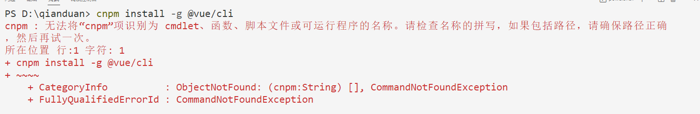
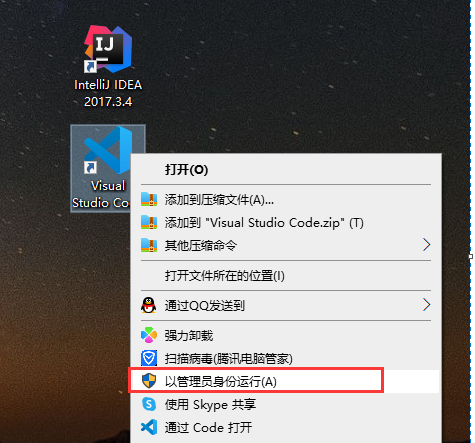

# 一  VueJS介绍

Vue.js是一个构建数据驱动的 web 界面的渐进式框架。Vue.js 的目标是通过尽可能简单的 API 实现响应的数据绑定和组合的视图组件。它不仅易于上手，还便于与第三方库或既有项目整合。

官网: https://cn.vuejs.org/


# 二 MVVM模式

MVVM是Model-View-ViewModel的简写。它本质上就是MVC 的改进版。MVVM 就是将其中的View 的状态和行为抽象化，让我们将视图 UI 和业务逻辑分开

MVVM模式和MVC模式一样，主要目的是分离视图（View）和模型（Model）

Vue.js 是一个提供了 MVVM 风格的双向数据绑定的 Javascript 库，专注于View 层。它的核心是 MVVM 中的 VM，也就是 ViewModel。 ViewModel负责连接 View 和 Model，保证视图和数据的一致性，这种轻量级的架构让前端开发更加高效、便捷。所为VM，指的是视图与数据之间的双向绑定，其作用有交效减化繁琐的dom编程。


# 三 vue.js快速入门

 在idea中，创建static web项目，如下图

 

idea在html文件中使用vue语法，设置一下自动提示支持，如下图

 

  在提示框架中，输入下面的常用的vue的提示：

~~~html
@tap
@tap.stop
@tap.prevent
@tap.once
@click
@click.stop
@click.prevent
@click.once
@change
@change.lazy
@change.number
@change.trim
v-model
v-for
v-text
v-html
v-if
v-else-if
v-else
v-pre
v-once
v-bind
scoped
v-on:click
v-on:keydown
v-on:mouseover
v-on:keyup
v-on:keyup.enter
~~~

##  


## 第一个vue程序 

~~~html
<!DOCTYPE html>
<html lang="en">
<head>
    <meta charset="UTF-8">
    <title>入门程序</title>
    <script src="js/vuejs-2.5.16.js"></script>
</head>
<body>
<div id="app">
    {{info}}
    <hr>
    {{number+1}}
    <hr>
    {{flag?'vue是响应式js框架':'javascript'}}
</div>

</body>
<script>
    new Vue({
        el:'#app',
        data:{
            info:'Hello World',
            number:1,
            flag:true
        }
    });
</script>
</html>
~~~


### (1) v-on:事件

####   v-on:click  点击事件

~~~html
<body>
<div id="app" v-on:click="fun1('vue的点击事件触发！')" style="width: 200px;height: 200px;border: 1px solid red;">
    {{info}}
</div>

</body>
<script>
    new Vue({
        el:'#app',
        data:{
            info:'hello world!'
        },
        methods:{
            fun1:function (msg) {
                this.info=msg;
            }
        }
    });
</script>
~~~


#### v-on:keydown 按下按键事件

~~~html
<div id="app">
    <input type="text" v-on:keydown="fun2($event)">
</div>
</body>
<script>
    new Vue({
        el:'#app',
        methods:{
            fun2:function (e) {
                //如果是非数字
                if(!(e.keyCode>=48 && e.keyCode<=57)){
                    //阻止按键的默认行为
                    e.preventDefault();
                }
            }
        }
    })
</script>
~~~

$event事件对象


####   v-on简写方式：v-on:click与@click等效

~~~html
<!--
<div id="app" v-on:click="fun1('vue的点击事件触发！')" style="width: 200px;height: 200px;border: 1px solid red;">
    {{info}}
</div>
-->
<div id="app" @click="fun1('vue的点击事件触发！')" style="width: 200px;height: 200px;border: 1px solid red;">
    {{info}}
</div>
~~~


### （2）事件修饰符（了解）

 .stop  阻止事件冒泡

 .prevent:  阻止事件默认行为

~~~html
<div id="app">
    <!--阻止默认事件-->
    <form @submit.prevent action="http://www.baidu.com">
        <input type="submit" value="提交">
    </form>

    <!--阻止事件冒泡-->
    <div @click="fun1">
        <a @click.stop href="http://www.jd.com">京东</a>
    </div>
</div>

</body>
<script>

    new Vue({
        el:'#app',
        methods:{
            fun1:function () {
                alert('弹div!');
            }
        }

    });

</script>
~~~


### (3) 按键修饰符

Vue允许为v-on在监听键盘事件时添加按钮的修饰符

按钮修饰符的别名：

.enter

.tab

.esc

.space

.delete

~~~html
<div id="app">
   <!-- 监听回车-->
    <input type="text" v-on:keyup.enter="fun1">
</div>

</body>
<script>

    new Vue({

        el:'#app',
        methods:{
            fun1:function () {
                location.href = 'https://www.baidu.com';
            }
        }
    });

</script>
~~~


### (4) v-text与v-html

 相当于原生属性：innerText与innerHtml

~~~html
<div id="app">
  <div v-text="content"></div>
  <div v-html="content"></div>
</div>

</body>
<script>

    new Vue({

        el:'#app',
        data:{
            content:'<h1>vue是响应式js框架</h1>'
        }

    });

</script>
~~~


### (5) v-bind

~~~html
<div id="app">
    <font v-bind:color="color1">粤嵌IT教育</font>
    <font v-bind:color="color2">粤嵌IT教育</font>
    <font v-bind:color="color3">粤嵌IT教育</font>
    <font :color="color3">粤嵌IT教育</font>
    <hr>
    <a v-bind={href:"https://www.baidu.com?id="+id}>百度一下</a>
    <hr>
    <a v-bind:href="url">百度一下</a>
</div>

</body>
<script>

    new Vue({

        el:'#app',
        data:{
            color1:'red',
            color2:'green',
            color3:'yellow',
            id:10,
            url:'https://www.baidu.com'
        }

    });

</script>
</html>
~~~


### (6) v-model

 html的元素的值 与 model的数据的绑定

~~~html
<div id="app">
    username:<input type="text" v-model="user.username">
    <hr>
    address:<input type="text" v-model="user.address">
    <hr>
    <button @click="fun1">弹出username</button>
    <button @click="fun2">弹出address</button>
</div>

</body>
<script>

    new Vue({

        el:'#app',
        data:{
            user:{
                username:'张三',
                address:'广州'
            }
        },
        methods:{
            fun1:function () {
                alert(this.user.username);
            },
            fun2:function () {
                alert(this.user.address);
            }
        }

    });

</script>
~~~


### (7) v-for

- 操作数组

~~~html
<div id="app">
    <ul>
        <li v-for="(item,index) in list">{{item+"   " + index}}</li>
    </ul>
</div>

</body>
<script>

    new Vue({

        el:'#app',
        data:{
            list:['广州','深圳','佛山']
        }

    });

</script>
~~~


- 操作对象

script中的key val和标签中的key val是反过来的

~~~html
<div id="app">
    <ul>
        <li v-for="(val,key) in user">{{key+"-"+ val}}</li>
    </ul>
</div>

</body>
<script>

    new Vue({

        el:'#app',
        data:{
            user:{
                username:'zhangsan',
                passowrd:'123',
                address:'深圳'
            }
        }

    });

</script>
~~~


- 操作对象数组

~~~html
<table border="1px" align="center" id="app" width="300px">
    <tr>
        <th>姓名</th>
        <th>年龄</th>
        <th>地址</th>
    </tr>
    <!--
    <tr v-for="user in userList">
        <td v-for="(val,key) in user">{{val}}</td>
    </tr>-->
    <tr v-for="user in userList">
        <td>{{user.username}}</td>
        <td>{{user.age}}</td>
        <td>{{user.address}}</td>
    </tr>
</table>


</body>
<script>

    new Vue({

        el:'#app',
        data:{
            userList:[
                {
                    username:'张三',
                    age:20,
                    address:'广州'
                },
                {
                    username:'李四',
                    age:21,
                    address:'深圳'
                },
                {
                    username:'王五',
                    age:19,
                    address:'广州'
                }
            ]
        }

    });

</script>
~~~


### (8)  v-if与v-show

~~~html
<div id="app">
    <span v-if="flag">vue是js框架</span>
    <hr>
    <span v-show="flag">粤嵌IT教育</span>
    <hr>
    <button @click="fun1">true</button>
    <button @click="fun2">false</button>
</div>

</body>
<script>

    new Vue({

        el:'#app',
        data:{
            flag:true
        },
        methods:{
            fun1:function () {
                this.flag=true;
            },
            fun2:function () {
                this.flag=false;
            },
        }

    });

</script>
~~~


# 五  Axios工具，  Vue中实现ajax异步请求

@ResponseBody   @RequestBody

(1) 使用Mybatis-plus代码生成工具搭建后台

 编写controller访问接口

~~~java
@RestController  // @Controller + @ResponseBody
public class StudentController {

    @Autowired
    private IStudentService studentService;

    @GetMapping("/findAll")
    public List<Student> findAll() {
        List<Student> list = studentService.list();
        System.out.println(list);  //在控制台输出数据的日志
        return list;
    }

}
~~~


(2) 前端Vue异步请求

前端页vue的异步请求

~~~js
<script>
    new Vue({
        el:'#app',
        data:{
            //初始化模型数据
            stuList:[]
        },
        methods:{
            findAll:function () {
                var _this=this;
                axios({
                    url:'/findAll',
                    method:'get'
                }).then(function (response) {  //回调函数 ，response响应对象
                    //在axios函数中，this会改成window默认对象
                    console.log(this);
                    _this.stuList = response.data;  //axiox自动封装data:[]
                }).catch(function (error) {
                    console.log(error.message);
                });
            }
        },
        created:function () {  //vue生命周期：Vue的对象已经创建，data已经初始化
            this.findAll();
        }
    });
</script>
~~~


 在页面上绑定数据

~~~html
<table id="app" width="600px" border="1px">
    <tr v-for="student in stuList">
        <td>{{student.sid}}</td>
        <td>{{student.sname}}</td>
        <td>{{student.sex}}</td>
        <td>{{student.birthday}}</td>
        <td>{{student.age}}</td>
    </tr>
</table>
~~~


# 六、vue 全局组件 定义方式1

```html
<!DOCTYPE html>
<html lang="en">
<head>
    <meta charset="UTF-8">
    <meta http-equiv="X-UA-Compatible" content="IE=edge">
    <meta name="viewport" content="width=device-width, initial-scale=1.0">
    <title>Document</title>
    <script src="./vuejs-2.5.16.js"></script>
</head>
<body>
    <div id="app">
        <mycomp1></mycomp1>
        <mycomp1></mycomp1>
        <mycomp1></mycomp1>
        <mycomp1></mycomp1>
        <mycomp1></mycomp1>
        <mycomp1></mycomp1>
        <mycomp1></mycomp1>
        <mycomp1></mycomp1>
    </div>
    
</body>

<script>


//1. 创建组件
var comp1 =  Vue.extend({
     template:'<h1>我是大标题</h1>'
});

//2. 注册组件
// 参数1  填写 组件名称   参数2  填写 引用上面创建组件的那个 变量
Vue.component('mycomp1',comp1);

var v = new Vue({
        el:'#app',
        data:{
            msg:'hello vue'
        }
    })
</script>

</html>
```

开发总结：

-   组件可以复用 ！
-   全局组件 可以被多个vue实例所共享   (仅限于全局组件)

# 七、vue 中组件的注意点


在vue的组件中，只能有一个根节点 （标签）

即组件的template中的最外层只能有一个标签，这个标签不能有“兄弟”，其他标签都只能在他里面被包住，里面可以随意写标签


# 八、全局组件的定义方式2

```javascript
//2. 创建 +  注册组件 
// 参数1  填写 组件名称   参数2  填写 引用上面创建组件的那个 变量
Vue.component('mycomp1',{
     template:'<div><h1>我是大标题</h1></div>'
});
```


```html
<div id="app">
        <!-- 3.使用组件 -->
        <mycomp1></mycomp1>
        <mycomp1></mycomp1>
        <mycomp1></mycomp1>
    </div>
```

# 九、全局组件的定义方式3（推荐使用）

```javascript
//2. 创建 +  注册组件 
// 参数1  填写 组件名称   参数2  填写 引用上面创建组件的那个 变量
Vue.component('mycomp1',{
     template:'#tmp1'
});

 var v = new Vue({
        el:'#app',
        data:{
            msg:'hello vue'
        }
    })
```


```html
 <template id="tmp1">
        <div style="color: red; font-size:12px">
            <h1>我是大标题</h1>
            <p>我是段落</p>
            
       </div>
    </template>


    <div id="app">
        <!-- 3.使用组件 -->
        <mycomp1></mycomp1>
        <mycomp1></mycomp1>
        <mycomp1></mycomp1>
        <mycomp1></mycomp1>
    </div>
```


# 十、组件的的注意点 2


开发总结：

- 在组件中 data 必须是一个function 函数
- 在组件中 data 的 function 中  必须返回一个object 对象


```javascript
Vue.component('mycomp1',{
     template:'#tmp1',
     data(){
      return{
         message:'hello data!'
      }
    },
    methods:{
       show(){
          alert('show is method') 
       }   
    }
     
});
```


```html
 <template id="tmp1"> 
        <div style="color: red; font-size:12px">
            {{message}}
            <h1>我是大标题</h1>
            <p>我是段落</p>
            
            <button @click="show">点我一下</button>
       </div>
    </template>


    <div id="app">
        <mycomp1></mycomp1>
        <mycomp1></mycomp1>
        <mycomp1></mycomp1>
    </div>
```


三个注意点 不管是全局组件还是局部组件都存在 ！


#  十一、局部组件

局部组件不可以被多个vue实例所共享的


局部组件有自己的methods 自己的data  也可以被复用 ！


```javascript
<script>

    var v = new Vue({
        el:'#app',
        data:{
            msg:'hello vue'
        },
        mounted () {
            
        },
        methods: {
            
        },
        components: {
           'login':{
               template:'<h1>登录组件</h1>' 
           }   
        }
    });

</script>
```


```html
  <div id="app">
        <login></login>
        <login></login>
        <login></login>
        <login></login>
    </div>
```

# 七、vuecli 

vuecli 是 vue官方提供的一个基于webpack打包工具 + vue 标准模板


## 7.1.安装 vuecli 脚手架

## npm  是node.js 提供的命令和模块 

所以必须要先安装 node.js 环境，否则用不了！！！


npm 是 node 提供的一个包管理工具

   在这里可以下载所有的前端库 

npm search  jquery 

npm install  库的名称


因为默认情况下 npm下载的所有包都是从 https://www.npmjs.org/ 下载，基本上没戏！


所以需要安装 淘宝 加速器   

```shell
npm install -g cnpm --registry=https://registry.npmmirror.com
```


安装好加速器后，就可以使用 cnpm 了 ！

```she
cnpm i -g @vue/cli    或者 cnpm install -g @vue/cli
```


查看装好的脚手架 vuecli 

```shell
vue -V
```

## 

这些 命令我们 一般都会在vscode终端工具中输入

大概率会遇到下面的错误


   ```shell
set-ExecutionPolicy RemoteSigned
   ```

 3.选择输入 Y 

 4.vscode 先关闭再重新打开





