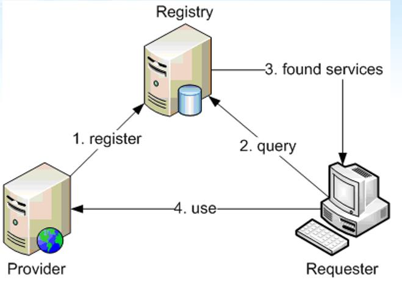
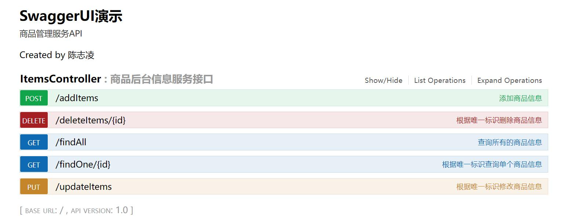
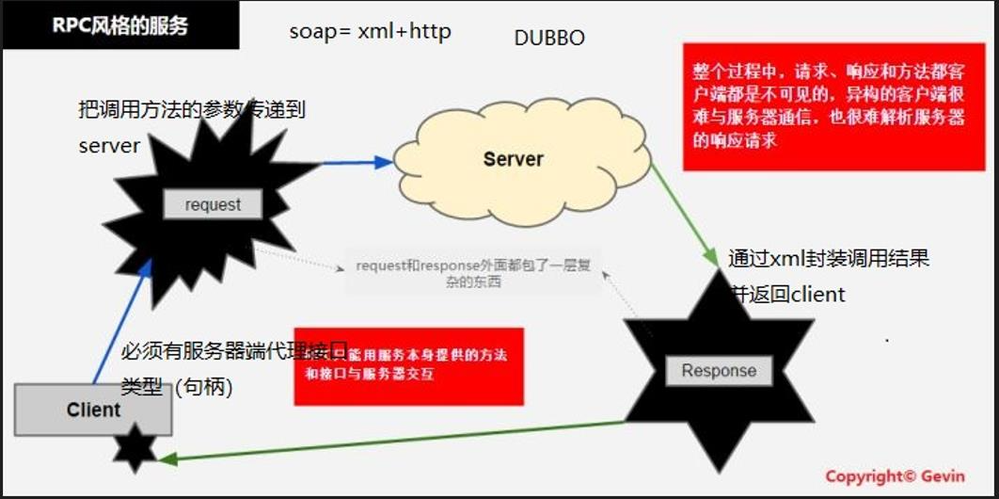
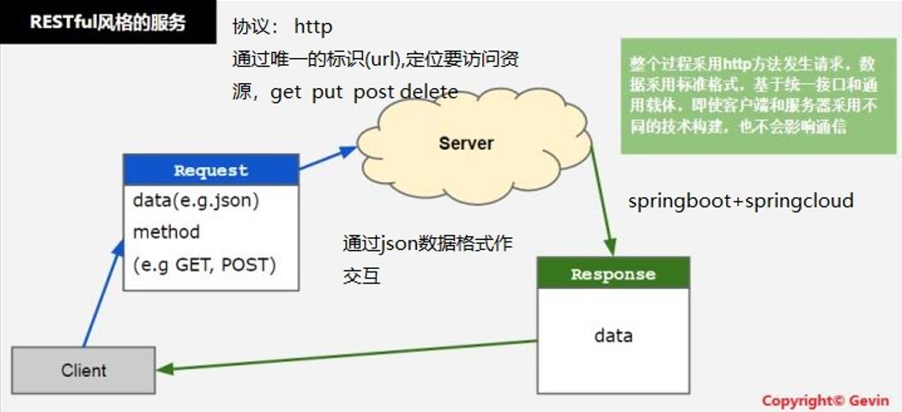

# 一 什么是WebService

WebService是部署在web上的，可访问的应用程序（接口）。主要是对外提供业务接口（业务功能）。

日常生活中免费的webservice，比如：天气预告

# 二 WebService组成

说明：

- 注册方    服务的提供方首先在注册服务器，服务的信息，包括：服务的描述、URL等等
- 服务提供方    web服务的实现方
- 服务消费方    （客户端 ）广义的概念：客户端 可以是app，门户网站，组件 （controller）等。

# 三  传统的webservice的技术标准

1. xml技术      特点：与平台无关性、与语言无关性

2. soap协议    Simple Object Access Protocal  简单对象访问协议   

3. WSDL        web服务的描述语言，本质是一个xml文档，主要用于描述web服务

  RPC - 远程方法调用    Remote Process Call

# 四  Restful风格的服务（重点）

1. json数据交互     更流行， 一般使用springmvc发布服务接口（API）

2. http协议

3. 无需wsdl文件

  Restful资源远程定位

# 五 传统的webservice开发技术

​      Apache CXF = Celtix + Xfire，开始叫 Apache CeltiXfire，后来更名为 Apache CXF 了，以下简称为 CXF。Apache CXF 是一个开源的 web Services 框架，CXF 帮助您构建和开发 web Services。

​     Cxf是基于SOA总线结构，依靠spring完成模块的集成，实现SOA方式

开发websercie的步骤：

1. 导入cxf类库。  开发一个web项目，把cxf的jar包导入到工程

2. web.xml中配置cxf的中央控制器

~~~xml
<!-- CXF 中央控制器 -->
<servlet>
    <servlet-name>cxfServlet</servlet-name>
    <servlet-class>org.apache.cxf.transport.servlet.CXFServlet</servlet-class>
    <load-on-startup>1</load-on-startup>
</servlet>
<servlet-mapping>
    <servlet-name>cxfServlet</servlet-name>
    <url-pattern>/services/*</url-pattern>
</servlet-mapping>
~~~

3. 实现业务

- 业务接口

~~~java
@WebService  //可发布的web接口
public interface ProductService {
    
    public List<Product> findAllProducts();
}
~~~

- 业务实现

~~~java
public class ProductServiceImpl implements ProductService {
    @Override
    public List<Product> findAllProducts() {
        List<Product> list = new ArrayList<>();
        for (int i = 1; i <= 10; i++) {
            list.add(new Product(i,"华为电视"+i,7000D,"深圳"));
        }
        return list;
    }
}
~~~

4. 以spring的方式发布webservice，添加applicationContext.xml

~~~xml
<!-- 发布应用程序接口 -->
<jaxws:endpoint id="productServiceImpl" 
                implementor="com.gec.webservice.service.ProductServiceImpl" 
                address="/productService"></jaxws:endpoint>
~~~

5. 访问webservice的wsdl文件

http://localhost:8088/services/productService?wsdl

6. 访问的客户端 

- 以spring的方式创建远程方法调用客户端 (代理)

~~~java
public static void main(String[] args) {

    ApplicationContext context = new ClassPathXmlApplicationContext("applicationContext.xml");
    //远程方法调用的代理接口实例
    ProductService productService = (ProductService) context.getBean("productService");
    //远程方法调用
    List<Product> list = productService.findAllProducts();
    for (Product product : list) {
        System.out.println(product.getId()+","+product.getName()+","+product.getPrice()+","+product.getAddress());
    }
}
~~~

- 以代理的方式（不依赖spring）

~~~java
public static void main(String[] args) {
    JaxWsProxyFactoryBean factory = new JaxWsProxyFactoryBean();
    factory.setServiceClass(ProductService.class);
    factory.setAddress("http://localhost:8088/services/productService");

    ProductService productService = (ProductService) factory.create();
    //远程方法调用
    List<Product> list = productService.findAllProducts();
    for (Product product : list) {
        System.out.println(product.getId()+","+product.getName()+","+product.getPrice()+","+product.getAddress());
    }
}
~~~

# 六  什么是Restful风格的服务

概念：网络上的所有的资源（业务数据）都有一个唯一标识（URI）来定位。只要获取了唯一标识就可以对资源进行操作（增删改查）。

Restful常用动作：

C       添加     POST

R       查询     GET 

U       编辑     PUT

D       删除     DELETE

 完成一个完整的Restful服务接口

~~~java
@RestController
public class ItemsController {
    @Autowired
    private ItemsService itemsService;

    @GetMapping("/findAll")
    public RespBean findAll() {
        List<Items> list = itemsService.findAll();
        return RespBean.ok("产品列表",list);
    }

    @GetMapping("/findOne/{id}")
    public RespBean findOne(@PathVariable  int id) {
        Items items = itemsService.findOne(id);
        return RespBean.ok("单件商品",items);
    }

    @PostMapping("/addItems")
    public RespBean addItems(@RequestBody Items items) {
        System.out.println(items.getId());
        System.out.println(items.getName());
        itemsService.addItems(items);
        return RespBean.ok("编辑成功");
    }
    
    @PutMapping("/updateItems")
    public RespBean updateItems(@RequestBody Items items) {
        itemsService.updateItems(items);
        return RespBean.ok("编辑成功");
    }
    
    @DeleteMapping("/deleteItems/{id}")
    public RespBean deleteItems(@PathVariable int id) {
        itemsService.deleteItems(id);
        return RespBean.ok("删除成功");
    }
}
~~~

服务接口的测试

（1）Postman工具

（2）Swagger在线文档

实现步骤：

- 添加swagger的依赖

~~~xml
<dependency>
    <groupId>io.springfox</groupId>
    <artifactId>springfox-swagger2</artifactId>
    <version>2.7.0</version>
</dependency>
<dependency>
    <groupId>io.springfox</groupId>
    <artifactId>springfox-swagger-ui</artifactId>
    <version>2.7.0</version>
</dependency>
~~~

- 添加swagger的配置

~~~java
/**
 * Swagger2API文档的配置
 */
@Configuration
@EnableSwagger2
public class Swagger2Config {
	@Bean
	public Docket createRestApi() {
		return new Docket(DocumentationType.SWAGGER_2)
				.apiInfo(apiInfo())
				.select()
				//为当前包下controller生成API文档
				.apis(RequestHandlerSelectors.basePackage("com.lyl.controller"))
				//为有@Api注解的Controller生成API文档
//                .apis(RequestHandlerSelectors.withClassAnnotation(Api.class))
				//为有@ApiOperation注解的方法生成API文档
//                .apis(RequestHandlerSelectors.withMethodAnnotation(ApiOperation.class))
				.paths(PathSelectors.any())
				.build();
	}

	private ApiInfo apiInfo() {
		return new ApiInfoBuilder()
				.title("SwaggerUI演示")
				.description("商品服务API")
				.contact("name")
				.version("1.0")
				.build();
	}
}
~~~

- 定义swagger2的注解

​       最常用有以下三个注解，分别用于类、方法、参数列表

~~~java
@Api(tags = "ItemsController",description = "商品后台信息服务接口")
@RestController
public class ItemsController {
    @Autowired
    private ItemsService itemsService;

    @ApiOperation("查询所有的商品信息")
    @GetMapping("/findAll")
    public RespBean findAll() {
        List<Items> list = itemsService.findAll();
        return RespBean.ok("产品列表",list);
    }

    @ApiOperation("根据唯一标识查询单个商品信息")
    @GetMapping("/findOne/{id}")
    public RespBean findOne(@PathVariable  int id) {
        Items items = itemsService.findOne(id);
        return RespBean.ok("单件商品",items);
    }

    @ApiOperation("添加商品信息")
    @PostMapping("/addItems")
    public RespBean addItems(@RequestBody @ApiParam("商品业务对象") Items items) {
        System.out.println(items.getId());
        System.out.println(items.getName());
        itemsService.addItems(items);
        return RespBean.ok("编辑成功");
    }

    @ApiOperation("根据唯一标识修改商品信息")
    @PutMapping("/updateItems")
    public RespBean updateItems(@RequestBody @ApiParam("商品业务对象") Items items) {
        itemsService.updateItems(items);
        return RespBean.ok("编辑成功");
    }

    @ApiOperation("根据唯一标识删除商品信息")
    @DeleteMapping("/deleteItems/{id}")
    public RespBean deleteItems(@PathVariable int id) {
        itemsService.deleteItems(id);
        return RespBean.ok("删除成功");
    }
}
~~~

swagger文档访问地址：http://localhost:8081/swagger-ui.html

# 七  传统webservice 和 restful服务区别

（1）传统webservice服务是以RPC为基础的调用，Remote Process Call

说明：

- 客户端必须引用服务端的接口类型，作为返回的代理接口实例，就是远程方法调用的客户端。
- RPC的调用一般用于同构平台较多，比如，编程语言一致。
- RPC调用性能较好。
- 微服务的框架：dubbo，采用了RPC调用。

（2）Restful服务的特点

说明：

- 轻量级，实现原理比较简单
- 数据是以json交互
- 以http为协议，访问性能较差
- 同构和异构平台都可在广泛使用
- 微服务的架构：springboot+springcloud(springcloud alibaba)