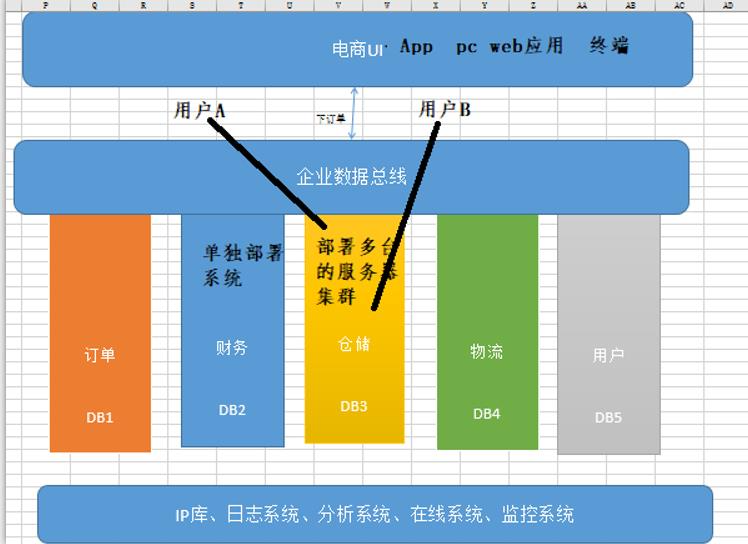

# 一 SOA架构

   首先理解一个思想基础： SOA 

   SOA    面向服务的架构（SOA Service Oriented Architecture）是一个组件模型，它将应用程序的不同功能单元（称为服务）进行拆分，并通过这些服务之间定义良好的接口和协议联系起来。接口是采用中立的方式进行定义的，它应该独立于实现服务的硬件平台、操作系统和编程语言。这使得构件在各种各样的系统中的服务可以以一种统一和通用的方式进行交互。

​     面向服务架构，它可以根据需求通过网络对松散耦合的粗粒度应用组件进行分布式部署、组合和使用。服务层是SOA的基础，可以直接被应用调用，从而有效控制系统中与软件代理交互的人为依赖性。

​    SOA架构演变的过程：

如下图：

- 单体应用

- 对业务层进行拆分 ，拆分成各自独立的单元（服务），这些服务可以独立部署，作集群

- 各个被拆分的服务，存在错综复杂的访问关系，怎么去管理这些复杂的服务单元？

- 通过“数据总线”来管理各个服务单元，这个数据总线其实就是“服务的注册中心”。

- 当前流行的两种微服务的构架： dubbo和springcloud

# 二  什么是微服务？(MicroService)

单一职责： 微服务中每一个服务都对应唯一的业务能力，做到单一职责

微：微服务的服务的拆分粒度很小，每个服务虽小，但“五脏俱全”

面向服务：每个服务都要对外提供统一接口标准（API）

自治：服务间互相独立，互不干扰。

团队独立：每个服务就是一个独立的开发团队，人数可以不多

促进前后端分离：基本采用前后端分离开发，前端一般流行：vue   angular   react 

# 三  Dubbo框架

​    dubbo是阿里开源的开发微服务的框架（RPC框架）。本身并不包含分布式治理的解决方案。使用较繁琐。但是dubbo使用时间较长，国内成功的案例比较多，技术含量较高。

   环境准备：

### 1. dubbo注册中心，使用zookeeper

- 解压zookeeper，创建如下图的文件结构 ：

- 在config目录中，创建zoo.cfg配置文件，修改zoo.cfg，如下：

~~~cfg
dataDir=D:\\Apache\\zookeeper\\data
dataLogDir=D:\\Apache\\zookeeper\\log
~~~

运行zookeeper，以管理员身份打开cmd命令行，运行：

### 2.安装dubbo的微服务监控中心

- 先修改tomcat的端口号（8080被占用）
- 把dubbo-admin-2.6.war复制到tomcat/webapps目录中进行部署
- 启动tomcat，war包自动解压部署
- 部署成功后，要删除war包
- 访问监控中心

​      地址：http://localhost:8088/dubbo-admin-2.6/

​      账号和密码：root

# 四  dubbo入门程序 

dubbo应用程序结构

# 五 使用dubbo重构拍卖系统

