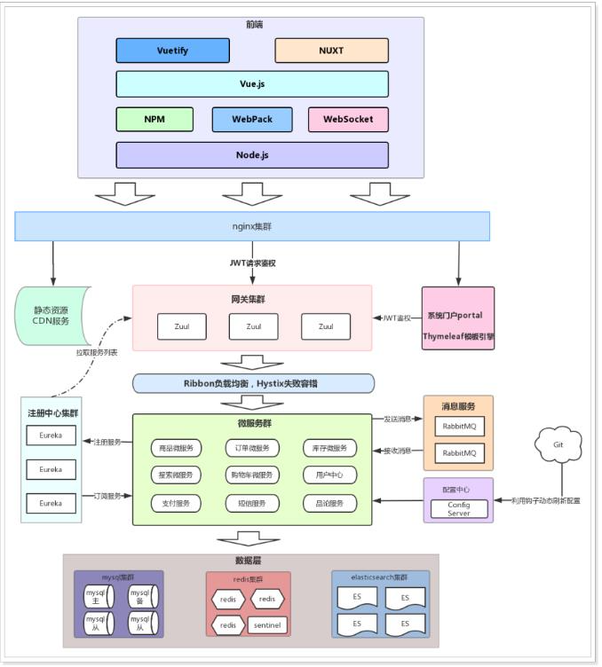
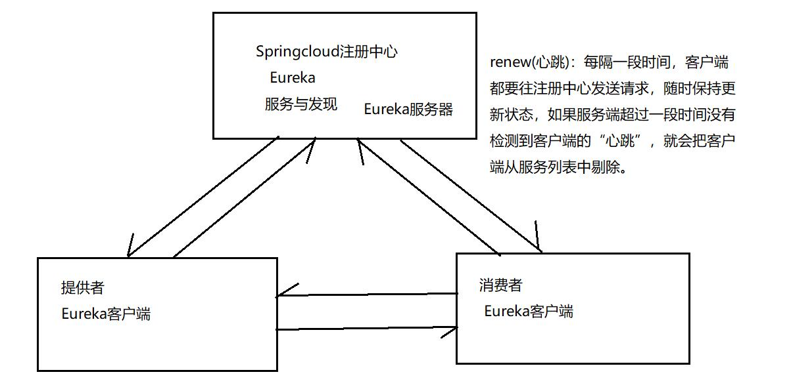
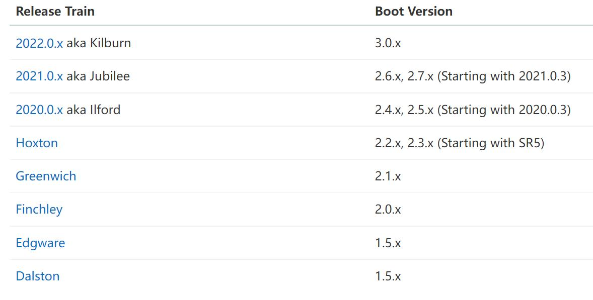

# 一  初识SpringCloud

​      微服务是一种架构方式，最终肯定需要技术架构去实施。

​      微服务的实现方式很多，但是最火的莫过于Spring Cloud了。为什么？

​      后台硬：作为Spring家族的一员，有整个Spring全家桶靠山，背景十分强大。

​      技术强：Spring作为Java领域的前辈，可以说是功力深厚。有强力的技术团队支撑，一般人还真比不了。

​      群众基础好：可以说大多数程序员的成长都伴随着Spring框架，   现在有几家公司开发不用Spring？SpringCloud与Spring的各个框架无缝整合，对大家来说一切都是熟悉的配方，熟悉的味道。

​      使用方便：相信大家都体会到了SpringBoot给我们开发带来的便利，而SpringCloud完全支持SpringBoot的开发，用很少的配置就能完成微服务框架的搭建。

【简介】

1. SpringCloud是Spring旗下的项目之一，官网地址：http://projects.spring.io/spring-cloud/
2. Spring最擅长的就是集成，把世界上最好的框架拿过来，集成到自己的项目中。
3. SpringCloud也是一样，它将现在非常流行的一些技术整合到一起，实现了诸如： 配置管理，服务发现，智能路由，负载均衡，熔断器，控制总线，集群状态等等功能。
4. Spring Cloud由众多子项目组成，如Spring Cloud Config、Spring Cloud Netflix、Spring Cloud Consul 等，提供了搭建分布式系统及微服务常用的工具，如配置管理、服务发现、断路器、智能路由、微代理、控制总线、一次性token、全局锁、选主、分布式会话和集群状态等，**满足了构建微服务所需的所有解决方案**。比如使用Spring Cloud Config 可以实现统一配置中心，对配置进行统一管理；使用Spring Cloud Netflix 可以实现Netflix 组件的功能 - 服务发现（Eureka）、智能路由（Zuul）、客户端负载均衡（Ribbon）。

# 二  Springcloud和Dubbo对比

1. SpringCloud是http协议传输，带宽会比较多，同时使用http协议一般会使用JSON报文，消耗会更大。
2. dubbo的开发难度较大，原因是dubbo的jar包依赖问题很多大型工程无法解决。
3. springcloud的接口协议约定比较自由且松散，需要有强有力的行政措施来限制接口无序升级。
4. dubbo的注册中心可以选择zk,redis等多种，springcloud的注册中心只能用eureka或者自研。
5. SpringCloud全家桶：社区支持强大，更新非常快，所以开发效率高。
6. Dubbo确实类似于Spring Cloud的一个子集，Dubbo功能和文档完善，在国内有很多的成熟用户，然而鉴于Dubbo的社区现状（曾经长期停止维护，2017年7月31日团队又宣布重点维护），使用起来还是有一定的门槛。

# 三   Springboot+Springcloud架构

# 四  Springcloud Netflix 技术栈（常用、基础）

1. 注册中心   Eureka   本身就是一个Springboot的应用
2. Ribbon  负载均衡器
3. Hystrix   断路器
4. Zuul    网关
5. 微服务间调用    feign客户端    RestTemplate

# 五  Eureka服务与发现

  springcloud微服务是由Eueka注册中心、服务提供者、服务消费者组成

开发Eureka注册中心

Springboot 和  Springcloud的版本对应关系

Eureka注册中心的实现步骤：

- 添加Eureka Server的依赖

~~~xml
~~~

