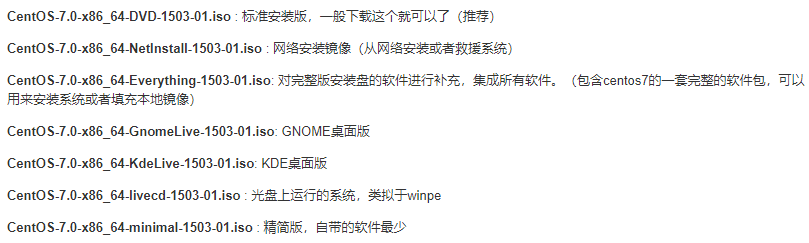

**centos7安装**

本章节我们将为大家介绍 通过本地虚拟机软件VM来进行Linux 的安装。现在其实云服务器挺普遍的，价格也便宜，如果直接不想搭建，也可以直接买一台学习用用。

**云服务器**

**云服务器(Elastic Compute Service, ECS)**是一种简单高效、安全可靠、处理能力可弹性伸缩的计算服务。

云服务器管理方式比物理服务器更简单高效，我们无需提前购买昂贵的硬件，即可迅速创建或删除云服务器，云服务器费用一般在几十到几百不等，可以根据我们的需求配置。

目前市场上的云服务器很多，主要有腾讯云、阿里云、华为云

**IOS镜像文件**

虚拟机安装Linux系统，需要IOS文件，各个版本的ISO镜像文件介绍：

VM、镜像文件均在课程对应资源文件中，其中镜像文件为标准安装版