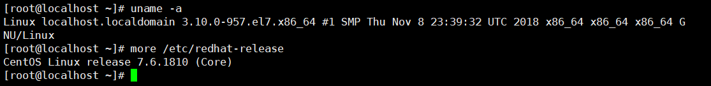

# centos7安装

本章节我们将为大家介绍 通过本地虚拟机软件VM来进行Linux 的安装。现在其实云服务器挺普遍的，价格也便宜，如果直接不想搭建，也可以直接买一台学习用用。

**云服务器**

**云服务器(Elastic Compute Service, ECS)**是一种简单高效、安全可靠、处理能力可弹性伸缩的计算服务。

云服务器管理方式比物理服务器更简单高效，我们无需提前购买昂贵的硬件，即可迅速创建或删除云服务器，云服务器费用一般在几十到几百不等，可以根据我们的需求配置。

目前市场上的云服务器很多，主要有腾讯云、阿里云、华为云

**IOS镜像文件**

虚拟机安装Linux系统，需要IOS文件，各个版本的ISO镜像文件介绍：

VM、镜像文件均在课程对应资源文件中，其中镜像文件为标准安装版

**简易安装模式**

安装虚拟机软件VM后打开，新建虚拟机

 

下一步后，找到系统中的镜像文件，选中镜像，如果能够出现简易安装模式，可以极简安装（不推荐）

 

下一步设置用户名密码

 

下一步设置虚拟机名字和虚拟机文件存放位置

 

下一步设置磁盘

 

 

点击下一步完成后，开始安装centos系统，自动配置，等待安装完成即可。

简易安装模式：

快速安装centos系统的一种安装模式，配置非常少，大部分会自动配置。简易安装模式需要虚拟机软件、镜像文件两方面支持

使用课程中的资源包即可支持简易安装

**非简易安装模式**

如果不能使用简易安装模式，前面的步骤与简易安装模式相似，参考简易安装模式，使用默认配置直到开始安装centos系统。接下来继续完成下面步骤。

开启虚拟机后会出现以下界面

1. Install CentOS 7 安装CentOS 7
2. Test this media & install CentOS 7 测试安装文件并安装CentOS 7
3. Troubleshooting 修复故障

选择第一项，安装直接CentOS 7，回车，进入下面的界面

 

选择安装过程中使用的语言，这里选择英文、键盘选择美式键盘。点击Continue

 

首先设置时间

 

时区选择上海，查看时间是否正确。然后点击Done

 

选择需要安装的软件

 

选择安装位置，在这里可以进行磁盘划分，选择默认安装

 

设置主机名与网卡信息

 

首先要打开网卡，开启自动配置网络，然后查看是否能获取到IP地址，再更改主机名(可省略)后点击Done。

 

最后选择Begin Installation(开始安装)

 

设置root密码

 

设置root密码（如果显示密码安全性弱，可以忽略）后点击Done

 

点击USER CREATION 创建管理员用户

 

输入自定义用户名密码后点击Done

等待系统安装完毕重启系统即可

 

安装图形化界面桌面GNOME（可选）

重启后选择第一个

 

输入root用户

 

输入刚才设置的密码，密码不会显示

 

成功进入系统

 

网络服务检测网络连通性

ping www.baidu.com

64 bytes from 14.215.177.38 (14.215.177.38): icmp_seq=1 ttl=128 time=4.50 ms

64 bytes from 14.215.177.38 (14.215.177.38): icmp_seq=2 ttl=128 time=4.60 ms

64 bytes from 14.215.177.38 (14.215.177.38): icmp_seq=3 ttl=128 time=5.17 ms

64 bytes from 14.215.177.38 (14.215.177.38): icmp_seq=4 ttl=128 time=5.49 ms

可以看到已经可以上百度了（ctrl+c退出），现在可以yum安装所需图形化桌面

yum groupinstall -y "GNOME Desktop"

安装完成后重启进入

输入 init 5 进入图形化桌面

 

输入密码登录

 

**修改时间**

简易安装模式，时区默认不是中国所在的GMT+8时区，可以通过如下步骤修改

打开applications->system tools->settings

 

点击搜索图标

 

输入date

 

 

输入超级管理员密码

 

点击TimeZone项，在弹出的地图上直接选取中国任意位置即可

 

# Linux简介

常用操作系统介绍

​     

 

**Unix**

UNIX操作系统，是一个强大的多用户、多任务操作系统。1969年在[AT&T](https://baike.baidu.com/item/AT%26T)的贝尔实验室着手研发。90年代末，Unix正式走向商业化，使用Unix系统，必须支付昂贵的授权使用费。

**Linux背景**

在Unix昂贵的授权费用下，很多大学不得不停止对其研究，老师导致上课也不知道讲什么了。

1991年，Linus Torvalds(林纳斯·托瓦兹)在互联网上公布了自己写的Linux，并对外声称不收取任何费用，期望大家共同改进Linux系统；

Linux是一款免费的操作系统，用户可以通过网络或其他途径免费获得，并可以任意修改其源代码。

**Linux发行版本**

 1991年的Linus Torvalds公布的是Linux的内核（kernel）。但是要注意的是，公布的是源码，并不是编译好的直接可安装的操作系统，我们如何安装一个操作系统呢？很简单啊，就是先下载一份源码，然后进行编译安装，但是编译的时候程序需要运行在操作系统上啊，操作系统呢？还没有编译呢。于是就陷入了一个死循环中，就是我们要安装操作系统，就需要编译，编译的时候需要操作系统，这样就是鸡生蛋，蛋生鸡。 

​         在这个背景下，一些商业公司，开始着手解决这个问题，他们将已经公开好的Kernel（内核）再加上一些开源的周边软件收集起来编译成二级制文件放到网上供别人使用，这个就是Linux的发行版本，其中最为著名的是RedHat公司。

因此，当我们说Linux的版本时，一般来说有两个版本，一个是内核的版本，一个是发行的版本。例如登录到终端执行命令：

从上面可以看出，uname -a 查看了内核的版本，是3.10.0的版本，而 more /etc/redhat-release就是查看发行版的版本，表示了当前安装的是Centos7.6的发行版。

Linux主要发行版本

 

 

**Linux基本思想**

- **一切皆文件**，把几乎所有的资源都组织成文件的格式，我们只需要一个文本编辑工具，就可以修改工作的特性了，很方便。 
- 组合小程序，完成复杂任务，例如将系统调用组合形成库（在Linux就是so结尾的文件）。
- 尽量避免和用户交互，Windows上就是弹框，让你点确定。在Linux上，如果执行一个程序之后没有任何提示，那就是最后的提示。
- 使用纯文本文件保存配置信息，这个在第一点就可以看出来。

 

**Linux系统的组成**

Linux系统一般有4个主要部分：

Ø Linux内核

• 内核是系统的心脏，实现操作系统的基本功能（如虚拟内存、多任务、共享库、需求加载、可执行程序和TCP/IP网络功能）。

Ø Linux Shell

• Shell是系统的用户界面，提供了用户与内核进行交互操作的一种接口。

Ø Linux文件系统

• 文件系统是文件存放在磁盘等存储设备上的组织方法。通常是按照目录层次的方式进行组织。系统以 / 为根目录。

Ø Linux应用程序

• 标准的Linux系统一般都有一套成为应用程序的程序集，包括文本编辑器、编程语言、X Window、办公套件、Internet工具、数据库等。

 

 

 

 

**Linux目录结构**

 

 

/

根目录，每一个文件和目录都是从根目录开始；

/home

主目录（通常也叫家目录），每一个非系统用户都在该目录下有一个与用户名相同的目录，为该用户的工作目录，如/home/zhangsan。

/etc

配置文件，包含所有程序所需的配置文件；

/etc/init.d

包含各软件、服务启动的脚本文件，通过service命令启动|停止|重启。

/usr   (相当于windown 的 c:/programe files/)

最庞大的目录，几乎所有应用程序都安装在这里，本地安装的程序和其他软件、资源库都在/usr/local 下。

.     表示当前目录。

/opt  这是给主机额外安装软件所摆放的目录。比如：安装mysql，就可以放到这个目录中。默认是空的。

/media  linux系统会自动识别一些设备，例如U盘、光驱等等，当识别后，linux会把识别的设备挂载到这个目录下。

/dev 类似于window的设备管理器，把所有的硬件以文件的形式存储。

通过list查看linux目录结构

\#查看根目录列表

ls /

\#查看用户主目录文件列表

ls /home

\#查看当前目录列表

ls .

**远程操作工具**

Linux 一般作为服务器使用，而服务器一般放在机房，你不可能在机房操作你的 Linux 服务器。

这时我们就需要远程登录到Linux服务器来管理维护系统。

Linux 系统中是通过 ssh 服务实现的远程登录功能，默认 ssh 服务端口号为 22。

Window 系统上 Linux 远程登录客户端有XShell、 SecureCRT、 Putty 等

 

**通过xshell操作Linux**

查看Linux虚拟机的ip

ip add

 

打开xshell，点击新建

 

设置连接信息

​     

设置登录账号密码后点击连接即可，第一次连接会弹出ssh密钥，保存后下次即可免密登录

 

**网络配置和系统管理操作**

**1** **配置子网****IP****和网关**

1）查看虚拟网络编辑器

2）修改ip地址

3）查看网关

**2** **配置虚拟机****ip****地址**

**2.1 ifconfig** **查询****ip****地址**

ifconfig :network interfaces configuring网络接口配置

1）基本语法

ifconfig      （功能描述：显示所有网络接口的配置信息）

2）案例实操

​    （1）查看当前网络ip

[root@hadoop100 桌面]# ifconfig

3）如果安装CentOS时选择的是最小化安装，需要安装以下工具包才能使用ifconfig命令

​    **yum -y install net-tools**

**2.2** **修改****IP****地址**

1）修改IP地址

[root@hadoop100 桌面]#

vim /etc/sysconfig/network-scripts/ifcfg-ens33

以下标红的项必须修改，有值的按照下面的值修改，没有该项的要增加。

\#IP的配置方法[none|static|bootp|dhcp]（引导时不使用协议|静态分配IP|BOOTP协议|DHCP协议）

BOOTPROTO=static

  

\#IP地址

IPADDR=192.168.6.100 

\#网关 

GATEWAY=192.168.6.2   

\#域名解析器

DNS1=192.168.6.2

​    修改后，如下图所示

：wq 保存退出

2）执行systemctl restart network命令

3）如果报错，reboot，重启虚拟机

4）修改windows的VMnet8网卡信息（也可以选择自动获取）

**2.3ping** **测试主机之间网络连通性**

1）基本语法

​    ping 目的主机    （功能描述：测试当前服务器是否可以连接目的主机）

2）案例实操

​    （1）测试当前服务器是否可以连接百度

[root@hadoop100 桌面]# ping [www.baidu.com](http://www.baidu.com)

**5.3** **配置主机名**

**3.1 hostname** **显示和设置系统的主机名称**

1）基本语法

hostname     （功能描述：查看当前服务器的主机名称）

2）案例实操

​    （1）查看当前服务器主机名称

[root@hadoop100 桌面]# hostname

**3.2** **修改主机名称**

1）修改linux的主机映射文件（hosts文件）

（1）进入Linux系统查看本机的主机名。通过hostname命令查看

[root@hadoop100 桌面]# hostname

localhost.localdomain

（2）如果感觉此主机名不合适，我们可以进行修改。通过编辑/etc/hostname文件

[root@hadoop100 桌面]# vim /etc/hostname

文件中内容

localhost.localdomain

（3）打开此文件后，可以看到主机名。修改此主机名为我们想要修改的主机名

java100

（4）保存退出。

（5）打开/etc/hosts

[root@hadoop100 桌面]# vim /etc/hosts

添加如下内容

192.168.6.100 java100

192.168.6.101 java101

 

（6）并重启设备，重启后，查看主机名，已经修改成功

**4** **服务管理**

**4.1** **临时后台服务管理**

**1****）基本语法（****CentOS 6****）**

​    service 服务名 start           （功能描述：开启服务）

service 服务名 stop           （功能描述：关闭服务）

service 服务名 restart         （功能描述：重新启动服务）

service 服务名 status         （功能描述：查看服务状态）

**2****）****基本语法（****CentOS 7****）**

 systemctl start   服务名       （功能描述：开启服务）

systemctl  stop   服务名       （功能描述：关闭服务）

systemctl  restart 服务名      （功能描述：重新启动服务）

systemctl  status 服务名      （功能描述：查看服务状态）

systemctl  --type  service       （功能描述：查看正在运行的服务）

**3****）经验技巧**

​    查看服务的方法：**/usr/lib/systemd/system**

**4****）案例实操**

（1）查看网络服务的状态

[root@hadoop100 桌面]#systemctl status network

（2）停止网络服务

[root@hadoop100 桌面]#systemctl stop network

（3）启动网络服务

[root@hadoop100 桌面]#systemctl start network

（4）重启网络服务

[root@hadoop100 桌面]#systemctl restart network

**4.2** **设置后台服务的自启配置**

**1****）基本语法（****CentOS 6****）**

chkconfig             （功能描述：查看所有服务器自启配置）

chkconfig 服务名 off  （功能描述：关掉指定服务的自动启动）

chkconfig 服务名 on  （功能描述：开启指定服务的自动启动）

chkconfig 服务名 --list （功能描述：查看服务开机启动状态）

 

**2****）****基本语法（****CentOS 7****）**

systemctl  list-unit-files   （功能描述：查看所有服务器自启配置）

systemctl  disable 服务名  （功能描述：关掉指定服务的自动启动）

systemctl  enable  服务名 （功能描述：开启指定服务的自动启动）

systemctl  is-enabled 服务名（功能描述：查看服务开机启动状态）

**3****）案例实操**

（1）关闭防火墙的自动启动

[root@hadoop100 桌面]#system disable firewalld.service

（2）开启防火墙的自动启动

[root@hadoop100 桌面]#system enable firewalld

（3）查看防火墙状态

[root@hadoop100桌面]#systemctl is-enabled firewalld

**5.5** **关机重启命令**

在linux领域内大多用在服务器上，很少遇到关机的操作。毕竟服务器上跑一个服务是永无止境的，除非特殊情况下，不得已才会关机。

**正确的关机流程为**：sync > shutdown > reboot >poweroff

**1****）基本语法**

​    （1）sync            （功能描述：将数据由内存同步到硬盘中）

（2）poweroff       （功能描述：关闭系统，等同于shutdown -h now）

（3）reboot         （功能描述：就是重启，等同于 shutdown -r now）

​    （4）shutdown [选项] 时间

表1-4

| 选项 | 功能          |
| ---- | ------------- |
| -h   | -h=halt关机   |
| -r   | -r=reboot重启 |

表1-5

| 参数 | 功能                                   |
| ---- | -------------------------------------- |
| now  | 立刻关机                               |
| 时间 | 等待多久后关机（时间单位是**分钟**）。 |

**2****）经验技巧**

​    Linux系统中为了提高磁盘的读写效率，对磁盘采取了 “预读迟写”操作方式。当用户保存文件时，Linux核心并不一定立即将保存数据写入物理磁盘中，而是将数据保存在缓冲区中，等缓冲区满时再写入磁盘，这种方式可以极大的提高磁盘写入数据的效率。但是，也带来了安全隐患，如果数据还未写入磁盘时，系统掉电或者其他严重问题出现，则将导致数据丢失。使用sync指令可以立即将缓冲区的数据写入磁盘。

**3****）案例实操**

（1）将数据由内存同步到硬盘中

[root@hadoop100桌面]#sync  

（2）重启

[root@hadoop100桌面]# reboot

（3）关机

[root@hadoop100桌面]#poweroff

（4）计算机将在1分钟后关机，并且会显示在登录用户的当前屏幕中

[root@hadoop100桌面]#shutdown -h 1 ‘This server will shutdown after 1 mins’

（5）立马关机（等同于 halt）

[root@hadoop100桌面]# shutdown -h now

（6）系统立马重启（等同于 reboot）

[root@hadoop100桌面]# shutdown -r now