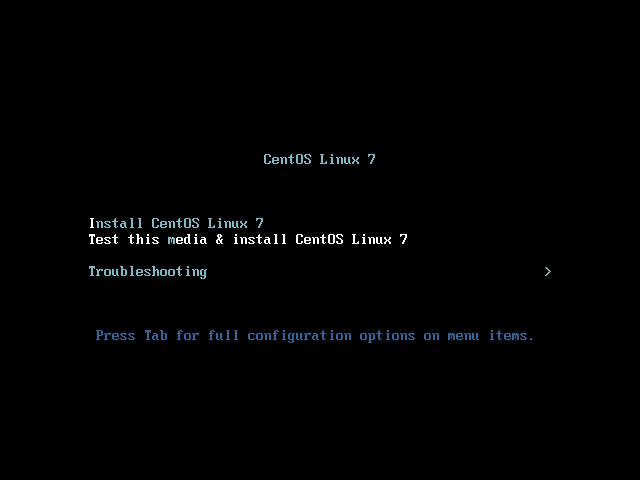

# **centos7安装**

本章节我们将为大家介绍 通过本地虚拟机软件VM来进行Linux 的安装。现在其实云服务器挺普遍的，价格也便宜，如果直接不想搭建，也可以直接买一台学习用用。

**云服务器**

**云服务器(Elastic Compute Service, ECS)**是一种简单高效、安全可靠、处理能力可弹性伸缩的计算服务。

云服务器管理方式比物理服务器更简单高效，我们无需提前购买昂贵的硬件，即可迅速创建或删除云服务器，云服务器费用一般在几十到几百不等，可以根据我们的需求配置。

目前市场上的云服务器很多，主要有腾讯云、阿里云、华为云

**IOS镜像文件**

虚拟机安装Linux系统，需要IOS文件，各个版本的ISO镜像文件介绍：

VM、镜像文件均在课程对应资源文件中，其中镜像文件为标准安装版

**简易安装模式**

安装虚拟机软件VM后打开，新建虚拟机

 

下一步后，找到系统中的镜像文件，选中镜像，如果能够出现简易安装模式，可以极简安装（不推荐）

 

下一步设置用户名密码

 

下一步设置虚拟机名字和虚拟机文件存放位置

 

下一步设置磁盘

 

 

点击下一步完成后，开始安装centos系统，自动配置，等待安装完成即可。

简易安装模式：

快速安装centos系统的一种安装模式，配置非常少，大部分会自动配置。简易安装模式需要虚拟机软件、镜像文件两方面支持

使用课程中的资源包即可支持简易安装

**非简易安装模式**

如果不能使用简易安装模式，前面的步骤与简易安装模式相似，参考简易安装模式，使用默认配置直到开始安装centos系统。接下来继续完成下面步骤。

开启虚拟机后会出现以下界面

1. Install CentOS 7 安装CentOS 7
2. Test this media & install CentOS 7 测试安装文件并安装CentOS 7
3. Troubleshooting 修复故障

选择第一项，安装直接CentOS 7，回车，进入下面的界面

 

选择安装过程中使用的语言，这里选择英文、键盘选择美式键盘。点击Continue

 

首先设置时间

 

时区选择上海，查看时间是否正确。然后点击Done

 

选择需要安装的软件

 

选择安装位置，在这里可以进行磁盘划分，选择默认安装

 

设置主机名与网卡信息

 

首先要打开网卡，开启自动配置网络，然后查看是否能获取到IP地址，再更改主机名(可省略)后点击Done。

 

最后选择Begin Installation(开始安装)

 

设置root密码

 

设置root密码（如果显示密码安全性弱，可以忽略）后点击Done

 

点击USER CREATION 创建管理员用户

 

输入自定义用户名密码后点击Done

等待系统安装完毕重启系统即可

 

安装图形化界面桌面GNOME（可选）

重启后选择第一个

 

输入root用户

 

输入刚才设置的密码，密码不会显示

 

成功进入系统

 

网络服务检测网络连通性

ping www.baidu.com

64 bytes from 14.215.177.38 (14.215.177.38): icmp_seq=1 ttl=128 time=4.50 ms

64 bytes from 14.215.177.38 (14.215.177.38): icmp_seq=2 ttl=128 time=4.60 ms

64 bytes from 14.215.177.38 (14.215.177.38): icmp_seq=3 ttl=128 time=5.17 ms

64 bytes from 14.215.177.38 (14.215.177.38): icmp_seq=4 ttl=128 time=5.49 ms

可以看到已经可以上百度了（ctrl+c退出），现在可以yum安装所需图形化桌面

yum groupinstall -y "GNOME Desktop"

安装完成后重启进入

输入 init 5 进入图形化桌面

 

输入密码登录

 

**修改时间**

简易安装模式，时区默认不是中国所在的GMT+8时区，可以通过如下步骤修改

打开applications->system tools->settings

 

点击搜索图标

 

输入date

 

 

输入超级管理员密码

 

点击TimeZone项，在弹出的地图上直接选取中国任意位置即可

 

