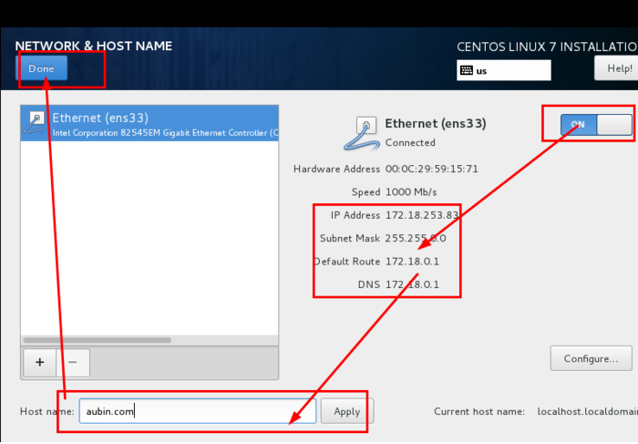
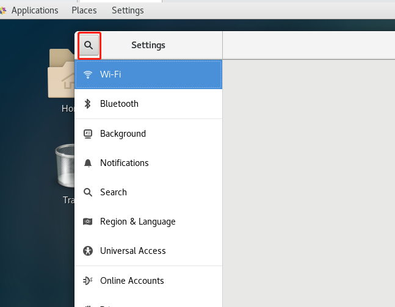

# centos7安装

本章节我们将为大家介绍 通过本地虚拟机软件VM来进行Linux 的安装。现在其实云服务器挺普遍的，价格也便宜，如果直接不想搭建，也可以直接买一台学习用用。

**云服务器**

**云服务器(Elastic Compute Service, ECS)**是一种简单高效、安全可靠、处理能力可弹性伸缩的计算服务。

云服务器管理方式比物理服务器更简单高效，我们无需提前购买昂贵的硬件，即可迅速创建或删除云服务器，云服务器费用一般在几十到几百不等，可以根据我们的需求配置。

目前市场上的云服务器很多，主要有腾讯云、阿里云、华为云

**IOS镜像文件**

虚拟机安装Linux系统，需要IOS文件，各个版本的ISO镜像文件介绍：

VM、镜像文件均在课程对应资源文件中，其中镜像文件为标准安装版

**简易安装模式**

安装虚拟机软件VM后打开，新建虚拟机

 

下一步后，找到系统中的镜像文件，选中镜像，如果能够出现简易安装模式，可以极简安装（不推荐）

 

下一步设置用户名密码

 

下一步设置虚拟机名字和虚拟机文件存放位置

 

下一步设置磁盘

 

 

点击下一步完成后，开始安装centos系统，自动配置，等待安装完成即可。

简易安装模式：

快速安装centos系统的一种安装模式，配置非常少，大部分会自动配置。简易安装模式需要虚拟机软件、镜像文件两方面支持

使用课程中的资源包即可支持简易安装

**非简易安装模式**

如果不能使用简易安装模式，前面的步骤与简易安装模式相似，参考简易安装模式，使用默认配置直到开始安装centos系统。接下来继续完成下面步骤。

开启虚拟机后会出现以下界面

1. Install CentOS 7 安装CentOS 7
2. Test this media & install CentOS 7 测试安装文件并安装CentOS 7
3. Troubleshooting 修复故障

选择第一项，安装直接CentOS 7，回车，进入下面的界面

 

选择安装过程中使用的语言，这里选择英文、键盘选择美式键盘。点击Continue

 

首先设置时间

 

时区选择上海，查看时间是否正确。然后点击Done

 

选择需要安装的软件

 

选择安装位置，在这里可以进行磁盘划分，选择默认安装

 

设置主机名与网卡信息

 

首先要打开网卡，开启自动配置网络，然后查看是否能获取到IP地址，再更改主机名(可省略)后点击Done。

 

最后选择Begin Installation(开始安装)

 

设置root密码

 

设置root密码（如果显示密码安全性弱，可以忽略）后点击Done

 

点击USER CREATION 创建管理员用户

 

输入自定义用户名密码后点击Done

等待系统安装完毕重启系统即可

 

安装图形化界面桌面GNOME（可选）

重启后选择第一个

 

输入root用户

 

输入刚才设置的密码，密码不会显示

 

成功进入系统

 

网络服务检测网络连通性

ping www.baidu.com

64 bytes from 14.215.177.38 (14.215.177.38): icmp_seq=1 ttl=128 time=4.50 ms

64 bytes from 14.215.177.38 (14.215.177.38): icmp_seq=2 ttl=128 time=4.60 ms

64 bytes from 14.215.177.38 (14.215.177.38): icmp_seq=3 ttl=128 time=5.17 ms

64 bytes from 14.215.177.38 (14.215.177.38): icmp_seq=4 ttl=128 time=5.49 ms

可以看到已经可以上百度了（ctrl+c退出），现在可以yum安装所需图形化桌面

yum groupinstall -y "GNOME Desktop"

安装完成后重启进入

输入 init 5 进入图形化桌面

 

输入密码登录

 

**修改时间**

简易安装模式，时区默认不是中国所在的GMT+8时区，可以通过如下步骤修改

打开applications->system tools->settings

 

点击搜索图标

 

输入date

 

 

输入超级管理员密码

 

点击TimeZone项，在弹出的地图上直接选取中国任意位置即可

 

# Linux简介

常用操作系统介绍

​     

 

**Unix**

UNIX操作系统，是一个强大的多用户、多任务操作系统。1969年在[AT&T](https://baike.baidu.com/item/AT%26T)的贝尔实验室着手研发。90年代末，Unix正式走向商业化，使用Unix系统，必须支付昂贵的授权使用费。

**Linux背景**

在Unix昂贵的授权费用下，很多大学不得不停止对其研究，老师导致上课也不知道讲什么了。

1991年，Linus Torvalds(林纳斯·托瓦兹)在互联网上公布了自己写的Linux，并对外声称不收取任何费用，期望大家共同改进Linux系统；

Linux是一款免费的操作系统，用户可以通过网络或其他途径免费获得，并可以任意修改其源代码。

**Linux发行版本**

 1991年的Linus Torvalds公布的是Linux的内核（kernel）。但是要注意的是，公布的是源码，并不是编译好的直接可安装的操作系统，我们如何安装一个操作系统呢？很简单啊，就是先下载一份源码，然后进行编译安装，但是编译的时候程序需要运行在操作系统上啊，操作系统呢？还没有编译呢。于是就陷入了一个死循环中，就是我们要安装操作系统，就需要编译，编译的时候需要操作系统，这样就是鸡生蛋，蛋生鸡。 

​         在这个背景下，一些商业公司，开始着手解决这个问题，他们将已经公开好的Kernel（内核）再加上一些开源的周边软件收集起来编译成二级制文件放到网上供别人使用，这个就是Linux的发行版本，其中最为著名的是RedHat公司。

因此，当我们说Linux的版本时，一般来说有两个版本，一个是内核的版本，一个是发行的版本。例如登录到终端执行命令：

从上面可以看出，uname -a 查看了内核的版本，是3.10.0的版本，而 more /etc/redhat-release就是查看发行版的版本，表示了当前安装的是Centos7.6的发行版。

Linux主要发行版本

 

 

**Linux基本思想**

- **一切皆文件**，把几乎所有的资源都组织成文件的格式，我们只需要一个文本编辑工具，就可以修改工作的特性了，很方便。 
- 组合小程序，完成复杂任务，例如将系统调用组合形成库（在Linux就是so结尾的文件）。
- 尽量避免和用户交互，Windows上就是弹框，让你点确定。在Linux上，如果执行一个程序之后没有任何提示，那就是最后的提示。
- 使用纯文本文件保存配置信息，这个在第一点就可以看出来。

 

**Linux系统的组成**

Linux系统一般有4个主要部分：

Ø Linux内核

• 内核是系统的心脏，实现操作系统的基本功能（如虚拟内存、多任务、共享库、需求加载、可执行程序和TCP/IP网络功能）。

Ø Linux Shell

• Shell是系统的用户界面，提供了用户与内核进行交互操作的一种接口。

Ø Linux文件系统

• 文件系统是文件存放在磁盘等存储设备上的组织方法。通常是按照目录层次的方式进行组织。系统以 / 为根目录。

Ø Linux应用程序

• 标准的Linux系统一般都有一套成为应用程序的程序集，包括文本编辑器、编程语言、X Window、办公套件、Internet工具、数据库等。

 

 

 

 

**Linux目录结构**

 

 

/

根目录，每一个文件和目录都是从根目录开始；

/home

主目录（通常也叫家目录），每一个非系统用户都在该目录下有一个与用户名相同的目录，为该用户的工作目录，如/home/zhangsan。

/etc

配置文件，包含所有程序所需的配置文件；

/etc/init.d

包含各软件、服务启动的脚本文件，通过service命令启动|停止|重启。

/usr   (相当于windown 的 c:/programe files/)

最庞大的目录，几乎所有应用程序都安装在这里，本地安装的程序和其他软件、资源库都在/usr/local 下。

.     表示当前目录。

/opt  这是给主机额外安装软件所摆放的目录。比如：安装mysql，就可以放到这个目录中。默认是空的。

/media  linux系统会自动识别一些设备，例如U盘、光驱等等，当识别后，linux会把识别的设备挂载到这个目录下。

/dev 类似于window的设备管理器，把所有的硬件以文件的形式存储。

通过list查看linux目录结构

\#查看根目录列表

ls /

\#查看用户主目录文件列表

ls /home

\#查看当前目录列表

ls .

**远程操作工具**

Linux 一般作为服务器使用，而服务器一般放在机房，你不可能在机房操作你的 Linux 服务器。

这时我们就需要远程登录到Linux服务器来管理维护系统。

Linux 系统中是通过 ssh 服务实现的远程登录功能，默认 ssh 服务端口号为 22。

Window 系统上 Linux 远程登录客户端有XShell、 SecureCRT、 Putty 等

 

**通过xshell操作Linux**

查看Linux虚拟机的ip

ip add

 

打开xshell，点击新建

 

设置连接信息

​     

设置登录账号密码后点击连接即可，第一次连接会弹出ssh密钥，保存后下次即可免密登录

 

**网络配置和系统管理操作**

**1** **配置子网****IP****和网关**

1）查看虚拟网络编辑器

2）修改ip地址

3）查看网关

**2** **配置虚拟机****ip****地址**

**2.1 ifconfig** **查询****ip****地址**

ifconfig :network interfaces configuring网络接口配置

1）基本语法

ifconfig      （功能描述：显示所有网络接口的配置信息）

2）案例实操

​    （1）查看当前网络ip

[root@hadoop100 桌面]# ifconfig

3）如果安装CentOS时选择的是最小化安装，需要安装以下工具包才能使用ifconfig命令

​    **yum -y install net-tools**

**2.2** **修改****IP****地址**

1）修改IP地址

[root@hadoop100 桌面]#

vim /etc/sysconfig/network-scripts/ifcfg-ens33

以下标红的项必须修改，有值的按照下面的值修改，没有该项的要增加。

\#IP的配置方法[none|static|bootp|dhcp]（引导时不使用协议|静态分配IP|BOOTP协议|DHCP协议）

BOOTPROTO=static

  

\#IP地址

IPADDR=192.168.6.100 

\#网关 

GATEWAY=192.168.6.2   

\#域名解析器

DNS1=192.168.6.2

​    修改后，如下图所示

：wq 保存退出

2）执行systemctl restart network命令

3）如果报错，reboot，重启虚拟机

4）修改windows的VMnet8网卡信息（也可以选择自动获取）

**2.3ping** **测试主机之间网络连通性**

1）基本语法

​    ping 目的主机    （功能描述：测试当前服务器是否可以连接目的主机）

2）案例实操

​    （1）测试当前服务器是否可以连接百度

[root@hadoop100 桌面]# ping [www.baidu.com](http://www.baidu.com)

**5.3** **配置主机名**

**3.1 hostname** **显示和设置系统的主机名称**

1）基本语法

hostname     （功能描述：查看当前服务器的主机名称）

2）案例实操

​    （1）查看当前服务器主机名称

[root@hadoop100 桌面]# hostname

**3.2** **修改主机名称**

1）修改linux的主机映射文件（hosts文件）

（1）进入Linux系统查看本机的主机名。通过hostname命令查看

[root@hadoop100 桌面]# hostname

localhost.localdomain

（2）如果感觉此主机名不合适，我们可以进行修改。通过编辑/etc/hostname文件

[root@hadoop100 桌面]# vim /etc/hostname

文件中内容

localhost.localdomain

（3）打开此文件后，可以看到主机名。修改此主机名为我们想要修改的主机名

java100

（4）保存退出。

（5）打开/etc/hosts

[root@hadoop100 桌面]# vim /etc/hosts

添加如下内容

192.168.6.100 java100

192.168.6.101 java101

 

（6）并重启设备，重启后，查看主机名，已经修改成功

**4** **服务管理**

**4.1** **临时后台服务管理**

**1****）基本语法（****CentOS 6****）**

​    service 服务名 start           （功能描述：开启服务）

service 服务名 stop           （功能描述：关闭服务）

service 服务名 restart         （功能描述：重新启动服务）

service 服务名 status         （功能描述：查看服务状态）

**2****）****基本语法（****CentOS 7****）**

 systemctl start   服务名       （功能描述：开启服务）

systemctl  stop   服务名       （功能描述：关闭服务）

systemctl  restart 服务名      （功能描述：重新启动服务）

systemctl  status 服务名      （功能描述：查看服务状态）

systemctl  --type  service       （功能描述：查看正在运行的服务）

**3****）经验技巧**

​    查看服务的方法：**/usr/lib/systemd/system**

**4****）案例实操**

（1）查看网络服务的状态

[root@hadoop100 桌面]#systemctl status network

（2）停止网络服务

[root@hadoop100 桌面]#systemctl stop network

（3）启动网络服务

[root@hadoop100 桌面]#systemctl start network

（4）重启网络服务

[root@hadoop100 桌面]#systemctl restart network

**4.2** **设置后台服务的自启配置**

**1****）基本语法（****CentOS 6****）**

chkconfig             （功能描述：查看所有服务器自启配置）

chkconfig 服务名 off  （功能描述：关掉指定服务的自动启动）

chkconfig 服务名 on  （功能描述：开启指定服务的自动启动）

chkconfig 服务名 --list （功能描述：查看服务开机启动状态）

 

**2****）****基本语法（****CentOS 7****）**

systemctl  list-unit-files   （功能描述：查看所有服务器自启配置）

systemctl  disable 服务名  （功能描述：关掉指定服务的自动启动）

systemctl  enable  服务名 （功能描述：开启指定服务的自动启动）

systemctl  is-enabled 服务名（功能描述：查看服务开机启动状态）

**3****）案例实操**

（1）关闭防火墙的自动启动

[root@hadoop100 桌面]#system disable firewalld.service

（2）开启防火墙的自动启动

[root@hadoop100 桌面]#system enable firewalld

（3）查看防火墙状态

[root@hadoop100桌面]#systemctl is-enabled firewalld

**5.5** **关机重启命令**

在linux领域内大多用在服务器上，很少遇到关机的操作。毕竟服务器上跑一个服务是永无止境的，除非特殊情况下，不得已才会关机。

**正确的关机流程为**：sync > shutdown > reboot >poweroff

**1****）基本语法**

​    （1）sync            （功能描述：将数据由内存同步到硬盘中）

（2）poweroff       （功能描述：关闭系统，等同于shutdown -h now）

（3）reboot         （功能描述：就是重启，等同于 shutdown -r now）

​    （4）shutdown [选项] 时间

表1-4

| 选项 | 功能          |
| ---- | ------------- |
| -h   | -h=halt关机   |
| -r   | -r=reboot重启 |

表1-5

| 参数 | 功能                                   |
| ---- | -------------------------------------- |
| now  | 立刻关机                               |
| 时间 | 等待多久后关机（时间单位是**分钟**）。 |

**2****）经验技巧**

​    Linux系统中为了提高磁盘的读写效率，对磁盘采取了 “预读迟写”操作方式。当用户保存文件时，Linux核心并不一定立即将保存数据写入物理磁盘中，而是将数据保存在缓冲区中，等缓冲区满时再写入磁盘，这种方式可以极大的提高磁盘写入数据的效率。但是，也带来了安全隐患，如果数据还未写入磁盘时，系统掉电或者其他严重问题出现，则将导致数据丢失。使用sync指令可以立即将缓冲区的数据写入磁盘。

**3****）案例实操**

（1）将数据由内存同步到硬盘中

[root@hadoop100桌面]#sync  

（2）重启

[root@hadoop100桌面]# reboot

（3）关机

[root@hadoop100桌面]#poweroff

（4）计算机将在1分钟后关机，并且会显示在登录用户的当前屏幕中

[root@hadoop100桌面]#shutdown -h 1 ‘This server will shutdown after 1 mins’

（5）立马关机（等同于 halt）

[root@hadoop100桌面]# shutdown -h now

（6）系统立马重启（等同于 reboot）

[root@hadoop100桌面]# shutdown -r now

# **常用基本命令**

## **1** **帮助命令**

### **1.1 man** **获得帮助信息**

1）基本语法

​    man [命令或配置文件]     （功能描述：获得帮助信息）

2）显示说明

​    表1-6

| 信息        | 功能                     |
| ----------- | ------------------------ |
| NAME        | 命令的名称和单行描述     |
| SYNOPSIS    | 怎样使用命令             |
| DESCRIPTION | 命令功能的深入讨论       |
| EXAMPLES    | 怎样使用命令的例子       |
| SEE ALSO    | 相关主题（通常是手册页） |

3）案例实操

​    （1）查看ls命令的帮助信息

[root@hadoop101 ~]# man ls

### **1.2 help** 获得shell内置命令的帮助信息

1）基本语法

​    help 命令    （功能描述：获得shell内置命令的帮助信息）

2）案例实操

​    （1）查看cd命令的帮助信息

[root@hadoop101 ~]# help cd

### **1.1.3** **常用快捷键**

​        表1-7 常用快捷键

| 常用快捷键              | 功能                         |
| ----------------------- | ---------------------------- |
| ctrl + c                | 停止进程                     |
| ctrl+l                  | 清屏；彻底清屏是：reset      |
| ctrl + q                | 退出                         |
| **善于用****tab****键** | 提示(更重要的是可以防止敲错) |
| **上下键**              | 查找执行过的命令             |
| ctrl +alt               | linux和Windows之间切换       |

## **2** **文件目录类**

### **2.1 pwd** **显示当前工作目录的绝对路径**

pwd:print working directory 打印工作目录

1）基本语法

pwd     （功能描述：显示当前工作目录的绝对路径）

2）案例实操

​    （1）显示当前工作目录的绝对路径

[root@hadoop101 ~]# pwd

/root

### **2.2 ls** **列出目录的内容**

ls:list 列出目录内容

1）基本语法

ls [选项] [目录或是文件]

2）选项说明

​    表1-8 选项说明

| 选项 | 功能                                                      |
| ---- | --------------------------------------------------------- |
| -a   | 全部的文件，连同隐藏档( 开头为 . 的文件) 一起列出来(常用) |
| -l   | 长数据串列出，包含文件的属性与权限等等数据；(常用)        |

3）显示说明

每行列出的信息依次是： 文件类型与权限 链接数 文件属主 文件属组 文件大小用byte来表示 建立或最近修改的时间 名字 

4）案例实操

​    （1）查看当前目录的所有内容信息

[atguigu@hadoop101 ~]$ ls -al

总用量 44

drwx------. 5 atguigu atguigu 4096 5月 27 15:15 .

drwxr-xr-x. 3 root  root  4096 5月 27 14:03 ..

drwxrwxrwx. 2 root  root  4096 5月 27 14:14 hello

-rwxrw-r--. 1 atguigu atguigu  34 5月 27 14:20 test.txt

### **2.3 cd** **切换目录**

cd:Change Directory切换路径

1）基本语法

​    cd [参数]

2）参数说明

表1-9 参数说明

| 参数        | 功能                                 |
| ----------- | ------------------------------------ |
| cd 绝对路径 | **切换路径**                         |
| cd相对路径  | **切换路径**                         |
| cd ~或者cd  | 回到自己的家目录                     |
| cd -        | 回到上一次所在目录                   |
| cd ..       | 回到当前目录的上一级目录             |
| cd -P       | 跳转到实际物理路径，而非快捷方式路径 |

3）案例实操

（1）使用绝对路径切换到root目录

[root@hadoop101 ~]# cd /root/

（2）使用相对路径切换到“公共的”目录

[root@hadoop101 ~]# cd 公共的/

（3）表示回到自己的家目录，亦即是 /root 这个目录

[root@hadoop101 公共的]# cd ~

（4）cd- 回到上一次所在目录

[root@hadoop101 ~]# cd -

（5）表示回到当前目录的上一级目录，亦即是 “/root/公共的”的上一级目录的意思；

[root@hadoop101 公共的]# cd ..

### **2.4 mkdir** **创建一个新的目录**

mkdir:Make directory 建立目录

1）基本语法

​    mkdir [选项] 要创建的目录

2）选项说明

表1-10 选项说明

| 选项 | 功能         |
| ---- | ------------ |
| -p   | 创建多层目录 |

3）案例实操

（1）创建一个目录

[root@hadoop101 ~]# mkdir xiyou

[root@hadoop101 ~]# mkdir xiyou/mingjie

（2）创建一个多级目录

[root@hadoop101 ~]# mkdir -p xiyou/dssz/meihouwang

### **2.5 rmdir** **删除一个空的目录**

*rmdir*:Remove directory 移动目录

1）基本语法：

​    rmdir 要删除的**空目录**

2）案例实操

​    （1）删除一个空的文件夹

[root@hadoop101 ~]# rmdir xiyou/dssz/meihouwang

### **2.6 touch** **创建空文件**

1）基本语法

​    touch 文件名称

2）案例实操

[root@hadoop101 ~]# touch xiyou/dssz/sunwukong.txt

### **2.7 cp** **复制文件或目录**

1）基本语法

cp [选项] source dest                （功能描述：复制source文件到dest）

2）选项说明

表1-11 选项说明

| 选项 | 功能               |
| ---- | ------------------ |
| -r   | 递归复制整个文件夹 |

3）参数说明

表1-12 参数说明

| 参数   | 功能     |
| ------ | -------- |
| source | 源文件   |
| dest   | 目标文件 |

4）经验技巧

​    强制覆盖不提示的方法：\cp

5）案例实操

（1）复制文件

 [root@hadoop101 ~]# cp xiyou/dssz/suwukong.txt xiyou/mingjie/

（2）递归复制整个文件夹

 [root@hadoop101 ~]# cp -r xiyou/dssz/ ./

### **2.8 rm** **移除文件或目录**

1）基本语法

rm [选项] deleteFile            （功能描述：递归删除目录中所有内容）

2）选项说明

表1-13 选项说明

| 选项 | 功能                                     |
| ---- | ---------------------------------------- |
| -r   | 递归删除目录中所有内容                   |
| -f   | 强制执行删除操作，而不提示用于进行确认。 |
| -v   | 显示指令的详细执行过程                   |

3）案例实操

（1）删除目录中的内容

[root@hadoop101 ~]# rm xiyou/mingjie/sunwukong.txt

（2）递归删除目录中所有内容

[root@hadoop101 ~]# rm **-rf** dssz/

### **2.9 mv** **移动文件与目录或重命名**

1）基本语法

​    （1）mv oldNameFile newNameFile  （功能描述：重命名）

​    （2）mv /temp/movefile /targetFolder （功能描述：移动文件）

2）案例实操

（1）重命名

[root@hadoop101 ~]# mv xiyou/dssz/suwukong.txt xiyou/dssz/houge.txt

（2）移动文件

[root@hadoop101 ~]# mv xiyou/dssz/houge.txt ./

### **2.10 cat****查看文件内容**

查看文件内容，从第一行开始显示。

1）基本语法

​    cat [选项] 要查看的文件

2）选项说明

表1-14

| 选项 | 功能描述                     |
| ---- | ---------------------------- |
| -n   | 显示所有行的行号，包括空行。 |

3）经验技巧

一般查看比较小的文件，**一屏幕能显示全的**。

4）案例实操

​    （1）查看文件内容并显示行号

[atguigu@hadoop101 ~]$ cat -n houge.txt

### **2.11 more** **文件内容分屏查看器**

more指令是一个基于VI编辑器的文本过滤器，它以全屏幕的方式按页显示文本文件的内容。more指令中内置了若干快捷键，详见操作说明。

1）基本语法

​    more 要查看的文件

2）操作说明

表1-15 操作说明

| 操作           | 功能说明                                 |
| -------------- | ---------------------------------------- |
| 空白键 (space) | 代表向下翻一页；                         |
| Enter          | 代表向下翻『一行』；                     |
| q              | 代表立刻离开 more ，不再显示该文件内容。 |
| Ctrl+F         | 向下滚动一屏                             |
| Ctrl+B         | 返回上一屏                               |
| =              | 输出当前行的行号                         |
| :f             | 输出文件名和当前行的行号                 |

3）案例实操

​    （1）采用more查看文件

[root@hadoop101 ~]# more smartd.conf

### **2.12 less** **分屏显示文件内容**

​    less指令用来分屏查看文件内容，它的功能与more指令类似，但是比more指令更加强大，支持各种显示终端。less指令在显示文件内容时，并不是一次将整个文件加载之后才显示，而是根据显示需要加载内容，对于显示**大型文件具有较高的效率**。

1）基本语法

​    less 要查看的文件

2）操作说明

表1-16 操作说明

| 操作       | 功能说明                                           |
| ---------- | -------------------------------------------------- |
| 空白键     | 向下翻动一页；                                     |
| [pagedown] | 向下翻动一页                                       |
| [pageup]   | 向上翻动一页；                                     |
| /字串      | 向下搜寻『字串』的功能；n：向下查找；N：向上查找； |
| ?字串      | 向上搜寻『字串』的功能；n：向上查找；N：向下查找； |
| q          | 离开 less 这个程序；                               |

3）案例实操

​    （1）采用less查看文件

[root@hadoop101 ~]# less smartd.conf

### **2.13 echo**

echo输出内容到控制台

1）基本语法

​    echo [选项] [输出内容]

选项：

​     -e： 支持反斜线控制的字符转换

| 控制字符 | 作用                |
| -------- | ------------------- |
| \\       | 输出\本身           |
| \n       | 换行符              |
| \t       | 制表符，也就是Tab键 |

2）案例实操

[atguigu@hadoop101 ~]$ echo "hello\tworld"

hello\tworld

[atguigu@hadoop101 ~]$ echo -e "hello\tworld"

hello   world

### **2.14 head** **显示文件头部内容**

head用于显示文件的开头部分内容，默认情况下head指令显示文件的前10行内容。

1）基本语法

head 文件       （功能描述：查看文件头10行内容）

head -n 5 文件   （功能描述：查看文件头5行内容，5可以是任意行数）

2）选项说明

表1-18

| 选项      | 功能                   |
| --------- | ---------------------- |
| -n <行数> | 指定显示头部内容的行数 |

3）案例实操

​    （1）查看文件的头2行

[root@hadoop101 ~]# head -n 2 smartd.conf

### **2.15 tail** **输出文件尾部内容**

tail用于输出文件中尾部的内容，默认情况下tail指令显示文件的后10行内容。

1）基本语法

（1）tail 文件           （功能描述：查看文件后10行内容）

（2）tail -n 5 文件       （功能描述：查看文件后5行内容，5可以是任意行数）

（3）tail -f 文件        （功能描述：实时追踪该文档的所有更新）

2）选项说明

表1-19

| 选项     | 功能                                 |
| -------- | ------------------------------------ |
| -n<行数> | 输出文件尾部n行内容                  |
| -f       | 显示文件最新追加的内容，监视文件变化 |

3）案例实操

（1）查看文件头1行内容

[root@hadoop101 ~]# tail -n 1 smartd.conf

（2）实时追踪该档的所有更新

[root@hadoop101 ~]# tail -f houge.txt

### **2.16 >** **覆盖** **和** **>>** **追加**

1）基本语法

（1）ll >文件     （功能描述：列表的内容写入文件a.txt中（**覆盖写**））

（2）ll >>文件        （功能描述：列表的内容**追加**到文件aa.txt的末尾）

（3）cat 文件1 > 文件2  （功能描述：将文件1的内容覆盖到文件2）

（4）echo “内容” >> 文件

2）案例实操

（1）将ls查看信息写入到文件中

[root@hadoop101 ~]# ls -l>houge.txt

（2）将ls查看信息追加到文件中

[root@hadoop101 ~]# ls -l>>houge.txt

（3）采用echo将hello单词追加到文件中

[root@hadoop101 ~]# echo hello>>houge.txt

### **2.17 ln** **软链接**

软链接也称为符号链接，类似于windows里的快捷方式，有自己的数据块，主要存放了链接其他文件的路径。

1）基本语法

ln -s [原文件或目录] [软链接名]     （功能描述：给原文件创建一个软链接）

2）经验技巧

删除软链接： rm -rf 软链接名，而不是rm -rf 软链接名/

查询：通过ll就可以查看，列表属性第1位是l，尾部会有位置指向。

3）案例实操

​    （1）创建软连接

[root@hadoop101 ~]# mv houge.txt xiyou/dssz/

[root@hadoop101 ~]# ln -s xiyou/dssz/houge.txt ./houzi

[root@hadoop101 ~]# ll

lrwxrwxrwx. 1 root  root   20 6月 17 12:56 houzi -> xiyou/dssz/houge.txt

（2）删除软连接

[root@hadoop101 ~]# rm -rf houzi

（3）进入软连接实际物理路径

[root@hadoop101 ~]# ln -s xiyou/dssz/ ./dssz

[root@hadoop101 ~]# cd -P dssz/

### **2.18 history** **查看已经执行过历史命令**

1）基本语法

​    history                        （功能描述：查看已经执行过历史命令）

2）案例实操

​    （1）查看已经执行过的历史命令

[root@hadoop101 test1]# history

## **3.时间日期类**

1）基本语法

date [OPTION]... [+FORMAT]

2）选项说明

表1-20

| 选项           | 功能                                           |
| -------------- | ---------------------------------------------- |
| -d<时间字符串> | 显示指定的“时间字符串”表示的时间，而非当前时间 |
| -s<日期时间>   | 设置系统日期时间                               |

3）参数说明

表1-21

| 参数            | 功能                         |
| --------------- | ---------------------------- |
| <+日期时间格式> | 指定显示时使用的日期时间格式 |

### **3.1 date** **显示当前时间**

1）基本语法

​    （1）date                                 （功能描述：显示当前时间）

​    （2）date +%Y                             （功能描述：显示当前年份）

（3）date +%m                            （功能描述：显示当前月份）

（4）date +%d                             （功能描述：显示当前是哪一天）

​    （5）date "+%Y-%m-%d %H:%M:%S"        （功能描述：显示年月日时分秒）

2）案例实操

（1）显示当前时间信息

[root@hadoop101 ~]# date

2017年 06月 19日 星期一 20:53:30 CST

（2）显示当前时间年月日

[root@hadoop101 ~]# date +%Y%m%d

20170619

（3）显示当前时间年月日时分秒

[root@hadoop101 ~]# date "+%Y-%m-%d %H:%M:%S"

2017-06-19 20:54:58

### **3.2 date** **显示非当前时间**

1）基本语法

（1）date -d '1 days ago'            （功能描述：显示前一天时间）

（2）date -d '-1 days ago'            （功能描述：显示明天时间）

2）案例实操

（1）显示前一天

[root@hadoop101 ~]# date -d '1 days ago'

2017年 06月 18日 星期日 21:07:22 CST

（2）显示明天时间

[root@hadoop101 ~]#date -d '-1 days ago'

2017年 06月 20日 星期日 21:07:22 CST

### **3.3 date** **设置系统时间**

1）基本语法

​    date -s 字符串时间

2）案例实操

​    （1）设置系统当前时间

[root@hadoop101 ~]# date -s "2017-06-19 20:52:18"

### **3.4 cal** **查看日历**

1）基本语法

cal [选项]             （功能描述：不加选项，显示本月日历）

2）选项说明

表1-22

| 选项       | 功能             |
| ---------- | ---------------- |
| 具体某一年 | 显示这一年的日历 |

3）案例实操

（1）查看当前月的日历

[root@hadoop101 ~]# cal

（2）查看2017年的日历

[root@hadoop101 ~]# cal 2017

## **4** **用户管理命令**

### **4.1 useradd** **添加新用户**

1）基本语法

​    useradd 用户名            （功能描述：添加新用户）

​    useradd -g 组名 用户名    （功能描述：添加新用户到某个组）

2）案例实操

​    （1）添加一个用户

[root@hadoop101 ~]# useradd tangseng

[root@hadoop101 ~]# ll /home/

### **4.2 passwd** **设置用户密码**

1）基本语法

​    passwd 用户名    （功能描述：设置用户密码）

2）案例实操

​    （1）设置用户的密码

[root@hadoop101 ~]# passwd tangseng

### **4.3 id** **查看用户是否存在**

1）基本语法

​    id 用户名

2）案例实操

​    （1）查看用户是否存在

[root@hadoop101 ~]#id tangseng

### **4.4 cat /etc/passwd** **查看创建了哪些用户**

1）基本语法

[root@hadoop101 ~]# cat /etc/passwd

### **4.5 su** **切换用户**

su: swith user 切换用户

1）基本语法

su 用户名称  （功能描述：切换用户，只能获得用户的执行权限，不能获得当前用户环境变量，而是获取原用户的环境变量）

su - 用户名称     （功能描述：切换到用户并获得该用户的环境变量及执行权限）

2）案例实操

​    （1）切换用户

[root@hadoop101 ~]#su tangseng

[root@hadoop101 ~]#echo $PATH

/usr/lib64/qt-3.3/bin:/usr/local/sbin:/usr/local/bin:/sbin:/bin:/usr/sbin:/usr/bin:/root/bin

[root@hadoop101 ~]#exit

[root@hadoop101 ~]#su - tangseng

[root@hadoop101 ~]#echo $PATH

/usr/lib64/qt-3.3/bin:/usr/local/bin:/bin:/usr/bin:/usr/local/sbin:/usr/sbin:/sbin:/home/tangseng/bin

### **4.6 userdel** **删除用户**

1）基本语法

​    （1）userdel 用户名      （功能描述：删除用户但保存用户主目录）

（2）userdel -r 用户名     （功能描述：用户和用户主目录，都删除）

2）选项说明

表1-23

| 选项 | 功能                                       |
| ---- | ------------------------------------------ |
| -r   | 删除用户的同时，删除与用户相关的所有文件。 |

3）案例实操

（1）删除用户但保存用户主目录

[root@hadoop101 ~]#userdel tangseng

[root@hadoop101 ~]#ll /home/

（2）删除用户和用户主目录，都删除

[root@hadoop101 ~]#useradd zhubajie

[root@hadoop101 ~]#ll /home/

[root@hadoop101 ~]#userdel -r zhubajie

[root@hadoop101 ~]#ll /home/

### **4.7 who** **查看登录用户信息**

1）基本语法

​    （1）whoami         （功能描述：显示自身用户名称）

（2）who am i        （功能描述：显示**登录用户**的用户名）

2）案例实操

​    （1）显示自身用户名称

[root@hadoop101 opt]# whoami

（2）显示登录用户的用户名

[root@hadoop101 opt]# who am i

### **4.8 sudo** **设置普通用户具有****root****权限**

1）添加atguigu用户，并对其设置密码。

[root@hadoop101 ~]#useradd atguigu

[root@hadoop101 ~]#passwd atguigu

2）修改配置文件

[root@hadoop101 ~]#vi /etc/sudoers

修改 /etc/sudoers 文件，找到下面一行(91行)，在root下面添加一行，如下所示：

\## Allow root to run any commands anywhere

root  ALL=(ALL)   ALL

atguigu  ALL=(ALL)   ALL

或者配置成采用sudo命令时，不需要输入密码

\## Allow root to run any commands anywhere

root   ALL=(ALL)   ALL

atguigu  ALL=(ALL)   NOPASSWD:ALL

修改完毕，现在可以用atguigu帐号登录，然后用命令 sudo ，即可获得root权限进行操作。

3）案例实操

​    （1）用普通用户在/opt目录下创建一个文件夹

[atguigu@hadoop101 opt]$ sudo mkdir module

[root@hadoop101 opt]# chown atguigu:atguigu module/

### **4.9 usermod** **修改用户**

1）基本语法

usermod -g 用户组 用户名

2）选项说明

表1-24

| 选项 | 功能                                   |
| ---- | -------------------------------------- |
| -g   | 修改用户的初始登录组，给定的组必须存在 |

3）案例实操

（1）将用户加入到用户组

[root@hadoop101 opt]#usermod -g root zhubajie

## **5** **用户组管理命令**

每个用户都有一个用户组，系统可以对一个用户组中的所有用户进行集中管理。不同Linux 系统对用户组的规定有所不同，

如Linux下的用户属于与它同名的用户组，这个用户组在创建用户时同时创建。

用户组的管理涉及用户组的添加、删除和修改。组的增加、删除和修改实际上就是对/etc/group文件的更新。

### **5.1 groupadd** **新增组**

1）基本语法

groupadd 组名

2）案例实操

​    （1）添加一个xitianqujing组

[root@hadoop101 opt]#groupadd xitianqujing

### **5.2 groupdel** **删除组**

1）基本语法

groupdel 组名

2）案例实操

​    （1）删除xitianqujing组

[root@hadoop101 opt]# groupdel xitianqujing

### **5.3 groupmod** **修改组**

1）基本语法

groupmod -n 新组名 老组名

2）选项说明

表1-25

| 选项       | 功能描述           |
| ---------- | ------------------ |
| -n<新组名> | 指定工作组的新组名 |

3）案例实操

​    （1）修改atguigu组名称为atguigu1

[root@hadoop101 ~]#groupadd xitianqujing

[root@hadoop101 ~]#groupmod -n xitian xitianqujing

### **5.4 cat /etc/group** **查看创建了哪些组**

1）基本操作

[root@hadoop101 atguigu]# cat /etc/group

## **6** **文件权限类**

### **6.1** **文件属性**

Linux系统是一种典型的多用户系统，不同的用户处于不同的地位，拥有不同的权限。为了保护系统的安全性，Linux系统对不同的用户访问同一文件（包括目录文件）的权限做了不同的规定。在Linux中我们可以使用ll或者ls -l命令来显示一个文件的属性以及文件所属的用户和组。

**1****）从左到右的****10****个字符表示**

图 文件属性

如果没有权限，就会出现减号[ - ]而已。从左至右用0-9这些数字来表示:

（1）0首位表示类型

在Linux中第一个字符代表这个文件是目录、文件或链接文件等等

\- 代表文件

 d 代表目录

 l 链接文档(link file)；

（2）第1-3位确定属主（该文件的所有者）拥有该文件的权限。---User

（3）第4-6位确定属组（所有者的同组用户）拥有该文件的权限，---Group

（4）第7-9位确定其他用户拥有该文件的权限 ---Other

**2****）****rxw****作用文件和目录的不同解释**

（1）作用到文件：

[ r ]代表可读(read): 可以读取，查看

[ w ]代表可写(write): 可以修改，但是不代表可以删除该文件，删除一个文件的前提条件是对该文件所在的目录有写权限，才能删除该文件.

[ x ]代表可执行(execute):可以被系统执行

（2）作用到目录：

[ r ]代表可读(read): 可以读取，ls查看目录内容

[ w ]代表可写(write): 可以修改，目录内创建+删除+重命名目录

[ x ]代表可执行(execute):可以进入该目录

**3****）案例实操**

[root@hadoop101 ~]# ll

总用量 104

-rw-------. 1 root root 1248 1月  8 17:36 anaconda-ks.cfg

drwxr-xr-x. 2 root root 4096 1月 12 14:02 dssz

lrwxrwxrwx. 1 root root  20 1月 12 14:32 houzi -> xiyou/dssz/houge.tx

文件基本属性介绍

（1）如果查看到是文件：链接数指的是硬链接个数。创建硬链接方法

ln [原文件] [目标文件]   

[root@hadoop101 ~]# ln xiyou/dssz/houge.txt ./hg.txt

（2）如果查看的是文件夹：链接数指的是子文件夹个数。

[root@hadoop101 ~]# ls -al xiyou/

总用量 16

drwxr-xr-x. 4 root root 4096 1月 12 14:00 .

dr-xr-x---. 29 root root 4096 1月 12 14:32 ..

drwxr-xr-x. 2 root root 4096 1月 12 14:30 dssz

drwxr-xr-x. 2 root root 4096 1月 12 14:04 mingjie

### **6.2 chmod** **改变权限**

1）基本语法

​    第一种方式变更权限

​         chmod [{ugoa}{+-=}{rwx}] 文件或目录

第二种方式变更权限

​    chmod [mode=421 ] [文件或目录]

2）经验技巧

​    u:所有者 g:所有组 o:其他人 a:所有人(u、g、o的总和)

r=4 w=2 x=1    rwx=4+2+1=7

3）案例实操

​    （1）修改文件使其所属主用户具有执行权限

[root@hadoop101 ~]# cp xiyou/dssz/houge.txt ./

[root@hadoop101 ~]# chmod u+x houge.txt

（2）修改文件使其所属组用户具有执行权限

[root@hadoop101 ~]# chmod g+x houge.txt

（3）修改文件所属主用户执行权限,并使其他用户具有执行权限

[root@hadoop101 ~]# chmod u-x,o+x houge.txt

（4）采用数字的方式，设置文件所有者、所属组、其他用户都具有可读可写可执行权限。

[root@hadoop101 ~]# chmod 777 houge.txt

（5）修改整个文件夹里面的所有文件的所有者、所属组、其他用户都具有可读可写可执行权限。

[root@hadoop101 ~]# chmod -R 777 xiyou/

### **6.3 chown** **改变所有者**

1）基本语法

chown [选项] [最终用户] [文件或目录]        （功能描述：改变文件或者目录的所有者）

2）选项说明

表1-26

| 选项 | 功能     |
| ---- | -------- |
| -R   | 递归操作 |

3）案例实操

​    （1）修改文件所有者

[root@hadoop101 ~]# chown atguigu houge.txt

[root@hadoop101 ~]# ls -al

-rwxrwxrwx. 1 atguigu root 551 5月 23 13:02 houge.txt

（2）递归改变文件所有者和所有组

[root@hadoop101 xiyou]# ll

drwxrwxrwx. 2 root root 4096 9月  3 21:20 xiyou

[root@hadoop101 xiyou]# chown -R atguigu:atguigu xiyou/

[root@hadoop101 xiyou]# ll

drwxrwxrwx. 2 atguigu atguigu 4096 9月  3 21:20 xiyou

### **6.4 chgrp** **改变所属组**

1）基本语法

​    chgrp [最终用户组] [文件或目录]    （功能描述：改变文件或者目录的所属组）

2）案例实操

​    （1）修改文件的所属组

[root@hadoop101 ~]# chgrp root houge.txt

[root@hadoop101 ~]# ls -al

-rwxrwxrwx. 1 atguigu root 551 5月 23 13:02 houge.txt

## **7** **搜索查找类**

### **7.1 find** **查找文件或者目录**

find指令将从指定目录向下递归地遍历其各个子目录，将满足条件的文件显示在终端。

1）基本语法

​    find [搜索范围] [选项]

2）选项说明

表1-27

| 选项            | 功能                             |
| --------------- | -------------------------------- |
| -name<查询方式> | 按照指定的文件名查找模式查找文件 |
| -user<用户名>   | 查找属于指定用户名所有文件       |
| -size<文件大小> | 按照指定的文件大小查找文件。     |

3）案例实操

（1）按文件名：根据名称查找/目录下的filename.txt文件。

[root@hadoop101 ~]# find xiyou/ -name “*.txt”

（2）按拥有者：查找/opt目录下，用户名称为-user的文件

[root@hadoop101 ~]# find opt/ -user atguigu

​    （3）按文件大小：在/home目录下查找大于200m的文件（+n 大于 -n小于  n等于）

[root@hadoop101 ~]find /home -size +204800

### **7.2 grep** **过滤查找及****“|”****管道符**

管道符，“|”，表示将前一个命令的处理结果输出传递给后面的命令处理

1）基本语法

grep 选项 查找内容 源文件

2）选项说明

表1-28

| 选项 | 功能               |
| ---- | ------------------ |
| -n   | 显示匹配行及行号。 |

3）案例实操

​    （1）查找某文件在第几行

[root@hadoop101 ~]# ls | grep -n test

### **7.7.3 which** **查找命令**

​    查找命令在那个目录下

1）基本语法

which 命令

2）案例实操

[root@hadoop101 ~]# which ll

## **8** **压缩和解压类**

​    最小化安装（纯命令行模式）需要先执行以下命令

​         yum -y install tar

1）基本语法

tar [选项] XXX.tar.gz 将要打包进去的内容        （功能描述：打包目录，压缩后的文件格式.tar.gz）

2）选项说明

表1-31

| 选项   | 功能                         |
| ------ | ---------------------------- |
| -z     | 打包同时压缩                 |
| **-c** | **产生****.tar****打包文件** |
| -v     | 显示详细信息                 |
| -f     | 指定压缩后的文件名           |
| **-x** | **解包****.tar****文件**     |

3）案例实操

（1）压缩多个文件

[root@hadoop101 opt]# tar -zcvf houma.tar.gz houge.txt bailongma.txt

houge.txt

bailongma.txt

[root@hadoop101 opt]# ls

houma.tar.gz houge.txt bailongma.txt

（2）压缩目录

[root@hadoop101 ~]# tar -zcvf xiyou.tar.gz xiyou/

xiyou/

xiyou/mingjie/

xiyou/dssz/

xiyou/dssz/houge.txt

（3）解压到当前目录

[root@hadoop101 ~]# tar **-zxvf** houma.tar.gz

（4）解压到指定目录

[root@hadoop101 ~]# tar -zxvf xiyou.tar.gz **-C** /opt

[root@hadoop101 ~]# ll /opt/

## **9** **磁盘分区类**

### **9.1 df** **查看磁盘空间使用情况**

df: disk free 空余硬盘

1）基本语法

​    df 选项 （功能描述：列出文件系统的整体磁盘使用量，检查文件系统的磁盘空间占用情况）

2）选项说明

表1-32

| 选项 | 功能                                                     |
| ---- | -------------------------------------------------------- |
| -h   | 以人们较易阅读的 GBytes, MBytes, KBytes 等格式自行显示； |

3）案例实操

​    （1）查看磁盘使用情况

[root@hadoop101 ~]# df -h

Filesystem   Size Used Avail Use% Mounted on

/dev/sda2    15G 3.5G  11G 26% /

tmpfs      939M 224K 939M  1% /dev/shm

/dev/sda1    190M  39M 142M 22% /boot

### **9.2 fdisk** **查看分区**

1）基本语法

​    fdisk -l           （功能描述：查看磁盘分区详情）

2）选项说明

表1-33

| 选项 | 功能                   |
| ---- | ---------------------- |
| -l   | 显示所有硬盘的分区列表 |

3）经验技巧

该命令必须在root用户下才能使用

4）功能说明

​    （1）Linux分区

Device：分区序列

Boot：引导

Start：从X磁柱开始

End：到Y磁柱结束

Blocks：容量

Id：分区类型ID

System：分区类型

5）案例实操

​    （1）查看系统分区情况

[root@hadoop101 /]# fdisk -l

Disk /dev/sda: 21.5 GB, 21474836480 bytes

255 heads, 63 sectors/track, 2610 cylinders

Units = cylinders of 16065 * 512 = 8225280 bytes

Sector size (logical/physical): 512 bytes / 512 bytes

I/O size (minimum/optimal): 512 bytes / 512 bytes

Disk identifier: 0x0005e654

 

  Device Boot   Start     End   Blocks  Id System

/dev/sda1  *      1     26   204800  83 Linux

Partition 1 does not end on cylinder boundary.

/dev/sda2       26    1332  10485760  83 Linux

/dev/sda3      1332    1593   2097152  82 Linux swap / Solaris

### **9.3 mount/umount** **挂载****/****卸载**

对于Linux用户来讲，不论有几个分区，分别分给哪一个目录使用，它总归就是一个根目录、一个独立且唯一的文件结构。

Linux中每个分区都是用来组成整个文件系统的一部分，它在用一种叫做“挂载”的处理方法，它整个文件系统中包含了一整套的文件和目录，并将一个分区和一个目录联系起来，要载入的那个分区将使它的存储空间在这个目录下获得。

**1****）挂载前准备（必须要有光盘或者已经连接镜像文件）**

图 挂载镜像文件

2）基本语法

mount [-t vfstype] [-o options] device dir   （功能描述：挂载设备）

umount 设备文件名或挂载点            （功能描述：卸载设备）

3）参数说明

表1-34

| 参数       | 功能                                                         |
| ---------- | ------------------------------------------------------------ |
| -t vfstype | 指定文件系统的类型，通常不必指定。mount 会自动选择正确的类型。常用类型有：光盘或光盘镜像：iso9660DOS fat16文件系统：msdosWindows 9x fat32文件系统：vfatWindows NT ntfs文件系统：ntfsMount Windows文件网络共享：smbfsUNIX(LINUX) 文件网络共享：nfs |
| -o options | 主要用来描述设备或档案的挂接方式。常用的参数有：loop：用来把一个文件当成硬盘分区挂接上系统ro：采用只读方式挂接设备rw：采用读写方式挂接设备　 iocharset：指定访问文件系统所用字符集 |
| device     | 要挂接(mount)的设备                                          |
| dir        | 设备在系统上的挂接点(mount point)                            |

4）案例实操

（1）挂载光盘镜像文件

[root@hadoop101 ~]# mkdir /mnt/cdrom/         建立挂载点

[root@hadoop101 ~]# mount -t iso9660 /dev/cdrom /mnt/cdrom/ 设备/dev/cdrom挂载到 挂载点 ： /mnt/cdrom中

[root@hadoop101 ~]# ll /mnt/cdrom/

（2）卸载光盘镜像文件

[root@hadoop101 ~]# umount /mnt/cdrom

5）设置开机自动挂载

[root@hadoop101 ~]# vi /etc/fstab

添加红框中内容，保存退出。

## **10** **进程线程类**

进程是正在执行的一个程序或命令，每一个进程都是一个运行的实体，都有自己的地址空间，并占用一定的系统资源。

### **10.1 ps** **查看当前系统进程状态**

ps:process status 进程状态

1）基本语法

​    **ps -aux** | grep xxx      （功能描述：查看系统中所有进程）

​    **ps -ef** **| grep xxx**       （功能描述：可以查看子父进程之间的关系）

2）选项说明

表1-35

| 选项 | 功能                   |
| ---- | ---------------------- |
| -a   | 选择所有进程           |
| -u   | 显示所有用户的所有进程 |
| -x   | 显示没有终端的进程     |

3）功能说明

​    （1）ps -aux显示信息说明

​    USER：该进程是由哪个用户产生的

​    PID：进程的ID号

%CPU：该进程占用CPU资源的百分比，占用越高，进程越耗费资源；

%MEM：该进程占用物理内存的百分比，占用越高，进程越耗费资源；

VSZ：该进程占用虚拟内存的大小，单位KB；

RSS：该进程占用实际物理内存的大小，单位KB；

TTY：该进程是在哪个终端中运行的。其中tty1-tty7代表本地控制台终端，tty1-tty6是本地的字符界面终端，tty7是图形终端。pts/0-255代表虚拟终端。

STAT：进程状态。常见的状态有：R：运行、S：睡眠、T：停止状态、s：包含子进程、+：位于后台

START：该进程的启动时间

TIME：该进程占用CPU的运算时间，注意不是系统时间

COMMAND：产生此进程的命令名

（2）ps -ef显示信息说明

UID：用户ID

PID：进程ID

PPID：父进程ID

C：CPU用于计算执行优先级的因子。数值越大，表明进程是CPU密集型运算，执行优先级会降低；数值越小，表明进程是I/O密集型运算，执行优先级会提高

STIME：进程启动的时间

TTY：完整的终端名称

TIME：CPU时间

CMD：启动进程所用的命令和参数

4）经验技巧

​    如果想查看进程的**CPU****占用率和内存占用率**，可以使用aux;

如果想查看**进程的父进程****ID**可以使用ef;

5）案例实操

[root@hadoop101 datas]# ps aux

图  查看进程的CPU占用率和内存占用率

[root@hadoop101 datas]# ps -ef

图 查看进程的父进程ID

### **10.2 kill** **终止进程**

1）基本语法

​    kill [选项] 进程号        （功能描述：通过进程号杀死进程）

​    killall 进程名称           （功能描述：通过进程名称杀死进程，也支持通配符，这在系统因负载过大而变得很慢时很有用）    

2）选项说明

表1-36

| 选项 | 功能                 |
| ---- | -------------------- |
| -9   | 表示强迫进程立即停止 |

3）案例实操

​    （1）杀死浏览器进程

[root@hadoop101 桌面]# kill -9 5102

​    （2）通过进程名称杀死进程

[root@hadoop101 桌面]# killall firefox

## **11 crond** **系统定时任务**

### **11.1 crond** **服务管理**

1）重新启动crond服务

[root@hadoop101 ~]# systemctl restart crond

### **11.2 crontab** **定时任务设置**

1）基本语法

crontab [选项]

2）选项说明

表1-46

| 选项 | 功能                          |
| ---- | ----------------------------- |
| -e   | 编辑crontab定时任务           |
| -l   | 查询crontab任务               |
| -r   | 删除当前用户所有的crontab任务 |

3）参数说明

[root@hadoop101 ~]# crontab -e

（1）进入crontab编辑界面。会打开vim编辑你的工作。

\* * * * * 执行的任务

表1-47

| 项目             | 含义                 | 范围                    |
| ---------------- | -------------------- | ----------------------- |
| 第一个“*”        | 一小时当中的第几分钟 | 0-59                    |
| 第二个“*”        | 一天当中的第几小时   | 0-23                    |
| 第三个“*”        | 一个月当中的第几天   | 1-31                    |
| 第四个“*”        | 一年当中的第几月     | 1-12                    |
| 第        五个*” | 一周当中的星期几     | 0-7（0和7都代表星期日） |

（2）特殊符号

表1-48

| 特殊符号 | 含义                                                         |
| -------- | ------------------------------------------------------------ |
| *        | 代表任何时间。比如第一个“*”就代表一小时中每分钟都执行一次的意思。 |
| ，       | 代表不连续的时间。比如“0 8,12,16 * * * 命令”，就代表在每天的8点0分，12点0分，16点0分都执行一次命令 |
| -        | 代表连续的时间范围。比如“0 5 * * 1-6命令”，代表在周一到周六的凌晨5点0分执行命令 |
| */n      | 代表每隔多久执行一次。比如“*/10 * * * * 命令”，代表每隔10分钟就执行一遍命令 |

（3）特定时间执行命令

表1-49

| 时间              | 含义                                                         |
| ----------------- | ------------------------------------------------------------ |
| 45 22 * * * 命令  | 在22点45分执行命令                                           |
| 0 17 * * 1 命令   | 每周1 的17点0分执行命令                                      |
| 0 5 1,15 * * 命令 | 每月1号和15号的凌晨5点0分执行命令                            |
| 40 4 * * 1-5 命令 | 每周一到周五的凌晨4点40分执行命令                            |
| */10 4 * * * 命令 | 每天的凌晨4点，每隔10分钟执行一次命令                        |
| 0 0 1,15 * 1 命令 | 每月1号和15号，每周1的0点0分都会执行命令。注意：星期几和几号最好不要同时出现，因为他们定义的都是天。非常容易让管理员混乱。 |

4）案例实操

​    （1）每隔1分钟，向/root/bailongma.txt文件中添加一个11的数字

*/1 * * * * /bin/echo ”11” >> /root/bailongma.txt