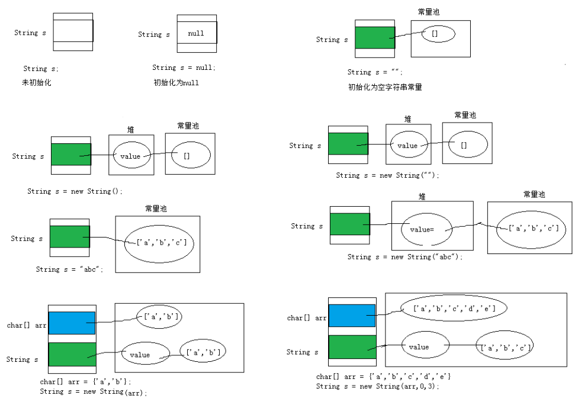
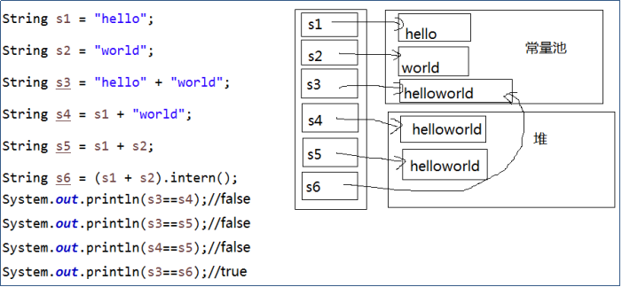
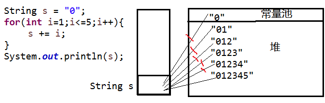
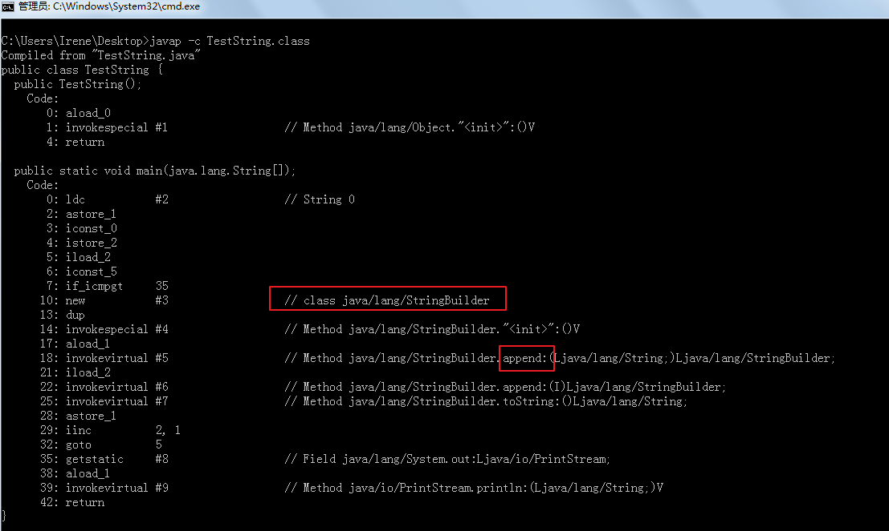
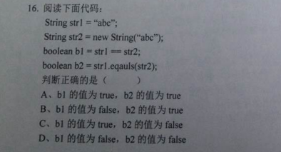

# 常用类用法

## 学习目标

* [ ] 了解数学相关API
* [ ] 了解日期时间API
* [ ] 了解系统类API
* [ ] 熟练掌握String类的API
* [ ] 熟练掌握StringBuilder和StringBuffer类的API
* [ ] 能够处理字符串相关的算法处理

# 常用类

## 1.1 枚举

### 1.1.1 概述

某些类型的对象是有限的几个，这样的例子举不胜举：

* 星期：Monday(星期一)......Sunday(星期天)
* 性别：Man(男)、Woman(女)
* 月份：January(1月)......December(12月)
* 季节：Spring(春天)......Winter(冬天)
* 支付方式：Cash（现金）、WeChatPay（微信）、Alipay(支付宝)、BankCard(银行卡)、CreditCard(信用卡)
* 员工工作状态：Busy（忙）、Free（闲）、Vocation（休假）
* 订单状态：Nonpayment（未付款）、Paid（已付款）、Fulfilled（已配货）、Delivered（已发货）、Checked（已确认收货）、Return（退货）、Exchange（换货）、Cancel（取消）

枚举类型本质上也是一种类，只不过是这个类的对象是固定的几个，而不能随意让用户创建。

在JDK1.5之前，需要程序员自己通过特殊的方式来定义枚举类型。

在JDK1.5之后，Java支持enum关键字来快速的定义枚举类型。

### 1.1.2 JDK1.5之前

在JDK1.5之前如何声明枚举类呢？

* 构造器加private私有化
* 本类内部创建一组常量对象，并添加public static修饰符，对外暴露这些常量对象

示例代码：

```java
public class TestEnum {
	public static void main(String[] args) {
		Season spring = Season.SPRING;
		System.out.println(spring);
	}
}
class Season{
	public static final Season SPRING = new Season();
	public static final Season SUMMER = new Season();
	public static final Season AUTUMN = new Season();
	public static final Season WINTER = new Season();
	
	private Season(){
		
	}
	
	public String toString(){
		if(this == SPRING){
			return "春";
		}else if(this == SUMMER){
			return "夏";
		}else if(this == AUTUMN){
			return "秋";
		}else{
			return "冬";
		}
	}
}
```

### 1.1.3 JDK1.5之后

语法格式：

```java
【修饰符】 enum 枚举类名{
    常量对象列表
}

【修饰符】 enum 枚举类名{
    常量对象列表;
    
    其他成员列表;
}
```

示例代码：

```java
public class TestEnum {
	public static void main(String[] args) {
		Season spring = Season.SPRING;
		System.out.println(spring);
	}
}
enum Season{
	SPRING,SUMMER,AUTUMN,WINTER
}
```

示例代码：

```java
public class TestEnum {
	public static void main(String[] args) {
		Season spring = Season.SPRING;
		System.out.println(spring);
	}
}
enum Season{
	SPRING("春"),SUMMER("夏"),AUTUMN("秋"),WINTER("冬");
	private final String description;
	
	private Season(String description){
		this.description = description;
	}
	
	public String toString(){//需要手动编写，无法使用Generate toString()...
		return description;
	}
}
```

枚举类的要求和特点：

* 枚举类的常量对象列表必须在枚举类的首行，因为是常量，所以建议大写。
* 如果常量对象列表后面没有其他代码，那么“；”可以省略，否则不可以省略“；”。
* 编译器给枚举类默认提供的是private的无参构造，如果枚举类需要的是无参构造，就不需要声明，写常量对象列表时也不用加参数，
* 如果枚举类需要的是有参构造，需要手动定义private的有参构造，调用有参构造的方法就是在常量对象名后面加(实参列表)就可以。
* 枚举类默认继承的是java.lang.Enum类，因此不能再继承其他的类型。
* JDK1.5之后switch，提供支持枚举类型，case后面可以写枚举常量名。
* 枚举类型如有其它属性，建议（**不是必须**）这些属性也声明为final的，因为常量对象在逻辑意义上应该不可变。

### 1.1.4 枚举类型常用方法

```java
1.toString(): 默认返回的是常量名（对象名），可以继续手动重写该方法！
2.name():返回的是常量名（对象名） 【很少使用】
3.ordinal():返回常量的次序号，默认从0开始
4.values():返回该枚举类的所有的常量对象，返回类型是当前枚举的数组类型，是一个静态方法
5.valueOf(String name)：根据枚举常量对象名称获取枚举对象
```

示例代码：

```java
public class TestEnum {
	public static void main(String[] args) {
		Season[] values = Season.values();
		for (int i = 0; i < values.length; i++) {
			switch(values[i]){
			case SPRING:
				System.out.println(values[i]+":春暖花开，万物复苏");
				break;
			case SUMMER:
				System.out.println(values[i]+":百花争艳，郁郁葱葱");
				break;
			case AUTUMN:
				System.out.println(values[i]+":菊桂飘香，百树凋零");
				break;
			case WINTER:
				System.out.println(values[i]+":梅花独开，大地一色");
				break;
			}
		}
	}
}
enum Season{
	SPRING,SUMMER,AUTUMN,WINTER
}
```

### 1.1.5 练习

案例：
1、声明月份枚举类Month：

（1）创建：1-12月常量对象

```java
JANUARY,FEBRUARY,MARCH,APRIL,MAY,JUNE,JULY,AUGUST,SEPTEMBER,OCTOBER,NOVEMBER,DECEMBER
```

（2）声明两个属性：value（月份值，例如：JANUARY的value为1），
					 description（描述，例如：JANUARY的description为1月份是一年的开始）。

（3）声明一个有参构造，创建12个对象

（4）声明一个方法：public static Month getByValue(int value)

（5）手动重写toString()：返回对象信息，例如：1->1月份是一年的开始。

~~~ java
enum Month{
    JANUARY(1,"1月份是一年的开始"),FEBRUARY(2,"2月份是一年的开始"),MARCH(3,"3月份是一年的开始"),APRIL(4,"4月份是一年的开始");

    int value;
    String description;

    private Month(int value,String description){
        this.value=value;
        this.description=description;
    }

    public static Month getByValue(int value){

        for (Month month : Month.values()) {
            if(month.value==value){
                return month;
            }
        }

        return null;
    }
}
~~~


2、在测试类中，从键盘输入1个1-12的月份值，获取对应的月份对象，并打印对象

~~~ java
package com.gec.demo2;

import java.util.Scanner;

/*
* 枚举类
* */
enum Month{

    JANUARY(1,"1月份是一年的开始"),FEBRUARY(2,"2月份是一年的开始"),MARCH(3,"3月份是一年的开始"),APRIL(4,"4月份是一年的开始");

    int value;
    String description;


    private Month(int value,String description){
        this.value=value;
        this.description=description;
    }

    public static Month getByValue(int value){

        for (Month month : Month.values()) {
            if(month.value==value)
                return month;
        }
        return null;
    }

    @Override
    public String toString() {

        return this.value+"->"+this.description;
    }
}

public class MonthMainTest {

    public static void main(String[] args) {

        int value=2;
        //从键盘输出
        Scanner scanner=new Scanner(System.in);

        System.out.println("请输入月份");
        int monthValue=scanner.nextInt();

        Month curMonth = Month.getByValue(monthValue);
        System.out.println(curMonth.toString());

    }
}

~~~


## 2.2 包装类

### 2.2.1 包装类

Java提供了两个类型系统，基本类型与引用类型，使用基本类型在于效率，然而当要使用只针对对象设计的API或新特性（例如泛型），那么基本数据类型的数据就需要用包装类来包装。

| 序号 | 基本数据类型 | 包装类（java.lang包） |
| ---- | ------------ | --------------------- |
| 1    | byte         | Byte                  |
| 2    | short        | Short                 |
| 3    | int          | **Integer**           |
| 4    | long         | Long                  |
| 5    | float        | Float                 |
| 6    | double       | Double                |
| 7    | char         | **Character**         |
| 8    | boolean      | Boolean               |
| 9    | void         | Void                  |

### 2.2.2  装箱与拆箱

 装箱：把基本数据类型转为包装类对象。

> 转为包装类的对象，是为了使用专门为对象设计的API和特性

拆箱：把包装类对象拆为基本数据类型。

> 转为基本数据类型，一般是因为需要运算，Java中的大多数运算符是为基本数据类型设计的。比较、算术等

基本数值---->包装对象

```java
Integer i1 = new Integer(4);//使用构造函数函数
Integer i2 = Integer.valueOf(4);//使用包装类中的valueOf方法
```

包装对象---->基本数值

```java
Integer i1 = new Integer(4);
int num1 = i1.intValue();
```

JDK1.5之后，可以自动装箱与拆箱。

> 注意：只能与自己对应的类型之间才能实现自动装箱与拆箱。

```java
Integer i = 4;//自动装箱。相当于Integer i = Integer.valueOf(4);
i = i + 5;//等号右边：将i对象转成基本数值(自动拆箱) i.intValue() + 5;
//加法运算完成后，再次装箱，把基本数值转成对象。
```

```java
Integer i = 1;
Double d = 1;//错误的，1是int类型
```

总结：对象（引用数据类型）能用的运算符有哪些？

（1）instanceof

（2）=：赋值运算符

（3）==和!=：用于比较地址，但是要求左右两边对象的类型一致或者是有父子类继承关系。

（4）对于字符串这一种特殊的对象，支持“+”，表示拼接。

### 2.2.3 包装类的一些API

#### 1、基本数据类型和字符串之间的转换

（1）把基本数据类型转为字符串

```java
int a = 10;
//String str = a;//错误的
//方式一：
String str = a + "";
//方式二：
String str = String.valueOf(a);
```

（2）把字符串转为基本数据类型

String转换成对应的基本类型 ，除了Character类之外，其他所有包装类都具有parseXxx静态方法可以将字符串参数转换为对应的基本类型，例如：

* `public static int parseInt(String s)`：将字符串参数转换为对应的int基本类型。
* `public static long parseLong(String s)`：将字符串参数转换为对应的long基本类型。
* `public static double parseDouble(String s)`：将字符串参数转换为对应的double基本类型。

或把字符串转为包装类，然后可以自动拆箱为基本数据类型

* ```public static Integer valueOf(String s)```：将字符串参数转换为对应的Integer包装类，然后可以自动拆箱为int基本类型
* ```public static Long valueOf(String s)```：将字符串参数转换为对应的Long包装类，然后可以自动拆箱为long基本类型
* ```public static Double valueOf(String s)```：将字符串参数转换为对应的Double包装类，然后可以自动拆箱为double基本类型

注意:如果字符串参数的内容无法正确转换为对应的基本类型，则会抛出`java.lang.NumberFormatException`异常。

```java
int a = Integer.parseInt("整数的字符串");
double d = Double.parseDouble("小数的字符串");
boolean b = Boolean.parseBoolean("true或false");

int a = Integer.valueOf("整数的字符串");
double d = Double.valueOf("小数的字符串");
boolean b = Boolean.valueOf("true或false");
```

#### 2、数据类型的最大最小值

```java
Integer.MAX_VALUE和Integer.MIN_VALUE
Long.MAX_VALUE和Long.MIN_VALUE
Double.MAX_VALUE和Double.MIN_VALUE
```

#### 3、字符转大小写

```java
Character.toUpperCase('x');
Character.toLowerCase('X');
```

#### 4、整数转进制

```java
Integer.toBinaryString(int i) 
Integer.toHexString(int i)
Integer.toOctalString(int i)
```

### 2.2.4 包装类对象的缓存问题

| 包装类    | 缓存对象    |
| --------- | ----------- |
| Byte      | -128~127    |
| Short     | -128~127    |
| Integer   | -128~127    |
| Long      | -128~127    |
| Float     | 没有        |
| Double    | 没有        |
| Character | 0~127       |
| Boolean   | true和false |

```java
Integer i = 1;
Integer j = 1;
System.out.println(i == j);//true

Integer i = 128;
Integer j = 128;
System.out.println(i == j);//false

Integer i = new Integer(1);//新new的在堆中
Integer j = 1;//这个用的是缓冲的常量对象，在方法区
System.out.println(i == j);//false

Integer i = new Integer(1);//新new的在堆中
Integer j = new Integer(1);//另一个新new的在堆中
System.out.println(i == j);//false
```

```java
	@Test
	public void test3(){
		Double d1 = 1.0;
		Double d2 = 1.0;
		System.out.println(d1==d2);//false 比较地址，没有缓存对象，每一个都是新new的
	}
```

### 2.2.5 面试题

#### 1、类型转换问题

```java
	@Test
	public void test4(){
		Double d1 = 1.0;
		double d2 = 1.0;
		System.out.println(d1==d2);//true 和基本数据类型比较会自动拆箱，比较数据值
	}
	
	@Test
	public void test2(){
		Integer i = 1000;
		double j = 1000;
		System.out.println(i==j);//true  会先将i自动拆箱为int，然后根据基本数据类型“自动类型转换”规则，转为double比较
	}
	
	@Test
	public void test(){
		Integer i = 1000;
		int j = 1000;
		System.out.println(i==j);//true 会自动拆箱，按照基本数据类型进行比较
	}
```

#### 2、不可变对象

```java
public class TestExam {
	public static void main(String[] args) {
		int i = 1;
		Integer j = new Integer(2);
		Circle c = new Circle();
		change(i,j,c);
		System.out.println("i = " + i);//1
		System.out.println("j = " + j);//2
		System.out.println("c.radius = " + c.radius);//10.0
	}
	
	/*
	 * 方法的参数传递机制：
	 * （1）基本数据类型：形参的修改完全不影响实参
	 * （2）引用数据类型：通过形参修改对象的属性值，会影响实参的属性值
	 * 这类Integer等包装类对象是“不可变”对象，即一旦修改，就是新对象，和实参就无关了
	 */
	public static void change(int a ,Integer b,Circle c ){
		a += 10;
//		b += 10;//等价于  b = new Integer(b+10);
		c.radius += 10;
		/*c = new Circle();
		c.radius+=10;*/
	}
}
class Circle{
	double radius;
}
```

## 3.1 和数学相关的类

### 3.1.1 java.lang.Math

`java.lang.Math` 类包含用于执行基本数学运算的方法，如初等指数、对数、平方根和三角函数。类似这样的工具类，其所有方法均为静态方法，并且不会创建对象，调用起来非常简单。

* `public static double abs(double a) ` ：返回 double 值的绝对值。 

```java
double d1 = Math.abs(-5); //d1的值为5
double d2 = Math.abs(5); //d2的值为5
```

* `public static double ceil(double a)` ：返回大于等于参数的最小的整数。

```java
double d1 = Math.ceil(3.3); //d1的值为 4.0
double d2 = Math.ceil(-3.3); //d2的值为 -3.0
double d3 = Math.ceil(5.1); //d3的值为 6.0
```

* `public static double floor(double a) ` ：返回小于等于参数最大的整数。

```java
double d1 = Math.floor(3.3); //d1的值为3.0
double d2 = Math.floor(-3.3); //d2的值为-4.0
double d3 = Math.floor(5.1); //d3的值为 5.0
```

* `public static long round(double a)` ：返回最接近参数的 long。(相当于四舍五入方法)  

```java
long d1 = Math.round(5.5); //d1的值为6.0
long d2 = Math.round(5.4); //d2的值为5.0
```

* public static double pow(double a,double b)：返回a的b幂次方法
* public static double sqrt(double a)：返回a的平方根
* public static double random()：返回[0,1)的随机值
* public static final double PI：返回圆周率
* public static double max(double x, double y)：返回x,y中的最大值
* public static double min(double x, double y)：返回x,y中的最小值

```java
double result = Math.pow(2,31);
double sqrt = Math.sqrt(256);
double rand = Math.random();
double pi = Math.PI;
```

##### 练习 

请使用`Math` 相关的API，计算在 `-10.8`  到`5.9`  之间，绝对值大于`6`  或者小于`2.1` 的整数有多少个？

### 3.1.2 java.math包

#### （1）BigInteger

不可变的任意精度的整数。

* BigInteger(String val) 
* BigInteger add(BigInteger val)  
* BigInteger subtract(BigInteger val)
* BigInteger multiply(BigInteger val) 
* BigInteger divide(BigInteger val) 
* BigInteger remainder(BigInteger val)
* ....

```java
	@Test
	public void test01(){
//		long bigNum = 123456789123456789123456789L;
		
		BigInteger b1 = new BigInteger("123456789123456789123456789");
		BigInteger b2 = new BigInteger("78923456789123456789123456789");
		
//		System.out.println("和：" + (b1+b2));//错误的，无法直接使用+进行求和
		
		System.out.println("和：" + b1.add(b2));
		System.out.println("减：" + b1.subtract(b2));
		System.out.println("乘：" + b1.multiply(b2));
		System.out.println("除：" + b2.divide(b1));
		System.out.println("余：" + b2.remainder(b1));
	}
```

#### （2）RoundingMode枚举类

CEILING ：向正无限大方向舍入的舍入模式。 
DOWN ：向零方向舍入的舍入模式。 
FLOOR：向负无限大方向舍入的舍入模式。 
HALF_DOWN ：向最接近数字方向舍入的舍入模式，如果与两个相邻数字的距离相等，则向下舍入。 
HALF_EVEN：向最接近数字方向舍入的舍入模式，如果与两个相邻数字的距离相等，则向相邻的偶数舍入。 
HALF_UP：向最接近数字方向舍入的舍入模式，如果与两个相邻数字的距离相等，则向上舍入。 
UNNECESSARY：用于断言请求的操作具有精确结果的舍入模式，因此不需要舍入。 
UP：远离零方向舍入的舍入模式。 


#### （3）BigDecimal

不可变的、任意精度的有符号十进制数。

* BigDecimal(String val) 
* BigDecimal add(BigDecimal val) 
* BigDecimal subtract(BigDecimal val)
* BigDecimal multiply(BigDecimal val) 
* BigDecimal divide(BigDecimal val) 
* BigDecimal divide(BigDecimal divisor, int roundingMode) 
* BigDecimal divide(BigDecimal divisor, int scale, RoundingMode roundingMode) 
* BigDecimal remainder(BigDecimal val) 
* ....

```java
	@Test
	public void test02(){
		/*double big = 12.123456789123456789123456789;
		System.out.println("big = " + big);*/
		
		BigDecimal b1 = new BigDecimal("123.45678912345678912345678912345678");
		BigDecimal b2 = new BigDecimal("7.8923456789123456789123456789998898888");
		
//		System.out.println("和：" + (b1+b2));//错误的，无法直接使用+进行求和
		
		System.out.println("和：" + b1.add(b2));
		System.out.println("减：" + b1.subtract(b2));
		System.out.println("乘：" + b1.multiply(b2));
		System.out.println("除：" + b1.divide(b2,20,RoundingMode.UP));//divide(BigDecimal divisor, int scale, int roundingMode)
		System.out.println("除：" + b1.divide(b2,20,RoundingMode.DOWN));//divide(BigDecimal divisor, int scale, int roundingMode)
		System.out.println("余：" + b1.remainder(b2));
	}
```

### 3.1.3 java.util.Random

用于产生随机数

* boolean nextBoolean():返回下一个伪随机数，它是取自此随机数生成器序列的均匀分布的 boolean 值。 

* void nextBytes(byte[] bytes):生成随机字节并将其置于用户提供的 byte 数组中。 

* double nextDouble():返回下一个伪随机数，它是取自此随机数生成器序列的、在 0.0 和 1.0 之间均匀分布的 double 值。 

* float nextFloat():返回下一个伪随机数，它是取自此随机数生成器序列的、在 0.0 和 1.0 之间均匀分布的 float 值。 

* double nextGaussian():返回下一个伪随机数，它是取自此随机数生成器序列的、呈高斯（“正态”）分布的 double 值，其平均值是 0.0，标准差是 1.0。 

* int nextInt():返回下一个伪随机数，它是此随机数生成器的序列中均匀分布的 int 值。 

* int nextInt(int n):返回一个伪随机数，它是取自此随机数生成器序列的、在 0（包括）和指定值（不包括）之间均匀分布的 int 值。 

* long nextLong():返回下一个伪随机数，它是取自此随机数生成器序列的均匀分布的 long 值。 

```java
	@Test
	public void test03(){
		Random r = new Random();
		System.out.println("随机整数：" + r.nextInt());
		System.out.println("随机小数：" + r.nextDouble());
		System.out.println("随机布尔值：" + r.nextBoolean());
	}
```

## 2.2 日期时间API

### 2.2.1 JDK1.8之前

#### 1、java.util.Date

new  Date()：当前系统时间

long  getTime()：返回该日期时间对象距离1970-1-1 0.0.0 0毫秒之间的毫秒值

new Date(long 毫秒)：把该毫秒值换算成日期时间对象

```java
	@Test
	public void test5(){
		long time = Long.MAX_VALUE;
		Date d = new Date(time);
		System.out.println(d);
	}
	
	@Test
	public void test4(){
		long time = 1559807047979L;
		Date d = new Date(time);
		System.out.println(d);
	}
	@Test
	public void test3(){
		Date d = new Date();
		long time = d.getTime();
		System.out.println(time);//1559807047979
	}
	
	@Test
	public void test2(){
		long time = System.currentTimeMillis();
		System.out.println(time);//1559806982971
		//当前系统时间距离1970-1-1 0:0:0 0毫秒的时间差，毫秒为单位
	}
	
	@Test
	public void test1(){
		Date d = new Date();
		System.out.println(d);
	}
```

#### 2、java.util.TimeZone

通常，使用 `getDefault` 获取 `TimeZone`，`getDefault`  基于程序运行所在的时区创建 `TimeZone`。

也可以用 `getTimeZone` 及时区 ID 获取 `TimeZone` 。例如美国太平洋时区的时区 ID 是  "America/Los_Angeles"。

```java
	@Test
	public void test8(){
		String[] all = TimeZone.getAvailableIDs();
		for (int i = 0; i < all.length; i++) {
			System.out.println(all[i]);
		}
	}
	
	@Test
	public void test7(){
		TimeZone t = TimeZone.getTimeZone("America/Los_Angeles");
	}
```

常见时区ID：

```java
Asia/Shanghai
UTC
America/New_York
```


#### 3、java.util.Calendar

`Calendar` 类是一个抽象类，它为特定瞬间与一组诸如  `YEAR`、`MONTH`、`DAY_OF_MONTH`、`HOUR`  等 [`日历字段`](../../java/util/Calendar.html#fields)之间的转换提供了一些方法，并为操作日历字段（例如获得下星期的日期）提供了一些方法。瞬间可用毫秒值来表示，它是距*历元*（即格林威治标准时间 1970 年 1 月 1 日的 00:00:00.000，格里高利历）的偏移量。与其他语言环境敏感类一样，`Calendar` 提供了一个类方法  `getInstance`，以获得此类型的一个通用的对象。

（1）getInstance()：得到Calendar的对象

（2）get(常量)

```java
	@Test
	public void test6(){
      	final Calendar calendar = Calendar.getInstance();
        //获取当前年份
        System.out.println(calendar.get(Calendar.YEAR));
        //获取当前月份 从0开始，0代表一月，1代表二月，以此类推
        System.out.println(calendar.get(Calendar.MONTH));
        //获取当前日期 也可以使用DAY_OF_MONTH
        System.out.println(calendar.get(Calendar.DATE));
        //获取当前时 24小时进制
        System.out.println(calendar.get(Calendar.HOUR_OF_DAY));
        //获取当前分
        System.out.println(calendar.get(Calendar.MINUTE));
        //获取当前秒
        System.out.println(calendar.get(Calendar.SECOND));

        System.out.println("--------------------");
        //获取今天是这个月的第几个星期
        System.out.println(calendar.get(Calendar.WEEK_OF_MONTH));
        //获取今天是星期几  1表示星期天，2表示星期一，以此类推
        System.out.println(calendar.get(Calendar.DAY_OF_WEEK));
	}

	@Test
	public void test7(){
		TimeZone t = TimeZone.getTimeZone("America/Los_Angeles");
		
		//getInstance(TimeZone zone)
		Calendar c = Calendar.getInstance(t);
		System.out.println(c);
	}
```

（3）Calendar和Date转换

~~~ java
System.out.println("------------Calendar和Date转换------------");
Date now = calendar.getTime();
calendar.setTime(now);
~~~

(3)set方法

- 第一月就是从0初始化

~~~ java
calendar.set(Calendar.YEAR, 2000);
calendar.set(Calendar.MONTH, 0);
calendar.set(Calendar.DATE, 20);
~~~


(4) Calendar日期计算

~~~ java
    /**
     * 指定日期加月份
     *
     * @param date      指定日期
     * @param addMonths 要加的月份数
     * @return Date 计算后的日期
     */
    public static Date addMonths(Date date, int addMonths) {
        Calendar calendar = Calendar.getInstance();
        calendar.setTime(date);
        calendar.add(Calendar.MONTH, addMonths);
        return calendar.getTime();
    }
~~~

~~~ java
    /**
     * 指定日期加天
     *
     * @param date    指定日期
     * @param addDays 要加的天数
     * @return Date 计算后的日期
     */
    public static Date addDays(Date date, int addDays) {
        Calendar calendar = Calendar.getInstance();
        calendar.setTime(date);
        calendar.add(Calendar.DATE, addDays);
        return calendar.getTime();
    }
~~~

~~~ java
    /**
     * 指定日期加小时
     *
     * @param date     指定日期
     * @param addHours 要加的小时数
     * @return Date 计算后的日期
     */
    public static Date addHours(Date date, int addHours) {
        Calendar calendar = Calendar.getInstance();
        calendar.setTime(date);
        calendar.add(Calendar.HOUR, addHours);
        return calendar.getTime();
    }
~~~

~~~ java
    /**
     * 指定日期加分
     *
     * @param date       指定日期
     * @param addMinutes 要加的分数
     * @return Date 计算后的日期
     */
    public static Date addMinutes(Date date, int addMinutes) {
        Calendar calendar = Calendar.getInstance();
        calendar.setTime(date);
        calendar.add(Calendar.MINUTE, addMinutes);
        return calendar.getTime();
    }
~~~

（5）设置时区

~~~ java
System.out.println("------------设置时区------------");
        TimeZone t2 = TimeZone.getTimeZone("America/Los_Angeles");
        //getInstance(TimeZone zone)
        Calendar c3 = Calendar.getInstance(t2);
        System.out.println(c3);

        //获取当前年份
        System.out.println(c3.get(Calendar.YEAR));
        //获取当前月份 从0开始，0代表一月，1代表二月，以此类推
        System.out.println(c3.get(Calendar.MONTH));
        //获取当前日期 也可以使用DAY_OF_MONTH
        System.out.println(c3.get(Calendar.DATE));
        //获取当前时 24小时进制
        System.out.println(c3.get(Calendar.HOUR_OF_DAY));
        //获取当前分
        System.out.println(c3.get(Calendar.MINUTE));
        //获取当前秒
        System.out.println(c3.get(Calendar.SECOND));
~~~

#### 4、java.text.SimpleDateFormat

SimpleDateFormat用于日期时间的格式化。

- **字符串转换成Date对象**

```java
	@Test
	public void test10() throws ParseException
		String str = "2019年06月06日 16时03分14秒 545毫秒  星期四 +0800";
		SimpleDateFormat sf = new SimpleDateFormat("yyyy年MM月dd日 HH时mm分ss秒 SSS毫秒  E Z");
		Date d = sf.parse(str);
		System.out.println(d);
	}
	

```

- **Date对象转换成字符串**

~~~ java
	@Test
	public void test9(){
		Date d = new Date();

		SimpleDateFormat sf = new SimpleDateFormat("yyyy年MM月dd日 HH时mm分ss秒 SSS毫秒  E Z");
		//把Date日期转成字符串，按照指定的格式转
		String str = sf.format(d);
		System.out.println(str);
	}
~~~

### 2.2.2 JDK1.8之后

Java1.0中包含了一个Date类，但是它的大多数方法已经在Java 1.1引入Calendar类之后被弃用了。而Calendar并不比Date好多少。它们面临的问题是：

* 可变性：像日期和时间这样的类对象应该是不可变的。Calendar类中可以使用三种方法更改日历字段：set()、add() 和 roll()。
* 偏移性：Date中的年份是从1900开始的，而月份都是从0开始的。
* 格式化：格式化只对Date有用，Calendar则不行。
* 此外，它们也不是线程安全的，不能处理闰秒等。

可以说，对日期和时间的操作一直是Java程序员最痛苦的地方之一。第三次引入的API是成功的，并且java 8中引入的java.time API 已经纠正了过去的缺陷，将来很长一段时间内它都会为我们服务。

Java 8 吸收了 Joda-Time 的精华，以一个新的开始为 Java 创建优秀的 API。

* java.time – 包含值对象的基础包
* java.time.chrono – 提供对不同的日历系统的访问。
* java.time.format – 格式化和解析时间和日期
* java.time.temporal – 包括底层框架和扩展特性
* java.time.zone – 包含时区支持的类

Java 8 吸收了 Joda-Time 的精华，以一个新的开始为 Java 创建优秀的 API。新的 java.time 中包含了所有关于时钟（Clock），本地日期（LocalDate）、本地时间（LocalTime）、本地日期时间（LocalDateTime）、时区（ZonedDateTime）和持续时间（Duration）的类。

#### 1、本地日期时间：LocalDate、LocalTime、LocalDateTime

| 方法                                                         | **描述**                                                     |
| ------------------------------------------------------------ | ------------------------------------------------------------ |
| now() / now(ZoneId zone)                                     | 静态方法，根据当前时间创建对象/指定时区的对象                |
| of()                                                         | 静态方法，根据指定日期/时间创建对象                          |
| getDayOfMonth()/getDayOfYear()                               | 获得月份天数(1-31) /获得年份天数(1-366)                      |
| getDayOfWeek()                                               | 获得星期几(返回一个 DayOfWeek 枚举值)                        |
| getMonth()                                                   | 获得月份, 返回一个 Month 枚举值                              |
| getMonthValue() / getYear()                                  | 获得月份(1-12) /获得年份                                     |
| getHours()/getMinute()/getSecond()                           | 获得当前对象对应的小时、分钟、秒                             |
| withDayOfMonth()/withDayOfYear()/withMonth()/withYear()      | 将月份天数、年份天数、月份、年份修改为指定的值并返回新的对象 |
| with(TemporalAdjuster  t)                                    | 将当前日期时间设置为校对器指定的日期时间                     |
| plusDays(), plusWeeks(), plusMonths(), plusYears(),plusHours() | 向当前对象添加几天、几周、几个月、几年、几小时               |
| minusMonths() / minusWeeks()/minusDays()/minusYears()/minusHours() | 从当前对象减去几月、几周、几天、几年、几小时                 |
| plus(TemporalAmount t)/minus(TemporalAmount t)               | 添加或减少一个 Duration 或 Period                            |
| isBefore()/isAfter()                                         | 比较两个 LocalDate                                           |
| isLeapYear()                                                 | 判断是否是闰年（在LocalDate类中声明）                        |
| format(DateTimeFormatter  t)                                 | 格式化本地日期、时间，返回一个字符串                         |
| parse(Charsequence text)                                     | 将指定格式的字符串解析为日期、时间                           |

####  2.LocalDate类用法

-  获取当前日期

  ~~~ java
  LocalDate today = LocalDate.now();
  System.out.println(today);
  System.out.println("========对比=========");
  Date date = new Date();
  System.out.println(date);
  
  ~~~

-  获取年月日

  ~~~ java
    LocalDate date = LocalDate.now();
          int year = date.getYear();
          //获得月份, 返回一个 Month 枚举值
          Month month1 = date.getMonth();
          //获得月份(1-12) /获得年份
          int month = date.getMonthValue();
          //获得月份天数(1-31)
          int day = date.getDayOfMonth();
          //获得年份天数(1-366)
          int day1 = date.getDayOfYear();
          System.out.println(year);
          System.out.println("getMonth(): " + month1);
          System.out.println("getMonthValue(): " + month);
          System.out.println("getDayOfMonth: " + day);
          System.out.println("getDayOfYear()" + day1);
          System.out.println(year + "-" + month + "-" + day);
  ~~~

- 特定日期

  - 工厂方法LocalDate.of()创建任意日期， 该方法需要传入年、月、日做参数，返回对应的LocalDate实例。这个方法的好处是没再犯老API的设计错误，比如年度起始于1900，月份是从0开始等等。

  ~~~ java
  LocalDate date = LocalDate.of(2020, 1, 25);
  System.out.println(date);
  ~~~

- 当前日期加减

  ~~~ java
  LocalDate now = LocalDate.now();
  LocalDate localDate = now.minusDays(1);
  LocalDate localDate1 = now.minusWeeks(1);
  LocalDate localDate2 = now.minusMonths(1);
  LocalDate localDate3 = now.minusYears(1);
  LocalDate localDate4 = now.plusDays(1);
  LocalDate localDate5 = now.plusWeeks(1);
  LocalDate localDate6 = now.plusMonths(1);
  LocalDate localDate7 = now.plusYears(1);
  System.out.println("当前日期的前一天：" + localDate);
  System.out.println("当前日期的前一星期：" + localDate1);
  System.out.println("当前日期的前一个月：" + localDate2);
  System.out.println("当前日期的前一年：" + localDate3);
  System.out.println("当前日期的后一天：" + localDate4);
  System.out.println("当前日期的后一星期：" + localDate5);
  System.out.println("当前日期的后一月：" + localDate6);
  System.out.println("当前日期的后一年：" + localDate7);
  ~~~

#### 3.  LocalTime用法

~~~ java
 /**
     * 获取当前时间
     */
    @Test
    public void demo08() {
        LocalTime now = LocalTime.now();
        log.info("当前时间：" + now);
    }


 /**
     * 指定时分秒
     */
    @Test
    public void demo09() {
        LocalTime time1 = LocalTime.of(12, 9);
        LocalTime time2 = LocalTime.of(12, 9, 10);
        log.info("指定时分：" + time1);
        log.info("指定时分秒：" + time2);
    }


/**
     * 获取当前时间的时分秒
     */
    @Test
    public void demo10() {
        LocalTime now = LocalTime.now();
        int hour = now.getHour();
        int minute = now.getMinute();
        int second = now.getSecond();
        log.info("当前时间的时：" + hour);
        log.info("当前时间的分：" + minute);
        log.info("当前时间的秒：" + second);
    }

 /**
     * 当前时间加减
     */
    @Test
    public void demo12() {
        LocalTime now = LocalTime.now();
        LocalTime time1 = now.minusHours(1);
        LocalTime time2 = now.minusMinutes(1);
        LocalTime time3 = now.minusSeconds(1);
        LocalTime time4 = now.plusHours(1);
        LocalTime time5 = now.plusMinutes(1);
        LocalTime time6 = now.plusSeconds(1);
        log.info("当前时间减一小时：" + time1);
        log.info("当前时间减一分钟：" + time2);
        log.info("当前时间减一秒：" + time3);
        log.info("当前时间加一小时：" + time4);
        log.info("当前时间加一分钟：" + time5);
        log.info("当前时间加一秒：" + time6);
    }

~~~

#### 4. LocalDateTime

~~~ java
  /**
     * 获取当前时间
     */
    @Test
    public void demo13() {
        LocalDateTime now = LocalDateTime.now();
        log.info("获取当前时间：" + now);
    }


/**
     * 指定当前时间
     */
    @Test
    public void demo14() {
        LocalDateTime now = LocalDateTime.now();
        LocalDateTime time1 = now.withYear(2012);
        LocalDateTime time2 = now.withMonth(12);
        LocalDateTime time3 = now.withDayOfMonth(23);
        LocalDateTime time4 = now.withHour(8);
        LocalDateTime time5 = now.withMinute(8);
        LocalDateTime time6 = now.withSecond(8);
        log.info("指定当前年份：" + time1);
        log.info("指定当前月份：" + time2);
        log.info("指定当前日：" + time3);
        log.info("指定当前时：" + time4);
        log.info("指定当前分：" + time5);
        log.info("指定当前秒：" + time6);
    }

/**
     * 当前日期加减
     */
    @Test
    public void demo16() {
        LocalDateTime now = LocalDateTime.now();
        LocalDateTime time1 = now.minusYears(1);
        LocalDateTime time2 = now.minusMonths(12);
        LocalDateTime time3 = now.minusWeeks(1);
        LocalDateTime time4 = now.minusDays(21);
        LocalDateTime time5 = now.minusHours(21);
        LocalDateTime time6 = now.minusMinutes(21);
        LocalDateTime time7 = now.minusSeconds(21);
        LocalDateTime time8 = now.plusYears(1);
        LocalDateTime time9 = now.plusMonths(12);
        LocalDateTime time10 = now.plusWeeks(1);
        LocalDateTime time11 = now.plusDays(21);
        LocalDateTime time12 = now.plusHours(21);
        LocalDateTime time13 = now.plusMinutes(21);
        LocalDateTime time14 = now.plusSeconds(21);
        log.info("当前时间减一年：" + time1);
        log.info("当前时间减12个月：" + time2);
        log.info("当前时间减一星期：" + time3);
        log.info("当前时间减21天：" + time4);
        log.info("当前时间减21小时：" + time5);
        log.info("当前时间减21分钟：" + time6);
        log.info("当前时间减21秒：" + time7);
        log.info("当前时间加一年：" + time8);
        log.info("当前时间加12个月：" + time9);
        log.info("当前时间加一星期：" + time10);
        log.info("当前时间加21天：" + time11);
        log.info("当前时间加21小时：" + time12);
        log.info("当前时间加21分钟：" + time13);
        log.info("当前时间加21秒：" + time14);
    }

/**
     * 获取当前日期和指定日期
     */
    @Test
    public void demo17() {
        LocalDateTime now = LocalDateTime.of(LocalDate.now(), LocalTime.now());
        LocalDateTime time1 = LocalDateTime.of(2010, Month.JULY, 12, 12, 12);
        log.info("获取当前日期：" + now);
        log.info("指定日期：" + time1);
    }


~~~

#### 5、相互转换

- LocalDateTime转LocalDate

~~~ java
LocalDateTime now1 = LocalDateTime.now();
LocalDate date1 = now1.toLocalDate();
~~~

-  LocalDateTime转LocalTime

~~~ java
LocalDateTime now1 = LocalDateTime.now();
LocalTime time1 = now1.toLocalTime();
~~~

-  LocalDate转LocalDateTime

~~~ java
LocalDate now2 = LocalDate.now();
LocalDateTime date2 = now2.atStartOfDay();
~~~

- LocalDateTime与String互转（包含毫秒）

~~~ java
 String timeVal = "2021-12-28 15:15:13.951";
 DateTimeFormatter formatter = DateTimeFormatter.ofPattern("yyyy-MM-dd HH:mm:ss.SSS");
 LocalDateTime parsedDate = LocalDateTime.parse(timeVal, formatter);
 long milli = parsedDate.toInstant(ZoneOffset.of("+8")).toEpochMilli();
~~~

-  Date转为LocalDateTime

~~~ java
  Date date = new Date();
  LocalDateTime localDateTime = date.toInstant().atOffset(ZoneOffset.of("+8")).toLocalDateTime();

~~~

- LocalDateTime转为Date 

~~~ java

  LocalDateTime localDateTime = LocalDateTime.now();
  Date date = Date.from(localDateTime.toInstant(ZoneOffset.of("+8")));

~~~

#### 6、指定时区日期时间：ZonedDateTime

常见时区ID：

```java
Asia/Shanghai
UTC
America/New_York
```


```java
import java.time.ZoneId;
import java.time.ZonedDateTime;

public class TestZonedDateTime {
	public static void main(String[] args) {
		ZonedDateTime t = ZonedDateTime.now();
		System.out.println(t);
		
		ZonedDateTime t1 = ZonedDateTime.now(ZoneId.of("America/New_York"));
		System.out.println(t1);
        System.out.println(t1.getHour());
	}
}
```

#### 7、持续日期/时间：Period和Duration

Period:用于计算两个“日期”间隔

```java
public static void main(String[] args) {
		LocalDate t1 = LocalDate.now();
		LocalDate t2 = LocalDate.of(2018, 12, 31);
		Period between = Period.between(t1, t2);
		System.out.println(between);
		
		System.out.println("相差的年数："+between.getYears());//1年
		System.out.println("相差的月数："+between.getMonths());//又7个月
		System.out.println("相差的天数："+between.getDays());//零25天
		System.out.println("相差的总数："+between.toTotalMonths());//总共19个月
	}
```

Duration:用于计算两个“时间”间隔

```java
	public static void main(String[] args) {
		LocalDateTime t1 = LocalDateTime.now();
		LocalDateTime t2 = LocalDateTime.of(2017, 8, 29, 0, 0, 0, 0);
		Duration between = Duration.between(t1, t2);
		System.out.println(between);
		
		System.out.println("相差的总天数："+between.toDays());
		System.out.println("相差的总小时数："+between.toHours());
		System.out.println("相差的总分钟数："+between.toMinutes());
		System.out.println("相差的总秒数："+between.getSeconds());
		System.out.println("相差的总毫秒数："+between.toMillis());
		System.out.println("相差的总纳秒数："+between.toNanos());
		System.out.println("不够一秒的纳秒数："+between.getNano());
	}
```

#### 8、DateTimeFormatter：日期时间格式化

该类提供了三种格式化方法：

预定义的标准格式。如：ISO_DATE_TIME;ISO_DATE

本地化相关的格式。如：ofLocalizedDate(FormatStyle.MEDIUM)

自定义的格式。如：ofPattern(“yyyy-MM-dd hh:mm:ss”)

```java
	@Test
	public void test10(){
		LocalDateTime now = LocalDateTime.now();
		
//		DateTimeFormatter df = DateTimeFormatter.ofLocalizedDateTime(FormatStyle.LONG);//2019年6月6日 下午04时40分03秒
		DateTimeFormatter df = DateTimeFormatter.ofLocalizedDateTime(FormatStyle.SHORT);//19-6-6 下午4:40
		String str = df.format(now);
		System.out.println(str);
	}
	@Test
	public void test9(){
		LocalDateTime now = LocalDateTime.now();
		
		DateTimeFormatter df = DateTimeFormatter.ISO_DATE_TIME;//2019-06-06T16:38:23.756
		String str = df.format(now);
		System.out.println(str);
	}
	
	@Test
	public void test8(){
		LocalDateTime now = LocalDateTime.now();
		
		DateTimeFormatter df = DateTimeFormatter.ofPattern("yyyy年MM月dd日 HH时mm分ss秒  SSS毫秒  E 是这一年的D天");
		String str = df.format(now);
		System.out.println(str);
	}
```


## 3.3 系统相关类

### 3.3.1 java.lang.System类

系统类中很多好用的方法，其中几个如下：

* static long currentTimeMillis() ：返回当前系统时间距离1970-1-1 0:0:0的毫秒值

* static void arraycopy(Object src, int srcPos, Object dest, int destPos, int length)： 

  从指定源数组中复制一个数组，复制从指定的位置开始，到目标数组的指定位置结束。常用于数组的插入和删除

* static void exit(int status) ：退出当前系统

* static void gc() ：运行垃圾回收器。

* static String getProperty(String key)：获取某个系统属性

* ...

```java
public class Test{
    public static void main(String[] args){
    	long time = System.currentTimeMillis();
    	System.out.println("现在的系统时间距离1970年1月1日凌晨：" + time + "毫秒");
    	
    	System.exit(0);

    	System.out.println("over");//不会执行
    }
}
```

### 3.3.2 java.lang.Runtime类

每个 Java 应用程序都有一个 `Runtime` 类实例，使应用程序能够与其运行的环境相连接。可以通过  `getRuntime` 方法获取当前运行时。  应用程序不能创建自己的 Runtime 类实例。

public static Runtime getRuntime()： 返回与当前 Java 应用程序相关的运行时对象。

public long totalMemory()：返回 Java 虚拟机中的内存总量。此方法返回的值可能随时间的推移而变化，这取决于主机环境。

public long freeMemory()：回 Java 虚拟机中的空闲内存量。调用 gc 方法可能导致 freeMemory 返回值的增加。

## 3.4 字符串

`java.lang.String` 类代表字符串。Java程序中所有的字符串文字（例如`"abc"` ）都可以被看作是实现此类的实例。字符串是常量；它们的值在创建之后不能更改。字符串缓冲区支持可变的字符串。因为 String 对象是不可变的，所以可以共享。

`String` 类包括的方法可用于检查序列的单个字符、比较字符串、搜索字符串、提取子字符串、创建字符串副本并将所有字符全部转换为大写或小写。 

Java 语言提供对字符串串联符号（"+"）以及将其他对象转换为字符串的特殊支持（toString()方法）。

### 3.4.1 字符串的特点

1、字符串String类型本身是final声明的，意味着我们不能继承String。

2、字符串的对象也是不可变对象，意味着一旦进行修改，就会产生新对象

> 我们修改了字符串后，如果想要获得新的内容，必须重新接受。
>
> 如果程序中涉及到大量的字符串的修改操作，那么此时的时空消耗比较高。可能需要考虑使用StringBuilder或StringBuffer的可变字符序列。

3、String对象内部是用字符数组进行保存的

> JDK1.9之前有一个char[] value数组，JDK1.9之后byte[]数组

`"abc"` 等效于 `char[] data={ 'a' , 'b' , 'c' }`。

```java
例如： 
String str = "abc";

相当于： 
char data[] = {'a', 'b', 'c'};     
String str = new String(data);
// String底层是靠字符数组实现的。
```

4、String类中这个char[] values数组也是final修饰的，意味着这个数组不可变，然后它是private修饰，外部不能直接操作它，String类型提供的所有的方法都是用新对象来表示修改后内容的，所以保证了String对象的不可变。

5、就因为字符串对象设计为不可变，那么所以字符串有常量池来保存很多常量对象

常量池在方法区。

如果细致的划分：

（1）JDK1.6及其之前：方法区

（2）JDK1.7：堆

（3）JDK1.8：元空间

~~~ 
且需要注意从jdk1.7开始，常量池就移到堆内存中了，而在 JDK 1.8 中， HotSpot 已经没有 “PermGen space”这个区间了，取而代之的是 Metaspace（元空间）。
~~~


```java
String s1 = "abc";
String s2 = "abc";
System.out.println(s1 == s2);
// 内存中只有一个"abc"对象被创建，同时被s1和s2共享。
```

### 3.4.2 构造字符串对象

#### 1、使用构造方法

* `public String() ` ：初始化新创建的 String对象，以使其表示空字符序列。
* ` String(String original)`： 初始化一个新创建的 `String` 对象，使其表示一个与参数相同的字符序列；换句话说，新创建的字符串是该参数字符串的副本。
* `public String(char[] value) ` ：通过当前参数中的字符数组来构造新的String。
* `public String(char[] value,int offset, int count) ` ：通过字符数组的一部分来构造新的String。
* `public String(byte[] bytes) ` ：通过使用平台的默认字符集解码当前参数中的字节数组来构造新的String。
* `public String(byte[] bytes,String charsetName) ` ：通过使用指定的字符集解码当前参数中的字节数组来构造新的String。

构造举例，代码如下：

```java
//字符串常量对象
String str = "hello";

// 无参构造
String str1 = new String（）；

//创建"hello"字符串常量的副本
String str2 = new String("hello");

//通过字符数组构造
char chars[] = {'a', 'b', 'c','d','e'};     
String str3 = new String(chars);
String str4 = new String(chars,0,3);

// 通过字节数组构造
byte bytes[] = {97, 98, 99 };     
String str5 = new String(bytes);
String str6 = new String(bytes,"GBK");
```

#### 2、使用静态方法

* static String copyValueOf(char[] data)： 返回指定数组中表示该字符序列的 String
* static String copyValueOf(char[] data, int offset, int count)：返回指定数组中表示该字符序列的 String
* static String valueOf(char[] data)  ： 返回指定数组中表示该字符序列的 String
* static String valueOf(char[] data, int offset, int count) ： 返回指定数组中表示该字符序列的 String
* static String valueOf(xx  value)：xx支持各种数据类型，返回各种数据类型的value参数的字符串表示形式。

```java
	public static void main(String[] args) {
		char[] data = {'h','e','l','l','o','j','a','v','a'};
		String s1 = String.copyValueOf(data);
		String s2 = String.copyValueOf(data,0,5);
		int num = 123456;
		String s3 = String.valueOf(num);
		System.out.println(s1);
		System.out.println(s2);
		System.out.println(s3);
	}
```

#### 3、使用""+

任意数据类型与"字符串"进行拼接，结果都是字符串

```java
	public static void main(String[] args) {
		int num = 123456;
		String s = num + "";
		System.out.println(s);
		
		Student stu = new Student();
		String s2 = stu + "";//自动调用对象的toString()，然后与""进行拼接
		System.out.println(s2);
	}
```

### 3.4.3 字符串的对象的个数

1、字符串常量对象

```java
String str1 = "hello";//1个，在常量池中
```

2、字符串的普通对象和常量对象一起

```java
String str3 = new String("hello");
//str3首先指向堆中的一个字符串对象，然后堆中字符串的value数组指向常量池中常量对象的value数组
```

### 3.4.4 字符串对象的内存分析

```java
String s;

String s = null;

String s = "";
String s = new String();
String s = new String("");

String s = "abc";
String s = new String("abc");

char[] arr = {'a','b'};
String s = new String(arr);


char[] arr = {'a','b','c','d','e'};
String s = new String(arr,0,3);
```




### 3.4.5 字符串拼接问题

#### 1、拼接结果的存储和比较问题

原则：

（1）常量+常量：结果是常量池

（2）常量与变量 或 变量与变量：结果是堆

（3）拼接后调用intern方法：结果在常量池

- intern方法的作用是：判断字符串常量池中是否存在一个引用，这个引用指向的字符串对象和当前对象相等（使用 equals 方法判断相等），如果存在直接返回这个引用，如果不存在则创建一个字符串对象并将其引用存入字符串常量池。

```java
	@Test
	public void test06(){
		String s1 = "hello";
		String s2 = "world";
		String s3 = "helloworld";
		
		String s4 = (s1 + "world").intern();//把拼接的结果放到常量池中
		String s5 = (s1 + s2).intern();
		
		System.out.println(s3 == s4);//true
		System.out.println(s3 == s5);//true
	}
	
	@Test
	public void test05(){
		final String s1 = "hello";
		final String s2 = "world";
		String s3 = "helloworld";
		
		String s4 = s1 + "world";//s4字符串内容也helloworld，s1是常量，"world"常量，常量+ 常量 结果在常量池中
		String s5 = s1 + s2;//s5字符串内容也helloworld，s1和s2都是常量，常量+ 常量 结果在常量池中
		String s6 = "hello" + "world";//常量+ 常量 结果在常量池中，因为编译期间就可以确定结果
		
		System.out.println(s3 == s4);//true
		System.out.println(s3 == s5);//true
		System.out.println(s3 == s6);//true
	}
	
	@Test
	public void test04(){
		String s1 = "hello";
		String s2 = "world";
		String s3 = "helloworld";
		
		String s4 = s1 + "world";//s4字符串内容也helloworld，s1是变量，"world"常量，变量 + 常量的结果在堆中
		String s5 = s1 + s2;//s5字符串内容也helloworld，s1和s2都是变量，变量 + 变量的结果在堆中
		String s6 = "hello" + "world";//常量+ 常量 结果在常量池中，因为编译期间就可以确定结果
		
		System.out.println(s3 == s4);//false
		System.out.println(s3 == s5);//false
		System.out.println(s3 == s6);//true
	}
```




#### 2、拼接效率问题

```java
public class TestString {
	public static void main(String[] args) {
		String str = "0";
		for (int i = 0; i <= 5; i++) {
			str += i;  
		}
		System.out.println(str);
	}
}
```



不过现在的JDK版本，都会使用可变字符序列对如上代码进行优化，我们反编译查看字节码：

```cmd
javap -c TestString.class
```



#### 3、两种拼接

```java
public class TestString {
	public static void main(String[] args) {
		String str = "hello";
		String str2 = "world";
		String str3 ="helloworld";
		
		String str4 = "hello".concat("world");
		String str5 = "hello"+"world";
		
		System.out.println(str3 == str4);//false
		System.out.println(str3 == str5);//true
	}
}
```

> concat方法拼接，哪怕是两个常量对象拼接，结果也是在堆。

### 3.4.6  字符串对象的比较

1、==：比较是对象的地址

> 只有两个字符串变量都是指向字符串的常量对象时，才会返回true

```java
String str1 = "hello";
String str2 = "hello";
System.out.println(str1 == str2);//true
    
String str3 = new String("hello");
String str4 = new String("hello");
System.out.println(str1 == str4); //false
System.out.println(str3 == str4); //false
```

2、equals：比较是对象的内容，因为String类型重写equals，区分大小写

只要两个字符串的字符内容相同，就会返回true

```java
String str1 = "hello";
String str2 = "hello";
System.out.println(str1.equals(str2));//true
    
String str3 = new String("hello");
String str4 = new String("hello");
System.out.println(str1.equals(str3));//true
System.out.println(str3.equals(str4));//true
```

3、equalsIgnoreCase：比较的是对象的内容，不区分大小写

```java
String str1 = new String("hello");
String str2 = new String("HELLO");
System.out.println(str1.equalsIgnoreCase(strs)); //true
```

4、compareTo：String类型重写了Comparable接口的抽象方法，自然排序，按照字符的Unicode编码值进行比较大小的，严格区分大小写

```java
String str1 = "hello";
String str2 = "world";
str1.compareTo(str2) //小于0的值
```

5、compareToIgnoreCase：不区分大小写，其他按照字符的Unicode编码值进行比较大小

```java
String str1 = new String("hello");
String str2 = new String("HELLO");
str1.compareToIgnoreCase(str2)  //等于0
```

### 3.4.7 空字符的比较

1、哪些是空字符串

```java
String str1 = "";
String str2 = new String();
String str3 = new String("");
```

空字符串：长度为0

2、如何判断某个字符串是否是空字符串

```java
if("".equals(str))

if(str!=null  && str.isEmpty())

if(str!=null && str.equals(""))

if(str!=null && str.length()==0)
```

### 3.4.8 字符串的常用方法

#### 1、系列1

（1）boolean isEmpty()：字符串是否为空

（2）int length()：返回字符串的长度

（3）String concat(xx)：拼接，等价于+

（4）boolean equals(Object obj)：比较字符串是否相等，区分大小写

（5）boolean equalsIgnoreCase(Object obj)：比较字符串是否相等，区分大小写

（6）int compareTo(String other)：比较字符串大小，区分大小写，按照Unicode编码值比较大小

（7）int compareToIgnoreCase(String other)：比较字符串大小，不区分大小写

（8）String toLowerCase()：将字符串中大写字母转为小写

（9）String toUpperCase()：将字符串中小写字母转为大写

（10）String trim()：去掉字符串前后空白符

```java
	@Test
	public void test01(){
		//将用户输入的单词全部转为小写，如果用户没有输入单词，重新输入
		Scanner input = new Scanner(System.in);
		String word;
		while(true){
			System.out.print("请输入单词：");
			word = input.nextLine();
			if(word.trim().length()!=0){
				word = word.toLowerCase();
				break;
			}
		}
		System.out.println(word);
	}

	@Test
	public void test02(){
        //随机生成验证码，验证码由0-9，A-Z,a-z的字符组成
		char[] array = new char[26*2+10];
		for (int i = 0; i < 10; i++) {
			array[i] = (char)('0' + i);
		}
		for (int i = 10,j=0; i < 10+26; i++,j++) {
			array[i] = (char)('A' + j);
		}
		for (int i = 10+26,j=0; i < array.length; i++,j++) {
			array[i] = (char)('a' + j);
		}
		String code = "";
		Random rand = new Random();
		for (int i = 0; i < 4; i++) {
			code += array[rand.nextInt(array.length)];
		}
		System.out.println("验证码：" + code);
		//将用户输入的单词全部转为小写，如果用户没有输入单词，重新输入
		Scanner input = new Scanner(System.in);
		System.out.print("请输入验证码：");
		String inputCode = input.nextLine();
		
		if(!code.equalsIgnoreCase(inputCode)){
			System.out.println("验证码输入不正确");
		}
	}
```

#### 2、系列2：查找

（11）boolean contains(xx)：是否包含xx

（12）int indexOf(xx)：从前往后找当前字符串中xx，即如果有返回第一次出现的下标，要是没有返回-1

（13）int lastIndexOf(xx)：从后往前找当前字符串中xx，即如果有返回最后一次出现的下标，要是没有返回-1

```java
	@Test
	public void test01(){
		String str = "粤嵌是一家靠谱的培训机构，粤嵌可以说是IT培训的小清华，JavaEE是粤嵌的当家学科，粤嵌的大数据培训是行业独角兽。粤嵌的前端和运维专业一样独领风骚。";
		System.out.println("是否包含清华：" + str.contains("清华"));
		System.out.println("培训出现的第一次下标：" + str.indexOf("培训"));
		System.out.println("培训出现的最后一次下标：" + str.lastIndexOf("培训"));
	}
```

#### 3、系列3：字符串截取

（14）String substring(int beginIndex) ：返回一个新的字符串，它是此字符串的从beginIndex开始截取到最后的一个子字符串。 

（15）String substring(int beginIndex, int endIndex) ：返回一个新字符串，它是此字符串从beginIndex开始截取到endIndex(不包含)的一个子字符串。 

```java
	@Test
	public void test01(){
		String str = "helloworldjavagec";
		String sub1 = str.substring(5);
		String sub2 = str.substring(5,10);
		System.out.println(sub1);
		System.out.println(sub2);
	}

	@Test
	public void test02(){
		String fileName = "快速学习Java的秘诀.dat";
		//截取文件名
		System.out.println("文件名：" + fileName.substring(0,fileName.lastIndexOf(".")));
		//截取后缀名
		System.out.println("后缀名：" + fileName.substring(fileName.lastIndexOf(".")));
	}
```

#### 4、系列4：和字符相关

（16）char charAt(index)：返回[index]位置的字符

（17）char[] toCharArray()： 将此字符串转换为一个新的字符数组返回

（18）String(char[] value)：返回指定数组中表示该字符序列的 String。 

（19）String(char[] value, int offset, int count)：返回指定数组中表示该字符序列的 String。

（20）static String copyValueOf(char[] data)： 返回指定数组中表示该字符序列的 String

（21）static String copyValueOf(char[] data, int offset, int count)：返回指定数组中表示该字符序列的 String

（22）static String valueOf(char[] data, int offset, int count) ： 返回指定数组中表示该字符序列的 String

（23）static String valueOf(char[] data)  ：返回指定数组中表示该字符序列的 String

```java
	@Test
	public void test01(){
		//将字符串中的字符按照大小顺序排列
		String str = "helloworldjavagec";
		char[] array = str.toCharArray();
		Arrays.sort(array);
		str = new String(array);
		System.out.println(str);
	}
	
	@Test
	public void test02(){
		//将首字母转为大写
		String str = "jack";
		str = Character.toUpperCase(str.charAt(0))+str.substring(1);
		System.out.println(str);
	}
```

#### 6、系列6：开头与结尾

（26）boolean startsWith(xx)：是否以xx开头

（27）boolean endsWith(xx)：是否以xx结尾

```java
	@Test
	public void test2(){
		String name = "张三";
		System.out.println(name.startsWith("张"));
	}
	
	@Test
	public void test(){
		String file = "Hello.txt";
		if(file.endsWith(".java")){
			System.out.println("Java源文件");
		}else if(file.endsWith(".class")){
			System.out.println("Java字节码文件");
		}else{
			System.out.println("其他文件");
		}
	}
```


#### 8、系列8：替换

（29）String replace(xx,xx)：不支持正则

（30）String replaceFirst(正则，value)：替换第一个匹配部分

（31）String repalceAll(正则， value)：替换所有匹配部分

| 字符          | 说明                                                         |
| :------------ | :----------------------------------------------------------- |
| \             | 将下一字符标记为特殊字符、文本、反向引用或八进制转义符。例如， **n**匹配字符 **n**。**\n** 匹配换行符。序列 **\\\\** 匹配 **\\** ，**\\(** 匹配 **(**。 |
| ^             | 匹配输入字符串开始的位置。如果设置了 **RegExp** 对象的 **Multiline** 属性，^ 还会与"\n"或"\r"之后的位置匹配。 |
| $             | 匹配输入字符串结尾的位置。如果设置了 **RegExp** 对象的 **Multiline** 属性，$ 还会与"\n"或"\r"之前的位置匹配。 |
| *             | 零次或多次匹配前面的字符或子表达式。例如，zo* 匹配"z"和"zoo"。* 等效于 {0,}。 |
| +             | 一次或多次匹配前面的字符或子表达式。例如，"zo+"与"zo"和"zoo"匹配，但与"z"不匹配。+ 等效于 {1,}。 |
| ?             | 零次或一次匹配前面的字符或子表达式。例如，"do(es)?"匹配"do"或"does"中的"do"。? 等效于 {0,1}。 |
| {*n*}         | *n* 是非负整数。正好匹配 *n* 次。例如，"o{2}"与"Bob"中的"o"不匹配，但与"food"中的两个"o"匹配。 |
| {*n*,}        | *n* 是非负整数。至少匹配 *n* 次。例如，"o{2,}"不匹配"Bob"中的"o"，而匹配"foooood"中的所有 o。"o{1,}"等效于"o+"。"o{0,}"等效于"o*"。 |
| {*n*,*m*}     | *m* 和 *n* 是非负整数，其中 *n* <= *m*。匹配至少 *n* 次，至多 *m* 次。例如，"o{1,3}"匹配"fooooood"中的头三个 o。'o{0,1}' 等效于 'o?'。注意：您不能将空格插入逗号和数字之间。 |
| ?             | 当此字符紧随任何其他限定符（*、+、?、{*n*}、{*n*,}、{*n*,*m*}）之后时，匹配模式是"非贪心的"。"非贪心的"模式匹配搜索到的、尽可能短的字符串，而默认的"贪心的"模式匹配搜索到的、尽可能长的字符串。例如，在字符串"oooo"中，"o+?"只匹配单个"o"，而"o+"匹配所有"o"。 |
| .             | 匹配除"\r\n"之外的任何单个字符。若要匹配包括"\r\n"在内的任意字符，请使用诸如"[\s\S]"之类的模式。 |
| (*pattern*)   | 匹配 *pattern* 并捕获该匹配的子表达式。可以使用 **$0…$9** 属性从结果"匹配"集合中检索捕获的匹配。若要匹配括号字符 ( )，请使用"\("或者"\)"。 |
| (?:*pattern*) | 匹配 *pattern* 但不捕获该匹配的子表达式，即它是一个非捕获匹配，不存储供以后使用的匹配。这对于用"or"字符 (\|) 组合模式部件的情况很有用。例如，'industr(?:y\|ies) 是比 'industry\|industries' 更经济的表达式。 |
| (?=*pattern*) | 执行正向预测先行搜索的子表达式，该表达式匹配处于匹配 *pattern* 的字符串的起始点的字符串。它是一个非捕获匹配，即不能捕获供以后使用的匹配。例如，'Windows (?=95\|98\|NT\|2000)' 匹配"Windows 2000"中的"Windows"，但不匹配"Windows 3.1"中的"Windows"。预测先行不占用字符，即发生匹配后，下一匹配的搜索紧随上一匹配之后，而不是在组成预测先行的字符后。 |
| (?!*pattern*) | 执行反向预测先行搜索的子表达式，该表达式匹配不处于匹配 *pattern* 的字符串的起始点的搜索字符串。它是一个非捕获匹配，即不能捕获供以后使用的匹配。例如，'Windows (?!95\|98\|NT\|2000)' 匹配"Windows 3.1"中的 "Windows"，但不匹配"Windows 2000"中的"Windows"。预测先行不占用字符，即发生匹配后，下一匹配的搜索紧随上一匹配之后，而不是在组成预测先行的字符后。 |
| *x*\|*y*      | 匹配 *x* 或 *y*。例如，'z\|food' 匹配"z"或"food"。'(z\|f)ood' 匹配"zood"或"food"。 |
| [*xyz*]       | 字符集。匹配包含的任一字符。例如，"[abc]"匹配"plain"中的"a"。 |
| [^*xyz*]      | 反向字符集。匹配未包含的任何字符。例如，"[^abc]"匹配"plain"中"p"，"l"，"i"，"n"。 |
| [*a-z*]       | 字符范围。匹配指定范围内的任何字符。例如，"[a-z]"匹配"a"到"z"范围内的任何小写字母。 |
| [^*a-z*]      | 反向范围字符。匹配不在指定的范围内的任何字符。例如，"[^a-z]"匹配任何不在"a"到"z"范围内的任何字符。 |
| \b            | 匹配一个字边界，即字与空格间的位置。例如，"er\b"匹配"never"中的"er"，但不匹配"verb"中的"er"。 |
| \B            | 非字边界匹配。"er\B"匹配"verb"中的"er"，但不匹配"never"中的"er"。 |
| \c*x*         | 匹配 *x* 指示的控制字符。例如，\cM 匹配 Control-M 或回车符。*x* 的值必须在 A-Z 或 a-z 之间。如果不是这样，则假定 c 就是"c"字符本身。 |
| \d            | 数字字符匹配。等效于 [0-9]。                                 |
| \D            | 非数字字符匹配。等效于 [^0-9]。                              |
| \f            | 换页符匹配。等效于 \x0c 和 \cL。                             |
| \n            | 换行符匹配。等效于 \x0a 和 \cJ。                             |
| \r            | 匹配一个回车符。等效于 \x0d 和 \cM。                         |
| \s            | 匹配任何空白字符，包括空格、制表符、换页符等。与 [ \f\n\r\t\v] 等效。 |
| \S            | 匹配任何非空白字符。与 [^ \f\n\r\t\v] 等效。                 |
| \t            | 制表符匹配。与 \x09 和 \cI 等效。                            |
| \v            | 垂直制表符匹配。与 \x0b 和 \cK 等效。                        |
| \w            | 匹配任何字类字符，包括下划线。与"[A-Za-z0-9_]"等效。         |
| \W            | 与任何非单词字符匹配。与"[^A-Za-z0-9_]"等效。                |
| \x*n*         | 匹配 *n*，此处的 *n* 是一个十六进制转义码。十六进制转义码必须正好是两位数长。例如，"\x41"匹配"A"。"\x041"与"\x04"&"1"等效。允许在正则表达式中使用 ASCII 代码。 |
| \*num*        | 匹配 *num*，此处的 *num* 是一个正整数。到捕获匹配的反向引用。例如，"(.)\1"匹配两个连续的相同字符。 |
| \*n*          | 标识一个八进制转义码或反向引用。如果 \*n* 前面至少有 *n* 个捕获子表达式，那么 *n* 是反向引用。否则，如果 *n* 是八进制数 (0-7)，那么 *n* 是八进制转义码。 |
| \*nm*         | 标识一个八进制转义码或反向引用。如果 \*nm* 前面至少有 *nm* 个捕获子表达式，那么 *nm* 是反向引用。如果 \*nm* 前面至少有 *n* 个捕获，则 *n* 是反向引用，后面跟有字符 *m*。如果两种前面的情况都不存在，则 \*nm* 匹配八进制值 *nm*，其中 *n* 和 *m* 是八进制数字 (0-7)。 |
| \nml          | 当 *n* 是八进制数 (0-3)，*m* 和 *l* 是八进制数 (0-7) 时，匹配八进制转义码 *nml*。 |
| \u*n*         | 匹配 *n*，其中 *n* 是以四位十六进制数表示的 Unicode 字符。例如，\u00A9 匹配版权符号 (©)。 |

```java
	@Test
	public void test4(){
		String str = "hello244world.java;887";
		//把其中的非字母去掉
		str = str.replaceAll("[^a-zA-Z]", "");
		System.out.println(str);
	}
```

#### 9、系列9：拆分

（32）String[] split(正则)：按照某种规则进行拆分

~~~ 
首先字符串中的\\被编译器解释为\
然后作为正则表达式，\.又被正则表达式引擎解释为.
如果在字符串里只写\.的话，第一步就被直接解释为.，之后作为正则表达式被解释时就变成匹配任意字符了
~~~


```java
	@Test
	public void test4(){
		String str = "张三.23|李四.24|王五.25";
		//|在正则中是有特殊意义，我这里要把它当做普通的|
		String[] all = str.split("\\|");
		
		//转成一个一个学生对象
		Student[] students = new Student[all.length];
		for (int i = 0; i < students.length; i++) {
			//.在正则中是特殊意义，我这里想要表示普通的.
			String[] strings = all[i].split("\\.");//张三,  23
			String name = strings[0];
			int age = Integer.parseInt(strings[1]);
			students[i] = new Student(name,age);
		}
		
		for (int i = 0; i < students.length; i++) {
			System.out.println(students[i]);
		}
		
	}
	
	@Test
	public void test3(){
		String str = "1Hello2World3java4gec5";
		str = str.replaceAll("^\\d|\\d$", "");
		String[] all = str.split("\\d");
		for (int i = 0; i < all.length; i++) {
			System.out.println(all[i]);
		}
	}
	
	@Test
	public void test2(){
		String str = "1Hello2World3java4gec";
		str = str.replaceFirst("\\d", "");
		System.out.println(str);
		String[] all = str.split("\\d");
		for (int i = 0; i < all.length; i++) {
			System.out.println(all[i]);
		}
	}
	
	
	@Test
	public void test1(){
		String str = "Hello World java gec";
		String[] all = str.split(" ");
		for (int i = 0; i < all.length; i++) {
			System.out.println(all[i]);
		}
	}
```

## 3.4 可变字符序列

### 3.4.1 String与可变字符序列的区别

因为String对象是不可变对象，虽然可以共享常量对象，但是对于频繁字符串的修改和拼接操作，效率极低。因此，JDK又在java.lang包提供了可变字符序列StringBuilder和StringBuffer类型。

StringBuffer：老的，线程安全的（因为它的方法有synchronized修饰）

StringBuilder：线程不安全的

### 3.4.2 StringBuilder、StringBuffer的API

常用的API，StringBuilder、StringBuffer的API是完全一致的

（1）StringBuffer append(xx)：拼接，追加

（2）StringBuffer insert(int index, xx)：在[index]位置插入xx

（3）StringBuffer delete(int start, int end)：删除[start,end)之间字符

StringBuffer deleteCharAt(int index)：删除[index]位置字符

（4）void setCharAt(int index, xx)：替换[index]位置字符

（5）StringBuffer reverse()：反转

（6）void setLength(int newLength) ：设置当前字符序列长度为newLength

（7）StringBuffer replace(int start, int end, String str)：替换[start,end)范围的字符序列为str

（8）int indexOf(String str)：在当前字符序列中查询str的第一次出现下标

​          int indexOf(String str, int fromIndex)：在当前字符序列[fromIndex,最后]中查询str的第一次出现下标

​         int lastIndexOf(String str)：在当前字符序列中查询str的最后一次出现下标

​         int lastIndexOf(String str, int fromIndex)：在当前字符序列[fromIndex,最后]中查询str的最后一次出现下标

（9）String substring(int start)：截取当前字符序列[start,最后]

（10）String substring(int start, int end)：截取当前字符序列[start,end)

（11）String toString()：返回此序列中数据的字符串表示形式

```java
	@Test
	public void test6(){
		StringBuilder s = new StringBuilder("helloworld");
		s.setLength(30);
		System.out.println(s);
	}
	@Test
	public void test5(){
		StringBuilder s = new StringBuilder("helloworld");
		s.setCharAt(2, 'a');
		System.out.println(s);
	}
	
	
	@Test
	public void test4(){
		StringBuilder s = new StringBuilder("helloworld");
		s.reverse();
		System.out.println(s);
	}
	
	@Test
	public void test3(){
		StringBuilder s = new StringBuilder("helloworld");
		s.delete(1, 3);
		s.deleteCharAt(4);
		System.out.println(s);
	}
	
	
	@Test
	public void test2(){
		StringBuilder s = new StringBuilder("helloworld");
		s.insert(5, "java");
		s.insert(5, "chailinyan");
		System.out.println(s);
	}
	
	@Test
	public void test1(){
		StringBuilder s = new StringBuilder();
		s.append("hello").append(true).append('a').append(12).append("gec");
		System.out.println(s);
		System.out.println(s.length());
	}
```

### 3.4.3 效率测试

```java
/*
 * Runtime：JVM运行时环境
 * Runtime是一个单例的实现
 */
public class TestTime {
	public static void main(String[] args) {
//		testStringBuilder();
		testStringBuffer();
//		testString();
	}
	public static void testString(){
		long start = System.currentTimeMillis();
		String s = new String("0");
		for(int i=1;i<=10000;i++){
			s += i;
		}
		long end = System.currentTimeMillis();
		System.out.println("String拼接+用时："+(end-start));//444
		
		long memory = Runtime.getRuntime().totalMemory() - Runtime.getRuntime().freeMemory();
        System.out.println("String拼接+memory占用内存: " + memory);//53185144字节
	}
	public static void testStringBuilder(){
		long start = System.currentTimeMillis();
		StringBuilder s = new StringBuilder("0");
		for(int i=1;i<=10000;i++){
			s.append(i);
		}
		long end = System.currentTimeMillis();
		System.out.println("StringBuilder拼接+用时："+(end-start));//4
		long memory = Runtime.getRuntime().totalMemory() - Runtime.getRuntime().freeMemory();
        System.out.println("StringBuilder拼接+memory占用内存: " + memory);//1950488
	}
	public static void testStringBuffer(){
		long start = System.currentTimeMillis();
		StringBuffer s = new StringBuffer("0");
		for(int i=1;i<=10000;i++){
			s.append(i);
		}
		long end = System.currentTimeMillis();
		System.out.println("StringBuffer拼接+用时："+(end-start));//7
		long memory = Runtime.getRuntime().totalMemory() - Runtime.getRuntime().freeMemory();
        System.out.println("StringBuffer拼接+memory占用内存: " + memory);//1950488
	}
}
```

## 3.4 字符串特点相关面试题

### 1、面试题：字符串的length和数组的length有什么不同？

字符串的length()，数组的length属性

### 2、字符串对象不可变

```java
class TEXT{
	public int num;
	public String str;
	
	public TEXT(int num, String str){
		this.num = num;
		this.str = str;
	}
}
public class Class4 {
    //tIn是传对象的地址，修改形参的属性，会影响实参
    //intIn是传数据，基本数据类型的形参修改和实参无关
    //Integer和String对象不可变
	public static void f1(TEXT tIn, int intIn, Integer integerIn, String strIn){
		tIn.num =200;
		tIn.str = "bcd";//形参和实参指向的是同一个TEXT的对象，修改了属性，就相当于修改实参对象的属性
		intIn = 200;//基本数据类型的形参是实参的“副本”，无论怎么修改和实参都没关系
		integerIn = 200;//Integer对象和String对象一样都是不可变，一旦修改都是新对象，和实参无关
		strIn = "bcd";
	}
	public static void main(String[] args) {
		TEXT tIn = new TEXT(100, "abc");//tIn.num = 100, tIn.str="abc"
		int intIn = 100;
		Integer integerIn = 100;
		String strIn = "abc";
		
		f1(tIn,intIn,integerIn,strIn);
		
		System.out.println(tIn.num + tIn.str + intIn + integerIn + strIn);
		//200 + bcd + 100 + 100 + abc
	}
}
```


### 3、字符串对象个数


### 4、字符串对象比较




### 5、空字符串


## 3.5 字符串算法相关面试题

### 1、编程题

在字符串中找出连续最长数字串，返回这个串的长度，并打印这个最长数字串。

例如：abcd12345cd125se123456789，返回9，打印出123456789


### 2、编程题

不能使用trim()，实现去除字符串两端的空格。


### 3、编程题

将字符串中指定部分进行反转。比如将“abcdefgho”反转为”abfedcgho”


