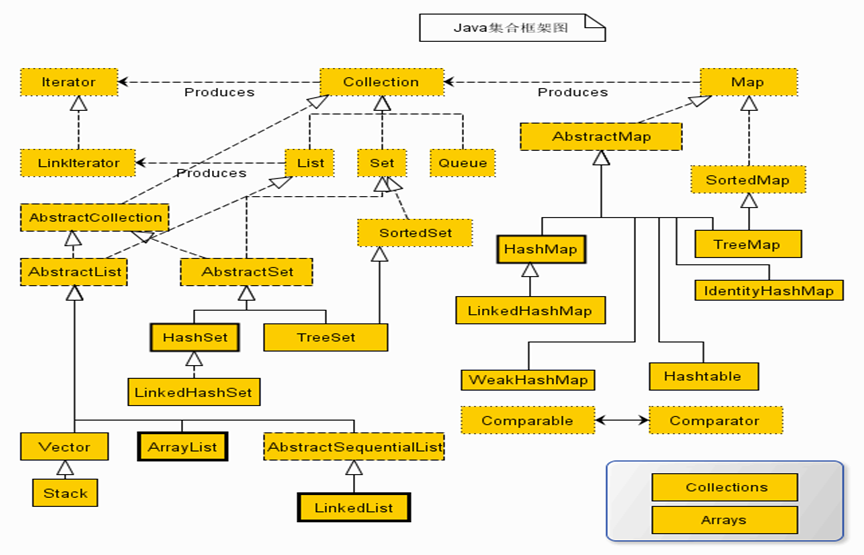
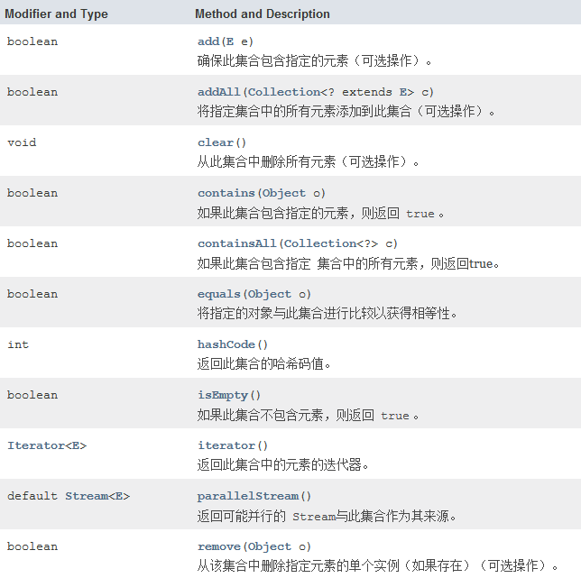
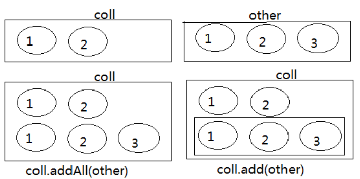
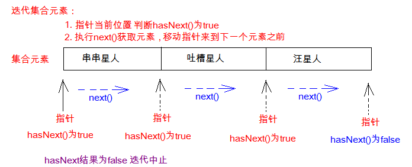
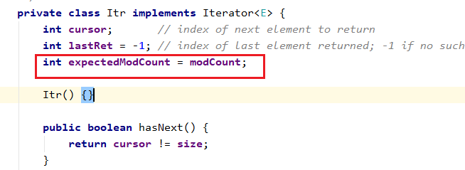
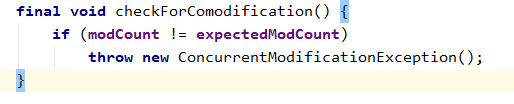
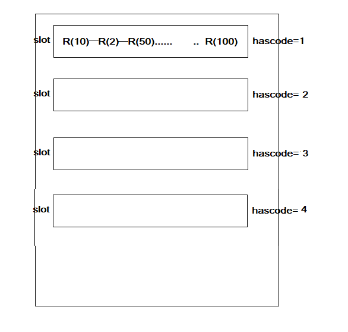
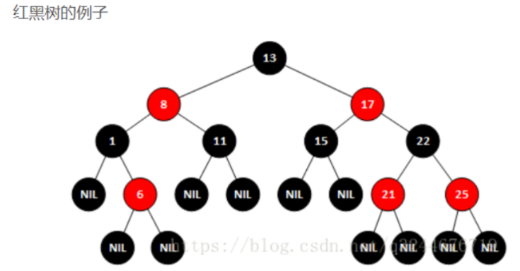
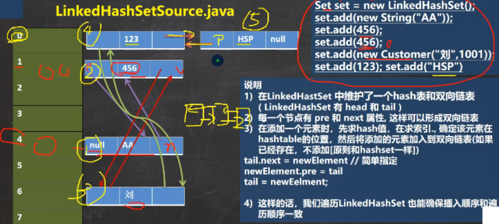
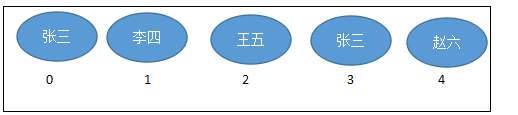

# 集合用法一    主讲  `程工`

# 1. 集合概述

## 1.1 简介

- 集合是java中提供的一种容器，可以用来存储多个数据。
  
  集合和数组既然都是容器，它们有啥区别呢？
  
  * 数组的长度是固定的。集合的长度是可变的。
  * 数组中可以存储基本数据类型值，也可以存储对象，而集合中只能存储对象
  
  集合主要分为两大系列：Collection和Map，Collection 表示一组对象，Map表示一组映射关系或键值对。

## 1.2 集合特点

- 集合存储对象的最大特点：存储对象的个数是动态的

- 数组最大的缺点：存储数据的个数是固定，不可被修改，也就是说当数组初始化完成之后，此数组长度，就已经固定。

  - 举例

    ~~~ java
    //动态数组初始化
    int []arrays=new int[10]
    //静态数组初始化
    int []arrays=new int[]{1,2,3};
    //定义一个存储对象的数组
    Object []arrays=new Object[10];
    ~~~

- 集合比数组存储数据，更加灵活

## 1.3 集合分类

- 针对java集合

  - List集合

    - 能存储可重复的对象

    - 有序

      ~~~ 
      1,2,3
      1,2,3
      ~~~

  - Set集合

    - 不能存储可重复的对象

    - 无序

      ~~~ 
      A,100,C
      C,A,100
      ~~~

  - Queue集合

    - 队列集合
      - FIFO
      - 双端队列

  - Map集合

    - 它能够存储两个对象
      - key-value映射关系

# 2. 分析集合类图

## 2.1 类图

- 类图如下：

  

- 分析上述类图

  - Collection是List、Set、Queue的父接口
  - List的实现类
    - Vector
    - ArrayList
    - LinkedList
    - Stack

  - Set的实现类
    - HashSet
    - TreeSet
    - LinkedHashSet

  - Map的实现类
    - HashMap
    - TreeMap
    - LinkedHashMap
    - HashTable

  - 通过Map接口，可以产生Collection接口对象
  - Iterator
    - 迭代器
      - 通过Collection，获取迭代器对象

  - ListIterator
    - 迭代器
      - 只给List集合使用

# 3. Collection和Iterator接口

## 3.1 Collection的简介

- Collection 层次结构中的根接口。Collection 表示一组对象，这些对象也称为 collection 的元素。一些 collection 允许有重复的元素，而另一些则不允许。一些 collection 是有序的，而另一些则是无序的。JDK 不提供此接口的任何直接实现：它提供更具体的子接口（如 Set 和 List、Queue）实现。此接口通常用来传递 collection，并在需要最大普遍性的地方操作这些 collection。 

  Collection<E>是所有单列集合的父接口，因此在Collection中定义了单列集合(List和Set)通用的一些方法，这些方法可用于操作所有的单列集合。方法如下：


## 3.2 Collection的主要方法



**1、添加元素**

（1）add(E obj)：添加元素对象到当前集合中

（2）addAll(Collection<? extends E> other)：添加other集合中的所有元素对象到当前集合中，即this = this ∪ other

**2、删除元素**

 （1） boolean remove(Object obj) ：从当前集合中删除第一个找到的与obj对象equals返回true的元素。

 （2）boolean removeAll(Collection<?> coll)：从当前集合中删除所有与coll集合中相同的元素。即this = this - this ∩ coll

**3、判断**

（1）boolean isEmpty()：判断当前集合是否为空集合。

（2）boolean contains(Object obj)：判断当前集合中是否存在一个与obj对象equals返回true的元素。

（3）boolean containsAll(Collection<?> c)：判断c集合中的元素是否在当前集合中都存在。即c集合是否是当前集合的“子集”。

**4、获取元素个数**

（1）int size()：获取当前集合中实际存储的元素个数

**5、交集**

（1）boolean retainAll(Collection<?> coll)：当前集合仅保留与c集合中的元素相同的元素，即当前集合中仅保留两个集合的交集，即this  = this ∩ coll；

**6、转为数组**

（1）Object[] toArray()：返回包含当前集合中所有元素的数组

## 3.3 代码实例

~~~ java
import java.util.ArrayList;
import java.util.Collection;

public class Demo1Collection {
    public static void main(String[] args) {
		// 创建集合对象 
    	// 使用多态形式
    	Collection<String> coll = new ArrayList<String>();
    	// 使用方法
    	// 添加功能  boolean  add(String s)
    	coll.add("小李广");
    	coll.add("扫地僧");
    	coll.add("石破天");
    	System.out.println(coll);

    	// boolean contains(E e) 判断o是否在集合中存在
    	System.out.println("判断  扫地僧 是否在集合中"+coll.contains("扫地僧"));

    	//boolean remove(E e) 删除在集合中的o元素
    	System.out.println("删除石破天："+coll.remove("石破天"));
    	System.out.println("操作之后集合中元素:"+coll);
    	
    	// size() 集合中有几个元素
		System.out.println("集合中有"+coll.size()+"个元素");

		// Object[] toArray()转换成一个Object数组
    	Object[] objects = coll.toArray();
    	// 遍历数组
    	for (int i = 0; i < objects.length; i++) {
			System.out.println(objects[i]);
		}

		// void  clear() 清空集合
		coll.clear();
		System.out.println("集合中内容为："+coll);
		// boolean  isEmpty()  判断是否为空
		System.out.println(coll.isEmpty());  	
	}
}
~~~

## 3.4 addAll方法与add方法区别



~~~ java
		Collection coll = new ArrayList();
		coll.add(1);
		coll.add(2);
		
		System.out.println("coll集合元素的个数：" + coll.size());
		
		Collection other = new ArrayList();
		other.add(1);
		other.add(2);
		other.add(3);
		
		coll.addAll(other);
//		coll.add(other);
		System.out.println("coll集合元素的个数：" + coll.size());
~~~

## 3.5 Iterator迭代器

### 3.5.1 Iterator接口

在程序开发中，经常需要遍历集合中的所有元素。针对这种需求，JDK专门提供了一个接口`java.util.Iterator`。`Iterator`接口也是Java集合中的一员，但它与`Collection`、`Map`接口有所不同，`Collection`接口与`Map`接口主要用于存储元素，而`Iterator`主要用于迭代访问（即遍历）`Collection`中的元素，因此`Iterator`对象也被称为迭代器。

想要遍历Collection集合，那么就要获取该集合迭代器完成迭代操作，下面介绍一下获取迭代器的方法：

* `public Iterator iterator()`: 获取集合对应的迭代器，用来遍历集合中的元素的。

下面介绍一下迭代的概念：

* **迭代**：即Collection集合元素的通用获取方式。在取元素之前先要判断集合中有没有元素，如果有，就把这个元素取出来，继续在判断，如果还有就再取出出来。一直把集合中的所有元素全部取出。这种取出方式专业术语称为迭代。

Iterator接口的常用方法如下：

* `public E next()`:返回迭代的下一个元素。
* `public boolean hasNext()`:如果仍有元素可以迭代，则返回 true。

接下来我们通过案例学习如何使用Iterator迭代集合中元素：

~~~java
public class IteratorDemo {
  	public static void main(String[] args) {
        // 使用多态方式 创建对象
        Collection<String> coll = new ArrayList<String>();

        // 添加元素到集合
        coll.add("串串星人");
        coll.add("吐槽星人");
        coll.add("汪星人");
        //遍历
        //使用迭代器 遍历   每个集合对象都有自己的迭代器
        Iterator<String> it = coll.iterator();
        //  泛型指的是 迭代出 元素的数据类型
        while(it.hasNext()){ //判断是否有迭代元素
            String s = it.next();//获取迭代出的元素
            System.out.println(s);
        }
  	}
}
~~~

> tips:：在进行集合元素取出时，如果集合中已经没有元素了，还继续使用迭代器的next方法，将会发生java.util.NoSuchElementException没有集合元素的错误。

### 3.5.2 迭代器的实现原理

我们在之前案例已经完成了Iterator遍历集合的整个过程。当遍历集合时，首先通过调用集合的iterator()方法获得迭代器对象，然后使用hashNext()方法判断集合中是否存在下一个元素，如果存在，则调用next()方法将元素取出，否则说明已到达了集合末尾，停止遍历元素。

Iterator迭代器对象在遍历集合时，内部采用指针的方式来跟踪集合中的元素，为了让初学者能更好地理解迭代器的工作原理，接下来通过一个图例来演示Iterator对象迭代元素的过程：



在调用Iterator的next方法之前，迭代器的索引位于第一个元素之前，指向第一个元素，当第一次调用迭代器的next方法时，返回第一个元素，然后迭代器的索引会向后移动一位，指向第二个元素，当再次调用next方法时，返回第二个元素，然后迭代器的索引会再向后移动一位，指向第三个元素，依此类推，直到hasNext方法返回false，表示到达了集合的末尾，终止对元素的遍历。

### 3.5.3 使用Iterator迭代器删除元素

java.util.Iterator迭代器中有一个方法：

​	void remove() ;

那么，既然Collection已经有remove(xx)方法了，为什么Iterator迭代器还要提供删除方法呢？

因为Collection的remove方法，无法根据条件删除。

例如：要删除以下集合元素中的偶数

```java
	@Test
	public void test02(){
		Collection<Integer> coll = new ArrayList<>();
		coll.add(1);
		coll.add(2);
		coll.add(3);
		coll.add(4);
		
//		coll.remove(?)//无法编写
		
		Iterator<Integer> iterator = coll.iterator();
		while(iterator.hasNext()){
			Integer element = iterator.next();
			if(element%2 == 0){
//				coll.remove(element);//错误的
				iterator.remove();
			}
		}
		System.out.println(coll);
	}
```

> 注意：不要在使用Iterator迭代器进行迭代时，调用Collection的remove(xx)方法，否则会报异常java.util.ConcurrentModificationException，或出现不确定行为。

- 为什么不能调用remove(obj)方法删除？

  使用modCount变量记录修改次数

  

  - 抛出异常条件 

    

  如果在Iterator、ListIterator迭代器创建后的任意时间从结构上修改了集合（通过迭代器自身的 remove 或 add 方法之外的任何其他方式），则迭代器将抛出 ConcurrentModificationException。因此，面对并发的修改，迭代器很快就完全失败，而不是冒着在将来不确定的时间任意发生不确定行为的风险。

  这样设计是因为，迭代器代表集合中某个元素的位置，内部会存储某些能够代表该位置的信息。当集合发生改变时，该信息的含义可能会发生变化，这时操作迭代器就可能会造成不可预料的事情。因此，果断抛异常阻止，是最好的方法。这就是Iterator迭代器的**快速失败（fail-fast）机制**。

### 3.5.4 练习

####  1、练习

声明学员类型Student，包含属性：姓名，成绩

添加本组学员Student对象到Collection的某个集合中

* 使用foreach遍历
* 使用Iterator遍历，并删除成绩低于60分的


### 3.5.5 增强for

增强for循环(也称for each循环)是**JDK1.5**以后出来的一个高级for循环，专门用来遍历数组和集合的。

格式：

~~~java
for(元素的数据类型  变量 : Collection集合or数组){ 
  	//写操作代码
}
~~~


#### 练习1：遍历数组

通常只进行遍历元素，**不要在遍历的过程中对数组元素进行修改**。

~~~java
public class NBForDemo1 {
    public static void main(String[] args) {
		int[] arr = {3,5,6,87};
       	//使用增强for遍历数组
		for(int a : arr){//a代表数组中的每个元素
			System.out.println(a);
		}
	}
}
~~~

#### 练习2：遍历集合

通常只进行遍历元素，**不要在遍历的过程中对集合元素进行增加、删除、替换操作**。

~~~java
public class NBFor {
    public static void main(String[] args) {        
    	Collection<String> coll = new ArrayList<String>();
    	coll.add("小河神");
    	coll.add("老河神");
    	coll.add("神婆");
    	//使用增强for遍历
    	for(String s :coll){//接收变量s代表 代表被遍历到的集合元素
    		System.out.println(s);
    	}
	}
}
~~~


# 4 Set集合用法

## 4.1 概述

Set接口是Collection的子接口，set接口没有提供额外的方法。但是比`Collection`接口更加严格了。

Set 集合不允许包含相同的元素，如果试把两个相同的元素加入同一个 Set 集合中，则添加操作失败。

Set集合支持的遍历方式和Collection集合一样：foreach和Iterator。

Set的常用实现类有：HashSet、TreeSet、LinkedHashSet。

## 4.2 HashSet的用法

HashSet 是 Set 接口的典型实现，大多数时候使用 Set 集合时都使用这个实现类。

`java.util.HashSet`底层的实现其实是一个`java.util.HashMap`支持，然后HashMap的底层物理实现是一个Hash表。（什么是哈希表，下一节在HashMap小节在细讲，这里先不展开）

HashSet 按 Hash 算法来存储集合中的元素，因此具有很好的存取和查找性能。HashSet 集合判断两个元素相等的标准：两个对象通过 hashCode() 方法比较相等，并且两个对象的 equals() 方法返回值也相等。因此，存储到HashSet的元素要重写hashCode和equals方法。

## 4.3 举例

~~~ java
package HashSet实例;

import java.util.HashSet;

class R
{
	private int count;
	

	public R() {
	}

	public R(int count) {
		this.count = count;
	}

	public int getCount() {
		return count;
	}

	public void setCount(int count) {
		this.count = count;
	}

	@Override
	public String toString() {
		return "R [count=" + count + "]";
	}
	
	//重写hashCode
	@Override
	public int hashCode() {
		// TODO Auto-generated method stub
		return count;
	}
	
	@Override
	public boolean equals(Object obj) {
		
		
		if(obj instanceof R)
		{
			R otherR=(R) obj;
			
			if(this.getCount()==otherR.getCount())
			{
				return true;
			}
		}
		return false;
	}
}

public class MainTest {

	public static void main(String[] args) {

		//新建HashSet的对象
		HashSet<R> set=new HashSet<>();
		set.add(new R(10));
		set.add(new R(2));
		set.add(new R(50));
		set.add(new R(40));
		set.add(new R(90));
		set.add(new R(90));
		
		R r100=new R(100);
		set.add(r100);
		set.add(r100);
		
		System.out.println("遍历输出set集合");
		//遍历输出set集合
		for(R r:set)
		{
			System.out.println(r);
		}
		
		R r101=new R(101);
		System.out.println(r101.hashCode());
		R r102=new R(101);
		System.out.println(r102.hashCode());
		
	}

}

~~~

## 4.4 HashSet的存储方式

- HashSet存储对象以哈希码存储

- 每个hascode的值，分配一个槽（slot），同一个槽的对象，以链表方式存储

- 存储方式如下：

  

# 5. TreeSet集合用法

## 5.1 简介

- TreeSet可以确保集合元素处于`排序`状态

## 5.2 TreeSet特点

- TreeSet也是属于Set集合类别一种
- 不能存储相同的对象
- 保证集合对象以`排序`状态显示
  - 自然排序实现
  - 定制排序实现

## 5.3 TreeSet的排序规则

### 5.3.1 自然排序

- 自然排序是TreeSet排序的默认规则
- 如何实现自然排序

  - 此类必须要实现Comparable接口
    - 重写compareTo方法
      - 如果该方法返回0，则表明这两个对象相等;如果该方法返回一个正整数，则表明obj1大于obj2；如果该方法返回一个负整数，则表明obj1小于obj2。

- 举例

  ~~~ java
  package TreeSet实例.自然排序;
  
  import java.util.TreeSet;
  
  
  class R implements Comparable<R>
  {
      private int count;
  
      public R() {
      }
  
      public R(int count) {
          this.count = count;
      }
  
      public int getCount() {
          return count;
      }
  
      public void setCount(int count) {
          this.count = count;
      }
  
      @Override
      public String toString() {
          return "R [count=" + count + "]";
      }
  
      @Override
      public int compareTo(R o) {
  
          return o.getCount()>this.getCount()?-1:(o.getCount()==this.getCount()?0:1);
  
      }
  
  }
  
  public class MainTest {
  
      public static void main(String[] args) {
  
          //定义一个TreeSet
          //TreeSet默认的排序规则：自然排序
          //  判断对象是否相同的标准：
          //
          TreeSet<R> set=new TreeSet<>();
          //将R对象存储set集合
          set.add(new R(100));
          set.add(new R(50));
          set.add(new R(60));
          set.add(new R(20));
          set.add(new R(30));
          set.add(new R(15));
          set.add(new R(15));
  
          for (R r : set) {
              System.out.println(r);
          }
  
  
      }
  }
  
  ~~~

### 5.3.2  定制排序

- 此类不需要实现Comparable接口

- 如果需要实现定制排序，则需要在创建TreeSet集合对象时，提供一个Comparator对象与该TreeSet集合关联，由该Comparator对象负责集合元素的排序逻辑。

- 举例

  - 要实现存储Integer数据，按降序实现排序，显然使用自然排序无法实现，则必须使用定制排序

    ~~~ java
    package TreeSet实例.定制排序;
    
    import java.util.Comparator;
    import java.util.TreeSet;
    
    public class MainTest {
    
    	public static void main(String[] args) {
    
    		// 定义一个局部内部类
    		class LocalComparator implements Comparator<Integer> {
    
    			@Override
    			public int compare(Integer o1, Integer o2) {
    
    				if (o1 > o2) {
    					return -1;
    				} else if (o1 < o2) {
    					return 1;
    				} else
    					return 0;
    			}
    		}
    
    		LocalComparator t1 = new LocalComparator();
    
    		// TreeSet存储Integer对象
    		// TreeSet<Integer> set=new TreeSet<>(t1);
    		// 定义一个匿名内部类
    		/*TreeSet<Integer> set = new TreeSet<>(new Comparator<Integer>() {
    
    			@Override
    			public int compare(Integer o1, Integer o2) {
    				// TODO Auto-generated method stub
    				if (o1 > o2) {
    					return -1;
    				} else if (o1 < o2) {
    					return 1;
    				} else
    					return 0;
    			}
    
    		});*/
    		//使用lambda表达式实现
    		//Comparator<Integer> c=(o1,o2)->o1>o2?-1:(o1==o2?0:1);
    		TreeSet<Integer> set = new TreeSet<>((o1,o2)->o1>o2?-1:(o1==o2?0:1));
    		
    		set.add(100);
    		set.add(200);
    		set.add(150);
    		set.add(300);
    		set.add(250);
    		set.add(50);
    
    		set.forEach(System.out::println);
    	}
    }
    
    ~~~

### 5.3.3 实现TreeSet低层算法

- 实现红黑树数据结构实现排序功能

  

  1.节点是红色或黑色。

  2.根节点是黑色。

  3.每个叶子节点都是黑色的空节点（NIL节点）。

  4 每个红色节点的两个子节点都是黑色。(从每个叶子到根的所有路径上不能有两个连续的红色节点)

  5.从任一节点到其每个叶子的所有路径都包含相同数目的黑色节点。

## 5.4 LinkedHashSet

### 5.4.1 简介

LinkedHashSet是HashSet的子类，它在HashSet的基础上，在结点中增加两个属性before和after维护了结点的前后添加顺序。`java.util.LinkedHashSet`，它是链表和哈希表组合的一个数据存储结构。LinkedHashSet插入性能略低于 HashSet，但在迭代访问 Set 里的全部元素时有很好的性能。

### 5.4.2 底层描述



### 5.4.3 实例

~~~ java
LinkedHashSet<String> set = new LinkedHashSet<>();
set.add("张三");
set.add("李四");
set.add("王五");
set.add("张三");
		
System.out.println("元素个数：" + set.size());
for (String name : set) {
	System.out.println(name);
}
~~~

```
运行结果：
元素个数：3
张三
李四
王五
```

# 6.  List集合

## 6.1 List接口介绍

`java.util.List`接口继承自`Collection`接口，是单列集合的一个重要分支，习惯性地会将实现了`List`接口的对象称为List集合。

## 6.2 List接口特点

1. List集合所有的元素是以一种线性方式进行存储的，例如，存元素的顺序是11、22、33。那么集合中，元素的存储就是按照11、22、33的顺序完成的）
2. 它是一个元素存取有序的集合。即元素的存入顺序和取出顺序有保证。
3. 它是一个带有索引的集合，通过索引就可以精确的操作集合中的元素（与数组的索引是一个道理）。
4. 集合中可以有重复的元素，通过元素的equals方法，来比较是否为重复的元素。

List集合类中元素有序、且可重复。这就像银行门口客服，给每一个来办理业务的客户分配序号：第一个来的是“张三”，客服给他分配的是0；第二个来的是“李四”，客服给他分配的1；以此类推，最后一个序号应该是“总人数-1”。



注意：

List集合关心元素是否有序，而不关心是否重复，请大家记住这个原则。例如“张三”可以领取两个号。

## 6.3 List接口中常用方法

List作为Collection集合的子接口，不但继承了Collection接口中的全部方法，而且还增加了一些根据元素索引来操作集合的特有方法，如下：

List除了从Collection集合继承的方法外，List 集合里添加了一些根据索引来操作集合元素的方法。

1、添加元素

* void add(int index, E ele)
* boolean addAll(int index, Collection<? extends E> eles)

2、获取元素

* E get(int index)
* List subList(int fromIndex, int toIndex)

3、获取元素索引

* int indexOf(Object obj)
* int lastIndexOf(Object obj)

4、删除和替换元素

* E remove(int index)
* E set(int index, E ele)

List集合特有的方法都是跟索引相关：

```java
public class ListDemo {
    public static void main(String[] args) {
		// 创建List集合对象
    	List<String> list = new ArrayList<String>();
    	
    	// 往 尾部添加 指定元素
    	list.add("图图");
    	list.add("小美");
    	list.add("不高兴");
    	
    	System.out.println(list);
    	// add(int index,String s) 往指定位置添加
    	list.add(1,"没头脑");
    	
    	System.out.println(list);
    	// String remove(int index) 删除指定位置元素  返回被删除元素
    	// 删除索引位置为2的元素 
    	System.out.println("删除索引位置为2的元素");
    	System.out.println(list.remove(2));
    	
    	System.out.println(list);
    	
    	// String set(int index,String s)
    	// 在指定位置 进行 元素替代（改） 
    	// 修改指定位置元素
    	list.set(0, "三毛");
    	System.out.println(list);
    	
    	// String get(int index)  获取指定位置元素
    	
    	// 跟size() 方法一起用  来 遍历的 
    	for(int i = 0;i<list.size();i++){
    		System.out.println(list.get(i));
    	}
    	//还可以使用增强for
    	for (String string : list) {
			System.out.println(string);
		}  	
	}
}
```

> 在JavaSE中List名称的类型有两个，一个是java.util.List集合接口，一个是java.awt.List图形界面的组件，别导错包了。

## 6.4 List接口的实现类们

List接口的实现类有很多，常见的有：

ArrayList：动态数组

Vector：动态数组

LinkedList：双向链表

Stack：栈

## 6.5 ListIterator

List 集合额外提供了一个 listIterator() 方法，该方法返回一个 ListIterator 对象， ListIterator 接口继承了 Iterator 接口，提供了专门操作 List 的方法：

* void add()：通过迭代器添加元素到对应集合
* void set(Object obj)：通过迭代器替换正迭代的元素
* void remove()：通过迭代器删除刚迭代的元素
* boolean hasPrevious()：如果以逆向遍历列表，往前是否还有元素。
* Object previous()：返回列表中的前一个元素。
* int previousIndex()：返回列表中的前一个元素的索引
* boolean hasNext()
* Object next()
* int nextIndex()

```java
	public static void main(String[] args) {
		List<Student> c = new ArrayList<>();
		c.add(new Student(1,"张三"));
		c.add(new Student(2,"李四"));
		c.add(new Student(3,"王五"));
		c.add(new Student(4,"赵六"));
		c.add(new Student(5,"钱七"));
		
		//从指定位置往前遍历
		ListIterator<Student> listIterator = c.listIterator(c.size());
		while(listIterator.hasPrevious()){
			Student previous = listIterator.previous();
			System.out.println(previous);
		}
	}
```
