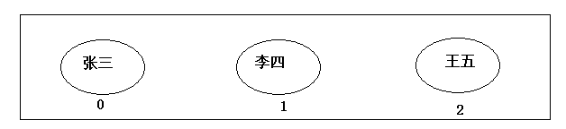
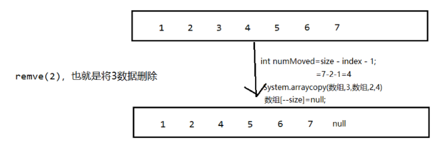
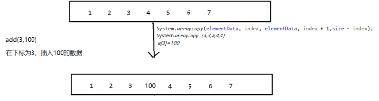

# 集合用法二    主讲  `程工`

# 1.  List集合

## 1.1 List接口介绍

List 集合代表一个元素有序、可重复的集合，集合中每个元素都有其对应的顺序索引 。 List 集合允许使用重复元素，可以通过索引来访 问指定位置的集合元素 。 List 集合默认按元素的添加顺序设置元素的索引，例如第一次添加的元素索引为 0 ， 第二次添加 的元素索引为 l ……

## 1.2 List接口特点

1. List集合所有的元素是以一种线性方式进行存储的，例如，存元素的顺序是11、22、33。那么集合中，元素的存储就是按照11、22、33的顺序完成的）
2. 它是一个元素存取有序的集合。即元素的存入顺序和取出顺序有保证。
3. 它是一个带有索引的集合，通过索引就可以精确的操作集合中的元素（与数组的索引是一个道理）。
4. 集合中可以有重复的元素，通过元素的equals方法，来比较是否为重复的元素。

List集合类中元素有序、且可重复。这就像银行门口客服，给每一个来办理业务的客户分配序号：第一个来的是“张三”，客服给他分配的是0；第二个来的是“李四”，客服给他分配的1；以此类推，最后一个序号应该是“总人数-1”。



注意：

List集合关心元素是否有序，而不关心是否重复，请大家记住这个原则。例如“张三”可以领取两个号。

## 1.3 List接口中常用方法

List作为Collection集合的子接口，不但继承了Collection接口中的全部方法，而且还增加了一些根据元素索引来操作集合的特有方法，如下：

List除了从Collection集合继承的方法外，List 集合里添加了一些根据索引来操作集合元素的方法。

1、添加元素

* void add(int index, Object element)：将元素element插入到List集合的index处。
* boolean addAll(int index, Collection c)：将集合c所包含的所有元素都插入到List集合的index处。

2、获取元素

* Object get(int index): 返回集合index索引处的元素。
* List subList(int fromIndex, int toIndex)：返回从索引 fromlndex (包含)到索引toIndex(不包含)处所有集合元素组成的子集合。

3、获取元素索引

* int indexOf(Object obj)：返回对象。在List集合中第一次出现的位置索引。
* int lastIndexOf(Object obj)：返回对象。在List集合中最后一次出现的位置索引。

4、删除和替换元素

* E remove(int index)
* E set(int index, E ele)

List集合特有的方法都是跟索引相关：

```java
public class ListDemo {
    public static void main(String[] args) {
		// 创建List集合对象
    	List<String> list = new ArrayList<String>();
    	
    	// 往 尾部添加 指定元素
    	list.add("张三");
		list.add("李四");
    	list.add("王五");
    	
    	System.out.println(list);
    	// add(int index,String s) 往指定位置添加
    	list.add(1,"小李");
    	
    	System.out.println(list);
    	// String remove(int index) 删除指定位置元素  返回被删除元素
    	// 删除索引位置为2的元素 
    	System.out.println("删除索引位置为2的元素");
    	System.out.println(list.remove(2));
    	
    	System.out.println(list);
    	
    	// String set(int index,String s)
    	// 在指定位置 进行 元素替代（改） 
    	// 修改指定位置元素
    	list.set(0, "三毛");
    	System.out.println(list);
    	
    	// String get(int index)  获取指定位置元素
    	
    	// 跟size() 方法一起用  来 遍历的 
    	for(int i = 0;i<list.size();i++){
    		System.out.println(list.get(i));
    	}
    	//还可以使用增强for
    	for (String string : list) {
			System.out.println(string);
		}
	}
}
```

> 在JavaSE中List名称的类型有两个，一个是java.util.List集合接口，一个是java.awt.List图形界面的组件，别导错包了。

List集合删除对象的标准：根据equals方法的返回值来判断对象是否相等

~~~ java
package com.gec.List集合;

import java.util.ArrayList;
import java.util.List;

class R
{
    private int count;

    public R() {
    }

    public R(int count) {
        this.count = count;
    }

    public int getCount() {
        return count;
    }

    public void setCount(int count) {
        this.count = count;
    }

    @Override
    public String toString() {
        return "R{" +
                "count=" + count +
                '}';
    }

    @Override
    public boolean equals(Object obj) {

        if(obj instanceof R){
            R otherR= (R) obj;

            if(this.getCount()==otherR.getCount()){
                return true;
            }
        }

        return false;

    }
}

public class ListDemo {

    public static void main(String[] args) {

        // 创建List集合对象
        List<R> list = new ArrayList<R>();

        list.add(new R(100));
        list.add(new R(200));
        list.add(new R(300));
        list.add(new R(400));
        System.out.println("删除 R(200)的数据");
        list.remove(new R(200));
        for (R r : list) {
            System.out.println(r);
        }


    }
}

~~~

## 1.4 List接口的实现类们

List接口的实现类有很多，常见的有：

ArrayList：动态数组

Vector：动态数组

LinkedList：双向链表

Stack：栈

## 1.5 ListIterator

List 集合额外提供了一个 listIterator() 方法，该方法返回一个 ListIterator 对象， ListIterator 接口继承了 Iterator 接口，提供了专门操作 List 的方法：

* void add()：通过迭代器添加元素到对应集合
* void set(Object obj)：通过迭代器替换正迭代的元素
* void remove()：通过迭代器删除刚迭代的元素
* boolean hasPrevious()：如果以逆向遍历列表，往前是否还有元素。
* Object previous()：返回列表中的前一个元素。
* int previousIndex()：返回列表中的前一个元素的索引
* boolean hasNext()
* Object next()
* int nextIndex()

**代码举例**

~~~ java
package com.gec.iterator;

import java.util.ArrayList;
import java.util.List;
import java.util.ListIterator;

public class ListIteratorTest {

    public static void main(String[] args) {

        String[] books = {
                "疯狂Java讲义", "疯狂iOS讲义",
                "轻量级Java EE企业应用实战"
        };

        List bookList = new ArrayList();
        for (int i = 0; i < books.length ; i++ )
        {
            bookList.add(books[i]);
        }

        System.out.println("---------------------");

        ListIterator lit = bookList.listIterator();
        while (lit.hasNext())
        {
            System.out.println(lit.next());
            lit.add("-------分隔符-------");
        }

        System.out.println("=======下面开始反向迭代=======");
        while(lit.hasPrevious())
        {
            System.out.println(lit.previous());
        }

        System.out.println("1、============================");

        while ((lit.hasNext())){
            System.out.println(lit.next());
        }

        System.out.println("2、============================");
        while (lit.hasPrevious()){
            System.out.println(lit.previous());
        }

        /*while (lit.hasPrevious()){
            System.out.println(lit.previous());
        }*/

    }
}

~~~

## 1.6 LinkedList实现类

### 1.6.1 概述

- LinkedList 类是 List 接口的实现类一这意味着它是一 个List集合，可以根据索引来随机访问集合中的元素 。 除此之外，LinkedList 还实现了Deque接口，可以被当成双端队列来使用，因此既可以被当成“**栈**”来使用 ，也可以当成队列使用

### 1.6.2 底层实现

- LinkedList 与 ArrayList、ArrayDeque的实现机制完全不同，ArrayList、ArrayDeque内部以数组的形
  式来保存集合中的元素，因此随机访问集合元素时有较好的性能:而 LinkedList 内部以链表的形式来保
  存集合中的元素，因此随机访问集合元素时性能较差，但在插入、删除元素时性能比较出色(只需改变
  指针所指的地址即可)。需要指出的是，虽然 Vector 也是以数组的形式来存储集合元素的，但因为它实
  现了线程同步功能(而且实现机制也不好) ，所以各方面性能都比较差。

### 1.6.3 代码

- 实现

~~~ java
package com.gec.LinkedList实现类;

import java.util.LinkedList;

public class LinkedListTest {

    public static void main(String[] args) {

        LinkedList books = new LinkedList();
        // 将字符串元素加入队列的尾部

        // 将一个字符串元素加入栈的顶部
        //books.push("轻量级Java EE企业应用实战");
        // 将字符串元素添加到队列的头部（相当于栈的顶部）
        books.push("Android讲义 1");
        books.push("Android讲义 2");
        books.push("Android讲义 3");
        books.push("Android讲义 4");
        books.push("Android讲义 5");
        books.push("Android讲义 6");


        System.out.println(books.pop());
        System.out.println(books.pop());
        System.out.println(books.pop());
        System.out.println(books.pop());
        System.out.println(books.pop());
        System.out.println(books.pop());

    }
}

~~~

## 1.7 ArrayList的底层代码实现

### 1.7.1. 分析代码

#### 初始化数组长度

针对jdk1.8版本ArrayList

底层是使用对象类型的`数组`存储

当第一次add方法调用，才实现数组长度的初始化，默认长度10

当调用add方法，首先判断 size+1与数组当前的长度的大小，来决定是否扩容

~~~ java
if( size+1>数组.length())
{
    //数组扩容处理
    grow();
}
~~~

#### 如何扩容数组

- 由源码注释可得知，此方法用来保证数组至少可以容纳由minimum capacity参数指定的元素数。

  大白话就是，容量要保证能装下mincapacity所指定的容量大小

- 扩容数组后的数组长度=原先数组的长度*1.5倍

~~~ java
    private void grow(int minCapacity) {
        // overflow-conscious code
        //把数组的长度赋给oldCapacity
        int oldCapacity = elementData.length;
        //新的数组容量=老的数组长度的1.5倍。oldCapacity >> 1 相当于除以2
        int newCapacity = oldCapacity + (oldCapacity >> 1);
        ////如果新的数组容量newCapacity小于传入的参数要求的最小容量minCapacity，那么新的数组容量以传入的容量参数为准。
        if (newCapacity - minCapacity < 0)
            newCapacity = minCapacity;
        //如果新的数组容量newCapacity大于数组能容纳的最大元素个数 MAX_ARRAY_SIZE 2^{31}-1-8
        if (newCapacity - MAX_ARRAY_SIZE > 0)
            newCapacity = hugeCapacity(minCapacity);
        // minCapacity is usually close to size, so this is a win:
        //把旧数组放进新的扩容后的数组
        elementData = Arrays.copyOf(elementData, newCapacity);
    }
~~~

~~~ java
//如果新的数组容量newCapacity大于数组能容纳的最大元素个数 MAX_ARRAY_SIZE 2^{31}-1-8
//那么再判断传入的参数minCapacity是否大于MAX_ARRAY_SIZE，如果minCapacity大于MAX_ARRAY_SIZE，那么//newCapacity等于Integer.MAX_VALUE，否者newCapacity等于MAX_ARRAY_SIZE  

private static int hugeCapacity(int minCapacity) {
        if (minCapacity < 0) // overflow
            throw new OutOfMemoryError();
        return (minCapacity > MAX_ARRAY_SIZE) ?
            Integer.MAX_VALUE :
            MAX_ARRAY_SIZE;
    }
~~~

#### 如何实现删除

- 实现原理：

  - size是集合个数
  
  

~~~ java
    public E remove(int index) {
        rangeCheck(index);

        modCount++;
        E oldValue = elementData(index);

        int numMoved = size - index - 1;
        if (numMoved > 0)
            System.arraycopy(elementData, index+1, elementData, index,
                             numMoved);
        elementData[--size] = null; // clear to let GC do its work

        return oldValue;
    }
~~~

#### 如何实现添加

根据下标，添加数据



~~~ java
    public void add(int index, E element) {
        rangeCheckForAdd(index);

        ensureCapacityInternal(size + 1);  // Increments modCount!!
        System.arraycopy(elementData, index, elementData, index + 1,
                         size - index);
        elementData[index] = element;
        size++;
    }
~~~

# 2. Map集合

## 2.1 Map集合特点

- 存储key,value的具有映射有关系的集合对象
  - key、value都是对象类型，其实就是引用

- key其实就是Set集合类型
  - key不能重复存储相同的对象

- value就是Collection类型
  - 允许可重复的对象

- key与value之间存在映射关系
  - 一个key，只能映射一个value对象
  - 但同一个value对象，可以被多个key映射

## 2.2 HashMap实现类

## 1、特点

- HashMap线程不安全
- HashMap可以使用null作为key和value
- HashMap与HashSet一样，判断key的存储对象是否相同的标准：根据hasCode方法的返回值和equals方法的返回值决定此对象是否相同

## 2、HashMap的具体用法

### a、主要方法

### b、举例

~~~ java
package 课堂练习.HashMap集合;

import java.util.HashMap;

class Product
{
	private String productNo;
	private String productName;
	
	public Product() {
		
	}
	
	public Product(String productNo, String productName) {
		this.productNo = productNo;
		this.productName = productName;
	}
	public String getProductNo() {
		return productNo;
	}
	public void setProductNo(String productNo) {
		this.productNo = productNo;
	}
	public String getProductName() {
		return productName;
	}
	public void setProductName(String productName) {
		this.productName = productName;
	}
	@Override
	public String toString() {
		return "Product [productNo=" + productNo + ", productName=" + productName + "]";
	}
	
	@Override
	public boolean equals(Object obj) {
		// TODO Auto-generated method stub
		
		if(obj instanceof Product)
		{
			Product otherProduct=(Product) obj;
			
			if(otherProduct.getProductNo().equals(this.getProductNo()))
			{
				return true;
			}
			
		}
		
		return false;
		
	}
	
	@Override
	public int hashCode() {
		// TODO Auto-generated method stub
		return getProductNo().hashCode();
	}
	
	
}


class Consumer
{
	private String name;
	private Integer age;
	
	
	public Consumer() {
		
	}
	
	public Consumer(String name, Integer age) {
		this.name = name;
		this.age = age;
	}
	public String getName() {
		return name;
	}
	public void setName(String name) {
		this.name = name;
	}
	public Integer getAge() {
		return age;
	}
	public void setAge(Integer age) {
		this.age = age;
	}
	
	@Override
	public String toString() {
		return "Consumer [name=" + name + ", age=" + age + "]";
	}

}

public class MainTest {

	public static void main(String[] args) {
		
		HashMap<Product, Consumer> map=new HashMap<>();
		
		//分别新建5个商品对应5个顾客
		map.put(new Product("sn001", "手机"), new Consumer("李5", 34));
		map.put(new Product("sn002", "平板电脑"), new Consumer("李1", 34));
		map.put(new Product("sn003", "茅台"), new Consumer("李2", 34));
		map.put(new Product("sn004", "apple电脑"), new Consumer("李3", 34));
		map.put(new Product("sn005", "电视"), new Consumer("李4", 34));
		
		
		map.remove(new Product("sn003", "茅台"));
		
		System.out.println("helloworld".hashCode());
		System.out.println("helloworld".hashCode());
		
		//遍历map集合
		map.forEach((k,v)->System.out.println("key="+k+"  value="+v));

	}

}

~~~

## 3、练习

（1）从键盘输入本组学员的姓名和他的手机号码，存放到map中，姓名为key,手机号码为value，并且遍历显示

（2）再从键盘输入姓名，查询他的手机号码

# 3. TreeMap实现类用法

## 1、主要特点

- TreeMap存储key-value对（节点）时，需要根据key对节点进行排序。TreeMap可以保证所有的key-value对处于有序状态。

## 2、TreeMap两种排序方式

- 自然排序：TreeMap的所有key必须实现Comparable接口，而且所有的key应该是同一个类的对象，否则将会抛出ClassCastException异常。

- 定制排序：创建TreeMap时，传入一个Comparator对象，该对象负责对TreeMap中的所有key进行排序。采用定制排序时不要求Map的key实现Comparable接口中。

- 举例

  ~~~ java
  package 集合实例二.TreeMap集合;
  
  import java.util.Comparator;
  import java.util.TreeMap;
  
  public class MainTest {
  
  	public static void main(String[] args) {
  		
  		//创建一个TreeMap对象集合
  		//自然排序
  		TreeMap<Integer, String> map=new TreeMap<>();
  		
  		map.put(100, "李一");
  		map.put(10, "李二");
  		map.put(20, "李三");
  		map.put(15, "李四");
  		map.put(2, "李五");
  		map.put(200, "李六");
  		
  		map.forEach((k,v)->System.out.println("k="+k+"  v="+v));
  		
  		System.out.println("定制排序-------------");
  		//定制排序
  		
  		TreeMap<Integer, String> map2=new TreeMap<>(new Comparator<Integer>() {
  
  			@Override
  			public int compare(Integer o1, Integer o2) {
  				return o1>o2?-1:(o1<o2)?1:0;
  			}
  			
  		});
  		
  		map2.put(100, "李一");
  		map2.put(10, "李二");
  		map2.put(20, "李三");
  		map2.put(15, "李四");
  		map2.put(2, "李五");
  		map2.put(200, "李六");
  		map2.forEach((k,v)->System.out.println("k="+k+"  v="+v));
  	}
  
  }
  
  ~~~

