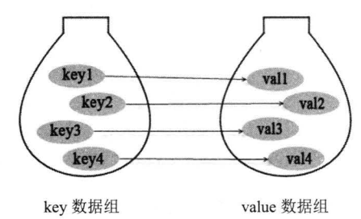
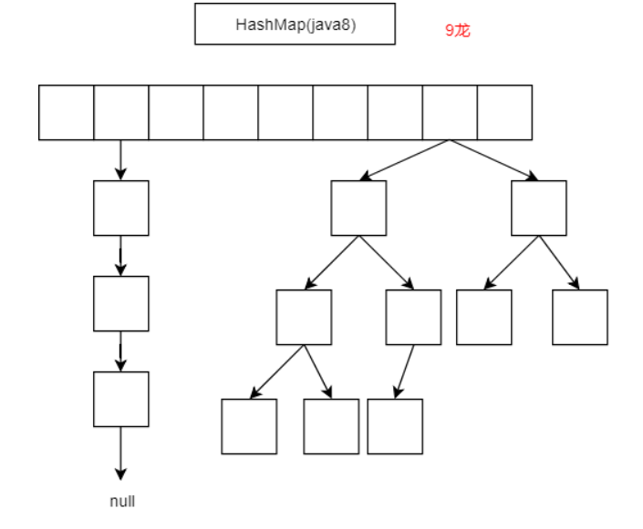

# 集合应用三

# 1. Map集合

## 1.1 Map概述

- Interface Map<K,V> 
  - K:键的类型; V:值的类型，将键映射到值的对象；不包含重复的键；每个键可以映射到最多一个值

## 1.2 Map集合特点

- 存储key,value的具有映射有关系的集合对象
  - key、value都是对象类型，其实就是引用
- key其实就是Set集合类型
  - key不能重复存储相同的对象
- value就是Collection类型
  - 允许可重复的对象
- key与value之间存在映射关系
  - 一个key，只能映射一个value对象
  - 但同一个value对象，可以被多个key映射

## 1.3 核心方法

- **添加、删除、修改操作**

  Object put(Object key,Object value)：将指定key-value添加到(或修改)当前map对象中

  void putAll(Map m):将m中的所有key-value对存放到当前map中

  Object remove(Object key)：移除指定key的key-value对，并返回value

  void clear()：清空当前map中的所有数据

- **元素查询的操作**

  Object get(Object key)：获取指定key对应的value

  boolean containsKey(Object key)：是否包含指定的key

  boolean containsValue(Object value)：是否包含指定的value

  int size()：返回map中key-value对的个数

  boolean isEmpty()：判断当前map是否为空

  boolean equals(Object obj)：判断当前map和参数对象obj是否相等

- **元素视图操作的方法**

  Set keySet()：返回所有key构成的Set集合

  Collection values()：返回所有value构成的Collection集合

  Set entrySet()：返回所有key-value对构成的Set集合

- **举例用法**

  ~~~ java
  package com.gec.map用法;
  
  import java.util.*;
  
  public class MainTest {
  
      public static void main(String[] args) {
  
          Map<String,Integer> map = new HashMap<>();
          //添加
          map.put("AA",123);
          map.put("BB",123);
          map.put("CC",56);
          //修改
          map.put("AA",87);
  
          System.out.println(map);//{AA=87, BB=56, 45=123}
  
          Map map1 = new HashMap();
          map1.put("CC",123);
          map1.put("DD",123);
  
          map.putAll(map1);
  
          System.out.println(map);
  
          Object value = map.remove("CC");
          System.out.println(value);//123
          System.out.println(map);//{AA=87, BB=123, DD=123}
  
  
          //clear()
          map.clear();//与map = null操作不同
          System.out.println(map.size());//0
          System.out.println(map);//{}
          //--------------------------------
          map.put("AA",123);
          map.put("BB",123);
          map.put("CC",56);
          // Object get(Object key)
          System.out.println(map.get("BB"));//123
          //containsKey(Object key)
          System.out.println(map.containsKey("BB"));//true
          System.out.println(map.containsValue(123));//true
  
          map.clear();
          System.out.println(map.isEmpty());//true
  
          //遍历所有的key集：keySet()
          Set<String> set = map.keySet();
          Iterator<String> iterator = set.iterator();
          while(iterator.hasNext()){
              System.out.println(iterator.next());
          }
          //AA
          //BB
          //45
          System.out.println();
          //遍历所有的value集：values()
          Collection<Integer> values = map.values();
          for(Integer v : values){
              System.out.println(v);
          }
          //123
          //56
          //1234
          System.out.println();
  
          //遍历所有的key-value
          //方式一：entrySet()
          Set<Map.Entry<String, Integer>> entrySet = map.entrySet();
          Iterator<Map.Entry<String, Integer>> iterator1 = entrySet.iterator();
          while (iterator1.hasNext()){
              Map.Entry<String, Integer> entry = iterator1.next();
              //entrySet集合中的元素都是entry
              System.out.println(entry.getKey() + "---->" + entry.getValue());
          }
          //AA---->123
          //BB---->56
          //45---->1234
          System.out.println();
  
          //方式二：
          Set<String> keySet = map.keySet();
          Iterator<String> iterator2 = keySet.iterator();
          while(iterator2.hasNext()){
              String key = iterator2.next();
              Integer value1 = map.get(key);
              System.out.println(key + "=====" + value1);
          }
      }
  }
  
  ~~~

## 1.4 HashMap实现类

### 1.4.1 特点

- HashMap线程不安全
- HashMap可以使用null作为key和value
- HashMap与HashSet一样，判断key的存储对象是否相同的标准：根据hasCode方法的返回值和equals方法的返回值决定此对象是否相同

### 1.4.2. HashMap的具体用法

- 判断key的存储对象是否相同的标准：根据hasCode方法的返回值和equals方法的返回值决定此对象是否相同

~~~ java
package 课堂练习.HashMap集合;

import java.util.HashMap;

class Product
{
	private String productNo;
	private String productName;
	
	public Product() {
		
	}
	
	public Product(String productNo, String productName) {
		this.productNo = productNo;
		this.productName = productName;
	}
	public String getProductNo() {
		return productNo;
	}
	public void setProductNo(String productNo) {
		this.productNo = productNo;
	}
	public String getProductName() {
		return productName;
	}
	public void setProductName(String productName) {
		this.productName = productName;
	}
	@Override
	public String toString() {
		return "Product [productNo=" + productNo + ", productName=" + productName + "]";
	}
	
	@Override
	public boolean equals(Object obj) {
		// TODO Auto-generated method stub
		
		if(obj instanceof Product)
		{
			Product otherProduct=(Product) obj;
			
			if(otherProduct.getProductNo().equals(this.getProductNo()))
			{
				return true;
			}
			
		}
		
		return false;
		
	}
	
	@Override
	public int hashCode() {
		// TODO Auto-generated method stub
		return getProductNo().hashCode();
	}
	
	
}

class Consumer
{
	private String name;
	private Integer age;
	
	
	public Consumer() {
		
	}
	
	public Consumer(String name, Integer age) {
		this.name = name;
		this.age = age;
	}
	public String getName() {
		return name;
	}
	public void setName(String name) {
		this.name = name;
	}
	public Integer getAge() {
		return age;
	}
	public void setAge(Integer age) {
		this.age = age;
	}
	
	@Override
	public String toString() {
		return "Consumer [name=" + name + ", age=" + age + "]";
	}

}

public class MainTest {

	public static void main(String[] args) {
		
		HashMap<Product, Consumer> map=new HashMap<>();
		
		//分别新建5个商品对应5个顾客
		map.put(new Product("sn001", "手机"), new Consumer("李5", 34));
		map.put(new Product("sn002", "平板电脑"), new Consumer("李1", 34));
		map.put(new Product("sn003", "茅台"), new Consumer("李2", 34));
		map.put(new Product("sn004", "apple电脑"), new Consumer("李3", 34));
		map.put(new Product("sn005", "电视"), new Consumer("李4", 34));
		
		
		map.remove(new Product("sn003", "茅台"));
		
		System.out.println("helloworld".hashCode());
		System.out.println("helloworld".hashCode());
		
		//遍历map集合
		map.forEach((k,v)->System.out.println("key="+k+"  value="+v));

	}

}

~~~

### 1.4 练习

（1）从键盘输入本组学员的姓名和他的手机号码，存放到map中，姓名为key,手机号码为value，并且遍历显示

（2）再从键盘输入姓名，查询他的手机号码

## 1.5 TreeMap实现类用法

### 1.5.1 主要特点

- TreeMap存储key-value对（节点）时，需要根据key对节点进行排序。TreeMap可以保证所有的key-value对处于有序状态。

### 1.5.2 TreeMap两种排序方式

- 自然排序：TreeMap的所有key必须实现Comparable接口，而且所有的key应该是同一个类的对象，否则将会抛出ClassCastException异常。

- 定制排序：创建TreeMap时，传入一个Comparator对象，该对象负责对TreeMap中的所有key进行排序。采用定制排序时不要求Map的key实现Comparable接口中。

- 举例

  ~~~ java
  package 集合实例二.TreeMap集合;
  
  import java.util.Comparator;
  import java.util.TreeMap;
  
  public class MainTest {
  
  	public static void main(String[] args) {
  		
  		//创建一个TreeMap对象集合
  		//自然排序
  		TreeMap<Integer, String> map=new TreeMap<>();
  		
  		map.put(100, "李一");
  		map.put(10, "李二");
  		map.put(20, "李三");
  		map.put(15, "李四");
  		map.put(2, "李五");
  		map.put(200, "李六");
  		
  		map.forEach((k,v)->System.out.println("k="+k+"  v="+v));
  		
  		System.out.println("定制排序-------------");
  		//定制排序
  		
  		TreeMap<Integer, String> map2=new TreeMap<>(new Comparator<Integer>() {
  
  			@Override
  			public int compare(Integer o1, Integer o2) {
  				return o1>o2?-1:(o1<o2)?1:0;
  			}
  			
  		});
  		
  		map2.put(100, "李一");
  		map2.put(10, "李二");
  		map2.put(20, "李三");
  		map2.put(15, "李四");
  		map2.put(2, "李五");
  		map2.put(200, "李六");
  		map2.forEach((k,v)->System.out.println("k="+k+"  v="+v));
  	}
  
  }
  
  ~~~

## 1.6 LinkedHashMap集合

### 1.6.1 简介

- HashSet有一个子类是LinkedHashSet，HashMap也有一个LinkedHashMap子类； LinkedHashMap也使用双向链表来维护key-value对的次序（其实只需要考虑Key的次序），该链表负责维护Map的迭代顺序，迭代顺序与key-value对的插入顺序保持一致。
- LinkedHashMap 需要维护元素的插入顺序，因此性能略低于 HashMap 的性能;但因为它以链表来维护内部顺序，所以在迭代访问 Map 里的全部元素时将有较好的性能 。

### 1.6.2 用法

~~~ java
package com.gec.LinkedHashMap用法;

import java.util.LinkedHashMap;

public class MainTest {

    public static void main(String[] args) {

        LinkedHashMap scores = new LinkedHashMap();
        scores.put("语文" , 80);
        scores.put("英语" , 82);
        scores.put("数学" , 60);
        scores.put("python" , 90);
        scores.put("c++" , 100);
        scores.put("java" , 40);
        scores.put("c" , 50);
        // 调用forEach方法遍历scores里的所有key-value对
        scores.forEach((key, value) -> System.out.println(key + "-->" + value));

    }
}

~~~

## 1.7 使用Properties读写属性文件

### 1.7.1 简介

- Properties类是Hashtable类的子类，正如它的名字所暗示的，该对象在处理属性文件时特别方便。
- Properties类可以把Map对象和属性文件关联起来，从而可以把Map对象中的key-value对写入属性文件中，也可以把属性文件中的“属性名=属性值”加载到Map对象中。
- 由于属性文件里的属性名、属性值只能是字符串类型，所以Propertites里的key、value都是字符串类型。
- Properties相当于一个key、value都是String类型的Map

### 1.7.2 方法

- String getProperty(String key)：获取 Properties 中指定属性名对应的属性值，类似于 Map 的get(Object key)方法 。
- String getProperty(String key, String defaultValue)：该方法与前一个方法基本相似。该方法多一个功能，如果 Properties 中不存在指定的key时，则该方法指定默认值 。
- Object setProperty(String key, String value)：设置属性值，类似于 Hashtable 的 put方法 。除此之外，它还提供了两个读写属性文件的方法 。
- void load(InputStream inStream)：从属性文件(以输入流表示)中加载 key-value 对，把加载到的key-value 对追加到 Properties 里( Properties 是 Hash table 的 子类，它不保证 key-value 对之间的次序)。
- void store(OutputStream out,String comments)：将 Properties中的 key-value 对输出到指定的属性文件(以输出流表示)中。

### 1.7.3 用法

~~~ java

import java.util.*;
import java.io.*;
/**
 */
public class PropertiesTest
{
	public static void main(String[] args)
		throws Exception
	{
		Properties props = new Properties();
		// 向Properties中增加属性
		props.setProperty("username" , "yeeku");
		props.setProperty("password" , "123456");
		// 将Properties中的key-value对保存到a.ini文件中
		props.store(new FileOutputStream("a.ini")
			, "comment line");   //①
		// 新建一个Properties对象
		Properties props2 = new Properties();
		// 向Properties中增加属性
		props2.setProperty("gender" , "male");
		// 将a.ini文件中的key-value对追加到props2中
		props2.load(new FileInputStream("a.ini") );   //②
		System.out.println(props2);
	}
}

~~~

## 1.8 HashMap底层源码分析

### 1.8.1 构造HashMap对象

~~~ java
public HashMap() {
        //负载因子=0.75
    	//当数据达到3/4，则进行扩容处理
        this.loadFactor = DEFAULT_LOAD_FACTOR; // all other fields defaulted
    }
~~~

### 1.8.2 分析put方法

#### a、生成hash值

- 作用：主要获取数组的下标使用

~~~ java
 static final int hash(Object key) {
        int h;
        //取hashcode方法数据值的高16位与低16位异或操作：就会生成一个均衡的hash值
        return (key == null) ? 0 : (h = key.hashCode()) ^ (h >>> 16);
    }

~~~

#### b、put方法

- 参数一：hash：通过上述方法生成（均衡的hash值）

- 参数二：key：添加的key值

- 参数三：value：添加的value值

  ~~~ java
  final V putVal(int hash, K key, V value, boolean onlyIfAbsent,
                     boolean evict) {
         //定义一个数组，数组类型:Node（链表的对象）
          Node<K,V>[] tab; Node<K,V> p; int n, i;
         //在第一次put的时候，此时Node表还未初始化，上面我们已经知道，构造HashMap对象时只是初始化了负载因子及初始容量，但并没有初始化hash表。在这里会进行第一次的初始化操作。
          if ((tab = table) == null || (n = tab.length) == 0)
              n = (tab = resize()).length;
          //当找到的hash桶位没有值时，直接构建一个Node进行插入
          if ((p = tab[i = (n - 1) & hash]) == null)
              //如何此数组单元为空对象，则直接添加一个节点对象进来
              tab[i] = newNode(hash, key, value, null);
          else {
              // //否则，表明hash碰撞产生，数组单元已经存在节点对象
              Node<K,V> e; K k;
              //就比较数组单元已经存在的节点对象与将要添加的key的equals方法和hash值，如果返回true及hash值相同，则认为两者的对象相同
              if (p.hash == hash &&
                  ((k = p.key) == key || (key != null && key.equals(k))))
                  //将数组单元已经存在的节点对象赋值给e
                  e = p;
              else if (p instanceof TreeNode)
                  //数组单元已经存在的节点对象如果是树节点，则将节点添加到红黑树
                  e = ((TreeNode<K,V>)p).putTreeVal(this, tab, hash, key, value);
              else {
                  //表明是链表，还未转换为红黑树。遍历已经存在的链表节点，将节点添加到链接
                  for (int binCount = 0; ; ++binCount) {
                      //如果节点的next索引是null，表明后面没有节点，则使用尾插法进行插入
                      if ((e = p.next) == null) {
                          p.next = newNode(hash, key, value, null);
                          //此时链表长度为9，即hash碰撞8次，会将链表转化为红黑树
                          if (binCount >= TREEIFY_THRESHOLD - 1) // -1 for 1st
                              treeifyBin(tab, hash);
                          break;
                      }
                      //如果key是同一个key,则跳出循环链表
                      if (e.hash == hash &&
                          ((k = e.key) == key || (key != null && key.equals(k))))
                          break;
                      p = e;
                  }
              }
              //判断是否是重复的key
              if (e != null) { // existing mapping for key
                  //拿到旧值
                  V oldValue = e.value;
                  //因为put操作默认的onlyIfAbsent为false，所以，默认都是使用新值覆盖旧值
                  if (!onlyIfAbsent || oldValue == null)
                      e.value = value;
                  afterNodeAccess(e);
                  return oldValue;
              }
          }
          ++modCount;
          if (++size > threshold)
              resize();
          afterNodeInsertion(evict);
          return null;
      }
  ~~~

  

# 2. Collections工具类

## 2.1 概述

- Java 提供 了 一个操作 Set 、 List 和 Map 等集合的工具类 : Collections ，该工具类里提供了大量方法
  对集合元素进行排序、查询和修改等操作，还提供了将集合对象设置为不可变、对集合对象实现同步控
  制等方法 。  

## 2.2 方法

- public static <T> boolean addAll(Collection<? super T> c,T... elements)将所有指定元素添加到指定 collection 中。

* public static void reverse(List<?> list)反转指定列表List中元素的顺序。
* public static void shuffle(List<?> list) List 集合元素进行随机排序，类似洗牌
* public static <T> void sort(List<T> list,Comparator<? super T> c)根据指定的 Comparator 产生的顺序对 List 集合元素进行排序
* public static <T> int binarySearch(List<? extends Comparable<? super T>> list,T key)在List集合中查找某个元素的下标，但是List的元素必须是T或T的子类对象，而且必须是可比较大小的，即支持自然排序的。而且集合也事先必须是有序的，否则结果不确定。

## 2.3 举例

~~~ java
		ArrayList nums = new ArrayList();
		nums.add(2);
		nums.add(-5);
		nums.add(3);
		nums.add(0);
		System.out.println(nums); // 输出:[2, -5, 3, 0]
		Collections.reverse(nums); // 将List集合元素的次序反转
		System.out.println(nums); // 输出:[0, 3, -5, 2]
		Collections.sort(nums); // 将List集合元素的按自然顺序排序
		System.out.println(nums); // 输出:[-5, 0, 2, 3]
		Collections.shuffle(nums); // 将List集合元素的按随机顺序排序
		System.out.println(nums); // 每次输出的次序不固定
~~~

