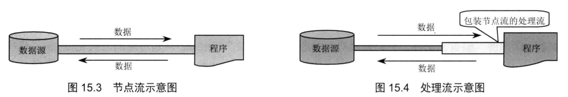

# IO流之一    主讲   `程工`

# 1.  IO流概述

## 1.1 概述

- Java 的 IO流是实现输入/输出的基础，它可以方便地实现数据的输入/输出操作，在 Java 中把不同的输入/输出源(键盘、文件、网络连接等)抽象表述为"流" (stream ) ， 通过流的方式允许 Java 程序使用相同的方式来访问不同的输入/输出源 。 Stream 是从起源 (source) 到接收（sink）的有序数据 。Java 把所有传统的流类型(类或抽象类)都放在 java.io 包中，用以实现输入/输出功能 。

  

## 1.2 分类

- 按照不同的分类方式，可以将流分为不同的类型，下面从不同的角度来对流进行分类，它们在概念上可能存在重叠的地方 。

### 1.2.1 输入流和输出流

- 按照流的流向来分 ， 可以分为输入流和输出流 
  - 输入流 : 只能从中读取数据，而不能向其写入数据
  - 输出流 : 只能向其写入数据，而不能从中读取数据

- **举例**

  - 数据从内存到硬盘，通常称为输出流一一也就是说，这里的输入、输出都是从程序运行所在内存的角度来划分的 。

    

  - Server端的内存负责将数据输出到网络里，因此Server端的程序使用输出流 ; Client 端的内存负 责从网络里读取数据，因此 C1ient 端的程序应该使用输入流 。

    

### 1.2.2 字节流和字符流

- 字节流和字符流的用法几乎完全一样，区别在于字节流和字符流所操作的数据单元不同字节流操作的数据单元是 8 位的字节，而字符流操作的数据单元是16位的字符。字节流主要由 InputStream 和 OutputStream作为基类 ， 而字符流则主要由 Reader 和 Writer作为基类 。

### 1.2.3 节点流和处理流

- 按照流的角色来分，可以分为节点流和处理流 。

- 可以从/向 一个特定的I/O设备(如磁盘、网络)读/写数据的流，称为节点流，节点流也被称为低级流 (Low Level Stream ) 

- 处理流则用于对一个己存在的流进行连接或封装，通过封装后的流来实现数据读/写功能 。 处理流也被称为高级流 。

  

# 2、输入/输出流体系

- Java 的输入/输出流体系提供了近 40 个类，这些类看上去杂乱而没有规律，但如果将其按功能进行分类，则不难发现其是非常规律的 。表15.1显示了Java输入/输出流体系中常用的流分类。

# 3. 字节流

## 3.1  一切皆为字节

- 一切文件数据(文本、图片、视频等)在存储时，都是以二进制数字的形式保存，都一个一个的字节，那么传输时一样如此。所以，字节流可以传输任意文件数据。在操作流的时候，我们要时刻明确，无论使用什么样的流对象，底层传输的始终为二进制数据。

## 3.2 OutputStream类

- `java.io.OutputStream `抽象类是表示字节输出流的所有类的超类，将指定的字节信息写出到目的地。它定义了字节输出流的基本共性功能方法。
  - `public void close()` ：关闭此输出流并释放与此流相关联的任何系统资源。  
  - `public void flush() ` ：刷新此输出流并强制任何缓冲的输出字节被写出。  
  - `public void write(byte[] b)`：将 b.length字节从指定的字节数组写入此输出流。  
  - `public void write(byte[] b, int off, int len)` ：从指定的字节数组写入 len字节，从偏移量 off开始输出到此输出流。  
  - `public abstract void write(int b)` ：将指定的字节输出流。

## 3.3 FileOutputStream类用法

### 3.3.1 特点

- 输出流
  - 将内存的数据写到文件

- 字节流
  - 它是以字节为位置写数据

- 节点流
  - 直接面向就是文件操作

### 3.3.2 FileOutputStream核心方法

- 构造器

  - 当你创建一个流对象时，必须传入一个文件路径。该路径下，如果没有这个文件，会创建该文件。如果有这个文件，会清空这个文件的数据。

  

- FileOutputStream的核心方法

- write(int b)

  - 写入字节

  ~~~ java
  package FileOutputStream用法;
  
  import java.io.File;
  import java.io.FileNotFoundException;
  import java.io.FileOutputStream;
  import java.io.IOException;
  
  public class MainTest {
  
  	public static void main(String[] args) {
  		
  		//通过File对象描述文件
  		File file=new File("D:\\filetest\\file2.txt");
  		//创建FileOutputStream对象
  		FileOutputStream fileOutputStream=null;
  		try
  		{
  			fileOutputStream=new FileOutputStream(file);
  			fileOutputStream.write(97);
  			fileOutputStream.write(98);
  			fileOutputStream.write(99);
  			fileOutputStream.write(100);
  			
  		}catch(FileNotFoundException e)
  		{
  			//输出异常的堆栈信息
  			e.printStackTrace();
  		} catch (IOException e) {
  			// TODO Auto-generated catch block
  			e.printStackTrace();
  		}finally {
  			
  			try {
  				//关闭输出流，释放资源
  				fileOutputStream.close();
  			} catch (IOException e) {
  				// TODO Auto-generated catch block
  				e.printStackTrace();
  			}
  			
  		}
  		
  
  	}
  
  }
  
  ~~~

- write(byte [] buf)

  - 写入字节数组

  - 举例

    ~~~ java
    package FileOutputStream用法;
    
    import java.io.File;
    import java.io.FileNotFoundException;
    import java.io.FileOutputStream;
    import java.io.IOException;
    
    public class MainTest2 {
    
    	public static void main(String[] args) {
    
    		// 通过File对象描述文件
    		File file = new File("D:\\filetest\\file3.txt");
    		// 创建FileOutputStream对象
    		FileOutputStream fileOutputStream = null;
    		try {
    			fileOutputStream = new FileOutputStream(file);
    			
    			String content="weclome to gec,I love java";
    			//将字符串转换成字节数组
    			byte []buf=content.getBytes();
    			fileOutputStream.write(buf);
    			//刷新
    			fileOutputStream.flush();
    
    		} catch (FileNotFoundException e) {
    			// 输出异常的堆栈信息
    			e.printStackTrace();
    		} catch (IOException e) {
    			// TODO Auto-generated catch block
    			e.printStackTrace();
    		} finally {
    
    			try {
    				// 关闭输出流，释放资源
    				fileOutputStream.close();
    			} catch (IOException e) {
    				// TODO Auto-generated catch block
    				e.printStackTrace();
    			}
    
    		}
    	}
    }
    
    ~~~

## 3.4 分析FileInputStream类

### 3.4.1 此IO流所属的分类

- 输入流
  - 将数据读取到内存
- 字节流
  - 以字节单元读数据
- 节点流
  - 直接对接文件

### 3.4.2 核心方法

- 构造器

  - 当你创建一个流对象时，必须传入一个文件路径。该路径下，如果没有该文件,会抛出`FileNotFoundException` 。

  

- 方法

  

### 3.4.3 具体用法

- 从文件读取内容到内存

  - read()

    - 读取一个字节，返回值就是读到的数据值，如果读取的数据值等于-1，则读取到文件末尾

      ~~~ java
      package FileInputStream用法;
      
      import java.io.File;
      import java.io.FileInputStream;
      import java.io.FileNotFoundException;
      import java.io.IOException;
      
      public class MainTest {
      
      	public static void main(String[] args) {
      		
      		//创建File对象
      		//File对象描述一个文件
      		File file=new File("D:\\filetest\\file1.txt");
      		
      		try
      		{
      			//新建一个FileInputStream对象
      			FileInputStream fileInputStream=new FileInputStream(file);
      			int c1=fileInputStream.read();
      			System.out.println((char)c1);
      			int c2=fileInputStream.read();
      			System.out.println((char)c2);
      			int c3=fileInputStream.read();
      			System.out.println((char)c3);
      			int c4=fileInputStream.read();
      			System.out.println((char)c4);
      			
      		}catch(FileNotFoundException e)
      		{
      			//输出堆栈信息
      			e.printStackTrace();
      		}catch(IOException e)
      		{
      			e.printStackTrace();
      		}
      
      	}
      
      }
      
      ~~~

  - read(buf)

    - 实现从文件读取内容到内存

    ~~~ java
    package FileInputStream用法;
    
    import java.io.File;
    import java.io.FileInputStream;
    import java.io.FileNotFoundException;
    import java.io.IOException;
    
    public class MainTest2 {
    
    	public static void main(String[] args) {
    
    		// 创建File对象
    		// File对象描述一个文件
    		File file = new File("file1.txt");
    		try {
    			file.createNewFile();
    		} catch (IOException e1) {
    			// TODO Auto-generated catch block
    			e1.printStackTrace();
    		}
    		FileInputStream fileInputStream=null;
    		try
    		{
    			//新建一个FileInputStream对象
    			fileInputStream=new FileInputStream(file);
    			//新建一个字节数组
    			byte []buf=new byte[32];
    			//read(buf)：此方法的返回值就是当前读取的字节个数，将数据读取到buf数组
    			//将readLen变量也就是read方法的返回值，当此变量等于-1，则读到文件末尾
    			int readLen=-1;
    			while((readLen=fileInputStream.read(buf))!=-1)
    			{
    				buf=new byte[32];
    				//将字节数组转换成字符串
    				String content=new String(buf,0,readLen);
    				System.out.print(content);
    			}
    			
    		}catch(FileNotFoundException e)
    		{
    			//输出堆栈信息
    			e.printStackTrace();
    		}catch(IOException e)
    		{
    			e.printStackTrace();
    		}finally {
    			
    			try {
    				//文件输入流关闭（释放资源）
    				fileInputStream.close();
    			} catch (IOException e) {
    				// TODO Auto-generated catchblock
    				e.printStackTrace();
    			}
    			
    		}
    
    	}
    
    }
    
    ~~~

# 4. 字符流

## 4.1 FileReader用法

### 4.1.1 所属的IO流分类

- 输入流
  - 从文件读取数据到内存
- 字符流
  - 以字符为传输数据单元

- 节点流
  - 直接面向文件操作

### 4.1.2 主要方法

### 4.1.3 举例

- 读取文件内容

  ~~~ java
  package FileReader用法;
  
  import java.io.File;
  import java.io.FileNotFoundException;
  import java.io.FileReader;
  import java.io.IOException;
  
  public class MainTest {
  
  	public static void main(String[] args) {
  		
  		//以File对象描述file5.txt
  		File file=new File("D:\\filetest\\file5.txt");
  		//构造FileReader对象
  		FileReader reader=null;
  		try
  		{
  			reader=new FileReader(file);
  			//定义字符数组
  			char []cbuf=new char[16];
  			//定义读取字符的长度
  			int readLen=-1;
  			//不断将数据读到字符数组，read方法的返回值就是读到的字符个数，直到readLen等于-1，则意味
  			//读取文件的末尾，然后跳出循环
  			while((readLen=reader.read(cbuf))!=-1)
  			{
  				System.out.print(new String(cbuf,0,readLen));
  			}
  			
  		}catch(FileNotFoundException e)
  		{
  			e.printStackTrace();
  		} catch (IOException e) {
  			// TODO Auto-generated catch block
  			e.printStackTrace();
  		}finally {
  			
  			if(reader!=null)
  			{
  				try {
  					reader.close();
  				} catch (IOException e) {
  					// TODO Auto-generated catch block
  					e.printStackTrace();
  				}
  			}
  		}
  	}
  }
  
  ~~~

## 4.2 FileWriter用法

### 4.2.1 所属的IO流分类

- 输出流
  - 将内存的数据写到文件
- 字符流
  -  以字符为数据单元来传输数据
- 节点流
  - 直接面向文件操作

### 4.2.2 主要方法

### 4.2.3 举例

~~~ java
package FileWriter用法;

import java.io.File;
import java.io.FileWriter;
import java.io.IOException;

public class MainTest {

	public static void main(String[] args) throws IOException {
		
		//创建文件
		File file=new File("file2.txt");
		FileWriter fw=new FileWriter(file);
		
		String message="我来自广州";
		fw.write(message);
		
		/*String message="java,hello world";
		fw.write(message);*/
		
		/*fw.write(0+48);
		fw.write(1+48);
		char cbuf[]= {'a','b'};
		fw.write(cbuf);*/
		fw.flush();
		fw.close();
	}

}

~~~

#### 关闭和刷新

因为内置缓冲区的原因，如果不关闭输出流，无法写出字符到文件中。但是关闭的流对象，是无法继续写出数据的。如果我们既想写出数据，又想继续使用流，就需要`flush` 方法了。

- `flush` ：刷新缓冲区，流对象可以继续使用。

- `close `:先刷新缓冲区，然后通知系统释放资源。流对象不可以再被使用了。

  ~~~ java
  public class FWWrite {
      public static void main(String[] args) throws IOException {
          // 使用文件名称创建流对象
          FileWriter fw = new FileWriter("fw.txt");
          // 写出数据，通过flush
          fw.write('刷'); // 写出第1个字符
          fw.flush();
          fw.write('新'); // 继续写出第2个字符，写出成功
          fw.flush();
        
        	// 写出数据，通过close
          fw.write('关'); // 写出第1个字符
          fw.close();
          fw.write('闭'); // 继续写出第2个字符,【报错】java.io.IOException: Stream closed
          fw.close();
      }
  }
  ~~~

# 5、转换流

## 5.1 简介

- 转换流
  - 将字节流----》字符流

## 5.2 InputStreamReader类作用

- 输入流

  - 能够将字节输入流的内容以字符的形式读取内存

    

- 举例

  - 将FileInputStream（文件字节输入流-----》字符输入流）

  ~~~ java
  package InputStreamReader用法;
  
  import java.io.File;
  import java.io.FileInputStream;
  import java.io.IOException;
  import java.io.InputStreamReader;
  
  public class MainTest {
  
  	public static void main(String[] args) throws IOException {
  		
  		File file=new File("file2.txt");
  		//以文件输入字节流读取文件
  		FileInputStream fileInputStream=new FileInputStream(file);
  		//通过转换流将输入字节流----》输入字符流
  		InputStreamReader reader=new InputStreamReader(fileInputStream);
  		
  		char []cbuf=new char[32];
  		int len=reader.read(cbuf);
  
  		//创建一个字符串对象
  		String content=new String(cbuf,0,len);
  		System.out.println(content);
  	}
  }
  ~~~

## 5.3、OutputStreamWriter用法

- 所属的IO流的分类

  - 输出流
  - 字符流
  - 处理流

- 作用

  - 将字节输出流转换成字符输出流

  举例

  ~~~ java
  package OutputStreamWriter用法;
  
  import java.io.File;
  import java.io.FileOutputStream;
  import java.io.IOException;
  import java.io.OutputStreamWriter;
  
  public class MainTest {
  
  	public static void main(String[] args) throws IOException {
  
  		File file = new File("file3.txt");
  		FileOutputStream fileOutputStream = new FileOutputStream(file);
  		
  		//将输出字节流---->输出字符流
  		//将数据以字符方式写到文件里面
  		OutputStreamWriter writer=new OutputStreamWriter(fileOutputStream);
  		writer.write("欢迎来到粤嵌，学习java");
  		writer.flush();
  		writer.close();
  		fileOutputStream.close();
  	}
  
  }
  
  ~~~

