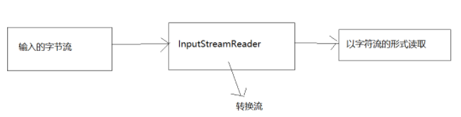
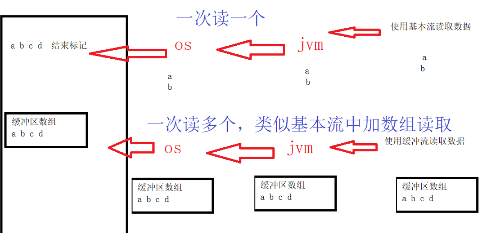
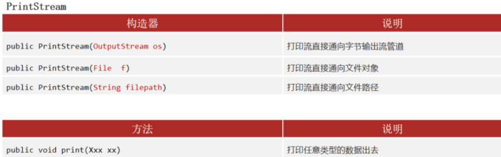
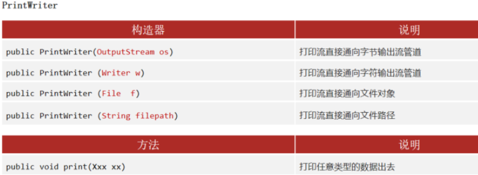
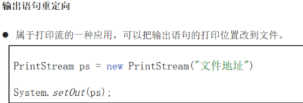

# IO流用法二

# 1. 转换流

## 1.1 概述

- 输入/输出流体系中还提供了两个转换流，这两个转换流用于实现将字节流转换成字符流 ， 其中
  InputStreamReader将字节输入流转换成字符输入流。OutputStreamWriter 将字节输出流转换成字符输出流。

## 1.2 InputStreamReader类

### 1.2.1 简介

- InputStreamReader:是字节流通向字符流的桥梁：他使用指定的charset读取字节并将其解码为字符



### 1.2.2 核心方法

- **继承自父类的共性成员方法**：
  - int read() 读取单个字符并返回
  - int read(char[] cbuf) 一次读取多个字符，经字符读入数组中
  - void close() 关闭该流并释放与之关联的所有资源

- **构造方法**

  - InputStreamReader(InputStream in) 创建一个使用默认字符集的InputStreamReader

  - InputStreamReader(InouStream in,String charsetName) 创建使用指定字符集的 InputStreamReader

    ~~~ 
    参数：
    InputStream in:字节输入流，用来读取文件中保存的字节
    String charsetName:指定的编码表名称，不区分大小写，可以是utf-8/UTF-8,gbk/GBK,...不指定默认使用UTF-8
    ~~~

### 1.2.3 使用步骤

- 1.创建InputStreamReader对象，构造方法中传递字节输入流和指定的编码表名称

- 2.使用InputStreamReader对象中的方法read读取文件

- 3.释放资源。

  **注意事项**:

  ~~~ 
  构造方法中指定的编码表名称要和文件的编码相同，否则会发生乱码
  ~~~

### 1.2.4 实例

~~~ java
public class Demo03InputStreamReader {
    public static void main(String[] args) throws IOException {
       // read_utf_8();
       read_gbk();
    }

    /*
        使用InputStreamReader读取GBK格式的文件
    */
    private static void read_gbk() throws IOException {
        //1.创建InputStreamReader对象，构造方法中传递字节输入流和指定的编码表名称
        InputStreamReader isr = new InputStreamReader(new FileInputStream("day10_IO\\gbk.txt"),"GBK");
        //2.使用InputStreamReader对象中的方法read读取文件
        int len = 0;
        while((len = isr.read()) != -1){
            System.out.println((char)len);
        }
        //3.释放资源。
        isr.close();
    }

    /*
        使用InputStreamReader读取UTF-8格式的文件
    */
    private static void read_utf_8() throws IOException {
        //1.创建InputStreamReader对象，构造方法中传递字节输入流和指定的编码表名称
        InputStreamReader isr = new InputStreamReader(new FileInputStream("day10_IO\\utf_8.txt"),"UTF-8");
        //2.使用InputStreamReader对象中的方法read读取文件
        int len = 0;
        while((len = isr.read()) != -1){
            System.out.println((char)len);
        }
        //3.释放资源。
        isr.close();
    }
}


~~~

## 1.3 OutputStreamWriter类

### 1.3.1 简介

- 转换流 java.io.OutputStreamWriter，是Writer的子类，是从字符流到字节流的桥梁。它使用指定的字符集将字符编码为字节。它的字符集可以由名称指定，也可以接受平台的默认字符集。

### 1.3.2 核心方法

**继承父类的共性成员方法**

- void write(int c) 写入单个字符。
- void write(char[] cbuf)写入字符数组。
- abstract  void write(char[] cbuf, int off, int len)写入字符数组的某一部分,off数组的开始索引,len写的字符个数。
- void write(String str)写入字符串。
- void write(String str, int off, int len) 写入字符串的某一部分,off字符串的开始索引,len写的字符个数。
- void flush()刷新该流的缓冲。
- void close() 关闭此流，但要先刷新它。　

**构造方法**

- OutputStreamWriter(OutputStream out)创建使用默认字符编码的 OutputStreamWriter。

- OutputStreamWriter(OutputStream out, String charsetName) 创建使用指定字符集的 OutputStreamWriter。

  ~~~ 
  参数：
  OutputStream out：字节输出流,可以用来写转换之后的字节到文件中
  String charsetName：指定的编码表名称,不区分大小写,可以是utf-8/UTF-8,gbk/GBK,...不指定默认使用UTF-8
  ~~~

### 1.3.3 使用步骤

- 创建OutputStreamWriter对象,构造方法中传递字节输出流和指定的编码表名称
- 使用OutputStreamWriter对象中的方法write,把字符转换为字节存储缓冲区中(编码)
- 使用OutputStreamWriter对象中的方法flush,把内存缓冲区中的字节刷新到文件中(使用字节流写字节的过程)
- 释放资源

### 1.3.4 代码

~~~ java
        //1.创建OutputStreamWriter对象,构造方法中传递字节输出流和指定的编码表名称
        //OutputStreamWriter osw = new OutputStreamWriter(new FileOutputStream("E:\\utf_8.txt"),"utf-8");
        OutputStreamWriter osw = new OutputStreamWriter(new FileOutputStream("E:\\utf_8.txt"));//不指定默认使用UTF-8
        //2.使用OutputStreamWriter对象中的方法write,把字符转换为字节存储缓冲区中(编码)
        osw.write("你好");
        //3.使用OutputStreamWriter对象中的方法flush,把内存缓冲区中的字节刷新到文件中(使用字节流写字节的过程)
        osw.flush();
        //4.释放资源
        osw.close();
~~~

# 2. 缓冲流

## 2.1 概述

- 文件字节流（FileInputStream、FileOutputStream）和文件字符流（FileReader、FileWriter）这些都是计算机与硬盘之间发生的I/O操作，基于硬盘的读写相对比较慢，读写操作收到了硬盘读取速度的限制。为了能够提高读写速度，一定程度上绕过硬盘的限制，Java提供了一种缓冲流来实现。缓冲字节流（BufferedInputStream、BufferedOutputStream）和缓冲字符流（BufferedReader、BufferedWriter）就是先把数据缓冲在内存里，在内存中去做IO操作。基于内存的IO操作比基于硬盘的IO操作快很多。

## 2.2 缓冲流原理

- 一个京东的快递小哥，开始器自行车送快递，一趟只能送一个，但是后来好老板刘强东看他们太幸苦了，给他们配备了一辆五菱宏光，一次可以送好几十个，这就大大提高了效率



## 2.3 缓冲流分类

因为是对4个基本的`FileXxx` 流的增强，所以也是4个流，按照数据类型分类：

- **字节缓冲流**：`BufferedInputStream`，`BufferedOutputStream`
- **字符缓冲流**：`BufferedReader`，`BufferedWriter`

## 2.4 BufferedOutputStream流

### 2.4.1 概述

-  字节缓冲输出流

### 2.4.2 核心方法

**继承自父类的共性成员方法**

- `public void close()` ：关闭此输出流并释放与此流相关联的任何系统资源。
- `public void flush()` ：刷新此输出流并强制任何缓冲的输出字节被写出。
- `public void write(byte[] b)`：将 `b.length` 字节从指定的字节数组写入此输出流。
- `public void write(byte[] b, int off, int len)` ：从指定的字节数组写入 `len` 字节，从偏移量 off开始输出到此输出流。
- `public abstract void write(int b)` ：将指定的字节输出流。

**构造方法**

- `BufferedOutputStream(OutputStream out)` 创建一个新的缓冲输出流，以将数据写入指定的底层输出流。
- `BufferedOutputStream(OutputStream out, int size)` 创建一个新的缓冲输出流，以将具有指定缓冲区大小的数据写入指定的底层输出流。

~~~ 
参数:
OutputStream out ：字节输出流
     我们可以传递FileOutputStream，缓冲流会给FileOutputStream增加一个缓冲区，提高 FileOutputStream 的写入效率
int size ：指定缓冲流内部缓冲区的大小，不指定默认
~~~

### 2.4.3 使用步骤

1. 创建 `FileOutputStream` 对象，构造方法中绑定要输出的目的地
2. 创建 `BufferedOutputStream` 对象，构造方法中传递 `FileOutputStream` 对象对象，提高`FileOutputStream` 对象效率
3. 使用 `BufferedOutputStream` 对象中的方法 `write` ，把数据写入到内部缓冲区中
4. 使用 `BufferedOutputStream` 对象中的方法 `flush` ，把内部缓冲区中的数据，刷新到文件中
5. 释放资源(会先调用 `flush` 方法刷新数据，故第4步可以省略)

### 2.4.4 代码

~~~ java
package com.gec.OutputStreamWriter用法;

import java.io.BufferedOutputStream;
import java.io.FileOutputStream;
import java.io.IOException;

public class MainTest {

    public static void main(String[] args) throws IOException {

        FileOutputStream fos = new FileOutputStream("test1.txt");
        BufferedOutputStream bos = new BufferedOutputStream(fos);

        bos.write("aaaa".getBytes());

        bos.flush();
        bos.close();
    }
}

~~~

## 2.5 BufferedInputStream

### 2.5.1 概述

- 字节缓冲输入流

### 2.5.2 核心方法

**继承自父类的成员方法**

- `public int read()` ：从输入流中读取数据的下一个字节。
- `public int read(byte[] b)`：从输入流中读取一定数量的字节，并将其存储在缓冲区数组 b 中。
- `public void close()` ：关闭此输入流并释放与该流关联的所有系统资源。

**构造方法**

- `BufferedInputStream(InputStream in)` 创建一个 `BufferedInputStream` 并保存其参数，即输入流 in，以便将来使用。

- `BufferedInputStream(InputStream in, int size)` 创建具有指定缓冲区大小的 `BufferedInputStream` 并保存其参数，即输入流 in，以便将来使用。

  ~~~ java
  参数:
  InputStream in：字节输入流
       我们可以传递 FileInputStream，缓冲流会给 FileInputStream 增加一个缓冲区，提高 FileInputStream 的读取效率
  int size：指定缓冲流内部缓冲区的大小，不指定默认
  ~~~

**使用步骤(重点)**

### 2.5.3 使用步骤

1. 创建 `FileInputStream` 对象，构造方法中绑定要读取的数据源
2. 创建 `BufferedInputStream` 对象，构造方法中传递 `FileInputStream` 对象，提高`FileInputStream` 对象的读取效率
3. 使用 `BufferedInputStream` 对象中的方法 `read`，读取文件
4. 释放资源

### 2.5.4 代码

~~~ java
public class Demo02BufferedInputStream {
      
    public static void main(String[] args) throws IOException {
      
     
        FileInputStream fis = new FileInputStream("10_IO\\a.txt");
        BufferedInputStream bis = new BufferedInputStream(fis);
         
        //int read()从输入流中读取数据的下一个字节。
        /*int len = 0;//记录每次读取到的字节 while((len = bis.read())!=-1){ System.out.println(len); }*/
 
        //int read(byte[] b) 从输入流中读取一定数量的字节，并将其存储在缓冲区数组 b 中。
        byte[] bytes =new byte[1024];//存储每次读取的数据
        int len = 0; //记录每次读取的有效字节个数
        while((len = bis.read(bytes))!=-1){
      
            System.out.println(new String(bytes,0,len));
        }
 
        bis.close();
    }
}
~~~

### 练习–效率测试

- 我们通过复制文件，测试它的效率

  ~~~ java
  public class Demo01CopyFile {
      
      public static void main(String[] args) {
      
          // 记录开始时间
          long s = System.currentTimeMillis();
          try (
                  //1.创建一个字节输入流对象,构造方法中绑定要读取的数据源
                  FileInputStream fis = new FileInputStream("D:\\1.zip");
                  //2.创建一个字节输出流对象,构造方法中绑定要写入的目的地
                  FileOutputStream fos = new FileOutputStream("E:\\1.zip")
          ) {
      
              //一次读取一个字节写入一个字节的方式
              //3.使用字节输入流对象中的方法read读取文件
             /* int len = 0; while ((len = fis.read()) != -1) { //4.使用字节输出流中的方法write,把读取到的字节写入到目的地的文件中 fos.write(len); }*/
   
              //使用数组缓冲读取多个字节,写入多个字节
              byte[] bytes = new byte[1024];
              //3.使用字节输入流对象中的方法read读取文件
              int len = 0;//每次读取的有效字节个数
              while ((len = fis.read(bytes)) != -1) {
      
                  //4.使用字节输出流中的方法write,把读取到的字节写入到目的地的文件中
                  fos.write(bytes, 0, len);
              }
          } catch (IOException e) {
      
              e.printStackTrace();
          }
          // 记录结束时间
          long e = System.currentTimeMillis();
          System.out.println("复制文件共耗时:" + (e - s) + "毫秒");
      }
  }
  ~~~

  ~~~ java
  public class Demo02CopyFile {
      
      public static void main(String[] args) throws IOException {
      
          // 记录开始时间
          long s = System.currentTimeMillis();
          try (
                  //1.创建字节缓冲输入流对象,构造方法中传递字节输入流
                  BufferedInputStream bis = new BufferedInputStream(new FileInputStream("D:\\1.zip"));
                  //2.创建字节缓冲输出流对象,构造方法中传递字节输出流
                  BufferedOutputStream bos = new BufferedOutputStream(new FileOutputStream("E:\\1.zip"));
          ) {
      
              //3.使用字节缓冲输入流对象中的方法read,读取文件
              //一次读取一个字节写入一个字节的方式
              /*int len = 0; while ((len = bis.read()) != -1) { bos.write(len); }*/
   
              //使用数组缓冲读取多个字节,写入多个字节
              byte[] bytes = new byte[1024];
              int len = 0;
              while ((len = bis.read(bytes)) != -1) {
      
                  bos.write(bytes, 0, len);
              }
   
          }
          // 记录开结束时间
          long e = System.currentTimeMillis();
          System.out.println("复制文件共耗时:" + (e - s) + "毫秒");
      }
  }
  ~~~

## 2.6 BufferedWriter

### 2.6.1 概述

-  字符缓冲输出流

### 2.6.2 核心方法

**继承自父类的共性成员方法** :

- `public void write(int c)` ：写入单个字符。
- `public void write(char[] cbuf)` ：写入字符数组。
- `public abstract void write(char[] cbuf, int off, int len)` ：写入字符数组的某一部分，off数组的开始索引，len写的字符个数。
- `public void write(String str)` ：写入字符串。
- `public void write(String str, int off, int len)` ：写入字符串的某一部分，`off` 字符串的开始索引，`len` 写的字符个数。
- `public void flush()` ：刷新该流的缓冲。
- `public void close()` ：关闭此流，但要先刷新它。

**构造方法** :

- `BufferedWriter(Writer out)` ：创建一个使用默认大小输出缓冲区的缓冲字符输出流。

- ```
  BufferedWriter(Writer out, int size)：创建一个使用给定大小输出缓冲区的新缓冲字符输出流。
  ```

  - 参数:
    `Writer out` ：字符输出流
      我们可以传递 `FileWriter` ，缓冲流会给 `FileWriter` 增加一个缓冲区，提高`FileWriter` 的写入效率
    `int size` ：指定缓冲区的大小，不写默认大小

**特有成员方法**：

`public void newLine()` : 写一行行分隔符，由系统属性定义符号。

换行：换行符号

  windows ：\r\n
  linux ：/n
  mac ：/r

### 2.6.3 使用步骤

1. 创建字符缓冲输出流对象，构造方法中传递字符输出流
2. 调用字符缓冲输出流中的方法 `write` ，把数据写入到内存缓冲区中
3. 调用字符缓冲输出流中的方法 `flush` ，把内存缓冲区中的数据，刷新到文件中

### 2.6.4 代码

~~~ java
public class Demo03BufferedWriter {
    
    public static void main(String[] args) throws IOException {
    
         
        BufferedWriter bw = new BufferedWriter(new FileWriter("10_IO\\c.txt"));
         
        for (int i = 0; i <10 ; i++) {
    
            bw.write("Java程序员");
            //bw.write("\r\n");
            bw.newLine();
        }
         
        bw.flush();
        bw.close();
    }
}
~~~

## 2.7 BufferedReader

### 2.7.1 概述

- 字符缓冲输入流

### 2.7.2 核心方法

**继承自父类的共性成员方法** :

- `public int read()` ：读取单个字符并返回。
- `public int read(char[] cbuf)` ：一次读取多个字符,将字符读入数组。
- `public void close()` ：关闭该流并释放与之关联的所有资源。

**构造方法** :

- `BufferedReader(Reader in)` ：创建一个使用默认大小输入缓冲区的缓冲字符输入流。

- `BufferedReader(Reader in, int size)` ：创建一个使用指定大小输入缓冲区的缓冲字符输入流。

  - 参数:
    `Reader in` ：字符输入流
      我们可以传递 `FileReader` ，缓冲流会给 `FileReader` 增加一个缓冲区，提高`FileReader` 的读取效率

    `int size` ：指定缓冲区的大小，不写默认大小

**特有成员方法** ：

`public String readLine()` ：读取一个文本行。读取一行数据

- 行的终止符号：

  通过下列字符之一即可认为某行已终止：换行 ( `\n` )、回车 ( `\r` ) 或回车后直接跟着换行 ( `\r\n` )。

- 返回值 :
  包含该行内容的字符串，不包含任何行终止符，如果已到达流末尾，则返回 null

### 2.7.3 使用步骤

1. 创建字符缓冲输入流对象，构造方法中传递字符输入流
2. 使用字符缓冲输入流对象中的方法 `read/readLine` 读取文本
3. 释放资源

### 2.7.4 代码

~~~ java
public class Demo04BufferedReader {
      
    public static void main(String[] args) throws IOException {
      
        
        BufferedReader br = new BufferedReader(new FileReader("10_IO\\c.txt"));
 
        String line;
        while((line = br.readLine())!=null){
      
            System.out.println(line);
        }
 
        br.close();
    }
}
~~~

# 3. 打印流

## 3.1 概述 

-  作用：打印流可以实现方便、高效的打印数据到文件中去。打印流一般是指：PrintStream，PrintWriter两个类。可以实现打印什么数据就是什么数据，例如打印整数97写出去就是97，打印boolean的true，写出去就是true。

## 3.2 PrintStream类

### 3.2.1 核心方法



## 3.3 PrintWriter类

### 3.2.2 核心方法



- 用法

  ~~~ java
  package PrintWriter实例;
  
  import java.io.File;
  import java.io.FileWriter;
  import java.io.IOException;
  import java.io.PrintWriter;
  
  public class MainTest {
  
  	public static void main(String[] args) throws IOException {
  		
  		FileWriter fileWriter=new FileWriter(new File("c.txt"));
  		PrintWriter pw=new PrintWriter(fileWriter);
  		pw.println("helloworld1");
  		pw.println("helloworld2");
  		pw.println("helloworld3");
  		pw.println("helloworld4");
  		//刷新一下
  		pw.flush();
  		
  
  	}
  
  }
  
  ~~~

  

## 3.4 PrintStream和PrintWriter的区别

1.打印数据功能上是一模一样的，都是使用方便，性能高效（核心优势）。

2.PrintStream继承自字节输出流OutputStream，支持写字节数据的方法。

3.PrintWriter继承字符输出流Writer，支持写字符数据出去。

## 3.5 重定向

### 3.5.1 重定向概念

- 有两种重写向输出
  - 标准输出
    - 默认的标准输出设备：控制台
  - 标准错误输出
    - 默认的标准输出设备：控制台（以红色字体方式输出）
- 标准输入
  - 默认的设备：键盘
- 上述重定向输入、输出都可以使用System类来描述

  - System.in
    - 描述标准输入（默认：键盘）
  - System.out
    - 描述标准输出（默认控制台）
  - System.err
    - 描述标准错误输出（默认控制台，以红色字体输出）

### 3.5.2 重定向用法




~~~ java
package PrintStream实例;

import java.io.File;
import java.io.FileNotFoundException;
import java.io.FileOutputStream;
import java.io.IOException;
import java.io.PrintStream;

public class MainTest {

	public static void main(String[] args) throws IOException {
		
/*		System.out.println("hello world");
		System.err.println("java hello");*/
		//调用PrintStream的打印流将helloworld输出到控制器
		//重定向输出
		/*
		 * 标准输出:System.out配置
		 * 标准错误输出:System.err配置
		 * */
		/*
		 * 修改重定向设备：
		 * 	标准输出到a.txt
		 *  标准错误输出：b.txt
		 * 
		 */
		PrintStream consolePs=System.out;
		//创建一个PrintStream打印类，针对文件输出流进行打印写入操作
		FileOutputStream aFileOutptStream=new FileOutputStream(new File("a.txt"));
		PrintStream ps=new PrintStream(aFileOutptStream);
/*		ps.println("helloworld 1");
		ps.println("helloworld 2");
		ps.println("helloworld 3");*/
		
		ps.write(97);
		
		
		//创建一个PrintStream打印类，针对标准错误输出信息打印到b.txt
		/*FileOutputStream bFileOutptStream=new FileOutputStream(new File("b.txt"));
		PrintStream errorPs=new PrintStream(bFileOutptStream);
		
		//更改标准输出设备：从控制台---->a.txt文件
		System.setOut(ps);
		//更改标准错误输出设备：从控制台----->b.txt
		System.setErr(errorPs);
		
		System.out.println("helloworld");
		System.out.println("helloworld2");
		System.out.println("helloworld3");
		
		//还原默认的标准输出
		System.setOut(consolePs);
		
		System.out.println("helloworld4");
		System.out.println("helloworld5");
		System.out.println("helloworld6");
		
		//输出标准错误信息
		System.err.println("error helloworld 1");
		System.err.println("error helloworld 2");
		System.err.println("error helloworld 3");
		System.err.println("error helloworld 4");*/
		/*
		ps.println("helloworld");
		ps.println("aaaaaa");
		ps.println("bbbbb");
		ps.flush();
		ps.close();
		aFileOutptStream.close();
		*/

		

	}

}

~~~


