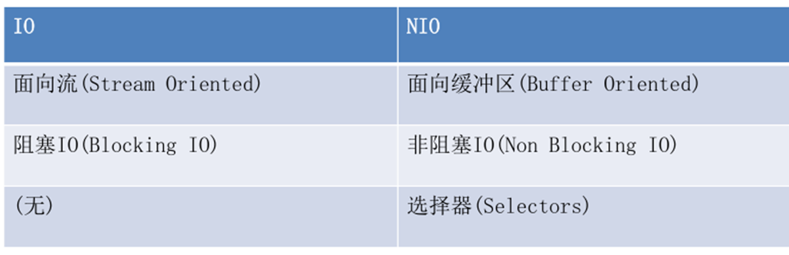
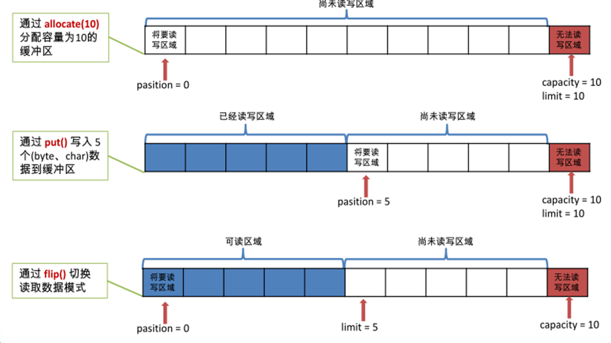
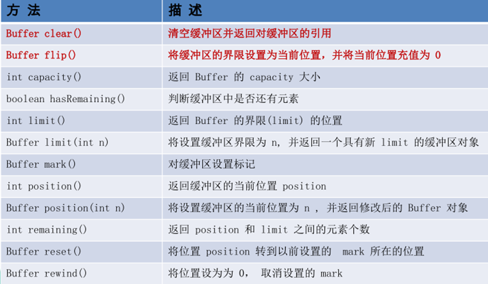
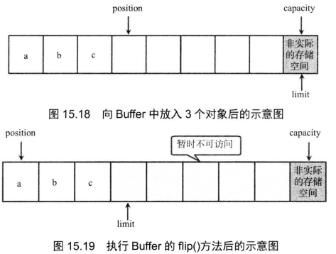
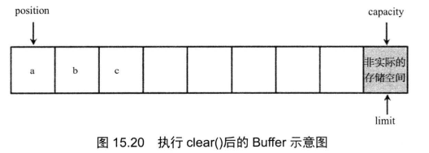
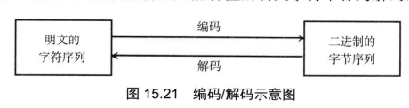
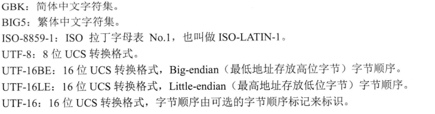
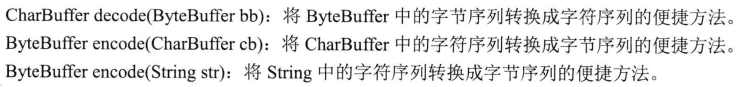

# IO流用法三

# 1. 对象序列化

## 1.1 概述

- 对象序列化的目标是将对象保存到磁盘中，或允许在网络中直接传输对象 。 对象序列化机制允许把内存中的 Java 对象转换成平台无关的二进制流，从而允许把这种二进制流持久地保存在磁盘上，通过网络将这种二进制流传输到另 一个网络节点 。其他程序一旦获得了这种二进制流(无论是从磁盘中获取的，还是通过网络获取的) ，都可以将这种二进制流恢复成原来的 Java 对象 。

## 1.2 序列化的含义和意义

- 序列化机制允许将实现序列化的 Java 对象转换成字节序列，这些字节序列可以保存在磁盘上，或通过网络传输 ，以备以后重新恢复成原来的对象。序列化机制使得对象可以脱离程序的运行而独立存在 。  

## 1.3 反列化含义

- 。其他程序一旦获得了这种二进制流(无论是从磁盘中获取的，还是通过网络获取的) ，都可以将这种二进制流恢复成原来的 Java 对象 。

## 1.4 实现序列化接口

### Serializable

- Java 的很多类己经实现了 Serializable ，该接口是一个标记接口，实现该接口无须实现任何方法，它 只是表明该类的实例是可序列化的 。

### Extemalizable

## 1.5 使用对象流实现序列化

- 创建一个ObjectOutputStream，这个输出流是一个处理流，所以必须建立在其他节点流的基础之上。

  ~~~ java
  ObjectOutputStream oos = new ObjectOutputStream(new FileOutputStream("object.txt")))
  ~~~

- 调用 ObjectOutputStream 对象的 writeObject方法输出可序列化对象 。

  ~~~ java
  Person per = new Person("孙悟空", 500);
  // 将per对象写入输出流
  oos.writeObject(per);
  ~~~

- 下面程序定义了 一个 Person 类，这个 Person 类就是一个普通的 Java 类，只是实现了 Serializable接口，该接口标识该类的对象是可序列化的 。  

  ~~~ java
  
  public class Person
  	implements java.io.Serializable
  {
  	private String name;
  	private int age;
  	// 注意此处没有提供无参数的构造器!
  	public Person(String name , int age)
  	{
  		System.out.println("有参数的构造器");
  		this.name = name;
  		this.age = age;
  	}
  	// 省略name与age的setter和getter方法
  
  	// name的setter和getter方法
  	public void setName(String name)
  	{
  		this.name = name;
  	}
  	public String getName()
  	{
  		return this.name;
  	}
  
  	// age的setter和getter方法
  	public void setAge(int age)
  	{
  		this.age = age;
  	}
  	public int getAge()
  	{
  		return this.age;
  	}
  }
  ~~~

## 1.6 使用对象流实现反序列化

### 1.6.1 概述

- 从磁盘序列文件恢复对象状态

### 1.6.2 代码实现

~~~ java
package com.gec.序列化处理;

import java.io.FileInputStream;
import java.io.ObjectInputStream;

public class ReadObject {

    public static void main(String[] args) {

        try (
            // 创建一个ObjectInputStream输入流
            ObjectInputStream ois = new ObjectInputStream(new FileInputStream("object.txt"))) {
            // 从输入流中读取一个Java对象，并将其强制类型转换为Person类
            Person p = (Person) ois.readObject();
            System.out.println("名字为：" + p.getName()
                    + "\n年龄为：" + p.getAge());
        } catch (Exception ex) {
            ex.printStackTrace();
        }
    }
}

~~~

## 1.7 transient关键字

### 1.7.1 概述

- 在一些特殊的场景下，如果一个类里包含的某些实例变量是敏感信息，例如银行账户信息等，这时不希望系统将该实例变量值进行序列化 ;或者某个实例变量的类型是不可序列化的。通过在实例变量前面使用 transient关键字修饰，可以指定 Java序列化时无须理会该实例变量 。

### 1.7.2 特点

- transient只能修饰成员变量
- 指定 Java序列化时无须理会该实例变量 

### 1.7.3 用法

- 由于本程序中的 Person 类的 age实例变量使用 transient 关键宇修饰，所以反序列后无法获取age值，输出结果为 0 。  

#### 定义Person类

~~~ java

public class Person
	implements java.io.Serializable
{
	private String name;
	private transient int age;
	// 注意此处没有提供无参数的构造器!
	public Person(String name , int age)
	{
		System.out.println("有参数的构造器");
		this.name = name;
		this.age = age;
	}
	// 省略name与age的setter和getter方法

	// name的setter和getter方法
	public void setName(String name)
	{
		this.name = name;
	}
	public String getName()
	{
		return this.name;
	}

	// age的setter和getter方法
	public void setAge(int age)
	{
		this.age = age;
	}
	public int getAge()
	{
		return this.age;
	}
}
~~~

#### 编写序列处理类

~~~ java
package com.gec.transient用法;

import java.io.FileInputStream;
import java.io.FileOutputStream;
import java.io.ObjectInputStream;
import java.io.ObjectOutputStream;

public class TransientTest {

    public static void main(String[] args) {
        try(
                // 创建一个ObjectOutputStream输出流
                ObjectOutputStream oos = new ObjectOutputStream(
                        new FileOutputStream("transient.txt"));
                // 创建一个ObjectInputStream输入流
                ObjectInputStream ois = new ObjectInputStream(
                        new FileInputStream("transient.txt")))
        {
            Person per = new Person("孙悟空", 500);
            // 系统会per对象转换字节序列并输出
            oos.writeObject(per);
            Person p = (Person)ois.readObject();
            System.out.println(p.getAge());
        }
        catch (Exception ex)
        {
            ex.printStackTrace();
        }
    }
}

~~~

## 1.8 自定义序列化

### 1.8.1 概述

- 程序员可以完全获得对序列化机制的控制 ，可以自主决定哪些实例变量需要序列化 ，需要怎样序列化 。   
- 程序员可以完全获得对反序列化机制的控制，可以自主决定需要反序列化哪些实例变量，以及如何进行反序列化 。

### 1.8.2 重写方法

- private void writeObject(java.io.ObjectOutputStream out)throws IOException

  ~~~ 
  writeObject方法负责写入特定类的实例状态，以便相应的readObject方法可以恢复它 。 通过重写
  该方法，程序员可以完全获得对序列化机制的控制 ，可以自主决定哪些实例变量需要序列化，需要怎样序列化。
  ~~~

- private void readObject(java.io.ObjectInputStream in)throws IOException, ClassNotFoundExccption;

  ~~~ 
  readObject方法负责从流中读取并恢复对象实例变量 ，通过重写该方法，程序员可以完全获得对反序列化机制的控制，可以自主决定需要反序列化哪些实例变量 ，以及如何进行反序列化 。 
  ~~~

### 1.8.3 用法

~~~ java
package com.gec.自定义序列化;

import java.io.IOException;

public class Person implements java.io.Serializable
{
    private String name;
    private int age;
    // 注意此处没有提供无参数的构造器!
    public Person(String name , int age)
    {
        System.out.println("有参数的构造器");
        this.name = name;
        this.age = age;
    }
    // 省略name与age的setter和getter方法

    // name的setter和getter方法
    public void setName(String name)
    {
        this.name = name;
    }
    public String getName()
    {
        return this.name;
    }

    // age的setter和getter方法
    public void setAge(int age)
    {
        this.age = age;
    }
    public int getAge()
    {
        return this.age;
    }

    private void writeObject(java.io.ObjectOutputStream out)
            throws IOException
    {
        // 将name实例变量的值反转后写入二进制流
        out.writeObject(new StringBuffer(name).reverse());
        out.writeInt(age);
    }
    private void readObject(java.io.ObjectInputStream in)
            throws IOException, ClassNotFoundException
    {
        // 将读取的字符串反转后赋给name实例变量
        this.name = ((StringBuffer)in.readObject()).reverse()
                .toString();
        this.age = in.readInt();
    }
}

~~~

# 2. NIO

## 2.1 概述

- 当 BufferedReader 读取输入流中的数据时，如果没有读到有效数据，程序将在此处阻塞该线程的执行(使用 InputStream 的 read（）方法从流中读取数据时，如果数据源中没有数据，它也会阻塞该线程) ，也就是前面介绍的输入流、输出流都是阻塞式的输入、输出 。 不仅如此，传统的输入流、输出流都是通过字节的移动来处理的(即使不直接去处理字节流 ，但底层的实现还是依赖于字节处理) ，也就是说，面向流的输入/输出系统一次只能处理一个字节，因此面向流的输入/输出系统通常效率不高。  

## 2.2 什么是NIO

- Java NIO（New IO）是从Java 1.4版本开始引入的一个新的IO API，可以替代标准的Java IO API。NIO与原来的IO有同样的作用和目的，但是使用的方式完全不同，NIO支持面向缓冲区的、基于通道的IO操作。NIO将以更加高效的方式进行文件的读写操作。

## 2.3 Java NIO 与 IO 的主要区别

## 2.4 核心类

### Channel (通道)

- Channel 是对传统的输入/输出系统的模拟，在新IO系统中所有的数据都需要通过通道传输; Channel 与传统的 InputStream、 OutputStream最大的区别在于它提供了 一个 map方法，通过该 map方法可以直接将" 一块数据"映射到内存中 。

###  Buffer (缓冲)

- Buffer 可以被理解成一个容器，它的本质是 一个数组，发送到 Channel 中的所有对象都必须首先放到 Buffer 中， 而从 Channel 中读取的数据也必须先放到 Buffer中。

## 2.5 Buffer类用法

### 2.5.1 简介

- 什么缓冲区
  - 一个用于特定基本数据类型的容器

### 2.5.2 作用

- Buffer 主要用于与 NIO 通道进行交互，数据是从通道读入缓冲区，从缓冲区写入通道中的。

### 2.5.3 基本属性

- 容量 (capacity) ：表示 Buffer 最大数据容量，缓冲区容量不能为负，并且创建后不能更改。

- 限制 (limit) ：第一个不应该读取或写入的数据的索引，即位于 limit 后的数据不可读写。缓冲区的限制不能为负，并且不能大于其容量。

- 位置 (position)： ：下一个要读取或写入的数据的索引。缓冲区的位置不能为负，并且不能大于其限制

### 2.5.4 核心方法

- 当使用 put（）和 get（）来访 问 Buffer 中的数据时，分为相对和绝对两种 
  - 相对（Relative）:从 Buffer的当前 position 处开始读取或写入数据， 然后将位置 （position） 的
    值按处理元素的个数增加。
  - 绝对（Absolute）: 直接根据索引向 Buffer 中读取或写入数据，使用绝对方式访问 Buffer 里 的
    数据时，并不会影响位置（position）的值 。

### 2.5.5 用法

~~~ java
package com.gec.nio用法;

import java.nio.CharBuffer;

public class NioMainTest {

    public static void main(String[] args) {

        // 创建Buffer
        CharBuffer buff = CharBuffer.allocate(8);    // ①
        System.out.println("capacity: "	+ buff.capacity());
        System.out.println("limit: " + buff.limit());
        System.out.println("position: " + buff.position());
        // 放入元素
        buff.put('a');
        buff.put('b');
        buff.put('c');      // ②
        System.out.println("加入三个元素后，position = "
                + buff.position());
        // 调用flip()方法
        buff.flip();	  // ③
        System.out.println("执行flip()后，limit = " + buff.limit());
        System.out.println("position = " + buff.position());
        // 取出第一个元素
        System.out.println("第一个元素(position=0)：" + buff.get());  // ④
        System.out.println("取出一个元素后，position = "
                + buff.position());
        // 取出第一个元素
        System.out.println("第二个元素(position=0)：" + buff.get());  // ④
        System.out.println("取出二个元素后，position = "
                + buff.position());
        // 调用clear方法
        buff.clear();     // ⑤
        System.out.println("执行clear()后，limit = " + buff.limit());
        System.out.println("执行clear()后，position = "
                + buff.position());
        System.out.println("执行clear()后，缓冲区内容并没有被清除："
                + "第三个元素为：" +  buff.get(2));    // ⑥
        System.out.println("执行绝对读取后，position = "
                + buff.position());

    }
}

~~~

## 2.6 通道（Channel） 

### 2.6.1 简介

- Channel就是表示 IO 源与目标打开的连接，通过Channel可以将数据讲到缓冲区，也就是说Channel直接能够与缓冲区进行读、写操作

### 2.6.2 channel实现类

- Java 为 Channel 接口提供了 DatagramChannel 、 FileChannel 、 Pipe.SinkChannel 、 Pipe.SourceChannel 、SelectableChannel 、 ServerSocketChannel 、 SocketChannel 等实现类  

### 2.6.3 FileChannel用法

#### 简介

- 用于读取、写入、映射和操作文件的通道。

#### 常用方法

- Channel 中最常用的三类方法是 map（） 、 read（）和 write（），其中 map（）方法用于将 Channel 对应的部分或全部数据映射成 ByteBuffer; 而 read（）或 write（）方法都有一系列重载形式，这些方法用于从 Buffer中读取数据或向 Buffer 中写入数据 。
- map方法的方法签名为 : MappedByteBuffer map(FileChannel.MapMode mode, long position, long
  size ) 
  - 第 一 个参数执行映射时的模式，分别有只读 、 读写等模式 :
  - 第 二 个、第 三 个参数用于控制将Channel的哪些数据映射成 ByteBuffer 。

#### 实例

##### 全部映射实例

- 直接将 FileChannel 的全部数据映射成 ByteBuffer 的 效果

  ~~~ java
  package com.gec.filechannel用法;
  
  import java.io.File;
  import java.io.FileInputStream;
  import java.io.FileOutputStream;
  import java.io.IOException;
  import java.nio.MappedByteBuffer;
  import java.nio.channels.FileChannel;
  import java.nio.charset.Charset;
  
  public class FileChannelTest {
  
      public static void main(String[] args)
      {
          File f = new File("FileChannelTest.java");
          try(
                  // 创建FileInputStream，以该文件输入流创建FileChannel
                  FileChannel inChannel = new FileInputStream(f).getChannel();
                  // 以文件输出流创建FileBuffer，用以控制输出
                  FileChannel outChannel = new FileOutputStream("a.txt")
                          .getChannel())
          {
              // 将FileChannel里的全部数据映射成ByteBuffer
              MappedByteBuffer buffer = inChannel.map(FileChannel
                      .MapMode.READ_ONLY , 0 , f.length());   // ①
              // 使用GBK的字符集来创建解码器
              //Charset charset = Charset.forName("GBK");
              // 直接将buffer里的数据全部输出
              outChannel.write(buffer);     // ②
              // 再次调用buffer的clear()方法，复原limit、position的位置
              buffer.clear();
        /*      // 创建解码器(CharsetDecoder)对象
              CharsetDecoder decoder = charset.newDecoder();
              // 使用解码器将ByteBuffer转换成CharBuffer
              CharBuffer charBuffer =  decoder.decode(buffer);
              // CharBuffer的toString方法可以获取对应的字符串
              System.out.println(charBuffer);*/
          }
          catch (IOException ex)
          {
              ex.printStackTrace();
          }
      }
  
  }
  
  ~~~

##### 用竹筒多次重复取水

- 习惯了传统IO的 " 用竹筒多次重复取水 " 的过程，或者担心 Channel 对应 的文件过大 

  ~~~ java
  package com.gec.filechannel用法;
  
  import java.io.FileInputStream;
  import java.io.IOException;
  import java.nio.ByteBuffer;
  import java.nio.CharBuffer;
  import java.nio.channels.FileChannel;
  import java.nio.charset.Charset;
  import java.nio.charset.CharsetDecoder;
  
  public class ReadFile {
  
      public static void main(String[] args)
              throws IOException {
          // 创建文件输入流
          FileInputStream fis = new FileInputStream("ReadFile.java");
          // 创建一个FileChannel
          FileChannel fcin = fis.getChannel();
          // 定义一个ByteBuffer对象，用于重复取水
          ByteBuffer bbuff = ByteBuffer.allocate(256);
          // 将FileChannel中数据放入ByteBuffer中
          while( fcin.read(bbuff) != -1 )
          {
              // 锁定Buffer的空白区
              bbuff.flip();
              // 创建Charset对象
              Charset charset = Charset.forName("UTF-8");
              // 创建解码器(CharsetDecoder)对象
              CharsetDecoder decoder = charset.newDecoder();
              // 将ByteBuffer的内容转码
              CharBuffer cbuff = decoder.decode(bbuff);
              System.out.print(cbuff);
              // 将Buffer初始化，为下一次读取数据做准备
              bbuff.clear();
          }
      }
  }
  
  ~~~

## 2.7 编码解码

### 2.7.1 简介

- 计算机里的文件、数据 、图片文件只是一种表面现象，所有文件在底层都是二进制文件 ，即全部都是字节码。图片、音乐文件暂时先不说，对于文本文件而言，之所以可 以看到一个个的字符，这完全是因为系统将底层 的二进制序列转换成字符的缘故。在这个过程中涉及两个概念:编码C Encode ) 和解码 C Decode ) 

  

### 2.7.2 Charset类

#### 获取CharSet对象

- 一旦知道了字符集的别名之后 ， 程序就可 以调用 Charset 的 forNameO方法来创建对应的 Charset 对
  象 ， forNameO方法的参数就是相应字符集的别名。 例如如下代码 :  

  ~~~ java
  Charset cs = Charset.forName( "ISO-8859-1");
  Charset csCn = Charset.forName("GBK" );
  ~~~

#### 如何使用

- 获得了 Charset 对象之后 ， 就可 以通过该对象 的 newDecoder（） 、 newEncoder（）这两个方法分别返回CharsetDecoder 和 CharsetEncoder 对 象 ，代表该 Charset 的解码器和 编码器。调 用 CharsetDecoder 的 decode方法就可以将 ByteBuffer (字节序列 〉转换成 CharBuffer (字符序列 ) ， 调用 CharsetEncoder 的 encode方法就可以 将 CharBuffer 或 String (字符序 列 )转换成 ByteBuffer (字节序 列 ) 。 如 下程序使用了
  CharsetEncoder 和 CharsetDecoder 完成 了 ByteBuffer 和 CharBuffer 之间的转换 。

#### 核心方法

#### 用法

~~~ java

import java.nio.*;
import java.nio.charset.*;

public class CharsetTransform
{
	public static void main(String[] args)
		throws Exception
	{
		// 创建简体中文对应的Charset
		Charset cn = Charset.forName("GBK");
		// 获取cn对象对应的编码器和解码器
		CharsetEncoder cnEncoder = cn.newEncoder();
		CharsetDecoder cnDecoder = cn.newDecoder();
		// 创建一个CharBuffer对象
		CharBuffer cbuff = CharBuffer.allocate(8);
		cbuff.put('孙');
		cbuff.put('悟');
		cbuff.put('空');
		cbuff.flip();
		// 将CharBuffer中的字符序列转换成字节序列
		ByteBuffer bbuff = cnEncoder.encode(cbuff);
		// 循环访问ByteBuffer中的每个字节
		for (int i = 0; i < bbuff.capacity() ; i++)
		{
			System.out.print(bbuff.get(i) + " ");
		}
		// 将ByteBuffer的数据解码成字符序列
		System.out.println("\n" + cnDecoder.decode(bbuff));
	}
}

~~~

