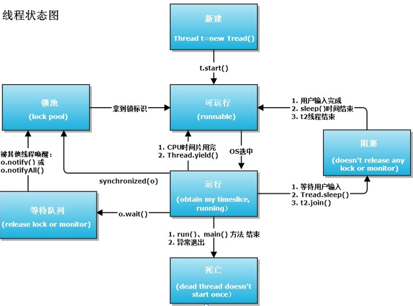
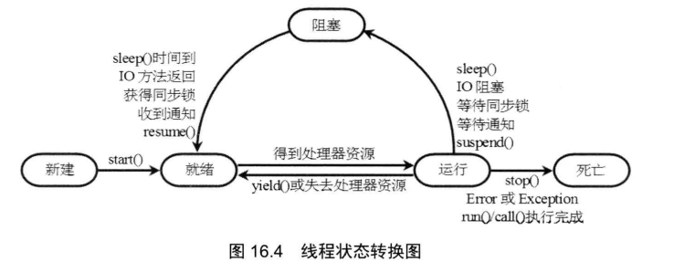
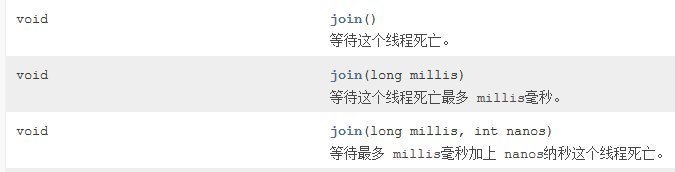
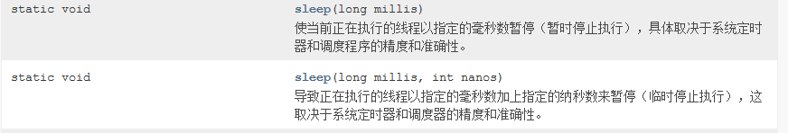
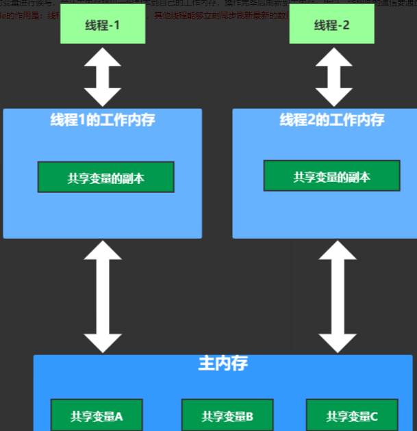

# 多线程应用

# 1. 线程概述

## 1.1 什么是线程

- 几乎所有的操作系统都支持同时运行多个任务，一个任务通常就是一个程序，每个运行中的程序就是一个进程 。当一个程序运行时，内部可能包含了多个顺序执行流，每个顺序执行流就是一个线程 。线程（thread）是操作系统能够进行运算调度的最小单位。它被包含在进程之中，是进程中的实际运作单位。

## 1.2 进程与线程关系

### 1.2.1 进程概述

- 进程（Process）是计算机中的程序关于某数据集合上的一次运行活动，是系统进行资源分配和调度的基本单位，是操作系统结构的基础。

### 1.2.2 进程特征

- 独立性：进程是系统中独立存在的实体，它可以拥有自己独立的资源，每一个进程都拥有自己私有的地址空间。在没有经过进程本身允许的情况下，一个用户进程不可以直接访问其他进程的地址空间。
- 动态性：进程与程序的区别在于，程序只是一个静态的指令集合，而进程是一个正在系统中活动的指令集合 。在进程中加入了时间的概念 。 进程具有自己的生命周期和各种不同的状态，这些概念在程序中都是不具备的 。
- 并发性 : 多个进程可以在单个处理器上井发执行，多个进程之间不会互相影响 。

### 1.2.3 进程与线程关系

- 一个进程可以有多个线程，但至少有一个线程；而一个线程只能在一个进程的地址空间内活动。
- 资源分配给进程，同一个进程的所有线程共享该进程所有资源。
- CPU分配给线程，即真正在处理器运行的是线程。
- 线程在执行过程中需要协作同步，不同进程的线程间要利用消息通信的办法实现同步。

# 2. 创建线程

## 2.1 概述

- Java 使用 Thread 类代表线程，所有的线程对象都必须是 Thread 类或其子类的实例。每个线程的作用是完成一定的任务，实际上就是执行一段程序流( 一段顺序执行的代码 ) 。Java 使用线程执行体来代表这段程序流。

## 2.2 继承 Thread 类创建线程类

- 通过继承 Thread 类来创建井启动多线程的步骤如下：
  - 定义 Thread 类的子类，并重写该类的run方法，该run方法的方法体就代表了线程需要完成
    的任务 。 因此把 run方法称为线程执行体。
  - 创建 Thread 子类的实例，即创建了线程对象 。
  - 调用线程对象的 start方法来启动该线程。

- 代码

  ~~~ java
  // 通过继承Thread类来创建线程类
  public class FirstThread extends Thread
  {
  	private int i ;
  	// 重写run方法，run方法的方法体就是线程执行体
  	public void run()
  	{
  		for ( ; i < 100 ; i++ )
  		{
  			// 当线程类继承Thread类时，直接使用this即可获取当前线程
  			// Thread对象的getName()返回当前该线程的名字
  			// 因此可以直接调用getName()方法返回当前线程的名
  			System.out.println(getName() +  " " + i);
  		}
  	}
  	public static void main(String[] args)
  	{
  		for (int i = 0; i < 100;  i++)
  		{
  			// 调用Thread的currentThread方法获取当前线程
  			System.out.println(Thread.currentThread().getName()
  				+  " " + i);
  			if (i == 20)
  			{
  				// 创建、并启动第一条线程
  				new FirstThread().start();
  				// 创建、并启动第二条线程
  				new FirstThread().start();
  			}
  		}
  	}
  }
  
  
  ~~~

## 2.3 实现Runnable接口创建线程类

- 实现Runnable接口来创建并启动多线程的步骤如下。
  - 定义 Runnable 接口的实现类 ， 并重写该接口的 run（）方法，该 run（）方法的方法体同样是该线程
    的线程执行体 。  
  - 创建 Runnable 实现类的实例，并以此实例作为Thread的target来创建Thread对象，该Thread对象才是真正的线程对象 。

- 代码

  - 实现 Runnable 接口创建的多线程 程序所创建的 Runnable 对象只是线程的 target，而多个线程可以共享同 一个 target ，所以多个线程可以共享同一个线程类(实际上应该是线程的 target 类)的实例变量。

  ~~~ java
  // 通过实现Runnable接口来创建线程类
  public class SecondThread implements Runnable
  {
  	private int i ;
  	// run方法同样是线程执行体
  	public void run()
  	{
  		for ( ; i < 100 ; i++ )
  		{
  			// 当线程类实现Runnable接口时，
  			// 如果想获取当前线程，只能用Thread.currentThread()方法。
  			System.out.println(Thread.currentThread().getName()
  				+ "  " + i);
  		}
  	}
  
  	public static void main(String[] args)
  	{
  		for (int i = 0; i < 100;  i++)
  		{
  			System.out.println(Thread.currentThread().getName()
  				+ "  " + i);
  			if (i == 20)
  			{
  				SecondThread st = new SecondThread();     // ①
  				// 通过new Thread(target , name)方法创建新线程
  				new Thread(st , "新线程1").start();
  				new Thread(st , "新线程2").start();
  			}
  		}
  	}
  }
  ~~~

## 2.4 使用Callable和Future创建线程

- 通过实现 Runnable 接口创建多线程时， Thread 类的作用就是把 run（）方法包装成线程执行体。从Java5开始，Java提供了Callable接口，该接口怎么看都像是Runnable接口的增强版， Callable 接口提供了一个 call（）方法可以作为线程执行体，但call方法比run方法功能更强大。
  - call（）方法可以有返回值。
  - call（）方法可以声明抛出异常 。

- 实现步骤
  - 创建 Callable 接口的实现类，并实现 call（）方法，该 call（）方法将作为线程执行体，且该 call（）方
    法有返回值，再创建 Callable 实现类的实例 。 从 Java 8 开始，可以直接使用 Lambda 表达式创建 Callable对象 。

- 代码

  ~~~ java
  package com.gec.创建线程.创建线程写法二;
  
  import java.util.concurrent.Callable;
  import java.util.concurrent.FutureTask;
  
  public class CallableMainTest {
  
      public static void main(String[] args) {
          // 使用FutureTask来包装Callable对象
          FutureTask<Integer> task = new FutureTask<Integer>(new Callable<Integer>() {
              @Override
              public Integer call() throws Exception {
                  int i = 0;
                  for ( ; i < 100 ; i++ )
                  {
                      System.out.println(Thread.currentThread().getName()
                              + " 的循环变量i的值：" + i);
                  }
                  // call()方法可以有返回值
                  return i;
              }
          });
  
          for (int i = 0 ; i < 100 ; i++)
          {
              System.out.println(Thread.currentThread().getName()
                      + " 的循环变量i的值：" + i);
              if (i == 20)
              {
                  // 实质还是以Callable对象来创建、并启动线程
                  new Thread(task , "有返回值的线程").start();
              }
          }
          try
          {
              // 获取线程返回值
              System.out.println("子线程的返回值：" + task.get());
          }
          catch (Exception ex)
          {
              ex.printStackTrace();
          }
  
      }
  }
  
  ~~~

## 2.5 三种线程对比

- 通过继承 Thread 类或实现 Runnable 、Callable 接口都可以实现多线程，不过实现 Runnable 接口与实
  现 Callable 接口的方式基本相同，只是 Callable 接口里定义的方法有返回值，可以声明抛出异常而己 。 因此可以将实现 Runnable 接口和实现 Callable 接口归为一种方式 。 这种方式与继承 Thread 方式之间的主要差别如下 ：

- 采用实现 Runnable 、Callable 接口的方式创建多线程的优缺点：
  - 线程类只是实现了Runnable接口或Callable 接口，还可以继承其他类。
  - 在这种方式下，多个线程可以共享同一个 target 对象，所以非常适合多个相同线程来处理同一份资源的情况，从而可以将 CPU、代码和数据分开，形成清晰的模型，较好地体现了面向对象的思想 。
  - 运行Callable任务可以拿到一个Future对象，表示异步计算的结果。它提供了检查计算是否完成的方法，以等待计算的完成，并检查计算的结果。通过Future对象可以了解任务执行情况，可取消任务的执行，可以获取执行结果。

# 3. 线程生命周期

## 3.1 线程状态图

- 当线程被创建并启动以后 ，它既不是一启动就进入了执行状态，也不是一直处于执行状态，在线程
  的生命周期中，它要经过新建（New）、就绪（Runnable）、运行 （Running）、阻塞（Blocked）和死亡（Dead）5种状态。尤其是当线程启动以后，它不可能一直“霸占”着CPU独自运行，所以CPU需要在多条线程之间切换，于是线程状态也会多次在运行、就绪之间切换。

## 3.2 新建状态

- 当程序使用new关键字创建了 一个线程之后，该线程就处于新建状态，此时它和其他的 Java 对象一样，仅仅由Java虚拟机为其分配内存，并初始化其成员变量的值。此时的线程对象没有表现出任何线程的动态特征，程序也不会执行线程的线程执行体 。

## 3.3 就绪状态

- 当线程对象调用了 start（）方法之后，该线程处于就绪状态， Java 虚拟机会为其创建方法调用栈和程序计数器，处于这个状态中的线程并没有开始运行，只是表示该线程可以运行了。至于该线程何时开始运行，取决于JVM线程调度器的调度。

- **注意问题**

  - 需要指出的是，调用了线程的run（）方法之后，该线程己经不再处于新建状态，不要再次调用线程对象的 start（）方法。
  - 启动线程使用start（）方法，而不是run（）方法!永远不要调用 线程对象的run方法，调用 start（）法来启动线程，系统会把该 run（）方法当 成线程执行体来处理;但如果直接调用线程对象的 run（）方法，则 run（）方法立即就会被执行，而且在 run（）方法返回之前其他线程无法并发执行一一也就是说，如果直接调用线程对象的 run（）方法 ，系统把线程对象当成一个普通对象，而run（）方法也是一个普通方法 ， 而不是线程执行体 。

  ~~~ java
  
  public class InvokeRun extends Thread
  {
  	private int i ;
  	// 重写run方法，run方法的方法体就是线程执行体
  	public void run()
  	{
  		for ( ; i < 100 ; i++ )
  		{
  			// 直接调用run方法时，Thread的this.getName返回的是该对象名字，
  			// 而不是当前线程的名字。
  			// 使用Thread.currentThread().getName()总是获取当前线程名字
  			System.out.println(Thread.currentThread().getName()
  				+  " " + i);   // ①
  		}
  	}
  	public static void main(String[] args)
  	{
  		for (int i = 0; i < 100;  i++)
  		{
  			// 调用Thread的currentThread方法获取当前线程
  			System.out.println(Thread.currentThread().getName()
  				+  " " + i);
  			if (i == 20)
  			{
  				// 直接调用线程对象的run方法，
  				// 系统会把线程对象当成普通对象，run方法当成普通方法，
  				// 所以下面两行代码并不会启动两条线程，而是依次执行两个run方法
  				new InvokeRun().run();
  				new InvokeRun().run();
  			}
  		}
  	}
  }
  
  ~~~

## 3.4 运行状态

- 如果处于就绪状态的线程获得了CPU，开始执行run（）方法的线程执行体，则该线程处于运行状态，如果计算机只有一个 CPU ， 那么在任何时刻只有一个线程处于运行状态 。 当然，在一个多处理器的机器上，将会有多个线程并行(注意是并行 : parallel ) 执行;当线程数大于处理器数时，依然会存在多个线程在同一个 CPU 上轮换的现象。

## 3.5 阻塞状态

- 在某一时刻某一个线程在运行一段代码的时候，这时候另一个线程也需要运行，但是在运行过程中的那个线程执行完成之前，另一个线程是无法获取到CPU执行权的（调用sleep方法是进入到睡眠暂停状态，但是CPU执行权并没有交出去，而调用wait方法则是将CPU执行权交给另一个线程），这个时候就会造成线程阻塞。

- 如何进入阻塞状态
  - 线程调用sleep（）方法主动放弃所占用的处理器资源。
  - 线程调用了一个阻塞式IO方法，在该方法返回之前，该线程被阻塞。
  - 线程试图获得一个同步监视器，但该同步监视器正被其他线程所持有。
  - 线程在等待某个通知 ( notify )。
  - 程序调用了线程的 suspend（）方法将该线程挂起。但这个方法容易导致死锁，所以应该尽量避免使用该方法。
- 如何解除阻塞状态
  - 调用 sleep（）方法的线程经过了指定时间。
  - 线程调用的阻塞式IO方法已经返回。
  - 线程成功地获得了试图取得的同步监视器。
  - 线程正在等待某个通知时，其他线程发出了一个通知。
  - 处于挂起状态的线程被调用了resume（）恢复方法。

- 阻塞状态转换图

  

- 阻塞注意问题
  - 线程从阻塞状态只能进入就绪状态，无法直接进入运行状态。而就绪状态和运行状态之间的转换通常不受程序控制，而是由系统线程调度所决定，当处于就绪状态的线程获得处理器资源时，该线程进入运行状态；当处于运行状态 的线程失去处理器资源时，该线程进入就绪状态。但有一个方法例外，调用 yield（）方法可以让运行状态的线程转入就绪状态。

## 3.6 线程死亡

- 线程会以如下三种方式结束，结束后就处于死亡状态 。  
  - run（）或 call（）方法执行完成，线程正常结束 。  
  - 线程抛出 一个未捕获的 Exception 或 Error
  - 直接调用该线程的 stop（）方法来结束该线程一一该方法容易导致死锁，通常不推荐使用 。  
  - 不要试图 对一个已经死亡的线程调用 start（）方法使它重新启动， 死亡就是死亡 ，该线程将不可再次作为线程执行 。

- 不使用stop方法的原因

  ~~~ 
  程序中可以直接使用 thread.stop()来强行终止线程，但是 stop 方法是很危险的，就象突然关闭计算机电源，而不是按正常程序关机一样，可能会产生不可预料的结果，不安全主要是：thread.stop()调用之后，创建子线程的线程就会抛出 ThreadDeatherror 的错误，并且会释放子线程所持有的所有锁。一般任何进行加锁的代码块，都是为了保护数据的一致性，如果在调用thread.stop()后导致了该线程所持有的所有锁的突然释放(不可控制)，那么被保护数据就有可能呈现不一致性，其他线程在使用这些被破坏的数据时，有可能导致一些很奇怪的应用程序错误。因此，并不推荐使用 stop 方法来终止线程。
  ~~~

  - 举例

    ~~~ java
    package com.gec.创建线程.stop用法;
    
    class MyThread extends Thread
    {
        @Override
        public void run() {
    
    
            try {
                System.out.println("my thread name="+Thread.currentThread().getName());
                //抛出 ThreadDeatherror 的错误
                this.stop();
            } catch (ThreadDeath e) {
                System.out.println("进入catch块了");
                e.printStackTrace();
            }
    
        }
    }
    
    public class StopThreadMainTest {
    
        public static void main(String[] args) {
    
            MyThread t=new MyThread();
            t.start();
        }
    }
    
    ~~~

- 使用退出标志退出线程

  - 一般 run()方法执行完，线程就会正常结束，然而，常常有些线程是伺服线程。它们需要长时间的运行，只有在外部某些条件满足的情况下，才能关闭这些线程。使用一个变量来控制循环，例如：最直接的方法就是设一个 boolean 类型的标志，并通过设置这个标志为 true 或 false 来控制 while循环是否退出

    ~~~ java
    public class ThreadSafe extends Thread {
    	public volatile boolean exit = false; 
    	public void run() { 
    			while (!exit){
    				//do something
    			}
    	} 
    }
    ~~~

# 4. 控制线程

## 4.1 join方法

### 概述

- Thread 提供了让 一个线程等待另 一个线程完成的方法一一joinO方法 。 当在某个程序执行流中调用
  其他线程的 joinO方法时，调用线程将被阻塞 ， 直到被 joinO方法加入的 Jom 线程执行完为止 。  

### join方法重载

### 实例

~~~ java

public class JoinThread extends Thread
{
	// 提供一个有参数的构造器，用于设置该线程的名字
	public JoinThread(String name)
	{
		super(name);
	}
	// 重写run()方法，定义线程执行体
	public void run()
	{
		for (int i = 0; i < 100 ; i++ )
		{
			System.out.println(getName() + "  " + i);
		}
	}
	public static void main(String[] args)throws Exception
	{
		// 启动子线程
		new JoinThread("新线程").start();
		for (int i = 0; i < 100 ; i++ )
		{
			if (i == 20)
			{
				JoinThread jt = new JoinThread("被Join的线程");
				jt.start();
				// main线程调用了jt线程的join()方法，main线程
				// 必须等jt执行结束才会向下执行
				jt.join();
			}
			System.out.println(Thread.currentThread().getName()
				+ "  " + i);
		}
	}
}

~~~

## 4.2 后台线程

### 概述

- 有一种线程，它是在后台运行的，它的任务是为其他的线程提供服务，这种线程被称为“后台线程 ( Daemon Thread )“，又称为"守护线程“ 。JVM 的垃圾回收线程就是典型的后台线程。

### 特征

- 后台线程有个特征：如果所有的前台线程都死亡，后台线程会自动死亡。

### 实例

~~~ java

public class DaemonThread extends Thread
{
	// 定义后台线程的线程执行体与普通线程没有任何区别
	public void run()
	{
		for (int i = 0; i < 1000 ; i++ )
		{
			System.out.println(getName() + "  " + i);
		}
	}
	public static void main(String[] args)
	{
		DaemonThread t = new DaemonThread();
		// 将此线程设置成后台线程
		t.setDaemon(true);
		// 启动后台线程
		t.start();
		for (int i = 0 ; i < 10 ; i++ )
		{
			System.out.println(Thread.currentThread().getName()
				+ "  " + i);
		}
		// -----程序执行到此处，前台线程（main线程）结束------
		// 后台线程也应该随之结束
	}
}

~~~

## 4.3 线程睡眠: sleep

### 4.3.1 概述

- sleep是让当前线程进入休眠状态，让出CPU资源，处于阻塞状态，但是不会释放锁。，则可以通过调用 Thread 类的静态 sleep()方法来实现。 sleep()方法有两种重载形式 。

  

  

### 4.3.2 用法

~~~ java
public class SleepTest
{
	public static void main(String[] args)
		throws Exception
	{
		for (int i = 0; i < 10 ; i++ )
		{
			System.out.println("当前时间: " + new Date());
			// 调用sleep方法让当前线程暂停1s。
			Thread.sleep(1000);
		}
	}
}
~~~

## 4.4 线程让步

### 4.4.1 概述

- Thread 还提供了 一个与 sleep（）有点相似的 yield（）静态方法，它也可以让当前正在执行的线程暂停，但它不会阻塞该线程，它只是将该线程转入就绪状态。yield（）只是让当前线程暂停一下，让系统的线程调度器重新调度一次，完全可能的情况是：当某个线程调用了 yield（）方法暂停之后，线程调度器又将其调度出来重新执行。

  ~~~ java
  package com.gec.yield用法;
  
  class FirstThread extends Thread
  {
      @Override
      public void run() {
  
          for (int i = 0; i < 10; i++) {
              System.out.println("first thread="+i);
          }
      }
  }
  
  class SecondThread extends Thread
  {
      @Override
      public void run() {
  
          for (int i = 0; i < 10; i++) {
              System.out.println("second thread="+i);
  
              if(i==5){
                  //线程让步一下
                  System.out.println("调用一下yield");
                  yield();
              }
  
          }
      }
  }
  
  public class MainTest {
  
      public static void main(String[] args) {
  
          FirstThread t1=new FirstThread();
          SecondThread t2=new SecondThread();
          t2.start();
          t1.start();
      }
  }
  
  ~~~

### 4.4.2 yield()方法和sleep()方法有什么区别

- yield()方法调用后线程处于RUNNABLE状态，而sleep()方法调用后线程处于TIME_WAITING状态，所以yield()方法调用后线程只是暂时的将调度权让给别人，但立刻可以回到竞争线程锁的状态；而sleep()方法调用后线程处于阻塞状态。

## 4.5 改变线程优先级

- 每个线程执行时都具有一定的优先级，优先级高的线程获得较多的执行机会，而优先级低的线程则获得较少的执行机会 。每个线程默认的优先级都与创建它的父线程的优先级相同，在默认情况下，mam 线程具有普通优先级，由main线程创建的子线程也具有普通优先级。

  ~~~ java
  public class PriorityTest extends Thread
  {
  	// 定义一个有参数的构造器，用于创建线程时指定name
  	public PriorityTest(String name)
  	{
  		super(name);
  	}
  	public void run()
  	{
  		for (int i = 0 ; i < 50 ; i++ )
  		{
  			System.out.println(getName() +  ",其优先级是："
  				+ getPriority() + ",循环变量的值为:" + i);
  		}
  	}
  	public static void main(String[] args)
  	{
  		// 改变主线程的优先级
  		Thread.currentThread().setPriority(6);
  		for (int i = 0 ; i < 30 ; i++ )
  		{
  			if (i == 10)
  			{
  				PriorityTest low  = new PriorityTest("低级");
  				low.start();
  				System.out.println("创建之初的优先级:"
  					+ low.getPriority());
  				// 设置该线程为最低优先级
  				low.setPriority(Thread.MIN_PRIORITY);
  			}
  			if (i == 20)
  			{
  				PriorityTest high = new PriorityTest("高级");
  				high.start();
  				System.out.println("创建之初的优先级:"
  					+ high.getPriority());
  				// 设置该线程为最高优先级
  				high.setPriority(Thread.MAX_PRIORITY);
  			}
  		}
  	}
  }
  ~~~

  

# 5. volatile关键字

## 5.1 概述

- volatile保证线程间的数据的可见性

## 5.2 什么叫做可见性

- 可见性又叫读写可见。即一个共享变量N，当有两个线程T1、T2同时获取了N的值，T1修改N的值，而T2读取N的值，可见性规范要求T2读取到的值必须是T1修改后的值。

## 5.3 Java内存模型（JMM）

- 每个线程创建时，JVM会为其创建一份私有的工作内存（栈空间），不同线程的工作内存之间不能直接互相访问。

- JMM规定所有的变量都存在主内存，主内存是共享内存区域，所有线程都可以访问。

- 线程对变量进行读写，会从主内存拷贝一份副本到自己的工作内存，操作完毕后刷新到主内存。所以，线程间的通信要通过主内存来实现。

- JMM内存模型的可见性是指，多线程访问主内存的某一个资源时，如果某一个线程在自己的工作内存中修改了该资源，并写回主内存，那么JMM内存模型应该要通知其他线程来从新获取最新的资源，来保证最新资源的可见性。

  

  

## 5.4 举例

- 进入死循环

  ~~~ java
  package com.gec.创建线程.volatile用法;
  
  
  
  class FirstThread extends Thread{
  
      public volatile static boolean flag=true;
  
      @Override
      public void run() {
  
          while (flag){
  
          }
      }
  }
  
  public class MainTest {
  
      public static void main(String[] args) throws InterruptedException {
  
          FirstThread firstThread=new FirstThread();
          Thread t1=new Thread(firstThread);
          t1.start();
  
          Thread.sleep(200);
  
          FirstThread.flag=false;
  
  
      }
  }
  
  ~~~

- 添加volatile，跳出死循环

  ~~~ java
  package com.gec.创建线程.volatile用法;
  
  
  
  class FirstThread extends Thread{
  
      public volatile static boolean flag=true;
  
      @Override
      public void run() {
  
          while (flag){
  
          }
      }
  }
  
  public class MainTest {
  
      public static void main(String[] args) throws InterruptedException {
  
          FirstThread firstThread=new FirstThread();
          Thread t1=new Thread(firstThread);
          t1.start();
  
          Thread.sleep(200);
  
          FirstThread.flag=false;
  
  
      }
  }
  
  ~~~

# 6. 线程同步

## 6.1 概述

当我们使用多个线程访问**同一资源**（可以是同一个变量、同一个文件、同一条记录等）的时候，若多个线程只有读操作，那么不会发生线程安全问题，但是如果多个线程中对资源有读和写的操作，就容易出现线程安全问题。

## 6.2 线程安全问题

### 6.2.1 需求

- 关于线程安全问题，有一个经典的问题（银行取钱）的问题 。 银行取钱的基本流程基本上可以分为
  如下几个步骤 ：
  - 用户输入账户、密码 ， 系统判断用户的账户、密码是否匹配 
  - 用户输入取款金额 
  - 系统判断账户余额是否大于取款金额
  - 如果余额大于取款金额， 则取款成功 ; 如果余额小于取款金额，则取款失败。  

### 6.2.2 代码实现

- **账号类**

  ~~~~ java
  
  public class Account
  {
  	// 封装账户编号、账户余额的两个成员变量
  	private String accountNo;
  	private double balance;
  	public Account(){}
  	// 构造器
  	public Account(String accountNo , double balance)
  	{
  		this.accountNo = accountNo;
  		this.balance = balance;
  	}
  	// 此处省略了accountNo和balance的setter和getter方法
  
  	// accountNo的setter和getter方法
  	public void setAccountNo(String accountNo)
  	{
  		this.accountNo = accountNo;
  	}
  	public String getAccountNo()
  	{
  		return this.accountNo;
  	}
  
  	// balance的setter和getter方法
  	public void setBalance(double balance)
  	{
  		this.balance = balance;
  	}
  	public double getBalance()
  	{
  		return this.balance;
  	}
  
  	// 下面两个方法根据accountNo来重写hashCode()和equals()方法
  	public int hashCode()
  	{
  		return accountNo.hashCode();
  	}
  	public boolean equals(Object obj)
  	{
  		if(this == obj)
  			return true;
  		if (obj !=null
  			&& obj.getClass() == Account.class)
  		{
  			Account target = (Account)obj;
  			return target.getAccountNo().equals(accountNo);
  		}
  		return false;
  	}
  }
  ~~~~

- **取钱的线程类**

  ~~~ java
  
  public class DrawThread extends Thread
  {
  	// 模拟用户账户
  	private Account account;
  	// 当前取钱线程所希望取的钱数
  	private double drawAmount;
  	public DrawThread(String name , Account account
  		, double drawAmount)
  	{
  		super(name);
  		this.account = account;
  		this.drawAmount = drawAmount;
  	}
  	// 当多条线程修改同一个共享数据时，将涉及数据安全问题。
  	public void run()
  	{
  		// 账户余额大于取钱数目
  		if (account.getBalance() >= drawAmount)
  		{
  			// 吐出钞票
  			System.out.println(getName()
  				+ "取钱成功！吐出钞票:" + drawAmount);
  			try
  			{
  				Thread.sleep(1);
  			}
  			catch (InterruptedException ex)
  			{
  				ex.printStackTrace();
  			}
  			// 修改余额
  			account.setBalance(account.getBalance() - drawAmount);
  			System.out.println("\t余额为: " + account.getBalance());
  		}
  		else
  		{
  			System.out.println(getName() + "取钱失败！余额不足！");
  		}
  	}
  }
  
  ~~~

- **主类**

  ~~~ java
  public class DrawTest
  {
  	public static void main(String[] args)
  	{
  		// 创建一个账户
  		Account acct = new Account("1234567" , 1000);
  		// 模拟两个线程对同一个账户取钱
  		new DrawThread("甲" , acct , 800).start();
  		new DrawThread("乙" , acct , 800).start();
  	}
  }
  ~~~

## 6.3 如何解决线程安全问题

### 6.3.1 同步代码块实现

#### 简介

- 为了防止多个线程同时访问和修改同一个对象，Java的多线程支持引入了同步监视器来解决这个问题，使用同步监视器的通用方法就是同步代码块。同步代码块的语法格式如下：

#### 语法 

~~~ java
//添加同步代码块
synchronized(同步监听器对象)
{
    ......
    
}
~~~

- 同步监听器对象
  - 条件：必须是对象
  - 条件：属于共享对象

#### 代码

~~~ java

public class DrawThread extends Thread
{
	// 模拟用户账户
	private Account account;
	// 当前取钱线程所希望取的钱数
	private double drawAmount;
	public DrawThread(String name , Account account
		, double drawAmount)
	{
		super(name);
		this.account = account;
		this.drawAmount = drawAmount;
	}
	// 当多条线程修改同一个共享数据时，将涉及数据安全问题。
	public void run()
	{
		// 使用account作为同步监视器，任何线程进入下面同步代码块之前，
		// 必须先获得对account账户的锁定——其他线程无法获得锁，也就无法修改它
		// 这种做法符合：“加锁 → 修改 → 释放锁”的逻辑
		synchronized (account)
		{
			// 账户余额大于取钱数目
			if (account.getBalance() >= drawAmount)
			{
				// 吐出钞票
				System.out.println(getName()
					+ "取钱成功！吐出钞票:" + drawAmount);
				try
				{
					Thread.sleep(1);
				}
				catch (InterruptedException ex)
				{
					ex.printStackTrace();
				}
				// 修改余额
				account.setBalance(account.getBalance() - drawAmount);
				System.out.println("\t余额为: " + account.getBalance());
			}
			else
			{
				System.out.println(getName() + "取钱失败！余额不足！");
			}
		}
		// 同步代码块结束，该线程释放同步锁
	}
}

~~~

### 6.3.2 同步方法

#### 简介

- Java的多线程安全支持还提供了同步方法，同步方法就是使用synchronized关键字来修饰某个方法，则该方法称为同步方法。对于同步方法而言，无需显式指定同步监视器，同步方法的同步监视器是`this`，也就是改对象本身。

#### 作用域

- 作用范围：方法体

#### 案例

~~~ java
package 同步方法实现;

/*
 * 定义一个Account账号类
 * */
class Account
{
	//账户名 
	private String accountName;
	//余额
	private double balance;
	
	public Account() {
		
	}

	public Account(String accountName, double balance) {
		this.accountName = accountName;
		this.balance = balance;
	}

	/**
	 * @return the accountName
	 */
	public String getAccountName() {
		return accountName;
	}

	/**
	 * @param accountName the accountName to set
	 */
	public void setAccountName(String accountName) {
		this.accountName = accountName;
	}

	/**
	 * @return the balance
	 */
	public double getBalance() {
		return balance;
	}

	/**
	 * @param balance the balance to set
	 */
	public void setBalance(double balance) {
		this.balance = balance;
	}

	/* (non-Javadoc)
	 * @see java.lang.Object#toString()
	 */
	@Override
	public String toString() {
		return "Account [accountName=" + accountName + ", balance=" + balance + "]";
	}
	
	/*
	 * 定义一个同步 方法
	 * 默认的同步监听器：this
	 * */
	public synchronized void drawMoney(double money)
	{
		if(this.getBalance()>=money)
		{
			//局部变量（每个线程分配一份m的变量存储）
			double m=this.getBalance()-money;
			
			//睡眠1秒
			try {
				Thread.sleep(1000);
			} catch (InterruptedException e) {
				// TODO Auto-generated catch block
				e.printStackTrace();
			}
			
			//account的balance属性才是共享变量值
			this.setBalance(m);
			
			System.out.println("账号名="+this.getAccountName()+" 取款金额="+money+"  当前余额="+this.getBalance()+" 线程id="+Thread.currentThread().getId()+"  m="+m);
		}else
		{
			System.out.println("账号名="+this.getAccountName()+"  余额不足，无法正常取款");
		}
	}
	
}

/*
 * 定义一个线程类：针对账号进行取款操作
 * */
class DrawThread extends Thread
{
	private Account account;
	private double money;

	public DrawThread(Account account,double money) {
		this.account = account;
		this.money=money;
	}
	
	@Override
	public void run() {
		account.drawMoney(money);
	}
	
}

public class MainTest {

	public static void main(String[] args) {
		
		//创建一个用户账号
		Account account=new Account("张三", 1000.00);
		
		DrawThread t1=new DrawThread(account, 800.00);
		DrawThread t2=new DrawThread(account, 200.00);
		t1.start();
		t2.start();

	}

}

~~~

### 6.4.1 同步锁 (Lock)

#### 简介

- 从Java5开始，Java提供了一种功能更强大的线程同步机制-------通过显式定义同步锁对象来实现同
  步，在这种机制下，同步锁由Lock对象充当。Lock提供了比synchronized方法和synchronized代码块更广泛的锁定操作，Lock允许实现更灵活的结构，可以具有差别很大的属性，并且支持多个相关的 Condition对象 。Lock是控制多个线程对共享资源进行访问的工具。通常，锁提供了对共享资源的独占访问,每次只能有一个线程对Lock对象加锁，线程开始访问共享资源之前应先获得Lock对象。

#### 重入锁

-  ReentrantLock
  - 可重入锁ReentrantLock 是一个互斥锁，即同一时间只有一个线程能够获取锁定资源，执行锁定范围内的代码。这一点与synchronized 关键字十分相似。
  - ReentrantLock可重入锁，即：（lock/unlok）动作里面可以嵌套（lock/unlock），针对同一个锁可以多次嵌套使用，不会产生死锁。但是lock函数与unlock函数在代码中必须成对出现，否则会出现死锁。

#### 案例

- **账号类**

  ~~~ java
  
  import java.util.concurrent.locks.*;
  
  public class Account
  {
  	// 定义锁对象
  	private final ReentrantLock lock = new ReentrantLock();
  	// 封装账户编号、账户余额的两个成员变量
  	private String accountNo;
  	private double balance;
  	public Account(){}
  	// 构造器
  	public Account(String accountNo , double balance)
  	{
  		this.accountNo = accountNo;
  		this.balance = balance;
  	}
  
  	// accountNo的setter和getter方法
  	public void setAccountNo(String accountNo)
  	{
  		this.accountNo = accountNo;
  	}
  	public String getAccountNo()
  	{
  		return this.accountNo;
  	}
  	// 因此账户余额不允许随便修改，所以只为balance提供getter方法，
  	public double getBalance()
  	{
  		return this.balance;
  	}
  
  	// 提供一个线程安全draw()方法来完成取钱操作
  	public void draw(double drawAmount)
  	{
  		// 加锁
  		lock.lock();
  		try
  		{
  			// 账户余额大于取钱数目
  			if (balance >= drawAmount)
  			{
  				// 吐出钞票
  				System.out.println(Thread.currentThread().getName()
  					+ "取钱成功！吐出钞票:" + drawAmount);
  				try
  				{
  					Thread.sleep(1);
  				}
  				catch (InterruptedException ex)
  				{
  					ex.printStackTrace();
  				}
  				// 修改余额
  				balance -= drawAmount;
  				System.out.println("\t余额为: " + balance);
  			}
  			else
  			{
  				System.out.println(Thread.currentThread().getName()
  					+ "取钱失败！余额不足！");
  			}
  		}
  		finally
  		{
  			// 修改完成，释放锁
  			lock.unlock();
  		}
  	}
  
  	// 下面两个方法根据accountNo来重写hashCode()和equals()方法
  	public int hashCode()
  	{
  		return accountNo.hashCode();
  	}
  	public boolean equals(Object obj)
  	{
  		if(this == obj)
  			return true;
  		if (obj !=null
  			&& obj.getClass() == Account.class)
  		{
  			Account target = (Account)obj;
  			return target.getAccountNo().equals(accountNo);
  		}
  		return false;
  	}
  }
  ~~~

- **取钱线程**

  ~~~ java
  
  public class DrawThread extends Thread
  {
  	// 模拟用户账户
  	private Account account;
  	// 当前取钱线程所希望取的钱数
  	private double drawAmount;
  	public DrawThread(String name , Account account
  		, double drawAmount)
  	{
  		super(name);
  		this.account = account;
  		this.drawAmount = drawAmount;
  	}
  	// 当多条线程修改同一个共享数据时，将涉及数据安全问题。
  	public void run()
  	{
  		// 直接调用account对象的draw方法来执行取钱
  		// 同步方法的同步监视器是this，this代表调用draw()方法的对象。
  		// 也就是说：线程进入draw()方法之前，必须先对account对象的加锁。
  		account.draw(drawAmount);
  	}
  }
  
  ~~~

- **创建一个账户主类**

  ~~~ java
  public class DrawTest
  {
  	public static void main(String[] args)
  	{
  		// 创建一个账户
  		Account acct = new Account("1234567" , 1000);
  		// 模拟两个线程对同一个账户取钱
  		new DrawThread("甲" , acct , 800).start();
  		new DrawThread("乙" , acct , 800).start();
  	}
  }
  ~~~

## 6.4 死锁

### 6.4.1 概述

- 当两个线程相互等待对方释放同步监视器时就会发生死锁， Java 虚拟机没有监测，也没有采取措施来处理死锁情况，所以多线程编程时应该采取措施避免死锁出现 。一旦出现死锁，整个程序既不会发生任何异常，也不会给出任何提示，只是所有线程处于阻塞状态，无法继续。死锁是很容易发生的，尤其在系统中出现多个同步监视器的情况下，如下程序将会出现死锁 。

### 6.4.2 实例

~~~ java

class A
{
	public synchronized void foo( B b )
	{
		System.out.println("当前线程名: " + Thread.currentThread().getName()
			+ " 进入了A实例的foo()方法" );     // ①
		try
		{
			Thread.sleep(200);
		}
		catch (InterruptedException ex)
		{
			ex.printStackTrace();
		}
		System.out.println("当前线程名: " + Thread.currentThread().getName()
			+ " 企图调用B实例的last()方法");    // ③
		b.last();
	}
	public synchronized void last()
	{
		System.out.println("进入了A类的last()方法内部");
	}
}
class B
{
	public synchronized void bar( A a )
	{
		System.out.println("当前线程名: " + Thread.currentThread().getName()
			+ " 进入了B实例的bar()方法" );   // ②
		try
		{
			Thread.sleep(200);
		}
		catch (InterruptedException ex)
		{
			ex.printStackTrace();
		}
		System.out.println("当前线程名: " + Thread.currentThread().getName()
			+ " 企图调用A实例的last()方法");  // ④
		a.last();
	}
	public synchronized void last()
	{
		System.out.println("进入了B类的last()方法内部");
	}
}
public class DeadLock implements Runnable
{
	A a = new A();
	B b = new B();
	public void init()
	{
		Thread.currentThread().setName("主线程");
		// 调用a对象的foo方法
		a.foo(b);
		System.out.println("进入了主线程之后");
	}
	public void run()
	{
		Thread.currentThread().setName("副线程");
		// 调用b对象的bar方法
		b.bar(a);
		System.out.println("进入了副线程之后");
	}
	public static void main(String[] args)
	{
		DeadLock dl = new DeadLock();
		// 以dl为target启动新线程
		new Thread(dl).start();
		// 调用init()方法
		dl.init();
	}
}

~~~

