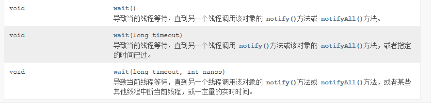
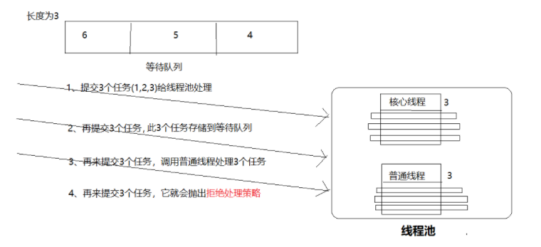
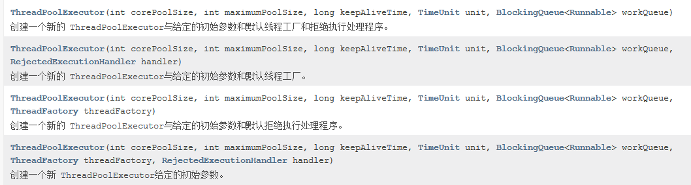

# 多线程应用二

# 1. 线程同步

## 1.1 概述

当我们使用多个线程访问**同一资源**（可以是同一个变量、同一个文件、同一条记录等）的时候，若多个线程只有读操作，那么不会发生线程安全问题，但是如果多个线程中对资源有读和写的操作，就容易出现线程安全问题。

## 1.2 线程安全问题

### 1.2.1 需求

- 关于线程安全问题，有一个经典的问题（银行取钱）的问题 。 银行取钱的基本流程基本上可以分为
  如下几个步骤 ：
  - 用户输入账户、密码 ， 系统判断用户的账户、密码是否匹配 
  - 用户输入取款金额 
  - 系统判断账户余额是否大于取款金额
  - 如果余额大于取款金额， 则取款成功 ; 如果余额小于取款金额，则取款失败。  

### 1.2.2 代码实现

- **账号类**

  ~~~~ java
  public class Account
  {
  	// 封装账户编号、账户余额的两个成员变量
  	private String accountNo;
  	private double balance;
  	public Account(){}
  	// 构造器
  	public Account(String accountNo , double balance)
  	{
  		this.accountNo = accountNo;
  		this.balance = balance;
  	}
  	// 此处省略了accountNo和balance的setter和getter方法
  
  	// accountNo的setter和getter方法
  	public void setAccountNo(String accountNo)
  	{
  		this.accountNo = accountNo;
  	}
  	public String getAccountNo()
  	{
  		return this.accountNo;
  	}
  
  	// balance的setter和getter方法
  	public void setBalance(double balance)
  	{
  		this.balance = balance;
  	}
  	public double getBalance()
  	{
  		return this.balance;
  	}
  
  	// 下面两个方法根据accountNo来重写hashCode()和equals()方法
  	public int hashCode()
  	{
  		return accountNo.hashCode();
  	}
  	public boolean equals(Object obj)
  	{
  		if(this == obj)
  			return true;
  		if (obj !=null
  			&& obj.getClass() == Account.class)
  		{
  			Account target = (Account)obj;
  			return target.getAccountNo().equals(accountNo);
  		}
  		return false;
  	}
  }
  ~~~~

- **取钱的线程类**

  ~~~ java
  public class DrawThread extends Thread
  {
  	// 模拟用户账户
  	private Account account;
  	// 当前取钱线程所希望取的钱数
  	private double drawAmount;
  	public DrawThread(String name , Account account
  		, double drawAmount)
  	{
  		super(name);
  		this.account = account;
  		this.drawAmount = drawAmount;
  	}
  	// 当多条线程修改同一个共享数据时，将涉及数据安全问题。
  	public void run()
  	{
  		// 账户余额大于取钱数目
  		if (account.getBalance() >= drawAmount)
  		{
  			// 吐出钞票
  			System.out.println(getName()
  				+ "取钱成功！吐出钞票:" + drawAmount);
  			try
  			{
  				Thread.sleep(1);
  			}
  			catch (InterruptedException ex)
  			{
  				ex.printStackTrace();
  			}
  			// 修改余额
  			account.setBalance(account.getBalance() - drawAmount);
  			System.out.println("\t余额为: " + account.getBalance());
  		}
  		else
  		{
  			System.out.println(getName() + "取钱失败！余额不足！");
  		}
  	}
  }
  
  ~~~

- **主类**

  ~~~ java
  public class DrawTest
  {
  	public static void main(String[] args)
  	{
  		// 创建一个账户
  		Account acct = new Account("1234567" , 1000);
  		// 模拟两个线程对同一个账户取钱
  		new DrawThread("甲" , acct , 800).start();
  		new DrawThread("乙" , acct , 800).start();
  	}
  }
  ~~~

## 1.3 如何解决线程安全问题

### 1.3.1 同步代码块实现

#### 简介

- 为了防止多个线程同时访问和修改同一个对象，Java的多线程支持引入了同步监视器来解决这个问题，使用同步监视器的通用方法就是同步代码块。同步代码块的语法格式如下：

#### 语法 

~~~ java
//添加同步代码块
synchronized(同步监听器对象)
{
    ......
    
}
~~~

- 同步监听器对象
  - 条件：必须是对象
  - 条件：属于共享对象

#### 代码

~~~ java
public class DrawThread extends Thread
{
	// 模拟用户账户
	private Account account;
	// 当前取钱线程所希望取的钱数
	private double drawAmount;
	public DrawThread(String name , Account account
		, double drawAmount)
	{
		super(name);
		this.account = account;
		this.drawAmount = drawAmount;
	}
	// 当多条线程修改同一个共享数据时，将涉及数据安全问题。
	public void run()
	{
		// 使用account作为同步监视器，任何线程进入下面同步代码块之前，
		// 必须先获得对account账户的锁定——其他线程无法获得锁，也就无法修改它
		// 这种做法符合：“加锁 → 修改 → 释放锁”的逻辑
		synchronized (account)
		{
			// 账户余额大于取钱数目
			if (account.getBalance() >= drawAmount)
			{
				// 吐出钞票
				System.out.println(getName()
					+ "取钱成功！吐出钞票:" + drawAmount);
				try
				{
					Thread.sleep(1);
				}
				catch (InterruptedException ex)
				{
					ex.printStackTrace();
				}
				// 修改余额
				account.setBalance(account.getBalance() - drawAmount);
				System.out.println("\t余额为: " + account.getBalance());
			}
			else
			{
				System.out.println(getName() + "取钱失败！余额不足！");
			}
		}
		// 同步代码块结束，该线程释放同步锁
	}
}

~~~

### 1.3.2 同步方法

#### 简介

- Java的多线程安全支持还提供了同步方法，同步方法就是使用synchronized关键字来修饰某个方法，则该方法称为同步方法。对于同步方法而言，无需显式指定同步监视器，同步方法的同步监视器是`this`，也就是改对象本身。

#### 作用域

- 作用范围：方法体

#### 案例

~~~ java
package 同步方法实现;

/*
 * 定义一个Account账号类
 * */
class Account
{
	//账户名 
	private String accountName;
	//余额
	private double balance;
	
	public Account() {
		
	}

	public Account(String accountName, double balance) {
		this.accountName = accountName;
		this.balance = balance;
	}

	/**
	 * @return the accountName
	 */
	public String getAccountName() {
		return accountName;
	}

	/**
	 * @param accountName the accountName to set
	 */
	public void setAccountName(String accountName) {
		this.accountName = accountName;
	}

	/**
	 * @return the balance
	 */
	public double getBalance() {
		return balance;
	}

	/**
	 * @param balance the balance to set
	 */
	public void setBalance(double balance) {
		this.balance = balance;
	}

	/* (non-Javadoc)
	 * @see java.lang.Object#toString()
	 */
	@Override
	public String toString() {
		return "Account [accountName=" + accountName + ", balance=" + balance + "]";
	}
	
	/*
	 * 定义一个同步 方法
	 * 默认的同步监听器：this
	 * */
	public synchronized void drawMoney(double money)
	{
		if(this.getBalance()>=money)
		{
			//局部变量（每个线程分配一份m的变量存储）
			double m=this.getBalance()-money;
			
			//睡眠1秒
			try {
				Thread.sleep(1000);
			} catch (InterruptedException e) {
				// TODO Auto-generated catch block
				e.printStackTrace();
			}
			
			//account的balance属性才是共享变量值
			this.setBalance(m);
			
			System.out.println("账号名="+this.getAccountName()+" 取款金额="+money+"  当前余额="+this.getBalance()+" 线程id="+Thread.currentThread().getId()+"  m="+m);
		}else
		{
			System.out.println("账号名="+this.getAccountName()+"  余额不足，无法正常取款");
		}
	}
	
}

/*
 * 定义一个线程类：针对账号进行取款操作
 * */
class DrawThread extends Thread
{
	private Account account;
	private double money;

	public DrawThread(Account account,double money) {
		this.account = account;
		this.money=money;
	}
	
	@Override
	public void run() {
		account.drawMoney(money);
	}
	
}

public class MainTest {

	public static void main(String[] args) {
		
		//创建一个用户账号
		Account account=new Account("张三", 1000.00);
		
		DrawThread t1=new DrawThread(account, 800.00);
		DrawThread t2=new DrawThread(account, 200.00);
		t1.start();
		t2.start();

	}

}

~~~

### 1.3.3 同步锁 (Lock)

#### 简介

- 从Java5开始，Java提供了一种功能更强大的线程同步机制-------通过显式定义同步锁对象来实现同
  步，在这种机制下，同步锁由Lock对象充当。Lock提供了比synchronized方法和synchronized代码块更广泛的锁定操作，Lock允许实现更灵活的结构，可以具有差别很大的属性，并且支持多个相关的 Condition对象 。Lock是控制多个线程对共享资源进行访问的工具。通常，锁提供了对共享资源的独占访问,每次只能有一个线程对Lock对象加锁，线程开始访问共享资源之前应先获得Lock对象。

#### 重入锁

-  ReentrantLock
   - 可重入锁ReentrantLock 是一个互斥锁，即同一时间只有一个线程能够获取锁定资源，执行锁定范围内的代码。这一点与synchronized 关键字十分相似。
   - ReentrantLock可重入锁，即：（lock/unlok）动作里面可以嵌套（lock/unlock），针对同一个锁可以多次嵌套使用，不会产生死锁。但是lock函数与unlock函数在代码中必须成对出现，否则会出现死锁。

#### 案例

- **账号类**

  ~~~ java
  import java.util.concurrent.locks.*;
  
  public class Account
  {
  	// 定义锁对象
  	private final ReentrantLock lock = new ReentrantLock();
  	// 封装账户编号、账户余额的两个成员变量
  	private String accountNo;
  	private double balance;
  	public Account(){}
  	// 构造器
  	public Account(String accountNo , double balance)
  	{
  		this.accountNo = accountNo;
  		this.balance = balance;
  	}
  
  	// accountNo的setter和getter方法
  	public void setAccountNo(String accountNo)
  	{
  		this.accountNo = accountNo;
  	}
  	public String getAccountNo()
  	{
  		return this.accountNo;
  	}
  	// 因此账户余额不允许随便修改，所以只为balance提供getter方法，
  	public double getBalance()
  	{
  		return this.balance;
  	}
  
  	// 提供一个线程安全draw()方法来完成取钱操作
  	public void draw(double drawAmount)
  	{
  		// 加锁
  		lock.lock();
  		try
  		{
  			// 账户余额大于取钱数目
  			if (balance >= drawAmount)
  			{
  				// 吐出钞票
  				System.out.println(Thread.currentThread().getName()
  					+ "取钱成功！吐出钞票:" + drawAmount);
  				try
  				{
  					Thread.sleep(1);
  				}
  				catch (InterruptedException ex)
  				{
  					ex.printStackTrace();
  				}
  				// 修改余额
  				balance -= drawAmount;
  				System.out.println("\t余额为: " + balance);
  			}
  			else
  			{
  				System.out.println(Thread.currentThread().getName()
  					+ "取钱失败！余额不足！");
  			}
  		}
  		finally
  		{
  			// 修改完成，释放锁
  			lock.unlock();
  		}
  	}
  
  	// 下面两个方法根据accountNo来重写hashCode()和equals()方法
  	public int hashCode()
  	{
  		return accountNo.hashCode();
  	}
  	public boolean equals(Object obj)
  	{
  		if(this == obj)
  			return true;
  		if (obj !=null
  			&& obj.getClass() == Account.class)
  		{
  			Account target = (Account)obj;
  			return target.getAccountNo().equals(accountNo);
  		}
  		return false;
  	}
  }
  ~~~

- **取钱线程**

  ~~~ java
  public class DrawThread extends Thread
  {
  	// 模拟用户账户
  	private Account account;
  	// 当前取钱线程所希望取的钱数
  	private double drawAmount;
  	public DrawThread(String name , Account account
  		, double drawAmount)
  	{
  		super(name);
  		this.account = account;
  		this.drawAmount = drawAmount;
  	}
  	// 当多条线程修改同一个共享数据时，将涉及数据安全问题。
  	public void run()
  	{
  		// 直接调用account对象的draw方法来执行取钱
  		// 同步方法的同步监视器是this，this代表调用draw()方法的对象。
  		// 也就是说：线程进入draw()方法之前，必须先对account对象的加锁。
  		account.draw(drawAmount);
  	}
  }
  
  ~~~

- **创建一个账户主类**

  ~~~ java
  public class DrawTest
  {
  	public static void main(String[] args)
  	{
  		// 创建一个账户
  		Account acct = new Account("1234567" , 1000);
  		// 模拟两个线程对同一个账户取钱
  		new DrawThread("甲" , acct , 800).start();
  		new DrawThread("乙" , acct , 800).start();
  	}
  }
  ~~~

## 1.4 死锁

### 1.4.1 概述

- 当两个线程相互等待对方释放同步监视器时就会发生死锁， Java 虚拟机没有监测，也没有采取措施来处理死锁情况，所以多线程编程时应该采取措施避免死锁出现 。一旦出现死锁，整个程序既不会发生任何异常，也不会给出任何提示，只是所有线程处于阻塞状态，无法继续。死锁是很容易发生的，尤其在系统中出现多个同步监视器的情况下，如下程序将会出现死锁 。

### 1.4.2 实例

~~~ java

class A
{
	public synchronized void foo( B b )
	{
		System.out.println("当前线程名: " + Thread.currentThread().getName()
			+ " 进入了A实例的foo()方法" );     // ①
		try
		{
			Thread.sleep(200);
		}
		catch (InterruptedException ex)
		{
			ex.printStackTrace();
		}
		System.out.println("当前线程名: " + Thread.currentThread().getName()
			+ " 企图调用B实例的last()方法");    // ③
		b.last();
	}
	public synchronized void last()
	{
		System.out.println("进入了A类的last()方法内部");
	}
}
class B
{
	public synchronized void bar( A a )
	{
		System.out.println("当前线程名: " + Thread.currentThread().getName()
			+ " 进入了B实例的bar()方法" );   // ②
		try
		{
			Thread.sleep(200);
		}
		catch (InterruptedException ex)
		{
			ex.printStackTrace();
		}
		System.out.println("当前线程名: " + Thread.currentThread().getName()
			+ " 企图调用A实例的last()方法");  // ④
		a.last();
	}
	public synchronized void last()
	{
		System.out.println("进入了B类的last()方法内部");
	}
}
public class DeadLock implements Runnable
{
	A a = new A();
	B b = new B();
	public void init()
	{
		Thread.currentThread().setName("主线程");
		// 调用a对象的foo方法
		a.foo(b);
		System.out.println("进入了主线程之后");
	}
	public void run()
	{
		Thread.currentThread().setName("副线程");
		// 调用b对象的bar方法
		b.bar(a);
		System.out.println("进入了副线程之后");
	}
	public static void main(String[] args)
	{
		DeadLock dl = new DeadLock();
		// 以dl为target启动新线程
		new Thread(dl).start();
		// 调用init()方法
		dl.init();
	}
}

~~~

# 2. 线程通讯

## 2.1 线程间通讯

- **为什么要处理线程间通信：**

  多个线程在处理同一个资源，但是处理的动作（线程的任务）却不相同。而多个线程并发执行时, 在默认情况下CPU是随机切换线程的，当我们需要多个线程来共同完成一件任务，并且我们希望他们有规律的执行, 那么多线程之间需要一些通信机制，可以协调它们的工作，以此来帮我们达到多线程共同操作一份数据。

  比如：假设现在系统中有两个线程 ，这两个线程分别代表存款者和取钱者一一现在假设系统有一种特殊的要求 ，系统要求存款者和取钱者不断地重复存款、取钱的动作，而且要求每当存款者将钱存入指定账户后，取钱者就立即取出该笔钱。 不允许存款者连续两次存钱，也不允许取钱者连续两次取钱 。

## 2.2 传统的线程通信

### 2.2.1 核心方法

- 为了实现这种功能，可以借助于Object类提供的wait（）、notify（）和 notifyAll（）三个方法 ，这三个方法
  并不属于 Thread 类，而是属于 Object 类。但这三个方法必须由同步监视器对象来调用 

#### wait方法

- wait（）: 导致当前线程等待 ， 直到其他线程调用该同步监视器的notify（）方法或 notifyAll（）方法来
  唤醒该线程 ，调用 wait（）方法的当前线程会**释放对该同步监视器的锁定**。

- 该 wait（）方法有三种形式：

  

#### notify方法

- 唤醒在此同步监视器上等待的单个线程 。 如果所有线程都在此同步监视器上等待，则会选择唤醒其中一个线程。选择是任意性的。只有当前线程放弃对该同步监视器的锁定后(使用 wait方法) ，才可以执行被唤醒的线程。

#### notifyAll方法

- 唤醒在此同步监视器上等待的所有线程。只有当前线程放弃对该同步监视器的锁定后 ，才可以执行被唤醒的线程 。

### 2.2.2 案例

#### 需求

- 实现存款、取款功能

#### 原理

- 程序中可以通过一个标记来标识账户中是否己有存款，当标记为 false 时， 表明账户中没有存款，存款者线程可以向下执行，当存款者把钱存入账户后 ，将标记设为 true，并调用 notify或 notifyAll方法来唤醒其他线程 ; 当存款者线程进入线程体后 ，如果标记为 true 就调用 wait方法让该线程等待。当标记为 true 时，表明账户中己经存入了存款，则取钱者线程可以向下执行，当取钱者把钱从账户中取出后，将标记设为 false ， 并调用 notify（）或 notifyAll（）方法来唤醒其他线程:当取钱者线程进入线程体后，如果标记为 false 就调用 wait方法让该线程等待。  

#### 代码

##### 账号

- 使用 wait（）和 notifyAll（）进行了控制，对存款者线程而言，当程序进入deposit（）方法后，如果 flag 为true，则表明账户中己有存款 ，程序调用 wait（）方法阻塞 ;否则程序向下执行存款操作，当存款操作执行完成后，系统将 flag 设为 true，然后调用 notifyAll（）来唤醒其他被阻塞
  的线程  

~~~ java

public class Account
{
	// 封装账户编号、账户余额的两个成员变量
	private String accountNo;
	private double balance;
	// 标识账户中是否已有存款的旗标
	private boolean flag = false;

	public Account(){}
	// 构造器
	public Account(String accountNo , double balance)
	{
		this.accountNo = accountNo;
		this.balance = balance;
	}

	// accountNo的setter和getter方法
	public void setAccountNo(String accountNo)
	{
		this.accountNo = accountNo;
	}
	public String getAccountNo()
	{
		return this.accountNo;
	}
	// 因此账户余额不允许随便修改，所以只为balance提供getter方法，
	public double getBalance()
	{
		return this.balance;
	}

	public synchronized void draw(double drawAmount)
	{
		try
		{
			// 如果flag为假，表明账户中还没有人存钱进去，取钱方法阻塞
			if (!flag)
			{
				wait();
			}
			else
			{
				// 执行取钱
				System.out.println(Thread.currentThread().getName()
					+ " 取钱:" +  drawAmount);
				balance -= drawAmount;
				System.out.println("账户余额为：" + balance);
				// 将标识账户是否已有存款的旗标设为false。
				flag = false;
				// 唤醒其他线程
				notifyAll();
			}
		}
		catch (InterruptedException ex)
		{
			ex.printStackTrace();
		}
	}
	public synchronized void deposit(double depositAmount)
	{
		try
		{
			// 如果flag为真，表明账户中已有人存钱进去，则存钱方法阻塞
			if (flag)             //①
			{
				wait();
			}
			else
			{
				// 执行存款
				System.out.println(Thread.currentThread().getName()
					+ " 存款:" +  depositAmount);
				balance += depositAmount;
				System.out.println("账户余额为：" + balance);
				// 将表示账户是否已有存款的旗标设为true
				flag = true;
				// 唤醒其他线程
				notifyAll();
			}
		}
		catch (InterruptedException ex)
		{
			ex.printStackTrace();
		}
	}

	// 下面两个方法根据accountNo来重写hashCode()和equals()方法
	public int hashCode()
	{
		return accountNo.hashCode();
	}
	public boolean equals(Object obj)
	{
		if(this == obj)
			return true;
		if (obj !=null
			&& obj.getClass() == Account.class)
		{
			Account target = (Account)obj;
			return target.getAccountNo().equals(accountNo);
		}
		return false;
	}
}
~~~

##### 取钱线程

- 取钱者线程则循环 100 次重复取钱  

~~~ java
public class DrawThread extends Thread
{
	// 模拟用户账户
	private Account account;
	// 当前取钱线程所希望取的钱数
	private double drawAmount;
	public DrawThread(String name , Account account
		, double drawAmount)
	{
		super(name);
		this.account = account;
		this.drawAmount = drawAmount;
	}
	// 重复100次执行取钱操作
	public void run()
	{
		for (int i = 0 ; i < 100 ; i++ )
		{
			account.draw(drawAmount);
		}
	}
}

~~~

##### 存钱线程

- 程序中的存款者线程循环 100 次重复存款  

~~~ java

public class DepositThread extends Thread
{
	// 模拟用户账户
	private Account account;
	// 当前取钱线程所希望存款的钱数
	private double depositAmount;
	public DepositThread(String name , Account account
		, double depositAmount)
	{
		super(name);
		this.account = account;
		this.depositAmount = depositAmount;
	}
	// 重复100次执行存款操作
	public void run()
	{
		for (int i = 0 ; i < 100 ; i++ )
		{
			account.deposit(depositAmount);
		}
	}
}

~~~

##### 主类

~~~ java
public class DrawTest
{
	public static void main(String[] args)
	{
		// 创建一个账户
		Account acct = new Account("1234567" , 0);
		new DrawThread("取钱者" , acct , 800).start();
		new DepositThread("存款者甲" , acct , 800).start();
		new DepositThread("存款者乙" , acct , 800).start();
		new DepositThread("存款者丙" , acct , 800).start();
	}
}

~~~

## 2.3 使用Condition控制线程通信

### 2.3.1 概述

- 当使用 Lock 对象来保证同步时， Java 提供了一个 Condition 类来保持协调，使用 Condition 可以让那些已经得到 Lock 对象却无法继续执行的线程释放 Lock 对象 ， Condition 对象也可以唤醒其他处于等待的线程 。  

### 2.3.2 Condition的核心方法

- await（） : 类似于隐式同步监视器上的 wait（）方法，导致当前线程等待 ， 直到其他线程调用该 Condition
  的 signal（）方法或 signalAll（）方法来唤醒该线程 。
- signal（）: 唤醒在此Lock对象上等待的单个线程。如果所有线程都在该Lock对象上等待，则会
  选择唤醒其中一个线程。选择是任意性的。只有当前线程放弃对该Lock对象的锁定后(使用
  await方法) ，才可以执行被唤醒的线程。
- signalAll（）: 唤醒在此Lock对象上等待的所有线程。只有当前线程放弃对该 Lock 对象的锁定后，才可以执行被唤醒的线程。

### 2.3.3 上述实例修改成Condition实现

~~~ java

import java.util.concurrent.*;
import java.util.concurrent.locks.*;

public class Account
{
	// 显式定义Lock对象
	private final Lock lock = new ReentrantLock();
	// 获得指定Lock对象对应的Condition
	private final Condition cond  = lock.newCondition();
	// 封装账户编号、账户余额的两个成员变量
	private String accountNo;
	private double balance;
	// 标识账户中是否已有存款的旗标
	private boolean flag = false;

	public Account(){}
	// 构造器
	public Account(String accountNo , double balance)
	{
		this.accountNo = accountNo;
		this.balance = balance;
	}

	// accountNo的setter和getter方法
	public void setAccountNo(String accountNo)
	{
		this.accountNo = accountNo;
	}
	public String getAccountNo()
	{
		return this.accountNo;
	}
	// 因此账户余额不允许随便修改，所以只为balance提供getter方法，
	public double getBalance()
	{
		return this.balance;
	}

	public void draw(double drawAmount)
	{
		// 加锁
		lock.lock();
		try
		{
			// 如果flag为假，表明账户中还没有人存钱进去，取钱方法阻塞
			if (!flag)
			{
				cond.await();
			}
			else
			{
				// 执行取钱
				System.out.println(Thread.currentThread().getName()
					+ " 取钱:" +  drawAmount);
				balance -= drawAmount;
				System.out.println("账户余额为：" + balance);
				// 将标识账户是否已有存款的旗标设为false。
				flag = false;
				// 唤醒其他线程
				cond.signalAll();
			}
		}
		catch (InterruptedException ex)
		{
			ex.printStackTrace();
		}
		// 使用finally块来释放锁
		finally
		{
			lock.unlock();
		}
	}
	public void deposit(double depositAmount)
	{
		lock.lock();
		try
		{
			// 如果flag为真，表明账户中已有人存钱进去，则存钱方法阻塞
			if (flag)             // ①
			{
				cond.await();
			}
			else
			{
				// 执行存款
				System.out.println(Thread.currentThread().getName()
					+ " 存款:" +  depositAmount);
				balance += depositAmount;
				System.out.println("账户余额为：" + balance);
				// 将表示账户是否已有存款的旗标设为true
				flag = true;
				// 唤醒其他线程
				cond.signalAll();
			}
		}
		catch (InterruptedException ex)
		{
			ex.printStackTrace();
		}
		// 使用finally块来释放锁
		finally
		{
			lock.unlock();
		}
	}

	// 下面两个方法根据accountNo来重写hashCode()和equals()方法
	public int hashCode()
	{
		return accountNo.hashCode();
	}
	public boolean equals(Object obj)
	{
		if(this == obj)
			return true;
		if (obj !=null
			&& obj.getClass() == Account.class)
		{
			Account target = (Account)obj;
			return target.getAccountNo().equals(accountNo);
		}
		return false;
	}
}
~~~

## 2.4 使用阻塞队列 (BlockingQueue) 控制线程通信

### 2.4.1 概述

- Java 5 提供了 一个 BlockingQueue 接口，虽然 BlockingQueue 也是 Queue 的子接口，但它的主要用
  途并不是作为容器，而是作为线程同步的工具 。 BlockingQueue 具有一个特征 : 当生产者线程试图向
  BlockingQueue 中放入元素时，如果该队列己满，则该线程被阻塞;当消费者线程试图从 BlockingQueue
  中取出元素时，如果该队列己 空， 则该线程被阻塞。

### 2.4.2 核心方法

- BlockingQueue 提供如下两个支持阻塞的方法。  
  - put(E e): 尝试把 E 元素放入 BlockingQueue 中，如果该队列的元素己满 ，则阻塞该线程。
  - take（）: 尝试从 BlockingQueue 的头部取出 元素，如果该队列的元素己空， 则阻塞该线程。

### 2.4.3 用法 

- 程序先定义一个大小为 2 的 BlockingQueue ， 程序先向该队列中放入两个元素，此时队列还没有满 ，两个元素都可以放入，因此使用 put（） 、 add（）、 offer（）方法效果完全一样 。   当程序试图放入第三
  个元素时 ，如果使用 putO方法尝试放入元素将会阻塞线程   

  ~~~ java
  package com.gec.阻塞队列;
  
  import java.util.concurrent.ArrayBlockingQueue;
  import java.util.concurrent.BlockingQueue;
  
  public class BlockingQueueTest {
  
      public static void main(String[] args) throws InterruptedException {
          // 定义一个长度为2的阻塞队列
          BlockingQueue<String> bq = new ArrayBlockingQueue<>(2);
          bq.put("Java"); // 与bq.add("Java"、bq.offer("Java")相同
          bq.put("Java"); // 与bq.add("Java"、bq.offer("Java")相同
          bq.put("Java"); // ① 阻塞线程。
      }
  }
  
  ~~~

### 2.4.4 生产者消费者实例

~~~ java

import java.util.concurrent.*;

class Producer extends Thread
{
	private BlockingQueue<String> bq;
	public Producer(BlockingQueue<String> bq)
	{
		this.bq = bq;
	}
	public void run()
	{
		String[] strArr = new String[]
		{
			"Java",
			"Struts",
			"Spring"
		};
		for (int i = 0 ; i < 999999999 ; i++ )
		{
			System.out.println(getName() + "生产者准备生产集合元素！");
			try
			{
				Thread.sleep(200);
				// 尝试放入元素，如果队列已满，线程被阻塞
				bq.put(strArr[i % 3]);
			}
			catch (Exception ex){ex.printStackTrace();}
			System.out.println(getName() + "生产完成：" + bq);
		}
	}
}
class Consumer extends Thread
{
	private BlockingQueue<String> bq;
	public Consumer(BlockingQueue<String> bq)
	{
		this.bq = bq;
	}
	public void run()
	{
		while(true)
		{
			System.out.println(getName() + "消费者准备消费集合元素！");
			try
			{
				Thread.sleep(200);
				// 尝试取出元素，如果队列已空，线程被阻塞
				bq.take();
			}
			catch (Exception ex){ex.printStackTrace();}
			System.out.println(getName() + "消费完成：" + bq);
		}
	}
}
public class BlockingQueueTest2
{
	public static void main(String[] args)
	{
		// 创建一个容量为1的BlockingQueue
		BlockingQueue<String> bq = new ArrayBlockingQueue<>(1);
		// 启动3条生产者线程
		new Producer(bq).start();
		new Producer(bq).start();
		new Producer(bq).start();
		// 启动一条消费者线程
		new Consumer(bq).start();
	}
}
~~~

# 3. 线程池

## 3.1 概述

- 其实线程池就是一段内存空间，里面已经存储了创建好的线程对象，提交任务，直接从内存空间获取线程即可处理，此线程处理完成之后回归此内存空间，因此线程就可以反复的复用。 这样可以避免反复创建线程对象所带来的性能开销，节省了系统的资源。

## 3.2 线程池的工作原理

- 如果线程池中的线程数量未达到核心线程的数量，那么会直接启动一个核心线程来执行任
- 如果线程池中的线程数量已经达到或者超过核心线程的数量，那么任务会被插入到任务队列中排队等待执行。
- 如果在步骤2中无法将任务插入到任务队列中，这往往是由于任务队列已满，这个时候如果线程数量未达到线程池规定的最大值，那么会立刻启动一个非核心线程来执行。
- 如果步骤3中线程数量已经达到线程池规定的最大值，那么就拒绝执行此任务。

## 3.3 ThreadPoolExecutor类

### 3.3.1 概述

- Executor[框架](https://so.csdn.net/so/search?q=框架&spm=1001.2101.3001.7020)最核心的类是ThreadPoolExecutor，它是线程池的实现类，主要由下列4个组 件构成。

### 3.3.2 分析构造器

- corePoolSize：线程池的核心线程数，默认情况下，核心线程会在线程池中一直存活，即使它们处于闲置状态
- maximumPoolSize：线程池允许创建的最大线程数。简单理解，即核心线程都被占用，但还有任务要做，就创建非核心线程
- ThreadFactory：用于设置创建线程的工厂，可以通过线程工厂给每个创建出来的线程设置更有意义的名字。
- keepAliveTime：非核心线程闲置时的超时时长，超过这个时长，非核心线程就会被回收。
- TimeUnit（线程活动保持时间的单位）：可选的单位有天（DAYS），小时（HOURS），分钟（MINUTES），毫秒(MILLISECONDS)，微秒(MICROSECONDS, 千分之一毫秒)和毫微秒(NANOSECONDS, 千分之一微秒)。
- runnableTaskQueue：用于保存等待执行的任务的阻塞队列。 可以选择以下几个阻塞队列。
  - ArrayBlockingQueue;
  - LinkedBlockingQueue;
  - SynchronousQueue;

- handler：表示当拒绝处理任务时的策略，有以下四种取值：
  - ThreadPoolExecutor.AbortPolicy:丢弃任务并抛出RejectedExecutionException异常。 
  - ThreadPoolExecutor.DiscardPolicy：也是丢弃任务，但是不抛出异常。
  - ThreadPoolExecutor.DiscardOldestPolicy：丢弃队列最前面的任务，然后重新尝试执行任务（重复此过程）
  - ThreadPoolExecutor.CallerRunsPolicy：由调用线程处理该任务

### 3.3.3 自定义线程池举例

~~~ java
package 自定义线程池;

import java.util.concurrent.BlockingQueue;
import java.util.concurrent.LinkedBlockingQueue;
import java.util.concurrent.RejectedExecutionHandler;
import java.util.concurrent.ThreadPoolExecutor;
import java.util.concurrent.TimeUnit;

class MyRunnable implements Runnable
{
	@Override
	public void run() {
		
		System.out.println("子线程id="+Thread.currentThread().getId()+"  子线程名="+Thread.currentThread().getName());
		
		//睡眠
		try {
			Thread.sleep(20*1000);
		} catch (InterruptedException e) {
			// TODO Auto-generated catch block
			e.printStackTrace();
		}
		
	}
}

public class MainTest {

	public static void main(String[] args) {
		
		//创建一个线程池对象
		/*
		 * 参数一：corePoolSize：线程池的核心线程数
		 * 参数二：maximumPoolSize：线程池允许创建的最大线程数
		 * 
		 * */
		
		//储存10个任务
        BlockingQueue<Runnable> queue = new LinkedBlockingQueue<Runnable>(3);
        
        //拒绝任务提交，抛出异常
        RejectedExecutionHandler handler =  new ThreadPoolExecutor.AbortPolicy();
        
		ThreadPoolExecutor executor=new ThreadPoolExecutor(
                3,
                6,
                5,
                TimeUnit.SECONDS,
                queue,
                handler);
		
		//提交任务1
		executor.submit(new MyRunnable());
		//提交任务2
		executor.submit(new MyRunnable());
		//提交任务3
		executor.submit(new MyRunnable());
		//提交任务4
		executor.submit(new MyRunnable());
		//提交任务5
		executor.submit(new MyRunnable());
		//提交任务6
		executor.submit(new MyRunnable());
		//提交任务7
		executor.submit(new MyRunnable());
		//提交任务8
		executor.submit(new MyRunnable());
		//提交任务9
		executor.submit(new MyRunnable());
		//提交任务10
		executor.submit(new MyRunnable());
		//提交任务11
		executor.submit(new MyRunnable());
		//提交任务12
		executor.submit(new MyRunnable());
	}
}

~~~

### 3.3.4 内置线程池

- newCachedThreadPool: 创建一个具有缓存功能的线程池，系统根据 需要创建线程，这些线程将会被缓存在线程池中 。
- newFixedThreadPool(int nThreads): 创建一个可重用的、具有固定线程数的线程池 。
- newSingleThreadExecutor（）: 创建一个只有单线程的线程池，它相当于调用 newFixedThreadPool（）
  方法时传入参数为 1。
- newScheduledThreadPool(int corePooISize): 创建具有指定线程数的线程池，它可以在指定延迟后执行线程任务 。 corePoolSize 指池中所保存的线程数，即使线程是空闲的也被保存在线程池内 。
- newSingleThreadScheduledExecutor（）: 创建只有一个线程的线程池，它可以在指定延迟后执行线程任务 。

### 3.3.5 使用线程池来执行线程任务的步骤如下  

- 调用 Executors 类 的静态工厂方法创建一个 ExecutorService 对象，该对象代表一个线程池 。  

- 创建 Runnable 实现类或 Callable 实现类的 实例，作为线程执行任务。  

- 调用 ExecutorService 对象 的 submit（）方法来提交 Runnable 实例或 Callable 实例。  

- 当不想提交任何任务时，调用 ExecutorService 对象的 shutdown（）方法来关闭线程池 。  

  ~~~ java
  
  import java.util.concurrent.*;
  
  public class ThreadPoolTest
  {
  	public static void main(String[] args)
  		throws Exception
  	{
  		// 创建足够的线程来支持4个CPU并行的线程池
  		// 创建一个具有固定线程数（6）的线程池
  		ExecutorService pool = Executors.newFixedThreadPool(6);
  		// 使用Lambda表达式创建Runnable对象
  		Runnable target = () -> {
  			for (int i = 0; i < 100 ; i++ )
  			{
  				System.out.println(Thread.currentThread().getName()
  					+ "的i值为:" + i);
  			}
  		};
  		// 向线程池中提交两个线程
  		pool.submit(target);
  		pool.submit(target);
  		// 关闭线程池
  		pool.shutdown();
  	}
  }
  
  
  ~~~

  

