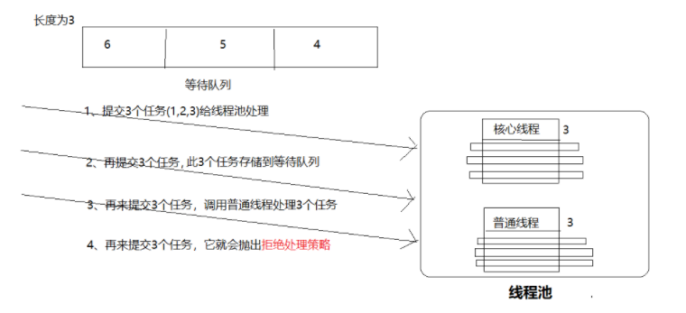
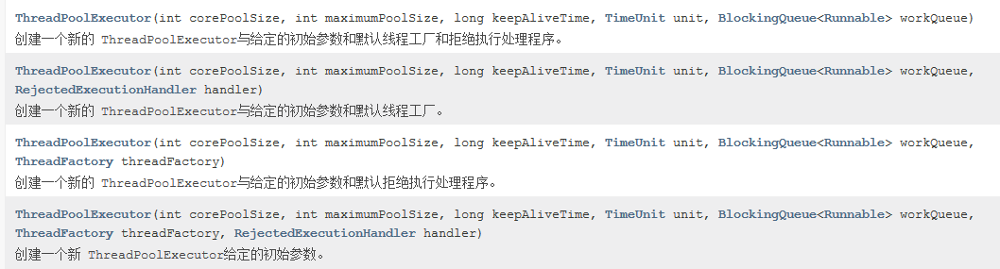

# 多线程应用三

# 1. 线程池

## 1.1 概述

- 其实线程池就是一段内存空间，里面已经存储了创建好的线程对象，提交任务，直接从内存空间获取线程即可处理，此线程处理完成之后回归此内存空间，因此线程就可以反复的复用。 这样可以避免反复创建线程对象所带来的性能开销，节省了系统的资源。

## 1.2 线程池的工作原理



- 如果线程池中的线程数量未达到核心线程的数量，那么会直接启动一个核心线程来执行任
- 如果线程池中的线程数量已经达到或者超过核心线程的数量，那么任务会被插入到任务队列中排队等待执行。
- 如果在步骤2中无法将任务插入到任务队列中，这往往是由于任务队列已满，这个时候如果线程数量未达到线程池规定的最大值，那么会立刻启动一个非核心线程来执行。
- 如果步骤3中线程数量已经达到线程池规定的最大值，那么就拒绝执行此任务。

## 1.3 ThreadPoolExecutor类

### 1.3.1 概述

- Executor[框架](https://so.csdn.net/so/search?q=框架&spm=1001.2101.3001.7020)最核心的类是ThreadPoolExecutor，它是线程池的实现类，主要由下列4个组 件构成。

### 1.3.2 分析构造器



- corePoolSize：线程池的核心线程数，默认情况下，核心线程会在线程池中一直存活，即使它们处于闲置状态
- maximumPoolSize：线程池允许创建的最大线程数。简单理解，即核心线程都被占用，但还有任务要做，就创建非核心线程
- ThreadFactory：用于设置创建线程的工厂，可以通过线程工厂给每个创建出来的线程设置更有意义的名字。
- keepAliveTime：非核心线程闲置时的超时时长，超过这个时长，非核心线程就会被回收。
- TimeUnit（线程活动保持时间的单位）：可选的单位有天（DAYS），小时（HOURS），分钟（MINUTES），毫秒(MILLISECONDS)，微秒(MICROSECONDS, 千分之一毫秒)和毫微秒(NANOSECONDS, 千分之一微秒)。
- runnableTaskQueue：用于保存等待执行的任务的阻塞队列。 可以选择以下几个阻塞队列。
  - ArrayBlockingQueue;
  - LinkedBlockingQueue;
  - SynchronousQueue;

- handler：表示当拒绝处理任务时的策略，有以下四种取值：
  - ThreadPoolExecutor.AbortPolicy:丢弃任务并抛出RejectedExecutionException异常。 
  - ThreadPoolExecutor.DiscardPolicy：也是丢弃任务，但是不抛出异常。
  - ThreadPoolExecutor.DiscardOldestPolicy：丢弃队列最前面的任务，然后重新尝试执行任务（重复此过程）
  - ThreadPoolExecutor.CallerRunsPolicy：由调用线程处理该任务

### 1.3.3 自定义线程池举例

~~~ java
package com.gec.线程池;

import java.util.concurrent.*;

class MyRunnable implements Runnable
{
    @Override
    public void run() {

        System.out.println(
                "子线程id="+Thread.currentThread().getId()+
                        "  子线程名="+Thread.currentThread().getName());

        //睡眠
        try {
            Thread.sleep(5*1000);
        } catch (InterruptedException e) {
            // TODO Auto-generated catch block
            e.printStackTrace();
        }

    }
}

public class MainTest {

    public static void main(String[] args) {

        //参数一：corePoolSize：线程池的核心线程数
        int corePoolSize=3;
        //参数二：maximumPoolSize：线程池允许创建的最大线程数
        int maximumPoolSize=6;
        //参数三：非核心线程闲置时的超时时长
        long keepAliveTime=5;

        //用于保存等待执行的任务的阻塞队列，储存3个任务
        BlockingQueue<Runnable> queue = new LinkedBlockingQueue<Runnable>(3);

        //拒绝任务提交，抛出异常
        RejectedExecutionHandler handler =  new ThreadPoolExecutor.AbortPolicy();


        ThreadPoolExecutor executor=
                new ThreadPoolExecutor(
                        corePoolSize,
                        maximumPoolSize,
                        keepAliveTime,
                        TimeUnit.SECONDS,
                        queue,
                        handler);

        //提交任务1
        executor.submit(new MyRunnable());
        //提交任务2
        executor.submit(new MyRunnable());
        //提交任务3
        executor.submit(new MyRunnable());
        //提交任务4
        executor.submit(new MyRunnable());
        //提交任务5
        executor.submit(new MyRunnable());
        //提交任务6
        executor.submit(new MyRunnable());
        //提交任务7
        executor.submit(new MyRunnable());
        //提交任务8
        executor.submit(new MyRunnable());
        //提交任务9
        executor.submit(new MyRunnable());
        //提交任务10 抛出异常 RejectedExecutionException
        executor.submit(new MyRunnable());
        //关闭连接池
        executor.shutdown();

    }
}

~~~

### 1.3.4 内置线程池

- newCachedThreadPool: 创建一个具有缓存功能的线程池，系统根据 需要创建线程，这些线程将会被缓存在线程池中 。
- newFixedThreadPool(int nThreads): 创建一个可重用的、具有固定线程数的线程池 。
- newSingleThreadExecutor（）: 创建一个只有单线程的线程池，它相当于调用 newFixedThreadPool（）
  方法时传入参数为 1。
- newScheduledThreadPool(int corePooISize): 创建具有指定线程数的线程池，它可以在指定延迟后执行线程任务 。 corePoolSize 指池中所保存的线程数，即使线程是空闲的也被保存在线程池内 。
- newSingleThreadScheduledExecutor（）: 创建只有一个线程的线程池，它可以在指定延迟后执行线程任务 。

### 1.3.5 使用线程池来执行线程任务的步骤如下  

- 调用 Executors 类 的静态工厂方法创建一个 ExecutorService 对象，该对象代表一个线程池 。  

- 创建 Runnable 实现类或 Callable 实现类的 实例，作为线程执行任务。  

- 调用 ExecutorService 对象 的 submit（）方法来提交 Runnable 实例或 Callable 实例。  

- 当不想提交任何任务时，调用 ExecutorService 对象的 shutdown（）方法来关闭线程池 。  

  ~~~ java
  
  import java.util.concurrent.*;
  
  public class ThreadPoolTest
  {
  	public static void main(String[] args)
  		throws Exception
  	{
  		// 创建足够的线程来支持4个CPU并行的线程池
  		// 创建一个具有固定线程数（6）的线程池
  		ExecutorService pool = Executors.newFixedThreadPool(6);
  		// 使用Lambda表达式创建Runnable对象
  		Runnable target = () -> {
  			for (int i = 0; i < 100 ; i++ )
  			{
  				System.out.println(Thread.currentThread().getName()
  					+ "的i值为:" + i);
  			}
  		};
  		// 向线程池中提交两个线程
  		pool.submit(target);
  		pool.submit(target);
  		// 关闭线程池
  		pool.shutdown();
  	}
  }
  
  
  ~~~


# 2. ThreadLocal类应用

## 2.1 简介

- ThreadLocal为解决多线程程序的并发问题提供了一种新的思路，ThreadLocal为每个使用该变量的线程提供独立的变量副本，所以每一个线程都可以独立地改变自己的副本，而不会影响其它线程所对应的副本。

## 2.2 核心方法

```csharp
public T get() {} // 获取ThreadLocal在当前线程中保存的变量副本
public void set(T value) {} //用来设置当前线程中变量的副本
private T setInitialValue(){} // 设置初始值
```

## 2.3 举例

~~~ java
package ThreadLocal用法;

class MyRunnable implements Runnable {
    
	private int i = 0;
	
	//ThreadLocal默认初始化数据值0
    ThreadLocal<Integer> threadId = new ThreadLocal<Integer>() {

        @Override
        protected Integer initialValue() {
            return 0;
        }
    };

	@Override
	public void run() {

		for (int j = 0; j < 10; j++) {

			// i++
			//i++;
             //每个线程都有一份threadId变量的副本
             //针对副本+1操作
			threadId.set(threadId.get()+1);

			try {
				Thread.sleep(200);
			} catch (InterruptedException e) {
				// TODO Auto-generated catch block
				e.printStackTrace();
			}

			// i--
			//i--;
             //针对副本-1操作
			threadId.set(threadId.get()-1);

			System.out.println("thread id=" + Thread.currentThread().getId() + "  i=" + threadId.get());

		}

	}
}

public class MainTest {

	public static void main(String[] args) {

		MyRunnable r = new MyRunnable();

		// 创建线程一
		new Thread(r).start();
		// 创建线程二
		new Thread(r).start();

	}

}

~~~

