# mysql数据库与sql基础

# 1. 数据库概述

## 1.1 什么是数据库

- 数据库是“按照数据结构来组织、存储和管理数据的仓库”。是一个长期存储在[计算机](https://baike.baidu.com/item/计算机/140338)内的、有组织的、可共享的、统一管理的大量数据的集合。

## 1.2 为什么使用数据库

因为应用程序需要保存用户的数据，比如Word需要把用户文档保存起来，以便下次继续编辑或者拷贝到另一台电脑。要保存用户的数据，一个最简单的方法是把用户数据写入文件。例如，要保存一个班级所有学生的信息，可以向文件中写入一个CSV文件：

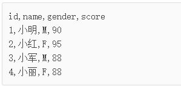

- 但是，随着应用程序的功能越来越复杂，**数据量越来越大**，如何管理这些数据就成了大问题：
  - 读写文件并解析出数据需要大量重复代码；
  - 从成千上万的数据中快速查询出指定数据需要复杂的逻辑。

## 1.3 数据库分类

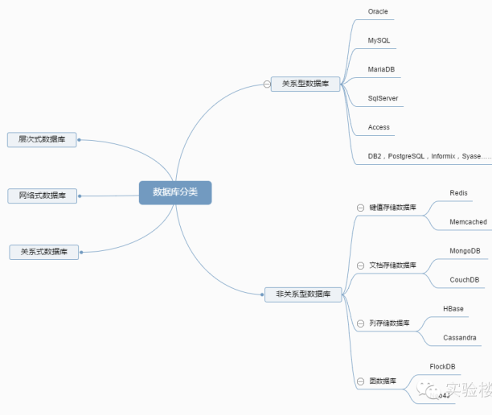

## 1.4 关系型数据库

### 1.4.1 概述

- 关系型数据库，采用关系模型来组织数据，简单来说，**关系模型指的就是二维表格模型**。类似于Excel工作表。**非关系型数据库**，可看成传统关系型数据库的功能阉割版本，基于键值对存储数据，通过减少很少用的功能，来提高性能。

### 1.4.2 关系型数据库设计规则

* **遵循ER模型**

  * E    entity   代表实体的意思      对应到数据库当中的一张表          
  * R    relationship 代表关系的意思  

* **具体体现**
  * 将数据放到表中，表再放到库中。
  * 一个数据库中可以有多个表，每个表都有一个名字，用来标识自己。表名具有唯一性。
  * 表头(header): 每一列的名称;
  * 列(col): 具有相同数据类型的数据的集合;
  * 行(row): 每一行用来描述某条记录的具体信息;
  * 值(value): 行的具体信息, 每个值必须与该列的数据类型相同;
  * **键(key)**: 键的值在当前列中具有唯一性。

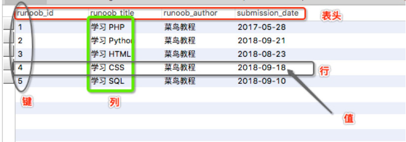

# 2. mysql数据库

## 2.1 什么是msyql数据库

- MySQL**是一种开放源代码的关系型数据库管理系统，开发者为瑞典MySQL AB公司。在2008年1月16号被Sun公司收购。而2009年,SUN又被Oracle收购。目前 MySQL被广泛地应用在Internet上的中小型网站中。由于其**体积小、速度快、总体拥有成本低，尤其是开放源码这一特点，使得很多互联网公司选择了MySQL作为网站数据库（Facebook, Twitter, YouTube，阿里的蚂蚁金服，去哪儿，魅族，百度外卖，腾讯）。

## 2.2 优点

- MySQL 是开源的，目前隶属于 Oracle 旗下产品。
- MySQL 支持大型的数据库。可以处理拥有上千万条记录的大型数据库。
- MySQL 使用标准的 SQL 数据语言形式。
- MySQL 可以运行于多个系统上，并且支持多种语言。这些编程语言包括 C、C++、Python、Java、Perl、PHP、Eiffel、Ruby 和 Tcl 等。
- MySQL 对 PHP 有很好的支持，PHP 是很适合用于 Web 程序开发。
- MySQL 支持大型数据库，支持 5000 万条记录的数据仓库，32 位系统表文件最大可支持 4GB，64 位系统支持最大的表文件为8TB。
- MySQL 是可以定制的，采用了 GPL 协议，你可以修改源码来开发自己的 MySQL 系统。

## 2.3 安装mysql

见《安装mysql8.0.md》

## 2.4 数据库存储机制

- MyISAM: 这是 MySQL 早期默认的存储机制 ， 对事务支持不够好 。

- InnoDB: InnoDB 提供事务安全的存储机制 。 InnoDB 通过建立行级锁来保证事务完整性，并以Oracle 风格的共享锁来处理 Select 语句 。 系统默认启动 InnoDB 存储机制 ， 如果不想使用 InnoDB表，则可以使用 skip-innodb 选项 。

  ~~~ sql
  ENGINE=MyISAM 强制使用 MyISAM 存储机制 。
  ENGINE=InnoDB 强制使用 InnoDB 存储机制 。
  ~~~

# 3. sql基础

## 3.1 什么是sql

- SQL：Structure Query Language。（结构化查询语言）,通过sql操作数据库(操作数据库,操作表,操作数据)
- SQL被美国国家标准局（ANSI）确定为关系型数据库语言的美国标准，后来被国际化标准组织（ISO）采纳为关系数据库语言的国际标准   
- 各数据库厂商(MySql,oracle,sql server)都支持ISO的SQL标准。
- 各数据库厂商在标准的基础上做了自己的扩展。   各个数据库自己特定的语法 

## 3.2 sql语句分类

- Data Definition Language (DDL数据定义语言) 如：操作数据库，操作表
- **Data  Manipulation Language**(DML数据操纵语言)，如：对表中的记录操作增删改
- **Data Query Language**(DQL 数据查询语言)，如：对表中数据的查询操作
- Data Control Language(DCL 数据控制语言)，如：对用户权限的设置

## 3.3 操作数据库

### 3.3.1 创建数据库(掌握)

+ 语法

```sql
create database 数据库名 [character set 字符集][collate  校对规则]     注: []意思是可选的意思
```

字符集(charset)：是一套符号和编码。

+ 练习

创建一个day01的数据库（默认字符集)  

```sql
create database gecdb;
```

创建一个day01_2的数据库,指定字符集为gbk(了解) 

```sql
create database gecdb character set gbk;
```

### 3.3.2 查看所有的数据库

查看所有的数据库

- 语法  

```sql
show databases; 
```

### 3.3.3 查看数据库的定义结构

- 语法

```sql
show create database 数据库名;
```

- 查看gecdb这个数据库的定义

```sql
show create database gecdb; 
```

### 3.3.4 删除数据库

- 语法 

```sql
drop database 数据库名;
```

- 删除gecdb数据库

```sql
drop database gecdb;
```

### 3.3.5 修改数据库

- 语法 

```sql
alter database 数据库名 character set 字符集;
```

- 修改day01这个数据库的字符集(gbk)

```sql
alter database gecdb character set gbk;
```

**注意：**

- 是utf8，不是utf-8
- 不是修改数据库名

### 3.3.6 其他操作

- 切换数据库, 选定哪一个数据库

```sql
use 数据库名;   		//注意: 在创建表之前一定要指定数据库. use 数据库名
```

- 练习: 使用gecdb

```sql
use gecdb;
```

- 查看正在使用的数据库

```sql
select database();
```

## 3.4 DDL语句

### 3.4.1 概述

- DDL比DML要多，主要的命令有CREATE、ALTER、DROP等，DDL主要是用在定义或改变表（TABLE）的结构，数据类型，表之间的链接和约束等初始化工作上，他们大多在建立表时使用

  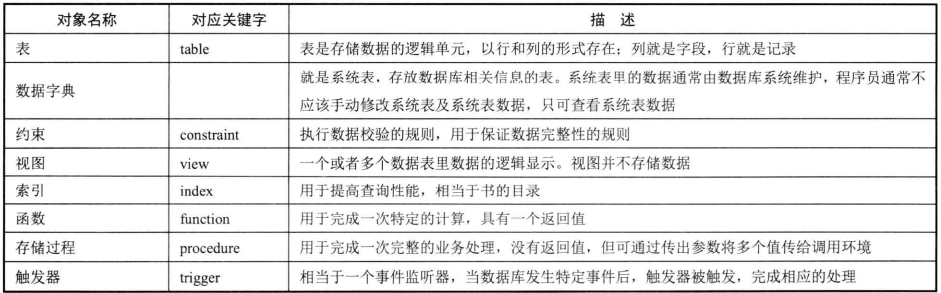

### 3.4.2 创建表

#### 创建数据表语法

~~~ sql
create  table  表名(
	字段1  数据类型 约束条件,
    字段2  数据类型 约束条件,
    字段3  数据类型 约束条件,
    .....
)
~~~

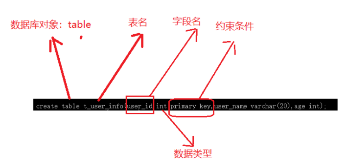

#### 数据类型

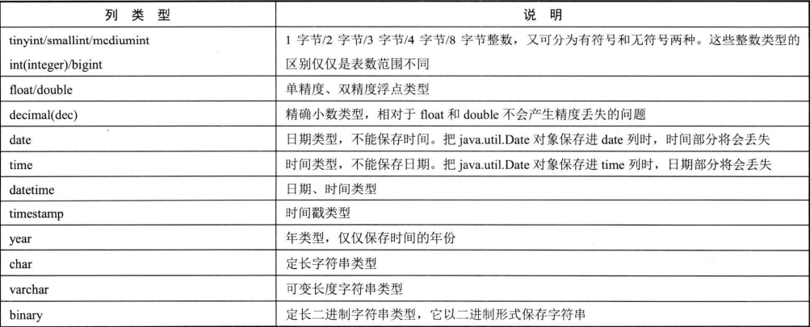

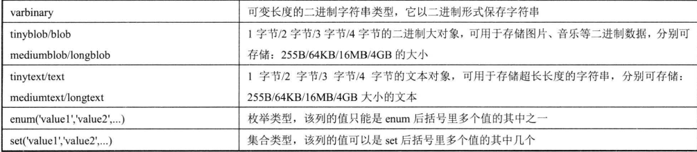

#### 数据类型解释

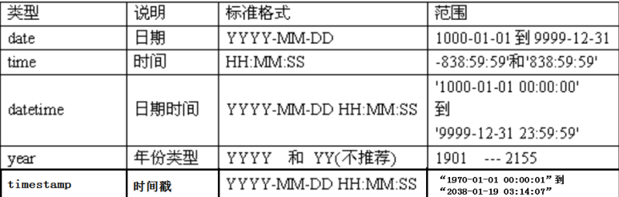

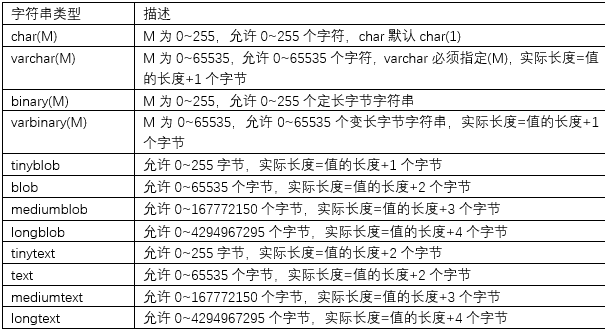

#### 实例

- 创建一个用户表（t_user_info）

- 字段1：用户ID   int  主键约束(唯一性，非空性)

- 字段2：用户名   varchar(字符长度)

- 字段3：年龄      int

- 代码如下

  ~~~ sql
  create table t_user_info(
  	user_id int primary key,
      user_name varchar(20),
      age  int
  );
  ~~~

- 举例

  ~~~ sql
  create table test
  (
  	test_id int,
  	test_price decimal,
  	test_name varchar(255) default 'xxx',
  	test_desc text,
  	test_img blob,
  	test_date datetime
  );
  ~~~

### 3.4.3 添加表列

#### 添加列语法

~~~ sql
alter table 【数据库名.]表名称 add 【column】 字段名 数据类型;
~~~

#### 实例

~~~ sql
alter table t_user_info add address varchar(20);
~~~

### 3.4.4 修改表列

#### 修改表语法

~~~ sql
修改列的名称，类型，约束: `alter table 表名 change 旧列 新列 类型 约束;`
~~~

#### 实例

~~~ sql
 alter table t_user_info modify age int;
~~~

### 3.4.5 删除列

#### 删除列语法

~~~ sql
删除一列: `alter table 表名 drop 列名;`
~~~

#### 实例

~~~ sql
alter table t_user_info drop address;
~~~

### 3.4.6 修改表名

#### 修改表名语法

~~~ 
修改表名 : `rename table 旧表名 to 新表名;` 
~~~

#### 实例

~~~ sql
xxxxxxxxxx alter table 表名 rename to 新表名
~~~

### 3.4.7 数据库约束

#### 概述

- 数据库约束：能够保证数据的完整性、合理性、规范性

#### 约束类型

mysql数据库支持四种约束

- NOT NULL：非空约束，指定某列不能为空。
- UNIQUE：唯一约束，指定某列或者几列组合不能为空。
- PRIMARY KEY：主键，指定该列的值唯一地标识该条记录。
- FOREIGN KEY：外键，指定该行记录从属于主表中的一条记录，主要用于保证参照完整性。
- Check：检查，指定一个布尔表达式，用于指定对应列的值必须满足该表达式。

#### 约束限制

- 根据约束数据列的限制，约束可分为

  - 单列约束：每个约束只约束一列
  - 多列约束：每个约束可约束多列数据

#### 约束作用范围

- 列级约束

  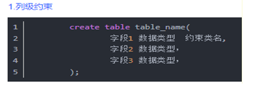

- 表级约束

  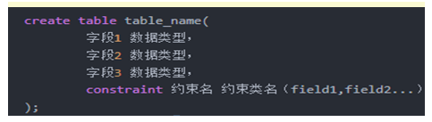

#### not null约束

- not null 约束强制字段始终包含值，不接受 NULL 值。这意味着，如果不向字段添加值，就无法插入新纪录或者更新记录。此约束只能使用列级约束。

  ~~~ sql
  create table t_user_info(
  	user_id int,
  	user_name varchar(20) not null,
  	age  int
  );
  
  ~~~

- 特点

  - 非空约束用于确保当前列的值不为NULL值，非空约束只能出现在表对象的列上。Null类型特征
    - 所有的类型的值都可以是null，包括int、float等数据类型
    - 空字符串””不等于null，0也不等于null，false不等于null

#### UNIQUE约束

- 唯一约束用于保证指定列或指定列组合不允许出现重复值。虽然唯一约束的列不可以出现重复值，但是可以出现多个NULL值（因为在数据库中NULL不等于NULL）。

- 同一个表内可建多个唯一约束，唯一约束也可由多列组合而成。

- 唯一约束既可以使用列级约束，也可以使用表级约束

- 举例

  ~~~ sql
  --列级约束写法
  create table t_user_info(
  	user_id int,
  	user_name varchar(20) UNIQUE,
  	age  int
  );
  
  --表级约束写法
  create table t_user_info(
  	user_id int,
  	user_name varchar(20),
  	age  int,
  	UNIQUE(user_name,age)
  );
  
  ~~~

#### PRIMARY KEY

- 主键约束

- PRIMARY KEY 约束唯一标识数据库表中的每条记录。

- 主键必须包含唯一的值。

- 主键列不能包含 NULL 值。

- 每个表应该都一个主键，并且每个表只能有一个主键。

- 主键约束既可以使用列级约束，也可以使用表级约束

- 举例

  ~~~ sql
  --列级写法
  create table t_user_info(
  	user_id int primary key auto_increment,
  	user_name varchar(20),
  	age  int
  );
  
  --表级写法
  create table t_user_info(
  	user_id int,
  	user_name varchar(20),
  	age  int,
  	primary key(user_id,user_name)
  );
  
  
  insert into t_user_info(user_id,user_name,age) values(1,'张三',30);
  insert into t_user_info(user_id,user_name,age) values(2,'张三',25);
  insert into t_user_info(user_id,user_name,age) values(2,'张三',30);
  ~~~

#### 外键约束

- 外键约束是保证一个或两个表之间的参照完整性，数据的合理性，外键是构建于一个表的两个字段或是两个表的两个字段之间的参照关系。 也就是说从表的外键值必须在主表中能找到或者为空。 当主表的记录被从表参照时，主表的记录将不允许删除，如果要删除数据，需要先删除从表中依赖该记录的数据， 然后才可以删除主表的数据。还有一种就是级联删除子表数据。 

- 举例

  ~~~ sql
  #主表
  create table teacher_table
  (
  	teacher_id int auto_increment,
  	teacher_name varchar(255),
  	primary key(teacher_id)
  );
  
  #从表
  create table student_table
  (
  	student_id int  primary key,
  	student_name varchar(255),
  	java_teacher int,
  	constraint student_teacher_fk foreign key(java_teacher) references teacher_table(teacher_id)
  );
  
  insert into teacher_table values(1,'小罗');
  insert into teacher_table values(2,'大罗');
  
  
  insert into student_table values(1,'李白',1);
  insert into student_table values(2,'小李',2);
  insert into student_table values(3,'c罗',4);
  ~~~

- 添加外键级联操作约束

  ~~~ sql
  drop table t_emp;
  drop table t_dept;
  
  
  
  --员工表
  create table t_emp
  (
  	emp_id int primary key auto_increment,
  	emp_name varchar(20),
  	fk_dept_id int,
  	constraint emp_dept_id_fk foreign key(fk_dept_id) references t_dept(dept_id) on update cascade on delete cascade
  );
  
  insert into t_emp(emp_name,fk_dept_id) values('张三',1);
  insert into t_emp(emp_name,fk_dept_id) values('李四',3);
  insert into t_emp(emp_name,fk_dept_id) values('王五',2);
  
  --部门表
  create table t_dept
  (
  	dept_id int primary key,
  	dept_name varchar(20)
  );
  
  insert into t_dept values(1,'软件事业部');
  insert into t_dept values(2,'研发部');
  insert into t_dept values(3,'财务部');
  ~~~

## 3.5 DML操作表记录-增删改

+ 准备工作: 创建一张商品表(商品id,商品名称,商品价格,商品数量.) 


```sql
create table product(
	pid int primary key auto_increment,
	pname varchar(40),
	price double,
	num int
);
```

### 3.5.1 插入记录

#### 语法

+ 方式一:  插入指定列, **如果没有把这个列进行列出来, 以null进行自动赋值了**.

  eg: 只想插入pname, price ,  insert into t_product(pname, price) values('mac',18000);

```
insert into 表名(列,列..) values(值,值..);
```

> 注意:  如果没有插入了列设置了非空约束, 会报错的

+ 方式二: 插入所有的列,如果哪列不想插入值,则需要赋值为null


```sql
insert into 表名 values(值,值....);           

eg:
insert into product values(null,'苹果电脑',18000.0,10);
insert into product values(null,'华为5G手机',30000,20);
insert into product values(null,'小米手机',1800,30);
insert into product values(null,'iPhonex',8000,10);
insert into product values(null,'iPhone7',6000,200);
insert into product values(null,'iPhone6s',4000,1000);
insert into product values(null,'iPhone6',3500,100);
insert into product values(null,'iPhone5s',3000,100);

insert into product values(null,'方便面',4.5,1000);
insert into product values(null,'咖啡',11,200); 
insert into product values(null,'矿泉水',3,500);
```

### 3.5.2 更新记录

#### 语法

```mysql
update 表名 set 列 =值, 列 =值 [where 条件]
```

#### 练习

- 将所有商品的价格修改为5000元

```sql
update product set price = 5000;
```

- 将商品名是苹果电脑的价格修改为18000元

```sql
UPDATE product set price = 18000 WHERE pname = '苹果电脑';
```

- 将商品名是苹果电脑的价格修改为17000,数量修改为5

```sql
UPDATE product set price = 17000,num = 5 WHERE pname = '苹果电脑';
```

- 将商品名是方便面的商品的价格在原有基础上增加2元

```sql
UPDATE product set price = price+2 WHERE pname = '方便面';
```

### 3.5.3 删除记录

#### delete

根据条件，一条一条数据进行删除

+ 语法

```
delete from 表名 [where 条件]    注意: 删除数据用delete,不用truncate
```

- 类型

删除表中名称为’苹果电脑’的记录

```
delete from product where pname = '苹果电脑';
```

删除价格小于5001的商品记录

```
delete from product where price < 5001;
```

删除表中的所有记录

```
delete from product;
```

#### truncate

把表直接DROP掉，然后再创建一个同样的新表。删除的数据不能找回。执行速度比DELETE快

	truncate table 表;

#### 工作中删除数据

+ 物理删除: 真正的删除了, 数据不在, 使用delete就属于物理删除
+ 逻辑删除: 没有真正的删除, 数据还在. 搞一个标记, 其实逻辑删除是更新  eg: state   1 启用   0禁用

## 3.6 DQL操作表记录-查询【重点】

### 3.6.1 基本查询语法

```sql
select 要查询的字段名 from 表名 [where 条件] 
```

### 3.6.2 简单查询

#### 查询所有行和所有列的记录

+ 语法

```
select * form 表
```

+ 查询商品表里面的所有的列

```
select * from product;
```

#### 查询某张表特定列的记录

+ 语法

```
select 列名,列名,列名... from 表
```

+ 查询商品名字和价格

```
select pname, price from product;
```

#### 去重查询 distinct

+ 语法

```
SELECT DISTINCT 字段名 FROM 表名;   //要数据一模一样才能去重
```

+ 去重查询商品的名字

```mysql
SELECT DISTINCT pname,price FROM product
```

> 注意点: 去重针对某列, distinct前面不能先出现列名

#### 别名查询

+ 语法

```
select 列名 as 别名 ,列名  from 表   //列别名  as可以不写
select 别名.* from 表 as 别名      //表别名(多表查询, 明天会具体讲)
```


- 查询商品信息，使用别名


```
SELECT pid ,pname AS '商品名',price AS '商品价格',num AS '商品库存' FROM product
```

### 3.6.3 运算查询(+,-,*,/,%等)

- 把商品名，和商品价格+10查询出来:我们既可以将某个字段加上一个固定值，又可以对多个字段进行运算查询


```mysql
select pname ,price+10 as price from product;

#直接常量运算
select 1+2;
```

>  注意

- 运算查询字段,字段之间是可以的  

### 3.6.4 条件查询(很重要)

#### 语法

```
select ... from 表 where 条件 
//取出表中的每条数据，满足条件的记录就返回，不满足条件的记录不返回
```

#### 运算符

1、比较运算符

```mysql
大于：>
小于：<
大于等于：>=
小于等于：<=
等于：=   不能用于null判断
不等于：!=  或 <>
安全等于: <=>  可以用于null值判断
```

2、逻辑运算符（建议用单词，可读性来说）

```mysql
逻辑与：&& 或 and
逻辑或：|| 或 or
逻辑非：! 或 not
逻辑异或：^ 或 xor
```

3、范围

```mysql
区间范围：between x  and  y
	    not between x  and  y
集合范围：in (x,x,x) 
	    not  in (x,x,x)
```

4、模糊查询（只针对字符串类型，日期类型）

```
like 'xxx'  模糊查询是处理字符串的时候进行部分匹配
如果想要表示0~n个字符，用%
```

5、特殊的null值处理

```
#（1）判断时
xx is null
xx is not null
xx <=> null
```

#### 练习


- 查询商品价格>3000的商品


```
select * from product where price > 3000;
```


- 查询pid=1的商品


```
select * from product where pid = 1;
```


- 查询pid<>1的商品


```
select * from product where pid <> 1;
```


- 查询价格在3000到6000之间的商品


```
select * from product where price between 3000 and 6000;
```


- 查询pid在1，5，7，15范围内的商品


```
select * from product where id = 1;
select * from product where id = 5;
select * from product where id = 7;
select * from product where id = 15;

select * from product where id in (1,5,7,15);
```


- 查询商品名以iPho开头的商品(iPhone系列) 


```
select * from product where pname like 'iPho%';
```

- 查询商品价格大于3000并且数量大于20的商品   (条件 and 条件 and...)


```
select * from product where price > 3000 and num > 20;
```

- 查询id=1或者价格小于3000的商品 


```
select * from product where pid = 1 or price < 3000;
```

## 3.7 排序查询

排序是写在查询的后面，代表把数据查询出来之后再排序

### 3.7.1 环境的准备

```sql
# 创建学生表(有sid,学生姓名,学生性别,学生年龄,分数列,其中sid为主键自动增长)
CREATE TABLE student(
	sid INT PRIMARY KEY auto_increment,
	sname VARCHAR(40),
	sex VARCHAR(10),
	age INT,
    score DOUBLE
);

INSERT INTO student VALUES(null,'aq','男',18,98.5);
INSERT INTO student VALUES(null,'bg','女',18,96.5);
INSERT INTO student VALUES(null,'tt','男',15,50.5);
INSERT INTO student VALUES(null,'gg','女',20,98.5);
INSERT INTO student VALUES(null,'qq','男',18,60.5);
INSERT INTO student VALUES(null,'wb','男',38,98.5);
INSERT INTO student VALUES(null,'小五','男',18,100);
INSERT INTO student VALUES(null,'小闹','女',28,28);
INSERT INTO student VALUES(null,'小强','男',21,95);
```

### 3.7.2 单列排序

1. 语法:  只按某一个字段进行排序，单列排序

```
SELECT 字段名 FROM 表名 [WHERE 条件] ORDER BY 字段名 [ASC|DESC];  //ASC: 升序，默认值; DESC: 降序
```

2. 练习: 以分数降序查询所有的学生

```
SELECT * FROM student ORDER BY score DESC
```

### 3.7.3 组合排序

1. 语法: 同时对多个字段进行排序，如果第1个字段相等，则按第2个字段排序，依次类推

```
SELECT 字段名 FROM 表名 WHERE 字段=值 ORDER BY 字段名1 [ASC|DESC], 字段名2 [ASC|DESC];
```

2. 练习: 以分数降序查询所有的学生, 如果分数一致,再以age降序

```
SELECT * FROM student ORDER BY score DESC, age DESC
```

## 3.8 聚合函数 

聚合函数通常会和分组查询一起使用，用于统计每组的数据  

### 3.8.1 聚合函数列表  

| 聚合函数        | 作用                   |
| --------------- | ---------------------- |
| max(列名)       | 求这一列的最大值       |
| min(列名)       | 求这一列的最小值       |
| avg(列名)       | 求这一列的平均值       |
| **count(列名)** | 统计这一列有多少条记录 |
| sum(列名)       | 对这一列求总和         |

1. 语法

```sql
SELECT 聚合函数(列名) FROM 表名 [where 条件];
```

2. 练习

```sql
-- 求出学生表里面的最高分数
SELECT MAX(score) FROM student
-- 求出学生表里面的最低分数
SELECT MIN(score) FROM student
-- 求出学生表里面的分数的总和(忽略null值)
SELECT SUM(score) FROM student
-- 求出学生表里面的平均分
SELECT AVG(score) FROM student
-- 统计学生的总人数 (忽略null) 
SELECT COUNT(sid) FROM student
SELECT COUNT(*) FROM student
```

> 注意:  聚合函数会忽略空值NULL

我们发现对于NULL的记录不会统计，建议如果统计个数则不要使用有可能为null的列，但如果需要把NULL也统计进去呢？我们可以通过 IFNULL(列名，默认值) 函数来解决这个问题. 如果列不为空，返回这列的值。如果为NULL，则返回默认值。 

```mysql
SELECT AVG(IFNULL(score,0)) FROM student;
```

## 3.9 分组查询

GROUP BY将分组字段结果中相同内容作为一组，并且返回每组的第一条数据，所以单独分组没什么用处。分组的目的就是为了统计，一般分组会跟聚合函数一起使用

### 3.9.1分组

1. 语法

```sql
SELECT 字段1,字段2... FROM 表名  [where 条件] GROUP BY 列 [HAVING 条件];
```

2. 练习:根据性别分组, 统计每一组学生的总人数

```mysql
-- 根据性别分组, 统计每一组学生的总人数
SELECT sex '性别',COUNT(sid) '总人数' FROM student GROUP BY sex

-- 根据性别分组，统计每组学生的平均分
SELECT sex '性别',AVG(score) '平均分' FROM student GROUP BY sex

-- 根据性别分组，统计每组学生的总分
SELECT sex '性别',SUM(score) '总分' FROM student GROUP BY sex
```

### 3.9.2 分组后筛选 having

- 练习根据性别分组, 统计每一组学生的总人数> 5的(分组后筛选)

```sql
SELECT sex, count(*) FROM student GROUP BY sex HAVING count(*) > 5
```

* 练习根据性别分组，只统计年龄大于等于18的，并且要求组里的人数大于4

```mysql
SELECT sex '性别',COUNT(sid) '总人数' FROM student WHERE age >= 18 GROUP BY sex HAVING COUNT(sid) > 4
```

### 3.9.3 where和having的区别【面试】

| 子名       | 作用                                                         |
| ---------- | ------------------------------------------------------------ |
| where 子句 | 1) 对查询结果进行分组前，将不符合where条件的行去掉，即在分组之前过滤数据，即先过滤再分组。2) where后面不可以使用聚合函数 |
| having字句 | 1) having 子句的作用是筛选满足条件的组，即在分组之后过滤数据，即先分组再过滤。2) having后面可以使用聚合函数 |


## 4.1 分页查询  

### 4.1.1 语法

```sql
select ... from .... limit a ,b
```

| LIMIT a,b;                 |
| -------------------------- |
| a 表示的是跳过的数据条数   |
| b 表示的是要查询的数据条数 |

### 4.1.2 练习

```sql
-- 分页查询
-- limit 关键字是使用在查询的后边，如果有排序的话则使用在排序的后边
-- limit的语法: limit offset,length  其中offset表示跳过多少条数据，length表示查询多少条数据
SELECT * FROM product LIMIT 0,3
-- 查询product表中的前三条数据(0表示跳过0条，3表示查询3条)

SELECT * FROM product LIMIT 3,3
-- 查询product表的第四到六条数据(3表示跳过3条，3表示查询3条)
-- 分页的时候，只会告诉你我需要第几页的数据，并且每页有多少条数据
-- 假如，每页需要3条数据，我想要第一页数据: limit 0,3
-- 假如,每页需要3条数据，我想要第二页数据: limit 3,3
-- 假如，每页需要3条数据，我想要第三页数据: limit 6,3
-- 结论: length = 每页的数据条数，offset = (当前页数 - 1)*每页数据条数
-- limit (当前页数 - 1)*每页数据条数, 每页数据条数
```

## 4.2 查询的语法小结

```sql
select...from...where...group by...order by...limit

select...from...where...
select...from...where...order by...
select...from...where...limit...
select...from...where...order by...imit
```


