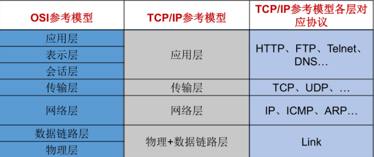
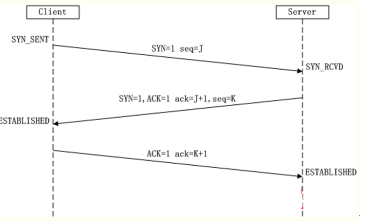
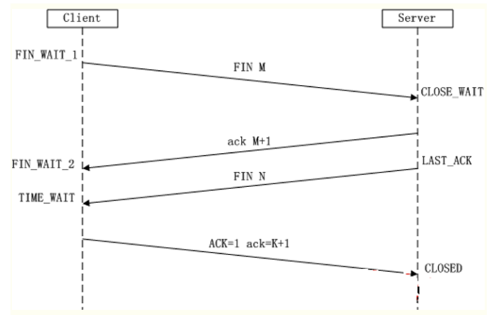
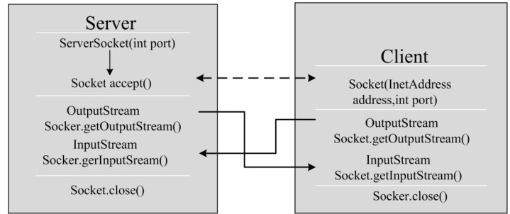

# 网络编程应用一

# 1. 网络编程基础

## 1.1 计算机网络

### 1.1.1 概述

- 计算机网络，是把分布在不同地理区域的计算机与专门的外部设备用通信线路互连成一个规模大、功能强的网络系统，从而使众多计算机可以方便的相互传递信息，共享硬件、软件、数据等资源。

### 1.1.2 作用

- 资源共享
- 信息传输和集中分布
- 均衡负荷和分布处理
- 综合信息服务

### 1.1.3 实现网络条件

- 硬件支持
- 软件支持
  - ip、端口
  - 协议
    - http
    - upd
    - tcp/ip

### 1.3.4 网络范围

- 按照规模大小和延伸范围可以分为：局域网、城域网、广域网，其中 Internet 是最大的广域网。
- 按照网络的拓扑结构可以分为：星型网络、总线网络、环线网络、树形网络、星型环线网络等。
- 按照网络的传播介质可以分为：双绞线网、同轴电缆网、光纤网和卫星网等。

## 1.2 OSI模型

上图中，OSI参考模型：开放系统互连参考模型把计算机网络分成物理层、数据链路层、网络层、传输层、会话层、表示层、应用层七层，受到计算机界和通信业的极大关注。通过十多年的发展和推进， OSI 模式己成为各种计算机网络结构的参考标准 。按 TCP/IP 协议模型，网络通常被分为一个四层模型，这个四层模型和前面的 OSI 七层模型有大致的对应关系。

* TCP/IP协议中的四层分别是应用层、传输层、网络层和链路层，每层分别负责不同的通信功能。
  链路层：链路层是用于定义物理传输通道，通常是对某些网络连接设备的驱动协议，例如针对光纤、网线提供的驱动。
* 网络层：网络层是整个TCP/IP协议的核心，它主要用于将传输的数据进行分组，将分组数据发送到目标计算机或者网络。而IP协议是一种非常重要的协议。IP（internet protocal）又称为互联网协议。IP的责任就是把数据从源传送到目的地。它在源地址和目的地址之间传送一种称之为数据包的东西，它还提供对数据大小的重新组装功能，以适应不同网络对包大小的要求。
* 传输层：主要使网络程序进行通信，在进行网络通信时，可以采用TCP协议，也可以采用UDP协议。TCP（Transmission Control Protocol）协议，即传输控制协议，是一种面向连接的、可靠的、基于字节流的传输层通信协议。UDP(User Datagram Protocol，用户数据报协议)：是一个无连接的传输层协议、提供面向事务的简单不可靠的信息传送服务。
* 应用层：主要负责应用程序的协议，例如HTTP协议、FTP协议等。

# 2. TCP与UDP协议

## 2.1 概述

通信的协议还是比较复杂的，`java.net` 包中包含的类和接口，它们提供低层次的通信细节。我们可以直接使用这些类和接口，来专注于网络程序开发，而不用考虑通信的细节。

## 2.2 udp与tcp协议

`java.net` 包中提供了两种常见的网络协议的支持：

- **UDP**：用户数据报协议(User Datagram Protocol)。

  - **非面向连的，不可靠的：**UDP是无连接通信协议，即在数据传输时，数据的发送端和接收端不建立逻辑连接。简单来说，当一台计算机向另外一台计算机发送数据时，发送端不会确认接收端是否存在，就会发出数据，同样接收端在收到数据时，也不会向发送端反馈是否收到数据。

    由于使用UDP协议消耗资源小，通信效率高，所以通常都会用于音频、视频和普通数据的传输例如视频会议都使用UDP协议，因为这种情况即使偶尔丢失一两个数据包，也不会对接收结果产生太大影响。

    但是在使用UDP协议传送数据时，由于UDP的面向无连接性，不能保证数据的完整性，因此在传输重要数据时不建议使用UDP协议。

  - **大小限制的**：数据被限制在64kb以内，超出这个范围就不能发送了。

  - **数据报(Datagram)**：网络传输的基本单位 

- **TCP**：传输控制协议 (Transmission Control Protocol)。

  - **面向连接的，可靠的**：TCP协议是面向连接的通信协议，即传输数据之前，在发送端和接收端建立逻辑连接，然后再传输数据，它提供了两台计算机之间可靠无差错的数据传输。是一种面向连接的、可靠的、基于字节流的传输层的通信协议，可以连续传输大量的数据。类似于打电话的效果。

    这是因为它为当一台计算机需要与另一台远程计算机连接时，TCP协议会采用“三次握手”方式让它们建立一个连接，用于发送和接收数据的虚拟链路。数据传输完毕TCP协议会采用“四次挥手”方式断开连接。

    TCP协议负责收集这些信息包，并将其按适当的次序放好传送，在接收端收到后再将其正确的还原。TCP协议保证了数据包在传送中准确无误。TCP协议使用重发机制，当一个通信实体发送一个消息给另一个通信实体后，需要收到另一个通信实体确认信息，如果没有收到另一个通信实体确认信息，则会再次重复刚才发送的消息。

- **三次握手：**TCP协议中，在发送数据的准备阶段，客户端与服务器之间的三次交互，以保证连接的可靠。

  

  - 第一次握手，客户端向服务器端发出连接请求，等待服务器确认。
  - 第二次握手，服务器端向客户端回送一个响应，通知客户端收到了连接请求。
  - 第三次握手，客户端再次向服务器端发送确认信息，确认连接。

- **四次挥手：**TCP协议中，在发送数据结束后，释放连接时需要经过四次挥手。

  

  - 第一次挥手：客户端向服务器端提出结束连接，让服务器做最后的准备工作。此时，客户端处于半关闭状态，即表示不再向服务器发送数据了，但是还可以接受数据。
  - 第二次挥手：服务器接收到客户端释放连接的请求后，会将最后的数据发给客户端。并告知上层的应用进程不再接收数据。
  - 第三次挥手：服务器发送完数据后，会给客户端发送一个释放连接的报文。那么客户端接收后就知道可以正式释放连接了。
  - 第四次挥手：客户端接收到服务器最后的释放连接报文后，要回复一个彻底断开的报文。这样服务器收到后才会彻底释放连接。

# 3. IP地址与端口

## 3.1 IP地址概述

- **IP地址：指互联网协议地址（Internet Protocol Address）**，俗称IP。IP地址用来给一个网络中的计算机设备做唯一的编号。假如我们把“个人电脑”比作“一台电话”的话，那么“IP地址”就相当于“电话号码”。

## 3.2 IP分类

**IP地址分类方式一：**

- IPv4：是一个32位的二进制数，通常被分为4个字节，表示成`a.b.c.d` 的形式，例如`192.168.65.100` 。其中a、b、c、d都是0~255之间的十进制整数，那么最多可以表示42亿个。

- IPv6：由于互联网的蓬勃发展，IP地址的需求量愈来愈大，但是网络地址资源有限，使得IP的分配越发紧张。

  为了扩大地址空间，拟通过IPv6重新定义地址空间，采用128位地址长度，每16个字节一组，分成8组十六进制数，表示成`ABCD:EF01:2345:6789:ABCD:EF01:2345:6789`，号称可以为全世界的每一粒沙子编上一个网址，这样就解决了网络地址资源数量不够的问题。

## 3.3 端口

网络的通信，本质上是两个进程（应用程序）的通信。每台计算机都有很多的进程，那么在网络通信时，如何区分这些进程呢？

如果说**IP地址**可以唯一标识网络中的设备，那么**端口号**就可以唯一标识设备中的进程（应用程序）了。

- **端口号：用两个字节表示的整数，它的取值范围是0~65535**。
  - 公认端口：0~1023。被预先定义的服务通信占用，如：HTTP（80），FTP（21），Telnet（23）
  - 注册端口：1024~49151。分配给用户进程或应用程序。如：Tomcat（8080），MySQL（3306），Oracle（1521）。
  - 动态/ 私有端口：49152~65535。

如果端口号被另外一个服务或应用所占用，会导致当前程序启动失败。

# 4. InetAddress用法

## 4.1 概述

- Java 提供了InetAddress 类来代表 E 地址， InetAddress 下还有两个子类 : Inet4Address 、 Inet6Address ，
  它们分别代表 Intemet Protocol version 4 （IPv4） 地址和Intemet Protocol version 6 （IPv6）地址 。

## 4.2 核心方法

lInetAddress 类没有提供公共的构造器，而是提供 了 如下几个 静态方法来获取InetAddress 实例

* public static InetAddress getLocalHost()
* public static InetAddress getByName(String host)
* public static InetAddress getByAddress(byte[] addr)

InetAddress 提供了如下几个常用的方法

* public String getHostAddress() ：返回 IP 地址字符串（以文本表现形式）。
* public String getHostName() ：获取此 IP 地址的主机名

## 4.3 用法

~~~ java
package com.gec.inetAddress用法;

import java.io.IOException;
import java.net.InetAddress;

public class MainTest {

    public static void main(String[] args) throws IOException {
        //InetAddress它就是描述IP地址

        // 根据主机名来获取对应的InetAddress实例
        InetAddress ip = InetAddress.getByName("www.163.com");
        // 判断是否可达
        System.out.println("网易是否可达：" + ip.isReachable(2000));
        // 获取该InetAddress实例的IP字符串
        System.out.println(ip.getHostAddress());
        // 根据原始IP地址来获取对应的InetAddress实例
        InetAddress local = InetAddress.getByAddress(
                new byte[]{127,0,0,1});
        System.out.println("本机是否可达：" + local.isReachable(5000));
        // 获取该InetAddress实例对应的全限定域名
        System.out.println(local.getCanonicalHostName());

        InetAddress ip2;
        try {
            ip2 = InetAddress.getLocalHost();
            String localname = ip2.getHostName();
            String localip = ip2.getHostAddress();
            System.out.println(localname);
            System.out.println(localip);
        } catch (Exception e) {
            // TODO: handle exception
            e.printStackTrace();
        }

    }
}

~~~

# 5. 基于 TCP 协议的网络编程  

## 5.1 Socket

通信的两端都要有Socket（也可以叫“套接字”），是两台机器间通信的端点。网络通信其实就是Socket间的通信。Socket可以分为：

* 流套接字（stream socket）：使用TCP提供可依赖的字节流服务
  * Socket：此类实现客户端套接字（也可以就叫“套接字”）。套接字是两台机器间通信的端点。

## 5.2 ServerSocket

- ServerSocket：此类实现TCP服务器套接字。服务器套接字等待请求通过网络传入。

## 5.3 TCP网络编程

### 5.3.1 通信模型

Java语言的基于套接字TCP编程分为服务端编程和客户端编程，其通信模型如图所示：

### 5.3.2 开发步骤

#### 服务器端

服务器 程序的工作过程包含以下四个基本的 步骤：

* 调用 ServerSocket(int port)  ：创建一个服务器端套接字，并绑定到指定端口上。用于监听客户端的请求。
* 调用 accept() ：监听连接请求，如果客户端请求连接，则接受连接，返回通信套接字对象。
* 调用  该Socket 类对象的 getOutputStream()  和 getInputStream () ：获取输出流和输入流，开始网络数据的发送和接收。
* 关闭Socket 对象：客户端访问结束，关闭通信套接字。

#### 客户端

客户端Socket 的工作过程包含以下四个基本的步骤 ：

* 创建 Socket ：根据指定服务端的 IP 地址或端口号构造 Socket 类对象。若服务器端响应，则建立客户端到服务器的通信线路。若连接失败，会出现异常。
* 打开连接到 Socket  的输入/ 出流： 使用 getInputStream()方法获得输入流，使用getOutputStream()方法获得输出流，进行数据传输
* 按照一定的协议对 Socket 进行读/ 写操作：通过输入流读取服务器放入线路的信息（但不能读取自己放入线路的信息），通过输出流将信息写入线路。
* 关闭 Socket ：断开客户端到服务器的连接，释放线路

### 5.3.3 相关API

**ServerSocket类的构造方法：**

* ServerSocket(int port) ：创建绑定到特定端口的服务器套接字。

**ServerSocket类的常用方法：**

* Socket accept()：侦听并接受到此套接字的连接。 

**Socket类的常用构造方法**：

* public Socket(InetAddress address,int port)：创建一个流套接字并将其连接到指定 IP 地址的指定端口号。
* public Socket(String host,int port)：创建一个流套接字并将其连接到指定主机上的指定端口号。

**Socket类的常用方法**：

* public InputStream getInputStream()：返回此套接字的输入流，可以用于接收消息
* public OutputStream getOutputStream()：返回此套接字的输出流，可以用于发送消息
* public InetAddress getInetAddress()：此套接字连接到的远程 IP 地址；如果套接字是未连接的，则返回 null。
* public InetAddress getLocalAddress()：获取套接字绑定的本地地址。
* public int getPort()：此套接字连接到的远程端口号；如果尚未连接套接字，则返回 0。
* public int getLocalPort()：返回此套接字绑定到的本地端口。如果尚未绑定套接字，则返回 -1。
* public void close()：关闭此套接字。套接字被关闭后，便不可在以后的网络连接中使用（即无法重新连接或重新绑定）。需要创建新的套接字对象。 关闭此套接字也将会关闭该套接字的 InputStream 和 OutputStream。 
* public void shutdownInput()：如果在套接字上调用 shutdownInput() 后从套接字输入流读取内容，则流将返回 EOF（文件结束符）。 即不能在从此套接字的输入流中接收任何数据。
* public void shutdownOutput()：禁用此套接字的输出流。对于 TCP 套接字，任何以前写入的数据都将被发送，并且后跟 TCP 的正常连接终止序列。 如果在套接字上调用 shutdownOutput() 后写入套接字输出流，则该流将抛出 IOException。 即不能通过此套接字的输出流发送任何数据。

**注意：**先后调用Socket的shutdownInput()和shutdownOutput()方法，仅仅关闭了输入流和输出流，并不等于调用Socket的close()方法。在通信结束后，仍然要调用Scoket的close()方法，因为只有该方法才会释放Socket占用的资源，比如占用的本地端口号等。

## 5.4 实例1：服务端发送消息客户端

- 服务端代码

~~~ java

import java.net.*;
import java.io.*;

public class Server
{
	public static void main(String[] args)
		throws IOException
	{
		// 创建一个ServerSocket，用于监听客户端Socket的连接请求
		ServerSocket ss = new ServerSocket(30000);
		// 采用循环不断接受来自客户端的请求
		while (true)
		{
			// 每当接受到客户端Socket的请求，服务器端也对应产生一个Socket
			Socket s = ss.accept();
			// 将Socket对应的输出流包装成PrintStream
			PrintStream ps = new PrintStream(s.getOutputStream());
			// 进行普通IO操作
			ps.println("您好，您收到了服务器的新年祝福！");
			// 关闭输出流，关闭Socket
			ps.close();
			s.close();
		}
	}
}

~~~

- 客户端代码

~~~ java

import java.net.*;
import java.io.*;

public class Client
{
	public static void main(String[] args)
		throws IOException
	{
		Socket socket = new Socket("127.0.0.1" , 30000);   // ①
		// 将Socket对应的输入流包装成BufferedReader
		BufferedReader br = new BufferedReader(
		new InputStreamReader(socket.getInputStream()));
		// 进行普通IO操作
		String line = br.readLine();
		System.out.println("来自服务器的数据：" + line);
		// 关闭输入流、socket
		br.close();
		socket.close();
	}
}

~~~

## 5.5 实例2：服务端与客户端相互发送消息（聊天室）

- 在使用传统 BufferedReader 的 readLine方法读取数据时 ， 在该方法成功返回之前，线程被阻塞 ，
  程序无法继续执行。考虑到这个原因 ，服务器端应该为每个 Socket 单独启 动一个线程 ， 每个线程负责
  与一个客户端进行通信 。

### 服务端

~~~ java

import java.net.*;
import java.io.*;
import java.util.*;

public class MyServer
{
	// 定义保存所有Socket的ArrayList，并将其包装为线程安全的
	public static List<Socket> socketList
		= Collections.synchronizedList(new ArrayList<>());
	public static void main(String[] args)
		throws IOException
	{
		ServerSocket ss = new ServerSocket(30000);
		while(true)
		{
			// 此行代码会阻塞，将一直等待别人的连接
			Socket s = ss.accept();
			socketList.add(s);
			// 每当客户端连接后启动一条ServerThread线程为该客户端服务
			new Thread(new ServerThread(s)).start();
		}
	}
}

~~~

- 负责处理每个线程通信的线程类，采用循环不断从Socket中读取客户端发送过来的数据

~~~ java

import java.io.*;
import java.net.*;

// 负责处理每个线程通信的线程类
public class ServerThread implements Runnable
{
	// 定义当前线程所处理的Socket
	Socket s = null;
	// 该线程所处理的Socket所对应的输入流
	BufferedReader br = null;
	public ServerThread(Socket s)
	throws IOException
	{
		this.s = s;
		// 初始化该Socket对应的输入流
		br = new BufferedReader(new InputStreamReader(s.getInputStream()));
	}
	public void run()
	{
		try
		{
			String content = null;
			// 采用循环不断从Socket中读取客户端发送过来的数据
			while ((content = readFromClient()) != null)
			{
				// 遍历socketList中的每个Socket，
				// 将读到的内容向每个Socket发送一次
				for (Socket s : MyServer.socketList)
				{
					PrintStream ps = new PrintStream(s.getOutputStream());
					ps.println(content);
				}
			}
		}
		catch (IOException e)
		{
			e.printStackTrace();
		}
	}
	// 定义读取客户端数据的方法
	private String readFromClient()
	{
		try
		{
			return br.readLine();
		}
		// 如果捕捉到异常，表明该Socket对应的客户端已经关闭
		catch (IOException e)
		{
			// 删除该Socket。
			MyServer.socketList.remove(s);      // ①
		}
		return null;
	}
}

~~~

### 客户端

- 客户端，不断读取键盘输入

~~~ java

import java.io.*;
import java.net.*;

public class MyClient
{
	public static void main(String[] args)throws Exception
	{
		Socket s = new Socket("127.0.0.1" , 30000);
		// 客户端启动ClientThread线程不断读取来自服务器的数据
		new Thread(new ClientThread(s)).start();   // ①
		// 获取该Socket对应的输出流
		PrintStream ps = new PrintStream(s.getOutputStream());
		String line = null;
		// 不断读取键盘输入
		BufferedReader br = new BufferedReader(
			new InputStreamReader(System.in));
		while ((line = br.readLine()) != null)
		{
			// 将用户的键盘输入内容写入Socket对应的输出流
			ps.println(line);
		}
	}
}

~~~

- 读取服务端数据的线程

~~~ java

import java.io.*;
import java.net.*;

public class ClientThread implements Runnable
{
	// 该线程负责处理的Socket
	private Socket s;
	// 该线程所处理的Socket所对应的输入流
	BufferedReader br = null;
	public ClientThread(Socket s)
		throws IOException
	{
		this.s = s;
		br = new BufferedReader(
			new InputStreamReader(s.getInputStream()));
	}
	public void run()
	{
		try
		{
			String content = null;
			// 不断读取Socket输入流中的内容，并将这些内容打印输出
			while ((content = br.readLine()) != null)
			{
				System.out.println(content);
			}
		}
		catch (Exception e)
		{
			e.printStackTrace();
		}
	}
}

~~~

# 6. 基于 UDP 协议的网络编程  

## 6.1 udp协议

- UDP 协议是英文 User Datagram Protocol 的缩写，即用户数据报协议，主要用来支持那些需要在计
  算机之间传输数据的网络连接 。 UDP 协议从问世至今已经被使用了很多年，虽然 UDP 协议目前应用不
  如 TCP 协议广泛，但 UDP 协议依然是一个非常实用和可行的网络传输层协议。尤其是在一些实时性很
  强的应用场景中，比如网络游戏 、视频会议等， UDP 协议的快速更具有独特的魅力 。  
- UDP 协议是一种**面向非连接**的协议，面向非连接指的是在正式通信前不必与对方先建立连接，不管对方状态就直接发送 。 至于对方是否可以接收到这些数据内容， UDP 协议无法控制，因此说 UDP 协议是一种**不可靠**的协议 。 UDP 协议适用于一次只传送少量数据、对可靠性要求不高的应用环境 。

## 6.2 数据报

- UDP 协议的主要作用是完成网络数据流和数据报之间的转换一一在信息的发送端， UDP 协议将网
  络数据流封装成数据报， 然后将数据报发送出去,在信息的接收端， UDP 协议将数据报转换成实际数
  据内容 。

## 6.3 与tcp/ip协议区别

UDP 协议和 TCP 协议简单对比如下 。  

- TCP 协议:可靠 ，传输大小无限制，但是需要连接建立时间，差错控制开销大 。
- UDP 协议:不可靠 ， 差错控制开销较小 ， 传输大小限制在 64阻以 下，不需要建立连接。

## 6.4 udp协议的核心类

### 6.4.1 DatagramSocket类

#### 作用

- Java 使用 DatagramSocket 代表 UDP 协 议的 Socket ， DatagramSocket 本身只是码头，不维护状态，
  不能产生IO流，它的唯一作用就是**接收和发送数据报**

#### DatagramSocket的构造器

- DatagramSocket（）: 创建一个 DatagramSocket 实例，并将该对象绑定到本机默认 lP 地址、 本机所有可用端口中随机选择的某个端口 。
- DatagramSocket(int port): 创建一个 DatagramSocket 实例，并将该对象绑定到本机默认IP地址、指定端口。
- DatagramSocket(int port， InetAddress laddr): 创建一个 DatagramSocket 实例，并将该对象绑定到指定 IP 地址、指定端口。

#### 发送与接受方法

- public void send(DatagramPacket p)从此套接字发送数据报包。DatagramPacket 包含的信息指示：将要发送的数据、其长度、远程主机的 IP 地址和远程主机的端口号。 
- public void receive(DatagramPacket p)从此套接字接收数据报包。当此方法返回时，DatagramPacket 的缓冲区填充了接收的数据。数据报包也包含发送方的 IP 地址和发送方机器上的端口号。 此方法在接收到数据报前一直阻塞。数据报包对象的 length 字段包含所接收信息的长度。如果信息比包的长度长，该信息将被截短。 

### 6.4.2  DatagramPacket类

#### 作用

- DatagramPacket类用来表示数据包

#### 构造器

| **DatagramPacket**  **构造器**                               |                                                              |
| ------------------------------------------------------------ | ------------------------------------------------------------ |
| DatagramPacket(byte[] buf, int length)                       | 构造  DatagramPacket，用来接收长度为 length  的数据包。      |
| DatagramPacket(byte[]  buf, int length, InetAddress address, int port) | 构造数据报包，用来将长度为  length 的包发送到指定主机上的指定端口号。 |
| DatagramPacket(byte[]  buf, int offset, int length)          | 构造  DatagramPacket，用来接收长度为 length  的包，在缓冲区中指定了偏移量。 |
| DatagramPacket(byte[]  buf, int offset, int length, InetAddress address, int port) | 构造数据报包，用来将长度为  length 偏移量为  offset 的包发送到指定主机上的指定端口号。 |
| DatagramPacket(byte[]  buf, int offset, int length, SocketAddress address) | 构造数据报包，用来将长度为  length 偏移量为  offset 的包发送到指定主机上的指定端口号。 |
| DatagramPacket(byte[]  buf, int length, SocketAddress address) | 构造数据报包，用来将长度为  length 的包发送到指定主机上的指定端口号。 |

## 6.5 实现代码

- 需求：下面程序使用 DatagramSocket 实现了 Server!Client 结构的网 络通信。本程序 的服务器端使用循环
  1000 次来读取 DatagramSocket 中的数据报，每当读取到 内 容之后便向该数据报的发送者送回 一条信息。  

- 编写Send

  ~~~ java
  
  
  import java.net.DatagramPacket;
  import java.net.DatagramSocket;
  import java.net.InetAddress;
  import java.util.ArrayList;
  
  public class Send {
  
  	public static void main(String[] args)throws Exception {
  //		1、建立发送端的DatagramSocket
  		DatagramSocket ds = new DatagramSocket();
  		
  		//要发送的数据
  		ArrayList<String> all = new ArrayList<String>();
  		all.add("java编程思想");
  		all.add("c++编程思想");
  		all.add("python编程思想");
  		
  		//接收方的IP地址
  		InetAddress ip = InetAddress.getByName("127.0.0.1");
  		//接收方的监听端口号
  		int port = 9999;
           //发送多个数据报
  		for (int i = 0; i < all.size(); i++) {
  //			2、建立数据包DatagramPacket
  			byte[] data = all.get(i).getBytes();
  			DatagramPacket dp = new DatagramPacket(data, data.length, ip, port);
  //			3、调用Socket的发送方法
  			ds.send(dp);
  		}
  		
  //		4、关闭Socket
  		ds.close();
  	}
  }
  ~~~

- 编写Receive

  ~~~ java
  
  
  import java.net.DatagramPacket;
  import java.net.DatagramSocket;
  
  public class Receive {
  
  	public static void main(String[] args) throws Exception {
  //		1、建立接收端的DatagramSocket，需要指定本端的监听端口号
  		DatagramSocket ds = new DatagramSocket(9999);
  		
  		//一直监听数据
  		while(true){
  	//		2、建立数据包DatagramPacket
  			byte[] buffer = new byte[1024*64];
  			DatagramPacket dp = new DatagramPacket(buffer , buffer.length);
  			
  	//		3、调用Socket的接收方法
  			ds.receive(dp);
  			
  			//4、拆封数据
  			String str = new String(buffer,0,dp.getLength());
  			System.out.println(str);
  		}
  	}
  }
  ~~~

## 6.6 练习

- 下面程序使用 DatagramSocket 实现了 Server!Client 结构的网 络通信。本程序 的服务器端使用循环
  1000 次来读取 DatagramSocket 中的数据报，每当读取到 内 容之后便向该数据报的发送者送回 一条信息。  

