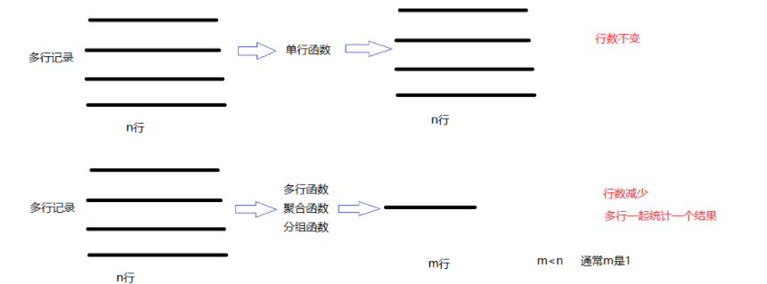
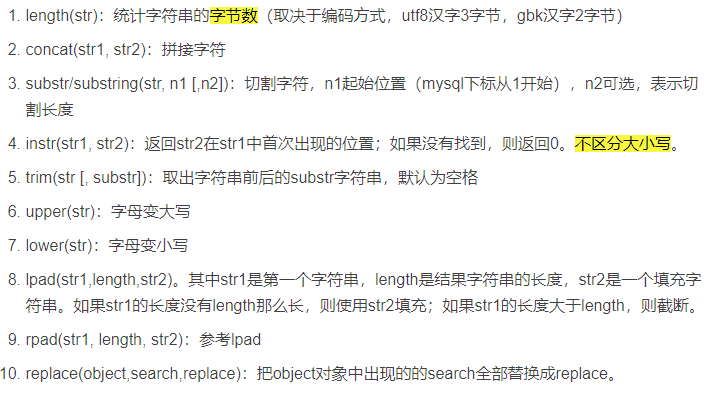

# SQL语句应用二

# 1. 数据库函数

## 1.1 概述

​        每个数据库都会在标准的 SQL 基础上扩展一些函数，这些函数用于进行数据处理或复杂计算 ，它们通过对一组数据进行计算，得到最终需要的输出结果。函数一般都会有一个或者多个输入，这些输入被称为函数的参数，函数内部会对这些参数进行判断和计算，最终只有一个值作为返回值 。 函数可以出现在 SQL 语句的各个位置，比较常用的位置是 select 之后和 where 子句中 。

## 1.2 数据库函数分类

### 1.2.1 单行函数

- 单行函数对每行输入值单独计算，每行得到一个计算结果返回给用户。

- 例如：

  ~~~ 
  求平均值的avg，求最大值的max，求最小值的min，求总和sum，求个数的count等
  ~~~

### 1.2.2 多行函数

- 多行函数对多行输入值整体计算，最后只会得到一个结果。

  ~~~ 
  数学函数、字符串函数、日期时间函数、条件判断函数、窗口函数等
  ~~~

  

## 1.3 单行函数用法

### 1.3.1 概述

- 每个数据库都包含了大量的单行函数 ， 这些函数 的用法也存在一些差异，但有一点是相同的一一每个数据库都会为一些常用的计算功能提供相应的函数。数学函数、字符串函数、日期时间函数、加密函数、系统信息函数、条件判断函数等等

### 1.3.2 数据准备

~~~ sql
/*
SQLyog Community v13.1.7 (64 bit)
MySQL - 8.0.26 : Database - gecdb
*********************************************************************
*/

/*!40101 SET NAMES utf8 */;

/*!40101 SET SQL_MODE=''*/;

/*!40014 SET @OLD_UNIQUE_CHECKS=@@UNIQUE_CHECKS, UNIQUE_CHECKS=0 */;
/*!40014 SET @OLD_FOREIGN_KEY_CHECKS=@@FOREIGN_KEY_CHECKS, FOREIGN_KEY_CHECKS=0 */;
/*!40101 SET @OLD_SQL_MODE=@@SQL_MODE, SQL_MODE='NO_AUTO_VALUE_ON_ZERO' */;
/*!40111 SET @OLD_SQL_NOTES=@@SQL_NOTES, SQL_NOTES=0 */;
CREATE DATABASE /*!32312 IF NOT EXISTS*/`gecdb` /*!40100 DEFAULT CHARACTER SET utf8mb4 COLLATE utf8mb4_0900_ai_ci */ /*!80016 DEFAULT ENCRYPTION='N' */;

USE `gecdb`;

/*Table structure for table `t_department` */

DROP TABLE IF EXISTS `t_department`;

CREATE TABLE `t_department` (
  `did` int NOT NULL AUTO_INCREMENT COMMENT '部门编号',
  `dname` varchar(20) CHARACTER SET utf8mb4 COLLATE utf8mb4_0900_ai_ci NOT NULL COMMENT '员工名称',
  `description` varchar(200) DEFAULT NULL COMMENT '员工简介',
  PRIMARY KEY (`did`),
  UNIQUE KEY `dname` (`dname`)
) ENGINE=InnoDB AUTO_INCREMENT=7 DEFAULT CHARSET=utf8mb4 COLLATE=utf8mb4_0900_ai_ci;

/*Data for the table `t_department` */
insert  into `t_department`(`did`,`dname`,`description`) 
values (1,'研发部','负责研发工作'),
(2,'人事部','负责人事管理工作'),
(3,'市场部','负责市场推广工作'),
(4,'财务部','负责财务管理工作'),
(5,'后勤部','负责后勤保障工作'),
(6,'测试部','负责测试工作');

/*Table structure for table `t_employee` */

DROP TABLE IF EXISTS `t_employee`;

CREATE TABLE `t_employee` (
  `eid` int NOT NULL AUTO_INCREMENT COMMENT '员工编号',
  `ename` varchar(20) CHARACTER SET utf8mb4 COLLATE utf8mb4_0900_ai_ci NOT NULL COMMENT '员工姓名',
  `salary` double NOT NULL COMMENT '薪资',
  `commission_pct` decimal(3,2) DEFAULT NULL COMMENT '奖金比例',
  `birthday` date NOT NULL COMMENT '出生日期',
  `gender` enum('男','女') CHARACTER SET utf8mb4 COLLATE utf8mb4_0900_ai_ci NOT NULL DEFAULT '男' COMMENT '性别',
  `tel` char(11) CHARACTER SET utf8mb4 COLLATE utf8mb4_0900_ai_ci NOT NULL COMMENT '手机号码',
  `email` varchar(32) CHARACTER SET utf8mb4 COLLATE utf8mb4_0900_ai_ci NOT NULL COMMENT '邮箱',
  `address` varchar(150) DEFAULT NULL COMMENT '地址',
  `work_place` set('广州市','深圳','上海','武汉') CHARACTER SET utf8mb4 COLLATE utf8mb4_0900_ai_ci NOT NULL DEFAULT '广州市' COMMENT '工作地点',
  `hiredate` date NOT NULL COMMENT '入职日期',
  `job_id` int DEFAULT NULL COMMENT '职位编号',
  `mid` int DEFAULT NULL COMMENT '领导编号',
  `did` int DEFAULT NULL COMMENT '部门编号',
  PRIMARY KEY (`eid`),
  KEY `job_id` (`job_id`),
  KEY `did` (`did`),
  KEY `mid` (`mid`),
  CONSTRAINT `t_employee_ibfk_1` FOREIGN KEY (`job_id`) REFERENCES `t_job` (`jid`) ON DELETE SET NULL ON UPDATE CASCADE,
  CONSTRAINT `t_employee_ibfk_2` FOREIGN KEY (`did`) REFERENCES `t_department` (`did`) ON DELETE SET NULL ON UPDATE CASCADE,
  CONSTRAINT `t_employee_ibfk_3` FOREIGN KEY (`mid`) REFERENCES `t_employee` (`eid`) ON DELETE SET NULL ON UPDATE CASCADE
) ENGINE=InnoDB AUTO_INCREMENT=28 DEFAULT CHARSET=utf8mb4 COLLATE=utf8mb4_0900_ai_ci;

/*Data for the table `t_employee` */

insert  into `t_employee`(`eid`,`ename`,`salary`,`commission_pct`,`birthday`,`gender`,`tel`,`email`,`address`,`work_place`,`hiredate`,`job_id`,`mid`,`did`) 
values (1,'孙加一',28000,'0.65','1980-10-08','男','13789098765','shl@163.com','白庙村西街','广州市,深圳','2011-07-28',1,1,1),
(2,'何关',7001,'0.10','1984-08-03','男','13456732145','hj@163.com','半截塔存','深圳,上海','2015-07-03',2,1,1),
(3,'邓的',8000,NULL,'1985-04-09','男','18678973456','dcy666@163.com','宏福苑','广州市,深圳,上海,武汉','2014-07-01',3,7,1),
(4,'黄给',9456,NULL,'1986-09-07','女','13609876789','hxm@163.com','白庙村东街','深圳,上海,武汉','2015-08-08',8,22,3),
(5,'陈工',8567,NULL,'1978-08-02','男','13409876545','ch888@163.com','回龙观','广州市,深圳,上海','2015-01-01',3,7,1),
(6,'韩了',12000,NULL,'1985-04-03','男','18945678986','hgn@163.com','龙泽','深圳,上海','2015-02-02',3,2,1),
(7,'贾子',15700,'0.24','1982-08-02','男','15490876789','jby@163.com','霍营','广州市,武汉','2015-03-03',2,1,1),
(8,'李民的',9000,'0.40','1983-03-02','女','13587689098','lc@163.com','东三旗','深圳,上海,武汉','2015-01-06',4,1,1),
(9,'李工',7897,NULL,'1984-09-01','男','13467676789','lyf@163.com','西山旗','武汉','2015-04-01',3,7,1),
(10,'陆八',8789,NULL,'1989-04-02','男','13689876789','lf@163.com','天通苑一区','广州市','2014-09-03',2,1,1),
(11,'黄母',15678,NULL,'1983-05-07','女','13787876565','hbr@163.com','立水桥','深圳','2014-04-04',4,1,1),
(12,'孙红梅',9000,NULL,'1986-04-02','女','13576234554','shm@163.com','立城苑','上海','2014-02-08',3,7,1),
(13,'李冰冰',18760,NULL,'1987-04-09','女','13790909887','lbb@163.com','王府温馨公寓','广州市','2015-06-07',3,2,1),
(14,'谢吉娜',18978,'0.25','1990-01-01','女','13234543245','xjn@163.com','园中园','上海,武汉','2015-09-05',5,14,2),
(15,'董吉祥',8978,NULL,'1987-05-05','男','13876544333','djx@163.com','小辛庄','广州市,上海','2015-08-04',6,14,2),
(16,'彭超越',9878,NULL,'1988-03-06','男','18264578930','pcy@163.com','西二旗','深圳,武汉','2015-03-06',8,22,3),
(17,'李诗雨',9000,NULL,'1990-08-09','女','18567899098','lsy@163.com','清河','广州市,深圳,武汉','2013-06-09',8,22,3),
(18,'舒淇格',16788,'0.10','1978-09-04','女','18654565634','sqg@163.com','名流花园','广州市,深圳,武汉','2013-04-05',9,18,4),
(19,'周旭飞',7876,NULL,'1988-06-13','女','13589893434','sxf@163.com','小汤山','广州市,深圳','2014-04-07',10,18,4),
(20,'章嘉怡',15099,'0.10','1989-12-11','女','15634238979','zjy@163.com','望都家园','广州市','2015-08-04',11,20,5),
(21,'白露',9787,NULL,'1989-09-04','女','18909876789','bl@163.com','西湖新村','上海','2014-06-05',12,20,5),
(22,'刘烨',13099,'0.32','1990-11-09','男','18890980989','ly@163.com','多彩公寓','广州市,上海','2016-08-09',7,22,3),
(23,'陈纲',13090,NULL,'1990-02-04','男','18712345632','cg@163.com','天通苑二区','深圳','2016-05-09',3,2,1),
(24,'吉日格勒',10289,NULL,'1990-04-01','男','17290876543','jrgl@163.com','北苑','广州市','2017-02-06',12,20,5),
(25,'额日古那',9087,NULL,'1989-08-01','女','18709675645','ergn@163.com','望京','广州市,上海','2017-09-01',3,2,1),
(26,'李红',5000,NULL,'1995-02-15','女','15985759663','lihong@163.com','冠雅苑','广州市','2021-09-01',NULL,NULL,NULL),
(27,'周洲',8000,NULL,'1990-01-01','男','13574528569','zhouzhou@163.com','冠华苑','广州市,深圳','2020-08-15',3,2,NULL);

/*Table structure for table `t_job` */

DROP TABLE IF EXISTS `t_job`;

CREATE TABLE `t_job` (
  `jid` int NOT NULL AUTO_INCREMENT COMMENT '职位编号',
  `jname` varchar(20) CHARACTER SET utf8mb4 COLLATE utf8mb4_0900_ai_ci NOT NULL COMMENT '职位名称',
  `description` varchar(200) DEFAULT NULL COMMENT '职位简介',
  PRIMARY KEY (`jid`),
  UNIQUE KEY `jname` (`jname`)
) ENGINE=InnoDB AUTO_INCREMENT=13 DEFAULT CHARSET=utf8mb4 COLLATE=utf8mb4_0900_ai_ci;

/*Data for the table `t_job` */

insert  into `t_job`(`jid`,`jname`,`description`) 
values (1,'技术总监','负责技术指导工作'),
(2,'项目经理','负责项目管理工作'),
(3,'程序员','负责开发工作'),
(4,'测试员','负责测试工作'),
(5,'人事主管','负责人事管理管理'),
(6,'人事专员','负责人事招聘工作'),
(7,'运营主管','负责市场运营管理工作'),
(8,'市场员','负责市场推广工作'),
(9,'财务主管','负责财务工作'),
(10,'出纳','负责出纳工作'),
(11,'后勤主管','负责后勤管理工作'),
(12,'网络管理员','负责网络管理');

/*!40101 SET SQL_MODE=@OLD_SQL_MODE */;
/*!40014 SET FOREIGN_KEY_CHECKS=@OLD_FOREIGN_KEY_CHECKS */;
/*!40014 SET UNIQUE_CHECKS=@OLD_UNIQUE_CHECKS */;
/*!40111 SET SQL_NOTES=@OLD_SQL_NOTES */;

~~~

### 1.3.2 数学函数

#### 函数名

1. round(num, 2)：四舍五入，保留两位小数
2. ceil(num)：向上取整
3. floor(num)：向下取整
4. truncate(num, 2)：从小数点后两位直接截断，比如truncate(3.1415926, 3) = 3.141
5. mod(num, 2)：求余数 num % 2

#### 用法

~~~ sql
#单行函数
#演示数学函数
#在“t_employee”表中查询员工无故旷工一天扣多少钱，
#分别用CEIL、FLOOR、ROUND、TRUNCATE函数。
#假设本月工作日总天数是22天，
#旷工一天扣的钱=salary/22。
SELECT ename,salary/22,CEIL(salary/22),
FLOOR(salary/22),ROUND(salary/22,2),
TRUNCATE(salary/22,2) FROM t_employee; 
~~~

### 1.3.3 字符函数

#### 函数名

#### 用法

~~~ sql
#字符串函数
#mysql中不支持 + 拼接字符串，需要调用函数来拼接
#（1）在“t_employee”表中查询员工姓名ename和电话tel，
#并使用CONCAT函数
SELECT CONCAT(ename,tel) FROM t_employee;

#（2）在“t_employee”表中查询薪资高于15000的男员工姓名，
#并把姓名处理成“张xx”的样式。
#LEFT（s，n）函数表示取字符串s最左边的n个字符，
#而RPAD（s，len，p）函数表示在字符串s的右边填充p使得字符串长度达到len。
SELECT  RPAD(LEFT(ename,1),3,'x'),salary
FROM t_employee
WHERE salary>15000 AND gender ='男';

#（3）在“t_employee”表中查询薪资高于10000的男员工姓名、
#姓名包含的字符数和占用的字节数。
SELECT ename,CHAR_LENGTH(ename) AS 占用字符数,LENGTH(ename) AS 占用字节数量
FROM t_employee
WHERE salary>10000 AND gender ='男';

#（4）在“t_employee”表中查询薪资高于10000的男员工姓名和邮箱email，
#并把邮箱名“@”字符之前的字符串截取出来。
SELECT ename,email,
SUBSTRING(email,1, POSITION('@' IN email)-1)
FROM t_employee
WHERE salary > 10000 AND gender ='男';

#mysql中 SUBSTRING截取字符串位置，下标从1开始，不是和Java一样从0开始。
#mysql中 position等指定字符串中某个字符，子串的位置也不是从0开始，都是从1开始。

SELECT TRIM('    hello   world   '); #默认是去掉前后空白符
~~~

### 1.3.4 日期函数

#### 函数名

1. now()：当前系统时间，1997-06-03 19:23:12

2. curdate()：当前系统时间的日期，1997-06-03

3. curtime()：当前系统时间的时间，19:23:12

4. year()：年份，1997

5. month()：月，6

6. monthname()：英文形式，June

7. day()：日， 3

8. hour()：小时， 19

9. minute()：分钟， 23

10. second()：秒， 12

11. str_to_date(“1997-06-03 19:23:12”, "%Y-%m-%d %H:%i:%s)：通过后面的模式将前面的字符串进行转换成date格式

12. date_format("1997/6/3", "%Y年%m月%d日")：将日期转为字符，1997年6月3日

13. DATEDIFF(date1,date2)/TIMEDIFF(time1,time2)：返回date1-date2的日期间隔/返回time1-time2的时间间隔

    函数中日期时间类型说明

    | 参数类型 | 描述 | 参数类型      | 描述     |
    | -------- | ---- | ------------- | -------- |
    | YEAR     | 年   | YEAR_MONTH    | 年月     |
    | MONTH    | 月   | DAY_HOUR      | 日时     |
    | DAY      | 日   | DAY_MINUTE    | 日时分   |
    | HOUR     | 时   | DAY_SECOND    | 日时分秒 |
    | MINUTE   | 分   | HOUR_MINUTE   | 时分     |
    | SECOND   | 秒   | HOUR_SECOND   | 时分秒   |
    | WEEK     | 星期 | MINUTE_SECOND | 分秒     |
    | QUARTER  | 一刻 |               |          |

    函数中format参数说明

    | 格式符 | 说明                                                      | 格式符 | 说明                                                    |
    | ------ | --------------------------------------------------------- | ------ | ------------------------------------------------------- |
    | %Y     | 4位数字表示年份                                           | %y     | 两位数字表示年份                                        |
    | %M     | 月名表示月份（January,…）                                 | %m     | 两位数字表示月份（01,02,03，…）                         |
    | %b     | 缩写的月名（Jan.,Feb.,…）                                 | %c     | 数字表示月份（1,2,3…）                                  |
    | %D     | 英文后缀表示月中的天数（1st,2nd,3rd,…）                   | %d     | 两位数字表示表示月中的天数（01,02,…）                   |
    | %e     | 数字形式表示月中的天数（1,2,3,…）                         | %p     | AM或PM                                                  |
    | %H     | 两位数字表示小数，24小时制（01,02,03,…）                  | %h和%I | 两位数字表示小时，12小时制（01,02,03,…）                |
    | %k     | 数字形式的小时，24小时制（1,2,3,…）                       | %l     | 数字表示小时，12小时制（1,2,3,…）                       |
    | %i     | 两位数字表示分钟（00,01,02,…）                            | %S和%s | 两位数字表示秒（00,01,02,…）                            |
    | %T     | 时间，24小时制（hh:mm:ss）                                | %r     | 时间，12小时制（hh:mm:ss）后加AM或PM                    |
    | %W     | 一周中的星期名称（Sunday,…）                              | %a     | 一周中的星期缩写（Sun.,Mon.,Tues.,…）                   |
    | %w     | 以数字表示周中的天数（0=Sunday,1=Monday,…）               | %j     | 以3位数字表示年中的天数（001,002,…）                    |
    | %U     | 以数字表示的的第几周（1,2,3,…）  其中Sunday为周中的第一天 | %u     | 以数字表示年中的年份（1,2,3,…）  其中Monday为周中第一天 |
    | %V     | 一年中第几周（01~53），周日为每周的第一天，和%X同时使用   | %X     | 4位数形式表示该周的年份，周日为每周第一天，和%V同时使用 |
    | %v     | 一年中第几周（01~53），周一为每周的第一天，和%x同时使用   | %x     | 4位数形式表示该周的年份，周一为每周第一天，和%v同时使用 |
    | %%     | 表示%                                                     |        |                                                         |

#### 用法

~~~ sql
#（1）获取系统日期。CURDATE（）和CURRENT_DATE（）函数都可以获取当前系统日期。将日期值“+0”会怎么样？
SELECT CURDATE(),CURRENT_DATE();

#（2）获取系统时间。CURTIME（）和CURRENT_TIME（）函数都可以获取当前系统时间。将时间值“+0”会怎么样？
SELECT CURTIME(),CURRENT_TIME();

#（3）获取系统日期时间值。CURRENT_TIMESTAMP（）、LOCALTIME（）、SYSDATE（）和NOW（）
SELECT CURRENT_TIMESTAMP(),LOCALTIME(),SYSDATE(),NOW();

#（4）获取具体的时间值，比如年、月、日、时、分、秒。
#分别是YEAR（date）、MONTH（date）、DAY（date）、HOUR（time）、MINUTE（time）、SECOND（time）。
SELECT YEAR(CURDATE()),MONTH(CURDATE()),DAY(CURDATE());
SELECT HOUR(CURTIME()),MINUTE(CURTIME()),SECOND(CURTIME());

#为指定日期添加一定的时间
#在这种用法下工 interval 是关键字，需要一个数值，还需要一个单位
SELECT DATE_ADD('1998-01-02',interval 2 MONTH);
#这种用法更简单
select ADDDATE('1998-01-02',3);

#（5）获取两个日期或时间之间的间隔。
#DATEDIFF（date1，date2）函数表示返回两个日期之间间隔的天数。
#TIMEDIFF（time1，time2）函数表示返回两个时间之间间隔的时分秒。

#查询今天距离员工入职的日期间隔天数
SELECT ename,DATEDIFF(CURDATE(),hiredate) FROM t_employee;

#查询现在距离中午放学还有多少时间
SELECT TIMEDIFF(CURTIME(),'12:0:0');

#（6）在“t_employee”表中查询本月生日的员工姓名、生日。
SELECT ename,birthday
FROM t_employee
WHERE MONTH(CURDATE()) = MONTH(birthday);

#(10)#查询入职时间超过5年的
SELECT ename,hiredate,DATEDIFF(CURDATE(),hiredate) 
FROM t_employee
WHERE DATEDIFF(CURDATE(),hiredate)  > 365*5;
~~~

### 1.3.5 条件判断函数

#### 函数名

| 函数                                                         | 功能                                                         |
| ------------------------------------------------------------ | ------------------------------------------------------------ |
| IF(value,t,f)                                                | 如果value是真，返回t,否则返回f                               |
| IFNULL(value1,value2)                                        | 如果value1不为空，返回value1,否则返回value2                  |
| CASE WHEN 条件1  THEN result1 WHEN 条件2  THEN result2 … ELSE resultn END | 依次判断条件，哪个条件满足了，就返回对应的result,所有条件都不满足就返回ELSE的result。如果没有单独的ELSE子句，当所有WHEN后面的条件都不满足时则返回NULL值结果。等价于Java中if...else if.... |
| CASE expr WHEN 常量值1  THEN 值1  WHEN 常量值2  THEN 值2 …  ELSE 值n END | 判断表达式expr与哪个常量值匹配，找到匹配的就返回对应值，都不匹配就返回ELSE的值。如果没有单独的ELSE子句，当所有WHEN后面的常量值都不匹配时则返回NULL值结果。等价于Java中switch....case |

#### 用法

~~~ sql
#条件判断函数
/*
这个函数不是筛选记录的函数，
而是根据条件不同显示不同的结果的函数。
*/
#如果薪资大于20000，显示高薪，否则显示正常
SELECT ename,salary,IF(salary>20000,'高薪','正常')
FROM t_employee;

#计算实发工资
#实发工资 = 薪资 + 薪资 * 奖金比例
SELECT ename,salary,commission_pct,
salary + salary * commission_pct
FROM t_employee;
#如果commission_pct是，计算完结果是NULL

SELECT ename,salary,commission_pct,
salary + salary * IFNULL(commission_pct,0) AS 实发工资
FROM t_employee;

SELECT ename,salary,commission_pct,
ROUND(salary + salary * IFNULL(commission_pct,0),2) AS 实发工资
FROM t_employee;

#查询员工编号，姓名，薪资，等级，等级根据薪资判断，
#如果薪资大于20000，显示“羡慕级别”，
#如果薪资15000-20000，显示“努力级别”，
#如果薪资10000-15000，显示“平均级别”
#如果薪资10000以下，显示“保底级别”
/*mysql中没有if...elseif函数，有case 函数。
等价于if...elseif 
*/
SELECT eid,ename,salary,
CASE WHEN salary>20000 THEN '羡慕级别'
     WHEN salary>15000 THEN '努力级别'
     WHEN salary>10000 THEN '平均级别'
     ELSE '保底级别'
END AS "等级"
FROM t_employee;
~~~

# 2. 多表连接查询

## 2.1 概述

- 关联查询：两个或更多个表一起查询。

  前提条件：这些一起查询的表之间是有关系的（一对一、一对多），它们之间一定是有关联字段，这个关联字段可能建立了外键，也可能没有建立外键。

  比如：员工表和部门表，这两个表依靠“部门编号”进行关联。

## 2.2 多表连接分类

- 内连接：inner join  ... on
- 左连接：A left join B on
- 右连接：A right join B on
- 全外连接

## 2.3 自然连接

### 特点

- 自然连接是一种特殊的[等值连接](https://so.csdn.net/so/search?q=等值连接&spm=1001.2101.3001.7020)，他要求两个关系表中进行连接的必须是相同的属性列（名字相同），无须添加连接条件，并且在结果中消除重复的属性列。

### 实例

- 将t_employee表与t_department表的相同字段did作等值条件

  ~~~ sql
  select * from t_employee NATURAL join t_department;
  ~~~

## 2.4  内连接

### 概述

- 和自然连接区别之处在于内连接可以自定义两张表的不同列字段。
  内连接有两种形式：显式和隐式。
- 隐式的内连接，没有INNER JOIN
- 显示的内连接，一般称为内连接，有INNER JOIN，形成的中间表为两个表经过ON条件过滤后的笛卡尔积。

### 语法

内连接：inner join  ... on

### 输出结果

结果：A表 ∩ B表

### 实例练习

- 因为did在两个表中都有，名字相同，它不知道取哪个表中字段了，错误Column 'did' in field list is ambiguous

  ~~~ sql
  SELECT ename,did,dname
  FROM t_employee INNER JOIN t_department;
  ~~~

- 结果出现“笛卡尔积”现象， A表记录 * B表记录

  ~~~ sql
  SELECT ename,t_department.did,dname
  FROM t_employee INNER JOIN t_department;
  ~~~

- 关联条件可以用on子句编写

  ~~~ sql
  SELECT ename,t_department.did,dname
  FROM t_employee INNER JOIN t_department 
  ON t_employee.did = t_department.did;
  ~~~

- 关联条件可以用on子句编写，where配合

  ~~~ sql
  #查询部门编号为1的女员工的姓名、部门编号、部门名称、薪资等情况
  SELECT ename,gender,t_department.did,dname,salary
  FROM t_employee INNER JOIN t_department 
  ON t_employee.did = t_department.did
  WHERE t_department.did = 1 AND gender = '女';
  ~~~

-  隐式的内连接，没有INNER JOIN

  ~~~ sql
  SELECT ename,t_department.did,dname
  FROM t_employee,t_department where t_employee.did = t_department.did;
  ~~~

## 2.4 左连接

### 概述

- 以第一个关系（左表）为主，在第二个关系（右表）中找到满足条件的元素，并把他们连接起来，如果没有对应的元素，则在相应位置上的值为null

### 语法

左连接：A left join B on

### 输出结果

（1）A表全部

（2）A表- A∩B

### 实例练习

- 此时t_employee （A表）中有 李红和周洲的did是NULL，没有对应部门，t_department（B表）中有 测试部，在员工表中找不到对应记录的。

  ~~~ sql
  #查询所有员工，包括没有指定部门的员工，他们的姓名、薪资、部门编号、部门名称
  SELECT ename,salary,t_department.did,dname
  FROM t_employee LEFT JOIN t_department
  ON t_employee.did = t_department.did;
  ~~~

- 查询没有部门的员工信息，此时的where条件，建议写子表的关联字段is null，这样更准确一点。

  ~~~ sql
  SELECT ename,salary,t_department.did,dname
  FROM t_employee LEFT JOIN t_department
  ON t_employee.did = t_department.did
  WHERE t_employee.did IS NULL;
  ~~~

## 2.5 右连接

### 概述

- 以第一个关系（左表）为主，在第二个关系（右表）中找到满足条件的元素，并把他们连接起来，如果没有对应的元素，则在相应位置上的值为null

### 语法

右连接：A right join B on

### 输出结果

（1）B全表输出
（2）B表- A∩B

### 实例练习

- 此时t_employee （A表）中有 李红和周洲的did是NULL，没有对应部门， t_department（B表）中有 测试部，在员工表中找不到对应记录的。查询所有部门，包括没有对应员工的部门，他们的姓名、薪资、部门编号、部门名称

  ~~~ sql
  SELECT ename,salary,t_department.did,dname
  FROM t_employee RIGHT JOIN t_department
  ON t_employee.did = t_department.did;
  ~~~

- 查询没有员工部门的信息

  ~~~ sql
  SELECT ename,salary,t_department.did,dname
  FROM t_employee RIGHT JOIN t_department
  ON t_employee.did = t_department.did
  WHERE t_employee.did IS NULL;
  ~~~

## 2.6 union

### 概述

- 全外连接是左外连接和右外连接的组合。简单说就是将左外连接和右外连接同时做多一次。做在mysql中没有全连接运算，但是根据全连接的定义，我们可以写成左外连接和右外连接组合起来

### 特点

- 全外连接：full outer join ... on，但是mysql不支持这个关键字，mysql使用union（合并）结果的方式代替
- 两个表要查询的结果字段是一样的
- UNION ALL表示直接合并结果，如果有重复的记录一并显示，ALL去掉表示合并结果时，如果有重复记录，去掉。
- 要实现A∪B的结果，那么必须是合并 查询是A表结果和查询是B表结果的select语句。要实现A∪B的结果，那么必须是合并 查询是A表结果和查询是B表结果的select语句。

### 实例练习

- 两个Select语句的列数是不同的。报以下异常

  ~~~ 
  The used SELECT statements have a different number of columns
  ~~~

  ~~~ sql
  #以下union会报错
  SELECT * FROM t_employee
  UNION
  SELECT * FROM t_department;
  ~~~

- 查询所有员工和所有部门，包括没有指定部门的员工和没有分配员工的部门。

  ~~~ sql
  SELECT *
  FROM t_employee LEFT JOIN t_department
  ON t_employee.did = t_department.did
  
  UNION 
  
  SELECT *
  FROM t_employee RIGHT JOIN t_department
  ON t_employee.did = t_department.did;
  ~~~

# 3. 子查询

## 3.1 概述

- 子查询（Sub Query）或者说内查询（Inner Query），也可以称作嵌套查询（Nested Query），是一种嵌套在其他 SQL 查询的 WHERE 子句中的查询。

## 3.2 SELECT的SELECT中嵌套子查询

- 显示员工薪资和公司平均薪资相差5000元以上的记录。

  ~~~ sql
  SELECT ename AS "姓名",
  	salary AS "薪资",
   ROUND((SELECT AVG(salary) FROM t_employee),2) AS "全公司平均薪资",
   ROUND(salary-(SELECT AVG(salary) FROM t_employee),2) AS "差值"
  FROM t_employee
  WHERE ABS(ROUND(salary-(SELECT AVG(salary) FROM t_employee),2))>5000;
  ~~~

## 3.3 WHERE嵌套子查询

~~~ sql
#取表中第一行员工的姓名和全公司最高的薪资值一起显示。

SELECT ename,salary
FROM t_employee
WHERE salary = (SELECT MAX(salary) FROM t_employee);
~~~

## 3.4 FROM中嵌套子查询

~~~ sql
# 部门的平均薪资
SELECT t_department.did ,dname,pingjun
FROM t_department LEFT JOIN (SELECT did,AVG(salary) AS pingjun FROM t_employee GROUP BY did) temp
ON t_department.did = temp.did;
~~~

