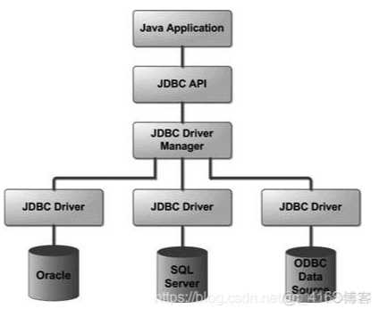
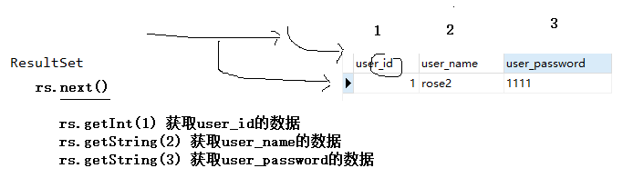
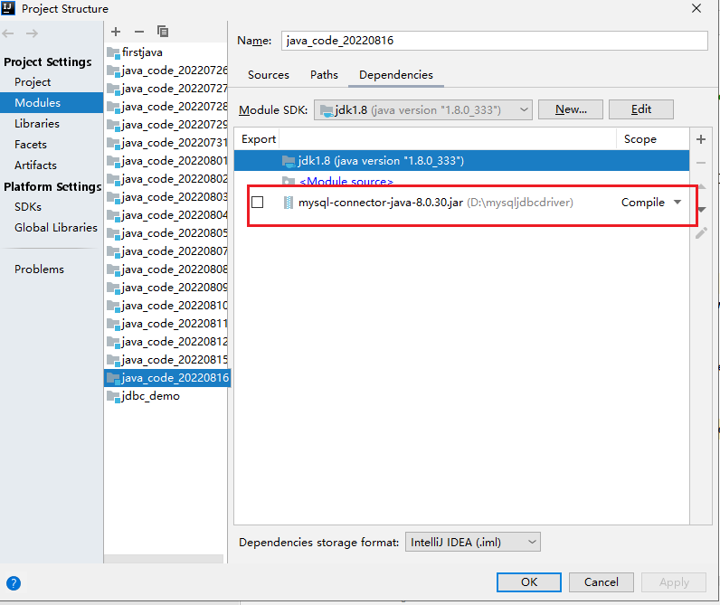
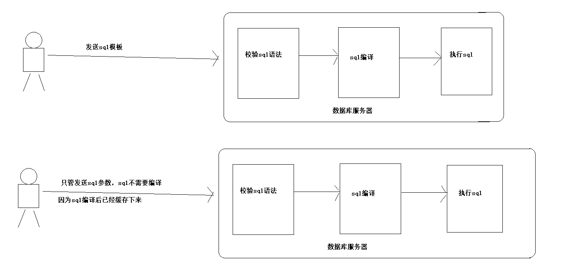

# jdbc应用

# 1. jdbc概述

## 1.1 概述

- JDBC（Java DataBase Connectivity,java数据库连接）是一种用于执行SQL语句的Java API，可以为多种关系数据库提供统一访问，它由一组用Java语言编写的类和接口组成。JDBC提供了一种基准，据此可以构建更高级的工具和接口，使数据库开发人员能够编写数据库应用程序，同时，JDBC也是个商标名。

## 1.2 jdbc架构

### 1.2.1 jdbc架构图

### 1.2.2 jdbc解释

JDBC API支持两层和三层处理模型进行数据库访问，但在一般的JDBC体系结构由两层组成

- JDBC API: 提供了应用程序对JDBC的管理连接。
- JDBC Driver API: 支持JDBC管理到驱动器连接。
- JDBC API的使用驱动程序管理器和数据库特定的驱动程序提供透明的连接到异构数据库。
- JDBC驱动程序管理器可确保正确的驱动程序来访问每个数据源。该驱动程序管理器能够支持连接到多个异构数据库的多个并发的驱动程序。JDBC Driver由各个数据库厂商提供的jar。

# 2. jdbc核心api

## 2.1 DriverManager

- 驱动程序管理器是负责管理驱动程序的，驱动注册以后，会保存在DriverManager中的已注册列表中。

## 2.2 Driver

- 此接口处理与数据库服务器通信。很少直接直接使用驱动程序（Driver）对象，一般使用DriverManager中的对象，它用于管理此类型的对象。它也抽象与驱动程序对象工作相关的详细信息

## 2.3 Connection

- 此接口与接触数据库的所有方法。连接对象表示通信上下文，即，与数据库中的所有的通信是通过此唯一的连接对象。

## 2.4 Statement

- 可以使用这个接口创建的对象的SQL语句提交到数据库。一些派生的接口接受除执行存储过程的参数。

#### execute方法用法

- 两者都兼容（查询、操作语句）

~~~ java
 /*
    * 调用execute方法实现添加数据
    * */
    public static void insertByExecute() throws ClassNotFoundException, SQLException {

        // mysql8 它其实是可以忽略
        // mysql5.7 不忽略以下代码
        Class.forName("com.mysql.cj.jdbc.Driver");

        Connection connection=DriverManager.getConnection(URL,USER,PASS);

        Statement statement = connection.createStatement();

        String insertSql="insert into user(user_name,user_password) values('rose3','1111'),('rose4','1111'),('rose5','1111'),('rose6','1111')";
        String querySql="select * from user";

        /*
        * execute方法的用法：此能执行查询语句及操作语句
        * 返回值为true：则证明执行的是查询语句
        * 返回值为false：则证明执行操作语句
        * 如何获取数据值
        *  如果它是执行操作语句，则通过此getUpdateCount方法，获取返回值数据（操作完成之后影响记录条数）
        *  如果它是执行查询语句，则通过此getResultSet方法，获取RestSet对象，通过此对象遍历查询数据表的数据
        * */
        boolean flag=statement.execute(querySql);

        if(!flag){
            //执行操作语句
            System.out.println("操作完成之后影响记录条数="+statement.getUpdateCount());
        }else {
            //执行查询语句
            ResultSet resultSet = statement.getResultSet();

            //如何遍历查询后的数据表数据
            while (resultSet.next()){
                //起始列的下标为1
                int userId = resultSet.getInt(1);
                String userName=resultSet.getString(2);
                String passWord=resultSet.getString(3);
                System.out.println("userId="+userId+"  userName="+userName+"  passWord="+userName);
            }

            //释放资源
            resultSet.close();
        }

        System.out.println(flag?"执行查询语句":"执行操作语句");
        statement.close();
        connection.close();
    }

~~~

#### ExecuteQuery用法

- 针对查询语句

~~~ java
 public static void queryUserByExecuteQuery() throws ClassNotFoundException, SQLException {

        //1、将驱动加载到内存
        Class.forName("com.mysql.cj.jdbc.Driver");

        //2、创建Connection对象
        Connection connection=DriverManager.getConnection(URL,USER,PASS);

        //3、创建Statement对象
        Statement statement = connection.createStatement();

        //4、编写sql语句
        String querySql="select * from user";

        //5、执行sql
        ResultSet resultSet = statement.executeQuery(querySql);

        //6、迭代游标
        while (resultSet.next()){
            //通过字段下标，获取数据(从1起始)
            /*
            int userId = resultSet.getInt(1);
            String userName = resultSet.getString(2);
            String pass = resultSet.getString(3);
             */
            //直接指明字段名，获取数据
            int user_id = resultSet.getInt("user_id");
            String user_name = resultSet.getString("user_name");
            String pass_word = resultSet.getString("user_password");

            System.out.println("user_id="+user_id);
            System.out.println("user_name="+user_name);
            System.out.println("pass_word="+pass_word);

        }

        if(resultSet!=null){
            resultSet.close();
        }

        if(statement!=null){
            statement.close();
        }

        if(connection!=null){
            connection.close();
        }

    }
~~~

#### executeUpdate方法

- 针对dml的sql语句

~~~ java
/*
    * 调用executeUpdate实现添加
    * */
    public static void insertByexecuteUpdate() throws ClassNotFoundException, SQLException{
        //将驱动加载到内存，反射写法
        Class.forName("com.mysql.cj.jdbc.Driver");

        //创建Connection对象
        Connection connection = DriverManager.getConnection(URL, USER, PASS);

        //创建Statement对象
        Statement statement = connection.createStatement();

        //定义一个插入数据的sql
        String insertSql="insert into user(user_name,user_password) values('rose','1111')";
        //执行sql，返回值就是添加影响行数
        int i = statement.executeUpdate(insertSql);
        System.out.println("i="+i);
        if(i>0){
            System.out.println("数据插入成功");
        }else
            System.out.println("数据插入失败");
        //释放statement对象
        statement.close();
        //释放连接资源
        connection.close();
    }
~~~

## 2.5 PrepareStatement

- PrepareStatement是Statement的一个子接口，可以预编译SQL语句，预编译后的语句被存储在PrepareStatement的对象中，从而可以使用该对象多次高效的执行该SQL语句

## 2.6 ResultSet

- 这些对象保存从数据库后，执行使用Statement对象的SQL查询中检索数据。它作为一个迭代器，可以通过移动它来检索下一个数据。

  

  ~~~ java
  //执行查询语句
  ResultSet resultSet = statement.getResultSet();
  
  //如何遍历查询后的数据表数据
  while (resultSet.next()){
  	//起始列的下标为1
      //获取表的对应字段
  	int userId = resultSet.getInt(1);
  	String userName=resultSet.getString(2);
  	String passWord=resultSet.getString(3);
  	System.out.println("userId="+userId+"  userName="+userName+"  passWord="+userName);
  }
  
  	//释放资源
  	resultSet.close();
  ~~~

  

## 2.7 SQLException

- 这个类用于处理发生在数据库应用程序中的任何错误。

# 3. jdbc连接数据库

~~~ sql
CREATE TABLE `user` (
  `user_id` int(11) NOT NULL AUTO_INCREMENT,
  `user_name` varchar(255) DEFAULT NULL,
  `user_password` varchar(255) DEFAULT NULL,
  PRIMARY KEY (`user_id`)
);
~~~

## 3.1 导入jdbc driver

- 需要包含数据库编程所需的JDBC类的包。项目中需要添加数据库连接的jar包才能进行导入

  

## 3.2 在内存加载驱动

- MySQL5.7版本       驱动名：com.mysql.jdbc.Driver

- MySQL8.0版本       驱动名：com.mysql.cj.jdbc.Driver

  ~~~ java
  //8.0版本可以忽略此步骤
  Class.forName("com.mysql.cj.jdbc.Driver"); 
  ~~~

## 3.3 打开连接

- 需要使用DriverManager.getConnection()方法来创建一个Connection对象，它表示与数据库服务器的物理连接。

  - 参数一 url写法

    ~~~ 
    jdbc:mysql://数据库ip:端口/数据库名?serverTimezone=UTC
    ~~~

  - 参数二：连接数据库用户名

  - 参数三：登录密码

  ~~~ java
  //MySQL8使用时，url需要加参数：serverTimezone=UTC，否则会报错
  String url = "jdbc:mysql://localhost:3306/gecdb?serverTimezone=UTC";
  Connection connection = DriverManager.getConnection(url, "root", "1111");
  ~~~

## 3.4 执行查询

- 需要使用类型为Statement的对象来构建和提交SQL语句到数据库。

  ~~~ sql
  Statement statement = connection.createStatement();
  ResultSet resultSet = statement.executeQuery("select * from user");
  ~~~

## 3.5 关闭连接

- 需要明确地关闭所有数据库资源，而不依赖于JVM的垃圾收集，避免造成资源的浪费。

  ~~~ java
  connection.isClosed()
  ~~~

# 4. 实现CRUD功能

## 4.1 添加数据功能

~~~ java
private static String url = "jdbc:mysql://localhost:3306/gecdb?serverTimezone=UTC"; // 数据库地址
    private static String userName = "root"; // 数据库用户名
    private static String passWord = "1111"; // 数据库密码
    private static Connection conn = null;

    public static Connection getConnection() {
        if (null == conn) {
            try {
                // 加载驱动
                Class.forName("com.mysql.cj.jdbc.Driver");
                // 创建数据库连接
                conn = DriverManager.getConnection(url, userName, passWord);
            } catch (Exception e) {
                e.printStackTrace();
            }
        }
        return conn;
    }

     public static void insert() throws ClassNotFoundException, SQLException {
        // 准备sql
        String sql = "INSERT INTO user(user_name, user_password) VALUES ('test用例1', '123456')";
        Connection conn = getConnection();
        Statement stmt = null;
        try {
            // 创建预编译语句
            stmt = conn.createStatement();
            // 执行SQL
            int len = stmt.executeUpdate(sql);
            //返回sql影响的记录数
            System.out.println(len>0 ? "添加成功" : "添加失败");
        } catch (SQLException e) {
            e.printStackTrace();
            System.out.println("JDBC 插入失败");
        }finally {
            // 关闭资源
            try {
                if(stmt!=null)
                    stmt.close();
                if(conn!=null)
                    conn.close();
            } catch (SQLException e) {
                e.printStackTrace();
            }
        }
    }
~~~

## 4.2 修改数据功能

~~~ java
 public static void update() throws ClassNotFoundException, SQLException {
        // 准备sql
        String sql = "update user set user_name='实例用户2', user_password='654321' where user_id=1";
        Connection conn = getConnection();
        Statement stmt = null;
        try {
            // 创建预编译语句
            stmt = conn.createStatement();
            // 执行SQL
            int len = stmt.executeUpdate(sql);
            //返回sql影响的记录数
            System.out.println(len>0 ? "更新成功" : "更新失败");

        } catch (SQLException e) {
            e.printStackTrace();
            System.out.println("JDBC 插入失败");
        }finally {
            // 关闭资源
            if(stmt!=null){
                stmt.close();
            }

            if(conn!=null){
                conn.close();
            }
        }
    }
~~~

## 4.3 删除数据功能

~~~ java
 public static void delete() throws SQLException {
        // 准备sql
        String sql = "delete from user where user_id = 2";
        Connection conn = getConnection();
        Statement stmt = null;
        try {
            // 创建预编译语句
            stmt = conn.createStatement();
            // 执行SQL
            stmt.executeUpdate(sql);
            System.out.println("JDBC 删除成功");
        } catch (SQLException e) {
            e.printStackTrace();
            System.out.println("JDBC 删除失败");
        }finally {
            //关闭资源
            try {
                if(stmt!=null)
                    stmt.close();
                if(conn!=null)
                    conn.close();
            } catch (SQLException e) {
                e.printStackTrace();
            }
        }
    }
~~~

## 4.4 查询数据功能

~~~ java
  public static void query() throws SQLException {
        // 准备sql
        String sql = "select * from user where user_id = 1";
        Connection conn = getConnection();
        Statement stmt = null;
        ResultSet rs=null;
        try {
            // 创建预编译语句
            stmt = conn.createStatement();
            // 执行SQL
            rs = stmt.executeQuery(sql);
            while (rs.next()) {
                System.out.print(rs.getInt("user_id"));
                System.out.print(rs.getString("user_name"));
                System.out.println(rs.getString("user_password"));
            }
            System.out.println("JDBC 条件查询成功");

        } catch (SQLException e) {
            e.printStackTrace();
            System.out.println("JDBC 条件查询失败");
        }finally {
            // 关闭资源
            try {
                if(rs!=null)
                    rs.close();
                if(stmt!=null)
                    stmt.close();
                if(conn!=null)
                    conn.close();
            } catch (SQLException e) {
                e.printStackTrace();
            }
        }
    }
~~~

# 5. PreparedStatement用法

## 5.1 概述

- PreparedStatement，是java.sql包中的接口，继承了Statement，并与之在两方面有所不同，包含已编译的 SQL 语句。

## 5.2 作用

- 执行效率：Statement 采取直接编译 SQL 语句的方式，扔给数据库去执行，而 PreparedStatement 则先将 SQL 语句预编译一遍，再填充参数，这样效率会高一些。JDK 文档说：SQL 语句被预编译并且存储在 PreparedStatement 对象中，其后可以使用该对象高效地多次执行该语句。

  

- 代码可读性：Statement 中 SQL 语句中需要 Java 中的变量，加就得进行字符串的运算，还需要考虑一些引号、单引号的问题，参数变量越多，代码就越难看，而且会被单引号、双引号搞疯掉；而 PreparedStatement，则不需要这样，参数可以采用“?”占位符代替，接下来再进行参数的填充，这样利于代码的可读性，并且符合面向对象的思想。

  

- 安全性：Statement 由于可能需要采取字符串与变量的拼接，很容易进行 SQL 注入攻击，而 PreparedStatement 由于是预编译，再填充参数的，不存在 SQL 注入问题。

## 5.3 预处理原理

- 每一种数据库都会尽最大努力对预编译语句提供最大的性能优化.因为预编译语句有可能被重复调用.所以语句在被DB的编译器编译后的执行代码被缓存下来,那么下次调用时只要是相同的预编译语句就不需要编译,只要将参数直接传入编译过的语句执行代码中(相当于一个函数)就会得到执行.这并不是说只有一个Connection中多次执行的预编译语句被缓存,而是对于整个DB中,只要预编译的语句语法和缓存中匹配.那么在任何时候就可以不需要再次编译而可以直接执行

## 5.3 什么是SQL攻击

- 在需要用户输入的地方，用户输入的是SQL语句的片段。

## 5.4 演示SQL攻击

- 首先我们需要创建一张用户表，用来存储用户的信息。

  ~~~ sql
  CREATE TABLE sql_user(
           uid   CHAR(32) PRIMARY KEY,
           username        VARCHAR(30) UNIQUE KEY NOT NULL,
           password       VARCHAR(30)
  );
  INSERT INTO sql_user VALUES('U_1001', 'cloud', 'cloud');
  SELECT * FROM sql_user;
  ~~~

- 编写login方法

  ~~~ java
  public static void login(String username, String password) {
  
          Connection con = null;
          Statement stmt = null;
          ResultSet rs = null;
          try {
              con = getConnection();
              stmt = con.createStatement();
              String sql = "SELECT * FROM sql_user WHERE " +
                      "username='" + username +
                      "' and password='" + password + "'";
              System.out.println(sql);
              rs = stmt.executeQuery(sql);
              if(rs.next()) {
                  System.out.println("欢迎" + rs.getString("username"));
              } else {
                  System.out.println("用户名或密码错误！");
              }
          } catch (Exception e) {
              throw new RuntimeException(e);
          } finally {
  
              try {
                  if(rs!=null)
                      rs.close();
                  if(stmt!=null)
                      stmt.close();
                  if(con!=null)
                      con.close();
              } catch (SQLException e) {
                  e.printStackTrace();
              }
  
          }
      }
  ~~~

- 下面是调用这个方法的代码：

  ~~~ java
  login("a' or 'a'='a", "a' or 'a'='a");
  ~~~

- 这行当前会使我们登录成功！因为是输入的用户名和密码是SQL语句片段，最终与我们的login()方法中的SQL语句组合在一起！我们来看看组合在一起的SQL语句：

  ~~~ sql
  SELECT * FROM sql_user WHERE username='a' or 'a'='a' and password='a' or 'a'='a'
  ~~~

## 5.5  使用PreparedStatement解决SQL攻击

- 换成PreparedStatement类，使用占位符注入方式实现解决SQL攻击问题

  ~~~ java
   public static void loginPrepareStatement(String username, String password) {
  
          Connection con = null;
          PreparedStatement pstmt = null;
          ResultSet rs = null;
          try {
              con = getConnection();
  
              String sql = "SELECT * FROM sql_user WHERE username=? and password=?";
              pstmt = con.prepareStatement(sql);
              pstmt.setString(1,username);
              pstmt.setString(2,password);
              rs = pstmt.executeQuery();
              if(rs.next()) {
                  System.out.println("欢迎" + rs.getString("username"));
              } else {
                  System.out.println("用户名或密码错误！");
              }
          } catch (Exception e) {
              throw new RuntimeException(e);
          } finally {
  
              try {
                  if(rs!=null)
                      rs.close();
                  if(pstmt!=null)
                      pstmt.close();
                  if(con!=null)
                      con.close();
              } catch (SQLException e) {
                  e.printStackTrace();
              }
          }
      }
  ~~~

## 5.6 获取自增长键值

### 5.6.1 概述

- mysql中很多表都是有自增长字段，特别是id，添加数据后，需要立刻返回自增长的id值

### 5.6.2 如何实现

- 在用Connection数据库连接对象获取PreparedStatement对象时，要加一个参数

  ~~~ java
  //这里Statement.RETURN_GENERATED_KEYS表示，执行sql后，返回自增长键值
  PreparedStatement pst = connection.prepareStatement(sql, Statement.RETURN_GENERATED_KEYS);
  ~~~

- 执行完成之后，需要从PreparedStatement对象中获取自增长键值

  ~~~ java
   ResultSet rs = pst.getGeneratedKeys(); //方法别调错
  if(rs.next()){ //因为只有一条记录，所以只有一个自增长键值，用if即可
      System.out.println("新员工编号是：" + rs.getObject(1));//因为自增长键值只有一个，所以这里直接getObject(1)即可
  }
  ~~~

## 5.7 批处理

### 5.7.1 概述

- 批量执行一组sql。大多数情况下都是批量执行insert语句。

### 5.7.2 如何实现批量处理

- MySQL服务器端，默认批处理功能没有开启。需要通过参数告知mysql服务器，开启批处理功能。
  在url后面再加一个参数 rewriteBatchedStatements=true

  ~~~ 
  jdbc:mysql://localhost:3306/gecdb?serverTimezone=UTC&rewriteBatchedStatements=true
  ~~~

- PreparedStatement对象调用
  - A：addBatch()
  - B：executeBatch()

- 代码

  ~~~ java
      @Test
      public void test04()throws Exception{
          long start = System.currentTimeMillis();
  
          //把驱动类加载到内存中
          Class.forName("com.mysql.cj.jdbc.Driver");
          //B：获取数据库连接对象
          String url = "jdbc:mysql://localhost:3306/gecdb?serverTimezone=UTC&rewriteBatchedStatements=true";
          Connection connection = DriverManager.getConnection(url, "root", "1111");
          //Connection   ==> 网络编程的Socket
  
          String sql = "insert into t_department values(null,?,?)";//如果把values写错value，批处理不起作用
          PreparedStatement pst = connection.prepareStatement(sql);
          //上面的sql是重复使用的，PreparedStatement对象也重复使用，不用new1000个对象。
          //mysql服务器端也可以优化，提高性能
  
          for(int i=2001; i<=3000; i++){
              //设置1000次？的值
              pst.setObject(1,"测试"+i);
              pst.setObject(2,"测试简介"+i);
  
  //            pst.executeUpdate();//不用设置一次？，就执行一次
              pst.addBatch();//先攒着这些数据，设置完？，sql会重新编译一下，生成一条新的完整的sql
          }
          pst.executeBatch();//最后一口气执行
  
          pst.close();
          connection.close();
  
          long end = System.currentTimeMillis();
          System.out.println("耗时：" + (end-start));//耗时：4625
      }
  ~~~

## 5.8 jdbc事务实现

### 5.8.1 概述

-  事务就是用户定义的一系列数据库操作，这些操作可以视为一个完成的逻辑处理工作单元，要么全部执行，要么全部不执行，是不可分割的工作单元。

### 5.8.2 mysql支持事务操作关键指令

~~~ sql
begin   //启动事务
    sql1
    sql2
    sql3
    .....
    
    rollback  //事务回滚
    
commit  //提交事务
~~~

### 5.8.3 JDBC如何管理事务

- mysql默认是自动提交事务，每执行一条语句成功后，自动提交。需要开启手动提交模式。

  ~~~ java
  Connection连接对象.setAutoCommit(false);//取消自动提交模式，开始手动提交模式
  ~~~

- sql执行成功，别忘了提交事务

  ~~~ 
  Connection连接对象.commit();
  ~~~

- sql执行失败，回滚事务

  ~~~ 
  Connection连接对象.rollback();
  ~~~

### 5.8.4 事务实例

~~~ java
public class TestTransaction {
    @Test
    public void test01()throws Exception{
        //把驱动类加载到内存中
        Class.forName("com.mysql.cj.jdbc.Driver");
        //B：获取数据库连接对象
        String url = "jdbc:mysql://localhost:3306/gecdb?serverTimezone=UTC";
        Connection connection = DriverManager.getConnection(url, "root", "1111");
        //Connection   ==> 网络编程的Socket

        connection.setAutoCommit(false);//取消自动提交模式，开始手动提交模式

        String s1 = "update t_department set description = 'xx' where did = 2";
        String s2 = "update t_department set description = 'yy' what did = 3";

        try(PreparedStatement p1 = connection.prepareStatement(s1);
            PreparedStatement p2 = connection.prepareStatement(s2);) {

            p1.executeUpdate();
            p2.executeUpdate();
            System.out.println("两条更新成功");
            connection.commit();//提交事务
        }catch(SQLException e){
            e.printStackTrace();
            System.out.println("失败");
            connection.rollback();//回滚事务
        }finally {
            connection.close();
        }
    }
}
~~~

