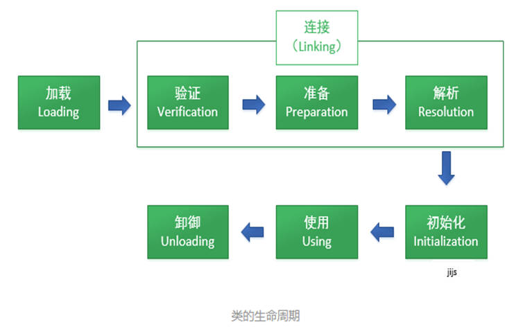
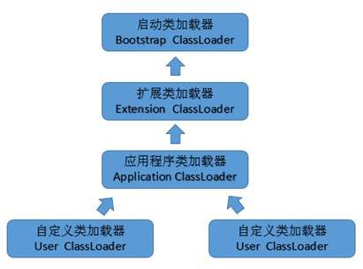
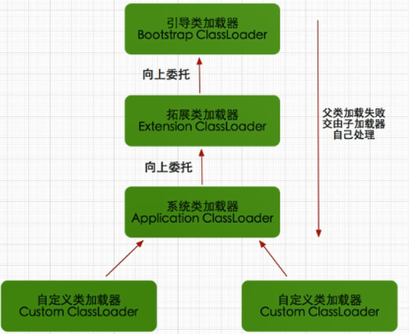

# 反射机制一    主讲   `程工`

# 1. 类的生命周期

## 1.1 类的生命周期图

- 如图以下：

  

## 1.2 类加载过程

### 1.2.1 概述

- 当程序主动使用某个类时，如果该类还未被加载到内存中，系统会通过加载、连接、初始化三个步骤来对该类进行初始化，如果没有意外，JVM将会连续完成这三个步骤，所以有时也把这三个步骤统称为类加载。

### 1.2.2 加载过程

- 加载阶段（重点）
  - 类运行的第一步，也就是类的生命周期的第一个阶段
  - 通过类加载器，将类加载到内存，也就是将类的静态存储结构存储到方法区
  - 生成一个Class类对象，此对象能够指引类的静态存储结构
  
- 验证
  - 主要针对语法、语义是否相符java的规范进行验证
  
- 准备
  - 准备阶段正式为类变量分配内存并设置初始值阶段
  
    ~~~ java
    static int a=0;
    ~~~
  
- 解析
  - 解析阶段是虚拟机将常量池内的符号引用替换为直接引用的过程。
  
    ~~~ 
    javap -v StackStruTest.class
    ~~~
  
    
  
- 初始化
  - initialize（类初始化）即执行<clinit>类初始化方法，大多数情况下，类的加载就完成了类的初始化，有些情况下，会延迟类的初始化。

### 1.2.3 类初始化

#### 概述

- initialize（类初始化）即执行<clinit>类初始化方法，大多数情况下，类的加载就完成了类的初始化，有些情况下，会延迟类的初始化。

#### 哪些操作会导致类的初始化？

（1）运行主方法所在的类，要先完成类初始化，再执行main方法

~~~ java
public class MainTest {

    static {
        System.out.println("main方法所在的类");
    }

    public static void main(String[] args) {

    }
}

~~~

（2）第一次使用某个类型就是在new它的对象，此时这个类没有初始化的话，先完成类初始化再做实例初始化

~~~ java
package com.gec.类初始化;

class A{
    static{
        System.out.println("A类初始化");
    }
}

public class MainTest {

    public static void main(String[] args) {

        A a=new A();

    }
}

~~~

（3）调用某个类的静态成员（类变量和类方法），此时这个类没有初始化的话，先完成类初始化

~~~ java
package com.gec.类初始化;

class B{
    static{
        System.out.println("B类初始化");
    }
    public static void test(){
        System.out.println("B类的静态方法");
    }
}

public class MainTest {

    public static void main(String[] args) {

        B.test();
    }
}

~~~

（4）子类初始化时，发现它的父类还没有初始化的话，那么先初始化父类

~~~ java
package com.gec.类初始化;

class Parent{
    static{
        System.out.println("Parent类初始化");
    }
    public static void test(){
        System.out.println("B类的静态方法");
    }
}

class Child extends Parent
{
    static{
        System.out.println("Child类初始化");
    }
}

public class MainTest {

    public static void main(String[] args) {

        new Child();
    }
}

~~~

（5）通过反射操作某个类时，如果这个类没有初始化，也会导致该类先初始化

~~~ java
package com.gec.类初始化;

class C{
    static{
        System.out.println("C类初始化");
    }
}

public class MainTest {

    public static void main(String[] args) throws ClassNotFoundException {

        Class.forName("com.gec.类初始化.C");
    }
}

~~~

#### 哪些使用类的操作，但是不会导致类的初始化？

（1）使用某个类的静态的常量（static  final）

~~~ java
package com.gec.类初始化;

class D{
    public static final int NUM = 10;
    static{
        System.out.println("D类的初始化");
    }
}

public class MainTest {

    public static void main(String[] args) throws ClassNotFoundException {
        System.out.println(D.NUM);
    }
}

~~~

（2）通过子类调用父类的静态变量，静态方法，只会导致父类初始化，不会导致子类初始化，即只有声明静态成员的类才会初始化

~~~ java
package com.gec.类初始化;

class E{
    static int num = 10;
    static{
        System.out.println("E父类的初始化");
    }
    public static void test(){
        System.out.println("父类的静态方法");
    }
}
class F extends E{
    static{
        System.out.println("F子类的初始化");
    }
}

public class MainTest {

    public static void main(String[] args) throws ClassNotFoundException {
        F.test();
    }
}

~~~

（3）用某个类型声明数组并创建数组对象时，不会导致这个类初始化

~~~ java
package com.gec.类初始化;

class G{
    static{
        System.out.println("G类的初始化");
    }
}

public class MainTest {

    public static void main(String[] args) throws ClassNotFoundException {
        G[] arr = new G[5];
    }
}

~~~

# 2. 类加载器

## 2.1 类加载器作用

- 类加载器负责将.class文件加载到内存中，并为之生成对应的java.lang.Class对象。

## 2.2 类加载器分类

- **第一个：启动类/引导类：Bootstrap ClassLoader**
- **第二个：扩展类加载器：Extension ClassLoader**
- **第三个：应用程序类加载器：Application Classloader**
- **第四个：自定义类加载器**

## 2.3 Bootstrap ClassLoader

### 2.3.1 概述

- 这个类加载器使用C/C++语言实现的，嵌套在JVM内部，java程序无法直接操作这个类。

  它用来加载Java核心类库，如：`JAVA_HOME/jre/lib/rt.jar`、`resources.jar`、`sun.boot.class.path`路径下的包，用于提供jvm运行所需的包。

- 并不是继承自java.lang.ClassLoader，它没有父类加载器
- 出于安全考虑，启动类只加载包名为：java、javax、sun开头的类

### 2.3.2 实例

~~~ java
package com.gec.BootstrapClassLoader用法;

public class BootstrapClassLoaderMainTest {

    public static void main(String[] args) {

        //直接输出null就是使用BootstrapClassLoader
        System.out.println(String.class.getClassLoader());
    }
}

~~~

## 2.4 Extension ClassLoader

### 2.4.1 概述

- Java语言编写，由`sun.misc.Launcher$ExtClassLoader`实现，我们可以用Java程序操作这个加载器派生继承自java.lang.ClassLoader
- 父类加载器为**启动类加载器**
- 从系统属性：java.ext.dirs目录中加载类库，或者从JDK安装目录：jre/lib/ext目录下加载类库。我们就可以将我们自己的包放在以上目录下，就会自动加载进来了。

### 2.4.2 用法

~~~ java
package com.gec.ExtensionClassLoader用法;

import java.net.URL;
import java.net.URLClassLoader;

public class ExtensionClassLoaderMainTest {

    public static void main(String[] args) {

        //应用程序类加载器：Application Classloader的父加载器就是Extension ClassLoader
        ClassLoader extClassLoader=ExtensionClassLoaderMainTest.class.getClassLoader().getParent();
        URL[] urls=((URLClassLoader)extClassLoader).getURLs();
        for(URL url:urls)
        {
            //获取ExtensionClassLoader类路径
            System.out.println(url.toExternalForm());
        }
    }
}

~~~

## 2.5 Application Classloader

### 2.5.1 概述

- Java语言编写，由`sun.misc.Launcher$AppClassLoader`实现。派生继承自java.lang.ClassLoader
- 父类加载器为`Extension ClassLoader`
- 它负责加载`环境变量classpath`或者`系统属性java.class.path`指定路径下的类库
- 它是程序中默认的类加载器，我们Java程序中的类，都是由它加载完成的。

### 2.5.2 实例

~~~ java
package com.gec.ApplicationClassloader用法;

import java.net.URL;
import java.net.URLClassLoader;

public class ApplicationClassloaderMainTest {

    public static void main(String[] args) {

        //Extension ClassLoader的父加载器就是Bootstrap ClassLoader，输出null，证明是Bootstrap ClassLoader
        System.out.println(ApplicationClassloaderMainTest.class.getClassLoader().getParent().getParent());
        //AppClassLoader的父加载器就是ExtClassLoader，证明是ExtClassLoader
        System.out.println(ApplicationClassloaderMainTest.class.getClassLoader().getParent());
        //用户类加载器就是AppClassLoader
        System.out.println(ApplicationClassloaderMainTest.class.getClassLoader());
        System.out.println("获取用户系统的类加载器加载的路径");
        URL urls[]=((URLClassLoader)ApplicationClassloaderMainTest.class.getClassLoader()).getURLs();
        for(URL url:urls)
        {
            System.out.println(url.toExternalForm());
        }

    }
}

~~~

## 2.6 类加载机制—双亲委派机制

### 2.6.1 概述

- jvm对class文件采用的是按需加载的方式，当需要使用该类时，jvm才会将它的class文件加载到内存中产生class对象。在加载类的时候，是采用的**双亲委派机制**，即把请求交给父类处理的一种任务委派模式。

### 2.6.2 工作原理

（1）如果一个`类加载器`接收到了`类加载`的请求，它自己不会先去加载，会把这个请求委托给`父类加载器`去执行。

（2）如果父类还存在父类加载器，则继续向上委托，一直委托到`启动类加载器：Bootstrap ClassLoader`

（3）如果父类加载器可以完成加载任务，就返回成功结果，如果父类加载失败，就由子类自己去尝试加载，如果子类加载失败就会抛出`ClassNotFoundException`异常，这就是`双亲委派模式`

### 2.6.3 实例

- 自定义String类，与jdk的String类具有相同类名

  ~~~ java
  package java.lang;
  
  public class String {
  
      static {
          System.out.println("自定义String的静态代码块输出");
      }
  }
  
  ~~~

- 在主类，使用String类，看将哪个String类加载到内存

  ~~~ java
  package com.gec;
  
  public class StringMainTest {
  
      public static void main(String[] args) {
  
          String message="helloworld";
  
  
      }
  }
  
  ~~~

# 3. 反射机制

## 3.1 简介

- 它允许运行中的 Java 程序获取自身的信息，并且可以操作类或对象的内部属性。
  - 运行期间，通过反射机制可以操作类或者对象内部属性。

## 3.2 反射机制起作用原因

- 通过类加载器将类加载到内存，它就会生成一个`Class类对象`，此对象可以访问类的静态存储结构，因此就可以使到在运行期间（runtime），可以动态操作类或者对象内部属性及方法。

## 3.3 获取Class类对象

### 3.3.1 概述

- Class类说变了也是一个类，只不过是一个比较特殊的类。特殊在哪里呢？特殊在这是一个在类加载过程中由虚拟机生成的，由于表示被加载类的类型信息的对象，要想解剖一个类，必须先要获取到该类的Class对象，Class对象是反射的根源。

### 3.3.2 通过Class.forName实现

- 实例

  ~~~ java
  package 获取Class类的写法一;
  
  class Person
  {
  	
  }
  
  public class MainTest {
  
  	public static void main(String[] args) throws ClassNotFoundException {
  		
  		String clsName="获取Class类的写法一.Person";
  		Class<Person> cls=(Class<Person>) Class.forName(clsName);
  		
  		//仅仅类名
  		System.out.println(cls.getSimpleName());
  		//全限定类名
  		System.out.println(cls.getCanonicalName());
  	}
  }
  
  ~~~

### 3.3.3 通过类名.class，获取Class对象

- 实例

~~~ java
package com.gec.获取Class类的写法;

class Person{

}

public class MainTest {

    public static void main(String[] args) throws ClassNotFoundException {
        Class<MainTest> mainTestClass = MainTest.class;
        ClassLoader classLoader = mainTestClass.getClassLoader();
        Class<Person> personCls = (Class<Person>) classLoader.loadClass("com.gec.获取Class类的写法.Person");

        //仅仅类名
        System.out.println(personCls.getSimpleName());
        //全限定类名
        System.out.println(personCls.getCanonicalName());

    }
}

~~~

### 3.3.4 通过对象，调用getClass，获取Class对象

~~~ java
package 获取Class类的写法三;

class Person
{
	
}

public class MainTest {

	public static void main(String[] args) {
		
		//创建Person对象
		Person p=new Person();
		Class<Person> cls=(Class<Person>) p.getClass();
		
		System.out.println(cls.getCanonicalName());
	}
}

~~~

### 3.3.5 ClassLoader的类加载器对象.loadClass(类型全名称)

~~~ java
package com.gec.获取Class类的写法;

class Person{

}

public class MainTest {

    public static void main(String[] args) throws ClassNotFoundException {
        Class<MainTest> mainTestClass = MainTest.class;
        ClassLoader classLoader = mainTestClass.getClassLoader();
        //通过类加载器获取Class类对象
        Class<Person> personCls = (Class<Person>) classLoader.loadClass("com.gec.获取Class类的写法.Person");

        //仅仅类名
        System.out.println(personCls.getSimpleName());
        //全限定类名
        System.out.println(personCls.getCanonicalName());

    }
}

~~~

## 3.4 通过反射，创建对象

- 通过Class类对象，调用 newInstance方法，创建类对象，注意此方法是调用默认构造器，也可以注入参数，调用带参构造器，实现对象创建。

  ~~~ java
  package 通过反射创建对象;
  
  class Person
  {
  	public int age=40;
  	
  	public Person()
  	{
  		System.out.println("persion init");
  	}
  }
  
  public class MainTest {
  
  	public static void main(String[] args) throws InstantiationException, IllegalAccessException {
  		
  		/*Person p=new Person();
  		System.out.println(p.age);*/
  		//通过反射，创建Person对象
  		//获取Class对象
  		Class<Person> personCls=Person.class;
  		//调用默认构造器，创建Person对象
  		Person p=personCls.newInstance();
  		
  		System.out.println(p.age);
  	}
  }
  
  ~~~

## 3.5 通过反射，访问构造器

- 通过Class对象，调用getConstructor方法，获取构造器对象

- 举例

  ~~~ java
  package 通过反射访问构造器;
  
  import java.lang.reflect.Constructor;
  import java.lang.reflect.InvocationTargetException;
  
  class Person
  {
  	public String name;
  	public int  age;
  	
  	public Person(String name, int age) {
  		this.name = name;
  		this.age = age;
  	}
  }
  
  public class MainTest {
  
  	public static void main(String[] args) throws ClassNotFoundException, InstantiationException, IllegalAccessException, NoSuchMethodException, SecurityException, IllegalArgumentException, InvocationTargetException {
  		
  		//获取Class对象
  		Class<Person> personCls=(Class<Person>) Class.forName("通过反射访问构造器.Person");
  		
  		//获取一个构造器对象
  		Constructor<Person> constructor=personCls.getConstructor(String.class,int.class);
  		//通过此构造器，构造对象
  		Person p=constructor.newInstance("张三",30);
  		
  		System.out.println("name="+p.name+"  age="+p.age);
  		
  	}
  
  }
  
  ~~~

## 3.6 通过反射，访问属性

### 3.6.1 访问非静态属性

- 调用Class对象的getField方法

  - 获取一个类的public成员变量，包括基类的成员变量

- 举例

  ~~~ java
  package 通过反射操作属性;
  
  import java.lang.reflect.Field;
  
  class Person
  {
  	public int age;
  }
  
  public class MainTest {
  
  	public static void main(String[] args) throws ClassNotFoundException, NoSuchFieldException, SecurityException, InstantiationException, IllegalAccessException {
  		
  		/*Person p=new Person();
  		p.age=30;*/
  		
  		//获取Person的Class对象
  		Class<Person> pCls=(Class<Person>) Class.forName("通过反射操作属性.Person");
  		//创建Person对象
  		Person p=pCls.newInstance();
  		//获取属性对象
  		Field field=pCls.getField("age");
  		//针对属性，进行赋值
  		field.set(p, 30);
  		
  		//获取属性值
  		System.out.println(field.get(p));
  	}
  }
  
  ~~~

### 3.6.2 访问私有属性

- getDeclaredField获取一个类的所有成员变量，不包括基类 。
- setAccessible设置属性可访问权限

~~~ java
package com.gec.获取Class类的写法;

import java.lang.reflect.Field;
import java.lang.reflect.InvocationTargetException;

class Person
{
    private int age;
}

public class MainTest {

    public static void main(String[] args) throws ClassNotFoundException, NoSuchMethodException, IllegalAccessException, InvocationTargetException, InstantiationException, NoSuchFieldException {

        //获取Class对象
        Class<Person> pCls=(Class<Person>) Class.forName("com.gec.获取Class类的写法.Person");

        //创建Person对象
        Person p=pCls.newInstance();

        //获取属性对象
        Field field=pCls.getDeclaredField("age");
        //设置属性可访问
        field.setAccessible(true);
        //针对属性，进行赋值
        field.set(p, 30);

        //获取属性值
        System.out.println(field.get(p));
    }
}

~~~

### 3.6.3 访问静态属性

- 静态属性依赖于类而存在，因此在field.set方法，并不需要注入对象

  ~~~ java
  package 通过反射访问静态属性;
  
  import java.lang.reflect.Field;
  
  class Person
  {
  	public static int age;
  }
  
  public class MainTest {
  
  	public static void main(String[] args) throws ClassNotFoundException, NoSuchFieldException, SecurityException, IllegalArgumentException, IllegalAccessException {
  		
  		Class<Person> pCls=(Class<Person>) Class.forName("通过反射访问静态属性.Person");
  		
  		Field field=pCls.getField("age");
  		field.set(null, 30);
  		
  		System.out.println(field.get(null));
  	}
  }
  
  ~~~

### 3.6.4 访问私有静态属性

- getDeclaredField获取一个类的所有成员变量，不包括基类 。
- setAccessible设置属性可访问权限

~~~ java
package com.gec.获取Class类的写法;

import java.lang.reflect.Field;
import java.lang.reflect.InvocationTargetException;

class Person
{
    private static int age;
}

public class MainTest {

    public static void main(String[] args) throws ClassNotFoundException, NoSuchMethodException, IllegalAccessException, InvocationTargetException, InstantiationException, NoSuchFieldException {

        //获取Class对象
        Class<Person> pCls=(Class<Person>) Class.forName("com.gec.获取Class类的写法.Person");

        Field field=pCls.getDeclaredField("age");
        field.setAccessible(true);
        field.set(null, 30);

        System.out.println(field.get(null));
    }
}

~~~

## 3.7 通过反射，访问方法

- 通过调用Class类对象.getMethod(方法名,参数对应的Class类型对象 ....)

- 调用method.invoke方法执行方法

- 举例

  ~~~ java
  package 通过反射调用方法;
  
  import java.lang.reflect.InvocationTargetException;
  import java.lang.reflect.Method;
  
  class Person
  {
  	public void info()
  	{
  		System.out.println("person info");
  	}
  	
  	public String info(String name)
  	{
  		System.out.println("person info name="+name);
  		return name;
  	}
  }
  
  public class MainTest {
  
  	public static void main(String[] args) throws ClassNotFoundException, NoSuchMethodException, SecurityException, InstantiationException, IllegalAccessException, IllegalArgumentException, InvocationTargetException {
  		
  	/*	Person p=new Person();
  		p.info();*/
  		//创建Person的Class对象
  		Class<Person> cls=(Class<Person>) Class.forName("通过反射调用方法.Person");
  		//创建一个Person类的对象
  		Person p=cls.newInstance();
  		//获取方法对象
  		Method method=cls.getMethod("info", null);
  		//执行方法对象
  		method.invoke(p, null);
  		
  		Method method2=cls.getMethod("info", String.class);
  		System.out.println(method2.invoke(p, "张三"));
  		
  	}
  }
  
  ~~~
  

## 3.8 通过反射，访问私有访问

- getDeclaredMethod获取一个类的方法对象，不包括基类 。
- setAccessible设置属性可访问权限

~~~ java
package com.gec.获取Class类的写法;

import java.lang.reflect.InvocationTargetException;
import java.lang.reflect.Method;

class Person
{
    private void info()
    {
        System.out.println("person info");
    }

    private String info(String name)
    {
        System.out.println("person info name="+name);
        return name;
    }
}

public class MainTest {

    public static void main(String[] args) throws ClassNotFoundException, NoSuchMethodException, IllegalAccessException, InvocationTargetException, InstantiationException, NoSuchFieldException {

        //获取Class对象
        Class<Person> cls=(Class<Person>) Class.forName("com.gec.获取Class类的写法.Person");

        //创建一个Person类的对象
        Person p=cls.newInstance();
        //获取方法对象
        Method method=cls.getDeclaredMethod("info", null);
        method.setAccessible(true);
        //执行方法对象
        method.invoke(p, null);
        Method method2=cls.getDeclaredMethod("info", String.class);
        method2.setAccessible(true);

        System.out.println(method2.invoke(p, "张三"));

    }
}

~~~

## 3.9 通过反射机制操作数组

### 3.9.1 概述

- 在java.lang.reflect包下还提供了一个Array类，Array对象可以代表所有的数组。程序可以通过使用Array类来动态的创建数组，操作数组元素等。

  Array类提供了如下几个方法：

  public static Object newInstance(Class<?> componentType, int... dimensions)：创建一个具有指定的组件类型和维度的新数组。

  public static void setXxx(Object array,int index,xxx value)：将array数组中[index]元素的值修改为value。此处的Xxx对应8种基本数据类型，如果该属性的类型是引用数据类型，则直接使用set(Object array,int index, Object value)方法。

  public static xxx getXxx(Object array,int index,xxx value)：将array数组中[index]元素的值返回。此处的Xxx对应8种基本数据类型，如果该属性的类型是引用数据类型，则直接使用get(Object array,int index)方法。

### 3.9.2 回顾数组定义

~~~ java
int []a={1,2,3,4};
int []a=new int[]{1,2,3,4}
int []a=new int[4];
~~~

### 3.9.3 如何通过反射初始数组

~~~ java
package 操作数组;

import java.lang.reflect.Array;
import java.util.Scanner;

public class MainTest {
	
	private static Scanner sc=new Scanner(System.in);

	public static void main(String[] args) throws NegativeArraySizeException, ClassNotFoundException {
		
		/*System.out.println("请输入数组存储的数据类型");
		String type=sc.nextLine();
		*/
		
		//通过反射，创建一个数组，长度为3，存储int数据类型
		//参数一：数组存储的数据类型
		//参数二：存储3个数据
		int[] arraysObj=(int[]) Array.newInstance(int.class, 3);
		
		/*
		 * 参数一：数组名
		 * 参数二：数组下标
		 * 参数三：赋值
		 * */
		Array.set(arraysObj, 0, 100);
		Array.set(arraysObj, 1, 200);
		Array.set(arraysObj, 2, 300);
		
		System.out.println(Array.get(arraysObj, 0));
		System.out.println(Array.get(arraysObj, 1));
		System.out.println(Array.get(arraysObj, 2));
		
		//int []a=new int[3];
		
		sc.close();

	}

}

~~~

### 3.9.4 动态设置数组类型

- 我通常使用像下面的代码获得基本类型的类对象

  ~~~ java
     public static Class getClass(String className) throws ClassNotFoundException {
          if("int" .equals(className)) return int.class;
          if("long".equals(className)) return long.class;
          if("String".equals(className)) return String.class;
          return Class.forName(className);
      }
  ~~~

- 一旦你获得一个类型的`Class`对象，很简单就能获得这个类型的数组的`Class`对象。这个解决方案，或者叫它解决办法，是创建指定类型的空数组并通过空数组获得`Class`对象。这并不很优雅，但是有效。代码如下：

  ~~~ java
  Class theClass = getClass(theClassName);
  Class stringArrayClass = Array.newInstance(theClass, 0).getClass();
  //为了确保Class对象确实是一个数组，可以调用Class.isArray()方法来检查
  System.out.println(stringArrayClass.isArray());
  ~~~

- 动态赋值

  ~~~ java
  Class theClass = getClass("int");
  
  Class stringArrayClass = Array.newInstance(theClass, 1).getClass();
  
  Object arrayObj=Array.newInstance(theClass, 1);
  	
  Array.set(arrayObj, 0, 123);
  ~~~

  

