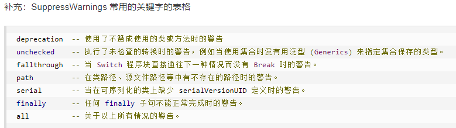
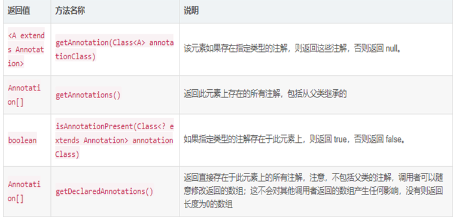

# 注解用法     主讲   程工

# 1. 注解概述

## 1.1 注解简介

- Java 注解（Annotation）又称 Java 标注，是 JDK5.0 引入的一种注释机制。Java 语言中的类、方法、变量、参数和包等都可以被标注。和 Javadoc 不同，Java 标注可以通过反射获取标注内容。在编译器生成类文件时，标注可以被嵌入到字节码中。Java 虚拟机可以保留标注内容，在运行时可以获取到标注内容 。 当然它也支持自定义 Java 标注。

# 2. 内置的注解

## 2.1 简介

### 2.1.1 作用在代码的注解是

- @Override - 检查该方法是否是重写方法。如果发现其父类，或者是引用的接口中并没有该方法时，会报编译错误。
- @Deprecated - 标记过时方法。如果使用该方法，会报编译警告。
- @SuppressWarnings - 指示编译器去忽略注解中声明的警告。

### 2.1.2 作用在其他注解的注解(或者说 元注解)是:

@Retention - 标识这个注解怎么保存，是只在代码中，还是编入class文件中，或者是在运行时可以通过反射访问。
@Documented - 标记这些注解是否包含在用户文档中。
@Target - 标记这个注解应该是哪种 Java 成员。
@Inherited - 标记这个注解是继承于哪个注解类(默认 注解并没有继承于任何子类)

### 2.1.3 从 Java 7 开始，额外添加了 3 个注解:

@SafeVarargs - Java 7 开始支持，忽略任何使用参数为泛型变量的方法或构造函数调用产生的警告。
@FunctionalInterface - Java 8 开始支持，标识一个匿名函数或函数式接口。
@Repeatable - Java 8 开始支持，标识某注解可以在同一个声明上使用多次。

## 2.2 Override

- @Override注解
  - 此注解作用于方法，作用于此方法的注解，意味此方法受重写规则的约束，否则不能编译成功

- 举例

  ~~~ java
  package 基础Annontation.override;
  
  class Parent
  {
  	/*public void info()
  	{
  		
  	}*/
  }
  
  
  class Sub extends Parent
  {
      //error：此info方法不是重写父类的方法，因此编译出错
  	@Override
  	public void info()
  	{
  		
  	}
  	
  }
  
  public class MainTest {
  
  	public static void main(String[] args) {
  		
  		
  
  	}
  
  }
  
  ~~~

## 2.3 Deprecated

- 简介
  - 作用于方法，标注此方法过时

- 举例

  ~~~ java
  package 基础Annontation.deprecated;
  
  class Person
  {
  	@Deprecated
  	public void info()
  	{
  		
  	}
  }
  
  public class MainTest {
  
  	public static void main(String[] args) {
  	}
  
  }
  
  ~~~

## 2.4 SuppressWarnings

- 对于某些不想看到的警告信息，可以通过这个注解来屏蔽。

- 举例

  - 没有使用 @SuppressWarnings(value={"deprecation"}) , 而 Date 属于 java 不再建议使用的类。因此，调用 Date 的 API 时，会产生警告。而右边的途中，使用了 @SuppressWarnings(value={"deprecation"})。因此，编译器对"调用 Date 的 API 产生的警告"保持沉默。
  
  ~~~ java
  public class MainTest {
  
      @SuppressWarnings(value={"deprecation"})
      public static void doSomething(){
          Date date = new Date(113, 8, 26);
          System.out.println(date);
      }
  
      public static void main(String[] args) {
          doSomething();
      }
  }
  ~~~

## 2.5 SafeVarargs

- 抑制类型转换异常的警告信息

  - 此注解只能作用于构造器/final的方法/static的方法，并且参数必须是可变长度的参数

- 举例

  ~~~ java
  	// 这其实不是一个安全的类型检查
      @SafeVarargs
      static void m(List<String>...lists){
          // 先会存储到 array[0] 的位置
          Object[] array = lists;
          List<Integer> tmpList = Arrays.asList(42);
          // array[0] 又保存了tmpList(Integer)进行覆盖
  		// tmpList是一个List对象（类型已经擦除），赋值给Object类型的对象是允许的（向上转型），
          // 能够编译通过
          array[0] = tmpList;
          // 实际取出来的应该是 42
          String s = lists[0].get(0);
  
      }
  ~~~

## 2.6 FunctionalInterface

- Java 8为函数式接口引入了一个新注解@FunctionalInterface，主要用于编译级错误检查，加上该注解，当你写的接口不符合函数式接口定义的时候，编译器会报错。保证该接口只能包含一个抽象方法

# 3. JDK的元Annotation

## 3.1 @Retention

### 3.1.1 简介

- @Retention用来约束注解的生命周期，分别有三个值，源码级别（source），类文件级别（class）或者运行时级别（runtime）

### 3.1.2 RetentionPolicy

- RetentionPolicy 是 Enum 枚举类型，它用来指定 Annotation 的策略。通俗点说，就是不同 RetentionPolicy 类型的 Annotation 的作用域不同

  - RetentionPolicy.CLASS：编译器将把注解记录在class文件中。当运行Java程序时，JVM不可获取注解信息，这是默认值。

    RetentionPolicy.RUNTIME：编译器将把注解记录在class文件中。当运行Java程序时，JVM也可获取注解信息，程序可以通过反射获取该注解信息。

    RetentionPolicy.SOURCE：注解只保留在源代码中，编译器直接丢弃这种注解

## 3.2 @Target

- 简介
  - @Target 用来约束注解可以应用的地方（如方法、类或字段），其中ElementType是枚举类型，其定义如下，也代表可能的取值范围

- 取值范围

  ElementType.ANNOTATION_TYPE: 指定该策略的注解只能修饰注解。
  ElementType.CONSTRUCTOR: 指定该策略的注解只能修饰构造器。
  ElementType.F IELD: 指定该策略的注解只能修饰成员变量。
  ElementType.LOCAL_VARIABLE: 指定该策略的注解只能修饰局部变量 。
  ElementType.METHOD: 指定该策略的注解只能修饰方法定义。
  ElementType.PACKAGE: 指定该策略的注解只能修饰包定义 。
  ElementType.PARAMETER: 指定该策略 的注解可 以修饰参数 。
  ElementType.TYPE: 指定该策略的注解可以修饰类、接口(包括注解类型)或枚举定义 。

## 3.3 @Inherited

- 简介
  - @Inherited元Annotation指定被它修饰的Annotation将具有继承性

- 用法

  ~~~ java
  
  import java.lang.annotation.*;
  
  @Target(ElementType.TYPE)
  @Retention(RetentionPolicy.RUNTIME)
  @Inherited
  public @interface Inheritable
  {
  }
  ~~~

  ~~~ java
  
  // 使用@Inheritable修饰的Base类
  @Inheritable
  class Base
  {
  }
  // TestInheritable类只是继承了Base类，
  // 并未直接使用@Inheritable Annotiation修饰
  public class InheritableTest extends Base
  {
  	public static void main(String[] args)
  	{
  		// 打印TestInheritable类是否具有@Inheritable修饰
  		System.out.println(InheritableTest.class
  			.isAnnotationPresent(Inheritable.class));
  	}
  }
  
  
  ~~~

  

# 4. 自定义Annotation

## 4.1 如何自定义注解

​        定义新的注解类型使用 @interface 关键宇(在原有的 interface关键字前增加@符号)定义一个新的
注解类型与定义一个接口非常像 ，如下代码可定义一个简单的注解类型 。

## 4.2 语法

- 注解不仅可以是这种简单的注解，还可以带成员变量，成员变量在注解定义中以无形参的方法形式
  来声明，其方法名和返回值定义了该成员变量的名字和类型。如下代码可以定义一个有成员变量的注解。

- 语法

  ~~~ java
  @interface 注解名
  {
      //定义成员
      String name();
      String value();
  }
  ~~~

- 举例

  ~~~ java
  //此注解作用于RUNTIME
  @Retention(value=RetentionPolicy.RUNTIME)
  //此注解作用于方法/类
  @Target({ElementType.METHOD,ElementType.TYPE})
  @interface Test
  {
  	//定义注解成员
  	String value();
  	String name();
  }
  
  //使用带成员变量的注解时，需要为成员变量赋值
  @Test(value="xiaoming",name="aaa")
  class MyTest
  {
  	@Test(value="张三",name="bbb")
  	public void info()
  	{
  		
  	}
  }
  ~~~

# 5、注解与反射机制

## 1、简介

- 要提取注解元数据信息，依赖于反射机制，并且注解的生存期配置成：runtime

## 2、如何提取注解的元数据信息

## 3、getAnnotation方法使用

- RetentionPolicy.SOURCE作用域，无法通过反射提取注解对象的元数据信息

  ~~~ java
  package getannotation方法使用;
  
  import java.lang.annotation.ElementType;
  import java.lang.annotation.Retention;
  import java.lang.annotation.RetentionPolicy;
  import java.lang.annotation.Target;
  import java.lang.reflect.Method;
  
  @Retention(value=RetentionPolicy.SOURCE)
  @Target({ElementType.METHOD})
  @interface Anno
  {
  	//定义一个成员
  	String value();
  	
  }
  
  class MyTest
  {
  	@Anno(value="张三")
  	public void info()
  	{
  		
  	}
  }
  
  public class MainTest {
  
  	public static void main(String[] args) throws ClassNotFoundException, NoSuchMethodException, SecurityException {
  		
  		//获取MyTest类的Class对象
  		Class<MyTest> myTestCls=(Class<MyTest>) Class.forName("getannotation方法使用.MyTest");
  		//获取info方法的对象
  		Method infoM=myTestCls.getMethod("info", null);
  		//通过调用getAnnotation方法，获取注解对象
  		Anno anno=infoM.getAnnotation(Anno.class);
  		System.out.println(anno.value());
  	}
  
  }
  
  ~~~

## 4、getAnnotations方法

- RetentionPolicy.RUNTIME作用域，可以获取作用于元素上的所有注解对象

- 举例

  ~~~ java
  package getannotation方法使用;
  
  import java.lang.annotation.Annotation;
  import java.lang.annotation.ElementType;
  import java.lang.annotation.Retention;
  import java.lang.annotation.RetentionPolicy;
  import java.lang.annotation.Target;
  import java.lang.reflect.Method;
  
  @Retention(value=RetentionPolicy.RUNTIME)
  @Target({ElementType.METHOD})
  @interface Anno
  {
  	//定义一个成员
  	String value();
  	
  }
  
  @Retention(value=RetentionPolicy.RUNTIME)
  @Target({ElementType.METHOD})
  @interface Anno2
  {
  	//定义一个成员
  	String value();
  	
  }
  
  
  class MyTest
  {
  	@Anno(value="张三")
  	@Anno2(value="李四")
  	public void info()
  	{
  		
  	}
  }
  
  public class MainTest {
  
  	public static void main(String[] args) throws ClassNotFoundException, NoSuchMethodException, SecurityException {
  		
  		//获取MyTest类的Class对象
  		Class<MyTest> myTestCls=(Class<MyTest>) Class.forName("getannotation方法使用.MyTest");
  		//获取info方法的对象
  		Method infoM=myTestCls.getMethod("info", null);
  		//获取作用于元素上的所有注解对象
  		Annotation []annotatinArrays=infoM.getAnnotations();
  		System.out.println(annotatinArrays.length);
  		for(Annotation annoObj:annotatinArrays)
  		{
  			if(annoObj instanceof Anno)
  			{
  				System.out.println("注解的元数据值="+((Anno)annoObj).value());
  			}else if(annoObj instanceof Anno2)
  			{
  				System.out.println("注解的元数据值="+((Anno2)annoObj).value());
  			}
  		}
  		
  	}
  
  }
  
  ~~~

## 5、isAnnotationPresent方法

- 此方法判断元素是否作用注解，如果此方法作用于此注解，则返回true，否则返回false

- 举例

  ~~~ java
  package getannotation方法使用;
  
  import java.lang.annotation.Annotation;
  import java.lang.annotation.ElementType;
  import java.lang.annotation.Retention;
  import java.lang.annotation.RetentionPolicy;
  import java.lang.annotation.Target;
  import java.lang.reflect.Method;
  
  @Retention(value=RetentionPolicy.RUNTIME)
  @Target({ElementType.METHOD})
  @interface Anno
  {
  	//定义一个成员
  	String value();
  	
  }
  
  @Retention(value=RetentionPolicy.RUNTIME)
  @Target({ElementType.METHOD})
  @interface Anno2
  {
  	//定义一个成员
  	String value();
  	
  }
  
  
  class MyTest
  {
  	public void info()
  	{
  		
  	}
  	
  	public void info2()
  	{
  		
  	}
  	
  	@Anno(value="张三")
  	public void info3()
  	{
  		
  	}
  }
  
  public class MainTest {
  
  	public static void main(String[] args) throws ClassNotFoundException, NoSuchMethodException, SecurityException {
  		
  		//获取MyTest类的Class对象
  		Class<MyTest> myTestCls=(Class<MyTest>) Class.forName("getannotation方法使用.MyTest");
  		//获取info方法的对象
  		Method infoM=myTestCls.getMethod("info", null);
  		
  		System.out.println(infoM.isAnnotationPresent(Anno.class));
  		
  
  		
  	}
  
  }
  
  ~~~

  