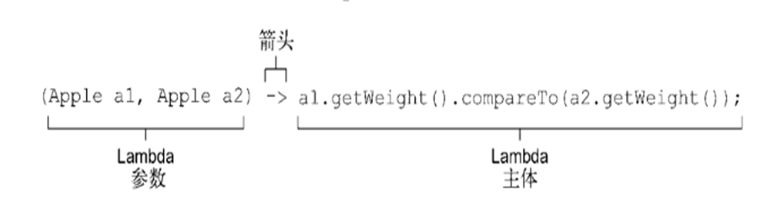
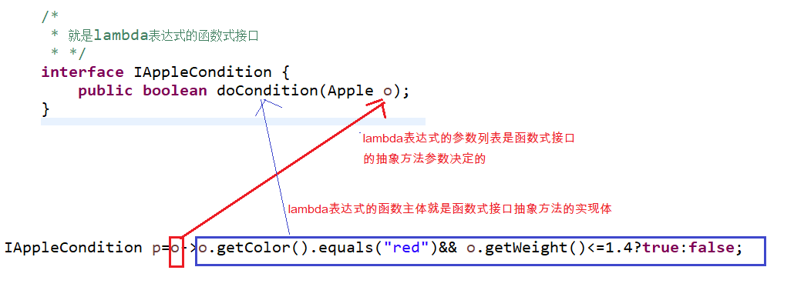
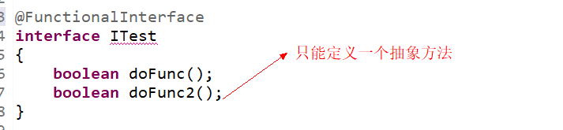

# Lambda表达式 主讲  程工

# 一、行为参数化

## 1、简介

- 参数具有行为逻辑实现的功能效果

## 2、举例

- 过滤出绿色苹果

  ~~~ java
  	// 只过滤输出“绿色”苹果
  	public static Apple[] getAppleByGreen() {
  		// 定义一个数组，存储过滤后的苹果对象
  		Apple[] outAppleArray = new Apple[5];
  		// 定义一个下标
  		int index = 0;
  
  		for (Apple o : appleArrays) {
  			if (o.getColor().equals("green")) {
  				outAppleArray[index++] = o;
  			}
  		}
  
  		return outAppleArray;
  
  	}
  ~~~

- 将颜色作为参数

  ~~~ java
  	public static Apple[] getAppleByColor(String color) {
  		// 定义一个数组，存储过滤后的苹果对象
  		Apple[] outAppleArray = new Apple[5];
  		// 定义一个下标
  		int index = 0;
  
  		for (Apple o : appleArrays) {
  			if (o.getColor().equals(color)) {
  				outAppleArray[index++] = o;
  			}
  		}
  
  		return outAppleArray;
  
  	}
  ~~~

- 在一个方法中过滤想要过滤的属性

  ~~~ java
  	public static Apple[] getAppleByWeightAndColor(double weight, String color) {
  		// 定义一个数组，存储过滤后的苹果对象
  		Apple[] outAppleArray = new Apple[5];
  		// 定义一个下标
  		int index = 0;
  
  		for (Apple o : appleArrays) {
  			if (o.getWeight() <= weight && o.getColor().equals(color)) {
  				outAppleArray[index++] = o;
  			}
  		}
  
  		return outAppleArray;
  
  	}
  ~~~

- 根据抽象约束过滤

- 使用匿名类

  ~~~ java
  
  interface IAppleCondition {
  	public boolean doCondition(Apple o);
  }
  
  
  // 定义一个工厂类：生产苹果
  class AppleFactory {
  
      .....
  
  	public static Apple[] getAppleByCondition(IAppleCondition condition) {
  
  		// 定义一个数组，存储过滤后的苹果对象
  		Apple[] outAppleArray = new Apple[5];
  		// 定义一个下标
  		int index = 0;
  
  		for (Apple o : appleArrays) {
  			
  			if(condition.doCondition(o))
  			{
  				outAppleArray[index++] = o;
  			}
  		}
  
  		return outAppleArray;
  
  	}
  
  }
  
  public class MainTest {
  
  	public static void main(String[] args) {
  		
  		//匿名内部类的写法
  		Apple[] appleArrays=AppleFactory.getAppleByCondition(new IAppleCondition() {
  			
  			@Override
  			public boolean doCondition(Apple o) {
  				
  				if(o.getColor().equals("green") && o.getWeight()<=1.4)
  				{
  					return true;
  				}
  				
  				return false;
  			}
  		});
      }
  }
  ~~~

- 使用lambda表达式

  ~~~ java
  		Apple[] appleArrays=AppleFactory.getAppleByCondition(o->o.getColor().equals("red")&& o.getWeight()<=1.4?true:false);
  
  ~~~

# 二、Lambda表达式

## 1、简介

- Lambda表达式其实就是一个匿名函数，即没有函数名的函数。

## 2、Lambda表达式特点

- 匿名函数
- 此函数肯定参数列表、函数体、返回值...
- 此匿名函数还可以赋值于一个变量，此变量的数据类型是此函数对应的`函数接口`

## 3、Lambda表达式语法

- 如何定义lambda表达式

  

  - 参数列表:这里它采用了 Comparator 中 compare 方法的参数，两个 Apple。
  - 箭头:把参数和函数主题分开。
  - Lambda主体: 比较两个 Apple 的重量。表达式就是Lambda的返回值了。

- 函数式接口

  - lambda表达式是根据函数接口来实现的

  - lambda表达式的参数部分是根据函数式接口的抽象方法的参数列表来定义

  - lambda表达式的函数主体就是函数式接口的抽象方法的实现体

  - lambda表达式与函数式接口的实现关系

    

# 三、有效lambda表达式

- 实例一

  ~~~ java
  interface ITest
  {
  	public int getStringLen(String s);
  }
  
  ITest p=s->s.length();
  ~~~

- 实例二

  ~~~ java
  interface ITest2
  {
  	public int getStringLen(String s,int a);
  	
  }
  
  	ITest2 p2=(s,a)->{
  			
  			if(a>5)
  			{
  				return s.length();
  			}else
  				return a;
  			
  		};
  ~~~

- 实例三

  ~~~ java
  interface ITest3
  {
  	void add(int x,int y);
  }
  
  ITest3 p3=(int x,int y)->{
  	System.out.println("result:");
  	System.out.println(x+y);
  };
  ~~~

- 实例四

  ~~~ java
  interface ITest4
  {
  	int getValue();
  }
  
  ITest4 p4=()->42;
  System.out.println(p4.getValue());
  ~~~

# 四、函数式接口

## 1、函数式接口的特点

- 函数式接口就是`只定义一个抽象方法`的接口。
- 函数式接口被Lambda表达式所实现的
- Lambda表达式根据函数式接口定义的抽象方法实现

## 2、函数式接口作用

- 整个Lambda表达式能够作为函数式接口的实例

- 举例

  ~~~~  java
  interface ITest4
  {
  	int getValue();
  }
  
  ITest4 p4=()->42;
  System.out.println(p4.getValue());
  ~~~~

# 五、jdk内置的函数接口

## 1、注解@FunctionalInterface

- 这个标注用于表示该接口会设计成一个函数式接口。如果你用 @FunctionalInterface 定义了一个接口，而它却不是函数式接口的话，编译器将返回一个提示原因的错误。

  

## 2、Predicate

- java.util.function.Predicate<T> 接口定义了一个名叫 test 的抽象方法，它接受泛型T 对象，并返回一个 boolean 。这恰恰和你先前创建的一样，现在就可以直接使用了。在你需要表示一个涉及类型 T 的布尔表达式时，就可以使用这个接口。比如，你可以定义一个接受 String对象的Lambda表达式

  ~~~ java
  Predicate<Apple> p2=o->o.getColor().equals("green") && o.getWeight()>=1.3?true:false;
  ~~~

## 3、Consumer

- java.util.function.Consumer<T> 定义了一个名叫 accept 的抽象方法，它接受泛型 T的对象，没有返回（ void ）。你如果需要访问类型 T 的对象，并对其执行某些操作，就可以使用这个接口。比如，你可以用它来创建一个 forEach 方法，接受一个 Integers 的列表，并对其中每个元素执行操作。在下面的代码中，你就可以使用这个 forEach 方法，并配合Lambda来打印列表中的所有元素。

  ~~~ java
  package demo4;
  
  import java.util.function.Consumer;
  
  public class MainTest {
  	
  	public static void foreach(int []arrays,Consumer<Integer> c)
  	{
  		for(int v:arrays)
  		{
  			c.accept(v);
  		}
  		
  	}
  
  	public static void main(String[] args) {
  		
  		int a[]= {10,20,30,40,50};
  		foreach(a, v->System.out.println(v*10));
  
  	}
  
  }
  
  ~~~


## 4. Funtion<T,R>接口

- 代码示例：Funtion<T,R>接口

  在JDK1.8时Map接口增加了很多方法，例如：

  `public default void replaceAll(BiFunction<? super K,? super V,? extends V> function) `按照function指定的操作替换map中的value。

  `public default void forEach(BiConsumer<? super K,? super V> action)`遍历Map集合的每对映射关系，执行“xxx消费型”操作。

- 举例

  ~~~ java
  package com.gec.函数接口;
  
  import java.util.HashMap;
  import java.util.function.Consumer;
  
  interface ITest4
  {
      int getValue();
  }
  
  class Employee{
      private int id;
      private String name;
      private double salary;
      public Employee(int id, String name, double salary) {
          super();
          this.id = id;
          this.name = name;
          this.salary = salary;
      }
      public Employee() {
          super();
      }
      public int getId() {
          return id;
      }
      public void setId(int id) {
          this.id = id;
      }
      public String getName() {
          return name;
      }
      public void setName(String name) {
          this.name = name;
      }
      public double getSalary() {
          return salary;
      }
      public void setSalary(double salary) {
          this.salary = salary;
      }
      @Override
      public String toString() {
          return "Employee [id=" + id + ", name=" + name + ", salary=" + salary + "]";
      }
  
  }
  
  
  public class MainTest {
  
      public static void foreach(int []arrays, Consumer<Integer> c)
      {
          for(int v:arrays)
          {
              c.accept(v);
          }
  
      }
  
      public static void main(String[] args) {
  
          HashMap<Integer,Employee> map = new HashMap<>();
          Employee e1 = new Employee(1, "张三", 8000);
          Employee e2 = new Employee(2, "李四", 9000);
          Employee e3 = new Employee(3, "王五", 10000);
          Employee e4 = new Employee(4, "赵六", 11000);
          Employee e5 = new Employee(5, "钱七", 12000);
  
          map.put(e1.getId(), e1);
          map.put(e2.getId(), e2);
          map.put(e3.getId(), e3);
          map.put(e4.getId(), e4);
          map.put(e5.getId(), e5);
  
          map.replaceAll((k,v)->{
              if(v.getSalary()<10000){
                  v.setSalary(10000);
              }
              return v;
          });
  
      }
  }
  
  ~~~

# 六、方法引用


Lambda表达式是可以简化函数式接口的变量与形参赋值的语法。而方法引用和构造器引用是为了简化Lambda表达式的。当Lambda表达式满足一些特殊的情况时，还可以再简化：

（1）Lambda体只有一句语句，并且是通过调用一个对象的/类现有的方法来完成的

例如：System.out对象，调用println()方法来完成Lambda体

​          Math类，调用random()静态方法来完成Lambda体

（2）并且Lambda表达式的形参正好是给该方法的实参

例如：t->System.out.println(t)

​        () -> Math.random() 都是无参

## 方法引用

方法引用的语法格式：

（1）实例对象名::实例方法		

（2）类名::静态方法

（3）类名::实例方法

说明：

* ::称为方法引用操作符（两个:中间不能有空格，而且必须英文状态下半角输入）
* Lambda表达式的形参列表，全部在Lambda体中使用上了，要么是作为调用方法的对象，要么是作为方法的实参。
* 在整个Lambda体中没有额外的数据。

```java
	
	@Test
	public void test4(){
//		Runnable r = () -> System.out.println("hello lambda");
		Runnable r = System.out::println;//打印空行
		
		//不能简化方法引用，因为"hello lambda"这个无法省略
	}
	
	@Test
	public void test3(){
		String[] arr = {"Hello","java","chai"};
//		Arrays.sort(arr, (s1,s2) -> s1.compareToIgnoreCase(s2));
		
		//用方法引用简化
		/*
		 * Lambda表达式的形参，第一个（例如：s1），正好是调用方法的对象，剩下的形参(例如:s2)正好是给这个方法的实参
		 */
		Arrays.sort(arr, String::compareToIgnoreCase);
	}

	@Test
	public void test1(){
		List<Integer> list = Arrays.asList(1,3,4,8,9);
		
		//list.forEach(t -> System.out.println(t));
		
		//用方法再简化
		list.forEach(System.out::println);
	}
```

## 构造器引用

（1）当Lambda表达式是创建一个对象，并且满足Lambda表达式形参，正好是给创建这个对象的构造器的实参列表。

构造器引用的语法格式：

* 类名::new

示例代码：

~~~ java
//通过供给型接口，提供一个空字符串对象
Supplier<String> s = () -> new String();
//构造器引用
Supplier<String> s2 = String::new;
~~~


