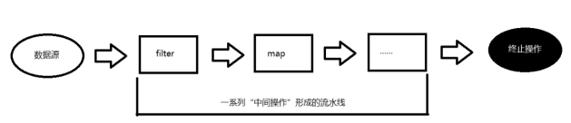

# Stream用法

# 1. Stream概述

## 1.1 为什么java8中加入Stream

- Stream 作为 Java 8 的一大亮点，它与 java.io 包里的 InputStream 和 OutputStream 是完全不同的概念。Java 8 中的 Stream 是对集合（Collection）对象功能的增强，它专注于对集合对象进行各种非常便利、高效的聚合操作（aggregate operation），或者大批量数据操作 (bulk data operation)。

- 举例：求一个集合中字符串长度小于5的数量，java8之前，我们一般这么做

  ~~~ java
  List<String> list = Arrays.asList("java", "scala", "python", "shell", "ruby");
  int num = 0;
  	for(String lan: list) {
  		if(lan.length() < 5) {
  			num++;
  		}
  	}
  System.out.println(num);
  ~~~

- 这段代码逻辑很简单，但是显得很冗长，可读性嘛也就呵呵了。如果用Stream，我们可以这样：

  ~~~ java
  List<String> list = Arrays.asList("java", "scala", "python", "shell", "ruby");
  long num = list.parallelStream().filter(x -> x.length() < 5).count();
  System.out.println(num);
  ~~~

  - 代码量明显减少而且逻辑特别清楚。

## 1.2 什么是Stream

- Stream 不是集合元素，它不是数据结构并不保存数据，它是有关算法和计算的，它更像一个高级版本的 Iterator。Stream 就如同一个迭代器（Iterator），单向，不可往复，数据只能遍历一次，遍历过一次后即用尽了，就好比流水从面前流过，一去不复返。而和迭代器又不同的是，Stream 可以并行化操作，迭代器只能命令式地、串行化操作。顾名思义，当使用串行方式去遍历时，每个 item 读完后再读下一个 item。而使用并行去遍历时，数据会被分成多个段，其中每一个都在不同的线程中处理，然后将结果一起输出。

  

## 1.3 Stream和Collection的区别

- stream本身并不存储数据，数据是存储在对应的collection里，或者在需要的时候才生成的；
- stream不会修改数据源，总是返回新的stream；
- stream的操作是懒执行(lazy)的：仅当最终的结果需要的时候才会执行，比如上面的例子中，结果仅需要前3个长度大于7的字符串，那么在找到前3个长度符合要求的字符串后，filter()将停止执行；

# 2. 创建Stream方法

## 2.1 概述

- 要使用Stream，就必须先创建它。创建Stream有很多种方法

## 2.2 Stream.of()

- 创建`Stream`最简单的方式是直接用`Stream.of()`静态方法，传入可变参数即创建了一个能输出确定元素的`Stream`：

  ~~~ java
  Stream<String> stream = Stream.of("A", "B", "C", "D");
  // forEach()方法相当于内部循环调用，
  // 可传入符合Consumer接口的void accept(T t)的方法引用：
  stream.forEach(System.out::println);
  ~~~

## 2.3 基于Collection

- Collection提供两个方法，获取Stream对象

  ~~~ java
  default Stream<E> stream() 
  返回以此集合作为源的顺序 Stream 。  
  ~~~

  ~~~ java
  default Stream<E> parallelStream() 
  返回可能并行的 Stream与此集合作为其来源。  
  ~~~

- 用法

  ~~~ java
  List<String> list=new ArrayList<>();
  list.add("X");
  list.add("Y");
  list.add("Z");
  Stream<String> stream2 = list.stream();
  stream2.forEach(System.out::println);
  ~~~

## 2.4 基于数组

- Arrays类，提供静态方法，获取Stream

  ~~~ java
  static <T> Stream<T> stream(T[] array) 
  返回顺序Stream与指定的数组作为源。 
  ~~~

- 用法

  ~~~ java
  int []a={1,2,3,4,5};
  IntStream stream = Arrays.stream(a);
  stream.forEach(System.out::println);
  ~~~

## 2.5 无限流

- 创建的数据集合的值为泛型T对象；这样一直创建无限个对象的流，也成为无限流。

  - Stream.iterate，是Stream接口下的一个静态方法，从名字也可以看出，这个静态方法，是以迭代器的形式，创建一个数据流

    ~~~ java
    Stream<Integer> stream = Stream.iterate(1, n->n+1);
    stream.limit(10).forEach(System.out::println);
    ~~~

  - Stream.generate，也是stream中的一个静态方法，静态方法定义如下

    ~~~ java
    Stream<Double> generate = Stream.generate(Math::random);
    generate.forEach(System.out::println);
    ~~~

# 3. 转换方法

## 3.1 概述

- 一个流可以后面跟随零个或多个 intermediate（中间操作） 操作。其目的主要是打开流，做出某种程度的数据映射/过滤，然后返回一个新的流，交给下一个操作使用。这类操作都是惰性化的（lazy），就是说，仅仅调用到这类方法，并没有真正开始流的遍历。只有在 Terminal （终止）操作执行时才会真正的执行这些 Intermediate （中间操作）操作。

## 3.2 Intermediate方法

### 3.2.1 方法

| **方  法**                          | **描  述**                                                   |
| ----------------------------------- | ------------------------------------------------------------ |
| **filter(Predicate p)**             | 接收 Lambda ， 从流中排除某些元素                            |
| **distinct()**                      | 筛选，通过流所生成元素的equals() 去除重复元素                |
| **limit(long maxSize)**             | 截断流，使其元素不超过给定数量                               |
| **skip(long n)**                    | 跳过元素，返回一个扔掉了前 n 个元素的流。若流中元素不足 n 个，则返回一个空流。与 limit(n) 互补 |
| **peek(Consumer** **action)**       | 接收Lambda，对流中的每个数据执行Lambda体操作                 |
| **sorted()**                        | 产生一个新流，其中按自然顺序排序                             |
| **sorted(Comparator com)**          | 产生一个新流，其中按比较器顺序排序                           |
| **map(Function f)**                 | 接收一个函数作为参数，该函数会被应用到每个元素上，并将其映射成一个新的元素。 |
| **mapToDouble(ToDoubleFunction f)** | 接收一个函数作为参数，该函数会被应用到每个元素上，产生一个新的 DoubleStream。 |
| **mapToInt(ToIntFunction f)**       | 接收一个函数作为参数，该函数会被应用到每个元素上，产生一个新的 IntStream。 |
| **mapToLong(ToLongFunction f)**     | 接收一个函数作为参数，该函数会被应用到每个元素上，产生一个新的 LongStream。 |
| **flatMap(Function f)**             | 接收一个函数作为参数，将流中的每个值都换成另一个流，然后把所有流连接成一个流 |

### 3.2.2 filter方法

- filter方法用于通过设置的条件过滤出元素。以下代码片段使用filter方法过滤出空字符串：

  ~~~ java
  List<String>strings = Arrays.asList("abc", "", "bc", "efg", "abcd","", "jkl");
  // 获取空字符串的数量
  long count = strings.stream().filter(string -> string.isEmpty()).count();
  ~~~

### 3.2.3 map方法

- map 方法用于映射每个元素到对应的结果，以下代码片段使用 map 输出了元素对应的平方数，把重复数据去掉：

  ~~~ java
  List<Integer> numbers = Arrays.asList(3, 2, 2, 3, 7, 3, 5);
  // 获取对应的平方数
  List<Integer> squaresList = numbers.stream().map( i -> i*i).distinct().collect(Collectors.toList());
  ~~~

### 3.2.4 sort方法

- sorted 方法用于对流进行排序。以下代码片段使用 sorted 方法对输出的 7 个数进行排序：

  ~~~ java
  List<Integer> numbers = Arrays.asList(3, 2, 2, 3, 7, 3, 5);
  Stream<Integer> sorted = numbers.stream().sorted((v1, v2) -> v1 > v2 ? 1 : -1);
  sorted.forEach(System.out::println);
  ~~~

### 3.2.5 limit方法

- imit 方法用于获取指定数量的流

  ~~~ java
  //希望能够找出前三个最大值，前三名最大的，不重复
  Stream.of(11,2,39,4,54,6,2,22,3,3,4,54,54)
                  .distinct()
                  .sorted((t1,t2) -> Integer.compare(t2, t1))//Comparator接口  int compare(T t1, T t2)
                  .limit(3)
                  .forEach(System.out::println);
  ~~~

### 3.2.6 flatmap方法

- flatMap方法返回的是一个stream，flatMap将流中的当前元素替换为此返回流拆解的流元素；简单理解就是扁平化处理（处理压扁打散再映射处理）

  ~~~ java
  String[] arr = {"hel|lo","wor|ld","ja|va"};
  Arrays.stream(arr)
                  .flatMap(t -> Stream.of(t.split("\\|")))//Function<T,R>接口抽象方法 R apply(T t)  现在的R是一个Stream
                  .forEach(s->{
                      System.out.println(s);
                      System.out.println("-----------");
                  });
  ~~~

## 3.3 终结操作

### 3.3.1 概述

- 终端操作会从流的流水线生成结果。其结果可以是任何不是流的值，例如：List、Integer，甚至是 void。流进行了终止操作后，不能再次使用。

### 3.3.2 终结方法

| **方法**                                   | **描述**                                                     |
| ------------------------------------------ | ------------------------------------------------------------ |
| **boolean** **allMatch(Predicate p)**      | 检查是否匹配所有元素                                         |
| **boolean** **anyMatch**(**Predicate p**)  | 检查是否至少匹配一个元素                                     |
| **boolean** **noneMatch(Predicate  p)**    | 检查是否没有匹配所有元素                                     |
| **Optional<T>** **findFirst()**            | 返回第一个元素                                               |
| **Optional<T>** **findAny()**              | 返回当前流中的任意元素                                       |
| **long** **count()**                       | 返回流中元素总数                                             |
| **Optional<T>** **max(Comparator c)**      | 返回流中最大值                                               |
| **Optional<T>** **min(Comparator c)**      | 返回流中最小值                                               |
| **void** **forEach(Consumer c)**           | 迭代                                                         |
| **T** **reduce(T iden, BinaryOperator b)** | 可以将流中元素反复结合起来，得到一个值。返回 T               |
| **U** **reduce(BinaryOperator b)**         | 可以将流中元素反复结合起来，得到一个值。返回 Optional<T>     |
| **R** **collect(Collector c)**             | 将流转换为其他形式。接收一个 Collector接口的实现，用于给Stream中元素做汇总的方法 |

### 3.3.3 forEach方法

- forEach 方法接收一个 Lambda 表达式，然后在 Stream 的每一个元素上执行该表达式。一般认为，forEach 和常规 for 循环的差异不涉及到性能，它们仅仅是函数式风格与传统 Java 风格的差别。forEach 是 terminal 操作，因此它执行后，Stream 的元素就被“消费”掉了，你无法对一个 Stream 进行两次 terminal 运算。

  ~~~ java
  List<String> list= Arrays.asList("hello","world","java","c++","python");
  list.stream().filter(s -> s.length() > 4).forEach(System.out::println);
  ~~~

### 3.3.4 reduce方法

- Stream 的 reduce 方法，返回单个的结果值，并且reduce操作每处理一个元素总是创建一个新值。常用的方法有average、sum、min、max、count，都可以使用reduce方法实现。

  ~~~ java
   Integer reduce = Stream.of(1,2,4)
                  .reduce(0, (t1,t2) -> t1+t2);//BinaryOperator接口   T apply(T t1, T t2)
  System.out.println(reduce);
  ~~~

### 3.3.5 count方法

- count 是对满足条件的数据进行统计，计算次数

  ~~~ java
  System.out.println(Stream.of(1, 2, 4).count());
  ~~~

### 3.3.6 collect方法

- collect 方法是 Terminal 操作，可以将 Stream 流转换为集合，Collectors 中提供了一些便捷的生成 Collector 的方法

  ~~~ java
          List<String> list = Arrays.asList("apple", "orange", "banana", "pear");
          List<String> collectList = list.stream().filter(s -> s.length() > 5).collect(Collectors.toList());//[orange, banana]
          Set<String> collectSet = list.stream().filter(s -> s.length() > 5).collect(Collectors.toSet());// [orange, banana]
  
          collectList.forEach(System.out::println);
          collectSet.forEach(System.out::println);
  ~~~

  

