# 项目阶段--企业级智能考勤系统

# 一、软件工程

## 1、企业cmmi

## a、需求规格说明书

### b、可行性分析

### c、概要设计

- 描述数据流图

### d、详细设计文档

- 设计数据库表

  - ER图
    - 体现表与表之间的关系

- 以文档的形式描述功能实现

  - uml类图

    - 继承

      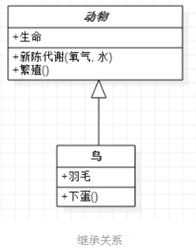

    - 实现

      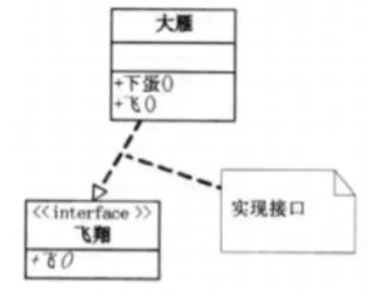

    - 依赖

      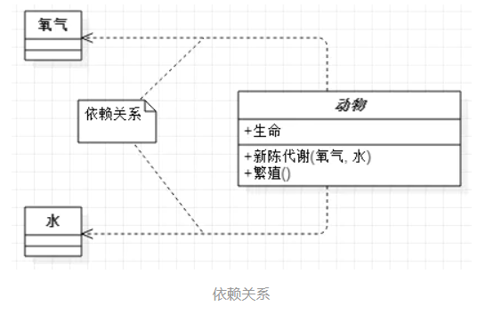

    - 聚合

      - 2133 班级      2133某个同学

        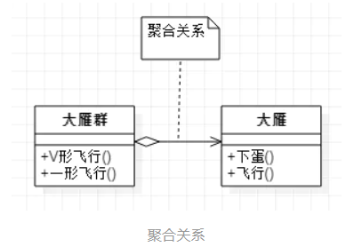

    - 关联

      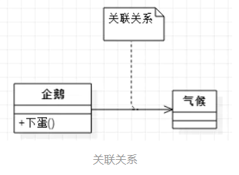

    - 组合

      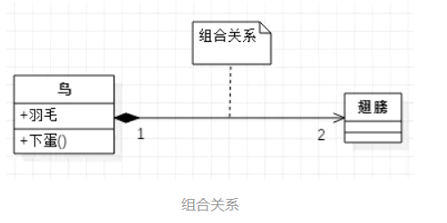

### e、编码阶段

### f、测试

### g、项目完成

### h、项目维护

# 二、项目需求

## 1、需求

- ​	实现智能化的考勤功能，能够针对员工进行智能考勤及智能统计查询

## 2、功能点

### a、登录功能

#### （一）、以管理员身份登录

- 登录成功

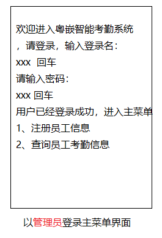

- 登录失败
- 则返回登录页

#### （二）、以普通用户登录

- 登录成功

  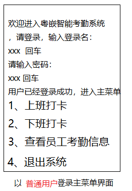

- 登录失败
- 返回登录页

### b、录入员工注册信息及员工考勤信息统计

- 以`管理员身份`操作员工录入注册信息的

- 界面如下：

  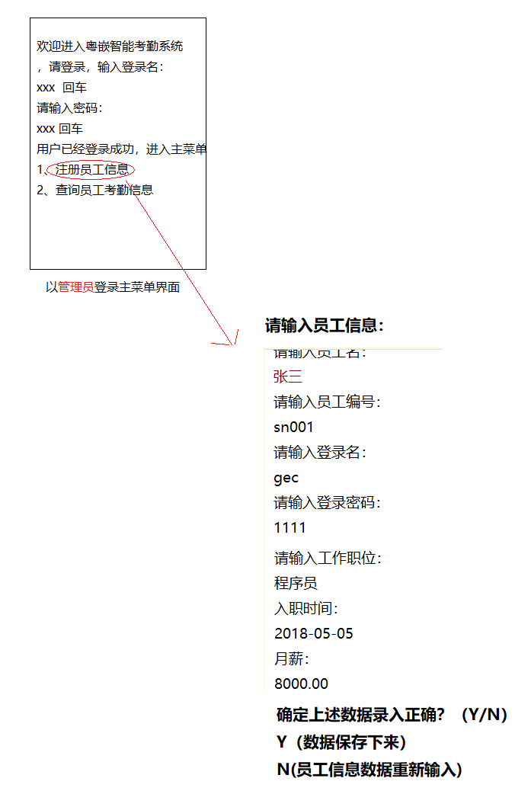

- 按角色登录此系统

  - 管理员角色

    - 注册员工信息

      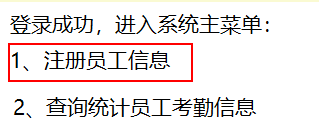

      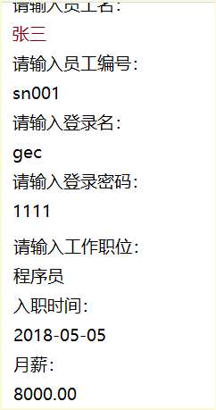

    - 查询企业所有的员工考勤数据

      - 输入员工编号、员工姓名，年月，查询员工的考勤状态，如果不输入查询条件数据，则默认全部员工考勤数据显示

      - 统计每个员工每月的考勤数据（迟到几次、早退几次、旷工几次、正常几次）

        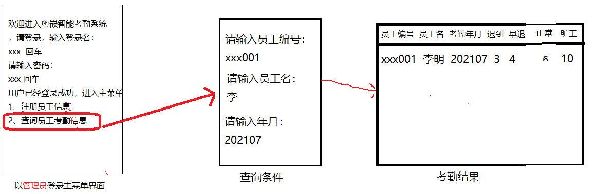

### c、普通员工打卡

- 以普通员工身份登录系统，进入员工打卡的主菜单

  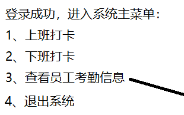

- 选1：上班打卡
- 选2：下班打卡

### d、查看普通员工考勤信息

- 只能查看`自身`的考勤数据

  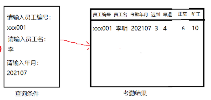

# 三、项目架构

## 1、技术点

- 多线程

- 网络编程

- 集合

- 面向对象

- 数据库

  ....

- 客户端与服务器，它们之间以tcp/ip协议进行数据通讯

  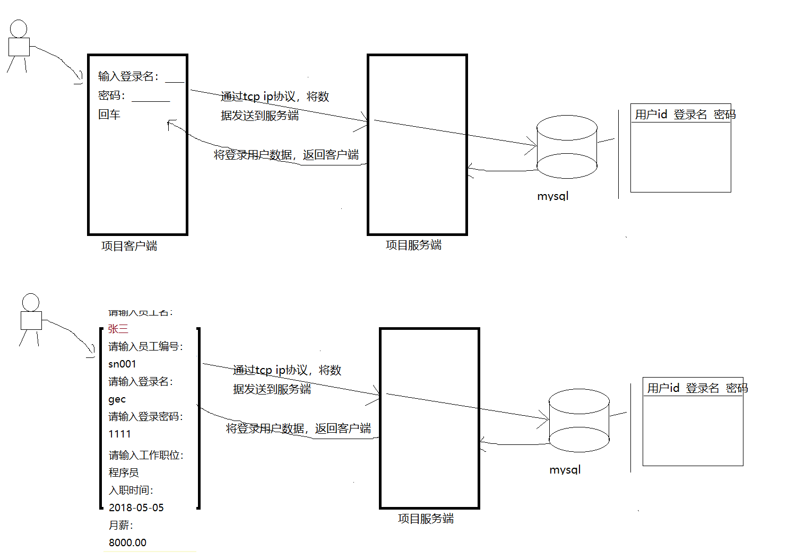

## 2、服务器程序功能

- 服务器功能

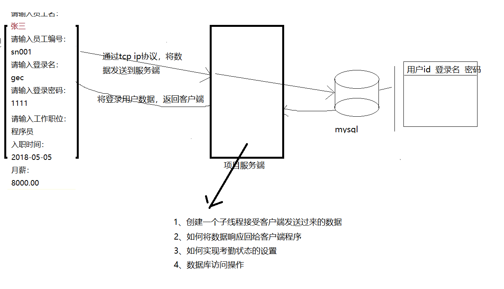

- 根据java经典三层架构，实现服务器

  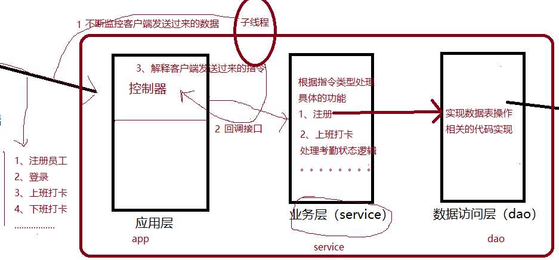

- 编写Service层的代码（难点）

  - 员工注册功能，要调用dao层对象，将员工数据保存存储到数据库

  - 员工上班打卡，要调用dao层对象，将员工的上班打卡时间保存到数据库

  - 员工下班打卡，要调用dao层对象，将员工的下班打卡时间保存到数据库

  - 实现查询统计员工的考勤状态

  - service的难点

    - 根据上下班的打卡时间，转换成具体的考勤状态（难点）

    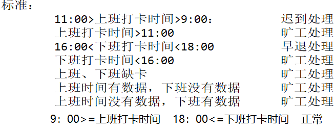

- 编写Dao层的代码

  - 将员工的注册数据存储到数据库表
  - 将员工的考勤状态也保存到数据库表
  - 实现查询统计员工的考勤状态

## 3、客户端程序功能

- 主要就是实现系统主界面
  
  - 依赖Scanner类，获取键盘输入内容
- 根据用户选中的功能，分别发送请求指令给服务器处理
  - 功能指令类别
    - 员工注册信息（1）
    - 员工登录指令功能（2）
    - 上班打卡指令功能（3）
    - 下班打卡指令功能（4）
    - 查询考勤状态数据（5）

- 数据传输的数据类型

  - 统一传输数据接口类型，建议使用HashMap数据类型
    - key：指令类型
    - value：数据(使用Object）

  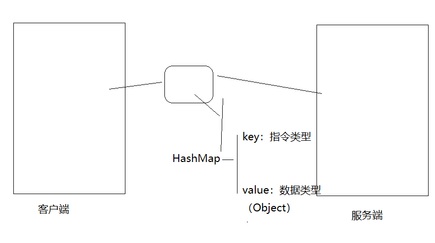

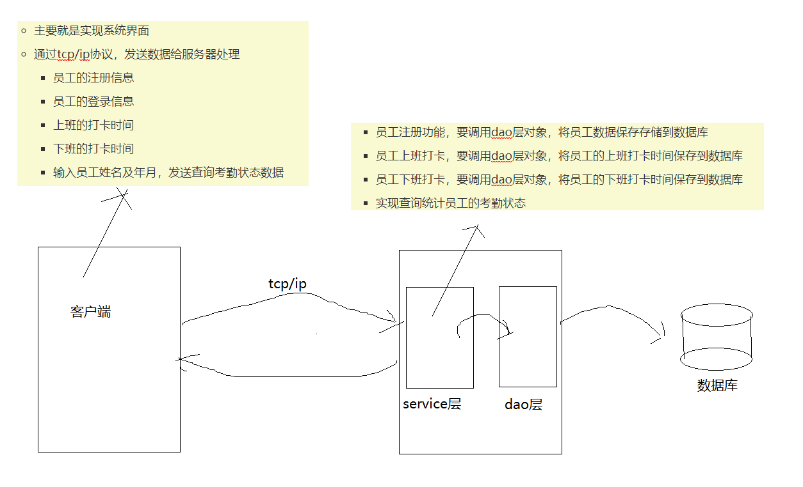

# 四、系统界面

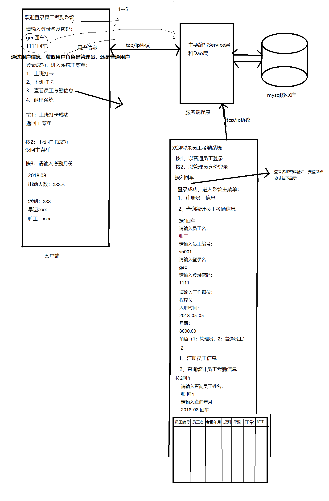

# 五、数据库表设计

- 员工表

  ~~~ sql
  create database attendance_db;
  
  /*
  定义员工表
  */
  create table t_employee
  (
  	employee_id   int auto_increment primary key,
  	employee_no   varchar(20),
  	employee_name varchar(20),
  	login_name    varchar(20),
  	pass_word     varchar(20),
  	job           varchar(20),
  	hiredate      date,
  	sal           numeric(7,2),
  	role          int
  );
  
  truncate table t_employee;
  
  insert into t_employee(employee_no,employee_name,login_name,pass_word,job,hiredate,sal,role) 
  	values('sy001','许晓东','xuxiao','1111','软件开发','2017-03-04',8000.00,'0');
  insert into t_employee(employee_no,employee_name,login_name,pass_word,job,hiredate,sal,role) 
  	values('sy002','李小晖','lixiaohui','1111','软件开发','2016-05-04',10000.00,'0');
  insert into t_employee(employee_no,employee_name,login_name,pass_word,job,hiredate,sal,role) 
  	values('sy003','程明','chengming','1111','软件开发','2015-07-04',8500.00,'0');
  insert into t_employee(employee_no,employee_name,login_name,pass_word,job,hiredate,sal,role) 
  	values('sy004','范小云','xiaoyun','1111','财务','2018-01-04',5000.00,'0');
  insert into t_employee(employee_no,employee_name,login_name,pass_word,job,hiredate,sal,role) 
  	values('sy005','管理员','admin','1111','管理员','2015-03-04',8000.00,'1');
  
  ~~~

- 定义打卡数据表

  ~~~ sql
  /*
  定义考勤打卡表
  */
  create table t_clock_info
  (
  	clock_id        int auto_increment primary key,
		employee_no     varchar(20),
  	clock_in_time   datetime,
		clock_off_time  datetime,
      clock_in_status int,
  	clock_in_off int,
  	clock_date      date，
  );
  ~~~
  
  
  
- 记录工作日表

  ~~~ sql
  /*
  定义工作日表
  */
  create table t_work_date
  (
  	work_date_id   int auto_increment primary key,
  	work_date      date
  );
  
  insert into t_work_date(work_date) values('2021-08-01');
  insert into t_work_date(work_date) values('2018-08-02');
  insert into t_work_date(work_date) values('2018-08-03');
  insert into t_work_date(work_date) values('2018-08-04');
  insert into t_work_date(work_date) values('2018-08-06');
  insert into t_work_date(work_date) values('2018-08-07');
  insert into t_work_date(work_date) values('2018-08-08');
  insert into t_work_date(work_date) values('2018-08-09');
  insert into t_work_date(work_date) values('2018-08-10');
  insert into t_work_date(work_date) values('2018-08-13');
  insert into t_work_date(work_date) values('2018-08-14');
  insert into t_work_date(work_date) values('2018-08-15');
  insert into t_work_date(work_date) values('2018-08-16');
  insert into t_work_date(work_date) values('2018-08-17');
  insert into t_work_date(work_date) values('2018-08-18');
  insert into t_work_date(work_date) values('2018-08-20');
  insert into t_work_date(work_date) values('2018-08-21');
  insert into t_work_date(work_date) values('2018-08-22');
  insert into t_work_date(work_date) values('2018-08-23');
  insert into t_work_date(work_date) values('2018-08-24');
  insert into t_work_date(work_date) values('2018-08-27');
  insert into t_work_date(work_date) values('2018-08-28');
  insert into t_work_date(work_date) values('2018-08-29');
  insert into t_work_date(work_date) values('2018-08-30');
  insert into t_work_date(work_date) values('2018-08-31');
  
  ~~~

  