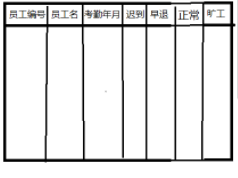
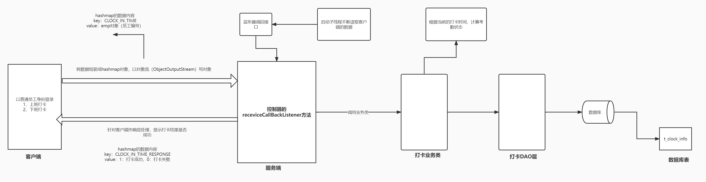

# 数据库表分析

## 员工表

~~~ sql
create database attendance_db;

/*
定义员工表
*/
create table t_employee
(
    #员工表主键
	employee_id   int auto_increment primary key,
    #员工编号
	employee_no   varchar(20),
    #员工名
	employee_name varchar(20),
    #员工的登录名
	login_name    varchar(20),
    #登录密码
	pass_word     varchar(20),
    #岗位
	job           varchar(20),
    #入职日期
	hiredate      date,
    #薪水
	sal           numeric(7,2),
    #角色(0：普通员工，1：管理员)
	role          int
);

truncate table t_employee;

insert into t_employee(employee_no,employee_name,login_name,pass_word,job,hiredate,sal,role) 
	values('sy001','许晓东','xuxiao','1111','软件开发','2017-03-04',8000.00,'0');
insert into t_employee(employee_no,employee_name,login_name,pass_word,job,hiredate,sal,role) 
	values('sy002','李小晖','lixiaohui','1111','软件开发','2016-05-04',10000.00,'0');
insert into t_employee(employee_no,employee_name,login_name,pass_word,job,hiredate,sal,role) 
	values('sy003','程明','chengming','1111','软件开发','2015-07-04',8500.00,'0');
insert into t_employee(employee_no,employee_name,login_name,pass_word,job,hiredate,sal,role) 
	values('sy004','范小云','xiaoyun','1111','财务','2018-01-04',5000.00,'0');
insert into t_employee(employee_no,employee_name,login_name,pass_word,job,hiredate,sal,role) 
	values('sy005','管理员','admin','1111','管理员','2015-03-04',8000.00,'1');

~~~

## 打卡信息表

~~~ sql
/*
定义考勤打卡表
*/
create table t_clock_info
(
    #主键
	clock_id        int auto_increment primary key,
    #员工编号
	employee_no     varchar(20),
    #记录上班打卡时间
	clock_in_time   datetime,
    #记录下班打卡时间
	clock_off_time  datetime,
    #上班打卡考勤状态
    clock_in_status int,
    #下班打卡考勤状态
	clock_off_status int,
    #打卡的日期
	clock_date      date
);
~~~

## 工作日表

~~~ sql
/*
定义工作日表
*/
create table t_work_date
(
	work_date_id   int auto_increment primary key,
    #工作日
	work_date      date
);

insert into t_work_date(work_date) values('2022-08-01');
insert into t_work_date(work_date) values('2022-08-02');
insert into t_work_date(work_date) values('2022-08-03');
insert into t_work_date(work_date) values('2022-08-04');
insert into t_work_date(work_date) values('2022-08-05');
insert into t_work_date(work_date) values('2022-08-08');
insert into t_work_date(work_date) values('2022-08-09');
insert into t_work_date(work_date) values('2022-08-10');
insert into t_work_date(work_date) values('2022-08-11');
insert into t_work_date(work_date) values('2022-08-12');
insert into t_work_date(work_date) values('2022-08-15');
insert into t_work_date(work_date) values('2022-08-16');
insert into t_work_date(work_date) values('2022-08-17');
insert into t_work_date(work_date) values('2022-08-18');
insert into t_work_date(work_date) values('2022-08-19');
insert into t_work_date(work_date) values('2022-08-22');
insert into t_work_date(work_date) values('2022-08-23');
insert into t_work_date(work_date) values('2022-08-24');
insert into t_work_date(work_date) values('2022-08-25');
insert into t_work_date(work_date) values('2022-08-26');
insert into t_work_date(work_date) values('2022-08-29');
insert into t_work_date(work_date) values('2022-08-30');
insert into t_work_date(work_date) values('2022-08-31');

~~~

- 如何实现以下数据

  - 方法一：直接写sql
  - 方法二：先遍历数据，在java代码进行汇总处理

  

# 上班打卡、下班打卡实现思路

 

# 定义考勤状态常量类

~~~ java
package com.gec.attendancesys.common;

public class AttendanceStatus {

    //迟到
    public final static int LATE=0;
    //早退
    public final static int LEAVEEARLY=1;
    //旷工
    public final static int ABSENT=2;
    //正常
    public final static int NOLMAL=3;

}

~~~

# 当前时间转换考勤状态类

~~~ java
package com.gec.attendancesys.utils;

import com.gec.attendancesys.common.AttendanceStatus;

import java.text.SimpleDateFormat;
import java.util.Calendar;
import java.util.Date;

public class CalAttendaceStatus {

    /*
     * 根据上班打卡时间，获取对应的上班打卡考勤状态
     * */
    public static int getClockInTimeAttendaceStatus(Date curNowDate)
    {

        SimpleDateFormat sf=new SimpleDateFormat("yyyy-MM-dd HH:mm:ss");
        System.out.println(sf.format(curNowDate));

        int status= AttendanceStatus.NOLMAL;

        String strStartTime="09:00:00";
        String strMiddleStartTime="11:00:00";
        String strMiddleEndTime="16:00:00";
        String strEndTime="18:00:00";

        if(curNowDate==null)
        {
            return AttendanceStatus.ABSENT;
        }

        Calendar calendar = Calendar.getInstance();
        calendar.set(Calendar.HOUR_OF_DAY, 9); // 9点
        calendar.set(Calendar.MINUTE, 0);
        calendar.set(Calendar.SECOND, 0);
        Date startTime = calendar.getTime();

        calendar.set(Calendar.HOUR_OF_DAY, 11); // 11点
        calendar.set(Calendar.MINUTE, 0);
        calendar.set(Calendar.SECOND, 0);
        Date middleStartTime = calendar.getTime();

        calendar.set(Calendar.HOUR_OF_DAY, 16); // 16点
        calendar.set(Calendar.MINUTE, 0);
        calendar.set(Calendar.SECOND, 0);

        calendar.set(Calendar.HOUR_OF_DAY, 18); // 18点
        calendar.set(Calendar.MINUTE, 0);
        calendar.set(Calendar.SECOND, 0);

        Date nowTime=curNowDate;

        if(isEffectiveDate(nowTime, startTime, middleStartTime))
        {
            status=AttendanceStatus.LATE;
        }else if(isAfterDate(nowTime, middleStartTime))
        {
            status=AttendanceStatus.ABSENT;
        }else
            status=AttendanceStatus.NOLMAL;

        System.out.println("上班打卡考勤状态="+status);

        return status;

    }

    /*
     * 根据下班打卡时间，获取对应的下班打卡考勤状态
     * */
    public static int getClockOffTimeAttendaceStatus(Date curNowDate)
    {
        String strStartTime="09:00:00";
        String strMiddleStartTime="11:00:00";
        String strMiddleEndTime="16:00:00";
        String strEndTime="18:00:00";

        int status=AttendanceStatus.NOLMAL;

        SimpleDateFormat sf=new SimpleDateFormat("yyyy-MM-dd hh:mm:ss");
        System.out.println(sf.format(curNowDate));

        Calendar calendar = Calendar.getInstance();
        calendar.set(Calendar.HOUR_OF_DAY, 9); // 9点
        calendar.set(Calendar.MINUTE, 0);
        calendar.set(Calendar.SECOND, 0);
        Date startTime = calendar.getTime();

        calendar.set(Calendar.HOUR_OF_DAY, 11); // 11点
        calendar.set(Calendar.MINUTE, 0);
        calendar.set(Calendar.SECOND, 0);
        Date middleStartTime = calendar.getTime();

        calendar.set(Calendar.HOUR_OF_DAY, 16); // 16点
        calendar.set(Calendar.MINUTE, 0);
        calendar.set(Calendar.SECOND, 0);
        Date middleEndTime = calendar.getTime();

        calendar.set(Calendar.HOUR_OF_DAY, 18); // 18点
        calendar.set(Calendar.MINUTE, 0);
        calendar.set(Calendar.SECOND, 0);
        Date endTime = calendar.getTime();

        Date nowTime=curNowDate;

        if(isEffectiveDate(nowTime, middleEndTime, endTime))
        {
            status=AttendanceStatus.LEAVEEARLY;
        }else if(isBeforeDate(nowTime, middleEndTime))
        {
            status=AttendanceStatus.ABSENT;
        }else
            status=AttendanceStatus.NOLMAL;

        System.out.println("下班打卡考勤状态="+status);

        return status;
    }

    public static boolean isEffectiveDate(Date nowTime, Date startTime, Date endTime) {

        Calendar date = Calendar.getInstance();
        date.setTime(nowTime);

        Calendar begin = Calendar.getInstance();
        begin.setTime(startTime);

        Calendar end = Calendar.getInstance();
        end.setTime(endTime);

        if (date.after(begin) && date.before(end)) {
            return true;
        } else {
            return false;
        }
    }

    public static boolean isAfterDate(Date nowTime, Date startTime) {

        Calendar date = Calendar.getInstance();
        date.setTime(nowTime);

        Calendar begin = Calendar.getInstance();
        begin.setTime(startTime);

        if (date.after(begin)) {
            return true;
        } else {
            return false;
        }
    }

    public static boolean isBeforeDate(Date nowTime, Date endTime) {

        Calendar date = Calendar.getInstance();
        date.setTime(nowTime);

        Calendar end = Calendar.getInstance();
        end.setTime(endTime);

        if (date.before(end)) {
            return true;
        } else {
            return false;
        }
    }

}

~~~

