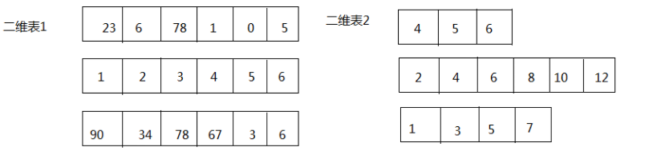
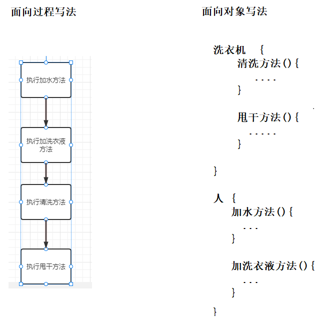
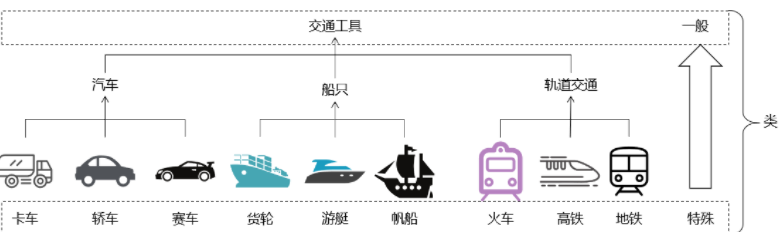
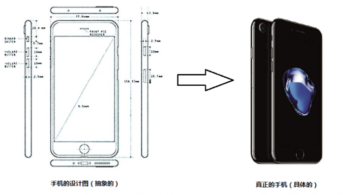
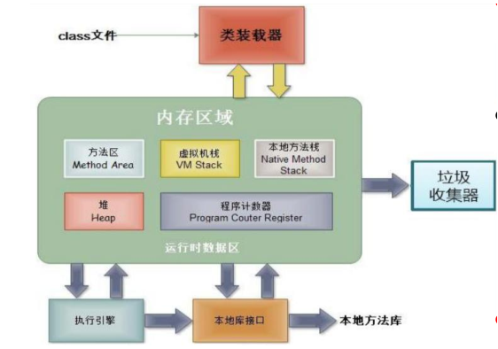
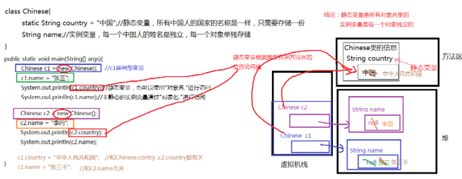
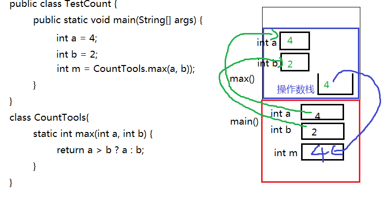

# 第六章 二维数组及面向对象

# 1. 二维数组用法

##  1.1 二维数组

* 二维数组：本质上就是元素为一维数组的一个数组。

* 二维数组的标记：\[\]\[\]

```java
int[][] arr; //arr是一个二维数组，可以看成元素是int[]一维数组类型的一个数组
```

二维数组也可以看成一个二维表，行*列组成的二维表，只不过这个二维表，每一行的列数还可能不同。但是每一个单元格中的元素的数据类型是一致的，例如：都是int，都是String等



### 1.1.1 二维数组的声明与初始化

语法格式：

```java
//推荐
元素的数据类型[][] 二维数组的名称;

//不推荐
元素的数据类型  二维数组名[][];
//不推荐
元素的数据类型[]  二维数组名[];
```

面试：

```
int[] x, y[];
//x是一维数组，y是二维数组
```

#### 1、静态初始化

```java
元素的数据类型[][] 二维数组名 = new 元素的数据类型[][]{
			{元素1，元素2，元素3 。。。}, 
			{第二行的值列表},
			...
			{第n行的值列表}
		};

元素的数据类型[][] 二维数组名;
二维数组名 = new 元素的数据类型[][]{
			{元素1，元素2，元素3 。。。}, 
			{第二行的值列表},
			...
			{第n行的值列表}
		};
		
//以下格式要求声明与静态初始化必须一起完成
元素的数据类型[][] 二维数组的名称 = {
			{元素1，元素2，元素3 。。。}, 
			{第二行的值列表},
			...
			{第n行的值列表}
		};
```

> **如果是静态初始化，右边new 数据类型\[\]\[\]中不能写数字，因为行数和列数，由{}的元素个数决定**

举例：

```java
	int[][] arr;
	arr = new int[][]{{1,2,3},{4,5,6},{7,8,9}};
	arr = new int[3][3]{{1,2,3},{4,5,6},{7,8,9}};//错误，静态初始化右边new 数据类型[]中不能写数字

	int[][] arr = new int[][]{{1,2,3},{4,5,6},{7,8,9}};

	int[][] arr = {{1,2,3},{4,5,6},{7,8,9}};//声明与初始化必须在一句完成
```

```java
public class Array2Demo1 {
	public static void main(String[] args) {
		//定义数组
		int[][] arr = {{1,2,3},{4,5},{6}};
		
		System.out.println(arr);
		System.out.println(arr[0]);
		System.out.println(arr[1]);
		System.out.println(arr[2]);
		
		System.out.println(arr[0][0]); //1
		System.out.println(arr[1][0]); //4
		System.out.println(arr[2][0]); //6
		
		System.out.println(arr[0][1]); //2
		System.out.println(arr[1][1]); //5
		//越界
		System.out.println(arr[2][1]); //错误
	}
}
```

#### 2、动态初始化（规则二维表：每一行的列数是相同的）

```java
//（1）确定行数和列数
元素的数据类型[][] 二维数组名 = new 元素的数据类型[m][n];
	m:表示这个二维数组有多少个一维数组。或者说一共二维表有几行
	n:表示每一个一维数组的元素有多少个。或者说每一行共有一个单元格

//此时创建完数组，行数、列数确定，而且元素也都有默认值

//（2）再为元素赋新值
二维数组名[行下标][列下标] = 值;
```

```java
public static void main(String[] args) {
    //定义一个二维数组
    int[][] arr = new int[3][2];
    
    //定义了一个二维数组arr
    //这个二维数组有3个一维数组的元素
    //每一个一维数组有2个元素
    //输出二维数组名称
    System.out.println(arr); //地址值	[[I@175078b
    
    //输出二维数组的第一个元素一维数组的名称
    System.out.println(arr[0]); //地址值	[I@42552c
    System.out.println(arr[1]); //地址值	[I@e5bbd6
    System.out.println(arr[2]); //地址值	[I@8ee016
    
    //输出二维数组的元素
    System.out.println(arr[0][0]); //0
    System.out.println(arr[0][1]); //0
    
    //...
}	 
```

#### 3、动态初始化（不规则：每一行的列数可能不一样）

```java
//（1）先确定总行数
元素的数据类型[][] 二维数组名 = new 元素的数据类型[总行数][];

//此时只是确定了总行数，每一行里面现在是null

//（2）再确定每一行的列数，创建每一行的一维数组
二维数组名[行下标] = new 元素的数据类型[该行的总列数];

//此时已经new完的行的元素就有默认值了，没有new的行还是null

//(3)再为元素赋值
二维数组名[行下标][列下标] = 值;
```

```java
	public static void main(String[] args) {
		//定义数组
		int[][] arr = new int[3][];
        
        System.out.println(arr);	//[[I@175078b
        
        System.out.println(arr[1][0]);//NullPointerException
		System.out.println(arr[0]); //null
		System.out.println(arr[1]); //null
		System.out.println(arr[2]); //null
		
		//动态的为每一个一维数组分配空间
		arr[0] = new int[2];
		arr[1] = new int[3];
		arr[2] = new int[1];
		
		System.out.println(arr[0]); //[I@42552c
		System.out.println(arr[1]); //[I@e5bbd6
		System.out.println(arr[2]); //[I@8ee016
		
		System.out.println(arr[0][0]); //0
		System.out.println(arr[0][1]); //0
		//ArrayIndexOutOfBoundsException
		//System.out.println(arr[0][2]); //错误
		
		arr[1][0] = 100;
		arr[1][2] = 200;
	}
```

### 1.1.2 二维数组的相关名称及其表示方式

（1）二维数组的长度/行数： 

​	二维数组名.length

（2）二维数组的某一行：

​	二维数组名[行下标]

​	行下标的范围：[0, 二维数组名.length-1]

（3）某一行的列数：

​	二维数组名[行下标].length

​       因为二维数组的每一行是一个一维数组

（4）某一个元素

​	二维数组名\[行下标\]\[列下标\]

### 1.1.3  二维数组的遍历

```java
for(int i=0; i<二维数组名.length; i++){
    for(int j=0; j<二维数组名[i].length; j++){
        System.out.print(二维数组名[i][j]);
    }
    System.out.println();
}
```

# 2. 面向对象

## 2.1 概述

- Java语言是一种面向对象的程序设计语言，而面向对象思想（OOP）是一种程序设计思想，我们在面向对象思想的指引下，使用Java语言去设计、开发计算机程序。这里的**对象**泛指现实中一切事物，每种事物都具备自己的**属性**和**行为**。面向对象思想就是在计算机程序设计过程中，参照现实中事物，将事物的属性特征、行为特征抽象出来，描述成计算机事件的设计思想。它区别于面向过程思想（POP），强调的是通过调用对象的行为来实现功能，而不是自己一步一步的去操作实现。

## 2.2 面向对象与面向过程区别

### 2.2.1 面向过程

#### 概述

- “面向过程”(Procedure Oriented)是一种以过程为中心的编程思想。这些都是以什么正在发生为主要目标进行编程。通俗地讲，我们在编写代码时，我们看到是一步一步执行的过程----即面向过程。最典型的就是C语言，
  其实就是通过函数体现，并不断的调用函数，执行完成过程即可。

#### 特点

- ​	以函数作为主体


- ​	以过程，步骤为主，考虑怎么做

### 2.2.2 面向对象

#### 概述

- 面向对象要首先抽象出类，类的属性、类的方法，然后通过实例化对象来完成功能。

#### 特点

- 以对象为核心
- 面向对象仍然包含面向过程，只不过关注点变了，关注谁来做
- 面向对象思想是一种更符合我们思考习惯的思想，它可以将复杂的事情简单化，并将我们从执行者变成了指挥者。

#### 好处

- 面向对象是一种更符合人们思考方式的思想。
- 面向过程中更多的体现的是执行者，面向对象中更多的体现是指挥者，指挥对象做事情。
- 面向对象将复杂的问题简化了。

### 2.2.3 应用场景

- 一个洗衣机里有脏衣服，该如何洗干净？

  - 首先创建两个对象  洗衣机 对象 和 人 对象；在洗衣机对象中添加清洗方法、甩干方法。在人对象中添加加水方法、加洗衣液方法。然后开始用调用：人.加水方法；人.加洗衣液方法；洗衣机.清洗方法；洗衣机.甩干方法；

     



## 2.3 类与对象

### 2.3.1 类概述

- **类**：是一类具有相同特性的事物的抽象描述，是一组相关**属性**和**行为**的集合。可以看成是一类事物的模板，使用事物的属性特征和行为特征来描述该类事物。

  

- 现实中，描述一类事物：

  * **属性**：就是该事物的状态信息。
  * **行为**：就是该事物能够做什么。

  举例：小猫。

  ​	属性：名字、体重、年龄、颜色。
  ​	行为：走、跑、叫。

### 2.3.2 什么是对象

* **对象**：是一类事物的具体体现。对象是类的一个**实例**（对象并不是找个女朋友），必然具备该类事物的属性和行为。

  * GZ2250就是一个类，张三是GZ2250是班的一个同学，张三就是此类的对象

    举例：一只小猫。

    ​	属性：tom、5kg、2 years、yellow。
    ​	行为：溜墙根走、蹦跶的跑、喵喵叫。


## 2.4 类与对象关系

- 类是对一类事物的描述，是**抽象的**。
- 对象是一类事物的实例，是**具体的**。
- **类是对象的模板，对象是类的实体**。



## 2.5 如何定义类

### 2.5.1 类的定义格式

~~~ java
[修饰符] class 类名
{
	零个到多个构造器定义. . .
	零个到多个成员变量.. .
	零个到多个方法. . .
}
~~~

- 修饰符可以是 public 、 final 、 abstract，或者完全省略这三个修饰符  
- Java类名必须是由一个或多个有意义的单词连缀而成的，每个单词首字母大写，其他字母全部小写，单词与单词之间不要使用任何分隔符。
- 对一个类定义而言，可以包含三种最常见的成员 :构造器、成员变量和方法， 三种成员都可以定义零个或多个，如果三种成员都只定义零个，就是定义了 一个空类，这没有太大的实际意义。
- 类的定义格式举例：
  - 下面的 Person 类代码里没有定义构造器，系统将为它提供一个默认的构造器，系统提供的构造器

~~~ java
public class Person
{
	// 下面定义了两个成员变量
	public String name;
	public int age;
	// 下面定义了一个say方法
	public void say(String content)
	{
		System.out.println(content);
	}
}

~~~

## 2.6 创建对象

### 2.6.1 如何创建对象

- 匿名对象

  ~~~ java
  new 类名()//也称为匿名对象
  ~~~

- 给创建的对象命名

  ~~~ java
  //给创建的对象命名
  //或者说，把创建的对象用一个引用数据类型的变量保存起来
  类名 对象名 = new 类名();
  ~~~

- 用法

  ~~~ java
  // 使用Peron类定义一个Person类型的变量
  Person p;
  // 通过new关键字调用Person类的构造器，返回一个Person实例，
  // 将该Person实例赋给p变量。
  p = new Person();
  
  // 访问p的name实例变量，直接为该变量赋值。
  p.name = "李刚";
  // 调用p的say方法，声明say()方法时定义了一个形参，
  // 调用该方法必须为形参指定一个值
  p.say("Java语言很简单，学习很容易！");
  // 直接输出p的name实例变量，将输出 李刚
  System.out.println(p.name);
  ~~~

### 2.6.2 对象名中存储的是什么

~~~ java
// 使用Peron类定义一个Person类型的变量
Person p;
// 通过new关键字调用Person类的构造器，返回一个Person实例，
// 将该Person实例赋给p变量。
p = new Person();

// 访问p的name实例变量，直接为该变量赋值。
p.name = "李刚";
// 调用p的say方法，声明say()方法时定义了一个形参，
// 调用该方法必须为形参指定一个值
p.say("Java语言很简单，学习很容易！");
// 直接打印对象名
System.out.println(p);
~~~

- 直接打印对象名和数组名都是显示“类型@对象的hashCode值"，那么像“Person@4e25154f”是对象的地址吗？不是，因为Java是对程序员隐藏内存地址的，不暴露内存地址信息，所以打印对象时不直接显示内存地址，而是JVM提取了对象描述信息给你现在，默认提取的是对象的运行时类型@代表对象唯一编码的**hashCode值**。

## 2.7 成员变量

### 2.7.1 成员变量的分类

- 实例变量：没有static修饰，也叫对象属性，属于某个对象的，通过对象来使用。


- 类变量：有static修饰，也叫类变量，属于整个类的，不是属于某个实例。

### 2.7.2 如何声明成员变量？

~~~ java
【修饰符】 class 类名{
    【修饰符】 数据类型  属性名;    //属性有默认值
    【修饰符】 数据类型  属性名 = 值; //属性有初始值
}
~~~

> 说明：属性的类型可以是Java的任意类型，包括基本数据类型、引用数据类型（类、接口、数组等）

例如：声明一个中国人的类

```java
class Chinese{
	static String country;
	String name;
    char gender = '男';//显式赋值
}
```

### 2.7.3 如何在类外面访问成员变量？

#### （1）类变量

```java
类名.静态成员变量  //推荐

对象名.静态成员变量 //不推荐
```

#### （2）实例变量

```java
对象名.静态成员变量  //只能使用这种方式
```

例如：

```java
public class TestChinese {
	public static void main(String[] args) {
		//类名.静态成员变量
		System.out.println(Chinese.country);
		//错误，非静态成员变量必须通过对象.进行访问
//		System.out.println(Chinese.name);
		
		Chinese c1 = new Chinese();
		//对象名.非静态成员变量
		System.out.println(c1.name);
		//静态的成员变量也可以通过对象.进行访问
		//对象名.非静态成员变量
		System.out.println(c1.country);
        System.out.println(c1.gender);
	}
}
class Chinese{
	static String country;
	String name;
    char gender = '男';
}
```

### 2.7.4 成员变量的特点

#### （1）成员变量有默认值

| 基本类型 | 整数（byte，short，int，long） | 0        |
| -------- | ------------------------------ | -------- |
|          | 浮点数（float，double）        | 0.0      |
|          | 字符（char）                   | '\u0000' |
|          | 布尔（boolean）                | false    |
|          | 数据类型                       | 默认值   |
| 引用类型 | 数组，类，接口                 | null     |

#### （2）类变量的值是所有对象共享的，而实例变量的值是每个对象独立的

```java
public class TestChinese {
	public static void main(String[] args) {
		Chinese c1 = new Chinese();
		Chinese c2 = new Chinese();
		
		c1.name = "张三";
		c2.name = "李四";
        c2.gender = '女';
		
//		c1.country = "中国";
		Chinese.country = "中国";//推荐
		
		System.out.println("c1.country = " + c1.country + ",c1.name = " + c1.name + ",c1.gender = " + c1.gender);
		System.out.println("c2.country = " + c2.country + ",c2.name = " + c2.name + ",c2.gender = " + c2.gender);
	}	
}
class Chinese{
	static String country;
	String name;
    char gender = '男';
}
```

### 2.7.5 成员变量的内存图

- 内存是计算机中重要的部件之一，它是与CPU进行沟通的桥梁。其作用是用于暂时存放CPU中的运算数据，以及与硬盘等外部存储器交换的数据。只要计算机在运行中，CPU就会把需要运算的数据调到内存中进行运算，当运算完成后CPU再将结果传送出来。我们编写的程序是存放在硬盘中的，在硬盘中的程序是不会运行的，必须放进内存中才能运行，运行完毕后会清空内存。Java虚拟机要运行程序，必须要对内存进行空间的分配和管理，每一片区域都有特定的处理数据方式和内存管理方式。

  

| 区域名称   | 作用                                                         |
| ---------- | ------------------------------------------------------------ |
| 程序计数器 | 程序计数器是CPU中的寄存器，它包含每一个线程下一条要执行的指令的地址 |
| 本地方法栈 | 当程序中调用了native的本地方法时，本地方法执行期间的内存区域 |
| 方法区     | 存储已被虚拟机加载的类信息、常量、静态变量、即时编译器编译后的代码等数据。 |
| 堆内存     | 存储对象（包括数组对象），new来创建的，都存储在堆内存。      |
| 虚拟机栈   | 用于存储正在执行的每个Java方法的局部变量表等。局部变量表存放了编译期可知长度的各种基本数据类型、对象引用，方法执行完，自动释放。 |

~~~ java
class FieldSave{
	public static void main(String[] args){
		Chinese c1 = new Chinese();
		c1.name = "张三";
		System.out.println(c1.country);//静态变量，也可以使用"对象名."进行访问
		System.out.println(c1.name);//非静态的实例变量通过"对象名."进行访问
		
		
		Chinese c2 = new Chinese();
		c2.name = "李四";
		System.out.println(c2.country);
		System.out.println(c2.name);
		
		System.out.println("--------------------------------------");
		//其中一个对象将静态变量的值修改了，其他对象都会改变
		//因为静态变量只存一份
		c1.country = "中华人民共和国";
		System.out.println(c1.country);
		System.out.println(c2.country);
		System.out.println(Chinese.country);
		
		
		//其中一个对象将非静态实例变量修改了，其他对象不受影响
		c1.name = "张三丰";
		System.out.println(c1.name);
		System.out.println(c2.name);
	}
	
}

class Chinese{
	static String country = "中国";//静态变量，所有中国人的国家的名称是一样，只需要存储一份
	String name;//实例变量，每一个中国人的姓名是独立，每一个对象单独存储
}
~~~

- 用内存图描述以下实例

  

### 2.7.6 成员变量练习题

（1）声明一个圆的图形类，有属性：半径
	在测试类的main中，创建圆的2个对象，为半径属性赋值，并显示两个圆的半径值和面积值
	提示：圆周率为Math.PI

（2）声明一个银行账户类，有属性：利率、账号、余额

​	在测试类的main中，创建账户类的两个对象，其中所有账户的利率是相同的，都是0.035，而账号和余额是不同的，并打印显示

（3）声明一个MyDate类型，有属性：年，月，日

​		  声明另一个Employee类型，有属性：姓名（String类型），生日（MyDate类型）

在测试类中的main中，创建两个员工对象，并为他们的姓名和生日赋值，并显示


## 2.8 成员方法

### 2.8.1 概述

- 成员变量是用来存储对象的数据信息的，那么如何表示对象的行为功能呢？就要通过方法来实现，方法也叫函数，是一个独立功能的定义，是一个类中最基本的功能单元。把一个功能封装为方法的目的是，可以实现代码重用，从而简少代码量。

### 2.8.2  方法的原则

方法的使用原则：

（1）必须先声明后使用

>  类，变量，方法等都要先声明后使用

（2）不调用不执行，调用一次执行一次。

### 2.8.3 成员方法的分类

成员方法分为两类：

* 实例方法：没有static修饰的方法，必须通过实例对象来调用。
* 静态方法：有static修饰的方法，也叫类方法，可以由类名来调用。

### 2.8.4  如何声明方法

1、方法声明的位置必须在类中方法外

2、语法格式

```java
【修饰符】 返回值类型 方法名(【参数列表：参数类型1 参数名1,参数类型2 参数名, ...... 】){
        方法体；
        【return 返回值;】
}
```

- 修饰符： 修饰符后面一一介绍，例如：public，static等都是修饰符
- 返回值类型： 表示方法运行的结果的数据类型，方法执行后将结果返回到调用者
  - 基本数据类型
  - 引用数据类型
  - 无返回值类型：void
- 方法名：给方法起一个名字，见名知意，能准确代表该方法功能的名字
- 参数列表：方法内部需要用到其他方法中的数据，需要通过参数传递的形式将数据传递过来，可以是基本数据类型、引用数据类型、也可以没有参数，什么都不写
- 方法体：特定功能代码
- return：结束方法，并将方法的结果返回去，
  - 如果返回值类型不是void，方法体中必须保证一定有return 返回值;语句，并且要求该返回值结果的类型与声明的返回值类型一致或兼容。
  - 如果返回值类型为void时，return 后面不用跟返回值，甚至也可以没有return语句。
  - return语句后面就不能再写其他代码了，否则会报错：Unreachable code

- 举例

  声明一个圆的图形类：

  ​	属性（成员变量）：半径，

  ​	成员方法：求面积的方法，返回圆对象信息的方法

  ​	在测试类的main中，创建圆的2个对象，为半径属性赋值，调用两个方法进行测试
  ​	提示：圆周率为Math.PI

  ~~~ java
  class Circle{
  	double radius;
  	double area() {
  		return Math.PI * radius * radius;
  	}
  }
  ~~~

### 2.8.5 如何在其他类中调用方法

#### （1）实例方法

~~~ java
对象名.实例方法(【实参列表】)  //必须通过对象来访问
~~~

代码举例：

~~~ java
public class TestCircle {
	public static void main(String[] args) {
		Circle c1 = new Circle();
		c1.radius = 1.2;
		System.out.println("c1的面积：" + c1.area());
		//非静态方法只能通过"对象."进行访问
//		System.out.println("c1的面积：" + Circle.area());
        
		Circle c2 = new Circle();
		c2.radius = 2.5;
		System.out.println("c2的面积：" + c2.area());
	}
}
class Circle{
	double radius;
	public double area() {
		return Math.PI * radius * radius;
	}
}
~~~

#### （2）类方法

```java
类名.类方法(【实参列表】)  //推荐

对象名.类方法(【实参列表】) //不推荐
```

示例：

```java
public class TestCount {
	public static void main(String[] args) {
		System.out.println(CountTools.max(4, 1));
		
		//静态方法也可以通过“对象.”访问，就是麻烦点
		CountTools c = new CountTools();
		System.out.println(c.max(2, 5));
	}
}
class CountTools{
	static int max(int a, int b) {
		return a > b ? a : b;
	}
}
```

#### （3）形参、实参

* 形参：在定义方法时方法名后面括号中声明的变量称为形式参数（简称形参）即形参出现在方法定义时。
* 实参：调用方法时方法名后面括号中的使用的值/变量/表达式称为实际参数（简称实参）即实参出现在方法调用时。

- 总结：

（1）调用时，需要传“实参”，实参的个数、类型、顺序顺序要与形参列表一一对应

​		如果方法没有形参，就不需要也不能传实参。

（2）调用时，如果方法有返回值，可以接受或处理返回值结果，当然也可以不接收，那么此时返回值就丢失了。

​		如果方法的返回值类型是void，不需要也不能接收和处理返回值结果。

### 2.8.6 在本类中访问本类的成员变量和成员方法

- 直接用，不需要加“对象名."和"类名."


- 唯一例外：**静态方法**中不能直接访问本类的**非静态**的成员变量和成员方法

  ~~~ java
  class Test{
  		
  	static void test(){
  		System.out.println("");
  	}
  	void method(){
  		 test();
  	}
      
      public static void main(String[] args){
          method();//错误
          test();//正确
      }
  }
  ~~~

### 2.8.7 方法调用内存分析

- 方法不调用不执行，调用一次执行一次，每次调用会在栈中有一个入栈动作，即给当前方法开辟一块独立的内存区域，用于存储当前方法的局部变量的值，当方法执行结束后，会释放该内存，称为出栈，如果方法有返回值，就会把结果返回调用处，如果没有返回值，就直接结束，回到调用处继续执行下一条指令。栈结构：先进后出，后进先出。


- 实例一：

  ~~~ java
  public class TestCount {
  	public static void main(String[] args) {
          int a = 4;
          int b = 2;
  		int m = CountTools.max(a, b));
  	}
  }
  class CountTools{
  	static int max(int a, int b) {
  		return a > b ? a : b;
  	}
  }
  ~~~

  

- 练习：画此程序内存图

  ~~~ java
  public class TestCircle {
  	public static void main(String[] args) {
  		Circle c1 = new Circle();
  		c1.radius = 1.2;
  		int area1 = c1.area();
  		
  		Circle c2 = new Circle();
  		c2.radius = 2.5;
  		int area2 = c2.area();
  	}
  }
  class Circle{
  	double radius;
  	public double area() {
  		return Math.PI * radius * radius;
  	}
  }
  ~~~

  

### 2.8.8 方法的参数传递机制

* 方法的参数传递机制：实参给形参赋值
  * 方法的形参是基本数据类型时，形参值的改变不会影响实参；
  * 方法的形参是引用数据类型时，形参地址值的改变不会影响实参，但是形参地址值里面的数据的改变会影响实参，例如，修改数组元素的值，或修改对象的属性值。
    * 注意：String、Integer等特殊类型容易错

示例代码1：

```java
class Test{
    public static void swap(int a, int b){
        int temp = a;
        a = b;
        b = temp;
	}

	public static void main（String[] args){
        int x = 1;
        int y = 2;
        swap(x,y);//调用完之后，x与y的值不变
    }
}

```

示例代码2：

```java
class Test{
    public static void change(MyData my){
        my.num *= 2;
    }
    
    public static void main(String[] args){
        MyData m = new MyData();
        m.num = 1;
        
        change(m);//调用完之后，m对象的num属性值就变为2
    }
}

class MyData{
    int num;
}
```

示例代码3：

```java
public class Test {
	public static void main(String[] args) {
		int[] arr = {2,4,1,5,3};
		
		ArrayUtil.sort(arr);
		
		for (int i = 0; i < arr.length; i++) {
			System.out.println(arr[i]);
		}
	}
}
class ArrayUtil{
	public static void sort(int[] arr){
		for (int i = 1; i < arr.length; i++) {
			for (int j = 0; j < arr.length - i; j++) {
				if(arr[j] > arr[j+1]){
					int temp = arr[j];
					arr[j] = arr[j+1];
					arr[j+1] = temp;
				}
			}
		}
	}
}
```

陷阱1：

```java
/*
陷阱1：在方法中，形参 = 新new对象，那么就和实参无关了
*/
class Test{
    public static void change(MyData my){
        my = new MyData();//形参指向了新对象
        my.num *= 2;
    }
    
    public static void main(String[] args){
        MyData m = new MyData();
        m.num = 1;
        
        change(m);//调用完之后，m对象的num属性值仍然为1
    }
}

class MyData{
    int num;
}
```

陷阱2：见字符串和包装类部分

```java
public class Test {
	public static void main(String[] args) {
		StringUtil util = new StringUtil();
		String str = "粤嵌";
		util.change(str);
		System.out.println(str);
	}
}
class StringUtil{
	public void change(String str){
		str += "你好";//String对象不可变，一旦修改就会产生新对象
	}
}
```

### 