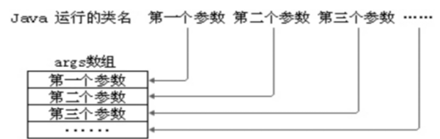
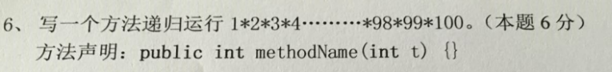
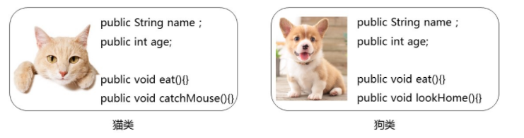
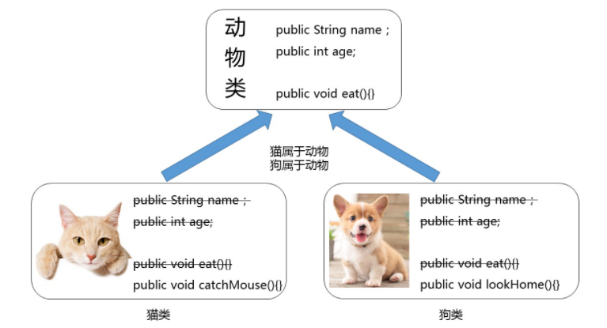
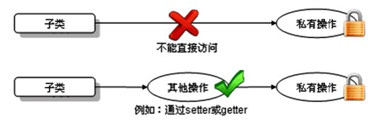

# 面向对象之二

# 补充行为方法

## 1. 成员变量与局部变量的区别

### 1.1 变量的分类

* 成员变量
  * 静态变量
  * 实例变量

* 局部变量

### 1.2 区别

### 1.2.1 声明位置和方式

（1）静态变量：在类中方法外，并且有static修饰
（2）实例变量：在类中方法外，没有static修饰
（3）局部变量：在方法体{}中或方法的形参列表、代码块中

### 1.2.2 在内存中存储的位置不同

（1）静态变量：方法区
（2）实例变量：堆
（3）局部变量：栈

### 1.2.3 生命周期

（1）静态变量：和类的生命周期一样，因为它的值是该类所有对象共享的，早于对象的创建而存在。
（2）实例变量：和对象的生命周期一样，随着对象的创建而存在，随着对象被GC回收而消亡，
			而且每一个对象的实例变量是独立的。
（3）局部变量：和方法调用的生命周期一样，每一次方法被调用而在存在，随着方法执行的结束而消亡，
			而且每一次方法调用都是独立。

### 1.2.4 作用域

（1）静态变量和实例变量：不谈作用域
在本类中，唯一的限制，静态方法或静态代码块中不能使用非静态的，其他都可以直接使用。
在其他类中，能不能使用看修饰符（public,protected,private等）
（2）局部变量：有作用域
出了作用域就不能使用

### 1.2.5 修饰符（后面来讲）

（1）静态变量：很多
public,protected,private,final,volatile等，一定有的是static
（2）实例变量
public,protected,private,final,volatile,transient等
（3）局部变量
final

public,protected,private：权限修饰符
final：是否是常量，即值是否可以修改
volatile：和多线程有关
transient：是否序列化，和IO有关	

### 1.2.6 默认值

（1）静态变量：有默认值
（2）实例变量：有默认值
（3）局部变量：没有，必须初始化
		其中的形参比较特殊，靠实参给它初始化。

## 2. 可变参数

#### 概述

- 在**JDK1.5**之后，如果我们定义一个方法时，此时某个形参的类型可以确定，但是形参的个数不确定，那么我们可以使用可变参数。

- 格式：

  ~~~ java
  【修饰符】 返回值类型 方法名(【非可变参数部分的形参列表,】参数类型... 形参名){  }
  ~~~

要求：

（1）一个方法最多只能有一个可变参数

（2）如果一个方法包含可变参数，那么可变参数必须是形参列表的最后一个

```
【修饰符】 返回值类型 方法名(【非可变参数部分的形参列表,】参数类型[] 形参名){  }
```

只是后面这种定义，在调用时必须传递数组，而前者更灵活，既可以传递数组，又可以直接传递数组的元素，这样更灵活了。

#### 示例一：    求n个整数的和

```java
public class ChangeArgs {
	public static void main(String[] args) {
		int[] arr = { 1, 4, 62, 431, 2 };
		int sum1 = getSum1(arr);
		System.out.println(sum1);

		int sum2 = getSum2(arr);
		System.out.println(sum2);
		int sum3 = getSum2(1, 4, 62, 431, 2);
		System.out.println(sum3);
	}

	// 完成数组 所有元素的求和
	// 原始写法
	public static int getSum1(int[] arr) {
		int sum = 0;
		for (int i = 0; i < arr.length; i++) {
			sum += arr[i];
		}

		return sum;
	}

	// 可变参数写法
	public static int getSum2(int... arr) {
		int sum = 0;
		for (int i = 0; i < arr.length; i++) {
			sum += arr[i];
		}
		return sum;
	}
}
```

#### 示例二：求1-n个整数中的最大值

```java
public class ChangeArgs_Exer1 {
	public static void main(String[] args) {
		System.out.println(max(1));
		System.out.println(max(5,3,2,6));
	}

	public static int max(int num, int... others){
		int max = num;
		for (int i = 0; i < others.length; i++) {
			if(max < others[i]){
				max = num;
			}
		}
		return max;
	}
}
```

#### 练习

n个字符串进行拼接，每一个字符串之间使用某字符进行分割，如果没有传入字符串，那么返回空字符串""

## 3. 方法重载

### 概述

- **方法重载**：指在同一个类中，允许存在一个以上的同名方法，只要它们的参数列表不同即可，与修饰符和返回值类型无关。
- 参数列表：数据类型个数不同，数据类型不同，数据类型顺序不同。
- 重载方法调用：JVM通过方法的参数列表，调用不同的方法。

### 示例一：比较两个数据是否相等

- 比较两个数据是否相等。参数类型分别为两个`byte`类型，两个`short`类型，两个`int`类型，两个`long`类型，并在`main`方法中进行测试。 

  ~~~ java
  public class Method_Demo6 {
      public static void main(String[] args) {
          //定义不同数据类型的变量
          byte a = 10;
          byte b = 20;
          short c = 10;
          short d = 20;
          int e = 10;
          int f = 10;
          long g = 10;
          long h = 20;
          // 调用
          System.out.println(compare(a, b));
          System.out.println(compare(c, d));
          System.out.println(compare(e, f));
          System.out.println(compare(g, h));
      }
      // 两个byte类型的
      public static boolean compare(byte a, byte b) {
          System.out.println("byte");
          return a == b;
      }
  
      // 两个short类型的
      public static boolean compare(short a, short b) {
          System.out.println("short");
          return a == b;
      }
  
      // 两个int类型的
      public static boolean compare(int a, int b) {
          System.out.println("int");
          return a == b;
      }
  
      // 两个long类型的
      public static boolean compare(long a, long b) {
          System.out.println("long");
          return a == b;
      }
  }
  ~~~

### 练习

用重载实现：
定义方法求两个整数的最大值
定义方法求三个整数的最大值
定义方法求两个小数的最大值

## 4. 命令行参数（了解）

通过命令行给main方法的形参传递的实参称为命令行参数



```java
public class TestCommandParam{
	//形参：String[] args
	public static void main(String[] args){
		System.out.println(args);
		System.out.println(args.length);
		
		for(int i=0; i<args.length; i++){
			System.out.println("第" + (i+1) + "个参数的值是：" + args[i]);
		}
	}
}
```

运行命令：

```command
java TestCommandParam
```

```command
java TestCommandParam 1 2 3
```

```command
java TestCommandParam hello gec
```

## 5. 递归

### 5.1 概述

* **递归**：指在当前方法内调用自己的这种现象。
* **递归的分类:**
  * 递归分为两种，直接递归和间接递归。
  * 直接递归称为方法自身调用自己。
  * 间接递归可以A方法调用B方法，B方法调用C方法，C方法调用A方法。
* **注意事项**：
  * 递归一定要有条件限定，保证递归能够停止下来，否则会发生栈内存溢出。
  * 在递归中虽然有限定条件，但是递归次数不能太多。否则也会发生栈内存溢出。

### 5.2 示例一：

- 示例一：计算1-100之间所有自然数的和

  ~~~ java
  public class RecursionMethod1{
  	public static void main(String[] args) {
  		int sum = sum(100);
  		System.out.println("1-100的和：" + sum);
  	}
  
  	public static int sum(int n){
  		if(n == 1){
  			return 1;
  		}else{
  			return n + sum(n-1);
  		}
  	}
  }
  ~~~

### 练习



# 包（Package）

## 2.1 包的作用

（1）可以避免类重名：有了包之后，类的全名称就变为：包.类名

（2）分类组织管理众多的类

例如：

* java.lang----包含一些Java语言的核心类，如String、Math、Integer、 System和Thread等，提供常用功能
* java.net----包含执行与网络相关的操作的类和接口。
* java.io ----包含能提供多种输入/输出功能的类。
* java.util----包含一些实用工具类，如集合框架类、日期时间、数组工具类Arrays，文本扫描仪Scanner，随机值产生工具Random。
* java.text----包含了一些java格式化相关的类
* java.sql和javax.sql----包含了java进行JDBC数据库编程的相关类/接口
* java.awt和java.swing----包含了构成抽象窗口工具集（abstract window toolkits）的多个类，这些类被用来构建和管理应用程序的图形用户界面(GUI)。

（3）可以控制某些类型或成员的可见范围

如果某个类型或者成员的权限修饰缺省的话，那么就仅限于本包使用

## 2.2 声明包的语法格式

```java
package 包名;
```

> 注意：
>
> (1)必须在源文件的代码首行
>
> (2)一个源文件只能有一个声明包的语句

包的命名规范和习惯：
（1）所有单词都小写，每一个单词之间使用.分割
（2）习惯用公司的域名倒置

例如：com.gec.xxx;

> 建议大家取包名时不要使用“java.xx"包

## 2.3 .如何跨包使用类

前提：被使用的类或成员的权限修饰符是>缺省的，即可见的

（1）使用类型的全名称

例如：java.util.Scanner input = new java.util.Scanner(System.in);

（2）使用import 语句之后，代码中使用简名称

import语句告诉编译器到哪里去寻找类。

import语句的语法格式：

```java
import 包.类名;
import 包.*;
import static 包.类名.静态成员; //后面再讲
```

> 注意：
>
> 使用java.lang包下的类，不需要import语句，就直接可以使用简名称
>
> import语句必须在package下面，class的上面
>
> 当使用两个不同包的同名类时，例如：java.util.Date和java.sql.Date。一个使用全名称，一个使用简名称

示例代码：

```java
package com.gec.bean;

public class Student {
	// 成员变量
	private String name;
	private int age;

	// 构造方法
	public Student() {
	}

	public Student(String name, int age) {
		this.name = name;
		this.age = age;
	}

	// 成员方法
	public void setName(String name) {
		this.name = name;
	}

	public String getName() {
		return name;
	}

	public void setAge(int age) {
		this.age = age;
	}

	public int getAge() {
		return age;
	}
}
```

```java
package com.gec.test;

import java.util.Scanner;
import java.util.Date;
import com.gec.bean.Student;

public class Test{
    public static void main(String[] args){
        Scanner input = new Scanner(System.in);
        Student stu = new Student();
        String str = "hello";
        
        Date now = new Date();
        java.sql.Date d = new java.sql.Date(346724566);        
    }
}
```

# 面向对象三大特征之封装

## 1. 封装概述

### 1.1 为什么需要封装？

* 我要用洗衣机，只需要按一下开关和洗涤模式就可以了。有必要了解洗衣机内部的结构吗？有必要碰电动机吗？
* 我们使用的电脑，内部有CPU、硬盘、键盘、鼠标等等，每一个部件通过某种连接方式一起工作，但是各个部件之间又是独立的
* 现实生活中，每一个个体与个体之间是有边界的，每一个团体与团体之间是有边界的，而同一个个体、团体内部的信息是互通的，只是对外有所隐瞒。

面向对象编程语言是对客观世界的模拟，客观世界里每一个事物的内部信息都是隐藏在对象内部的，外界无法直接操作和修改，只能通过指定的方式进行访问和修改。封装可以被认为是一个保护屏障，防止该类的代码和数据被其他类随意访问。适当的封装可以让代码更容易理解与维护，也加强了代码的安全性。

随着我们系统越来越复杂，类会越来越多，那么类之间的访问边界必须把握好，面向对象的开发原则要遵循“高内聚、低耦合”，而“高内聚，低耦合”的体现之一：

* 高内聚：类的内部数据操作细节自己完成，不允许外部干涉；
* 低耦合：仅对外暴露少量的方法用于使用

隐藏对象内部的复杂性，只对外公开简单的接口。便于外界调用，从而提高系统的可扩展性、可维护性。通俗的讲，把该隐藏的隐藏起来，该暴露的暴露出来。这就是封装性的设计思想。

### 1.2 如何实现封装呢？

#### 概述

通俗的讲，封装就是把该隐藏的隐藏起来，该暴露的暴露出来。那么暴露的程度如何控制呢？就是依赖访问控制修饰符，也称为权限修饰符来控制。

访问控制修饰符来控制相应的可见边界，边界有如下：

（1）类

（2）包

（3）子类

（4）模块：Java9之后引入

#### 权限修饰符

权限修饰符：public,protected,缺省,private

| 修饰符    | 本类 | 本包 | 其他包子类 | 其他包非子类 |
| --------- | ---- | ---- | ---------- | ------------ |
| private   | √    | ×    | ×          | ×            |
| 缺省      | √    | √    | ×          | ×            |
| protected | √    | √    | √          | ×            |
| public    | √    | √    | √          | √            |

外部类：public和缺省

成员变量、成员方法、构造器、成员内部类：public,protected,缺省,private

提示：protected修饰非静态成员，**跨包时，**只能在子类的非静态成员中访问，在静态成员中无论是否创建对象都不能访问。

### 1.3 示例

#### 示例一：本包非子类与子类

~~~ java
package com.gec.test01.access1;

public class Father {
	public int a;
	protected int b;
	int c;
	private int d;
	
	public static int e;
	protected static int f;
	static int g;
	private static int h;
}

class Mother{
	public Mother(){
		
	}
}
~~~

~~~ java
package com.gec.test01.access1;

//本包非子类中
public class Other {
	public static void method(){
		Father obj = new Father();
		System.out.println(obj.a);
		System.out.println(obj.b);
		System.out.println(obj.c);
//		System.out.println(obj.d);//跨类不可见
		
		System.out.println(Father.e);
		System.out.println(Father.f);
		System.out.println(Father.g);
//		System.out.println(h);//跨类不可见
	}
	
	public void fun(){
		Father obj = new Father();
		System.out.println(obj.a);
		System.out.println(obj.b);
		System.out.println(obj.c);
//		System.out.println(obj.d);//跨类不可见
		
		System.out.println(Father.e);
		System.out.println(Father.f);
		System.out.println(Father.g);
//		System.out.println(h);//跨类不可见
	}
}

~~~

- 定义一个子类

~~~ java
package com.gec.test01.access1;

//本包子类中
public class Sub extends Father{
	public static void method(){
		//静态直接访问非静态都不行
/*		System.out.println(a);
		System.out.println(b);
		System.out.println(c);
		System.out.println(d);*/
		
		Father obj = new Father();
		System.out.println(obj.a);
		System.out.println(obj.b);
		System.out.println(obj.c);
//		System.out.println(obj.d);//跨类不可见
		
		System.out.println(e);
		System.out.println(f);
		System.out.println(g);
//		System.out.println(h);//跨类不可见
	}
	
	public void fun(){
		System.out.println(a);
		System.out.println(b);
		System.out.println(c);
//		System.out.println(d);//跨类不可见
		
		System.out.println(e);
		System.out.println(f);
		System.out.println(g);
//		System.out.println(h);//跨类不可见
	}
}
~~~

#### 示例二：跨包子类和非子类


## 2.  成员变量/属性私有化问题

**<span style="color:red">成员变量（field）私有化</span>之后，提供标准的<span style="color:red">get/set</span>方法，我们把这种成员变量也称为<span style="color:red">属性（property）</span>。**或者可以说只要能通过get/set操作的就是事物的属性，哪怕它没有对应的成员变量。

### 2.1 成员变量封装的目的

* 隐藏类的实现细节
* 让使用者只能通过事先预定的方法来访问数据，从而可以在该方法里面加入控制逻辑，限制对成员变量的不合理访问。还可以进行数据检查，从而有利于保证对象信息的完整性。
* 便于修改，提高代码的可维护性。主要说的是隐藏的部分，在内部修改了，如果其对外可以的访问方式不变的话，外部根本感觉不到它的修改。例如：Java8->Java9，String从char[]转为byte[]内部实现，而对外的方法不变，我们使用者根本感觉不到它内部的修改。

### 2.2 实现步骤

1. 使用 `private` 修饰成员变量

```java
private 数据类型 变量名 ；
```

代码如下：

```java
public class Chinese {
    private static String country;
    private String name;
  	private int age;
    private boolean marry;
}
```

2. 提供 `getXxx`方法 / `setXxx` 方法，可以访问成员变量，代码如下：

```java
public class Chinese {
  	private static String country;
    private String name;
  	private int age;
    private boolean marry;
    
    public static void setCountry(String c){
        country = c;
    }
    
    public static String getCountry(){
        return country;
    }

	public void setName(String n) {
		name = n;
    }

    public String getName() {
        return name;
	}

    public void setAge(int a) {
        age = a;
    }

    public int getAge() {
        return age;
    }
    
    public void setMarry(boolean m){
        marry = m;
    }
    
    public boolean isMarry(){
        return marry;
    }
}
```

### 2.3 如何解决局部变量与成员变量同名问题

当局部变量与类变量（静态成员变量）同名时，在类变量前面加“类名."；

当局部变量与实例变量（非静态成员变量）同名时，在实例变量前面加“this.”

```java
public class Chinese {
  	private static String country;
    private String name;
  	private int age;
    
    public static void setCountry(String country){
        Chinese.country = country;
    }
    
    public static String getCountry(){
        return country;
    }

	public void setName(String name) {
		this.name = name;
    }

    public String getName() {
        return name;
	}

    public void setAge(int age) {
        this.age = age;
    }

    public int getAge() {
        return age;
    }
}
```

### 2.4  练习

（1）定义矩形类Rectangle，

​	声明静态变量sides，初始化为4，表示矩形边长的总数量；

​	声明实例变量长和宽

​	全部私有化，并提供相应的get/set方法

（2）在测试类中创建Rectangle对象，并调用相应的方法测试

（2）测试类ObjectArrayTest的main中创建一个可以装3个学生对象的数组，并且按照学生成绩排序，显示学生信息


## 3. 构造器（Constructor)

我们发现我们new完对象时，所有成员变量都是默认值，如果我们需要赋别的值，需要挨个为它们再赋值，太麻烦了。我们能不能在new对象时，直接为当前对象的某个或所有成员变量直接赋值呢。

可以，Java给我们提供了构造器。

#### 1、构造器的作用

在创建对象的时候为实例变量赋初始值。

> **注意：构造器只为实例变量初始化，不为静态类变量初始化**

#### 2、构造器的语法格式

构造器又称为构造方法，那是因为它长的很像方法。但是和方法还有有所区别的。

```java
【修饰符】 构造器名(){
    // 实例初始化代码
}
【修饰符】 构造器名(参数列表){
	// 实例初始化代码
}
```

代码如下：

```java
public class Student {
	private String name;
	private int age;
	// 无参构造
  	public Student() {} 
 	// 有参构造
  	public Student(String name,int age) {
		this.name = name;
    	this.age = age; 
	}
  	
	public String getName() {
		return name;
	}
	public void setName(String name) {
		this.name = name;
	}
	public int getAge() {
		return age;
	}
	public void setAge(int age) {
		this.age = age;
	}
}
```

注意事项：

1. 构造器名必须与它所在的类名必须相同。
2. 它没有返回值，所以不需要返回值类型，甚至不需要void
3. 如果你不提供构造器，系统会给出无参数构造器，并且该构造器的修饰符默认与类的修饰符相同
4. 如果你提供了构造器，系统将不再提供无参数构造器，除非你自己定义。
5. 构造器是可以重载的，既可以定义参数，也可以不定义参数。
6. 构造器的修饰符只能是权限修饰符，不能被其他任何修饰

#### 3、练习

（1）声明一个员工类，

* 包含属性：编号、姓名、薪资、性别，要求属性私有化，提供get/set，
* 提供无参构造器和有参构造器
* 提供getInfo()

（2）在测试类的main中分别用无参构造和有参构造创建员工类对象，调用getInfo

## 4. 标准JavaBean

`JavaBean` 是 Java语言编写类的一种标准规范。符合`JavaBean` 的类，要求：

（1）类必须是具体的和公共的，

（2）并且具有无参数的构造方法，

（3）成员变量私有化，并提供用来操作成员变量的`set` 和`get` 方法。

```java
public class ClassName{
  //成员变量
    
  //构造方法
  	//无参构造方法【必须】
  	//有参构造方法【建议】
  	
  //getXxx()
  //setXxx()
  //其他成员方法
}
```

 编写符合`JavaBean` 规范的类，以学生类为例，标准代码如下：

```java
public class Student {
	// 成员变量
	private String name;
	private int age;

	// 构造方法
	public Student() {
	}

	public Student(String name, int age) {
		this.name = name;
		this.age = age;
	}

	// get/set成员方法
	public void setName(String name) {
		this.name = name;
	}

	public String getName() {
		return name;
	}

	public void setAge(int age) {
		this.age = age;
	}

	public int getAge() {
		return age;
	}
    
    //其他成员方法列表
    public String getInfo(){
        return "姓名：" + name + "，年龄：" + age;
    }
}
```

测试类，代码如下：

```java
public class TestStudent {
	public static void main(String[] args) {
		// 无参构造使用
		Student s = new Student();
		s.setName("柳岩");
		s.setAge(18);
		System.out.println(s.getName() + "---" + s.getAge());
        System.out.println(s.getInfo());

		// 带参构造使用
		Student s2 = new Student("赵丽颖", 18);
		System.out.println(s2.getName() + "---" + s2.getAge());
        System.out.println(s2.getInfo());
	}
}
```

# 面向对象三大特征之继承

## 1. 继承的概述

- 生活中的继承

  #### 生活中的继承

  * 财产：富二代

  * 样貌：如图所示：

    才华：如图所示：

    


  #### 继承的由来

  如图所示：

  

  多个类中存在相同属性和行为时，将这些内容抽取到单独一个类中，那么多个类中无需再定义这些属性和行为，只需要和抽取出来的类构成某种关系。如图所示：

  

  

  其中，多个类可以称为**子类**，也叫**派生类**；多个类抽取出来的这个类称为**父类**、**超类（superclass）**或者**基类**。

  继承描述的是事物之间的所属关系，这种关系是：`is-a` 的关系。例如，图中猫属于动物，狗也属于动物。可见，父类更通用，子类更具体。我们通过继承，可以使多种事物之间形成一种关系体系。

  #### 继承的好处

  * 提高**代码的复用性**。

  * 提高**代码的扩展性**。

  * 类与类之间产生了关系，是学习**多态的前提**。


## 2. 继承的格式

通过 `extends` 关键字，可以声明一个子类继承另外一个父类，定义格式如下：

```java
【修饰符】 class 父类 {
	...
}

【修饰符】 class 子类 extends 父类 {
	...
}

```

继承演示，代码如下：

```java
/*
 * 定义动物类Animal，做为父类
 */
class Animal {
    // 定义name属性
	String name; 
    // 定义age属性
    int age;
	// 定义动物的吃东西方法
	public void eat() {
		System.out.println(age + "岁的" + name + "在吃东西");
	}
}

/*
 * 定义猫类Cat 继承 动物类Animal
 */
class Cat extends Animal {
	// 定义一个猫抓老鼠的方法catchMouse
	public void catchMouse() {
		System.out.println("抓老鼠");
	}
}

/*
 * 定义测试类
 */
public class ExtendDemo01 {
	public static void main(String[] args) {
        // 创建一个猫类对象
		Cat cat = new Cat()；
      
        // 为该猫类对象的name属性进行赋值
		cat.name = "Tom";
      
      	// 为该猫类对象的age属性进行赋值
		cat.age = 2;
        
        // 调用该猫的catchMouse()方法
		cat.catchMouse();
		
      	// 调用该猫继承来的eat()方法
      	cat.eat();
	}
}

演示结果：
抓老鼠
2岁的Tom在吃东西
```

## 3. 继承的特点

### 继承的特点一：成员变量

#### 1、父类成员变量私有化（private）

* 父类中的成员，无论是公有(public)还是私有(private)，均会被子类继承。

* 子类虽会继承父类私有(private)的成员，但子类不能对继承的私有成员直接进行访问，可通过继承的get/set方法进行访问。如图所示：

  

代码如下：

```java
/*
 * 定义动物类Animal，做为父类
 */
class Animal {
    // 定义name属性
	private String name; 
    // 定义age属性
    public int age;
	// 定义动物的吃东西方法
	public void eat() {
		System.out.println(age + "岁的" + name + "在吃东西");
	}
}

/*
 * 定义猫类Cat 继承 动物类Animal
 */
class Cat extends Animal {
	// 定义一个猫抓老鼠的方法catchMouse
	public void catchMouse() {
		System.out.println("抓老鼠");
	}
}

/*
 * 定义测试类
 */
public class ExtendDemo01 {
	public static void main(String[] args) {
        // 创建一个猫类对象
		Cat cat = new Cat()；
      
        // 为该猫类对象的name属性进行赋值
		//cat.name = "Tom";// 编译报错
      
      	// 为该猫类对象的age属性进行赋值
		cat.age = 2;
        
        // 调用该猫的catchMouse()方法
		cat.catchMouse();
		
      	// 调用该猫继承来的eat()方法
      	cat.eat();
	}
}
```

#### 2、父子类成员变量重名

我们说父类的所有成员变量都会继承到子类中，那么如果子类出现与父类同名的成员变量会怎么样呢？

父类代码：

```java
public class Father {
	public int i=1;
	private int j=1;
	public int k=1;
	public int getJ() {
		return j;
	}
	public void setJ(int j) {
		this.j = j;
	}
}
```

子类代码：

```java
public class Son extends Father{
	public int i=2;
	private int j=2;
	public int m=2;
}	
```

现在想要在子类Son中声明一个test()方法，并打印这些所有变量的值，该如何实现？

```java
public class Son extends Father{
	public int i=2;
	private int j=2;
	public int m=2;
	
	public void test() {
		System.out.println("父类继承的i：" + super.i);
		System.out.println("子类的i：" +i);
//		System.out.println(super.j);
		System.out.println("父类继承的j：" +getJ());
		System.out.println("子类的j：" +j);
		System.out.println("父类继承的k：" +k);
		System.out.println("子类的m：" +m);
	}	
}	
```

结论：

（1）当父类的成员变量私有化时，在子类中是无法直接访问的，所以是否重名不影响，如果想要访问父类的私有成员变量，只能通过父类的get/set方法访问；

（2）当父类的成员变量非私有时，在子类中可以直接访问，所以如果有重名时，就需要加“super."进行区别。

使用格式：

```java
super.父类成员变量名
```

以上test()调用结果：

```java
public class TestSon{
	public static void main(String[] args){
		Son s = new Son();
		s.test();
	}
}
```

```java
父类继承的i：1
子类的i：2
父类继承的j：1
子类的j：2
父类继承的k：1
子类的m：2
```

### 继承的特点二：成员方法

我们说父类的所有方法子类都会继承，但是当某个方法被继承到子类之后，子类觉得父类原来的实现不适合于子类，该怎么办呢？我们可以进行方法重写 (Override)

#### 1、方法重写

比如新的手机增加来电显示头像的功能，代码如下：

```java
class Phone {
	public void sendMessage(){
		System.out.println("发短信");
	}
	public void call(){
		System.out.println("打电话");
	}
	public void showNum(){
		System.out.println("来电显示号码");
	}
}

//智能手机类
class NewPhone extends Phone {
	
	//重写父类的来电显示号码功能，并增加自己的显示姓名和图片功能
	public void showNum(){
		//调用父类已经存在的功能使用super
		super.showNum();
		//增加自己特有显示姓名和图片功能
		System.out.println("显示来电姓名");
		System.out.println("显示头像");
	}
}

public class ExtendsDemo06 {
	public static void main(String[] args) {
      	// 创建子类对象
      	NewPhone np = new NewPhone()；
        
        // 调用父类继承而来的方法
        np.call();
      
      	// 调用子类重写的方法
      	np.showNum();

	}
}

```

> 小贴士：这里重写时，用到super.父类成员方法，表示调用父类的成员方法。

注意事项：

1.@Override：写在方法上面，用来检测是不是有效的正确覆盖重写。这个注解就算不写，只要满足要求，也是正确的方法覆盖重写。建议保留

2.必须保证父子类之间方法的名称相同，参数列表也相同。
3.子类方法的返回值类型必须【小于等于】父类方法的返回值类型（小于其实就是是它的子类，例如：Student < Person）。

> 注意：如果返回值类型是基本数据类型和void，那么必须是相同

4.子类方法的权限必须【大于等于】父类方法的权限修饰符。
小扩展提示：public > protected > 缺省 > private

5.几种特殊的方法不能被重写

* 静态方法不能被重写
* 私有等在子类中不可见的方法不能被重写
* final方法不能被重写

###  继承的特点三：单继承限制

1. Java只支持单继承，不支持多继承。

```java
//一个类只能有一个父类，不可以有多个父类。
class C extends A{} 	//ok
class C extends A，B...	//error
```

2. Java支持多层继承(继承体系)。

```java
class A{}
class B extends A{}
class C extends B{}
```

> 顶层父类是Object类。所有的类默认继承Object，作为父类。

3. 子类和父类是一种相对的概念。

   例如：B类对于A来说是子类，但是对于C类来说是父类

4. 一个父类可以同时拥有多个子类

### 继承的特点四：构造方法

当类之间产生了关系，其中各类中的构造方法，又产生了哪些影响呢？

首先我们要回忆两个事情，构造方法的定义格式和作用。

1. 构造方法的名字是与类名一致的。

   所以子类是**无法继承**父类构造方法的。

2. 构造方法的作用是初始化实例变量的，而子类又会从父类继承所有成员变量

   所以子类的初始化过程中，**必须**先执行父类的初始化动作。子类的构造方法中默认有一个`super()` ，表示调用父类的实例初始化方法，父类成员变量初始化后，才可以给子类使用。代码如下：

   ~~~ java
   class Fu {
     private int n;
     Fu(){
       System.out.println("Fu()");
     }
   }
   class Zi extends Fu {
     Zi(){
       // super（），调用父类构造方法
       super();
       System.out.println("Zi（）");
     }  
   }
   public class ExtendsDemo07{
     public static void main (String args[]){
       Zi zi = new Zi();
     }
   }
   输出结果：
   Fu（）
   Zi（）
   ~~~

子类对象实例化过程中必须先完成从父类继承的成员变量的实例初始化，这个过程是通过调用父类的实例初始化方法来完成的。

* super()：表示调用父类的无参实例初始化方法，要求父类必须有无参构造，而且可以省略不写；
* super(实参列表)：表示调用父类的有参实例初始化方法，当父类没有无参构造时，子类的构造器首行必须写super(实参列表)来明确调用父类的哪个有参构造（其实是调用该构造器对应的实例初始方法）
* super()和super(实参列表)都只能出现在子类构造器的首行