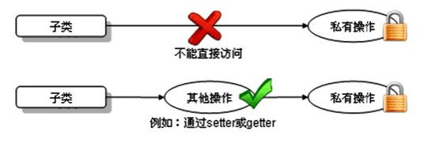

# 面向对象之三

# 面向对象三大特征之封装

## 1. 封装概述

### 1.1 为什么需要封装？

* 我要用洗衣机，只需要按一下开关和洗涤模式就可以了。有必要了解洗衣机内部的结构吗？有必要碰电动机吗？
* 我们使用的电脑，内部有CPU、硬盘、键盘、鼠标等等，每一个部件通过某种连接方式一起工作，但是各个部件之间又是独立的
* 现实生活中，每一个个体与个体之间是有边界的，每一个团体与团体之间是有边界的，而同一个个体、团体内部的信息是互通的，只是对外有所隐瞒。

面向对象编程语言是对客观世界的模拟，客观世界里每一个事物的内部信息都是隐藏在对象内部的，外界无法直接操作和修改，只能通过指定的方式进行访问和修改。封装可以被认为是一个保护屏障，防止该类的代码和数据被其他类随意访问。适当的封装可以让代码更容易理解与维护，也加强了代码的安全性。

随着我们系统越来越复杂，类会越来越多，那么类之间的访问边界必须把握好，面向对象的开发原则要遵循“高内聚、低耦合”，而“高内聚，低耦合”的体现之一：

* 高内聚：类的内部数据操作细节自己完成，不允许外部干涉；
* 低耦合：仅对外暴露少量的方法用于使用

隐藏对象内部的复杂性，只对外公开简单的接口。便于外界调用，从而提高系统的可扩展性、可维护性。通俗的讲，把该隐藏的隐藏起来，该暴露的暴露出来。这就是封装性的设计思想。

### 1.2 如何实现封装呢？

#### 概述

通俗的讲，封装就是把该隐藏的隐藏起来，该暴露的暴露出来。那么暴露的程度如何控制呢？就是依赖访问控制修饰符，也称为权限修饰符来控制。

访问控制修饰符来控制相应的可见边界，边界有如下：

（1）类

（2）包

（3）子类

（4）模块：Java9之后引入

#### 权限修饰符

权限修饰符：public,protected,缺省,private

| 修饰符    | 本类 | 本包 | 其他包子类 | 其他包非子类 |
| --------- | ---- | ---- | ---------- | ------------ |
| private   | √    | ×    | ×          | ×            |
| 缺省      | √    | √    | ×          | ×            |
| protected | √    | √    | √          | ×            |
| public    | √    | √    | √          | √            |

外部类：public和缺省

成员变量、成员方法、构造器、成员内部类：public,protected,缺省,private

提示：protected修饰非静态成员，**跨包时，**只能在子类的非静态成员中访问，在静态成员中无论是否创建对象都不能访问。

### 1.3 示例

#### 示例一：本包非子类与子类

~~~ java
package com.gec.test01.access1;

public class Father {
	public int a;
	protected int b;
	int c;
	private int d;
	
	public static int e;
	protected static int f;
	static int g;
	private static int h;
}

class Mother{
	public Mother(){
		
	}
}
~~~

~~~ java
package com.gec.test01.access1;

//本包非子类中
public class Other {
	public static void method(){
		Father obj = new Father();
		System.out.println(obj.a);
		System.out.println(obj.b);
		System.out.println(obj.c);
//		System.out.println(obj.d);//跨类不可见
		
		System.out.println(Father.e);
		System.out.println(Father.f);
		System.out.println(Father.g);
//		System.out.println(h);//跨类不可见
	}
	
	public void fun(){
		Father obj = new Father();
		System.out.println(obj.a);
		System.out.println(obj.b);
		System.out.println(obj.c);
//		System.out.println(obj.d);//跨类不可见
		
		System.out.println(Father.e);
		System.out.println(Father.f);
		System.out.println(Father.g);
//		System.out.println(h);//跨类不可见
	}
}

~~~

- 定义一个子类

~~~ java
package com.gec.test01.access1;

//本包子类中
public class Sub extends Father{
	public static void method(){
		//静态直接访问非静态都不行
/*		System.out.println(a);
		System.out.println(b);
		System.out.println(c);
		System.out.println(d);*/
		
		Father obj = new Father();
		System.out.println(obj.a);
		System.out.println(obj.b);
		System.out.println(obj.c);
//		System.out.println(obj.d);//跨类不可见
		
		System.out.println(e);
		System.out.println(f);
		System.out.println(g);
//		System.out.println(h);//跨类不可见
	}
	
	public void fun(){
		System.out.println(a);
		System.out.println(b);
		System.out.println(c);
//		System.out.println(d);//跨类不可见
		
		System.out.println(e);
		System.out.println(f);
		System.out.println(g);
//		System.out.println(h);//跨类不可见
	}
}
~~~

#### 示例二：跨包子类和非子类


## 2.  成员变量/属性私有化问题

**<span style="color:red">成员变量（field）私有化</span>之后，提供标准的<span style="color:red">get/set</span>方法，我们把这种成员变量也称为<span style="color:red">属性（property）</span>。**或者可以说只要能通过get/set操作的就是事物的属性，哪怕它没有对应的成员变量。

### 2.1 成员变量封装的目的

* 隐藏类的实现细节
* 让使用者只能通过事先预定的方法来访问数据，从而可以在该方法里面加入控制逻辑，限制对成员变量的不合理访问。还可以进行数据检查，从而有利于保证对象信息的完整性。
* 便于修改，提高代码的可维护性。主要说的是隐藏的部分，在内部修改了，如果其对外可以的访问方式不变的话，外部根本感觉不到它的修改。例如：Java8->Java9，String从char[]转为byte[]内部实现，而对外的方法不变，我们使用者根本感觉不到它内部的修改。

### 2.2 实现步骤

1. 使用 `private` 修饰成员变量

```java
private 数据类型 变量名 ；
```

代码如下：

```java
public class Chinese {
    private static String country;
    private String name;
  	private int age;
    private boolean marry;
}
```

2. 提供 `getXxx`方法 / `setXxx` 方法，可以访问成员变量，代码如下：

```java
public class Chinese {
  	private static String country;
    private String name;
  	private int age;
    private boolean marry;
    
    public static void setCountry(String c){
        country = c;
    }
    
    public static String getCountry(){
        return country;
    }

	public void setName(String n) {
		name = n;
    }

    public String getName() {
        return name;
	}

    public void setAge(int a) {
        age = a;
    }

    public int getAge() {
        return age;
    }
    
    public void setMarry(boolean m){
        marry = m;
    }
    
    public boolean isMarry(){
        return marry;
    }
}
```

### 2.3 如何解决局部变量与成员变量同名问题

当局部变量与类变量（静态成员变量）同名时，在类变量前面加“类名."；

当局部变量与实例变量（非静态成员变量）同名时，在实例变量前面加“this.”

```java
public class Chinese {
  	private static String country;
    private String name;
  	private int age;
    
    public static void setCountry(String country){
        Chinese.country = country;
    }
    
    public static String getCountry(){
        return country;
    }

	public void setName(String name) {
		this.name = name;
    }

    public String getName() {
        return name;
	}

    public void setAge(int age) {
        this.age = age;
    }

    public int getAge() {
        return age;
    }
}
```

### 2.4  练习

（1）定义矩形类Rectangle，

​	声明静态变量sides，初始化为4，表示矩形边长的总数量；

​	声明实例变量长和宽

​	全部私有化，并提供相应的get/set方法

（2）在测试类中创建Rectangle对象，并调用相应的方法测试

（2）测试类ObjectArrayTest的main中创建一个可以装3个学生对象的数组，并且按照学生成绩排序，显示学生信息


## 3. 构造器（Constructor)

我们发现我们new完对象时，所有成员变量都是默认值，如果我们需要赋别的值，需要挨个为它们再赋值，太麻烦了。我们能不能在new对象时，直接为当前对象的某个或所有成员变量直接赋值呢。

可以，Java给我们提供了构造器。

#### 1、构造器的作用

在创建对象的时候为实例变量赋初始值。

> **注意：构造器只为实例变量初始化，不为静态类变量初始化**

#### 2、构造器的语法格式

构造器又称为构造方法，那是因为它长的很像方法。但是和方法还有有所区别的。

```java
【修饰符】 构造器名(){
    // 实例初始化代码
}
【修饰符】 构造器名(参数列表){
	// 实例初始化代码
}
```

代码如下：

```java
public class Student {
	private String name;
	private int age;
	// 无参构造
  	public Student() {} 
 	// 有参构造
  	public Student(String name,int age) {
		this.name = name;
    	this.age = age; 
	}
  	
	public String getName() {
		return name;
	}
	public void setName(String name) {
		this.name = name;
	}
	public int getAge() {
		return age;
	}
	public void setAge(int age) {
		this.age = age;
	}
}
```

注意事项：

1. 构造器名必须与它所在的类名必须相同。
2. 它没有返回值，所以不需要返回值类型，甚至不需要void
3. 如果你不提供构造器，系统会给出无参数构造器，并且该构造器的修饰符默认与类的修饰符相同
4. 如果你提供了构造器，系统将不再提供无参数构造器，除非你自己定义。
5. 构造器是可以重载的，既可以定义参数，也可以不定义参数。
6. 构造器的修饰符只能是权限修饰符，不能被其他任何修饰

#### 3、练习

（1）声明一个员工类，

* 包含属性：编号、姓名、薪资、性别，要求属性私有化，提供get/set，
* 提供无参构造器和有参构造器
* 提供getInfo()

（2）在测试类的main中分别用无参构造和有参构造创建员工类对象，调用getInfo

## 4. 标准JavaBean

`JavaBean` 是 Java语言编写类的一种标准规范。符合`JavaBean` 的类，要求：

（1）类必须是具体的和公共的，

（2）并且具有无参数的构造方法，

（3）成员变量私有化，并提供用来操作成员变量的`set` 和`get` 方法。

```java
public class ClassName{
  //成员变量
    
  //构造方法
  	//无参构造方法【必须】
  	//有参构造方法【建议】
  	
  //getXxx()
  //setXxx()
  //其他成员方法
}
```

 编写符合`JavaBean` 规范的类，以学生类为例，标准代码如下：

```java
public class Student {
	// 成员变量
	private String name;
	private int age;

	// 构造方法
	public Student() {
	}

	public Student(String name, int age) {
		this.name = name;
		this.age = age;
	}

	// get/set成员方法
	public void setName(String name) {
		this.name = name;
	}

	public String getName() {
		return name;
	}

	public void setAge(int age) {
		this.age = age;
	}

	public int getAge() {
		return age;
	}
    
    //其他成员方法列表
    public String getInfo(){
        return "姓名：" + name + "，年龄：" + age;
    }
}
```

测试类，代码如下：

```java
public class TestStudent {
	public static void main(String[] args) {
		// 无参构造使用
		Student s = new Student();
		s.setName("柳岩");
		s.setAge(18);
		System.out.println(s.getName() + "---" + s.getAge());
        System.out.println(s.getInfo());

		// 带参构造使用
		Student s2 = new Student("赵丽颖", 18);
		System.out.println(s2.getName() + "---" + s2.getAge());
        System.out.println(s2.getInfo());
	}
}
```

# 面向对象三大特征之继承

## 1. 继承的概述

- 生活中的继承

  #### 生活中的继承

  * 财产：富二代

  * 样貌：如图所示：

    才华：如图所示：

    


  #### 继承的由来

  如图所示：

  

  多个类中存在相同属性和行为时，将这些内容抽取到单独一个类中，那么多个类中无需再定义这些属性和行为，只需要和抽取出来的类构成某种关系。如图所示：

  

  

  其中，多个类可以称为**子类**，也叫**派生类**；多个类抽取出来的这个类称为**父类**、**超类（superclass）**或者**基类**。

  继承描述的是事物之间的所属关系，这种关系是：`is-a` 的关系。例如，图中猫属于动物，狗也属于动物。可见，父类更通用，子类更具体。我们通过继承，可以使多种事物之间形成一种关系体系。

  #### 继承的好处

  * 提高**代码的复用性**。

  * 提高**代码的扩展性**。

  * 类与类之间产生了关系，是学习**多态的前提**。


## 2. 继承的格式

通过 `extends` 关键字，可以声明一个子类继承另外一个父类，定义格式如下：

```java
【修饰符】 class 父类 {
	...
}

【修饰符】 class 子类 extends 父类 {
	...
}

```

继承演示，代码如下：

```java
/*
 * 定义动物类Animal，做为父类
 */
class Animal {
    // 定义name属性
	String name; 
    // 定义age属性
    int age;
	// 定义动物的吃东西方法
	public void eat() {
		System.out.println(age + "岁的" + name + "在吃东西");
	}
}

/*
 * 定义猫类Cat 继承 动物类Animal
 */
class Cat extends Animal {
	// 定义一个猫抓老鼠的方法catchMouse
	public void catchMouse() {
		System.out.println("抓老鼠");
	}
}

/*
 * 定义测试类
 */
public class ExtendDemo01 {
	public static void main(String[] args) {
        // 创建一个猫类对象
		Cat cat = new Cat()；
      
        // 为该猫类对象的name属性进行赋值
		cat.name = "Tom";
      
      	// 为该猫类对象的age属性进行赋值
		cat.age = 2;
        
        // 调用该猫的catchMouse()方法
		cat.catchMouse();
		
      	// 调用该猫继承来的eat()方法
      	cat.eat();
	}
}

演示结果：
抓老鼠
2岁的Tom在吃东西
```

## 3. 继承的特点

### 继承的特点一：成员变量

#### 1、父类成员变量私有化（private）

* 父类中的成员，无论是公有(public)还是私有(private)，均会被子类继承。

* 子类虽会继承父类私有(private)的成员，但子类不能对继承的私有成员直接进行访问，可通过继承的get/set方法进行访问。如图所示：

  

代码如下：

```java
/*
 * 定义动物类Animal，做为父类
 */
class Animal {
    // 定义name属性
	private String name; 
    // 定义age属性
    public int age;
	// 定义动物的吃东西方法
	public void eat() {
		System.out.println(age + "岁的" + name + "在吃东西");
	}
}

/*
 * 定义猫类Cat 继承 动物类Animal
 */
class Cat extends Animal {
	// 定义一个猫抓老鼠的方法catchMouse
	public void catchMouse() {
		System.out.println("抓老鼠");
	}
}

/*
 * 定义测试类
 */
public class ExtendDemo01 {
	public static void main(String[] args) {
        // 创建一个猫类对象
		Cat cat = new Cat()；
      
        // 为该猫类对象的name属性进行赋值
		//cat.name = "Tom";// 编译报错
      
      	// 为该猫类对象的age属性进行赋值
		cat.age = 2;
        
        // 调用该猫的catchMouse()方法
		cat.catchMouse();
		
      	// 调用该猫继承来的eat()方法
      	cat.eat();
	}
}
```

#### 2、父子类成员变量重名

我们说父类的所有成员变量都会继承到子类中，那么如果子类出现与父类同名的成员变量会怎么样呢？

父类代码：

```java
public class Father {
	public int i=1;
	private int j=1;
	public int k=1;
	public int getJ() {
		return j;
	}
	public void setJ(int j) {
		this.j = j;
	}
}
```

子类代码：

```java
public class Son extends Father{
	public int i=2;
	private int j=2;
	public int m=2;
}	
```

现在想要在子类Son中声明一个test()方法，并打印这些所有变量的值，该如何实现？

```java
public class Son extends Father{
	public int i=2;
	private int j=2;
	public int m=2;
	
	public void test() {
		System.out.println("父类继承的i：" + super.i);
		System.out.println("子类的i：" +i);
//		System.out.println(super.j);
		System.out.println("父类继承的j：" +getJ());
		System.out.println("子类的j：" +j);
		System.out.println("父类继承的k：" +k);
		System.out.println("子类的m：" +m);
	}	
}	
```

结论：

（1）当父类的成员变量私有化时，在子类中是无法直接访问的，所以是否重名不影响，如果想要访问父类的私有成员变量，只能通过父类的get/set方法访问；

（2）当父类的成员变量非私有时，在子类中可以直接访问，所以如果有重名时，就需要加“super."进行区别。

使用格式：

```java
super.父类成员变量名
```

以上test()调用结果：

```java
public class TestSon{
	public static void main(String[] args){
		Son s = new Son();
		s.test();
	}
}
```

```java
父类继承的i：1
子类的i：2
父类继承的j：1
子类的j：2
父类继承的k：1
子类的m：2
```

### 继承的特点二：成员方法

我们说父类的所有方法子类都会继承，但是当某个方法被继承到子类之后，子类觉得父类原来的实现不适合于子类，该怎么办呢？我们可以进行方法重写 (Override)

#### 1、方法重写

比如新的手机增加来电显示头像的功能，代码如下：

```java
class Phone {
	public void sendMessage(){
		System.out.println("发短信");
	}
	public void call(){
		System.out.println("打电话");
	}
	public void showNum(){
		System.out.println("来电显示号码");
	}
}

//智能手机类
class NewPhone extends Phone {
	
	//重写父类的来电显示号码功能，并增加自己的显示姓名和图片功能
	public void showNum(){
		//调用父类已经存在的功能使用super
		super.showNum();
		//增加自己特有显示姓名和图片功能
		System.out.println("显示来电姓名");
		System.out.println("显示头像");
	}
}

public class ExtendsDemo06 {
	public static void main(String[] args) {
      	// 创建子类对象
      	NewPhone np = new NewPhone()；
        
        // 调用父类继承而来的方法
        np.call();
      
      	// 调用子类重写的方法
      	np.showNum();

	}
}

```

> 小贴士：这里重写时，用到super.父类成员方法，表示调用父类的成员方法。

注意事项：

1.@Override：写在方法上面，用来检测是不是有效的正确覆盖重写。这个注解就算不写，只要满足要求，也是正确的方法覆盖重写。建议保留

2.必须保证父子类之间方法的名称相同，参数列表也相同。
3.子类方法的返回值类型必须【小于等于】父类方法的返回值类型（小于其实就是是它的子类，例如：Student < Person）。

> 注意：如果返回值类型是基本数据类型和void，那么必须是相同

4.子类方法的权限必须【大于等于】父类方法的权限修饰符。

小扩展提示：public > protected > 缺省 > private

5.重写方法不能抛出新的异常，或者超过了父类范围的异常，但是可以抛出更少、更有限的异常，或者不抛出异常。

6.几种特殊的方法不能被重写

* 静态方法不能被重写
* 私有等在子类中不可见的方法不能被重写
* final方法不能被重写

###  继承的特点三：单继承限制

1. Java只支持单继承，不支持多继承。

```java
//一个类只能有一个父类，不可以有多个父类。
class C extends A{} 	//ok
class C extends A，B...	//error
```

2. Java支持多层继承(继承体系)。

```java
class A{}
class B extends A{}
class C extends B{}
```

> 顶层父类是Object类。所有的类默认继承Object，作为父类。

3. 子类和父类是一种相对的概念。

   例如：B类对于A来说是子类，但是对于C类来说是父类

4. 一个父类可以同时拥有多个子类

### 继承的特点四：构造方法

当类之间产生了关系，其中各类中的构造方法，又产生了哪些影响呢？

首先我们要回忆两个事情，构造方法的定义格式和作用。

1. 构造方法的名字是与类名一致的。

   所以子类是**无法继承**父类构造方法的。

2. 构造方法的作用是初始化实例变量的，而子类又会从父类继承所有成员变量

   所以子类的初始化过程中，**必须**先执行父类的初始化动作。子类的构造方法中默认有一个`super()` ，表示调用父类的实例初始化方法，父类成员变量初始化后，才可以给子类使用。代码如下：

   ~~~ java
   class Fu {
     private int n;
     Fu(){
       System.out.println("Fu()");
     }
   }
   class Zi extends Fu {
     Zi(){
       // super（），调用父类构造方法
       super();
       System.out.println("Zi（）");
     }  
   }
   public class ExtendsDemo07{
     public static void main (String args[]){
       Zi zi = new Zi();
     }
   }
   输出结果：
   Fu（）
   Zi（）
   ~~~

子类对象实例化过程中必须先完成从父类继承的成员变量的实例初始化，这个过程是通过调用父类的实例初始化方法来完成的。

* super()：表示调用父类的无参实例初始化方法，要求父类必须有无参构造，而且可以省略不写；
* super(实参列表)：表示调用父类的有参实例初始化方法，当父类没有无参构造时，子类的构造器首行必须写super(实参列表)来明确调用父类的哪个有参构造（其实是调用该构造器对应的实例初始方法）
* super()和super(实参列表)都只能出现在子类构造器的首行

### 练习

1、声明父类：Person类
包含属性：姓名，年龄，性别
属性私有化，get/set
包含getInfo()方法：例如：姓名：张三，年龄：23，性别：男

2、声明子类：Student类，继承Person类
新增属性：score成绩
属性私有化，get/set
包含getInfo()方法：例如：姓名：张三，年龄：23，性别：男，成绩：89

3、声明子类：Teacher类，继承Person类
新增属性：salary薪资
属性私有化，get/set
包含getInfo()方法：例如：姓名：张三，年龄：23，性别：男，薪资：10000

## 4. this和super关键字

### 4.1 this关键字

#### 1、this的含义

this代表当前对象

#### 2、this使用位置

* this在实例初始化相关的代码块和构造器中：表示正在创建的那个实例对象，即正在new谁，this就代表谁
* this在非静态实例方法中：表示调用该方法的对象，即谁在调用，this就代表谁。
* this不能出现在静态代码块和静态方法中

#### 3、this使用格式

（1）this.成员变量名

* 当方法的局部变量与当前对象的成员变量重名时，就可以在成员变量前面加this.，如果没有重名问题，就可以省略this.
* this.成员变量会先从本类声明的成员变量列表中查找，如果未找到，会去从父类继承的在子类中仍然可见的成员变量列表中查找

（2）this.成员方法

* 调用当前对象的成员方法时，都可以加"this."，也可以省略，实际开发中都省略
* 当前对象的成员方法，先从本类声明的成员方法列表中查找，如果未找到，会去从父类继承的在子类中仍然可见的成员方法列表中查找

（3）this()或this(实参列表)

* 只能调用本类的其他构造器


* 必须在构造器的首行


* 如果一个类中声明了n个构造器，则最多有 n - 1个构造器中使用了"this(【实参列表】)"，否则会发生递归调用死循环


### 4.2  super关键字

#### 1、super的含义

super代表当前对象中从父类的引用的

#### 2、super使用的前提

* 通过super引用父类的xx，都是在子类中仍然可见的
* 不能在静态代码块和静态方法中使用super

#### 3、super的使用格式

（1）super.成员变量

在子类中访问父类的成员变量，特别是当子类的成员变量与父类的成员变量重名时。

```java
public class Person {
	private String name;
	private int age;
	//其他代码省略
}
public class Student extends Person{
	private int score;
	//其他成员方法省略
}
public class Test{
    public static void main(String[] args){
    	Student stu = new Student();
    }
}
```


```java
public class Test{
    public static void main(String[] args){
    	Son s = new Son();
    	s.test(30);
    }
}
class Father{
	int a = 10;
}
class Son extends Father{
	int a = 20;
	public void test(int a){
		System.out.println(super.a);//10
		System.out.println(this.a);//20
		System.out.println(a);//30
	}
}
```

（2）super.成员方法

在子类中调用父类的成员方法，特别是当子类重写了父类的成员方法时

```java
public class Test{
    public static void main(String[] args){
    	Son s = new Son();
    	s.test();
    }
}
class Father{
	public void method(){
		System.out.println("aa");
	}
}
class Son extends Father{
	public void method(){
		System.out.println("bb");
	}
	public void test(){
		method();//bb
		this.method();//bb
		super.method();//aa
	}
}
```

（3）super()或super(实参列表)

在子类的构造器首行，用于表示调用父类的哪个实例初始化方法

> super() 和 this() 都必须是在构造方法的第一行，所以不能同时出现。

### 4.3  就近原则和追根溯源原则

#### 1、找变量

* **没有super和this**
  * 在构造器、代码块、方法中如果出现使用某个变量，先查看是否是当前块声明的局部变量，
  * 如果不是局部变量，先从当前执行代码的本类去找成员变量
  * 如果从当前执行代码的本类中没有找到，会往上找父类的（非private，跨包还不能是缺省的）

* **this** ：代表当前对象
  * 通过this找成员变量时，先从当前执行代码的本类中找，没有的会往上找父类的（非private，跨包还不能是缺省的）。

* **super** ：代表父类的
  * 通过super找成员变量，直接从当前执行代码所在类的父类找
  * super()或super(实参列表)只能从直接父类找
  * 通过super只能访问父类在子类中可见的（非private，跨包还不能是缺省的）


> 注意：super和this都不能出现在静态方法和静态代码块中，因为super和this都是存在与**对象**中的

~~~ java
class Father{
	int a = 10;
	int b = 11;
}
class Son extends Father{
	int a = 20;
	
	public void test(){
		//子类与父类的属性同名，子类对象中就有两个a
		System.out.println("父类的a：" + super.a);//10    直接从父类局部变量找
		System.out.println("子类的a：" + this.a);//20   先从本类成员变量找
		System.out.println("子类的a：" + a);//20  先找局部变量找，没有再从本类成员变量找
		
		//子类与父类的属性不同名，是同一个b
		System.out.println("b = " + b);//11  先找局部变量找，没有再从本类成员变量找，没有再从父类找
		System.out.println("b = " + this.b);//11   先从本类成员变量找，没有再从父类找
		System.out.println("b = " + super.b);//11  直接从父类局部变量找
	}
	
	public void method(int a){
		//子类与父类的属性同名，子类对象中就有两个成员变量a，此时方法中还有一个局部变量a
		System.out.println("父类的a：" + super.a);//10  直接从父类局部变量找
		System.out.println("子类的a：" + this.a);//20  先从本类成员变量找
		System.out.println("局部变量的a：" + a);//30  先找局部变量
	}
    
    public void fun(int b){
        System.out.println("b = " + b);//13  先找局部变量
		System.out.println("b = " + this.b);//11  先从本类成员变量找
		System.out.println("b = " + super.b);//11  直接从父类局部变量找
    }
}
public class TestInherite2 {
	public static void main(String[] args) {
		Son son = new Son();
		System.out.println(son.a);//20
		System.out.println(son.b);//11
		
		son.test();
		
		son.method(30);
        
        son.fun(13);
	}
}
~~~

## 5. 成员变量初始化方式

### 5.1、成员变量有默认值

| 类别     | 具体类型                       | 默认值   |
| -------- | ------------------------------ | -------- |
| 基本类型 | 整数（byte，short，int，long） | 0        |
|          | 浮点数（float，double）        | 0.0      |
|          | 字符（char）                   | '\u0000' |
|          | 布尔（boolean）                | false    |
|          | 数据类型                       | 默认值   |
| 引用类型 | 数组，类，接口                 | null     |

我们知道类中成员变量都有默认值，但是现在我们要为成员变量赋默认值以外的值，我们该怎么办呢？

### 5.2、代码块

如果成员变量想要初始化的值不是一个硬编码的常量值，而是需要通过复杂的计算或读取文件、或读取运行环境信息等方式才能获取的一些值，该怎么办呢？

* 静态初始化块：为静态变量初始化


```java
【修饰符】 class 类名{
    static{
		静态初始化
	}
}

```

* 实例初始化：为实例变量初始化


```java
【修饰符】 class 类名{
    {
		实例初始化块
	}
}
```

静态初始化块：在类初始化时由类加载器调用执行，每一个类的静态初始化只会执行一次，早于实例对象的创建。

实例初始化块：每次new实例对象时自动执行，每new一个对象，执行一次。

~~~ java
public class Student{
	private static String school;
	private String name;
	private char gender;
	
	static{
		//获取系统属性，这里只是说明school的初始化过程可能比较复杂
		school = System.getProperty("school");
		if(school==null) {
			school = "粤嵌";
		}
	}
	{
		String info = System.getProperty("gender");
		if(info==null) {
			gender = '男';
		}else {
			gender = info.charAt(0);
		}
	}
	public static String getSchool() {
		return school;
	}
	public static void setSchool(String school) {
		Student.school = school;
	}
	public String getName() {
		return name;
	}
	public void setName(String name) {
		this.name = name;
	}
	public char getGender() {
		return gender;
	}
	public void setGender(char gender) {
		this.gender = gender;
	}

}
~~~

### 5.3. 类初始化

1、类初始化的目的：为类中的静态变量进行赋值。

2、实际上，类初始化的过程时在调用一个<clinit>()方法，而这个方法是编译器自动生成的。编译器会将如下两部分的**所有**代码，**按顺序**合并到类初始化<clinit>()方法体中。
**clinit** are the static initialization blocks for the class, and static field initialization 

（1）静态类成员变量的显式赋值语句

（2）静态代码块中的语句

3、每一个类都有一个类初始化方法<clinit>()方法，然后子类初始化时，如果发现父类加载和没有初始化，会先加载和初始化父类，然后再加载和初始化子类。一个类，只会初始化一次。

**示例代码1：单个类**

~~~ java
public class Test{
    public static void main(String[] args){
    	Father.test();
    }
}
class Father{
	private static int a = getNumber();//这里调用方法为a变量显式赋值的目的是为了看到这个过程
	static{
		System.out.println("Father(1)");
	}
	private static int b = getNumber();
	static{
		System.out.println("Father(2)");
	}
	
	public static int getNumber(){
		System.out.println("getNumber()");
		return 1;
	}
	
	public static void test(){
		System.out.println("Father:test()");
	}
}
~~~

### 5.4. 实例初始化

1、实例初始化的目的：为类中非静态成员变量赋值

2、实际上我们编写的代码在编译时，会自动处理代码，整理出一个<clinit>()的类初始化方法，还会整理出一个或多个的<init>(...)实例初始化方法。一个类有几个实例初始化方法，由这个类就有几个构造器决定。

 **init** is the (or one of the) constructor(s) for the instance, and non-static field initialization.

实例初始化方法的方法体，由四部分构成：

（1）super()或super(实参列表)    这里选择哪个，看原来构造器首行是哪句，没写，默认就是super()

（2）非静态实例变量的显示赋值语句

（3）非静态代码块

（4）对应构造器中的代码

特别说明：其中（2）和（3）是按顺序合并的，（1）一定在最前面（4）一定在最后面

3、执行特点：

* 创建对象时，才会执行
* 每new一个对象，都会完成该对象的实例初始化
* 调用哪个构造器，就是执行它对应的<init>实例初始化方法
* 创建子类对象时，父类对应的实例初始化会被先执行，执行父类哪个实例初始化方法，看用super()还是super(实参列表)

#### 示例代码1：单个类

```java
public class Test{
    public static void main(String[] args){
    	Father f1 = new Father();
    	Father f2 = new Father("atguigu");
    }
}
class Father{
	private int a = getNumber();
	private String info;
	{
		System.out.println("Father(1)");
	}
	Father(){
		System.out.println("Father()无参构造");
	}
	Father(String info){
		this.info = info;
		System.out.println("Father(info)有参构造");
	}
	private int b = getNumber();
	{
		System.out.println("Father(2)");
	}
	
	public int getNumber(){
		System.out.println("Father:getNumber()");
		return 1;
	}
}
```

```java
运行结果：
Father:getNumber()
Father(1)
Father:getNumber()
Father(2)
Father()无参构造
Father:getNumber()
Father(1)
Father:getNumber()
Father(2)
Father(info)有参构造
```

#### 

### 5.5 类初始化与实例初始化

类初始化肯定优先于实例初始化。

类初始化只做一次。

实例初始化是每次创建对象都要进行。

## 6. 多态

### 6.1 引入

多态是继封装、继承之后，面向对象的第三大特性。

生活中，比如求面积的功能，圆、矩形、三角形实现起来是不一样的。跑的动作，小猫、小狗和大象，跑起来是不一样的。再比如飞的动作，昆虫、鸟类和飞机，飞起来也是不一样的。可见，同一行为，通过不同的事物，可以体现出来的不同的形态。那么此时就会出现各种子类的类型。

### 6.2 定义

#### 1、格式

```java
父类类型 变量名 = 子类对象；
```

> 父类类型：指子类对象继承的父类类型，或者实现的父接口类型。

例如：

```java
class Person{
	private String name;
	private int age;
	
    Person(String name, int age){
        this.name = name;
        this.age = age;
    }
    
	public void speak(){
		System.out.println(name + "说：我今年" + age);
	}
}
class Man extends Person{
    Man(String name, int age){
        super(name,age);
    }
}
class Woman extends Person{
    Woman(String name, int age){
        super(name,age);
    }
}
```

```java
class Test{
	public static void main(String[] args){
		Person[] arr = new Person[2];
		arr[0] = new Man("张三",23);
		arr[1] = new Woman("如花",18);
		
		for(int i=0; i<arr.length; i++){
			arr[i].speak();
		}
		System.out.println("------------------------");
		
		show(new Man("张三",23));
		show(new Woman("如花",18));
	}
	
	public static void show(Person p){
		p.speak();
	}
}
```

#### 2、编译时类型与运行时类型不一致问题

* 编译时，看“父类”，只能调用父类声明的方法，不能调用子类扩展的方法；

* 运行时，看“子类”，一定是执行子类重写的方法体；

代码如下：

定义父类：

```java
public class Animal {  
    public void eat(){
        System.out.println("吃~~~");
    }
}  
```

定义子类：

```java
class Cat extends Animal {  
    public void eat() {  
        System.out.println("吃鱼");  
    }  
    public void catchMouse(){
        System.out.println("抓老鼠"); 
    }
}  

class Dog extends Animal {  
    public void eat() {  
        System.out.println("吃骨头");  
    }  
}
```

定义测试类：

```java
public class Test {
    public static void main(String[] args) {
        // 多态形式，创建对象
        Animal a1 = new Cat();  
        // 调用的是 Cat 的 eat
        a1.eat();    
        //a1.catchMouse();//错误，catchMouse()是子类扩展的方法，父类中没有
        /*
        多态引用，编译时，看“父类”，只能调用父类声明的方法；
        	    运行时，看“子类”，一定是执行子类重写的方法体；
        */

        // 多态形式，创建对象
        Animal a2 = new Dog(); 
        // 调用的是 Dog 的 eat
        a2.eat();               
    }  
}
```

### 6.3 多态的应用

#### 1、多态应用在形参实参

父类类型作为方法形式参数，子类对象为实参。

代码如下：

```java
public class Test01 {
	public static void main(String[] args) {
		showAnimalEat(new Dog()); //形参 Animal a,实参new Dog() 
								//实参给形参赋值   Animal a = new Dog()   多态引用
		showAnimalEat(new Cat());//形参 Animal a,实参new Cat() 
								//实参给形参赋值   Animal a = new Cat()   多态引用
	}
	
	/*
	 * 设计一个方法，可以查看所有动物的吃的行为
	 * 关注的是所有动物的共同特征：eat()
	 * 所以形参，设计为父类的类型
	 * 	此时不关注子类特有的方法
	 */
	public static void showAnimalEat (Animal a){
        a.eat();
//        a.catchMouse();//错误，因为a现在编译时类型是Animal，只能看到父类中有的方法
    }

}
```

#### 2、多态应用在数组

数组元素类型声明为父类类型，实际存储的是子类对象

```java
public class Test02 {
	public static void main(String[] args) {
		/*
		 * 声明一个数组，可以装各种动物的对象，看它们吃东西的样子
		 */
		Animal[] arr = new Animal[2]; //此时不是new Animal的对象，而是new Animal[]的数组对象
									//在堆中开辟了长度为5的数组空间，用来装Animal或它子类对象的地址
		arr[0] = new Cat();//多态引用   左边arr[0] 是Animal类型，右边是new Cat()
							//把Cat对象，赋值给Animal类型的变量
		arr[1] = new Dog();
		
		for (int i = 0; i < arr.length; i++) {
			arr[i].eat();
//			arr[i].catchMouse();错误，因为arr[i]现在编译时类型是Animal，只能看到父类中有的方法
		}
	}
}
```

#### 3、多态应用在返回值

方法的返回值类型声明为父类的类型，实际返回值是子类对象

```java
public class Test03 {
	public static void main(String[] args) {
		Animal c = buy("猫咪");
		System.out.println(c.getClass());
		c.eat();
	}
	/*
	 * 设计一个方法，可以购买各种动物的对象，此时不确定是那种具体的动物
	 * 
	 * 返回值类型是父类的对象
	 * 
	 * 多态体现在   返回值类型  Animal ，实际返回的对象是子类的new Cat()，或new Dog()
	 */
	public static Animal buy(String name){
        if("猫咪".equals(name)){
            return new Cat();
        }else if("小狗".equals(name)){
            return new Dog();
        }
        return null;
    }
}
```

#### 多态练习

（1）声明父类Traffic，包含方法public void drive()
（2）声明子类Car,Bicycle等，并重写drive方法
（3）在测试类的main中创建一个数组，有各种交通工具，遍历调用drive()方法
模拟马路上跑的各种交通工具

### 6.4 向上转型与向下转型

* **向上转型**：当左边的变量的类型（父类） > 右边对象/变量的类型（子类），我们就称为向上转型
  * 此时，编译时按照左边变量的类型处理，就只能调用父类中有的变量和方法，不能调用子类特有的变量和方法了
  * 但是，运行时，仍然是对象本身的类型
  * 此时，一定是安全的，而且也是自动完成的

* **向下转型**：当左边的变量的类型（子类）<右边对象/变量的类型（父类），我们就称为向下转型
  * 此时，编译时按照左边变量的类型处理，就可以调用子类特有的变量和方法了
  * 但是，运行时，仍然是对象本身的类型
  * 此时，不一定是安全的，需要使用(类型)进行强制类型转换
  * 不是所有通过编译的向下转型都是正确的，可能会发生ClassCastException，为了安全，可以通过isInstanceof关键字进行判断

- 举例

  ~~~ java
  public class Test {
      public static void main(String[] args) {
          // 向上转型  
          Animal a = new Cat();  
          a.eat(); 				// 调用的是 Cat 的 eat
  
          // 向下转型  
          Cat c = (Cat)a;       
          c.catchMouse(); 		// 调用的是 Cat 的 catchMouse
          
          // 向下转型  
          //Dog d = (Dog)a;     //这段代码可以通过编译，但是运行时，却报出了ClassCastException 
          //这是因为，明明创建了Cat类型对象，运行时，当然不能转换成Dog对象的。这两个类型并没有任何继承关系，		//不符合类型转换的定义。
          //d.watchHouse();        // 调用的是 Dog 的 watchHouse 
          
          Animal a2 = new Animal();
         // Dog d2 = (Dog)a2;//这段代码可以通过编译，但是运行时，却报出了ClassCastException 
         // d2.watchHouse(); // 调用的是 Dog 的 watchHouse
      }  
  }
  ~~~

  