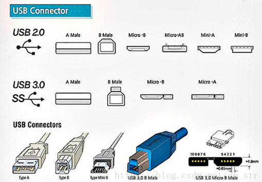
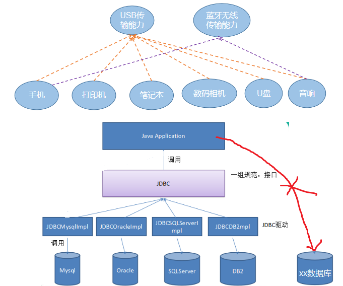

# 面向对象之四

## 1. 多态

### 1.1 引入

多态是继封装、继承之后，面向对象的第三大特性。

生活中，比如求面积的功能，圆、矩形、三角形实现起来是不一样的。跑的动作，小猫、小狗和大象，跑起来是不一样的。再比如飞的动作，昆虫、鸟类和飞机，飞起来也是不一样的。可见，同一行为，通过不同的事物，可以体现出来的不同的形态。那么此时就会出现各种子类的类型。

### 1.2 多态条件

#### 1.2.1 向上转换

##### 概述 

- 当左边的变量的类型（父类） > 右边对象/变量的类型（子类），我们就称为向上转型

  * 此时，编译时按照左边变量的类型处理，就只能调用父类中有的变量和方法，不能调用子类特有的变量和方法了

  * 但是，运行时，仍然是对象本身的类型

  * 此时，一定是安全的，而且也是自动完成的

##### 格式

- 定义

```java
父类类型 变量名 = 子类对象；
```

> 父类类型：指子类对象继承的父类类型，或者实现的父接口类型。

例如：

```java
class Person{
	private String name;
	private int age;
	
    Person(String name, int age){
        this.name = name;
        this.age = age;
    }
    
	public void speak(){
		System.out.println(name + "说：我今年" + age);
	}
}
class Man extends Person{
    Man(String name, int age){
        super(name,age);
    }
}
class Woman extends Person{
    Woman(String name, int age){
        super(name,age);
    }
}
```

```java
class Test{
	public static void main(String[] args){
		Person[] arr = new Person[2];
		arr[0] = new Man("张三",23);
		arr[1] = new Woman("如花",18);
		
		for(int i=0; i<arr.length; i++){
			arr[i].speak();
		}
		System.out.println("------------------------");
		
		show(new Man("张三",23));
		show(new Woman("如花",18));
	}
	
	public static void show(Person p){
		p.speak();
	}
}
```

#### 1.2.2 编译时类型与运行时类型不一致问题

* 编译时，看“父类”，只能调用父类声明的方法，不能调用子类扩展的方法；
* 运行时，看“子类”，一定是执行子类重写的方法体；

#### 1.2.3 多态实例

代码如下：

定义父类：

```java
public class Animal {  
    public void eat(){
        System.out.println("吃~~~");
    }
}  
```

定义子类：

```java
class Cat extends Animal {  
    public void eat() {  
        System.out.println("吃鱼");  
    }  
    public void catchMouse(){
        System.out.println("抓老鼠"); 
    }
}  

class Dog extends Animal {  
    public void eat() {  
        System.out.println("吃骨头");  
    }  
}
```

定义测试类：

```java
public class Test {
    public static void main(String[] args) {
        // 多态形式，创建对象
        Animal a1 = new Cat();  
        // 调用的是 Cat 的 eat
        a1.eat();    
        //a1.catchMouse();//错误，catchMouse()是子类扩展的方法，父类中没有
        /*
        多态引用，编译时，看“父类”，只能调用父类声明的方法；
        	    运行时，看“子类”，一定是执行子类重写的方法体；
        */

        // 多态形式，创建对象
        Animal a2 = new Dog(); 
        // 调用的是 Dog 的 eat
        a2.eat();               
    }  
}
```

### 1.3 多态的应用

#### 1、多态应用在形参实参

父类类型作为方法形式参数，子类对象为实参。

代码如下：

```java
public class Test01 {
	public static void main(String[] args) {
		showAnimalEat(new Dog()); //形参 Animal a,实参new Dog() 
								//实参给形参赋值   Animal a = new Dog()   多态引用
		showAnimalEat(new Cat());//形参 Animal a,实参new Cat() 
								//实参给形参赋值   Animal a = new Cat()   多态引用
	}
	
	/*
	 * 设计一个方法，可以查看所有动物的吃的行为
	 * 关注的是所有动物的共同特征：eat()
	 * 所以形参，设计为父类的类型
	 * 	此时不关注子类特有的方法
	 */
	public static void showAnimalEat(Animal a){
        a.eat();
//        a.catchMouse();//错误，因为a现在编译时类型是Animal，只能看到父类中有的方法
    }

}
```

#### 2、多态应用在数组

数组元素类型声明为父类类型，实际存储的是子类对象

```java
public class Test02 {
	public static void main(String[] args) {
		/*
		 * 声明一个数组，可以装各种动物的对象，看它们吃东西的样子
		 */
		Animal[] arr = new Animal[2]; //此时不是new Animal的对象，而是new Animal[]的数组对象
									//在堆中开辟了长度为5的数组空间，用来装Animal或它子类对象的地址
		arr[0] = new Cat();//多态引用   左边arr[0] 是Animal类型，右边是new Cat()
							//把Cat对象，赋值给Animal类型的变量
		arr[1] = new Dog();
		
		for (int i = 0; i < arr.length; i++) {
			arr[i].eat();
//			arr[i].catchMouse();错误，因为arr[i]现在编译时类型是Animal，只能看到父类中有的方法
		}
	}
}
```

#### 3、多态应用在返回值

方法的返回值类型声明为父类的类型，实际返回值是子类对象

```java
public class Test03 {
	public static void main(String[] args) {
		Animal c = buy("猫咪");
		System.out.println(c.getClass());
		c.eat();
	}
	/*
	 * 设计一个方法，可以购买各种动物的对象，此时不确定是那种具体的动物
	 * 
	 * 返回值类型是父类的对象
	 * 
	 * 多态体现在   返回值类型  Animal ，实际返回的对象是子类的new Cat()，或new Dog()
	 */
	public static Animal buy(String name){
        if("猫咪".equals(name)){
            return new Cat();
        }else if("小狗".equals(name)){
            return new Dog();
        }
        return null;
    }
}
```

#### 多态练习

（1）声明父类Traffic，包含方法public void drive()
（2）声明子类Car,Bicycle等，并重写drive方法
（3）在测试类的main中创建一个数组，有各种交通工具，遍历调用drive()方法
模拟马路上跑的各种交通工具

### 1.4 向上转型与向下转型

* **向上转型**：当左边的变量的类型（父类） > 右边对象/变量的类型（子类），我们就称为向上转型
  * 此时，编译时按照左边变量的类型处理，就只能调用父类中有的变量和方法，不能调用子类特有的变量和方法了
  * 但是，运行时，仍然是对象本身的类型
  * 此时，一定是安全的，而且也是自动完成的

* **向下转型**：当左边的变量的类型（子类）<右边对象/变量的类型（父类），我们就称为向下转型
  * 此时，编译时按照左边变量的类型处理，就可以调用子类特有的变量和方法了
  * 但是，运行时，仍然是对象本身的类型
  * 此时，不一定是安全的，需要使用(类型)进行强制类型转换
  * 不是所有通过编译的向下转型都是正确的，可能会发生ClassCastException，为了安全，可以通过isInstanceof关键字进行判断

- 举例

  ~~~ java
  public class Test {
      public static void main(String[] args) {
          // 向上转型  
          Animal a = new Cat();  
          a.eat(); 				// 调用的是 Cat 的 eat
  
          // 向下转型  
          Cat c = (Cat)a;       
          c.catchMouse(); 		// 调用的是 Cat 的 catchMouse
          
          // 向下转型  
          //Dog d = (Dog)a;     //这段代码可以通过编译，但是运行时，却报出了ClassCastException 
          //这是因为，明明创建了Cat类型对象，运行时，当然不能转换成Dog对象的。这两个类型并没有任何继承关系，		//不符合类型转换的定义。
          //d.watchHouse();        // 调用的是 Dog 的 watchHouse 
          
          Animal a2 = new Animal();
         // Dog d2 = (Dog)a2;//这段代码可以通过编译，但是运行时，却报出了ClassCastException 
         // d2.watchHouse(); // 调用的是 Dog 的 watchHouse
      }  
  }
  ~~~


### 1.5 多态引用时关于成员变量与成员方法引用的原则

#### 1、成员变量：只看编译时类型

如果直接访问成员变量，那么只看编译时类型

```java
package com.gec.test05;

/*
 * 成员变量没有重写，只看编译时类型
 */
public class TestExtends {
	public static void main(String[] args) {
		Son s = new Son();
		System.out.println(s.a);//2，因为son的编译时类型是Son
		System.out.println(((Father)s).a);//1    ((Father)son)编译时类型，就是Father
		
		Father s2 = new Son();
		System.out.println(s2.a);//1 son2的编译时类型是Father
		System.out.println(((Son)s2).a);//2  ((Son)son2)编译时类型，就是Son
	}
}
class Father{
	int a = 1;
}
class Son extends Father{
	int a = 2;
}
```

#### 2、非虚方法：只看编译时类型

在Java中的非虚方法有三种: 

 1、由invokestatic指令调用的static方法，这种方法在编译时确定在运行时不会改变。

```
javap -v .\Test.class
```

 2、由invokespecial指令调用的方法，这些方法包括**私有方法**，**实例构造方法**和**父类方法**，这些方法也是在编译时已经确定，在运行时不会再改变的方法

 3、由final关键字修饰的方法。虽然final方法是由invokevirtual指令进行调用的，但是final修饰的方法不能够进行在子类中进行覆盖，所以final修饰的方法是不能够在运行期进行动态改变的。在java语言规范中明确规定final方法就是非虚方法。

```java
package com.gec.test09;

public class Test {

	public static void main(String[] args) {
		Father f = new Son();
		f.test();//只看编译时类型
        f.method();
	}
}
class Father{
	public static void test(){
		System.out.println("Father.test");
	}
    public void method(){
        System.out.println("Father.method");
        fun();//看运行时类型
        other();//看编译时类型
    }
    public void fun(){
        System.out.println("Father.fun");
    }
    private void other(){
        System.out.println("Father.other");
    }
}
class Son extends Father{
	public static void test(){
		System.out.println("son");
	}
    public void fun(){
        System.out.println("Son.fun");
    }
    private void other(){
        System.out.println("Son.other");
    }
}
```

> 小贴士：
>
> 静态方法不能被重写
>
> 调用静态方法最好使用“类名.”

#### 3、虚方法：静态分派与动态绑定

在Java中虚方法是指在编译阶段和类加载阶段都不能确定方法的调用入口地址，在运行阶段才能确定的方法，即可能被重写的方法。

当我们通过“对象.方法”的形式，调用一个虚方法，我们要如何确定它具体执行哪个方法呢？

（1）静态分派：先看这个对象的编译时类型，在这个对象的编译时类型中找到最匹配的方法

**最匹配的是指，实参的编译时类型与形参的类型最匹配**

（2）动态绑定：再看这个对象的运行时类型，如果这个对象的运行时类重写了刚刚找到的那个最匹配的方法，那么执行重写的，否则仍然执行刚才编译时类型中的那个方法


##### （1）示例一：没有重载有重写

```java
abstract class Animal {  
    public abstract void eat();  
}  
class Cat extends Animal {  
    public void eat() {  
        System.out.println("吃鱼");  
    }  
}  

class Dog extends Animal {  
    public void eat() {  
        System.out.println("吃骨头");  
    }  
}

public class Test{
    public static void main(String[] args){
        Animal a = new Cat();
        a.eat();
    }
}
```

如上代码在编译期间先进行静态分派：此时a的编译时类型是Animal类，所以去Animal类中搜索eat()方法，如果Animal类或它的父类中没有这个方法，将会报错。

而在运行期间动态的在进行动态绑定：a的运行时类型是Cat类，而子类重写了eat()方法，所以执行的是Cat类的eat方法。如果没有重写，那么还是执行Animal类在的eat()方法

##### （2）示例二：有重载没有重写

```java
class MyClass{
	public void method(Father f) {
		System.out.println("father");
	}
	public void method(Son s) {
		System.out.println("son");
	}
	public void method(Daughter f) {
		System.out.println("daughter");
	}
}
class Father{
	
}
class Son extends Father{
	
}
class Daughter extends Father{
	
}
```

```java
public class TestOverload {
	public static void main(String[] args) {
		Father f = new Father();
		Father s = new Son();
		Father d = new Daughter();
        
        MyClass my = new MyClass();
		my.method(f);//father
		my.method(s);//father
		my.method(d);//father
	}
}
```

如上代码在编译期间先进行静态分派：因为my是MyClass类型，那么在MyClass类型中寻找最匹配的method方法。

而在运行期间动态的在进行动态绑定：即确定执行的是MyClass类中的method(Father f)方法，因为my对象的运行时类型还是MyClass类型。

**有些同学会疑问，不是应该分别执行method(Father f)、method(Son s)、method(Daughter d)吗？**

**因为此时实参f,s,d编译时类型都是Father类型，因此method(Father f)是最合适的。**

## 2.3 抽象类

### 2.3.1 由来

抽象：即不具体、或无法具体

例如：当我们声明一个几何图形类：圆、矩形、三角形类等，发现这些类都有共同特征：求面积、求周长、获取图形详细信息。那么这些共同特征应该抽取到一个公共父类中。但是这些方法在父类中又**无法给出具体的实现**，而是应该交给子类各自具体实现。那么父类在声明这些方法时，**就只有方法签名，没有方法体**，我们把没有方法体的方法称为**抽象方法**。Java语法规定，包含抽象方法的类必须是**抽象类**。

### 2.3.2 语法格式

* **抽象方法** ： 没有方法体的方法。
* **抽象类**：被abstract所修饰的类。

抽象类的语法格式

```java
【权限修饰符】 abstract class 类名{
    
}
【权限修饰符】 abstract class 类名 extends 父类{
    
}
```

抽象方法的语法格式

```java
【其他修饰符】 abstract 返回值类型  方法名(【形参列表】);
```

> 注意：抽象方法没有方法体

代码举例：

```java
public abstract class Animal {
    public abstract void run()；
}
```

```java
public class Cat extends Animal {
    public void run (){
      	System.out.println("小猫在墙头走~~~")； 	 
    }
}
```

```java
public class CatTest {
 	 public static void main(String[] args) {
        // 创建子类对象
        Cat c = new Cat(); 
       
        // 调用run方法
        c.run();
  	}
}
输出结果：
小猫在墙头走~~~
```

此时的方法重写，是子类对父类抽象方法的完成实现，我们将这种方法重写的操作，也叫做**实现方法**。

### 2.3.3 注意事项

关于抽象类的使用，以下为语法上要注意的细节，虽然条目较多，但若理解了抽象的本质，无需死记硬背。

1. 抽象类**不能创建对象**，如果创建，编译无法通过而报错。只能创建其非抽象子类的对象。

   > 理解：假设创建了抽象类的对象，调用抽象的方法，而抽象方法没有具体的方法体，没有意义。

2. 抽象类中，也有构造方法，是供子类创建对象时，初始化父类成员变量使用的。

   > 理解：子类的构造方法中，有默认的super()或手动的super(实参列表)，需要访问父类构造方法。

3. 抽象类中，不一定包含抽象方法，但是有抽象方法的类必定是抽象类。

   > 理解：未包含抽象方法的抽象类，目的就是不想让调用者创建该类对象，通常用于某些特殊的类结构设计。

4. 抽象类的子类，必须重写抽象父类中**所有的**抽象方法，否则，编译无法通过而报错。除非该子类也是抽象类。 

   > 理解：假设不重写所有抽象方法，则类中可能包含抽象方法。那么创建对象后，调用抽象的方法，没有意义。

### 2.3.4 练习

#### 1、练习

1、声明抽象父类：Person，包含抽象方法：
public abstract void walk();
public abstract void eat();

2、声明子类Man，继承Person
重写walk()：大步流星走路
重写eat()：狼吞虎咽吃饭
新增方法：public void smoke()实现为吞云吐雾

3、声明子类Woman，继承Person
重写walk()：婀娜多姿走路
重写eat()：细嚼慢咽吃饭
新增方法：public void buy()实现为买买买...

4、在测试类中创建子类对象，调用方法测试

## 2.4 接口

### 2.4.1 概述

生活中大家每天都在用USB接口，那么USB接口与我们今天要学习的接口有什么相同点呢？

 	USB（ Universal Serial Bus ）是通用串行总线的英文缩写，是Intel公司开发的总线架构，使得在计算机上添加串行设备（鼠标、键盘、打印机、扫描仪、摄像头、充电器、MP3机、手机、数码相机、移动硬盘等）非常容易。只须将设备插入计算机的USB端口中，系统会自动识别和配置。 有了USB，我们电脑需要提供的各种插槽的口越来越少，而能支持的其他设备的连接却越来越多。

​	那么我们平时看到的电脑上的USB插口、以及其他设备上的USB插口是什么呢？

​	其实，不管是电脑上的USB插口，还是其他设备上的USB插口都只是遵循了USB规范的一种具体设备而已。

​	根据时代发展，USB接口标准经历了一代USB、第二代USB 2.0和第三代USB 3.0 。

​	USB规格第一次是于1995年，由Intel、IBM、Compaq、Microsoft、NEC、Digital、North Telecom等七家公司组成的USBIF(USB Implement Forum)共同提出，USBIF于1996年1月正式提出USB1.0规格，频宽为1.5Mbps。

   USB2.0技术规范是有由Compaq、Hewlett Packard、Intel、Lucent、Microsoft、NEC、Philips共同制定、发布的，规范把外设数据传输速度提高到了480Mbps，被称为USB 2.0的高速(High-speed)版本.

   USB 3.0是最新的USB规范，该规范由英特尔等公司发起,USB3.0的最大传输带宽高达5.0Gbps(640MB/s),USB3.0 引入全双工数据传输。5根线路中2根用来发送数据，另2根用来接收数据，还有1根是地线。也就是说，USB 3.0可以同步全速地进行读写操作。

| **USB版本** | **最大传输速率** | **速率称号**          | **最大输出电流** | **推出时间** |
| ----------- | ---------------- | --------------------- | ---------------- | ------------ |
| USB1.0      | 1.5Mbps(192KB/s) | 低速(Low-Speed)       | 5V/500mA         | 1996年1月    |
| USB1.1      | 12Mbps(1.5MB/s)  | 全速(Full-Speed)      | 5V/500mA         | 1998年9月    |
| USB2.0      | 480Mbps(60MB/s)  | 高速(High-Speed)      | 5V/500mA         | 2000年4月    |
| USB3.0      | 5Gbps(500MB/s)   | 超高速(Super-Speed)   | 5V/900mA         | 2008年11月   |
| USB 3.1     | 10Gbps(1280MB/s) | 超高速+(Super-speed+) | 20V/5A           | 2013年12月   |

 下面是USB2.0和USB3.0标准下的各类接口示意图： 



电脑边上提供了USB插槽，这个插槽遵循了USB的规范，只要其他设备也是遵循USB规范的，那么就可以互联，并正常通信。至于这个电脑、以及其他设备是哪个厂家制造的，内部是如何实现的，我们都无需关心。

​		**这种设计是将规范和实现分离，这也正是Java接口的好处。Java的软件系统会有很多模块组成，那么各个模块之间也应该采用这种面向接口的低耦合，为系统提供更好的可扩展性和可维护性。**

* 接口就是规范，定义的是一组规则，体现了现实世界中“如果你是/要...则必须能...”的思想。继承是一个"是不是"的is-a关系，而接口实现则是 "能不能"的has-a关系。
  * 例如：你能不能用USB进行连接，或是否具备USB通信功能，就看你是否遵循USB接口规范
  * 例如：Java程序是否能够连接使用某种数据库产品，那么要看该数据库产品有没有实现Java设计的JDBC规范



### 2.4.2 定义格式

接口的定义，它与定义类方式相似，但是使用 `interface` 关键字。它也会被编译成.class文件，但一定要明确它并不是类，而是另外一种引用数据类型。

> 引用数据类型：数组，类，接口。

#### 1、接口的声明格式

```java
【修饰符】 interface 接口名{
    //接口的成员列表：
    // 静态常量
    // 抽象方法
    // 默认方法
    // 静态方法
    // 私有方法
}
```

示例代码：

```java
interface Usb3{
    //静态常量
	long MAX_SPEED = 500*1024*1024;//500MB/s
    
    //抽象方法
	void read();
    void write();
    
    //默认方法
    public default void start(){
        System.out.println("开始");
    }
    public default void stop(){
        System.out.println("结束");
    }
    
    //静态方法
    public static void show(){
        System.out.println("USB 3.0可以同步全速地进行读写操作");
    }
}
```

#### 2、接口的成员说明

接口定义的是多个类共同的公共行为规范，这些行为规范是与外部交流的通道，这就意味着接口里通常是定义一组公共方法。

在JDK8之前，接口中只允许出现：

（1）公共的静态的常量：其中public static final可以省略

（2）公共的抽象的方法：其中public abstract可以省略

> 理解：接口是从多个相似类中抽象出来的规范，不需要提供具体实现

在JDK1.8时，接口中允许声明默认方法和静态方法：

（3）公共的默认的方法：其中public 可以省略，建议保留，但是default不能省略

（4）公共的静态的方法：其中public 可以省略，建议保留，但是static不能省略

在JDK1.9时，接口又增加了：

（5）私有方法

除此之外，接口中不能有其他成员，没有构造器，没有初始化块，因为接口中没有成员变量需要初始化。

### 3.4.3 实现接口

接口的使用，它**不能创建对象**，但是可以被实现（`implements` ，类似于被继承）。

类与接口的关系为实现关系，即**类实现接口**，该类可以称为接口的实现类，也可以称为接口的子类。实现的动作类似继承，格式相仿，只是关键字不同，实现使用 ` implements`关键字。

#### 1、实现接口语法格式

```java
【修饰符】 class 实现类  implements 接口{
	// 重写接口中抽象方法【必须】，当然如果实现类是抽象类，那么可以不重写
  	// 重写接口中默认方法【可选】
}

【修饰符】 class 实现类 extends 父类 implements 接口{
    // 重写接口中抽象方法【必须】，当然如果实现类是抽象类，那么可以不重写
  	// 重写接口中默认方法【可选】
}
```

注意：

1. 如果接口的实现类是非抽象类，那么必须重写接口中**所有**抽象方法。

2. 默认方法可以选择保留，也可以重写。

   > 重写时，default单词就不要再写了，它只用于在接口中表示默认方法，到类中就没有默认方法的概念了

3. 不能重写静态方法

示例代码：

```java
class MobileHDD implements Usb3{

	//重写/实现接口的抽象方法，【必选】
	public void read() {
		System.out.println("读数据");
	}
    public void write(){
        System.out.println("写数据");
    }
	
	//重写接口的默认方法，【可选】
	//重写默认方法时，default单词去掉
	public void end(){
        System.out.println("清理硬盘中的隐藏回收站中的东西，再结束");
    }
}
```

#### 2、如何调用对应的方法

* 对于接口的静态方法，直接使用“接口名.”进行调用即可
  * 也只能使用“接口名."进行调用，不能通过实现类的对象进行调用
* 对于接口的抽象方法、默认方法，只能通过实现类对象才可以调用
  * 接口不能直接创建对象，只能创建实现类的对象

```java
public class TestInteface {
	public static void main(String[] args) {
		//创建实现类对象
		MobileHDD b = new MobileHDD();
		
		//通过实现类对象调用重写的抽象方法，以及接口的默认方法，如果实现类重写了就执行重写的默认方法，如果没有重写，就执行接口中的默认方法
		b.start();
		b.read();
		b.stop();
		
		//通过接口名调用接口的静态方法
		MobileHDD.show();
	}
}
```

#### 3、练习

1、声明一个LiveAble接口

* 包含两个抽象方法：
  * void eat();	
  * void breathe();
* 包含默认方法  default void sleep()，实现为打印“静止不动”
* 包含静态方法 static void drink()，实现为“喝水”

2、声明动物Animal类，实现LiveAble接口。

* void eat();实现为“吃东西”，
* void breathe();实现为"吸入氧气呼出二氧化碳"
* void sleep()重写为”闭上眼睛睡觉"

3、声明植物Plant类，实现LiveAble接口。

* void eat();实现为“吸收营养”
* void breathe();实现为"吸入二氧化碳呼出氧气"

4、在测试类中，分别创建两个实现类的对象，调用对应的方法。通过接口名，调用静态方法

### 3.4.4 接口的多实现

之前学过，在继承体系中，一个类只能继承一个父类。而对于接口而言，一个类是可以实现多个接口的，这叫做接口的**多实现**。并且，一个类能继承一个父类，同时实现多个接口。

实现格式：

```java
【修饰符】 class 实现类  implements 接口1，接口2，接口3。。。{
	// 重写接口中所有抽象方法【必须】，当然如果实现类是抽象类，那么可以不重写
  	// 重写接口中默认方法【可选】
}

【修饰符】 class 实现类 extends 父类 implements 接口1，接口2，接口3。。。{
    // 重写接口中所有抽象方法【必须】，当然如果实现类是抽象类，那么可以不重写
  	// 重写接口中默认方法【可选】
}
```

> 接口中，有多个抽象方法时，实现类必须重写所有抽象方法。**如果抽象方法有重名的，只需要重写一次**。

定义多个接口：

```java
interface A {
    public abstract void showA();
    public abstract void show();
}

interface B {
    public abstract void showB();
    public abstract void show();
}
```

定义实现类：

```java
public class C implements A,B{
    @Override
    public void showA() {
        System.out.println("showA");
    }

    @Override
    public void showB() {
        System.out.println("showB");
    }

    @Override
    public void show() {
        System.out.println("show");
    }
}
```

#### 练习

1、声明第一个接口Runner，包含抽象方法：void run()

2、声明第二个接口Swimming，包含抽象方法：void swim()

3、声明兔子类，实现Runner接口

4、声明乌龟类，实现Runner接口和Swimming接口

### 3.4.5 默认方法冲突问题

#### 1、亲爹优先原则

当一个类，既继承一个父类，又实现若干个接口时，父类中的成员方法与接口中的抽象方法重名，子类就近选择执行父类的成员方法。代码如下：

定义接口：

```java
interface A {
    public default void methodA(){
        System.out.println("AAAAAAAAAAAA");
    }
}
```

定义父类：

```java
class D {
    public void methodA(){
        System.out.println("DDDDDDDDDDDD");
    }
}
```

定义子类：

```java
class C extends D implements A {
  	// 未重写methodA方法
}
class B extends D implements A{
    //当然也可以选择重写
    public void methodA(){
        System.out.println("BBBBBBBBBBBB");
    }
}
```

定义测试类：

```java
public class Test {
    public static void main(String[] args) {
        C c = new C();
        c.methodA(); 
        
        B b = new B();
        b.methodA();
    }
}
输出结果:
DDDDDDDDDDDD
BBBBBBBBBBBB
```

#### 2、必须做出选择

当一个类同时实现了多个接口，而多个接口中包含方法签名相同的默认方法时，怎么办呢？

无论你多难抉择，最终都是要做出选择的。代码如下：

声明接口：

```java
interface A{
	public default void d(){
		System.out.println("今晚7点-8点陪我吃饭看电影");
	}
}
interface B{
	public default void d(){
		System.out.println("今晚7点-8点陪我逛街吃饭");
	}
}
```

选择保留其中一个，通过“接口名.super.方法名"的方法选择保留哪个接口的默认方法。

```java
class C implements A,B{

	@Override
	public void d() {
		A.super.d();
	}
	
}
```

选择自己完全重写：

```java
class D implements A,B{
	@Override
	public void d() {
		System.out.println("自己待着");
	}
}
```

### 3.4.6 接口的多继承  

一个接口能继承另一个或者多个接口，接口的继承也使用 `extends` 关键字，子接口继承父接口的方法。

定义父接口：

```java
interface A {
    void a();
    public default void methodA(){
        System.out.println("AAAAAAAAAAAAAAAAAAA");
    }
}

interface B {
    void b();
    public default void methodB(){
        System.out.println("BBBBBBBBBBBBBBBBBBB");
    }
}
```

定义子接口：

```java
interface C extends A,B{
    @Override
    public default void methodB() {
        System.out.println("CCCCCCCCCCCCCCCCCCCC");
    }
}
```

> 小贴士：
>
> 子接口重写默认方法时，default关键字可以保留。
>
> 子类重写默认方法时，default关键字不可以保留。

```java
class D implements C{

	@Override
	public void a() {
		System.out.println("xxxxx");
	}

	@Override
	public void b() {
		System.out.println("yyyyy");
	}
	
}
```

```java
class E implements A,B,C{//效果和上面的D是等价的

	@Override
	public void b() {
		System.out.println("xxxxx");
	}

	@Override
	public void a() {
		System.out.println("yyyyy");
	}
	
}
```

### 3.4.7 接口与实现类对象的多态引用

实现类实现接口，类似于子类继承父类，因此，接口类型的变量与实现类的对象之间，也可以构成多态引用。通过接口类型的变量调用方法，最终执行的是你new的实现类对象实现的方法体。

~~~ java
public class TestInterface {
	public static void main(String[] args) {
		Flyable b = new Bird();
		b.fly();
		
		Flyable k = new Kite();
		k.fly();
	}
}
interface Flyable{
    //抽象方法
	void fly();
}
class Bird implements Flyable{

	@Override
	public void fly() {
		System.out.println("展翅高飞");
	}
	
}
class Kite implements Flyable{

	@Override
	public void fly() {
		System.out.println("别拽我，我要飞");
	}
	
}
~~~

## 3 内部类

### 3.1 概述

1、什么是内部类？

将一个类A定义在另一个类B里面，里面的那个类A就称为**内部类**，B则称为**外部类**。

2、为什么要声明内部类呢？


当一个事物的内部，还有一个部分需要一个完整的结构进行描述，而这个内部的完整的结构又只为外部事物提供服务，不在其他地方单独使用，那么整个内部的完整结构最好使用内部类。

而且内部类因为在外部类的里面，因此可以直接访问外部类的私有成员。


3、内部类都有哪些形式？

根据内部类声明的位置（如同变量的分类），我们可以分为：

（1）成员内部类：

* 静态成员内部类
* 非静态成员内部类

（2）局部内部类

* 有名字的局部内部类
* 匿名的内部类

### 3.2 静态内部类

语法格式：

```java
【修饰符】 class 外部类{
    【其他修饰符】 static class 内部类{
    }
}
```

静态内部类的特点：

* 和其他类一样，它只是定义在外部类中的另一个完整的类结构
  * 可以继承自己的想要继承的父类，实现自己想要实现的父接口们，和外部类的父类和父接口无关
  * 可以在静态内部类中声明属性、方法、构造器等结构，包括静态成员
  * 可以使用abstract修饰，因此它也可以被其他类继承
  * 可以使用final修饰，表示不能被继承
  * 编译后有自己的独立的字节码文件，只不过在内部类名前面冠以外部类名和$符号。
* 和外部类不同的是，它可以允许四种权限修饰符：public，protected，缺省，private
  * 外部类只允许public或缺省的
* **只**可以在静态内部类中使用外部类的**静态成员**
  * 在静态内部类中不能使用外部类的非静态成员哦
* 在外部类的外面不需要通过外部类的对象就可以创建静态内部类的对象
* 如果在内部类中有变量与外部类的静态成员变量同名，可以使用“外部类名."进行区别

示例代码：

```java
public class TestInner{
    public static void main(String[] args){
    	Outer.Inner in= new Outer.Inner();
    	in.inMethod();
    	
    	Outer.Inner.inTest();
        
        Outer.Inner.inFun(3);
    }
}

class Outer{
	private static int a = 1;
	private int b = 2;
	protected static class Inner{
		static int d = 4;//可以
		void inMethod(){
			System.out.println("out.a = " + a);
//			System.out.println("out.b = " + b);//错误的
		}
		static void inTest(){
			System.out.println("out.a = " + a);
		}
        static void inFun(int a){
			System.out.println("out.a = " + Outer.a);
            System.out.println("local.a = " + a);
		}
	}
}
```

### 3.3 非静态成员内部类

语法格式：

```java
【修饰符】 class 外部类{
    【修饰符】 class 内部类{
    }
}
```

非静态内部类的特点：

* 和其他类一样，它只是定义在外部类中的另一个完整的类结构
  * 可以继承自己的想要继承的父类，实现自己想要实现的父接口们，和外部类的父类和父接口无关
  * 可以在非静态内部类中声明属性、方法、构造器等结构，但是**不允许声明静态成员**，但是可以**继承**父类的静态成员，而且**可以声明静态常量**。
  * 可以使用abstract修饰，因此它也可以被其他类继承
  * 可以使用final修饰，表示不能被继承
  * 编译后有自己的独立的字节码文件，只不过在内部类名前面冠以外部类名和$符号。
* 和外部类不同的是，它可以允许四种权限修饰符：public，protected，缺省，private
  * 外部类只允许public或缺省的
* 还可以在非静态内部类中使用外部类的**所有成员**，哪怕是私有的

* 在外部类的静态成员中不可以使用非静态内部类哦
  * 就如同静态方法中不能访问本类的非静态成员变量和非静态方法一样
* 在外部类的外面必须通过外部类的对象才能创建非静态内部类的对象
  * 因此在非静态内部类的方法中有两个this对象，一个是外部类的this对象，一个是内部类的this对象

示例代码：

```java
public class TestInner{
    public static void main(String[] args){
    	Outer out = new Outer();
    	Outer.Inner in= out.new Inner();
    	in.inMethod();
    	
    	Outer.Inner inner = out.getInner();
    	inner.inMethod();
    }
}
class Father{
	protected static int c = 3;
}
class Outer{
	private static int a = 1;
	private int b = 2;
	protected class Inner extends Father{
//		static int d = 4;//错误
		int b = 5;
		void inMethod(){
			System.out.println("out.a = " + a);
			System.out.println("out.b = " + Outer.this.b);
			System.out.println("in.b = " + b);
			System.out.println("father.c = " + c);
		}
	}
	
	public static void outMethod(){
//		Inner in = new Inner();//错误的
	}
	public Inner getInner(){
		return new Inner();
	}
}
```

### 3.4 局部内部类

语法格式：

```java
【修饰符】 class 外部类{
    【修饰符】 返回值类型  方法名(【形参列表】){
            【final/abstract】 class 内部类{
    	}
    }    
}
```

局部内部类的特点：

* 和外部类一样，它只是定义在外部类的某个方法中的另一个完整的类结构
  * 可以继承自己的想要继承的父类，实现自己想要实现的父接口们，和外部类的父类和父接口无关
  * 可以在局部内部类中声明属性、方法、构造器等结构，**但不包括静态成员，除非是从父类继承的静态常量**
  * 可以使用abstract修饰，因此它也可以被同一个方法的在它后面的其他内部类继承
  * 可以使用final修饰，表示不能被继承
  * 编译后有自己的独立的字节码文件，只不过在内部类名前面冠以外部类名、$符号、编号。
    * 这里有编号是因为同一个外部类中，不同的方法中存在相同名称的局部内部类
* 和成员内部类不同的是，它前面不能有权限修饰符等
* 局部内部类如同局部变量一样，有作用域
* 局部内部类中是否能访问外部类的静态还是非静态的成员，取决于所在的方法
* 局部内部类中还可以使用所在方法的局部常量，即用final声明的局部变量
  * JDK1.8之后，如果某个局部变量在局部内部类中被使用了，自动加final

### 3.5  匿名内部类

#### 1、引入

当我们在开发过程中，需要用到一个抽象类的子类的对象或一个接口的实现类的对象，而且只创建一个对象，而且逻辑代码也不复杂。那么我们原先怎么做的呢？

（1）编写类，继承这个父类或实现这个接口

（2）重写父类或父接口的方法

（3）创建这个子类或实现类的对象

例如：

```java
public interface Runnable{
    public abstract void run();
}
```

```java
//声明接口实现类
public class MyRunnable implements Runnable{
    public void run(){
        while(true){
            System.out.println("大家注意安全");
            try
            	Thread.sleep(1000);
            }catch(Exception e){                
            }
        }
    }
}
```

```java
public class Test{
    public static void main(String[] args){
        //如果MyRunnable类只是在这里使用一次，并且只创建它的一个对象
        //分开两个.java源文件，反而不好维护
        Runnable target = new MyRunnable();
        Thread t = new Thread("安全提示线程",target);
        t.start();
    }
}
```

这里，因为考虑到这个子类或实现类是一次性的，那么我们“费尽心机”的给它取名字，就显得多余。那么我们完全可以使用匿名内部类的方式来实现，避免给类命名的问题。

可以修改为如下形式：

```java
public class Test{
    public static void main(String[] args){
        //MyRunnable类只是在这里使用一次，并且只创建它的一个对象，那么这些写代码更紧凑，更好维护
        Runnable target = new Runnable(){
            public void run(){
                while(true){
                    System.out.println("大家注意安全");
                    try
                        Thread.sleep(1000);
                    }catch(Exception e){                
                    }
                }
            }
        };
        Thread t = new Thread("安全提示线程",target);
        t.start();
    }
}
```

#### 2、语法格式

```java
new 父类(【实参列表】){
    重写方法...
}
//()中是否需要【实参列表】，看你想要让这个匿名内部类调用父类的哪个构造器，如果调用父类的无参构造，那么()中就不用写参数，如果调用父类的有参构造，那么()中需要传入实参
```

```java
new 父接口(){
    重写方法...
}
//()中没有参数，因为此时匿名内部类的父类是Object类，它只有一个无参构造
```

> 匿名内部类是没有名字的类，因此在声明类的同时就创建好了唯一的对象。

注意：

匿名内部类是一种特殊的局部内部类，只不过没有名称而已。所有局部内部类的限制都适用于匿名内部类。例如：

* 在匿名内部类中是否可以使用外部类的非静态成员变量，看所在方法是否静态
* 在匿名内部类中如果需要访问当前方法的局部变量，该局部变量需要加final

思考：这个对象能做什么呢？


答：（1）调用某个方法（2）赋值给父类/父接口的变量，通过多态引用使用这个对象（3）作为某个方法调用的实参

#### 3、使用方式一：匿名内部类的对象直接调用方法

```java
interface A{
	void a();
}
public class Test{
    public static void main(String[] args){
    	new A(){
			@Override
			public void a() {
				System.out.println("aaaa");
			}
    	}.a();
    }
}
```

```java
class B{
	public void b(){
		System.out.println("bbbb");
	}
}
public class Test{
    public static void main(String[] args){
    	new B(){
    		public void b(){
    			System.out.println("ccccc");
    		}
    	}.b();
    	
    }
}
```

#### 4、使用方式二：通过父类或父接口的变量多态引用匿名内部类的对象

```java
interface A{
	void a();
}
public class Test{
    public static void main(String[] args){
    	A obj = new A(){
			@Override
			public void a() {
				System.out.println("aaaa");
			}
    	};
    	obj.a();
    }
}
```

```java
class B{
	public void b(){
		System.out.println("bbbb");
	}
}
public class Test{
    public static void main(String[] args){
    	B obj = new B(){
    		public void b(){
    			System.out.println("ccccc");
    		}
    	};
    	obj.b();
    }
}
```

#### 5、使用方式三：匿名内部类的对象作为实参

```java
interface A{
	void method();
}
public class Test{
    public static void test(A a){
    	a.method();
    }
    
    public static void main(String[] args){
    	test(new A(){

			@Override
			public void method() {
				System.out.println("aaaa");
			}
    		
    	});
    }   
}
```

#### 