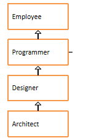
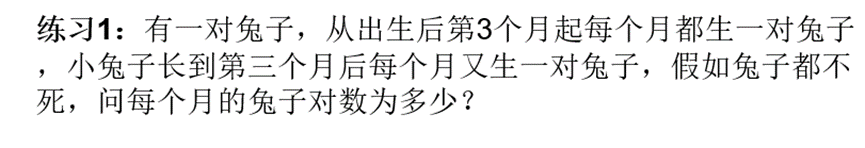

# 第一题：概念辨析

第1题 局部变量和成员变量的区别？

1. 成员变量属于类，局部变量在方法中定义或者是方法的参数
2. 成员变量可以用访问修饰符及static修饰，而局部变量不能；但都能用final修饰
3. 成员变量在堆内存中存储，局部变量在栈内存中存储
4. 从生存周期看，成员变量随对象的存在而存在；局部变量随方法调用完而消失
5. 成员变量如果没有赋初值，系统会按其类型自动赋一个默认值；而局部变量则不会自动赋值


第2题 实例变量和类变量区别？

1. 实例变量随对象的创建而存在于堆中；类变量随类的加载而存在于方法区中
2. 实例变量随对象的消失而消失；类变量随类的消失而消失


第4题 构造方法和成员方法的区别？

1. 构造方法和类名相同，没有返回类型也没有返回值；成员方法自己命名，必须有返回类型，可以没有返回值
2. 构造方法用于构造对象，并进行初始化值；成员方法用于完成特定的功能
3. 构造方法在创建对象的时候被调用，一个对象的建立只能调用一次构造方法；成员方法由对象任意调用多次


第5题 this与super的区别？

1. 访问属性：this访问本类中的属性，如果没有则从父类中查找；super直接访问父类属性
2. 调用方法：this调用本类方法，没有则从父类中查找；super直接方法父类方法
3. 调用构造器：this调用本类构造器，必须放在构造器的首行；super调用父类构造器，必须放在子类构造器的首行

# 第二题 ：代码阅读分析题


## 第1题

知识点：实例初始化

案例：判断运行结果

```java
package com.gec.test01;

class HelloA{
	public HelloA(){
		System.out.println("HelloA");
	}
	{
		System.out.println("I'm A Class");
	}
}

class HelloB extends HelloA{
	public HelloB(){
		System.out.println("HelloB");
	}
	{
		System.out.println("I'm B Class");
	}
}
public class Test01{
	public static void main(String[] args) {
		new HelloB();
	}
}

```

结果：I'm A Class

HelloA

I'm B Class

HelloB


## 第2题

知识点：实例初始化

案例：判断运行结果

```java
package com.gec.test02;

public class Test02 {
	public static void main(String[] args) {
		new Child("mike");
	}
}

class People {
	private String name;

	public People() {
		System.out.print("1");
	}

	public People(String name) {
		System.out.print("2");
		this.name = name;
	}
}

class Child extends People {
	People father;

	public Child(String name) {
		System.out.print("3");
		father = new People(name + " F");
	}

	public Child() {
		System.out.print("4");
	}
}

```

结果：132


## 第3题

知识点：实例初始化

案例：分析运行结果

```java
package com.gec.test03;

public class Test03 {
	public static void main(String[] args) {
		Father f = new Father();
		Child c = new Child();
	}
}
class Father {
	public Father(){
		System.out.println("father create");
	}
}
class Child extends Father{
	public Child(){
		System.out.println("child create");
	}
}
```

结果：father create

father create

child create


## 第4题

知识点：继承、属性同名问题

```java
package com.gec.test04;

public class Test04 extends Father{
	private String name = "test";
	
	public static void main(String[] args) {
		Test04 test = new Test04();
		System.out.println(test.getName());
	}
}
class Father {
	private String name = "father";

	public String getName() {
		return name;
	}
}
```

结果：father


## 第5题

知识点：实例初始化

案例：分析运行结果

```java
package com.gec.test06;

public class Test06 {
	public static void main(String[] args) {
		Sub s = new Sub();
	}
}
class Base{
	Base(){
		method(100);
	}
	{
		System.out.println("base");
	}
	public void method(int i){
		System.out.println("base : " + i);
	}
}
class Sub extends Base{
	Sub(){
		super.method(70);
	}
	{
		System.out.println("sub");
	}
	public void method(int j){
		System.out.println("sub : " + j);
	}
}
```

结果：base

sub:100

sub

base:70


## 第6题

```java
public class Test07 {
	public static void main(String[] args) {
		Son son = new Son();
	}
}
class Father{
	static{
		System.out.println("（1）父类的静态代码块");
	}
	{
		System.out.println("（2）父类的非静态代码块");
	}
	Father(){
		System.out.println("（3）父类的无参构造");
	}
}
class Son extends Father{
	static{
		System.out.println("（4）子类的静态代码块");
	}
	{
		System.out.println("（5）子类的非静态代码块");
	}
	Son(){
		System.out.println("（6）子类的无参构造");
	}
}
```

结果：（1）父类的静态代码块

（4）子类的静态代码块

（2）父类的非静态代码块

（3）父类的无参构造

（5）子类的非静态代码块

（6）子类的无参构造


## 第7题

```java
public class Test08 {
	public static void main(String[] args) {
		Zi zi = new Zi();
	}
}
class Fu{
	private static int i = getNum("（1）i");
	private int j = getNum("（2）j");
	static{
		print("（3）父类静态代码块");
	}
	{
		print("（4）父类非静态代码块，又称为构造代码块");
	}
	Fu(){
		print("（5）父类构造器");
	}
	public static void print(String str){
		System.out.println(str + "->" + i);
	}
	public static int getNum(String str){
		print(str);
		return ++i;
	}
}
class Zi extends Fu{
	private static int k = getNum("（6）k");
	private int h = getNum("（7）h");
	static{
		print("（8）子类静态代码块");
	}
	{
		print("（9）子类非静态代码块，又称为构造代码块");
	}
	Zi(){
		print("（10）子类构造器");
	}
	public static void print(String str){
		System.out.println(str + "->" + k);
	}
	public static int getNum(String str){
		print(str);
		return ++k;
	}
}

```

结果：（1）i->0
（3）父类静态代码块->1
（6）k->0
（8）子类静态代码块->1
（2）j->1
（4）父类非静态代码块，又称为构造代码块->2
（5）父类构造器->2
（7）h->1
（9）子类非静态代码块，又称为构造代码块->2
（10）子类构造器->2


## 第8题

考核知识点：继承、this、super、重写

案例：分析运行结果

```java
package com.gec.test14;

public class Test14 {
	public static void main(String[] args) {
		Father f = new Father();
		Son s = new Son();
		System.out.println(f.getInfo());
		System.out.println(s.getInfo());
		s.test();
		System.out.println("-----------------");
		s.setInfo("大粤嵌");
		System.out.println(f.getInfo());
		System.out.println(s.getInfo());
		s.test();
	}
}
class Father{
	private String info = "gec";
	public void setInfo(String info){
		this.info = info;
	}
	public String getInfo(){
		return info;
	}
}
class Son extends Father{
	private String info = "粤嵌";
	public void setInfo(String info){
		this.info = info;
	}
	public String getInfo(){
		return info;
	}
	public void test(){
		System.out.println(this.getInfo());
		System.out.println(super.getInfo());
	}
}
```

结果：gec

粤嵌

粤嵌

gec

"------------------------
gec

大粤嵌

大粤嵌

gec


## 第10题

考核知识点：类初始化与实例初始化

案例：分析运行结果

```java
package com.gec.test15;

class HelloA{
	public HelloA(){
		System.out.println("HelloA");
	}
	{
		System.out.println("I'm A Class");
	}
	static{
		System.out.println("static A");
	}
}

public class HelloB extends HelloA{
	public HelloB(){
		System.out.println("HelloB");
	}
	{
		System.out.println("I'm B Class");
	}
	static{
		System.out.println("static B");
	}

	public static void main(String[] args) {
		new HelloB();
	}

}

```

结果：static A

static B

I'm A Class

HelloA

I'm B Class

HelloB


# 第三题：代码编程题

## 第1题

案例：

1、在com.gec.test16包中声明员工类、程序员类、设计师类、架构师类，




* 员工类属性：编号、姓名、年龄、薪资

* 程序员类属性：编程语言，默认都是"java"

* 设计师类属性：奖金

* 架构师类属性：持有股票数量

  要求：属性私有化，无参有参构造，get/set，getInfo方法（考虑重写）


~~~java
package com.gec.test16
    
class Employee {
	private int number;
	private String name;
	private int age;
	private double salary;

	public Employee(int number, String name, int age, double salary) {
		this.number = number;
		this.name = name;
		this.age = age;
		this.salary = salary;
	}

	public int getNumber() {
		return number;
	}

	public void setNumber(int number) {
		this.number = number;
	}

	public String getName() {
		return name;
	}

	public void setName(String name) {
		this.name = name;
	}

	public int getAge() {
		return age;
	}

	public void setAge(int age) {
		this.age = age;
	}

	public double getSalary() {
		return salary;
	}

	public void setSalary(double salary) {
		this.salary = salary;
	}

}

class Programmer extends Employee {
	private String language = "java";

	public Programmer(int number, String name, int age, double salary) {
		super(number, name, age, salary);
	}

	public String getLanguage() {
		return language;
	}

	public void setLanguage(String language) {
		this.language = language;
	}

}

class Designer extends Programmer {
	private double bonus;

	public Designer(int number, String name, int age, double salary, double bonus) {
		super(number, name, age, salary);
		this.bonus = bonus;
	}

	public double getBonus() {
		return bonus;
	}

	public void setBonus(double bonus) {
		this.bonus = bonus;
	}

}

class Architect extends Designer {
	private int guPiao;

	public Architect(int number, String name, int age, double salary, double bonus, int guPiao) {
		super(number, name, age, salary, bonus);
		this.guPiao = guPiao;
	}

	public int getGuPiao() {
		return guPiao;
	}

	public void setGuPiao(int guPiao) {
		this.guPiao = guPiao;
	}

}
~~~


## 第2题（封装）：

编写一个Car类，属性车型、价格、车牌号

  要成功录入数据值，条件：

   车型字符串长度必须是20字符内

   价格必须是10万到30万之间

（注意：通过封装性实现）


~~~java
public class Demo1 {
	public static void main(String[] args) {
		Car car = new Car("dasdsa", 156868, "djsakldj");
		Car car2 = new Car("dasdsadsadasasdddsadsadsa", 156868, "djsakldj");
	}
}

class Car {
	private String carStyel;
	private int price;
	private String carNumber;

	public Car(String carStyel, int price, String carNumber) {
		if (carStyel.length() <= 20) {
			this.carStyel = carStyel;
		} else {
			System.out.println("长度不符合要求");
			return;
		}
		if (price > 100000 && price < 300000) {
			this.price = price;
		} else {
			System.out.println("价格不符合要求");
			return;
		}
		this.carNumber = carNumber;
		System.out.println("存储成功");
	}

	/**
	 * @param i
	 */
	private void exit(int i) {
		// TODO Auto-generated method stub

	}

	public String getCarStyel() {
		return carStyel;
	}

	public void setCarStyel(String carStyel) {
		this.carStyel = carStyel;
	}

	public int getPrice() {
		return price;
	}

	public void setPrice(int price) {
		this.price = price;
	}

	public String getCarNumber() {
		return carNumber;
	}

	public void setCarNumber(String carNumber) {
		this.carNumber = carNumber;
	}

}
~~~


## 第3题（递归）



~~~java
public class Demo2 {
	public static void main(String[] args) {
		// 第一和第二个月兔子对数都为1对

		System.out.println("请输入第几个月");
		int m = new Scanner(System.in).nextInt();
		if (m == 1 || m == 2) {
			System.out.println("兔子的对数为1");
		} else {
			System.out.println("兔子的对数为" + rabbit(m));
		}
	}

	
	private static int rabbit(int m) {
		int month=-1;
		if(m==3) {
			return 2;
		}else if (m==2) {
			return 1;
		}
		else {
			month=rabbit(m-1)+rabbit(m-2);
		}
		return month;
	}
}
~~~

