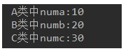

# 代码阅读分析题

## 第1题

考核知识点：属性与多态无关

```java
package com.gec.test01;

public class Test01 {
	public static void main(String[] args) {
		A a = new B();
		System.out.println(a.num);
		System.out.println(((B)a).num);
		System.out.println(((A)((B)a)).num);
		System.out.println("-------------------");
		B b = new B();
		System.out.println(b.num);
		System.out.println(((A)b).num);
		System.out.println(((B)((A)b)).num);
	}
}
class A{
	int num = 1;
}
class B extends A{
	int num = 2;
}
```

结果：1

2

1

“-----------------------

2

1

2

## 第2题

考核知识点：实例初始化方法，属性与多态无关

```java
package com.gec.test02;

public class Test02 {
	public static void main(String[] args) {
		Father f = new Son();
		System.out.println(f.x);
	}
}
class Father{
	int x = 10;
	public Father(){
		this.print();
		x = 20;
	}
	public void print(){
		System.out.println("Father.x = " + x);
	}
}
class Son extends Father{
	int x = 30;
	public Son(){
		this.print();
		x = 40;
	}
	public void print(){
		System.out.println("Son.x = " + x);
	}
}
```

结果：Son.x= **0

Son.x =30

20


## 第3题

考核知识点：多态，重写，实例初始化过程

```java
package com.gec.test03;

public class Test03 {
	public static void main(String[] args) {
		Base b1 = new Base();
		Base b2 = new Sub();
	}
}

class Base {
	Base() {
		method(100);
	}

	public void method(int i) {
		System.out.println("base : " + i);
	}
}

class Sub extends Base {
	Sub() {
		super.method(70);
	}

	public void method(int j) {
		System.out.println("sub : " + j);
	}
}
```

结果：base : 100

sub : 100

base : 70


## 第4题

考核知识点：多态、重载、重写

```java
public class Test04 {
	public static void main(String[] args) {
		A a1 = new A();
		A a2 = new B();
		B b = new B();
		C c = new C();
		D d = new D();
		System.out.println("(1)" + a1.show(b));
		System.out.println("(2)" + a2.show(d));
		System.out.println("(3)" + b.show(c));
		System.out.println("(4)" + b.show(d));
	}
}
class A{
	public String show(D obj){
		return ("A and D");
	}
	public String show(A obj){
		return "A and A";
	}
}
class B extends A{
	public String show(B obj){
		return "B and B";
	}
	public String show(A obj){
		return "B and A";
	}
}
class C extends B{
	
}
class D extends B{
	
}
```

结果：(1)A and A

(2)B and B	----A and D

(3)B and B

(4)B and B	----A and D


## **第5题

考核知识点：多态、重载、重写

```java
public class Test05 {
	public static void main(String[] args) {
		A a1 = new A();
		A a2 = new B();
		B b = new B();
		C c = new C();
		D d = new D();
		System.out.println("(1)" + a1.show(b));
		System.out.println("(2)" + a2.show(d));**
		System.out.println("(3)" + b.show(c));
		System.out.println("(4)" + b.show(d));
	}
}

class A {
	public String show(C obj) {
		return ("A and C");
	}

	public String show(A obj) {
		return "A and A";
	}
}

class B extends A {
	public String show(B obj) {
		return "B and B";
	}

	public String show(A obj) {
		return "B and A";
	}
}

class C extends B {

}

class D extends B {

}
```

结果：(1)A and A

(2)B and B	----B and A

(3)A and C

(4)B and B


## 第6题

考核知识点：属性与多态无关

```java
public class Test06 {
	public static void main(String[] args) {
		Base b = new Sub();
		System.out.println(b.x);
	}
}
class Base{
	int x = 1;
}
class Sub extends Base{
	int x = 2;
}
```

结果：1


## 第7题

考核知识点：权限修饰符

如下代码是否可以编译通过，如果能，结果是什么，如果不能，为什么？

```java
public class Father{
	private String name = "gec";
	int age = 0;
}
public class Child extends Father{
	public String grade;
	
	public static void main(String[] args){
		Father f = new Child();
		System.out.println(f.name);
	}
}
```

结果：不可以，因为父类的私有属性，子类是无权访问的


## 第8题

考核知识点：继承，super，static

如下代码是否可以编译通过，如果能，结果是什么，如果不能，为什么？

```java
public class Person{
	public Person(){
		System.out.println("this is a Person.");
	}
}
public class Teacher extends Person{
	private String name = "tom";
	public Teacher(){
		System.out.println("this is a teacher.");
		super();
	}
	public static void main(String[] args){
		Teacher tea = new Teacher();
		System.out.println(this.name);
	}
}
```

结果：不能，因为构造器中，调用父类构造器的super()必须在第一行


# 代码编程题

## 第9题

* 知识点：抽象类
* 语法点：继承，抽象类
* 按步骤编写代码，效果如图所示：



编写步骤：

1. 定义抽象类A，抽象类B继承A，普通类C继承B
2. A类中，定义成员变量numa，赋值为10，抽象showA方法。
3. B类中，定义成员变量numb，赋值为20，抽象showB方法。
4. C类中，定义成员变量numc，赋值为30，重写showA方法，打印numa，重写showB方法，打印numb，定义showC方法，打印numc。
5. 测试类Test09中，创建C对象，调用showA方法，showB方法，showC方法。

~~~java
public class Test09 {
	public static void main(String[] args) {
		C c = new C();
		c.showA();
		c.showB();
		c.showC();
	}

}

abstract class A {
	int a = 10;

	public abstract void showA();

}

abstract class B extends A {
	int b = 20;

	public abstract void showB();
}

class C extends B {
	int c = 30;

	@Override
	public void showB() {
		System.out.println("B类中numa：" +b);
	}

	@Override
	public void showA() {
		System.out.println("A类中numa：" + a);
	}

	public void showC() {
		System.out.println("C类中numa：" +c);
	}

}
~~~


## 第10题

知识点：抽象类

案例：

​	1、声明抽象父类Person，包含抽象方法public abstract void pee();

​	2、声明子类Woman，重写抽象方法，打印坐着尿

​	3、声明子类Man，重写抽象方法，打印站着上尿

​	4、声明测试类Test10，创建Person数组，存放Woman和Man对象，并遍历数组，调用pee()方法

~~~java
public class Test10 {
	public static void main(String[] args) {
		Person[] p = new Person[2];
		p[0] = new Woman();
		p[1] = new Man();
		for (Person pp : p) {
			pp.pee();
		}
	}
}

abstract class Person {
	public abstract void pee();
}

class Woman extends Person {

	@Override
	public void pee() {
		System.out.println("坐着尿");
	}
}

class Man extends Person {

	@Override
	public void pee() {
		System.out.println("站着尿");
	}
}
~~~

