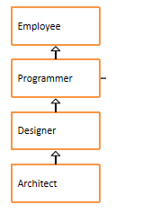

# 代码阅读题

## 第1题

```java
interface A{
	int x = 0;
}
class B{
	int x = 1;
}
class C extends B implements A{
	public void printX(){
		System.out.println(x);
	}
	public static void main(String[] args) {
		new C().printX();
	}
}
```

结果：1


## 第2题

```java
public class Test10 {
    public static void main(String[] args) {
        Out.In in = new Out().new In();
        in.print();
    }
}
class Out {
    private int age = 12;
    class In {
        private int age = 13;
        public void print() {
            int age = 14;
            System.out.println("局部变量：" + age);
            System.out.println("内部类变量：" + this.age);
            System.out.println("外部类变量：" + Out.this.age);
        }
    }
}
```

结果：14

13

12


## 第3题

```java
package com.gec.test11;

public class Test11 {
	public static void main(String[] args) {
        Out out = new Out();
        out.Print(3);
    }
}
class Out {
    private int age = 12;
    public void Print(final int x) {
        class In {
            public void inPrint() {
                System.out.println(x);
                System.out.println(age);
            }
        }
        new In().inPrint();
    }
}
```

结果：3

12


# 多态应用

## 第1题

案例：

​	1、在com.gec.test13包中声明员工类、程序员类、设计师类、架构师类，



* 员工类属性：编号、姓名、年龄、薪资

* 程序员类属性：编程语言，默认都是"java"

* 设计师类属性：奖金

* 架构师类属性：持有股票数量

  要求：属性私有化，无参有参构造，get/set，getInfo方法（考虑重写）

  

  2、在com.gec.test13包中声明Test13测试类

  （1）在main中有一些常量和一个二维数组

  ```java
  final int EMPLOYEE = 10;//表示普通员工
  final int PROGRAMMER = 11;//表示程序员
  final int DESIGNER = 12;//表示设计师
  final int ARCHITECT = 13;//表示架构师
      
  String[][] EMPLOYEES = {
          {"10", "1", "段誉", "22", "3000"},
          {"13", "2", "令狐冲", "32", "18000", "15000", "2000"},
          {"11", "3", "任我行", "23", "7000"},
          {"11", "4", "张三丰", "24", "7300"},
          {"12", "5", "周芷若", "28", "10000", "5000"},
          {"11", "6", "赵敏", "22", "6800"},
          {"12", "7", "张无忌", "29", "10800","5200"},
          {"13", "8", "韦小宝", "30", "19800", "15000", "2500"},
          {"12", "9", "杨过", "26", "9800", "5500"},
          {"11", "10", "小龙女", "21", "6600"},
          {"11", "11", "郭靖", "25", "7100"},
          {"12", "12", "黄蓉", "27", "9600", "4800"}
      };
  ```

  （2）创建一个员工数组

  （3）根据以上数据，初始化员工数组

  提示：把字符串转为int和double类型的值，可以使用如下方式：

  ```java
  String idStr = "1";
  int id = Integer.parseInt(idStr);
  
  String salaryStr = "7300";
  double salary = Double.parseDouble(salaryStr);
  ```

  （4）遍历数组，使用如下格式

  ```
  编号	姓名	年龄	薪资	语言	奖金	股票
  .....
  ```


# 接口编程代码题

## 第1题

* 语法点：接口
* 按步骤编写代码，效果如图所示：


* 编写步骤：

1. 定义接口A，普通类B实现接口A
2. A接口中，定义抽象方法showA。 
3. A接口中，定义默认方法showB。
4. B类中，重写showA方法
5. 测试类中，创建B类对象，调用showA方法，showB方法。

## 第2题

* 模拟接待员接待用户，根据用户id，给用户分组。

* 定义用户类：
  * 属性：用户类型，用户id
  * 提供基本的构造方法和get方法，set方法
* 定义接口Filter：
  * 提供抽象方法filterUser（User u）
* 定义实现类V1Filter，实现抽象方法，将用户设置为v1
* 定义实现类V2Filter，实现抽象方法，将用户设置为v2
* 定义实现类AFilter，实现抽象方法，将用户设置为A
* 定义接待员类Receptionist：
  * 属性：接口Filter
  * 提供基本的构造方法和get方法，set方法
  * 成员方法：接待用户方法，设置用户类型。
* 测试类：
  * 初始化15个User对象，id为1-15。
  * 创建三个接待员对象。
    * 第一个接待员，设置接待规则，将1-5号用户类型设置为v1。
    * 第二个接待员，设置接待规则，将6-10号用户类型设置为v2。
    * 第三个接待员，设置接待规则，将11-15号用户类型设置为A。
  * 遍历数组，分别用三个接待员对象，给用户分区。

* 代码实现，效果如图所示：

# 

# 内部类编程题

## 第1题

编写一个匿名内部类，它继承Object，并在匿名内部类中，声明一个方法public void test()打印粤嵌。

请编写代码调用这个方法。

## 第2题

* 模拟工人挑苹果。

* 定义苹果类：

  * 属性：大小，颜色。
  * 提供基本的构造方法和get方法，set方法

* 定义接口CompareAble：

  * 定义默认方法compare，挑选较大苹果。

* 定义接口实现类CompareBig。

* 定义接口实现类CompareColor。挑选红色苹果。

* 定义工人类：

  * 成员方法：挑选苹果public void pickApple(CompareAble c,Apple a1,Apple a2)。

* 测试类：

  * 创建Worker对象。
  * 创建两个Apple对象，一个Apple（5，"青色"）,一个Apple（3，"红色"）

* 代码实现，效果如图所示：

  

案例：改用匿名内部类实现实现接口，来代替CompareBig和CompareColor

## 第3题

案例：将接口编程的第2题，改用匿名内部类实现接口，来代替V1Filter、V2Filter、AFilter

## 第4题

案例：

​	1、声明一个接口：Selector，包含抽象方法：

​	（1）boolean hasNext()

​	（2）Object next()

​	2、声明一个接口：Touchable，包含抽象方法：

​	（1）Selector select()

​	3、声明一个MyArrayList类，当做容器类使用，模拟动态数组数据结构的容器

​	（1）包含私有属性：

​	①Object[] all；用于保存对象，初始化长度为2

​	②int total；记录实际存储的对象个数

​	（2）包含方法：

​	①public void add(Object element)：用于添加一个元素到当前容器中，如果数组all已满，就扩容为原来的2倍

​	②public void remove(int index)：如果index<0或index>=total就打印“没有这个元素”并返回，否则删除index位置的元素

​	③public void set(int index, Object value)：如果index<0或index>=total就打印“没有这个元素”并返回，否则就替换index位置的元素为value

​	④public Object get(int index)：如果index<0或index>=total就打印“没有这个元素”并返回null，否则返回index位置的元素

​	⑤让类MyArrayList实现Touchable接口，并重写Selector select()方法，返回内部类MySelector的对象

​	⑥在类MyArrayList中声明private的内部类MySelector，实现Selector接口

​	A：在内部类MySelector声明一个属性：int cursor（游标）

​	B：MySelector实现Selector接口，并重写两个抽象方法，其中

* ​		boolean hasNext()实现为：return cursor != total
* ​		Object next()实现为：return all[cursor++]

4、在测试类Test06_01中，

（1）创建MyArrayList的对象list

（2）调用list的add方法，添加3个对象

（3）调用list的remove方法，删除[1]的对象

（4）调用list的set方法，替换[1]的对象

（5）调用list的get方法，获取[1]的对象

（6）调用list的select方法，获取Selector的对象，并调用hasNext()和next()遍历容器中所有的对象


