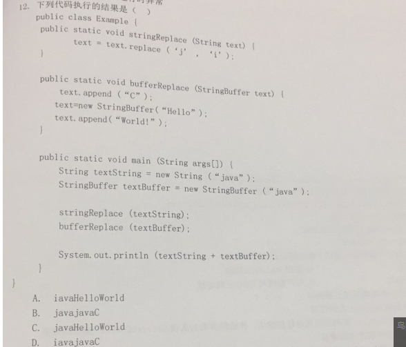
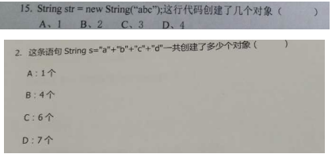
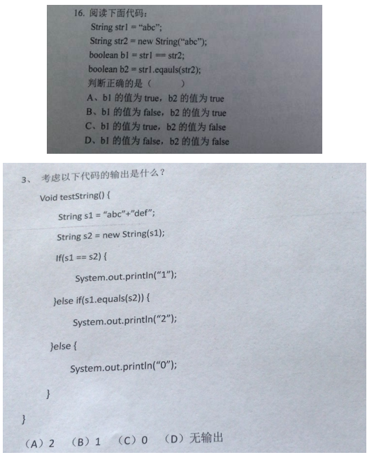
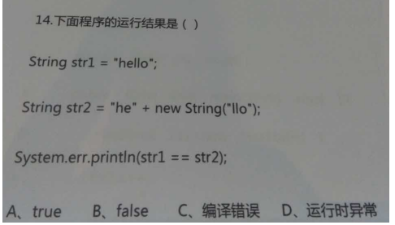
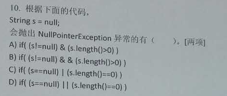
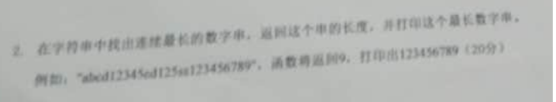

## 1 字符串特点相关面试题

### 1、面试题：字符串的length和数组的length有什么不同？

字符串的length()，数组的length属性

答：字符串的length()是一个方法，数组的length是数组的属性。

### 2、字符串对象不可变

答：C------B

~~~java
public static void main(String[] args) {
		String textString = new String("java");
		StringBuffer textBuffer = new StringBuffer("java");

		stringReplace(textString);
		bufferReplace(textBuffer);
		System.out.println(textString + textBuffer);
	}

	/**
	 * @param textBuffer
	 */
	private static void bufferReplace(StringBuffer textBuffer) {
		textBuffer.append("C");
		textBuffer = new StringBuffer("Hello");
		textBuffer.append("World!");
	}

	/**
	 * @param textString
	 */
	private static void stringReplace(String textString) {
		textString = textString.replace('j', 'i');

	}
~~~

### 3、字符串对象个数

答：B

A

### 4、字符串对象比较

答：B

A

B

### 5、空字符串

答：A，C

## 2 字符串算法相关面试题

### 1、编程题

在字符串中找出连续最长数字串，返回这个串的长度，并打印这个最长数字串。

例如：abcd12345cd125se123456789，返回9，打印出123456789

答：

~~~java
public static void main(String[] args) {
		String str = "56154141dsadsa";
		int max = 0;
		int index = -1;
		int maxbuf = 0;
		int indexbuf = -1;
		for (int i = 0; i < str.length(); i++) {
			if (str.substring(i, i + 1).equals("0") || str.substring(i, i + 1).equals("1")
					|| str.substring(i, i + 1).equals("2") || str.substring(i, i + 1).equals("7")
					|| str.substring(i, i + 1).equals("3") || str.substring(i, i + 1).equals("8")
					|| str.substring(i, i + 1).equals("4") || str.substring(i, i + 1).equals("9")
					|| str.substring(i, i + 1).equals("5") || str.substring(i, i + 1).equals("6")) {

				if (maxbuf == 0) {
					indexbuf = i;
				}
				maxbuf++;

			} else {
				if (maxbuf > max) {
					max = maxbuf;
				}
				if (indexbuf > index) {
					index = indexbuf;
				}
				maxbuf = 0;
				indexbuf = -1;
			}
		}

		if (max > 0) {
			System.out.println("最长数字串长度为：" + max);
			System.out.println("最长数字串为：" + str.substring(index, index + max));
		}
	}
~~~

### 2、编程题

不能使用trim()，实现去除字符串两端的空格。

答：

~~~java
static int left;
	static int right;

	public static void main(String[] args) {
		String str = "            ";

		// 从头遍历，遇到字符就停止
		for (int i = 0; i < str.length(); i++) {
			if (!str.substring(i, i + 1).equals(" ")) {
				left = i;
				break;
			}
		}
		// 从尾遍历，遇到字符就停止
		for (int i = str.length() - 1; i >= 0; i--) {
			if (!str.substring(i, i + 1).equals(" ")) {
				right = i;
				break;
			}
		}

		if (left < right) {
			System.out.println(str.subSequence(left, right + 1));
		} else {
			System.out.println("这是一个空串");
		}
	}
~~~

### 3、编程题

将字符串中指定部分进行反转。比如将“abcdefgho”反转为”abfedcgho”

答：

~~~java
public static void main(String[] args) {
		String str = "abcdefgho";

		reverse(str, 2, 6);// 左闭右开
	}

	public static void reverse(String str, int i, int j) {
		if (i > j) {
			System.out.println("参数不合法");
		} else if (i == j) {
			System.out.println(str);
		} else {
			char[] c = str.toCharArray();
			for (int left = i, right = j - 1; left < right; left++, right--) {
				char a = c[right];
				c[right] = c[left];
				c[left] = a;
			}
			System.out.println(c);
		}
	}
~~~

### 4、编程题

获取一个字符串在另一个字符串中出现的次数。

​     比如：获取"ab"在 “abababkkcadkabkebfkabkskab”中出现的次数

答：

~~~java
public static void main(String[] args) {
		String str = "abababkkcadkabkebfkabkskab";
		String seg = "ab";

		int count = 0;
		for (int i = 0; i + seg.length() <= str.length(); i++) {
			if (seg.equals(str.substring(i, i + seg.length()))) {
				count++;
				i++;
			}
		}

		System.out.println(seg + "在" + str + "出现的次数为：" + count);
	}
~~~

### 5、编程题

获取两个字符串中最大相同子串。

比如：str1 = "abcwerthelloyuiodef“;str2 = "cvhellobnm"

   提示：将短的那个串进行长度依次递减的子串与较长的串比较。

答：

~~~java
public static void main(String[] args) {
		String str1 = "abcwerthelloyuiodef";
		String str2 = "cvhellobnm";
		ArrayList<Integer> leftlist = new ArrayList<Integer>();
		ArrayList<Integer> lengthlist = new ArrayList<Integer>();

		// 字符串2子串的长度，从1到length，将相匹配的子串的起始位置和长度存在集合中
		for (int i = 1; i < str2.length(); i++) {
			for (int j = 0; j + i - 1 < str2.length(); j++) {
				int k = kdf(str1, str2.substring(j, j + i));
				if (k > 0) {
					leftlist.add(k);
					lengthlist.add(i);
				}
			}

		}

		if (lengthlist.size() == 0) {
			System.out.println("没有相同的子串");
		}

		// 将集合中长度最大的组合取出
		System.out.println("最大相同子串：" + str1.subSequence(leftlist.get(leftlist.size() - 1),
				leftlist.get(leftlist.size() - 1) + lengthlist.get(lengthlist.size() - 1)));

		// 将集合中与最长子串长度相等的其他子串也取出
		for (int i = lengthlist.size() - 2; i > 0; i++) {
			if (lengthlist.get(i) == lengthlist.get(lengthlist.size() - 1)) {
				System.out.println("最大相同子串：" + str1.subSequence(leftlist.get(i), leftlist.get(i) + lengthlist.get(i)));
			} else {
				break;
			}
		}
	}

	// 匹配算法
	private static int kdf(String str1, String str2) {
		char[] c1 = str1.toCharArray();
		char[] c2 = str2.toCharArray();
		for (int i = 0; i < str1.length(); i++) {
			int k = i;
			for (int j = 0; j < str2.length(); j++) {
				if (c1[i] == c2[j]) {
					i++;
					if (j == str2.length() - 1) {
						return k;
					}
				} else {
					i = k;
					break;
				}
			}
		}
		return -1;
	}
~~~

