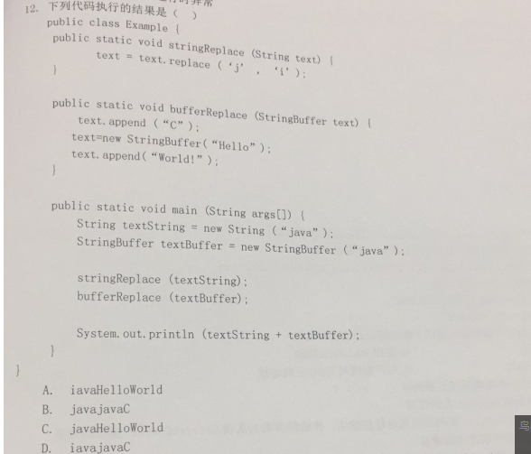
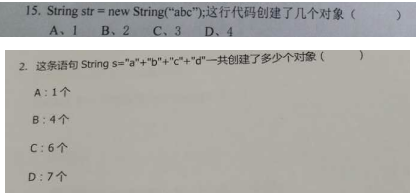
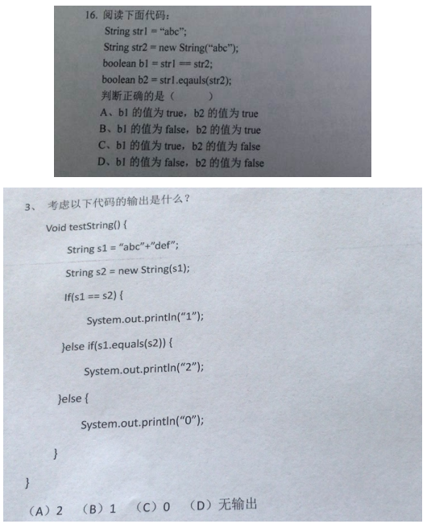
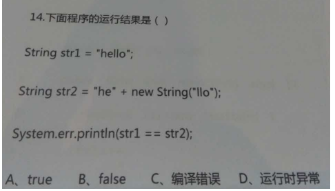
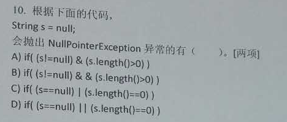
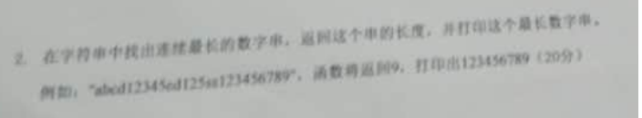

## 1 字符串特点相关面试题

### 1、面试题：字符串的length和数组的length有什么不同？

字符串的length()，数组的length属性

### 2、字符串对象不可变

### 3、字符串对象个数

### 4、字符串对象比较

### 5、空字符串

## 2 字符串算法相关面试题

### 1、编程题

在字符串中找出连续最长数字串，返回这个串的长度，并打印这个最长数字串。

例如：abcd12345cd125se123456789，返回9，打印出123456789

~~~ java
public class TestExer1 {
	public static void main(String[] args) {
		String str = "abcd12345cd125se123456789";
		
		//去掉最前和最后的字母
		str =	str.replaceAll("^[a-zA-Z]+", "");
		
		//[a-zA-Z]：表示字母范围
		//+：一次或多次
		String[] strings = str.split("[a-zA-Z]+");
		
		String max = "";
		for (String string : strings) {
			if(string.length() > max.length()) {
				max = string;
			}
		}
		System.out.println("最长的数字串：" + max + "，它的长度为：" + max.length());
	}
}
~~~

### 2、编程题

不能使用trim()，实现去除字符串两端的空格。

~~~ java
String message="   hello    world    ";
        int start =0;
        for(int i=0;i<message.length();i++){
            char c=message.charAt(i);
            if(c == ' '){
                start++;
            }else{
                break;
            }
        }

        int end = message.length()-1;
        for(int i=end;i>=0;i--){
            char c=message.charAt(i);
            if(c == ' '){
                end--;
            }else{
                break;
            }
        }

        String result = message.substring(start,end+1);

        System.out.println(result);
~~~

### 3、编程题

将字符串中指定部分进行反转。比如将“abcdefgho”反转为”abfedcgho”

~~~ java
	//从第start个字符，到第end个字符
	public static String reverse(String str,int start,int end){
		char[] array = str.toCharArray();
		for(int i = start,j=end;i< j;i++,j--){
			char temp =array[i];
			array[i]=array[j];
			array[j]=temp;
		}
		String s = new String(array);
		return s;
	}
~~~

### 4、编程题

获取一个字符串在另一个字符串中出现的次数。

​     比如：获取"ab"在 “abababkkcadkabkebfkabkskab”中出现的次数

~~~ java
	public static void main(String[] args) {
		String str1="ab";
		String str2="abababkkcadkabkebfkabkskab";
		System.out.println(count(str1,str2));
	}
	
	public static int count(String str1,String str2){
		int count =0;
		do{
			int index = str2.indexOf(str1);
			if(index !=-1){
				count++;
				str2 = str2.substring(index + str1.length());
			}else{
				break;
			}
			
		}while(true);
		return count;
	}
~~~

### 5、编程题

获取两个字符串中最大相同子串。

比如：str1 = "abcwerthelloyuiodef“;str2 = "cvhellobnm"

   提示：将短的那个串进行长度依次递减的子串与较长的串比较。

~~~ java
public static void main(String[] args) {
		String str=findMaxSubString("abcwerthelloyuiodef","cvhellobnm");
		System.out.println(str);
	}
	
	//提示：将短的那个串进行长度依次递减的子串与较长的串比较。
	public static String findMaxSubString(String str1,String str2){
		String result="";
		
		String mixStr = str1.length()<str2.length()?str1:str2;
		String maxStr = str1.length()>str2.length()?str1:str2;
		
		//外循环控制从左到右的下标，内循环控制从右到左的下标
		for(int i=0;i<mixStr.length();i++){
			for(int j=mixStr.length();j>=i;j--){
				String str=mixStr.substring(i, j);
				if(maxStr.contains(str)){
					//找出最大相同子串
					if(result.length()<str.length()){
						result = str;
					}
				}
			}
		}
		return result;
	}
~~~

