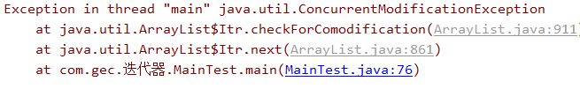

# 作业

# 1、概念题

## 第1题：

- 请回答Iterator迭代器hasNext()和next()方法的作用

答：hasNext，判断当前指针所在位置是否有元素，无则返回false，有则返回true

next，返回当前指针所指向的元素之后指针指向下一个元素的位置


## 第2题：

- 集合与数组区别？

答：集合存储的元素只能是对象，数组既可以存对象，也可以存基本数据类型

数组是定长的，而集合的长度是可变的


# 2、解释题 

## 第1题：

解释以下程序产生异常原因：

```
Collection<Integer> coll2 = new ArrayList<>();
coll2.add(1);
coll2.add(2);
coll2.add(3);
coll2.add(4);


Iterator<Integer> iter2 = coll2.iterator();

while (iter2.hasNext()){
    Integer v=iter2.next();
    if(v%2==0){
        coll2.remove(v);
    }
}
```



答：从源码来看，ArrayList有一个属性modcount，用来记录集合添加和删除的累计的次数。而获取迭代器的时候，会将这个modcount赋予迭代器中的一个属性exceptmodcount，每当调用next方法时，都会判断modcount与exceptmodcount是否相等，不相等则会抛出异常。这里因为在迭代中使用了集合的remove方法使得modcount的值与exceptmodcount的值不相等，所以抛出了异常


# 3、编程题

## 第1题：

定义一个Collection接口类型的变量，引用一个List集合的实现类，实现添加单个元素，添加另一个集合，删除元素，判断集合中是否包含一个元素，判断是否为空，清除集合，返回集合里元素的个数等常用操作。

答：

~~~java
public static void main(String[] args) {
        Collection<Integer>list=new ArrayList<>();

        //添加单个元素
        list.add(10);

        //添加另一个集合
        Collection<Integer>list2=new ArrayList<>();
        list2.add(5);
        list2.add(8);
        list2.add(16);
        list.addAll(list2);

        //删除元素
        list.remove(8);

        //判断集合中是否包含一个元素
        list.contains(10);

        //判断集合是否为空
        list.isEmpty();

        //清除集合
        list.clear();

        //返回集合里元素的个数
        int size = list.size();

    }
~~~


## 第2题：

自定义学生类:包含姓名,年龄,成绩属性.私有成员变量,生成无参,有参构造方法,生成get/set方法.创建5个学生放到HashSet中(姓名和年龄相同的认为是同一学生).使用迭代器获取每个学生信息.统计总分,平均分,最高分,最低分并输出

- 步骤说明

1. 创建HashSet,用于存放学生
2. 使用add方法添加5个学生
3. 使用迭代器获取一个学生.
4. 定义总分变量
5. 定义最高分变量,初始化值为迭代出来的学生的成绩
6. 定义最低分变量,初始化值为迭代出来的学生的成绩
7. 使用增强for循环获取遍历HashSet,获取到每个学生
8. 在增强for中将学生的分数添加到总分
9. 在增强for中判断最高分是否小于这个学生的分数,如果最高分小于这个学生的分数,将这个学生的分数设置为最高分
10. 在增强for中判断最低分是否大于这个学生的分数,如果最低分大于这个学生的分数,将这个学生的分数设置为最低分
11. 计算平均分(平均分 = 总分 / 人数)
12. 按照格式打印

答：
~~~java
public class Test2 {
    public static void main(String[] args) {
        Student stu1 = new Student("张三", 18, 75);
        Student stu2 = new Student("李四", 25, 86);
        Student stu3 = new Student("王五", 21, 94);
        Student stu4 = new Student("马六", 19, 45);
        Student stu5 = new Student("张三", 18, 61);

        HashSet<Student> set = new HashSet<>();
        set.add(stu1);
        set.add(stu2);
        set.add(stu3);
        set.add(stu4);
        set.add(stu5);

        int total = 0;//总分
        int max;//最高分
        int min;//最低分
        Iterator<Student> iterator = set.iterator();
        Student student1 = iterator.next();
        max = min = student1.getScore();
        total += student1.getScore();


        for (Student student : set) {
            total += student.getScore();
            if (student.getScore() > max) max = student.getScore();
            if (student.getScore() < min) min = student.getScore();
            System.out.println(student);
        }
        System.out.println("总分：" + total);
        System.out.println("平均分：" + total / set.size());
        System.out.println("最高分：" + max);
        System.out.println("最低分：" + min);
    }
}

class Student {
    private String name;
    private int age;
    private int score;

    public Student(String name, int age, int score) {
        this.name = name;
        this.age = age;
        this.score = score;
    }

    public String getName() {
        return name;
    }

    public void setName(String name) {
        this.name = name;
    }

    public int getAge() {
        return age;
    }

    public void setAge(int age) {
        this.age = age;
    }

    public int getScore() {
        return score;
    }

    public void setScore(int score) {
        this.score = score;
    }

    @Override
    public boolean equals(Object o) {
        if (this == o) return true;
        if (o == null || getClass() != o.getClass()) return false;
        Student student = (Student) o;
        return age == student.age &&
                name.equals(student.name);
    }

    @Override
    public int hashCode() {
        return Objects.hash(name, age);
    }

    @Override
    public String toString() {
        return "Student{" +
                "name='" + name + '\'' +
                ", age=" + age +
                ", score=" + score +
                '}';
    }
}
~~~


## 第3题：

 一个学科中有若干班级，每一个班级又有若干学生。整个学科一个大集合，若干个班级分为每一个小集合(集合嵌套之HashSet嵌套HashSet)。要求如下：

1. 学生类有两个属性，姓名和年龄，并定义有参构造、无参构造和getter/setter方法.姓名和年龄相同的视为同一 学生
2. 向班级集合中添加若干个学生（至少两个学生）。
3. 向学科集合中添加所有班级(至少创建两个班级)。
4. 使用两种方法遍历学科集合，并打印出所有学生。

答：

~~~java
public class Test3 {
    public static void main(String[] args) {
        Student2 stu1 = new Student2("张三", 21);
        Student2 stu2 = new Student2("李四", 21);
        Student2 stu3 = new Student2("王五", 22);
        Student2 stu4 = new Student2("张三", 20);

        HashSet<Student2> classset1 = new HashSet<>();
        classset1.add(stu1);
        classset1.add(stu2);

        HashSet<Student2> classset2 = new HashSet<>();
        classset2.add(stu3);
        classset2.add(stu4);

        HashSet<HashSet<Student2>> objectset = new HashSet<>();
        objectset.add(classset1);
        objectset.add(classset2);

        for (HashSet<Student2> obj : objectset) {
            for (Student2 cl : obj) {
                System.out.println(cl);
            }
        }
        System.out.println("----------------");

        Iterator<HashSet<Student2>> iterator = objectset.iterator();
        while (iterator.hasNext()) {
            Iterator<Student2> iterator1 = iterator.next().iterator();
            while (iterator1.hasNext()) {
                System.out.println(iterator1.next());
            }
        }

    }
}

class Student2 {
    private String name;
    private int age;

    public Student2(String name, int age) {
        this.name = name;
        this.age = age;
    }

    public String getName() {
        return name;
    }

    public void setName(String name) {
        this.name = name;
    }

    public int getAge() {
        return age;
    }

    public void setAge(int age) {
        this.age = age;
    }

    @Override
    public boolean equals(Object o) {
        if (this == o) return true;
        if (o == null || getClass() != o.getClass()) return false;
        Student2 student2 = (Student2) o;
        return age == student2.age &&
                name.equals(student2.name);
    }

    @Override
    public int hashCode() {
        return Objects.hash(name, age);
    }

    @Override
    public String toString() {
        return "Student2{" +
                "name='" + name + '\'' +
                ", age=" + age +
                '}';
    }
}
~~~


## 第4题：

编写一个程序，定义一个学生类，有学生名、科目、成绩属性，获取10个分数范围从50到100的随机分数的学生对象数据，要求分数不能重复。

答：

~~~java
public class Test4 {
    public static void main(String[] args) {
        Random r = new Random();

        ArrayList<Student3> list = new ArrayList<>();

        for (int i = 0; i < 10; i++) {
            int score = r.nextInt(50) + 51;
            list.add(new Student3("张三", "语文", score));
        }

        list.forEach((li) -> System.out.println(li));
    }

}

class Student3 {
    private String name;
    private String object;
    private int score;

    public Student3(String name, String object, int score) {
        this.name = name;
        this.object = object;
        this.score = score;
    }

    public String getName() {
        return name;
    }

    public void setName(String name) {
        this.name = name;
    }

    public String getObject() {
        return object;
    }

    public void setObject(String object) {
        this.object = object;
    }

    public int getScore() {
        return score;
    }

    public void setScore(int score) {
        this.score = score;
    }

    @Override
    public String toString() {
        return "Student3{" +
                "name='" + name + '\'' +
                ", object='" + object + '\'' +
                ", score=" + score +
                '}';
    }
}
~~~


## 第5题：

编写一个程序，定义一个学生类，有学生名、科目、成绩属性，获取10个分数范围从50到100的随机分数的学生对象数据，按分数排序输出学生信息

答：

~~~java
public class Test5 {
    public static void main(String[] args) {
        Random r = new Random();

        ArrayList<Student3> list = new ArrayList<>();

        for (int i = 0; i < 10; i++) {
            int score = r.nextInt(50) + 51;
            list.add(new Student3("张三", "语文", score));
        }

        list.sort(new Comparator<Student3>() {
            @Override
            public int compare(Student3 o1, Student3 o2) {
                if (o1.getScore() > o2.getScore()) {
                    return -1;
                } else if (o1.getScore() < o2.getScore()) {
                    return 1;
                }
                return 0;
            }
        });

        list.forEach(li -> System.out.println(li));
    }

}

class Student4 {
    private String name;
    private String object;
    private int score;

    public Student4(String name, String object, int score) {
        this.name = name;
        this.object = object;
        this.score = score;
    }

    public String getName() {
        return name;
    }

    public void setName(String name) {
        this.name = name;
    }

    public String getObject() {
        return object;
    }

    public void setObject(String object) {
        this.object = object;
    }

    public int getScore() {
        return score;
    }

    public void setScore(int score) {
        this.score = score;
    }

    @Override
    public String toString() {
        return "Student3{" +
                "name='" + name + '\'' +
                ", object='" + object + '\'' +
                ", score=" + score +
                '}';
    }
}

~~~

