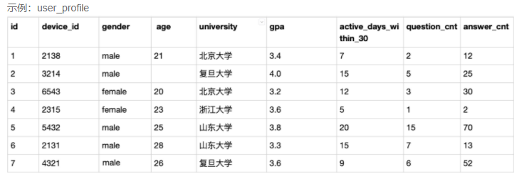
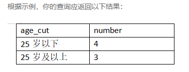
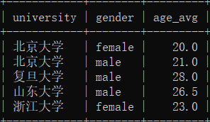
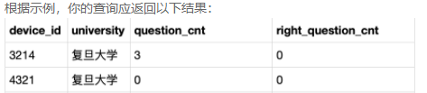
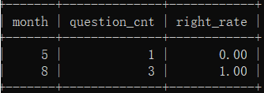
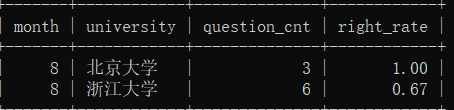
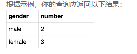
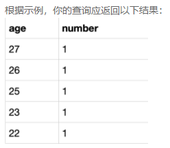

## 第1题： 年龄统计

```mysql
drop table if exists `user_profile`;

CREATE TABLE `user_profile` (
`id` int ,
`device_id` int ,
`gender` varchar(14) ,
`age` int ,
`university` varchar(32) ,
`gpa` float,
`active_days_within_30` int ,
`question_cnt` int ,
`answer_cnt` int 
);

INSERT INTO user_profile VALUES(1,2138,'male',21,'北京大学',3.4,7,2,12);
INSERT INTO user_profile VALUES(2,3214,'male',null,'复旦大学',4.0,15,5,25);
INSERT INTO user_profile VALUES(3,6543,'female',20,'北京大学',3.2,12,3,30);
INSERT INTO user_profile VALUES(4,2315,'female',23,'浙江大学',3.6,5,1,2);
INSERT INTO user_profile VALUES(5,5432,'male',25,'山东大学',3.8,20,15,70);
INSERT INTO user_profile VALUES(6,2131,'male',28,'山东大学',3.3,15,7,13);
INSERT INTO user_profile VALUES(7,4321,'male',28,'复旦大学',3.6,9,6,52);
```



**要求1：**现在运营想要将用户划分为25岁以下和25岁及以上两个年龄段，分别查看这两个年龄段用户数量

**本题注意：age为null 也记为 25岁以下**



提示：

```mysql
（1）使用CASE函数将用户分为 25岁以下和25岁及以上两种结果，并把分类情况取别名为age_cut
（2）根据age_cut分组统计记录数即可
```

**要求2：**查询每个大学用户的平均年龄，并按照大学名排序，平均年龄显示为age_avg，保留小数点后1位。



答：

~~~sql
select case when age>=25 then'25岁以上' else '25岁以下' end as age_cut,count(*)  number from user_profile group by age_cut;


select university,gender,ROUND(avg(active_days_within_30+question_cnt+answer_cnt),1) from user_profile GROUP BY university,gender ORDER BY university;
~~~


## 第2题： 用户答题数量统计

```mysql
drop table if  exists `question_practice_detail`;

CREATE TABLE `question_practice_detail` (
`id` int ,
`device_id` int ,
`question_id`int ,
`result` varchar(32),
`date` date 	
);

INSERT INTO question_practice_detail VALUES(1,2138,111,'wrong','2021-05-03');
INSERT INTO question_practice_detail VALUES(2,3214,112,'wrong','2021-05-09');
INSERT INTO question_practice_detail VALUES(3,3214,113,'wrong','2021-06-15');
INSERT INTO question_practice_detail VALUES(4,6543,111,'right','2021-08-13');
INSERT INTO question_practice_detail VALUES(5,2315,115,'right','2021-08-13');
INSERT INTO question_practice_detail VALUES(6,2315,116,'right','2021-08-14');
INSERT INTO question_practice_detail VALUES(7,2315,117,'wrong','2021-08-15');
INSERT INTO question_practice_detail VALUES(8,3214,112,'wrong','2021-05-09');
INSERT INTO question_practice_detail VALUES(9,3214,113,'wrong','2021-08-15');
INSERT INTO question_practice_detail VALUES(10,6543,111,'right','2021-08-13');
INSERT INTO question_practice_detail VALUES(11,2315,115,'right','2021-08-13');
INSERT INTO question_practice_detail VALUES(12,2315,116,'right','2021-08-14');
INSERT INTO question_practice_detail VALUES(13,2315,117,'wrong','2021-08-15');
INSERT INTO question_practice_detail VALUES(14,3214,112,'wrong','2021-08-16');
INSERT INTO question_practice_detail VALUES(15,3214,113,'wrong','2021-08-18');
INSERT INTO question_practice_detail VALUES(16,6543,111,'right','2021-08-13');
```

**要求1：**现在运营想要计算出**2021年8月每天用户练习题目的数量**，请取出相应数据。

**要求2：**现在运营想要统计2021年每个月用户答题的数量

答：

~~~sql
select date,count(*) number from question_practice_detail where date BETWEEN '2021-08-01' and '2021-08-31' GROUP BY date;


select month(date) "月份",count(*) number from question_practice_detail GROUP BY month(date);
~~~


## 第3题：各大学练题情况

```mysql
drop table if exists `user_profile`;
drop table if  exists `question_practice_detail`;

CREATE TABLE `user_profile` (
`id` int ,
`device_id` int,
`gender` varchar(14) ,
`age` int ,
`university` varchar(32) ,
`gpa` float,
`active_days_within_30` int ,
`question_cnt` int ,
`answer_cnt` int 
);
CREATE TABLE `question_practice_detail` (
`id` int ,
`device_id` int ,
`question_id`int ,
`result` varchar(32) ,
`date` date 
);

INSERT INTO user_profile VALUES(1,2138,'male',21,'北京大学',3.4,7,2,12);
INSERT INTO user_profile VALUES(2,3214,'male',null,'复旦大学',4.0,15,5,25);
INSERT INTO user_profile VALUES(3,6543,'female',20,'北京大学',3.2,12,3,30);
INSERT INTO user_profile VALUES(4,2315,'female',23,'浙江大学',3.6,5,1,2);
INSERT INTO user_profile VALUES(5,5432,'male',25,'山东大学',3.8,20,15,70);
INSERT INTO user_profile VALUES(6,2131,'male',28,'山东大学',3.3,15,7,13);
INSERT INTO user_profile VALUES(7,4321,'male',28,'复旦大学',3.6,9,6,52);

INSERT INTO question_practice_detail VALUES(1,2138,111,'wrong','2021-05-03');
INSERT INTO question_practice_detail VALUES(2,3214,112,'wrong','2021-05-09');
INSERT INTO question_practice_detail VALUES(3,3214,113,'wrong','2021-06-15');
INSERT INTO question_practice_detail VALUES(4,6543,111,'right','2021-08-13');
INSERT INTO question_practice_detail VALUES(5,2315,115,'right','2021-08-13');
INSERT INTO question_practice_detail VALUES(6,2315,116,'right','2021-08-14');
INSERT INTO question_practice_detail VALUES(7,2315,117,'wrong','2021-08-15');
INSERT INTO question_practice_detail VALUES(8,3214,112,'wrong','2021-05-09');
INSERT INTO question_practice_detail VALUES(9,3214,113,'wrong','2021-08-15');
INSERT INTO question_practice_detail VALUES(10,6543,111,'right','2021-08-13');
INSERT INTO question_practice_detail VALUES(11,2315,115,'right','2021-08-13');
INSERT INTO question_practice_detail VALUES(12,2315,116,'right','2021-08-14');
INSERT INTO question_practice_detail VALUES(13,2315,117,'wrong','2021-08-15');
INSERT INTO question_practice_detail VALUES(14,3214,112,'wrong','2021-08-16');
INSERT INTO question_practice_detail VALUES(15,3214,113,'wrong','2021-08-18');
INSERT INTO question_practice_detail VALUES(16,6543,111,'right','2021-08-13');

```

**要求1：** 现在运营想要了解复旦大学的每个用户在8月份练习的总题目数和回答正确的题目数情况，请取出相应明细数据，对于在8月份没有练习过的用户，答题数结果返回0.



**要求2：**统计北京大学2021年每个月的答题数量和正确率



**要求3：**统计每个大学2021年每个月的答题数量和正确率，并只显示答题正确率高于0.5的记录



答：

~~~sql
select device_id,sum(IF(result is not null,1,0)) question_cnt,sum(IF(result='right',1,0)) right_question_cnt from(select u.device_id,result from (select device_id from user_profile where university='复旦大学') u LEFT JOIN (select device_id,result from question_practice_detail where date BETWEEN '2021-08-01' and '2021-08-31') q on u.device_id=q.device_id) a GROUP BY device_id;


select MONTH(date) month,count(*) question_cnt,ROUND(sum(IF(result='right',1,0))/count(*),2) right_rate from (select result,date from (select device_id from user_profile where university='北京大学') u,(select device_id,result,date from question_practice_detail where date BETWEEN '2021-01-01' and '2021-12-31') q where u.device_id=q.device_id) a  GROUP BY MONTH(date);


select * from (select MONTH(date) month,p.university unibersity,count(*) question_cnt,ROUND(sum(IF(result='right',1,0))/count(*),2) right_rate from (select university,result,date from (select device_id,university from user_profile ) u,(select device_id,result,date from question_practice_detail where date BETWEEN '2021-01-01' and '2021-12-31') q where u.device_id=q.device_id) p GROUP BY p.university,MONTH(date)) v where right_rate>0.5;
~~~


## 第4题：统计每种性别的人数

```mysql
drop table if exists user_submit;
CREATE TABLE `user_submit` (
`id` int ,
`device_id` int ,
`profile` varchar(100) ,
`blog_url` varchar(100)
);
INSERT INTO user_submit VALUES(1,2138,'180cm,75kg,27,male','http:/url2/bisdgboy777');
INSERT INTO user_submit VALUES(1,3214,'165cm,45kg,26,female','http:/url2/dkittycc');
INSERT INTO user_submit VALUES(1,6543,'178cm,65kg,25,male','http:/url2/tigaer');
INSERT INTO user_submit VALUES(1,4321,'171cm,55kg,23,female','http:/url2/uhsksd');
INSERT INTO user_submit VALUES(1,2131,'168cm,45kg,22,female','http:/url2/sysdney');
```

题目：现在运营举办了一场比赛，收到了一些参赛申请，表数据记录形式如下所示，现在运营想要统计每个性别的用户分别有多少参赛者，请取出相应结果



答：

~~~sql
select CASE 
	WHEN INSTR(profile,'female')>0 THEN
		'female'
	ELSE
		'male'
END gender,count(*) number from user_submit GROUP BY gender;
~~~


## 第5题：统计参赛者不同年龄人数

```mysql
drop table if exists user_submit;
CREATE TABLE `user_submit` (
`id` int ,
`device_id` int ,
`profile` varchar(100) ,
`blog_url` varchar(100)
);
INSERT INTO user_submit VALUES(1,2138,'180cm,75kg,27,male','http:/url2/bisdgboy777');
INSERT INTO user_submit VALUES(1,3214,'165cm,45kg,26,female','http:/url2/dkittycc');
INSERT INTO user_submit VALUES(1,6543,'178cm,65kg,25,male','http:/url2/tigaer');
INSERT INTO user_submit VALUES(1,4321,'171cm,55kg,23,female','http:/url2/uhsksd');
INSERT INTO user_submit VALUES(1,2131,'168cm,45kg,22,female','http:/url2/sysdney');
```

题目：现在运营举办了一场比赛，收到了一些参赛申请，表数据记录形式如下所示，现在运营想要统计每个年龄的用户分别有多少参赛者，请取出相应结果



答：

~~~sql
SELECT SUBSTR(profile,12,2) age,count(*) number from user_submit GROUP BY SUBSTR(profile,12,2) ;
~~~

