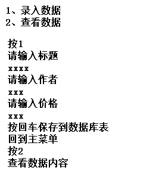

# 第1题

- 分别举例statement的execute方法、executeQuery方法、executeUpdate方法及三者区别

~~~java
String sql="...";
boolean flag=statement.execute(sql);
//execute可以执行查询的sql语句，返回值为true；也可以执行操作的sql语句，返回值为false

ResultSet rs=statement.executeQuery(sql);
//executeQuery只能执行查询的sql语句，并且返回查询得到的表数据

int i=statement.executeUpdate(sql);
//executeUpdate执行的是操作的sql语句，更改表数据返回的是受影响的行数；如果是其他操作，操作成功返回1否则返回0
~~~

# 第2题

- 创建数据库表

  ~~~ sql
  CREATE TABLE `books` (
    `id` INT(11) NOT NULL AUTO_INCREMENT PRIMARY KEY,
    `title` VARCHAR(100) NOT NULL,
    `author` VARCHAR(100) NOT NULL,
    `price` DOUBLE(11,2) NOT NULL
  ) ;
  ~~~

- 需求

  

答：

~~~java
public class Test1 {
    private static String url = "jdbc:mysql://localhost:3306/demo1?characterEncoding=utf-8";
    private static String username = "root";
    private static String password = "root";

    public static void main(String[] args) throws Exception {
        Class.forName("com.mysql.cj.jdbc.Driver");

        Connection ct = DriverManager.getConnection(url, username, password);

        Statement s = ct.createStatement();

        Scanner sc = new Scanner(System.in);

        while (true) {
            System.out.println("请输入操作的序号：1.录入数据\t2.显示所有数据\t0.退出");
            switch (sc.next()) {
                case "0":
                    return;
                case "1":
                    System.out.println("请输入标题：");
                    String title = sc.next();
                    System.out.println("请输入作者：");
                    String author = sc.next();
                    System.out.println("请输入价格：");
                    double price = Double.parseDouble(sc.next());

                    String sql =
                            "insert into books(title,author,price) values('" + title + "','" + author + "','" + price + "');";
                    int j = s.executeUpdate(sql);
                    if (j > 0) {
                        System.out.println("添加成功");
                    } else {
                        System.out.println("添加失败");
                    }
                    break;
                case "2":
                    ResultSet rs = s.executeQuery("select * from books");
                    int i = 0;
                    while (rs.next()) {
                        System.out.println(
                                ++i + ".标题：" + rs.getString(2) + "   作者：" + rs.getString(3) + "   价格:" + rs.getDouble(
                                        4));
                    }
                    break;
                default:
                    System.out.println("输入有误，请重新输入");
            }

        }
    }
}
~~~

# 第3题

- 将以下工具类，改为用ThreadLocal类，并且读取db.properties文件获取数据库url、数据库用户名、数据库存密码信息

  ~~~ java
  package com.gec.crud.utils;
  
  import java.sql.*;
  
  /*
  * 提供数据库连接对象的工具类
  *
  * ThreadLocal
  *
  * */
  public class DbUtils {
  
      public final static String URL="jdbc:mysql://localhost:3306/gecdb?serverTimezone=UTC";
      public final static String USER="root";
      public final static String PASS="1111";
  
      //定义一个Connection对象
      private static Connection connection=null;
  
      static {
          //一般在静态初始化块，将驱动加载到内存
          try {
              Class.forName("com.mysql.cj.jdbc.Driver");
          } catch (ClassNotFoundException e) {
              e.printStackTrace();
          }
      }
  
      //创建Connection对象
      public static Connection openConn() throws SQLException {
  
          //判断当前connection对象是否为空，如果为空，则创建新的Connection对象
          //如果不为空，则直接返回此对象
          if(connection==null){
              connection= DriverManager.getConnection(URL,USER,PASS);
          }
  
          return connection;
      }
  
  
      //关闭Connection对象
      public static void closeConn(Statement statement, ResultSet rs,Connection conn) throws SQLException {
  
          if(rs!=null){
              rs.close();
          }
  
          if(statement!=null){
              statement.close();
          }
  
          if(conn!=null){
              conn.close();
          }
      }
  }
  
  ~~~

  

答案：

~~~java
public class DbUtils {
    public static String URL;
    public static String USER;
    public static String PASS;

    //定义一个Connection对象
    private static ThreadLocal<Connection> threadconn = new ThreadLocal<>() {
        @Override
        protected Connection initialValue() {
            return null;
        }
    };

    static {
        //一般在静态初始化块，将驱动加载到内存
        try {
            Class.forName("com.mysql.cj.jdbc.Driver");
            Properties pp = new Properties();
            pp.load(new FileInputStream("db.properties"));
            URL = pp.getProperty("url");
            USER = pp.getProperty("username");
            PASS = pp.getProperty("password");
        } catch (ClassNotFoundException e) {
            e.printStackTrace();
        } catch (FileNotFoundException e) {
            e.printStackTrace();
        } catch (IOException e) {
            e.printStackTrace();
        }
    }

    //创建Connection对象
    public static void openConn() throws SQLException {

        //判断当前connection对象是否为空，如果为空，则创建新的Connection对象
        //如果不为空，则直接返回此对象
        if (threadconn.get() == null) {
            threadconn.set(DriverManager.getConnection(URL, USER, PASS));
        }
    }

    //关闭Connection对象
    public static void closeConn(Statement statement, ResultSet rs) throws SQLException {

        if (rs != null) {
            rs.close();
        }

        if (statement != null) {
            statement.close();
        }

        if (threadconn.get() != null) {
            threadconn.get().close();
        }
    }
}
~~~

