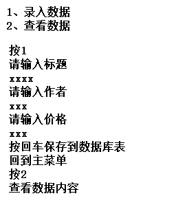
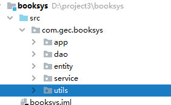

# 第1题

- 分别举例statement的execute方法、executeQuery方法、executeUpdate方法及三者区别

# 第2题

- 创建数据库表

  ~~~ sql
  CREATE TABLE `books` (
    `id` INT(11) NOT NULL AUTO_INCREMENT PRIMARY KEY,
    `title` VARCHAR(100) NOT NULL,
    `author` VARCHAR(100) NOT NULL,
    `price` DOUBLE(11,2) NOT NULL
  ) ;
  ~~~

- 需求

  

## 如何实现三层架构

### 实体类

- 根据数据库表，编写实体类

  ~~~ java
  package com.gec.booksys.entity;
  
  public class Book {
  
      private Integer id;
      private String title;
      private String author;
      private Double price;
  
      //默认构造器
      public Book() {
      }
  
      //带参构造器
      public Book(Integer id, String title, String author, Double price) {
          this.id = id;
          this.title = title;
          this.author = author;
          this.price = price;
      }
  
      public Integer getId() {
          return id;
      }
  
      public void setId(Integer id) {
          this.id = id;
      }
  
      public String getTitle() {
          return title;
      }
  
      public void setTitle(String title) {
          this.title = title;
      }
  
      public String getAuthor() {
          return author;
      }
  
      public void setAuthor(String author) {
          this.author = author;
      }
  
      public Double getPrice() {
          return price;
      }
  
      public void setPrice(Double price) {
          this.price = price;
      }
  
      @Override
      public String toString() {
          return "Book{" +
                  "id=" + id +
                  ", title='" + title + '\'' +
                  ", author='" + author + '\'' +
                  ", price=" + price +
                  '}';
      }
  }
  
  ~~~

### 数据库连接工具类

~~~ java
package com.gec.booksys.utils;

import java.sql.*;

public class DbUtils {
    public final static String URL="jdbc:mysql://localhost:3306/gecdb?serverTimezone=UTC";
    public final static String USER="root";
    public final static String PASS="1111";

    //定义一个Connection对象
    private static Connection connection=null;

    static {
        //一般在静态初始化块，将驱动加载到内存
        try {
            Class.forName("com.mysql.cj.jdbc.Driver");
        } catch (ClassNotFoundException e) {
            e.printStackTrace();
        }
    }

    //创建Connection对象
    public static Connection openConn() throws SQLException {

        System.out.println("openConn connection="+connection);
        //判断当前connection对象是否为空，如果为空，则创建新的Connection对象
        //如果不为空，则直接返回此对象
        if(connection==null){

            connection= DriverManager.getConnection(URL,USER,PASS);
        }

        return connection;
    }

    //关闭Connection对象
    public static void closeConn(Statement statement, ResultSet rs) throws SQLException {

        if(rs!=null){
            rs.close();
        }

        if(statement!=null){
            statement.close();
        }

        if(connection!=null){
            connection.close();
            connection=null;
        }
    }

}

~~~

### dao层

- 定义一个dao接口

  ~~~ java
  package com.gec.booksys.dao;
  
  import com.gec.booksys.entity.Book;
  
  import java.util.List;
  
  public interface IBookDao {
  
      //添加数据的dao方法
      public int save(Book book);
  
      //查看数据列表的dao方法
      public List<Book> query();
  }
  
  ~~~

  

- 定义一个dao实现类

  ~~~ java
  package com.gec.booksys.dao.impl;
  
  import com.gec.booksys.dao.IBookDao;
  import com.gec.booksys.entity.Book;
  import com.gec.booksys.utils.DbUtils;
  
  import java.sql.Connection;
  import java.sql.ResultSet;
  import java.sql.SQLException;
  import java.sql.Statement;
  import java.util.ArrayList;
  import java.util.List;
  
  public class BookDaoImpl implements IBookDao {
  
      @Override
      public int save(Book book) {
  
          Connection connection=null;
          Statement statement=null;
  
          //调用工具类的openConn方法，获取连接对象
          try {
              connection= DbUtils.openConn();
              //创建Statement对象，执行sql
              statement = connection.createStatement();
  
              String sql="insert into books(title,author,price) values('"+book.getTitle()+"','"+book.getAuthor()+"',"+book.getPrice()+")";
              return statement.executeUpdate(sql);
  
          } catch (SQLException e) {
              e.printStackTrace();
          }finally {
              try {
                  //关闭资源
                  DbUtils.closeConn(statement,null);
              } catch (SQLException e) {
                  e.printStackTrace();
              }
          }
  
          //如果添加失败，则返回0
          return 0;
      }
  
      @Override
      public List<Book> query() {
  
          Connection connection=null;
          Statement statement=null;
          ResultSet resultSet=null;
  
          //定义一个存储查询数据的集合，作为此方法的返回值
          List<Book> bookList=new ArrayList<>();
  
          //调用工具类的openConn方法，获取连接对象
          try {
              connection= DbUtils.openConn();
              //创建Statement对象，执行sql
              statement = connection.createStatement();
  
              String sql="select * from books";
              resultSet = statement.executeQuery(sql);
  
              while (resultSet.next()){
                  // id,title,author,price
                  int id = resultSet.getInt(1);
                  String title=resultSet.getString(2);
                  String author=resultSet.getString(3);
                  Double price=resultSet.getDouble(4);
  
                  //将上述数据组装到Book对象
                  Book book=new Book();
                  book.setId(id);
                  book.setTitle(title);
                  book.setAuthor(author);
                  book.setPrice(price);
                  bookList.add(book);
              }
  
  
          } catch (SQLException e) {
              e.printStackTrace();
          }finally {
              try {
                  //关闭资源
                  DbUtils.closeConn(statement,null);
              } catch (SQLException e) {
                  e.printStackTrace();
              }
          }
  
          return bookList;
      }
  }
  
  ~~~

### service层

- 定义一个Service接口

  ~~~ java
  package com.gec.booksys.service;
  
  import com.gec.booksys.entity.Book;
  
  import java.util.List;
  
  /*
  * 定义业务层的接口
  * */
  public interface IBookService {
  
      //返回值:true 则添加成功
      //返回值:false 则添加失败
      public boolean addSaveBook(Book book);
      public List<Book> findBookList();
  
  }
  
  ~~~

- 定义一个Service实现类

  ~~~ java
  package com.gec.booksys.service.impl;
  
  import com.gec.booksys.dao.IBookDao;
  import com.gec.booksys.dao.impl.BookDaoImpl;
  import com.gec.booksys.entity.Book;
  import com.gec.booksys.service.IBookService;
  
  import java.util.List;
  
  /*
  * 业务层的实现类
  * 1、创建Dao对象
  * */
  public class BookServiceImpl implements IBookService {
  
      private IBookDao bookDao;
  
      public BookServiceImpl(){
          //初始化BookDao对象
          bookDao=new BookDaoImpl();
      }
  
  
      @Override
      public boolean addSaveBook(Book book) {
  		//调用dao保存数据
          int flag = bookDao.save(book);
  
          if(flag>0){
              return true;
          }else
              return false;
      }
  
      @Override
      public List<Book> findBookList() {
          //调用dao获取数据
          return bookDao.query();
      }
  }
  
  ~~~

### app层

~~~ java
package com.gec.booksys.app;

import com.gec.booksys.entity.Book;
import com.gec.booksys.service.IBookService;
import com.gec.booksys.service.impl.BookServiceImpl;

import java.util.List;
import java.util.Scanner;

public class BookAppSys {

    private static Scanner scanner=new Scanner(System.in);

    //进入系统的主界面
    public void toMainMenu(){
        System.out.println("1、录入数据");
        System.out.println("2、查看数据");

        String inputNum = scanner.nextLine();

        switch (inputNum){
            case "1":
                addBook();
                break;
            case "2":
                findBookList();
                break;
        }

        toMainMenu();

    }

    /*
    * 添加数据的方法
    * */
    public void addBook(){
        System.out.println("请输入标题");
        String title = scanner.nextLine();
        System.out.println("请输入作者");
        String author = scanner.nextLine();
        System.out.println("请输入价格");
        Double price=null;
        //字符串转换成Double数据类型
        while (true){
            try {
                String strPrice = scanner.nextLine();
                price = Double.parseDouble(strPrice);
                break;
            }catch (NumberFormatException e){
                System.out.println("输入数字格式不对，请重新输入");
            }
        }

        Book book=new Book();
        book.setTitle(title);
        book.setAuthor(author);
        book.setPrice(price);

        //创建Service对象
        IBookService bookService=new BookServiceImpl();
        System.out.println(bookService.addSaveBook(book)?"数据添加成功":"数据添加失败");

    }

    public void findBookList(){
        //创建Service对象
        IBookService bookService=new BookServiceImpl();
        List<Book> bookList = bookService.findBookList();

        for (Book book : bookList) {

            System.out.println("书籍id="+book.getId()+"  书籍名="+book.getTitle()+"  作者="+book.getAuthor()+"  价格="+book.getPrice());

        }

    }

    public static void main(String[] args) {

        //进入系统主菜单
        new BookAppSys().toMainMenu();

    }
}

~~~

# 第3题

- 将以下工具类，改为用ThreadLocal类，并且读取db.properties文件获取数据库url、数据库用户名、数据库存密码信息

  ~~~ java
  package com.gec.crud.utils;
  
  import java.sql.*;
  
  /*
  * 提供数据库连接对象的工具类
  *
  * ThreadLocal
  *
  * */
  public class DbUtils {
  
      public final static String URL="jdbc:mysql://localhost:3306/gecdb?serverTimezone=UTC";
      public final static String USER="root";
      public final static String PASS="1111";
  
      //定义一个Connection对象
      private static Connection connection=null;
  
      static {
          //一般在静态初始化块，将驱动加载到内存
          try {
              Class.forName("com.mysql.cj.jdbc.Driver");
          } catch (ClassNotFoundException e) {
              e.printStackTrace();
          }
      }
  
      //创建Connection对象
      public static Connection openConn() throws SQLException {
  
          //判断当前connection对象是否为空，如果为空，则创建新的Connection对象
          //如果不为空，则直接返回此对象
          if(connection==null){
              connection= DriverManager.getConnection(URL,USER,PASS);
          }
  
          return connection;
      }
  
  
      //关闭Connection对象
      public static void closeConn(Statement statement, ResultSet rs,Connection conn) throws SQLException {
  
          if(rs!=null){
              rs.close();
          }
  
          if(statement!=null){
              statement.close();
          }
  
          if(conn!=null){
              conn.close();
          }
      }
  }
  
  ~~~

- 修改后

  ~~~ java
  package com.gec.bookinfo.utils;
  
  import java.io.FileNotFoundException;
  import java.io.IOException;
  import java.sql.*;
  import java.util.Properties;
  
  /*
  * 提供数据库连接对象的工具类
  *
  * ThreadLocal
  *
  * */
  public class DbUtils {
  
      public  static String URL="jdbc:mysql://localhost:3306/gecdb?serverTimezone=UTC";
      public  static String USER="root";
      public  static String PASS="1111";
      // 2、创建ThreadLocal对象
      private static ThreadLocal<Connection> threadLocal;
  
      //定义一个Connection对象
      private static Connection connection=null;
  
      static {
          //一般在静态初始化块，将驱动加载到内存
          try {
              Class.forName("com.mysql.cj.jdbc.Driver");
              threadLocal = new ThreadLocal<>();
  
              Properties properties=new Properties();
              properties.load(DbUtils.class.getClassLoader().getResourceAsStream("db.properties"));
              URL=properties.getProperty("URL");
              USER = properties.getProperty("USER");
              PASS=properties.getProperty("PASS");
  
  
          } catch (ClassNotFoundException e) {
              e.printStackTrace();
          } catch (FileNotFoundException e) {
              e.printStackTrace();
          } catch (IOException e) {
              e.printStackTrace();
          }
      }
  
      //创建Connection对象
      public static Connection openConn() throws SQLException {
  
          connection=threadLocal.get();
  
          //判断当前connection对象是否为空，如果为空，则创建新的Connection对象
          //如果不为空，则直接返回此对象
          if(connection==null){
              connection= DriverManager.getConnection(URL,USER,PASS);
              threadLocal.set(connection);
          }
  
          return connection;
      }
  
  
      //关闭Connection对象
      public static void closeConn(Statement statement, ResultSet rs) throws SQLException {
  
          if(rs!=null){
              rs.close();
          }
  
          if(statement!=null){
              statement.close();
          }
  
          connection=threadLocal.get();
  
          if(connection!=null){
              connection.close();
              // 将已经关闭的连接从当前线程中移除
              threadLocal.remove();
          }
      }
  }
  
  ~~~

  