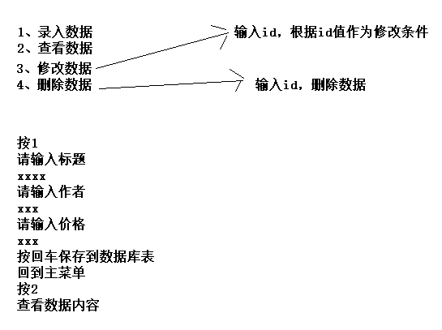

# 作业

# 第1题

- 创建数据库表

  ~~~ sql
  CREATE TABLE `books` (
    `id` INT(11) NOT NULL AUTO_INCREMENT PRIMARY KEY,
    `title` VARCHAR(100) NOT NULL,
    `author` VARCHAR(100) NOT NULL,
    `price` DOUBLE(11,2) NOT NULL
  ) ;
  ~~~

- 需求

  

- 增加修改数据、删除数据功能
  - 根据id主键作为修改及删除数据条件

- 使用改为PreparedStatement类实现
- 使用三层架构来写
- 添加事务实现

### Entity：

~~~java
public class Books {
    private String title;
    private String author;
    private double price;

    public Books(String title, String author, double price) {
        this.title = title;
        this.author = author;
        this.price = price;
    }

    public Books() {
    }

    public String getTitle() {
        return title;
    }

    public void setTitle(String title) {
        this.title = title;
    }

    public String getAuthor() {
        return author;
    }

    public void setAuthor(String author) {
        this.author = author;
    }

    public double getPrice() {
        return price;
    }

    public void setPrice(double price) {
        this.price = price;
    }
}
~~~

### Utils：

~~~java
public class JDBCUtil {

    //一些固定的、要便于访问数据就设定成全局变量，并且是静态的
    static String url = "jdbc:mysql://localhost:3306/demo1?";
    static String username = "root";
    static String password = "root";
    static Connection ct = null;
    static PreparedStatement ps = null;
    static ResultSet rs = null;

    //加载驱动，驱动只需加载一次，所以放在静态代码块
    static {
        //利用反射加载驱动
        try {
            Class.forName("com.mysql.cj.jdbc.Driver");
        } catch (ClassNotFoundException e) {
            e.printStackTrace();
        }
    }

    //连接数据库的对象每次使用都要获取
    //封装一个方法，获取连接对象
    public static void getConnection() {
        try {
            ct = DriverManager.getConnection(url, username, password);
        } catch (SQLException throwables) {
            throwables.printStackTrace();
        }
    }

    //封装一个方法，用于增删改
    //1.由于不知道占位符有几个，所以应该使用可变参数；而占位符的每一个数据也不确定是什么类型的，所以使用Object接收
    public static int executeUpdate(String sql, Object... o) {
        try {
            getConnection();
            ps = ct.prepareStatement(sql);
            if (o != null) {
                for (int i = 0; i < o.length; i++) {
                    ps.setObject(i + 1, o[i]);
                }
            }
            return ps.executeUpdate();
        } catch (SQLException throwables) {
            throwables.printStackTrace();
        } finally {
            close();
        }
        return 0;
    }

    //封装一个方法，用于查询
    //因为不知道查询的数据用来干嘛，所以直接将得到的数据返回
    public static ResultSet executeQuery(String sql, Object... o) {
        getConnection();
        try {
            ps = ct.prepareStatement(sql);
            if (o != null) {
                for (int i = 0; i < o.length; i++) {
                    ps.setObject(i + 1, o[i]);
                }
            }
            return ps.executeQuery();
        } catch (SQLException throwables) {
            throwables.printStackTrace();
        }
        //不能再这里关闭资源，因为关闭资源后，返回去的数据就用不了了。
        //所以单独封装一个方法关闭资源
        return null;
    }

    //封装一个用于关闭增删改的资源的方法
    private static void close() {
        try {
            if (ps != null) {
                ps.close();
            }
            if (ct != null) {
                ct.close();
            }
        } catch (SQLException throwables) {
            throwables.printStackTrace();
        }
    }

    //封装一个方法，用于关闭查询的资源的方法
    public static void close(ResultSet rs) {
        if (rs != null) {
            try {
                close();
                rs.close();
            } catch (SQLException throwables) {
                throwables.printStackTrace();
            }
        }
    }
}
~~~

### view：

~~~java
标题：" + rs.getString(2) + "   作者：" + rs.getString(3) + "   价格:" + rs.getDouble(
                                        4));
                    }
                    break;
                case "3":
                    int k = bs.updateBook();
                    if (k > 0) {
                        System.out.println("修改成功");
                    } else {
                        System.out.println("修改失败");
                    }
                    break;
                case "4":
                    int l = bs.deleteBook();
                    if (l > 0) {
                        System.out.println("删除成功");
                    } else {
                        System.out.println("删除失败");
                    }
                    break;
                default:
                    System.out.println("输入有误，请重新输入");
            }

        }
    }
}
~~~

### Service：

#### 接口：

~~~java
public interface BookService {
    int addBooks();

    ResultSet queryAll();

    int updateBook();

    int deleteBook();
}
~~~

#### 实现类：

~~~java
public class BookServiceImpl implements BookService {
    private static Scanner sc = new Scanner(System.in);

    private static bookDao bd = new bookDaoImpl();

    @Override
    public ResultSet queryAll() {
        return bd.queryAll();
    }

    @Override
    public int deleteBook() {
        System.out.println("请输入要删除的书的id：");
        int id = sc.nextInt();
        return bd.deleteBook(id);
    }

    @Override
    public int updateBook() {
        System.out.println("请输入要修改的书的id：");
        int id = sc.nextInt();
        System.out.println("请输入标题：");
        String title = sc.next();
        System.out.println("请输入作者：");
        String author = sc.next();
        System.out.println("请输入价格：");
        double price = Double.parseDouble(sc.next());

        return bd.updateBook(new Books(title, author, price), id);
    }

    @Override
    public int addBooks() {
        System.out.println("请输入标题：");
        String title = sc.next();
        System.out.println("请输入作者：");
        String author = sc.next();
        System.out.println("请输入价格：");
        double price = Double.parseDouble(sc.next());

        return bd.addBooks(new Books(title, author, price));

    }
}
~~~

### Dao：

#### 接口：

~~~java
public interface bookDao {
    int addBooks(Books book);

    ResultSet queryAll();

    int updateBook(Books books, int id);

    int deleteBook(int id);
}
~~~

#### 实现类：

~~~java
public class bookDaoImpl implements bookDao {
    @Override
    public int addBooks(Books book) {
        String sql = "insert into books(title,author,price) values(?,?,?)";
        return JDBCUtil.executeUpdate(sql, book.getTitle(), book.getAuthor(), book.getPrice());
    }

    @Override
    public int deleteBook(int id) {
        String sql = "delete from books where id=?";
        return JDBCUtil.executeUpdate(sql, id);
    }

    @Override
    public int updateBook(Books books, int id) {
        String sql = "update books set title=?,author=?,price=? where id=?";
        return JDBCUtil.executeUpdate(sql, books.getTitle(), books.getAuthor(), books.getPrice(), id);
    }

    @Override
    public ResultSet queryAll() {
        String sql = "select * from books";
        return JDBCUtil.executeQuery(sql);
    }
}
~~~

